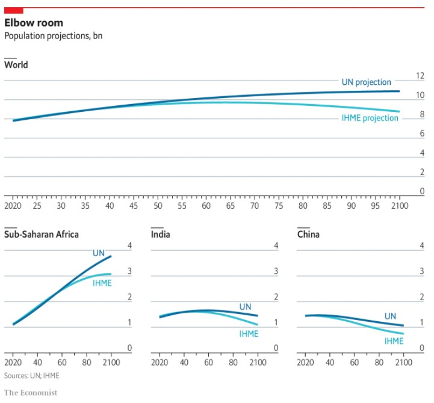
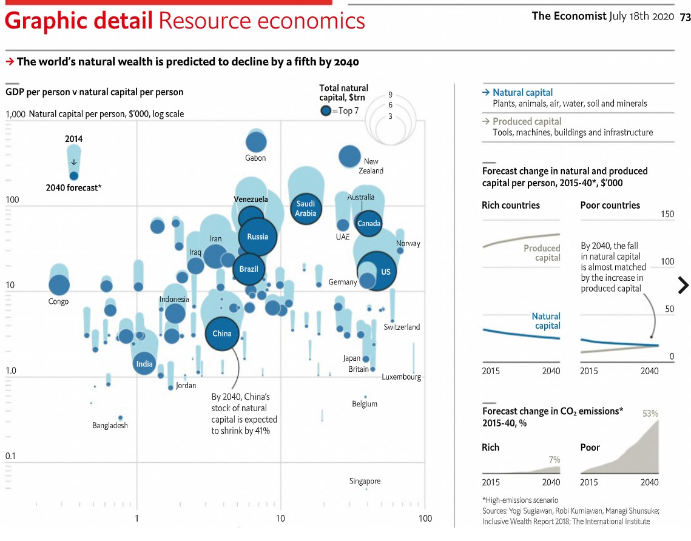
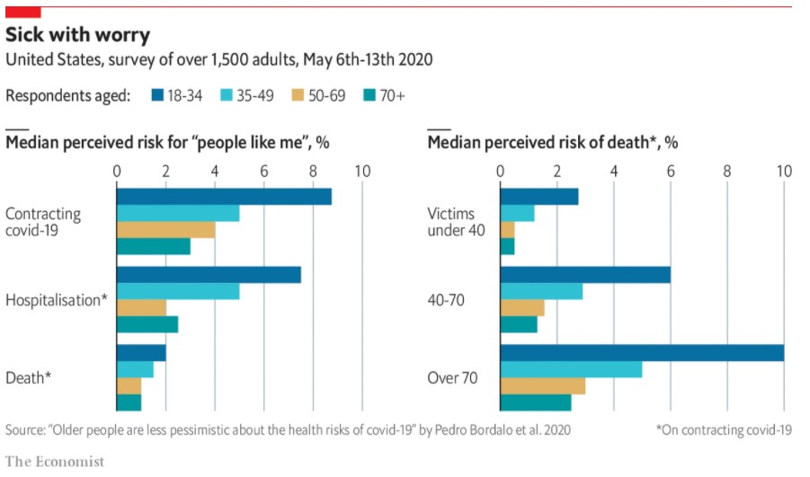
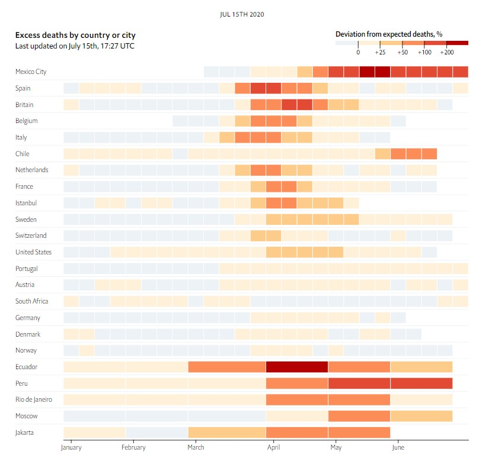
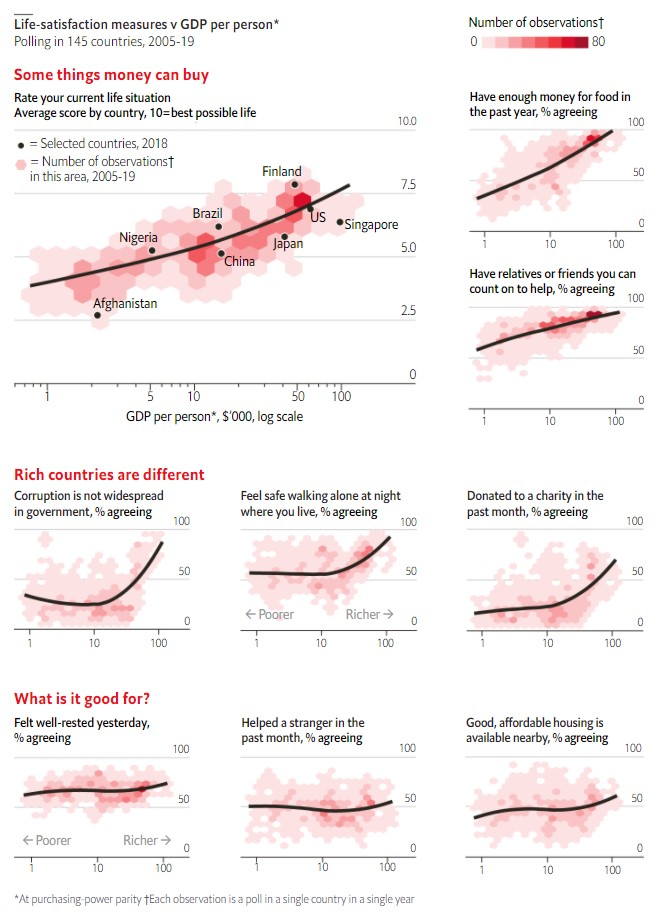
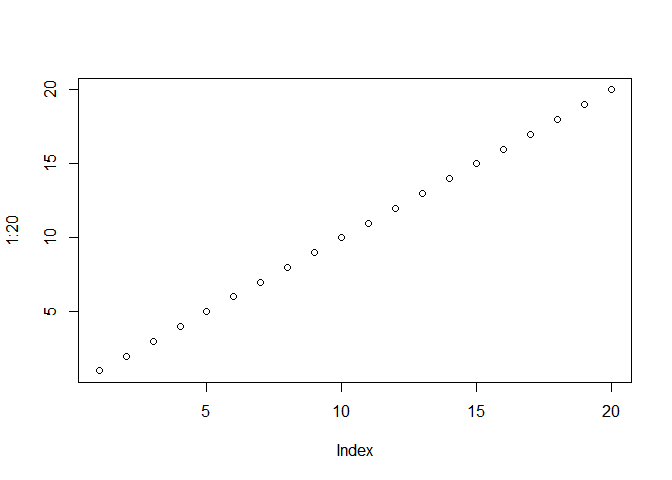

<br/><br/> 

# _________________________________
# Example 1



### Two new forecasts describing the world’s population through the year 2100.

#### [Link to Article.](https://www.economist.com/graphic-detail/2020/07/17/a-new-forecast-says-the-worlds-population-will-peak-at-97bn-in-2064)

UN vs IHME estimates for the world’s population through the year 2100.  Good color scheme makes it easy to differentiate between the two estimates.  Nice subset breakouts for Sub-Sahara, India, and Chine, since they are the biggest contributors.  Problems with axis labels: Would be nice to have the “bn” for billion over in the right axis closer to the numbers.  Would be nice to put “year” on the x-axis. 

<br/><br/> 

# _________________________________
# Example 2



### Most countries will have less natural capital; i.e., natural resources in 2040.

#### [Link to Article.](https://www.economist.com/graphic-detail/2020/07/18/the-worlds-wealth-is-looking-increasingly-unnatural)

Most countries will have less natural capital (natural resources) in 2040 than they do in 2014.  Good color scheme helps read the chart, once you understand how it works.  Chart packs a lot of information in and describes a complex issue: Natural Capital vs Personal Capital in 2014 vs 2040.  Problems with the key; i.e., the thumbnail that teaches you how to read the chart.  Part of it is in top-left, part is in top-right.  Makes it harder to understand an already complex chart.  X-axis isn’t intended to show change in GDP from 2014 to 2040, just the status quo in 2014.

<br/><br/> 

# _________________________________
# Example 3



### Young people are more worried about the coronavirus than elderly.

#### [Link to Article.](https://www.economist.com/graphic-detail/2020/07/21/young-people-see-covid-19-as-a-bigger-threat-than-their-elders-do)
Young people are more worried about the coronavirus than elderly.  Good color scheme distinguished between the 4 age brackets.  Nice that it uses the median, there must be some skewed data.  Problem: It’s not readily apparent that the right panel of 3 barcharts are subsets of the lower-left “Death” barchart.  Would be nice to show that subsetting.  It’s hard to describe the bottomline in words.

<br/><br/> 

# _________________________________
# Example 4



### Calendar for each country that shows when the coronavirus hit hardest.

#### [Link to Article.](https://www.economist.com/graphic-detail/2020/07/15/tracking-covid-19-excess-deaths-across-countries)
Calendar for each country that shows when the coronavirus hit hardest by showing a timescaled track of excess deaths from any cause.  Great visual synopsis that makes the point quickly.  Easy to compare one country to another.  Color scale is useful for describing magnitude and duration.  Use of hover&pop-ups is handy.  Problem:  Vertical gridlines would help interpret the dates for each box.

<br/><br/> 

# _________________________________
# Example 5



### Countries with higher GDP per person have higher life-satisfaction.

#### [Link to Article.](https://www.economist.com/graphic-detail/2020/07/11/money-really-can-buy-happiness-and-recessions-can-take-it-away)
Countries with higher GDP per person have higher life-satisfaction.  The hex-grid is clever.  The red-scale is a clear visual description of the third dimension (number of observations).  Nice arrangement of thumbnails into category areas.  Problem:  The lines of best fit are heroic assumptions.   Their R-squared’s are probably pretty low.   

<br/><br/> 


```r
plot(1:20)
```

<!-- -->


