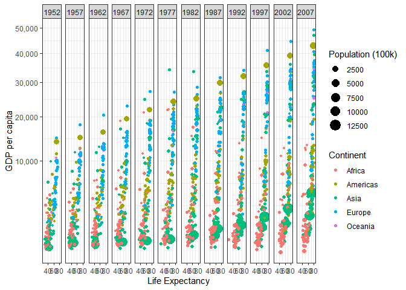
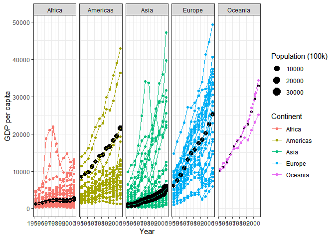

___________________________________ 
___________________________________ 


## 1. **BACKGROUND** : Things I Learned While Making These Plots
___________________________________ 

### A. During Data Manipulation/Transformation:
* First: Load packages, Inspect the data, Transform the data, Inspect it one last time.
* tidyverse and dplyr are alreay installed, just need to load them.
  + tidyverse is for ggplot2
  + dplyr is for transforming/manipulating data.
* Need to install, then load gapminder, 
* Use ?gapminder to find out more about it.  But, in RMD, don't put "?anything" or "View anything"in a code chunk because when you knit, it tries to open a browser window.
* In RMD, if you want to insert a code chunk in the middle of some text comments copied over from Rscript, you have to create a blank line and sit the cursor on the blank line, and ctrl+alt+I 
* It's interesting to compare the **before and after dataframe** structures:
  + **gapminder** has these stats: 
      - 1,704 rows, 
      - 6 columns, 
      - 142 countries, 
      - 5 continents, 
      - first pop figure is 8425333 .
  + **dfa** (the working file, after transformation/manipulation) has these stats: 
      - 1,692 rows, 
      - 6 columns, 
      - 142 countries, 
      - 5 continents, 
      - first pop figure is 84.3 . 
  + Interesting, the number of rows is lower (1704 to 1692) because of Kuwait removed. But the number of levels (countries) is the same at 142.  pop now has smaller numbers because of mutate (divide by 100,000)
* Caution: ***MUTATE*** overwrites the variable if you use the same variable name on both sides of the equal sign.
* Be careful about cut/paste of code with quote marks from word.doc or a browser into R-script.  You'll probably have to retype the quote marks.


### B. During Plot-making:
* In geom-point and geom-line,  group=country is like series=country in Excel
* For commas in large numbers in the x and y scales, use scale_y_continuous(labels=scales::comma)
* Plot 2 uses two dataframes on the same ggplot.  see:
  + https://stackoverflow.com/questions/27003562/plotting-two-different-data-frames-on-same-figure-in-ggplot2
* ggsave saves to the project folder, overwrites without asking.  
  + If you want ggsave to save somewhere else, give it the path, like:
    - ggsave("E:/000 DTS 350 Data Visualization/2Case Study/CS2Plot1.png", width = 15, units = "in")
    
    
___________________________________ 
___________________________________ 


## 2. **IMAGES**
___________________________________ 

### A. GDP per capita x Life Expectancy, 
#### with:  Group(series) by Country, Faceted by Year, Sized by Population, Color by Continent


```r
#tidyverse and dplyr are alreay installed, just need to load
library(tidyverse) # for ggplot2
```

```
## -- Attaching packages ---------------------------------------------------------------------------------------------------------------------- tidyverse 1.3.0 --
```

```
## v ggplot2 3.3.2     v purrr   0.3.4
## v tibble  3.0.3     v dplyr   1.0.0
## v tidyr   1.1.0     v stringr 1.4.0
## v readr   1.3.1     v forcats 0.5.0
```

```
## -- Conflicts ------------------------------------------------------------------------------------------------------------------------- tidyverse_conflicts() --
## x dplyr::filter() masks stats::filter()
## x dplyr::lag()    masks stats::lag()
```

```r
library(dplyr) # for getting data frame the way we want it
#install, then load gapminder
library(gapminder)
#  ?gapminder
str(gapminder)
```

```
## tibble [1,704 x 6] (S3: tbl_df/tbl/data.frame)
##  $ country  : Factor w/ 142 levels "Afghanistan",..: 1 1 1 1 1 1 1 1 1 1 ...
##  $ continent: Factor w/ 5 levels "Africa","Americas",..: 3 3 3 3 3 3 3 3 3 3 ...
##  $ year     : int [1:1704] 1952 1957 1962 1967 1972 1977 1982 1987 1992 1997 ...
##  $ lifeExp  : num [1:1704] 28.8 30.3 32 34 36.1 ...
##  $ pop      : int [1:1704] 8425333 9240934 10267083 11537966 13079460 14880372 12881816 13867957 16317921 22227415 ...
##  $ gdpPercap: num [1:1704] 779 821 853 836 740 ...
```

```r
#tibble [1,704 x 6] (S3: tbl_df/tbl/data.frame)
#$ country  : Factor w/ 142 levels "Afghanistan",..: 1 1 1 1 1 1 1 1 1 1 ...
#$ continent: Factor w/ 5 levels "Africa","Americas",..: 3 3 3 3 3 3 3 3 3 3 ...
#$ year     : int [1:1704] 1952 1957 1962 1967 1972 1977 1982 1987 1992 1997 ...
#$ lifeExp  : num [1:1704] 28.8 30.3 32 34 36.1 ...
#$ pop      : int [1:1704] 8425333 9240934 10267083 11537966 13079460 14880372 12881816 13867957 16317921 22227415 ...
#$ gdpPercap: num [1:1704] 779 821 853 836 740 ...
a <- gapminder
#Find and inspect Kuwait before deleting its row.
(filter(a, country == "Kuwait"))   #12 rows equal to Kuwait
```

```
## # A tibble: 12 x 6
##    country continent  year lifeExp     pop gdpPercap
##    <fct>   <fct>     <int>   <dbl>   <int>     <dbl>
##  1 Kuwait  Asia       1952    55.6  160000   108382.
##  2 Kuwait  Asia       1957    58.0  212846   113523.
##  3 Kuwait  Asia       1962    60.5  358266    95458.
##  4 Kuwait  Asia       1967    64.6  575003    80895.
##  5 Kuwait  Asia       1972    67.7  841934   109348.
##  6 Kuwait  Asia       1977    69.3 1140357    59265.
##  7 Kuwait  Asia       1982    71.3 1497494    31354.
##  8 Kuwait  Asia       1987    74.2 1891487    28118.
##  9 Kuwait  Asia       1992    75.2 1418095    34933.
## 10 Kuwait  Asia       1997    76.2 1765345    40301.
## 11 Kuwait  Asia       2002    76.9 2111561    35110.
## 12 Kuwait  Asia       2007    77.6 2505559    47307.
```

```r
(filter(gapminder, country != "Kuwait"))    #1692 rows without not equal to Kuwait
```

```
## # A tibble: 1,692 x 6
##    country     continent  year lifeExp      pop gdpPercap
##    <fct>       <fct>     <int>   <dbl>    <int>     <dbl>
##  1 Afghanistan Asia       1952    28.8  8425333      779.
##  2 Afghanistan Asia       1957    30.3  9240934      821.
##  3 Afghanistan Asia       1962    32.0 10267083      853.
##  4 Afghanistan Asia       1967    34.0 11537966      836.
##  5 Afghanistan Asia       1972    36.1 13079460      740.
##  6 Afghanistan Asia       1977    38.4 14880372      786.
##  7 Afghanistan Asia       1982    39.9 12881816      978.
##  8 Afghanistan Asia       1987    40.8 13867957      852.
##  9 Afghanistan Asia       1992    41.7 16317921      649.
## 10 Afghanistan Asia       1997    41.8 22227415      635.
## # ... with 1,682 more rows
```

```r
dfa <- filter(gapminder, country != "Kuwait")
#change population figures to "per 100,000k by dividing by 100000
#caution: mutate overwrites the variable if you use the same variable name on both sides of the equal sign.
dfa <- mutate(dfa, pop = pop/100000) 
#Inspect data one more time
str(dfa)
```

```
## tibble [1,692 x 6] (S3: tbl_df/tbl/data.frame)
##  $ country  : Factor w/ 142 levels "Afghanistan",..: 1 1 1 1 1 1 1 1 1 1 ...
##  $ continent: Factor w/ 5 levels "Africa","Americas",..: 3 3 3 3 3 3 3 3 3 3 ...
##  $ year     : int [1:1692] 1952 1957 1962 1967 1972 1977 1982 1987 1992 1997 ...
##  $ lifeExp  : num [1:1692] 28.8 30.3 32 34 36.1 ...
##  $ pop      : num [1:1692] 84.3 92.4 102.7 115.4 130.8 ...
##  $ gdpPercap: num [1:1692] 779 821 853 836 740 ...
```

```r
#tibble [1,692 x 6] (S3: tbl_df/tbl/data.frame)
#$ country  : Factor w/ 142 levels "Afghanistan",..: 1 1 1 1 1 1 1 1 1 1 ...
#$ continent: Factor w/ 5 levels "Africa","Americas",..: 3 3 3 3 3 3 3 3 3 3 ...
#$ year     : int [1:1692] 1952 1957 1962 1967 1972 1977 1982 1987 1992 1997 ...
#$ lifeExp  : num [1:1692] 28.8 30.3 32 34 36.1 ...
#$ pop      : num [1:1692] 84.3 92.4 102.7 115.4 130.8 ...
#$ gdpPercap: num [1:1692] 779 821 853 836 740 ...
#Interesting, the number of rows is lower (1704 to 1692) because of Kuwait removed.
#But the number of levels (countries) is the same at 142.
#pop now has smaller numbers because of mutate (divide by 100,000)

#dfa (Gapminder sans Kuwait, and with pop100k) is now ready for use in plotting

ggplot(dfa) + 
  geom_point(mapping = aes(x = lifeExp, y = gdpPercap, color=continent, size = pop)) +
  facet_grid(cols = vars(year)) +  
  scale_y_continuous(trans = "sqrt", labels = scales::comma, "GDP per capita") +    #be careful about cut/paste of quote marks
  scale_x_continuous("Life Expectancy") +
  scale_size_continuous("Population (100k)") +
  scale_color_discrete("Continent") +
  theme_bw()
```

<!-- -->

```r
ggsave("CS1Plot2.png", width = 15, units = "in")  #saves to the project folder, overwrites without asking  
```

```
## Saving 15 x 5 in image
```


___________________________________

### B. GDP per capita x Year, 
#### with: Group(series) by Country, Faceted by Continent, Color by Continent.  Overlayed with Weighted-GDP per capita for each continent x Year, Sized by Population, Color = Black

```r
#first, need to create wtd average for each continent.
graphAdata <- group_by(dfa, year, continent)
graph2data <- (summarize(graphAdata, wtgdp = weighted.mean(gdpPercap, pop, na.rm = TRUE), contsumpop = sum(pop, na.rm = TRUE)))
```

```
## `summarise()` regrouping output by 'year' (override with `.groups` argument)
```

```r
# this gets a warning:  "`summarise()` regrouping output by 'year' (override with `.groups` argument)
graph2data
```

```
## # A tibble: 60 x 4
## # Groups:   year [12]
##     year continent  wtgdp contsumpop
##    <int> <fct>      <dbl>      <dbl>
##  1  1952 Africa     1311.      2376.
##  2  1952 Americas   8528.      3452.
##  3  1952 Asia        794.     13952.
##  4  1952 Europe     6097.      4181.
##  5  1952 Oceania   10136.       107.
##  6  1957 Africa     1445.      2648.
##  7  1957 Americas   9098.      3870.
##  8  1957 Asia        983.     15626.
##  9  1957 Europe     7535.      4379.
## 10  1957 Oceania   11192.       119.
## # ... with 50 more rows
```

```r
#View(graph2data)


ggplot() +
  geom_point(data = dfa, mapping = aes(x = year, y = gdpPercap, group = country, color=continent)) +  #group=country is like series=country in Excel
  geom_line(data = dfa, mapping = aes(x = year, y = gdpPercap, group = country, color=continent)) +
  geom_point(data = graph2data, mapping = aes(x = year, y = wtgdp, size = contsumpop),color = "black") +
  geom_line(data = graph2data, mapping = aes(x = year, y = wtgdp, color=continent)) +
  facet_grid(cols = vars(continent)) +  
  scale_x_continuous("Year") +
  scale_size_continuous("Population (100k)") +
  scale_y_continuous("GDP per capita") +
  scale_color_discrete("Continent") +
  theme_bw()
```

<!-- -->

```r
ggsave("CS2Plot2.png", width = 15, units = "in")  #saves to the project folder, overwrites without asking
```

```
## Saving 15 x 5 in image
```

```r
#ggsave("E:/000 DTS 350 Data Visualization/2Case Study/CS2Plot1.png", width = 15, units = "in")
```


