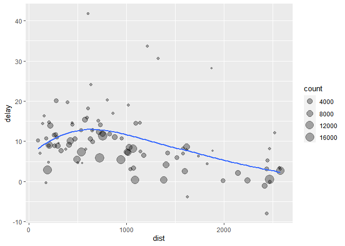

## ***Notes from Textbook Chap 5 : Data transformation***
how to use the dplyr package

### Types of **Variables**
int stands for integers.
dbl stands for doubles, or real numbers.
chr stands for character vectors, or strings.
dttm stands for date-times (a date + a time).
lgl stands for logical, vectors that contain only TRUE or FALSE.
fctr stands for factors, which R uses to represent categorical variables with fixed possible values.
date stands for dates.
 
### Five key **dplyr Functions** (Verbs) that allow you to solve the vast majority of your data manipulation challenges:
* Pick observations by their values (filter()).
* Reorder the rows (arrange()).
* Pick variables by their names (select()).
* Create new variables with functions of existing variables (mutate()).
* Collapse many values down to a single summary (summarise()).

* and in conjunction with group_by()

### Syntax  

All verbs work similarly:
The first argument is a data frame.
The subsequent arguments describe what to do with the data frame, using the variable names (without quotes).
The result is a new data frame.

### 5.2 Filter  


Extract according to conditions

```r
library(nycflights13)
library(tidyverse)
```

```
## -- Attaching packages ------------------------------------------------------------------------------ tidyverse 1.3.0 --
```

```
## v ggplot2 3.3.2     v purrr   0.3.4
## v tibble  3.0.3     v dplyr   1.0.0
## v tidyr   1.1.0     v stringr 1.4.0
## v readr   1.3.1     v forcats 0.5.0
```

```
## -- Conflicts --------------------------------------------------------------------------------- tidyverse_conflicts() --
## x dplyr::filter() masks stats::filter()
## x dplyr::lag()    masks stats::lag()
```

```r
flights
```

```
## # A tibble: 336,776 x 19
##     year month   day dep_time sched_dep_time dep_delay arr_time sched_arr_time
##    <int> <int> <int>    <int>          <int>     <dbl>    <int>          <int>
##  1  2013     1     1      517            515         2      830            819
##  2  2013     1     1      533            529         4      850            830
##  3  2013     1     1      542            540         2      923            850
##  4  2013     1     1      544            545        -1     1004           1022
##  5  2013     1     1      554            600        -6      812            837
##  6  2013     1     1      554            558        -4      740            728
##  7  2013     1     1      555            600        -5      913            854
##  8  2013     1     1      557            600        -3      709            723
##  9  2013     1     1      557            600        -3      838            846
## 10  2013     1     1      558            600        -2      753            745
## # ... with 336,766 more rows, and 11 more variables: arr_delay <dbl>,
## #   carrier <chr>, flight <int>, tailnum <chr>, origin <chr>, dest <chr>,
## #   air_time <dbl>, distance <dbl>, hour <dbl>, minute <dbl>, time_hour <dttm>
```

```r
filter(flights, month == 1, day == 1)
```

```
## # A tibble: 842 x 19
##     year month   day dep_time sched_dep_time dep_delay arr_time sched_arr_time
##    <int> <int> <int>    <int>          <int>     <dbl>    <int>          <int>
##  1  2013     1     1      517            515         2      830            819
##  2  2013     1     1      533            529         4      850            830
##  3  2013     1     1      542            540         2      923            850
##  4  2013     1     1      544            545        -1     1004           1022
##  5  2013     1     1      554            600        -6      812            837
##  6  2013     1     1      554            558        -4      740            728
##  7  2013     1     1      555            600        -5      913            854
##  8  2013     1     1      557            600        -3      709            723
##  9  2013     1     1      557            600        -3      838            846
## 10  2013     1     1      558            600        -2      753            745
## # ... with 832 more rows, and 11 more variables: arr_delay <dbl>,
## #   carrier <chr>, flight <int>, tailnum <chr>, origin <chr>, dest <chr>,
## #   air_time <dbl>, distance <dbl>, hour <dbl>, minute <dbl>, time_hour <dttm>
```

Save results as a dataframe

```r
jan1 <- filter(flights, month == 1, day == 1)
```

Parenthesis saves and displays.

```r
(dec25 <- filter(flights, month == 12, day == 25))
```

```
## # A tibble: 719 x 19
##     year month   day dep_time sched_dep_time dep_delay arr_time sched_arr_time
##    <int> <int> <int>    <int>          <int>     <dbl>    <int>          <int>
##  1  2013    12    25      456            500        -4      649            651
##  2  2013    12    25      524            515         9      805            814
##  3  2013    12    25      542            540         2      832            850
##  4  2013    12    25      546            550        -4     1022           1027
##  5  2013    12    25      556            600        -4      730            745
##  6  2013    12    25      557            600        -3      743            752
##  7  2013    12    25      557            600        -3      818            831
##  8  2013    12    25      559            600        -1      855            856
##  9  2013    12    25      559            600        -1      849            855
## 10  2013    12    25      600            600         0      850            846
## # ... with 709 more rows, and 11 more variables: arr_delay <dbl>,
## #   carrier <chr>, flight <int>, tailnum <chr>, origin <chr>, dest <chr>,
## #   air_time <dbl>, distance <dbl>, hour <dbl>, minute <dbl>, time_hour <dttm>
```

#### 5.2.1 COMPARISONS
the standard suite: >, >=, <, <=, != (not equal), and == (equal).

Common mistakes
filter(flights, month = 1)    not using == two equal signs
sqrt(2) ^ 2 == 2   finite precision causes a FALSE result
instead use near()


```r
near(sqrt(2) ^ 2,  2)
```

```
## [1] TRUE
```

```r
#> [1] TRUE
near(1 / 49 * 49, 1)
```

```
## [1] TRUE
```

```r
#> [1] TRUE
```

#### 5.2.2 LOGICAL OPERATORS

#### Figure 5.1: Complete set of boolean operations.

x is the left-hand circle, y is the right-hand circle, and the shaded region show which parts each operator selects.

& = and
| = or
! = not


```r
nov_dec <- filter(flights, month %in% c(11, 12))
```

#### De Morgan’s law: !(x & y) is the same as !x | !y, and !(x | y) is the same as !x & !y

```r
filter(flights, !(arr_delay > 120 | dep_delay > 120))
```

```
## # A tibble: 316,050 x 19
##     year month   day dep_time sched_dep_time dep_delay arr_time sched_arr_time
##    <int> <int> <int>    <int>          <int>     <dbl>    <int>          <int>
##  1  2013     1     1      517            515         2      830            819
##  2  2013     1     1      533            529         4      850            830
##  3  2013     1     1      542            540         2      923            850
##  4  2013     1     1      544            545        -1     1004           1022
##  5  2013     1     1      554            600        -6      812            837
##  6  2013     1     1      554            558        -4      740            728
##  7  2013     1     1      555            600        -5      913            854
##  8  2013     1     1      557            600        -3      709            723
##  9  2013     1     1      557            600        -3      838            846
## 10  2013     1     1      558            600        -2      753            745
## # ... with 316,040 more rows, and 11 more variables: arr_delay <dbl>,
## #   carrier <chr>, flight <int>, tailnum <chr>, origin <chr>, dest <chr>,
## #   air_time <dbl>, distance <dbl>, hour <dbl>, minute <dbl>, time_hour <dttm>
```

```r
filter(flights, arr_delay <= 120, dep_delay <= 120)
```

```
## # A tibble: 316,050 x 19
##     year month   day dep_time sched_dep_time dep_delay arr_time sched_arr_time
##    <int> <int> <int>    <int>          <int>     <dbl>    <int>          <int>
##  1  2013     1     1      517            515         2      830            819
##  2  2013     1     1      533            529         4      850            830
##  3  2013     1     1      542            540         2      923            850
##  4  2013     1     1      544            545        -1     1004           1022
##  5  2013     1     1      554            600        -6      812            837
##  6  2013     1     1      554            558        -4      740            728
##  7  2013     1     1      555            600        -5      913            854
##  8  2013     1     1      557            600        -3      709            723
##  9  2013     1     1      557            600        -3      838            846
## 10  2013     1     1      558            600        -2      753            745
## # ... with 316,040 more rows, and 11 more variables: arr_delay <dbl>,
## #   carrier <chr>, flight <int>, tailnum <chr>, origin <chr>, dest <chr>,
## #   air_time <dbl>, distance <dbl>, hour <dbl>, minute <dbl>, time_hour <dttm>
```

#### 5.2.3Missing values, or NAs 


```r
NA > 5
```

```
## [1] NA
```

```r
#> [1] NA
10 == NA
```

```
## [1] NA
```

```r
#> [1] NA
NA + 10
```

```
## [1] NA
```

```r
#> [1] NA
NA / 2
```

```
## [1] NA
```

```r
#> [1] NA
NA == NA
```

```
## [1] NA
```

```r
#> [1] NA
```

determine if a value is missing, use is.na():

```r
'is.na(x)'
```

```
## [1] "is.na(x)"
```

```r
#> [1] TRUE
```

filter() only includes rows where the condition is TRUE; it excludes both FALSE and NA


between(x, left, right)
shortcut for x >= left & x <= right,

```r
between(1:12, 7, 9)
```

```
##  [1] FALSE FALSE FALSE FALSE FALSE FALSE  TRUE  TRUE  TRUE FALSE FALSE FALSE
```


### 5.3   Arrange rows with arrange(dataframe, sort col1, sortcol2, sort col3)
arrange :  Sorts dataframe by columns left to right

```r
arrange(flights, year, month, day)
```

```
## # A tibble: 336,776 x 19
##     year month   day dep_time sched_dep_time dep_delay arr_time sched_arr_time
##    <int> <int> <int>    <int>          <int>     <dbl>    <int>          <int>
##  1  2013     1     1      517            515         2      830            819
##  2  2013     1     1      533            529         4      850            830
##  3  2013     1     1      542            540         2      923            850
##  4  2013     1     1      544            545        -1     1004           1022
##  5  2013     1     1      554            600        -6      812            837
##  6  2013     1     1      554            558        -4      740            728
##  7  2013     1     1      555            600        -5      913            854
##  8  2013     1     1      557            600        -3      709            723
##  9  2013     1     1      557            600        -3      838            846
## 10  2013     1     1      558            600        -2      753            745
## # ... with 336,766 more rows, and 11 more variables: arr_delay <dbl>,
## #   carrier <chr>, flight <int>, tailnum <chr>, origin <chr>, dest <chr>,
## #   air_time <dbl>, distance <dbl>, hour <dbl>, minute <dbl>, time_hour <dttm>
```


desc  :  Sort by column (dep_delay) in descending order

```r
arrange(flights, desc(dep_delay))
```

```
## # A tibble: 336,776 x 19
##     year month   day dep_time sched_dep_time dep_delay arr_time sched_arr_time
##    <int> <int> <int>    <int>          <int>     <dbl>    <int>          <int>
##  1  2013     1     9      641            900      1301     1242           1530
##  2  2013     6    15     1432           1935      1137     1607           2120
##  3  2013     1    10     1121           1635      1126     1239           1810
##  4  2013     9    20     1139           1845      1014     1457           2210
##  5  2013     7    22      845           1600      1005     1044           1815
##  6  2013     4    10     1100           1900       960     1342           2211
##  7  2013     3    17     2321            810       911      135           1020
##  8  2013     6    27      959           1900       899     1236           2226
##  9  2013     7    22     2257            759       898      121           1026
## 10  2013    12     5      756           1700       896     1058           2020
## # ... with 336,766 more rows, and 11 more variables: arr_delay <dbl>,
## #   carrier <chr>, flight <int>, tailnum <chr>, origin <chr>, dest <chr>,
## #   air_time <dbl>, distance <dbl>, hour <dbl>, minute <dbl>, time_hour <dttm>
```

Missing values NA's are always sorted at the end, whether an ascending or descending sort

### 5.4 Select columns with select()
Extract certain columns

```r
# Select columns by name
select(flights, year, month, day)
```

```
## # A tibble: 336,776 x 3
##     year month   day
##    <int> <int> <int>
##  1  2013     1     1
##  2  2013     1     1
##  3  2013     1     1
##  4  2013     1     1
##  5  2013     1     1
##  6  2013     1     1
##  7  2013     1     1
##  8  2013     1     1
##  9  2013     1     1
## 10  2013     1     1
## # ... with 336,766 more rows
```

```r
# Select all columns between year and day (inclusive)
select(flights, year:day)
```

```
## # A tibble: 336,776 x 3
##     year month   day
##    <int> <int> <int>
##  1  2013     1     1
##  2  2013     1     1
##  3  2013     1     1
##  4  2013     1     1
##  5  2013     1     1
##  6  2013     1     1
##  7  2013     1     1
##  8  2013     1     1
##  9  2013     1     1
## 10  2013     1     1
## # ... with 336,766 more rows
```

```r
# Select all columns except those from year to day (inclusive)
select(flights, -(year:day))
```

```
## # A tibble: 336,776 x 16
##    dep_time sched_dep_time dep_delay arr_time sched_arr_time arr_delay carrier
##       <int>          <int>     <dbl>    <int>          <int>     <dbl> <chr>  
##  1      517            515         2      830            819        11 UA     
##  2      533            529         4      850            830        20 UA     
##  3      542            540         2      923            850        33 AA     
##  4      544            545        -1     1004           1022       -18 B6     
##  5      554            600        -6      812            837       -25 DL     
##  6      554            558        -4      740            728        12 UA     
##  7      555            600        -5      913            854        19 B6     
##  8      557            600        -3      709            723       -14 EV     
##  9      557            600        -3      838            846        -8 B6     
## 10      558            600        -2      753            745         8 AA     
## # ... with 336,766 more rows, and 9 more variables: flight <int>,
## #   tailnum <chr>, origin <chr>, dest <chr>, air_time <dbl>, distance <dbl>,
## #   hour <dbl>, minute <dbl>, time_hour <dttm>
```

There are a number of helper functions you can use within select():

starts_with("abc"): matches names that begin with “abc”.

ends_with("xyz"): matches names that end with “xyz”.

contains("ijk"): matches names that contain “ijk”.

matches("(.)\\1"): selects variables that match a regular expression. This one matches any variables that contain repeated characters. You’ll learn more about regular expressions in strings.

num_range("x", 1:3): matches x1, x2 and x3.

#### Change the name of a variable  chg tailnum to tail_num  (right to left)

```r
rename(flights, tail_num = tailnum)
```

```
## # A tibble: 336,776 x 19
##     year month   day dep_time sched_dep_time dep_delay arr_time sched_arr_time
##    <int> <int> <int>    <int>          <int>     <dbl>    <int>          <int>
##  1  2013     1     1      517            515         2      830            819
##  2  2013     1     1      533            529         4      850            830
##  3  2013     1     1      542            540         2      923            850
##  4  2013     1     1      544            545        -1     1004           1022
##  5  2013     1     1      554            600        -6      812            837
##  6  2013     1     1      554            558        -4      740            728
##  7  2013     1     1      555            600        -5      913            854
##  8  2013     1     1      557            600        -3      709            723
##  9  2013     1     1      557            600        -3      838            846
## 10  2013     1     1      558            600        -2      753            745
## # ... with 336,766 more rows, and 11 more variables: arr_delay <dbl>,
## #   carrier <chr>, flight <int>, tail_num <chr>, origin <chr>, dest <chr>,
## #   air_time <dbl>, distance <dbl>, hour <dbl>, minute <dbl>, time_hour <dttm>
```

### 5.5 Add new variables with mutate()
add new columns that are functions of existing columns. 
mutate() always adds new columns at the end of your dataset (right side)
in RStudio, the easiest way to see all the columns is View().  capital V

Pick the named columns and any column ending with 'delay'.

```r
flights_sml <- select(flights, 
  year:day, 
  ends_with("delay"), 
  distance, 
  air_time
)
mutate(flights_sml,
  gain = dep_delay - arr_delay,
  speed = distance / air_time * 60
)
```

```
## # A tibble: 336,776 x 9
##     year month   day dep_delay arr_delay distance air_time  gain speed
##    <int> <int> <int>     <dbl>     <dbl>    <dbl>    <dbl> <dbl> <dbl>
##  1  2013     1     1         2        11     1400      227    -9  370.
##  2  2013     1     1         4        20     1416      227   -16  374.
##  3  2013     1     1         2        33     1089      160   -31  408.
##  4  2013     1     1        -1       -18     1576      183    17  517.
##  5  2013     1     1        -6       -25      762      116    19  394.
##  6  2013     1     1        -4        12      719      150   -16  288.
##  7  2013     1     1        -5        19     1065      158   -24  404.
##  8  2013     1     1        -3       -14      229       53    11  259.
##  9  2013     1     1        -3        -8      944      140     5  405.
## 10  2013     1     1        -2         8      733      138   -10  319.
## # ... with 336,766 more rows
```

```r
#> # A tibble: 336,776 x 9
#>    year month   day dep_delay arr_delay distance air_time  gain speed
#>   <int> <int> <int>     <dbl>     <dbl>    <dbl>    <dbl> <dbl> <dbl>
#> 1  2013     1     1         2        11     1400      227    -9  370.
#> 2  2013     1     1         4        20     1416      227   -16  374.
#> 3  2013     1     1         2        33     1089      160   -31  408.
#> 4  2013     1     1        -1       -18     1576      183    17  517.
#> 5  2013     1     1        -6       -25      762      116    19  394.
#> 6  2013     1     1        -4        12      719      150   -16  288.
#> # … with 336,770 more rows
```

Create more columns...

```r
mutate(flights_sml,
  gain = dep_delay - arr_delay,
  hours = air_time / 60,
  gain_per_hour = gain / hours
)
```

```
## # A tibble: 336,776 x 10
##     year month   day dep_delay arr_delay distance air_time  gain hours
##    <int> <int> <int>     <dbl>     <dbl>    <dbl>    <dbl> <dbl> <dbl>
##  1  2013     1     1         2        11     1400      227    -9 3.78 
##  2  2013     1     1         4        20     1416      227   -16 3.78 
##  3  2013     1     1         2        33     1089      160   -31 2.67 
##  4  2013     1     1        -1       -18     1576      183    17 3.05 
##  5  2013     1     1        -6       -25      762      116    19 1.93 
##  6  2013     1     1        -4        12      719      150   -16 2.5  
##  7  2013     1     1        -5        19     1065      158   -24 2.63 
##  8  2013     1     1        -3       -14      229       53    11 0.883
##  9  2013     1     1        -3        -8      944      140     5 2.33 
## 10  2013     1     1        -2         8      733      138   -10 2.3  
## # ... with 336,766 more rows, and 1 more variable: gain_per_hour <dbl>
```

If you only want to keep the new variables, use transmute():

```r
transmute(flights,
  gain = dep_delay - arr_delay,
  hours = air_time / 60,
  gain_per_hour = gain / hours
)
```

```
## # A tibble: 336,776 x 3
##     gain hours gain_per_hour
##    <dbl> <dbl>         <dbl>
##  1    -9 3.78          -2.38
##  2   -16 3.78          -4.23
##  3   -31 2.67         -11.6 
##  4    17 3.05           5.57
##  5    19 1.93           9.83
##  6   -16 2.5           -6.4 
##  7   -24 2.63          -9.11
##  8    11 0.883         12.5 
##  9     5 2.33           2.14
## 10   -10 2.3           -4.35
## # ... with 336,766 more rows
```


#### 5.5.1 Useful creation functions -- can be used with mutate

Breaking up integers into oieces hr:mm >>>  hr  and mm\
Modular arithmetic: %/% (integer division) and %% (remainder), where x == y * (x %/% y) + (x %% y). Modular arithmetic is a handy tool because it allows you to break integers up into pieces. For example, in the flights dataset, you can compute hour and minute from dep_time with:


```r
transmute(flights,
  dep_time,
  hour = dep_time %/% 100,
  minute = dep_time %% 100
)
```

```
## # A tibble: 336,776 x 3
##    dep_time  hour minute
##       <int> <dbl>  <dbl>
##  1      517     5     17
##  2      533     5     33
##  3      542     5     42
##  4      544     5     44
##  5      554     5     54
##  6      554     5     54
##  7      555     5     55
##  8      557     5     57
##  9      557     5     57
## 10      558     5     58
## # ... with 336,766 more rows
```

Logs: log(), log2(), log10()

THe Next value, or the Previous value
Offsets: lead() and lag() allow you to refer to leading or lagging values. This allows you to compute running differences (e.g. x - lag(x)) or find when values change (x != lag(x)). They are most useful in conjunction with group_by()

Cumulative / Running :  running sums, products, mins and maxes: cumsum(), cumprod(), cummin(), cummax(); and dplyr provides cummean()


```r
'x
#>  [1]  1  2  3  4  5  6  7  8  9 10
cumsum(x)
#>  [1]  1  3  6 10 15 21 28 36 45 55
cummean(x)
#>  [1] 1.0 1.5 2.0 2.5 3.0 3.5 4.0 4.5 5.0 5.5'
```

```
## [1] "x\n#>  [1]  1  2  3  4  5  6  7  8  9 10\ncumsum(x)\n#>  [1]  1  3  6 10 15 21 28 36 45 55\ncummean(x)\n#>  [1] 1.0 1.5 2.0 2.5 3.0 3.5 4.0 4.5 5.0 5.5"
```


Rolling try the RcppRoll


Ranking: there are a number of ranking functions, but you should start with min_rank()


```r
y <- c(1, 2, 2, NA, 3, 4)
min_rank(y)
```

```
## [1]  1  2  2 NA  4  5
```

```r
#> [1]  1  2  2 NA  4  5
min_rank(desc(y))
```

```
## [1]  5  3  3 NA  2  1
```

```r
#> [1]  5  3  3 NA  2  1
```


```r
row_number(y)
```

```
## [1]  1  2  3 NA  4  5
```

```r
#> [1]  1  2  3 NA  4  5
dense_rank(y)
```

```
## [1]  1  2  2 NA  3  4
```

```r
#> [1]  1  2  2 NA  3  4
percent_rank(y)
```

```
## [1] 0.00 0.25 0.25   NA 0.75 1.00
```

```r
#> [1] 0.00 0.25 0.25   NA 0.75 1.00
cume_dist(y)
```

```
## [1] 0.2 0.6 0.6  NA 0.8 1.0
```

```r
#> [1] 0.2 0.6 0.6  NA 0.8 1.0
```

### 5.6 Grouped summaries with summarise()
summarise() is not terribly useful unless we pair it with group_by()

Gives the mean delay for each day  (day is the group)

```r
by_day <- group_by(flights, year, month, day)
summarise(by_day, delay = mean(dep_delay, na.rm = TRUE))
```

```
## `summarise()` regrouping output by 'year', 'month' (override with `.groups` argument)
```

```
## # A tibble: 365 x 4
## # Groups:   year, month [12]
##     year month   day delay
##    <int> <int> <int> <dbl>
##  1  2013     1     1 11.5 
##  2  2013     1     2 13.9 
##  3  2013     1     3 11.0 
##  4  2013     1     4  8.95
##  5  2013     1     5  5.73
##  6  2013     1     6  7.15
##  7  2013     1     7  5.42
##  8  2013     1     8  2.55
##  9  2013     1     9  2.28
## 10  2013     1    10  2.84
## # ... with 355 more rows
```

```r
#> # A tibble: 365 x 4
#> # Groups:   year, month [12]
#>    year month   day delay
#>   <int> <int> <int> <dbl>
#> 1  2013     1     1 11.5 
#> 2  2013     1     2 13.9 
#> 3  2013     1     3 11.0 
```

#### 5.6.1 Combining multiple operations with the pipe

BEFORE (have to name the interim dataframes)

```r
by_dest <- group_by(flights, dest)
delay <- summarise(by_dest,
  count = n(),
  dist = mean(distance, na.rm = TRUE),
  delay = mean(arr_delay, na.rm = TRUE)
)
```

```
## `summarise()` ungrouping output (override with `.groups` argument)
```

```r
delay <- filter(delay, count > 20, dest != "HNL")

# It looks like delays increase with distance up to ~750 miles 
# and then decrease. Maybe as flights get longer there's more 
# ability to make up delays in the air?
ggplot(data = delay, mapping = aes(x = dist, y = delay)) +
  geom_point(aes(size = count), alpha = 1/3) +
  geom_smooth(se = FALSE)
```

```
## `geom_smooth()` using method = 'loess' and formula 'y ~ x'
```

<!-- -->

```r
#> `geom_smooth()` using method = 'loess' and formula 'y ~ x'
```

another way to tackle the same problem with the pipe, %>%:
keeps you from having to name & save dataframes along the way

```r
delays <- flights %>% 
  group_by(dest) %>% 
  summarise(
    count = n(),
    dist = mean(distance, na.rm = TRUE),
    delay = mean(arr_delay, na.rm = TRUE)
  ) %>% 
  filter(count > 20, dest != "HNL")
```

```
## `summarise()` ungrouping output (override with `.groups` argument)
```


#### 5.6.2 Missing values   na.rm = true
Expunges any record with missing value

```r
flights %>% 
  group_by(year, month, day) %>% 
  summarise(mean = mean(dep_delay, na.rm = TRUE))
```

```
## `summarise()` regrouping output by 'year', 'month' (override with `.groups` argument)
```

```
## # A tibble: 365 x 4
## # Groups:   year, month [12]
##     year month   day  mean
##    <int> <int> <int> <dbl>
##  1  2013     1     1 11.5 
##  2  2013     1     2 13.9 
##  3  2013     1     3 11.0 
##  4  2013     1     4  8.95
##  5  2013     1     5  5.73
##  6  2013     1     6  7.15
##  7  2013     1     7  5.42
##  8  2013     1     8  2.55
##  9  2013     1     9  2.28
## 10  2013     1    10  2.84
## # ... with 355 more rows
```

#### Counting and Graphing
tee-up this dataset form the next few topics

```r
not_cancelled <- flights %>% 
  filter(!is.na(dep_delay), !is.na(arr_delay))

not_cancelled %>% 
  group_by(year, month, day) %>% 
  summarise(mean = mean(dep_delay))
```

```
## `summarise()` regrouping output by 'year', 'month' (override with `.groups` argument)
```

```
## # A tibble: 365 x 4
## # Groups:   year, month [12]
##     year month   day  mean
##    <int> <int> <int> <dbl>
##  1  2013     1     1 11.4 
##  2  2013     1     2 13.7 
##  3  2013     1     3 10.9 
##  4  2013     1     4  8.97
##  5  2013     1     5  5.73
##  6  2013     1     6  7.15
##  7  2013     1     7  5.42
##  8  2013     1     8  2.56
##  9  2013     1     9  2.30
## 10  2013     1    10  2.84
## # ... with 355 more rows
```

```r
#> # A tibble: 365 x 4
#> # Groups:   year, month [12]
#>    year month   day  mean
#>   <int> <int> <int> <dbl>
#> 1  2013     1     1 11.4 
```

#### 5.6.3 Counts
whenever you plot a mean (or other summary) vs. group size, you’ll see that the variation decreases as the sample size increases.
often useful to filter out the groups with the smallest numbers of observations, so you can see more of the pattern and less of the extreme variation in the smallest groups.


```r
'delays %>% 
  filter(n > 25) %>% 
  ggplot(mapping = aes(x = n, y = delay)) + 
    geom_point(alpha = 1/10)'
```

```
## [1] "delays %>% \n  filter(n > 25) %>% \n  ggplot(mapping = aes(x = n, y = delay)) + \n    geom_point(alpha = 1/10)"
```

#### RE-send code after a typo tweak
RStudio tip: a useful keyboard shortcut is Cmd/Ctrl + Shift + P. This resends the previously sent chunk from the editor to the console. This is very convenient when you’re (e.g.) exploring the value of n in the example above. You send the whole block once with Cmd/Ctrl + Enter, then you modify the value of n and press Cmd/Ctrl + Shift + P to resend the complete block.


#### 5.6.4 Useful summary functions
 mean(x), but median(x) 

Measures of spread: sd(x), IQR(x), mad(x). The root mean squared deviation, or standard deviation sd(x), is the standard measure of spread. The interquartile range IQR(x) and median absolute deviation mad(x) are robust equivalents that may be more useful if you have outliers.

Measures of rank: min(x), quantile(x, 0.25), max(x). Quantiles are a generalisation of the median. For example, quantile(x, 0.25) will find a value of x that is greater than 25% of the values, and less than the remaining 75%.

Measures of position: first(x), nth(x, 2), last(x). These work similarly to x[1], x[2], and x[length(x)]

#### Count All, Just Missing, Distinct values:
Counts: You’ve seen n(), which takes no arguments, and returns the size of the current group. To count the number of non-missing values, use sum(!is.na(x)). To count the number of distinct (unique) values, use n_distinct(x).

Handy:: Count of each value

```r
not_cancelled %>% 
  count(dest)
```

```
## # A tibble: 104 x 2
##    dest      n
##    <chr> <int>
##  1 ABQ     254
##  2 ACK     264
##  3 ALB     418
##  4 ANC       8
##  5 ATL   16837
##  6 AUS    2411
##  7 AVL     261
##  8 BDL     412
##  9 BGR     358
## 10 BHM     269
## # ... with 94 more rows
```

```r
#> # A tibble: 104 x 2
#>   dest      n
#>   <chr> <int>
#> 1 ABQ     254
#> 2 ACK     264
#> 3 ALB     418
```


Sum of a subset  -- miles a particular plane flew
not_cancelled %>% 
  count(tailnum, wt = distance)
> # A tibble: 4,037 x 2
>   tailnum      n
>   <chr>    <dbl>
> 1 D942DN    3418
> 2 N0EGMQ  239143
> 3 N10156  109664

USeful examples:
How many flights left before 5am? (these usually indicate delayed
flights from the previous day)

What proportion of flights are delayed by more than an hour?


#### 5.6.5 Grouping by multiple variables  monthly, daily, etc

#### 5.6.6 Ungrouping

### 5.7 Grouped mutates (and filters)
Find the worst members of each group
Find all groups bigger than a threshold:
Proportion / Standardise to compute per group metrics:


## ***Notes from RMarkdown First-Use***
notice italic and bold

### A R-Studio / RMD Session
from R-Markdown Guide, first use..

#### Start up Rstudio

#### Start up NEW PROJECT  
  top right c/o Project, New project, New directory, name it 3Task or 2CaseStudy etc, 
  browse to course folder on e:drive, checkbox create a git repository, create project.

#### Open RMArkdown.  
File > New File > R Markdown
Title it 3Task or 2CaseStudy etc, rightpanel=Document, Radio button = HTML. OK

#### SAVE RMD save the nascent RMD -- File, Save, make filename same as title, OK,  
Now the tab should say 3Task.rmd


#### KNIT RMD knit the nascent RMD -- knit button on top bar, or 
File > Knit > name it the same as Rscript and RMD, Output=HTML, Compile.
THe HTML product will pop-up.  X out at top right.  

#### GO back to RMD tab.  
C/o Gear next to the knit icon / Output Options / Advanced / Keep markdown source file
This refers to the md file, and clicking OK automatically changes the YAML (top section ofthe RMD)
by adding "keep_md: yes".  It also opens the HTML product again, X out at top right.

GO back to RMD tab. 
Delete all of the boilerplate below the YAML.

#### Insert Code Chunk using ctrl+alt+I or the C-Insert icon in the top bar (Insert, R)
#this inserts a grayed-out coule of lines where you can paste code that you copy from the Rscript tab.

#### Run Code -- 
when you are in RMD, in the gray box, you can run that code by 
clicking the Run icon on the top bar-right or ctrl+enter
the results of the code show up just below the grayed box, and also in the console (bottom-left panel)


#### Save, Knit, Render, Commit often to create fallback positions.

#### Publish button top bar - right, manage / accounts / git/svn


## How to insert SNIPPET JPGS    using 'verbatim code'  
Preload some template lines in the rmd with  exclamation point[Snippet1](1.jpg),exclamation[Snippet2](2.jpg)',exclamation[Snippet3](3.jpg)
you'll get lots of errors saying the it can't find the jpg.
Go about your business, when you want to take a screen shot and paste it into the rmd,
just take the snippet, save the snippet to the rmd project folder, and name it 1.jpg or 2.jpg,3.jpg,etc
In a few seconds a thumbnail of the snippet will show up in the rmd screen under the  ' exclamation[Snippet1](1.jpg) 


## ***Notes form Computational Thinking***  -- 4 skills and 4 Attitudes  using unordered bullets

* Algorithmic Thinking -- well-defined series of steps to solving problems.  
* Decomposition -- breaking down a problem.  
* Abstraction -- generic solutions, simplified models, visualizations  
* Patter Recognition  
* Attitudes toward problem solving  
  + Confidence in the face of ambiguity  
  + Tenacity  
  + Communication skills  
  + Curiosity  
  
## ***Notes from New Programmers Mistakes***  -- using ordered list

1. Writing Code Without Planning
2. Planning Too Much Before Writing Code
3. Underestimating the Importance of Code Quality
4. Picking the First Solution
  i) Not Quitting
    A. Not Googling
7. Not Using Encapsulation
8. Planning for the Unknown
9. Not Using the Right Data Structures
10. Making Existing Code Worse Than What They Started With
11. Writing Comments About the Obvious Things
12. Not Writing Tests
13. Assuming That If Things are Working then Things are Right
14. Not Questioning Existing Code
15. Obsessing About Best Practices
16. Obsessing About Performance
17. Not Targeting the End-user Experience
18. Not Picking the Right Tool for the Job
19. Not Understanding that Code Problems Will Cause Data Problems
20. Reinventing the Wheel
21. Having the Wrong Attitude Towards Code Reviews
22. Not Using Source Control
23. Over-Using Shared State
24. Having the Wrong Attitude About Errors
25. Not Taking Breaks


## ***Notes from Hans Rosling video***
Social change (life expectancy, family size) as precursor of economic change.  
Excellent motion , and reruns, splitting, 
14:30 why are we not seeing and using these statistics.
15:20 we need gapminder to link the data, animation, liberation of data, search function, 

## ***Notes from Hiring the best data scientists***
1.  Trait #1: The ability to ask questions that matter
2. Trait #2: The ability to determine that the question has been answered, part 1: logical thinking
3. Trait #3: The ability to determine that the question has been answered, part 2: creative thinking

These three traits are cognitive skills that are learned and made into habits of work. 


