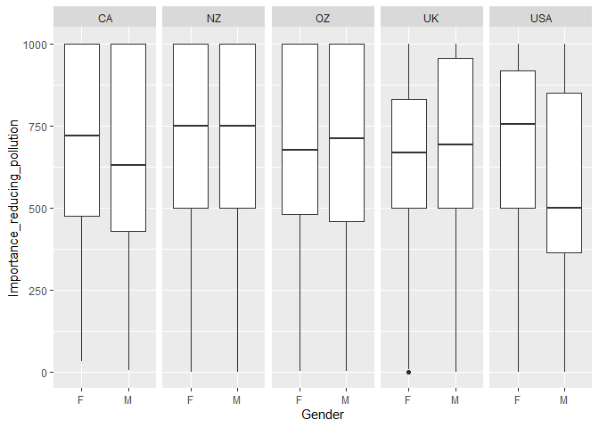
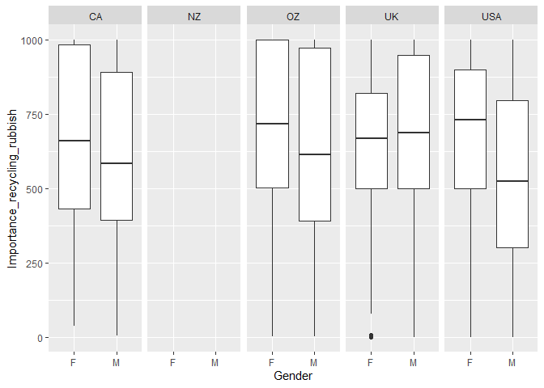
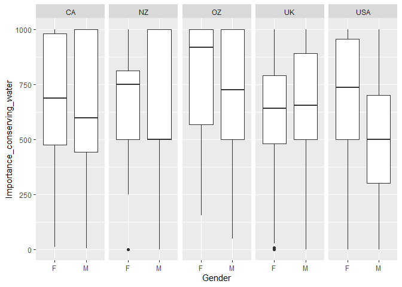
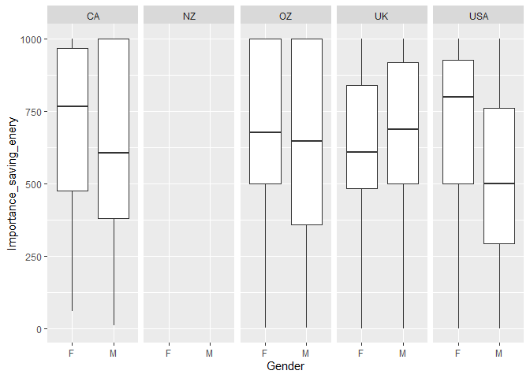
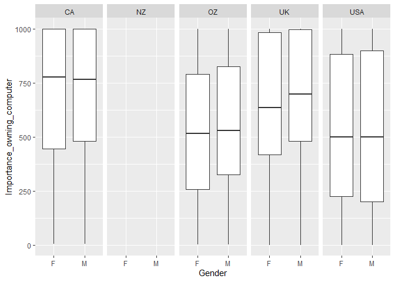
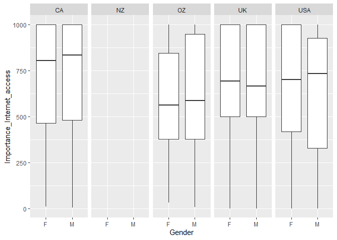
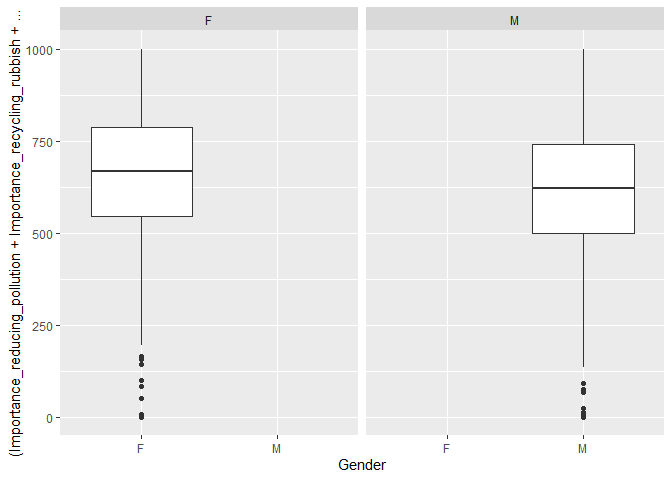

## **Case Study 3**
### [1 ] Download the **CensusAtSchool.csv** file from Moodle and import into an R script.


```r
library(tidyverse)  #has function to read files
```

```
## -- Attaching packages ------------------------------------------------------------------------------------ tidyverse 1.3.0 --
```

```
## v ggplot2 3.3.2     v purrr   0.3.4
## v tibble  3.0.3     v dplyr   1.0.0
## v tidyr   1.1.0     v stringr 1.4.0
## v readr   1.3.1     v forcats 0.5.0
```

```
## -- Conflicts --------------------------------------------------------------------------------------- tidyverse_conflicts() --
## x dplyr::filter() masks stats::filter()
## x dplyr::lag()    masks stats::lag()
```

```r
#First, need to go into excel and strip-off the last two lines, which are file path 
df_orig <- read_csv("E:/000 DTS 350 Data Visualization/DTS350-hollinbergert/DTS350TemplateMaster/Week_03/3CaseStudy/CensusAtSchool.csv")
```

```
## Parsed with column specification:
## cols(
##   .default = col_double(),
##   Country = col_character(),
##   Region = col_character(),
##   Gender = col_character(),
##   Handed = col_character(),
##   Travel_to_School = col_character(),
##   Favourite_physical_activity = col_character()
## )
```

```
## See spec(...) for full column specifications.
```

```r
str(df_orig)
```

```
## tibble [1,000 x 20] (S3: spec_tbl_df/tbl_df/tbl/data.frame)
##  $ Country                      : chr [1:1000] "CA" "CA" "CA" "CA" ...
##  $ Region                       : chr [1:1000] "Ontario" "Ontario" "Newfoundland and Labrador" "Ontario" ...
##  $ Gender                       : chr [1:1000] "F" "F" "F" "F" ...
##  $ Ageyears                     : num [1:1000] 7 13 13 18 13 13 18 13 17 15 ...
##  $ Handed                       : chr [1:1000] "B" "L" "L" "R" ...
##  $ Height                       : num [1:1000] 123 157 154 164 161 162 169 158 165 168 ...
##  $ Foot_Length                  : num [1:1000] 22 25 23 27 27 25 24 25 24 25 ...
##  $ Arm_Span                     : num [1:1000] 123 157 156 164 158 162 169 170 164 162 ...
##  $ Languages_spoken             : num [1:1000] 9 1 4 1 3 2 1 1 1 3 ...
##  $ Travel_to_School             : chr [1:1000] "Rail" "Walk" "Car" "Car" ...
##  $ Travel_time_to_School        : num [1:1000] 60 5 4 10 25 20 42 5 20 8 ...
##  $ Reaction_time                : num [1:1000] 1.406 0.659 1.265 0.673 0.25 ...
##  $ Score_in_memory_game         : num [1:1000] 35 45 46 60 29 44 40 41 34 28 ...
##  $ Favourite_physical_activity  : chr [1:1000] "Walking/Hiking" "Skateboarding/Rollerblading" "Bowling" "Other activities/sports" ...
##  $ Importance_reducing_pollution: num [1:1000] 32 144 332 123 674 856 476 829 32 668 ...
##  $ Importance_recycling_rubbish : num [1:1000] 37 144 481 160 572 765 481 182 118 471 ...
##  $ Importance_conserving_water  : num [1:1000] 80 107 797 193 11 86 230 128 588 615 ...
##  $ Importance_saving_enery      : num [1:1000] 59 80 102 166 176 176 235 257 278 310 ...
##  $ Importance_owning_computer   : num [1:1000] 123 834 1000 1000 1000 21 888 1000 829 1000 ...
##  $ Importance_Internet_access   : num [1:1000] 535 765 1000 1000 1000 455 888 1000 872 1000 ...
##  - attr(*, "spec")=
##   .. cols(
##   ..   Country = col_character(),
##   ..   Region = col_character(),
##   ..   Gender = col_character(),
##   ..   Ageyears = col_double(),
##   ..   Handed = col_character(),
##   ..   Height = col_double(),
##   ..   Foot_Length = col_double(),
##   ..   Arm_Span = col_double(),
##   ..   Languages_spoken = col_double(),
##   ..   Travel_to_School = col_character(),
##   ..   Travel_time_to_School = col_double(),
##   ..   Reaction_time = col_double(),
##   ..   Score_in_memory_game = col_double(),
##   ..   Favourite_physical_activity = col_character(),
##   ..   Importance_reducing_pollution = col_double(),
##   ..   Importance_recycling_rubbish = col_double(),
##   ..   Importance_conserving_water = col_double(),
##   ..   Importance_saving_enery = col_double(),
##   ..   Importance_owning_computer = col_double(),
##   ..   Importance_Internet_access = col_double()
##   .. )
```

### [2 ] Create a new data frame called **df_inch** which converts all of the measurements given in centimeters to inches.


```r
df_orig
```

```
## # A tibble: 1,000 x 20
##    Country Region Gender Ageyears Handed Height Foot_Length Arm_Span
##    <chr>   <chr>  <chr>     <dbl> <chr>   <dbl>       <dbl>    <dbl>
##  1 CA      Ontar~ F             7 B         123          22      123
##  2 CA      Ontar~ F            13 L         157          25      157
##  3 CA      Newfo~ F            13 L         154          23      156
##  4 CA      Ontar~ F            18 R         164          27      164
##  5 CA      Quebec F            13 R         161          27      158
##  6 CA      Quebec F            13 R         162          25      162
##  7 CA      Ontar~ F            18 R         169          24      169
##  8 CA      Ontar~ F            13 L         158          25      170
##  9 CA      Ontar~ F            17 R         165          24      164
## 10 CA      Quebec F            15 R         168          25      162
## # ... with 990 more rows, and 12 more variables: Languages_spoken <dbl>,
## #   Travel_to_School <chr>, Travel_time_to_School <dbl>, Reaction_time <dbl>,
## #   Score_in_memory_game <dbl>, Favourite_physical_activity <chr>,
## #   Importance_reducing_pollution <dbl>, Importance_recycling_rubbish <dbl>,
## #   Importance_conserving_water <dbl>, Importance_saving_enery <dbl>,
## #   Importance_owning_computer <dbl>, Importance_Internet_access <dbl>
```

```r
df_inch <- df_orig
df_inch <- mutate(df_inch,Height = Height/2.54, Foot_Length = Foot_Length/2.54, Arm_Span = Arm_Span/2.54 )
# have to put df_inch <- in front of mutate, for it to stick in the dataframe.
head(df_inch, n = 10)
```

```
## # A tibble: 10 x 20
##    Country Region Gender Ageyears Handed Height Foot_Length Arm_Span
##    <chr>   <chr>  <chr>     <dbl> <chr>   <dbl>       <dbl>    <dbl>
##  1 CA      Ontar~ F             7 B        48.4        8.66     48.4
##  2 CA      Ontar~ F            13 L        61.8        9.84     61.8
##  3 CA      Newfo~ F            13 L        60.6        9.06     61.4
##  4 CA      Ontar~ F            18 R        64.6       10.6      64.6
##  5 CA      Quebec F            13 R        63.4       10.6      62.2
##  6 CA      Quebec F            13 R        63.8        9.84     63.8
##  7 CA      Ontar~ F            18 R        66.5        9.45     66.5
##  8 CA      Ontar~ F            13 L        62.2        9.84     66.9
##  9 CA      Ontar~ F            17 R        65.0        9.45     64.6
## 10 CA      Quebec F            15 R        66.1        9.84     63.8
## # ... with 12 more variables: Languages_spoken <dbl>, Travel_to_School <chr>,
## #   Travel_time_to_School <dbl>, Reaction_time <dbl>,
## #   Score_in_memory_game <dbl>, Favourite_physical_activity <chr>,
## #   Importance_reducing_pollution <dbl>, Importance_recycling_rubbish <dbl>,
## #   Importance_conserving_water <dbl>, Importance_saving_enery <dbl>,
## #   Importance_owning_computer <dbl>, Importance_Internet_access <dbl>
```

### [3 ] Create a new data frame called **df_environment** which selects scores > 750 : 
from the original data set only those rows that list **at least a 750 score** 
in **any** of the importance columns and has the rows ordered from **youngest to oldest**.


```r
df_environment <- filter(df_inch, Importance_reducing_pollution >= 750 | Importance_recycling_rubbish >=750 |	Importance_conserving_water	>=750 | Importance_saving_enery >=750 | Importance_owning_computer >=750 |	Importance_Internet_access >=750)
#Would be nice if I could filter ColName starts with import and CellValue >=750"
#View(df_environment)
df_environment <- (arrange(df_environment, Ageyears))
df_environment
```

```
## # A tibble: 821 x 20
##    Country Region Gender Ageyears Handed Height Foot_Length Arm_Span
##    <chr>   <chr>  <chr>     <dbl> <chr>   <dbl>       <dbl>    <dbl>
##  1 CA      Ontar~ F             5 R        63.8        9.06     62.2
##  2 CA      Quebec F             6 R        62.2        9.06     61.0
##  3 CA      Quebec M             6 R        57.9        9.45     53.5
##  4 OZ      Weste~ M             6 B        55.1        9.84     49.2
##  5 OZ      South~ M             6 R        67.3       11.0      67.7
##  6 OZ      Victo~ F             7 R        55.1        7.48     55.9
##  7 OZ      Victo~ F             7 R        56.3        9.06     55.9
##  8 OZ      New S~ F             7 R        60.6       10.2      56.7
##  9 OZ      New S~ M             7 R        57.9       10.2      59.8
## 10 OZ      Victo~ M             7 R        54.3        9.06     53.1
## # ... with 811 more rows, and 12 more variables: Languages_spoken <dbl>,
## #   Travel_to_School <chr>, Travel_time_to_School <dbl>, Reaction_time <dbl>,
## #   Score_in_memory_game <dbl>, Favourite_physical_activity <chr>,
## #   Importance_reducing_pollution <dbl>, Importance_recycling_rubbish <dbl>,
## #   Importance_conserving_water <dbl>, Importance_saving_enery <dbl>,
## #   Importance_owning_computer <dbl>, Importance_Internet_access <dbl>
```

```r
head(df_environment, n = 10)
```

```
## # A tibble: 10 x 20
##    Country Region Gender Ageyears Handed Height Foot_Length Arm_Span
##    <chr>   <chr>  <chr>     <dbl> <chr>   <dbl>       <dbl>    <dbl>
##  1 CA      Ontar~ F             5 R        63.8        9.06     62.2
##  2 CA      Quebec F             6 R        62.2        9.06     61.0
##  3 CA      Quebec M             6 R        57.9        9.45     53.5
##  4 OZ      Weste~ M             6 B        55.1        9.84     49.2
##  5 OZ      South~ M             6 R        67.3       11.0      67.7
##  6 OZ      Victo~ F             7 R        55.1        7.48     55.9
##  7 OZ      Victo~ F             7 R        56.3        9.06     55.9
##  8 OZ      New S~ F             7 R        60.6       10.2      56.7
##  9 OZ      New S~ M             7 R        57.9       10.2      59.8
## 10 OZ      Victo~ M             7 R        54.3        9.06     53.1
## # ... with 12 more variables: Languages_spoken <dbl>, Travel_to_School <chr>,
## #   Travel_time_to_School <dbl>, Reaction_time <dbl>,
## #   Score_in_memory_game <dbl>, Favourite_physical_activity <chr>,
## #   Importance_reducing_pollution <dbl>, Importance_recycling_rubbish <dbl>,
## #   Importance_conserving_water <dbl>, Importance_saving_enery <dbl>,
## #   Importance_owning_computer <dbl>, Importance_Internet_access <dbl>
```

### [4 ] Create a new data frame called **df_extra** which does not include any of the importance columns from the origonal data set.


```r
df_extra <- select(df_orig, Country,	Region,	Gender,	Ageyears,	Handed,	Height,	Foot_Length,	Arm_Span,	Languages_spoken,	Travel_to_School,	Travel_time_to_School,	Reaction_time,	Score_in_memory_game,	Favourite_physical_activity)
#would be nice to be able to "filter if NOT start with Import..."
#easy to copy and paste column headers from excel, then insert commas
head(df_extra, n = 10)
```

```
## # A tibble: 10 x 14
##    Country Region Gender Ageyears Handed Height Foot_Length Arm_Span
##    <chr>   <chr>  <chr>     <dbl> <chr>   <dbl>       <dbl>    <dbl>
##  1 CA      Ontar~ F             7 B         123          22      123
##  2 CA      Ontar~ F            13 L         157          25      157
##  3 CA      Newfo~ F            13 L         154          23      156
##  4 CA      Ontar~ F            18 R         164          27      164
##  5 CA      Quebec F            13 R         161          27      158
##  6 CA      Quebec F            13 R         162          25      162
##  7 CA      Ontar~ F            18 R         169          24      169
##  8 CA      Ontar~ F            13 L         158          25      170
##  9 CA      Ontar~ F            17 R         165          24      164
## 10 CA      Quebec F            15 R         168          25      162
## # ... with 6 more variables: Languages_spoken <dbl>, Travel_to_School <chr>,
## #   Travel_time_to_School <dbl>, Reaction_time <dbl>,
## #   Score_in_memory_game <dbl>, Favourite_physical_activity <chr>
```

### [5 ] Create a new data frame called **df_numbers** which comes from the original data set and...
gives for each country the number of males in the sample from that country.
the number of females in the sample from that country.
the average score of all of the importance columns for each country. (Decide on a convention for the empty responses.)


```r
df_numbers <- df_orig
df_numbers <- group_by(df_numbers,Country,Gender)
df_numbers <- summarise(df_numbers, count = n(), mean(Importance_reducing_pollution), mean(Importance_recycling_rubbish), mean(Importance_conserving_water), mean(Importance_saving_enery), mean(Importance_owning_computer), mean(Importance_Internet_access))
```

```
## `summarise()` regrouping output by 'Country' (override with `.groups` argument)
```

```r
head(df_numbers, n = 10)
```

```
## # A tibble: 10 x 9
## # Groups:   Country [5]
##    Country Gender count `mean(Importanc~ `mean(Importanc~ `mean(Importanc~
##    <chr>   <chr>  <int>            <dbl>            <dbl>            <dbl>
##  1 CA      F        124             698.             652.             676.
##  2 CA      M        120             620.             588.             611.
##  3 NZ      F         72             743.              NA              677.
##  4 NZ      M         47             691.              NA              617.
##  5 OZ      F        165             688.              NA              778.
##  6 OZ      M        138             674.              NA              692.
##  7 UK      F         68             642.             637.             601.
##  8 UK      M         68             649.             631.             627.
##  9 USA     F        108             672.             654.             664.
## 10 USA     M         90             569.             533.             507.
## # ... with 3 more variables: `mean(Importance_saving_enery)` <dbl>,
## #   `mean(Importance_owning_computer)` <dbl>,
## #   `mean(Importance_Internet_access)` <dbl>
```

### [6 ] Create a new data frame called **df_gender** which comes from the original data set and... 
gives for each country and each gender the average score of each of the importance columns.
the standard deviation for each importance column order the columns so it is 
country, gender, importance_reducing_pollution, mean_reducing_pollution, 
standdev_reducing_pollution, importance_recycling_rubbish, 
mean_recycling_rubbish, standdev_recycling_rubbish, etc.


```r
df_orig
```

```
## # A tibble: 1,000 x 20
##    Country Region Gender Ageyears Handed Height Foot_Length Arm_Span
##    <chr>   <chr>  <chr>     <dbl> <chr>   <dbl>       <dbl>    <dbl>
##  1 CA      Ontar~ F             7 B         123          22      123
##  2 CA      Ontar~ F            13 L         157          25      157
##  3 CA      Newfo~ F            13 L         154          23      156
##  4 CA      Ontar~ F            18 R         164          27      164
##  5 CA      Quebec F            13 R         161          27      158
##  6 CA      Quebec F            13 R         162          25      162
##  7 CA      Ontar~ F            18 R         169          24      169
##  8 CA      Ontar~ F            13 L         158          25      170
##  9 CA      Ontar~ F            17 R         165          24      164
## 10 CA      Quebec F            15 R         168          25      162
## # ... with 990 more rows, and 12 more variables: Languages_spoken <dbl>,
## #   Travel_to_School <chr>, Travel_time_to_School <dbl>, Reaction_time <dbl>,
## #   Score_in_memory_game <dbl>, Favourite_physical_activity <chr>,
## #   Importance_reducing_pollution <dbl>, Importance_recycling_rubbish <dbl>,
## #   Importance_conserving_water <dbl>, Importance_saving_enery <dbl>,
## #   Importance_owning_computer <dbl>, Importance_Internet_access <dbl>
```

```r
df_CountryGenderImportances <- select(df_orig, Country, Gender, Importance_reducing_pollution, Importance_recycling_rubbish, Importance_conserving_water, Importance_saving_enery,	Importance_owning_computer,	Importance_Internet_access)
head(df_CountryGenderImportances, n = 10)
```

```
## # A tibble: 10 x 8
##    Country Gender Importance_redu~ Importance_recy~ Importance_cons~
##    <chr>   <chr>             <dbl>            <dbl>            <dbl>
##  1 CA      F                    32               37               80
##  2 CA      F                   144              144              107
##  3 CA      F                   332              481              797
##  4 CA      F                   123              160              193
##  5 CA      F                   674              572               11
##  6 CA      F                   856              765               86
##  7 CA      F                   476              481              230
##  8 CA      F                   829              182              128
##  9 CA      F                    32              118              588
## 10 CA      F                   668              471              615
## # ... with 3 more variables: Importance_saving_enery <dbl>,
## #   Importance_owning_computer <dbl>, Importance_Internet_access <dbl>
```

```r
df_CountryGenderGrp <- group_by(df_CountryGenderImportances, Country, Gender)
df_CountryGenderGrp
```

```
## # A tibble: 1,000 x 8
## # Groups:   Country, Gender [10]
##    Country Gender Importance_redu~ Importance_recy~ Importance_cons~
##    <chr>   <chr>             <dbl>            <dbl>            <dbl>
##  1 CA      F                    32               37               80
##  2 CA      F                   144              144              107
##  3 CA      F                   332              481              797
##  4 CA      F                   123              160              193
##  5 CA      F                   674              572               11
##  6 CA      F                   856              765               86
##  7 CA      F                   476              481              230
##  8 CA      F                   829              182              128
##  9 CA      F                    32              118              588
## 10 CA      F                   668              471              615
## # ... with 990 more rows, and 3 more variables: Importance_saving_enery <dbl>,
## #   Importance_owning_computer <dbl>, Importance_Internet_access <dbl>
```

```r
df_CountryGenderGrpSum <- summarise(df_CountryGenderGrp)
```

```
## `summarise()` regrouping output by 'Country' (override with `.groups` argument)
```

```r
#View(df_CountryGenderGrp)
df_CountryGenderGrpSum <- summarise(df_CountryGenderGrp,
#                       Count_reducing_pollution = sum(!is.na(Importance_reducing_pollution)), 
                       Mean_reducing_pollution = mean(Importance_reducing_pollution, na.rm = TRUE),
                       Standdev_reducing_pollution = sd(Importance_reducing_pollution, na.rm = TRUE),
#                       Count_recycling_rubbish = sum(!is.na(Importance_recycling_rubbish)),                     
                       Mean_recycling_rubbish = mean(Importance_recycling_rubbish, na.rm = TRUE),
                       Standdev_recycling_rubbish = sd(Importance_recycling_rubbish, na.rm = TRUE),
#                       Count_conserving_water = sum(!is.na(Importance_conserving_water)),
                       Mean_conserving_water = mean(Importance_conserving_water, na.rm = TRUE),
                       Standdev_conserving_water = sd(Importance_conserving_water, na.rm = TRUE),
#                       Count_saving_enery = sum(!is.na(Importance_saving_enery)),
                       Mean_saving_enery = mean(Importance_saving_enery, na.rm = TRUE),
                       Standdev_saving_enery = sd(Importance_saving_enery, na.rm = TRUE),
#                       Count_owning_computer = sum(!is.na(Importance_owning_computer)),
                       Mean_owning_computer = mean(Importance_owning_computer, na.rm = TRUE),
                       Standdev_owning_computer = sd(Importance_owning_computer, na.rm = TRUE),
#                       Count_Internet_access = sum(!is.na(Importance_Internet_access)),
                       Mean_Internet_access = mean(Importance_Internet_access, na.rm = TRUE),
                       Standdev_Internet_access = sd(Importance_Internet_access, na.rm = TRUE))
```

```
## `summarise()` regrouping output by 'Country' (override with `.groups` argument)
```

```r
df_CountryGenderGrpSum
```

```
## # A tibble: 10 x 14
## # Groups:   Country [5]
##    Country Gender Mean_reducing_p~ Standdev_reduci~ Mean_recycling_~
##    <chr>   <chr>             <dbl>            <dbl>            <dbl>
##  1 CA      F                  698.             282.             652.
##  2 CA      M                  620.             336.             588.
##  3 NZ      F                  743.             237.             NaN 
##  4 NZ      M                  691.             282.             NaN 
##  5 OZ      F                  688.             284.             693.
##  6 OZ      M                  674.             310.             623.
##  7 UK      F                  642.             283.             637.
##  8 UK      M                  649.             310.             631.
##  9 USA     F                  672.             316.             654.
## 10 USA     M                  569.             321.             533.
## # ... with 9 more variables: Standdev_recycling_rubbish <dbl>,
## #   Mean_conserving_water <dbl>, Standdev_conserving_water <dbl>,
## #   Mean_saving_enery <dbl>, Standdev_saving_enery <dbl>,
## #   Mean_owning_computer <dbl>, Standdev_owning_computer <dbl>,
## #   Mean_Internet_access <dbl>, Standdev_Internet_access <dbl>
```

```r
#View(df_CountryGenderGrpSum)
#Note: No responses for NZ Male or Female for Rubbish, Energy, Computers, or Internet
```

### [7 ] Create any other data frames or visualizations that you think might help you 
determine areas of strength or weakness in the importance categories.


```r
ggplot(data = df_CountryGenderGrp) +
  geom_boxplot(mapping = aes(x = Gender, y = Importance_reducing_pollution)) +
  facet_wrap(~ Country, nrow = 1)
```

<!-- -->

```r
ggplot(data = df_CountryGenderGrp) +
  geom_boxplot(mapping = aes(x = Gender, y = Importance_recycling_rubbish)) +
  facet_wrap(~ Country, nrow = 1)
```

```
## Warning: Removed 123 rows containing non-finite values (stat_boxplot).
```

<!-- -->

```r
ggplot(data = df_CountryGenderGrp) +
  geom_boxplot(mapping = aes(x = Gender, y = Importance_conserving_water)) + 
  facet_wrap(~ Country, nrow = 1)
```

<!-- -->

```r
ggplot(data = df_CountryGenderGrp) +    
  geom_boxplot(mapping = aes(x = Gender, y = Importance_saving_enery)) +
  facet_wrap(~ Country, nrow = 1)
```

```
## Warning: Removed 159 rows containing non-finite values (stat_boxplot).
```

<!-- -->

```r
ggplot(data = df_CountryGenderGrp) +
  geom_boxplot(mapping = aes(x = Gender, y = Importance_owning_computer)) + 
  facet_wrap(~ Country, nrow = 1)
```

```
## Warning: Removed 137 rows containing non-finite values (stat_boxplot).
```

<!-- -->

```r
ggplot(data = df_CountryGenderGrp) +  
  geom_boxplot(mapping = aes(x = Gender, y = Importance_Internet_access)) +
  facet_wrap(~ Country, nrow = 1)
```

```
## Warning: Removed 141 rows containing non-finite values (stat_boxplot).
```

<!-- -->

How to stitch these together in one chart?  So that distinct variables are the groups(data series)
https://stackoverflow.com/questions/14785530/ggplot-boxplot-of-multiple-column-values
Observations:
Males, across the board, and especially in USA, gave lower scores, and are less concerned about environemntal matters.
Males are generally more concerned (gave higher scores) to computer-related issues.
    
## [8 ] Create an .Rmd file that has two sections:
###  Section 1: Gives the **first 10 rows** of each of the data frames you created


```r
head(df_orig, n = 10)
```

```
## # A tibble: 10 x 20
##    Country Region Gender Ageyears Handed Height Foot_Length Arm_Span
##    <chr>   <chr>  <chr>     <dbl> <chr>   <dbl>       <dbl>    <dbl>
##  1 CA      Ontar~ F             7 B         123          22      123
##  2 CA      Ontar~ F            13 L         157          25      157
##  3 CA      Newfo~ F            13 L         154          23      156
##  4 CA      Ontar~ F            18 R         164          27      164
##  5 CA      Quebec F            13 R         161          27      158
##  6 CA      Quebec F            13 R         162          25      162
##  7 CA      Ontar~ F            18 R         169          24      169
##  8 CA      Ontar~ F            13 L         158          25      170
##  9 CA      Ontar~ F            17 R         165          24      164
## 10 CA      Quebec F            15 R         168          25      162
## # ... with 12 more variables: Languages_spoken <dbl>, Travel_to_School <chr>,
## #   Travel_time_to_School <dbl>, Reaction_time <dbl>,
## #   Score_in_memory_game <dbl>, Favourite_physical_activity <chr>,
## #   Importance_reducing_pollution <dbl>, Importance_recycling_rubbish <dbl>,
## #   Importance_conserving_water <dbl>, Importance_saving_enery <dbl>,
## #   Importance_owning_computer <dbl>, Importance_Internet_access <dbl>
```

```r
head(df_inch, n = 10)
```

```
## # A tibble: 10 x 20
##    Country Region Gender Ageyears Handed Height Foot_Length Arm_Span
##    <chr>   <chr>  <chr>     <dbl> <chr>   <dbl>       <dbl>    <dbl>
##  1 CA      Ontar~ F             7 B        48.4        8.66     48.4
##  2 CA      Ontar~ F            13 L        61.8        9.84     61.8
##  3 CA      Newfo~ F            13 L        60.6        9.06     61.4
##  4 CA      Ontar~ F            18 R        64.6       10.6      64.6
##  5 CA      Quebec F            13 R        63.4       10.6      62.2
##  6 CA      Quebec F            13 R        63.8        9.84     63.8
##  7 CA      Ontar~ F            18 R        66.5        9.45     66.5
##  8 CA      Ontar~ F            13 L        62.2        9.84     66.9
##  9 CA      Ontar~ F            17 R        65.0        9.45     64.6
## 10 CA      Quebec F            15 R        66.1        9.84     63.8
## # ... with 12 more variables: Languages_spoken <dbl>, Travel_to_School <chr>,
## #   Travel_time_to_School <dbl>, Reaction_time <dbl>,
## #   Score_in_memory_game <dbl>, Favourite_physical_activity <chr>,
## #   Importance_reducing_pollution <dbl>, Importance_recycling_rubbish <dbl>,
## #   Importance_conserving_water <dbl>, Importance_saving_enery <dbl>,
## #   Importance_owning_computer <dbl>, Importance_Internet_access <dbl>
```

```r
head(df_environment, n = 10)
```

```
## # A tibble: 10 x 20
##    Country Region Gender Ageyears Handed Height Foot_Length Arm_Span
##    <chr>   <chr>  <chr>     <dbl> <chr>   <dbl>       <dbl>    <dbl>
##  1 CA      Ontar~ F             5 R        63.8        9.06     62.2
##  2 CA      Quebec F             6 R        62.2        9.06     61.0
##  3 CA      Quebec M             6 R        57.9        9.45     53.5
##  4 OZ      Weste~ M             6 B        55.1        9.84     49.2
##  5 OZ      South~ M             6 R        67.3       11.0      67.7
##  6 OZ      Victo~ F             7 R        55.1        7.48     55.9
##  7 OZ      Victo~ F             7 R        56.3        9.06     55.9
##  8 OZ      New S~ F             7 R        60.6       10.2      56.7
##  9 OZ      New S~ M             7 R        57.9       10.2      59.8
## 10 OZ      Victo~ M             7 R        54.3        9.06     53.1
## # ... with 12 more variables: Languages_spoken <dbl>, Travel_to_School <chr>,
## #   Travel_time_to_School <dbl>, Reaction_time <dbl>,
## #   Score_in_memory_game <dbl>, Favourite_physical_activity <chr>,
## #   Importance_reducing_pollution <dbl>, Importance_recycling_rubbish <dbl>,
## #   Importance_conserving_water <dbl>, Importance_saving_enery <dbl>,
## #   Importance_owning_computer <dbl>, Importance_Internet_access <dbl>
```

```r
head(df_extra, n = 10)
```

```
## # A tibble: 10 x 14
##    Country Region Gender Ageyears Handed Height Foot_Length Arm_Span
##    <chr>   <chr>  <chr>     <dbl> <chr>   <dbl>       <dbl>    <dbl>
##  1 CA      Ontar~ F             7 B         123          22      123
##  2 CA      Ontar~ F            13 L         157          25      157
##  3 CA      Newfo~ F            13 L         154          23      156
##  4 CA      Ontar~ F            18 R         164          27      164
##  5 CA      Quebec F            13 R         161          27      158
##  6 CA      Quebec F            13 R         162          25      162
##  7 CA      Ontar~ F            18 R         169          24      169
##  8 CA      Ontar~ F            13 L         158          25      170
##  9 CA      Ontar~ F            17 R         165          24      164
## 10 CA      Quebec F            15 R         168          25      162
## # ... with 6 more variables: Languages_spoken <dbl>, Travel_to_School <chr>,
## #   Travel_time_to_School <dbl>, Reaction_time <dbl>,
## #   Score_in_memory_game <dbl>, Favourite_physical_activity <chr>
```

```r
head(df_numbers, n = 10)
```

```
## # A tibble: 10 x 9
## # Groups:   Country [5]
##    Country Gender count `mean(Importanc~ `mean(Importanc~ `mean(Importanc~
##    <chr>   <chr>  <int>            <dbl>            <dbl>            <dbl>
##  1 CA      F        124             698.             652.             676.
##  2 CA      M        120             620.             588.             611.
##  3 NZ      F         72             743.              NA              677.
##  4 NZ      M         47             691.              NA              617.
##  5 OZ      F        165             688.              NA              778.
##  6 OZ      M        138             674.              NA              692.
##  7 UK      F         68             642.             637.             601.
##  8 UK      M         68             649.             631.             627.
##  9 USA     F        108             672.             654.             664.
## 10 USA     M         90             569.             533.             507.
## # ... with 3 more variables: `mean(Importance_saving_enery)` <dbl>,
## #   `mean(Importance_owning_computer)` <dbl>,
## #   `mean(Importance_Internet_access)` <dbl>
```

```r
head(df_CountryGenderImportances, n = 10)
```

```
## # A tibble: 10 x 8
##    Country Gender Importance_redu~ Importance_recy~ Importance_cons~
##    <chr>   <chr>             <dbl>            <dbl>            <dbl>
##  1 CA      F                    32               37               80
##  2 CA      F                   144              144              107
##  3 CA      F                   332              481              797
##  4 CA      F                   123              160              193
##  5 CA      F                   674              572               11
##  6 CA      F                   856              765               86
##  7 CA      F                   476              481              230
##  8 CA      F                   829              182              128
##  9 CA      F                    32              118              588
## 10 CA      F                   668              471              615
## # ... with 3 more variables: Importance_saving_enery <dbl>,
## #   Importance_owning_computer <dbl>, Importance_Internet_access <dbl>
```

```r
head(df_CountryGenderGrp, n = 10)
```

```
## # A tibble: 10 x 8
## # Groups:   Country, Gender [1]
##    Country Gender Importance_redu~ Importance_recy~ Importance_cons~
##    <chr>   <chr>             <dbl>            <dbl>            <dbl>
##  1 CA      F                    32               37               80
##  2 CA      F                   144              144              107
##  3 CA      F                   332              481              797
##  4 CA      F                   123              160              193
##  5 CA      F                   674              572               11
##  6 CA      F                   856              765               86
##  7 CA      F                   476              481              230
##  8 CA      F                   829              182              128
##  9 CA      F                    32              118              588
## 10 CA      F                   668              471              615
## # ... with 3 more variables: Importance_saving_enery <dbl>,
## #   Importance_owning_computer <dbl>, Importance_Internet_access <dbl>
```

```r
head(df_CountryGenderGrpSum, n = 10)
```

```
## # A tibble: 10 x 14
## # Groups:   Country [5]
##    Country Gender Mean_reducing_p~ Standdev_reduci~ Mean_recycling_~
##    <chr>   <chr>             <dbl>            <dbl>            <dbl>
##  1 CA      F                  698.             282.             652.
##  2 CA      M                  620.             336.             588.
##  3 NZ      F                  743.             237.             NaN 
##  4 NZ      M                  691.             282.             NaN 
##  5 OZ      F                  688.             284.             693.
##  6 OZ      M                  674.             310.             623.
##  7 UK      F                  642.             283.             637.
##  8 UK      M                  649.             310.             631.
##  9 USA     F                  672.             316.             654.
## 10 USA     M                  569.             321.             533.
## # ... with 9 more variables: Standdev_recycling_rubbish <dbl>,
## #   Mean_conserving_water <dbl>, Standdev_conserving_water <dbl>,
## #   Mean_saving_enery <dbl>, Standdev_saving_enery <dbl>,
## #   Mean_owning_computer <dbl>, Standdev_owning_computer <dbl>,
## #   Mean_Internet_access <dbl>, Standdev_Internet_access <dbl>
```

### Section 2: Includes a **summary** of your findings to the question which includes at least **one visualization** to support your findings.

### Observations:
1. Males, across the board, and especially in USA, gave lower scores, and are less concerned about environmental matters.
2. Males are generally more concerned (gave higher scores) to computer-related issues.
 


```r
ggplot(data = df_CountryGenderGrp) +
  geom_boxplot(mapping = aes(x = Gender, y = (Importance_reducing_pollution+Importance_recycling_rubbish+Importance_conserving_water+Importance_saving_enery+Importance_owning_computer+Importance_Internet_access)/6)) +
  facet_wrap(~ Gender, nrow = 1)
```

```
## Warning: Removed 185 rows containing non-finite values (stat_boxplot).
```

<!-- -->

```r
ggplot(data = df_CountryGenderGrp) +
geom_boxplot(mapping = aes(x = Gender, y = Importance_reducing_pollution)) +
  facet_wrap(~ Country, nrow = 1)
```

<!-- -->

```r
ggplot(data = df_CountryGenderGrp) +
  geom_boxplot(mapping = aes(x = Gender, y = Importance_recycling_rubbish)) +
  facet_wrap(~ Country, nrow = 1)
```

```
## Warning: Removed 123 rows containing non-finite values (stat_boxplot).
```

<!-- -->

```r
ggplot(data = df_CountryGenderGrp) +
  geom_boxplot(mapping = aes(x = Gender, y = Importance_conserving_water)) + 
  facet_wrap(~ Country, nrow = 1)
```

<!-- -->

```r
ggplot(data = df_CountryGenderGrp) +    
  geom_boxplot(mapping = aes(x = Gender, y = Importance_saving_enery)) +
  facet_wrap(~ Country, nrow = 1)
```

```
## Warning: Removed 159 rows containing non-finite values (stat_boxplot).
```

<!-- -->

```r
ggplot(data = df_CountryGenderGrp) +
  geom_boxplot(mapping = aes(x = Gender, y = Importance_owning_computer)) + 
  facet_wrap(~ Country, nrow = 1)
```

```
## Warning: Removed 137 rows containing non-finite values (stat_boxplot).
```

<!-- -->

```r
ggplot(data = df_CountryGenderGrp) +  
  geom_boxplot(mapping = aes(x = Gender, y = Importance_Internet_access)) +
  facet_wrap(~ Country, nrow = 1)
```

```
## Warning: Removed 141 rows containing non-finite values (stat_boxplot).
```

<!-- -->

How to stitch these together in one chart?  So that distinct variables are the groups(data series)
https://stackoverflow.com/questions/14785530/ggplot-boxplot-of-multiple-column-values
