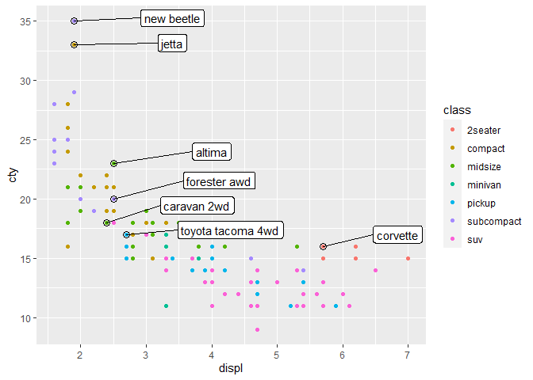
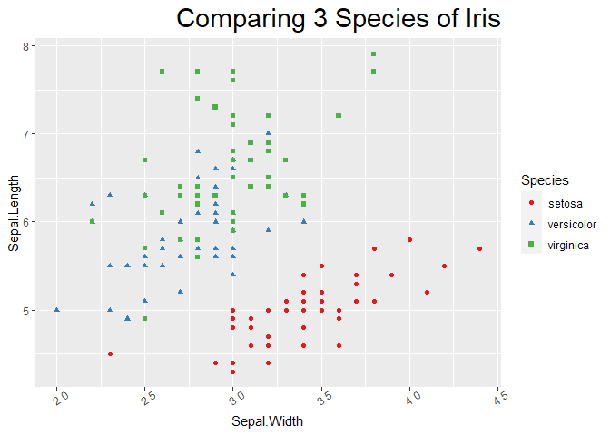

---
title: "Task 5: InClass Examples"
author: "TomHollinberger"
date: "9/9/2020"
output: 
 html_document: 
   keep_md: yes
   toc: TRUE
---  
THIS RSCRIPT USES ROXYGEN CHARACTERS.  
YOU CAN PRESS ctrl+shift+K AND GO STRAIGHT TO A HTML.  
SKIPS THE HANDWORK OF CREATING A RMD, AFTER THE ORIGINAL WORK IS NONE IN A RSCRIPT.

# **Day5 InClass Examples: Data Import, Parsing, and ggplot2** 

_________________________________
  
## **Data Import**
Here are the primary functions we will use for data import:
readr::read_csv()
readr::read_delim()
readxl::read_excel()
Usually the argument for the function is simply the path to the file you want to load.
We will mainly use read_csv(). You just need the file name, and then you have the following options:
 We have the following options for our read_csv() function:
skip = n: skips the first n lines in the file
comment = "#": drop all the lines that start with #
col_name = FALSE: If your file doesn't have column names, this puts the data starting with that first line in row 1 of the tibble. The column names are then x1, x2, . .
col_name = c("a", "b"): File doesn't have column names, but you supply them in the character vector
na = ".": Tells what character(s) are used for missing values in the file.
Start by loading libraries


```r
library(tidyverse)
```

```
## -- Attaching packages ----------------------------------------------------------------- tidyverse 1.3.0 --
```

```
## v ggplot2 3.3.2     v purrr   0.3.4
## v tibble  3.0.3     v dplyr   1.0.0
## v tidyr   1.1.0     v stringr 1.4.0
## v readr   1.3.1     v forcats 0.5.0
```

```
## -- Conflicts -------------------------------------------------------------------- tidyverse_conflicts() --
## x dplyr::filter() masks stats::filter()
## x dplyr::lag()    masks stats::lag()
```

```r
library(dplyr)
```

### Example:
 First we will download an example csv file from the Urban Institute's Education data portal. Make sure you know where the file is going to download. You might want to run getwd() to see what your working directory is.
NOTE: If you are using a PC, you need an extra argument in your download.file() function:
THESE 2 LINES OF CODE WAS RUN ONCE WITH ctrl+shift+K, then #'d it out, because it doesn't need to be downloaded every time: 
download.file("https://educationdata.urban.org/csv/ipeds/colleges_ipeds_completers.csv",
               "colleges_ipeds_completers.csv", mode = "wb")
Now we use the read_csv function to load the data.


```r
ipeds <- read_csv("colleges_ipeds_completers.csv")
```

```
## Parsed with column specification:
## cols(
##   unitid = col_double(),
##   year = col_double(),
##   fips = col_double(),
##   race = col_double(),
##   sex = col_double(),
##   completers = col_double()
## )
```

Parsed with column specification:
cols(
  unitid = col_double(),
  year = col_double(),
  fips = col_double(),
  race = col_double(),
  sex = col_double(),
  completers = col_double()
)
We now have a tibble that can be used with ggplot2 to make visualizations and dplyr to modify the data set.
When we have a dataset that we want to save to use for later, we can use the write_csv() function to save it. For example, let's create a new data set called ipeds_2011 which contains only the 2011 data from our data set. Then save this data set in the working directory.


```r
ipeds_2011 <- ipeds %>%
  filter(year == 2011)
head(ipeds_2011, n = 10)
```

```
## # A tibble: 10 x 6
##    unitid  year  fips  race   sex completers
##     <dbl> <dbl> <dbl> <dbl> <dbl>      <dbl>
##  1 100654  2011     1     7     1          0
##  2 100654  2011     1     7    99          0
##  3 100654  2011     1     7     2          0
##  4 100654  2011     1     5     1          1
##  5 100654  2011     1     5    99          1
##  6 100654  2011     1     5     2          0
##  7 100654  2011     1     4     1          7
##  8 100654  2011     1     4    99         10
##  9 100654  2011     1     4     2          3
## 10 100654  2011     1     2     1        268
```

```r
write_csv(ipeds_2011, "colleges_ipeds_completers_2011.csv")
getwd()
```

```
## [1] "E:/000 DTS 350 Data Visualization/DTS350-hollinbergert/DTS350TemplateMaster/Week_03/Class_Task_05"
```

________________________________________
### Exercise:
### [1] Filter the ipeds data frome to years 2014-2015 for the state of California (Hint: fips code of 6). Be sure to save this to a new object.  **Done, See Code Below**


```r
ipeds_CA_201415 <- ipeds %>%
  filter(year == 2014 | year == 2015, fips == 6)
head(ipeds_CA_201415,n = 10)
```

```
## # A tibble: 10 x 6
##    unitid  year  fips  race   sex completers
##     <dbl> <dbl> <dbl> <dbl> <dbl>      <dbl>
##  1 108232  2014     6     7     1          6
##  2 108232  2014     6     7    99         16
##  3 108232  2014     6     7     2         10
##  4 108232  2014     6     5     1          5
##  5 108232  2014     6     5    99         14
##  6 108232  2014     6     5     2          9
##  7 108232  2014     6     4     1        108
##  8 108232  2014     6     4    99        233
##  9 108232  2014     6     4     2        125
## 10 108232  2014     6     2     1         41
```

```r
tail(ipeds_CA_201415,n = 10)
```

```
## # A tibble: 10 x 6
##    unitid  year  fips  race   sex completers
##     <dbl> <dbl> <dbl> <dbl> <dbl>      <dbl>
##  1 489858  2015     6     8     2          1
##  2 489858  2015     6    99     1          7
##  3 489858  2015     6    99    99         29
##  4 489858  2015     6    99     2         22
##  5 489858  2015     6     9     1          1
##  6 489858  2015     6     9    99          2
##  7 489858  2015     6     9     2          1
##  8 489858  2015     6     1     1          2
##  9 489858  2015     6     1    99         10
## 10 489858  2015     6     1     2          8
```

### [2] Write your new data frame to a file called "ipeds_completers_ca.csv".  **Done, See Code Below**


```r
write_csv(ipeds_CA_201415, "ipeds_completers_ca.csv")
getwd()
```

```
## [1] "E:/000 DTS 350 Data Visualization/DTS350-hollinbergert/DTS350TemplateMaster/Week_03/Class_Task_05"
```


## **The readxl Package**
We need to load the readxl package.
install.packages("readxl")


```r
library(readxl)
```

If we have data saved as .xls or .xlsx, we use the readxl package.
________________________________________
### Example:
 For this example, we will download data from the HUD FHA Single Family LPortfolio Snap Shot.
THESE 2 LINES OF CODE WAS RUN ONCE WITH ctrl+shift+K, then #'d it out, because it doesn't need to be downloaded every time: 
download.file("https://www.hud.gov/sites/dfiles/Housing/documents/FHA_SFSnapshot_Apr2019.xlsx",
             "sfsnap.xlsx", mode = "wb")
This excel file contains a number of tables on different sheets of the workbook. We can see a listing of the sheets using the excel_sheets function.


```r
excel_sheets("sfsnap.xlsx")
```

```
## [1] "Title Page"                  "Report Generator April 2019"
## [3] "Purchase Data April 2019"    "Refinance Data April 2019"  
## [5] "Definitions"
```

[1] "Title Page"                  "Report Generator April 2019"
[3] "Purchase Data April 2019"    "Refinance Data April 2019"  
[5] "Definitions"
Now we will load our data using the read_excel function. We will load the data from the Purchase Date April 2019 sheet.


```r
purchases <- read_excel("sfsnap.xlsx", sheet = "Purchase Data April 2019")
```

________________________________________
### Exercise:
### [3] Use the read_excel() function to load in the table on the "Refinance Data April 2019" sheet into a data frame called "refinances".   **Done, See Code Below**


```r
refinances <- read_excel("sfsnap.xlsx", sheet = "Refinance Data April 2019")
```


_________________________________
  
  
## **Parsing**

### Example 1:

watch out for copy and pasted dblquotemarks, also need space after 
  Enter the following code:


```r
money <- c("4,554,25", "$45", "8025.33cents", "288f45")
```

### [4] Use as.numeric(money), and what is your output?  ***You get NA's because some are not numeric***


```r
as.numeric(money)
```

```
## Warning: NAs introduced by coercion
```

```
## [1] NA NA NA NA
```


### [5] Use parse_number(money) and compare your output.  ***You get the number-content of these items, the number content is parsed-out***


```r
parse_number(money)
```

```
## [1] 455425.00     45.00   8025.33    288.00
```


These are the types of parsing functions:<br>
parse_logical<br>
parse_integer<br>
parse_date<br>
parse_datetime<br>
parse_time<br>
parse_double<br>
parse_character<br>
parse_factor<br>

________________________________________

### Example 2:

What happens with the next code?  *** Two Parsing Failures  3a has a trailing character, and 5.4 has a decimal value the 2nd item also creates an NA but isn't listed as a problem.  WHy?? ***


```r
my_string <- c("123", ".", "3a", "5.4")
parse_integer(my_string, na = ".")
```

```
## Warning: 2 parsing failures.
## row col               expected actual
##   3  -- no trailing characters     a 
##   4  -- no trailing characters     .4
```

```
## [1] 123  NA  NA  NA
## attr(,"problems")
## # A tibble: 2 x 4
##     row   col expected               actual
##   <int> <int> <chr>                  <chr> 
## 1     3    NA no trailing characters a     
## 2     4    NA no trailing characters .4
```


If there are a lot of problems, you will need to use problems() to see them all.


_________________________________
  
## **Parsing a File**
When we read in a csv file, readr will automatically guess the type of each column. We can help it get the right data type, or we can override it entirely.

### Example 3:
  Run the code:


```r
challenge <-  read_csv(readr_example("challenge.csv"))
```

```
## Parsed with column specification:
## cols(
##   x = col_double(),
##   y = col_logical()
## )
```

```
## Warning: 1000 parsing failures.
##  row col           expected     actual                                                                     file
## 1001   y 1/0/T/F/TRUE/FALSE 2015-01-16 'C:/Users/tomho/Documents/R/win-library/4.0/readr/extdata/challenge.csv'
## 1002   y 1/0/T/F/TRUE/FALSE 2018-05-18 'C:/Users/tomho/Documents/R/win-library/4.0/readr/extdata/challenge.csv'
## 1003   y 1/0/T/F/TRUE/FALSE 2015-09-05 'C:/Users/tomho/Documents/R/win-library/4.0/readr/extdata/challenge.csv'
## 1004   y 1/0/T/F/TRUE/FALSE 2012-11-28 'C:/Users/tomho/Documents/R/win-library/4.0/readr/extdata/challenge.csv'
## 1005   y 1/0/T/F/TRUE/FALSE 2020-01-13 'C:/Users/tomho/Documents/R/win-library/4.0/readr/extdata/challenge.csv'
## .... ... .................. .......... ........................................................................
## See problems(...) for more details.
```

*Warning: 1000 parsing failures.*
See problems(...) for more details.
There were some problems. Run the following:


```r
problems(challenge)
```

```
## # A tibble: 1,000 x 5
##      row col   expected       actual   file                                     
##    <int> <chr> <chr>          <chr>    <chr>                                    
##  1  1001 y     1/0/T/F/TRUE/~ 2015-01~ 'C:/Users/tomho/Documents/R/win-library/~
##  2  1002 y     1/0/T/F/TRUE/~ 2018-05~ 'C:/Users/tomho/Documents/R/win-library/~
##  3  1003 y     1/0/T/F/TRUE/~ 2015-09~ 'C:/Users/tomho/Documents/R/win-library/~
##  4  1004 y     1/0/T/F/TRUE/~ 2012-11~ 'C:/Users/tomho/Documents/R/win-library/~
##  5  1005 y     1/0/T/F/TRUE/~ 2020-01~ 'C:/Users/tomho/Documents/R/win-library/~
##  6  1006 y     1/0/T/F/TRUE/~ 2016-04~ 'C:/Users/tomho/Documents/R/win-library/~
##  7  1007 y     1/0/T/F/TRUE/~ 2011-05~ 'C:/Users/tomho/Documents/R/win-library/~
##  8  1008 y     1/0/T/F/TRUE/~ 2020-07~ 'C:/Users/tomho/Documents/R/win-library/~
##  9  1009 y     1/0/T/F/TRUE/~ 2011-04~ 'C:/Users/tomho/Documents/R/win-library/~
## 10  1010 y     1/0/T/F/TRUE/~ 2010-05~ 'C:/Users/tomho/Documents/R/win-library/~
## # ... with 990 more rows
```

```r
head(challenge)
```

```
## # A tibble: 6 x 2
##       x y    
##   <dbl> <lgl>
## 1   404 NA   
## 2  4172 NA   
## 3  3004 NA   
## 4   787 NA   
## 5    37 NA   
## 6  2332 NA
```

```r
tail(challenge)
```

```
## # A tibble: 6 x 2
##       x y    
##   <dbl> <lgl>
## 1 0.805 NA   
## 2 0.164 NA   
## 3 0.472 NA   
## 4 0.718 NA   
## 5 0.270 NA   
## 6 0.608 NA
```

### [6] Can you figure out the problems?  ***They are dates stored in a character vector.  We should use a date parser.***
  Readr reads in 1000 rows to determine what data type to assign. But sometimes it gets it wrong.
We want to fix the data type of the y column. If y were just a vector of values, 
we would use parse_date(y), but since we are reading in a file, we use col_date(). 
Every parse_xyz() function has a corresponding col_xyz() function that we use when we read in files.


```r
challenge <- read_csv(
  readr_example("challenge.csv"),
  col_types = cols(
    x = col_double(),
    y = col_date()  #was previously incorrectly guessed to be y = col_logical()
  )
)
```

It is best to specify the col_types for each file.


_________________________________
  
## **ggplot2**
We are going to learn more about labels in our plots.
Let's use our plot from our last class:


```r
p <- ggplot(data = iris, mapping = aes(x=Sepal.Width, 
                                         y = Sepal.Length, 
                                         color = Species,
                                         shape = Species),
              size = 5) +
  geom_point() +
  scale_color_brewer(palette = "Set1") 
p
```

<!-- -->

## **Labelling the inside of the chart**
Labels inside a chart uses library(directlabels). So install that and load it.
You can use this library in two different ways: - geom_dl() and - direct.label()
need to install first


```r
library(directlabels)
p %>%  direct.label()
```

<!-- -->

 or


```r
p + geom_dl(method = "smart.grid", mapping = aes(label = Species)) + theme(legend.position = "none") 
```

<!-- -->

Direct labels are nice for line plots. The ?geom_dl() can be helpful.
Another technique that is often used is from the package ggrepel. Install and load that package.
For these examples, we will use the mpg dataset.

### Example 4:
  Consider the following code:


```r
best_in_class <- mpg %>%
  group_by(class) %>%
  filter(row_number(desc(cty)) == 1)
best_in_class
```

```
## # A tibble: 7 x 11
## # Groups:   class [7]
##   manufacturer model     displ  year   cyl trans  drv     cty   hwy fl    class 
##   <chr>        <chr>     <dbl> <int> <int> <chr>  <chr> <int> <int> <chr> <chr> 
## 1 chevrolet    corvette    5.7  1999     8 manua~ r        16    26 p     2seat~
## 2 dodge        caravan ~   2.4  1999     4 auto(~ f        18    24 r     miniv~
## 3 nissan       altima      2.5  2008     4 auto(~ f        23    31 r     midsi~
## 4 subaru       forester~   2.5  2008     4 manua~ 4        20    27 r     suv   
## 5 toyota       toyota t~   2.7  2008     4 manua~ 4        17    22 r     pickup
## 6 volkswagen   jetta       1.9  1999     4 manua~ f        33    44 d     compa~
## 7 volkswagen   new beet~   1.9  1999     4 manua~ f        35    44 d     subco~
```

### [7] What does this code do?  ***It groups by class in descending order(highest first), then takes the first row in each class.  Thus selecting the car with the highest mpg in each class.***

_________________________________
  
 We can use the data in best_in_class to make labels on our graph.


```r
ggplot(mpg, aes(displ, cty)) +
  geom_point(aes(colour = class)) +
  geom_label(aes(label = model), data = best_in_class, nudge_y = 2, alpha = 0.5) 
```

<!-- -->

That doesn't look very nice. We can use `ggrepel to improve things.
Now run the next code and compare the plot to the previous one.


```r
ggplot(mpg, aes(displ, cty)) +
  geom_point(aes(colour = class)) +
  geom_point(size = 3, shape = 1, data = best_in_class) +
  ggrepel::geom_label_repel(aes(label = model), data = best_in_class, nudge_x = 1.5, nudge_y = 1) 
```

<!-- -->

### [8] What did the **ggrepel** part of the code do to the chart? ***It keeps the labels away from each other and any datapoints.***
### [9] Compare this chart to the one that doesn't have **nudge_x** and nudge_y. What did the nudge do?  ***It moves labels a declared distance from where they were placed by the system.  The no-nudge default is to place them touching the data point on a random side.***


```r
ggplot(mpg, aes(displ, cty)) +
  geom_point(aes(colour = class)) +
  geom_point(size = 3, shape = 1, data = best_in_class) +
  ggrepel::geom_label_repel(aes(label = model), data = best_in_class, nudge_x = 0, nudge_y = 0) 
```

<!-- -->

### [10] Remove the border around the car labels by changing geom_label_repel to **geom_text_repel**  .  .  .  ***Done***


```r
ggplot(mpg, aes(displ, cty)) +
  geom_point(aes(colour = class)) +
  geom_point(size = 3, shape = 1, data = best_in_class) +
  ggrepel::geom_text_repel(aes(label = model), data = best_in_class, nudge_x = 1.5, nudge_y = 1) 
```

<!-- -->

### [11] Make the labels **color coded**, according to the color of the class of car. ***Added 'color = class' in aes***


```r
ggplot(mpg, aes(displ, cty)) +
  geom_point(aes(colour = class)) +
  geom_point(size = 3, shape = 1, data = best_in_class) +
  ggrepel::geom_text_repel(aes(label = model, color = class), data = best_in_class, nudge_x = 1.5, nudge_y = 1) 
```

<!-- -->

### [12] Bonus: move the best in class labels so they **don't cover up data points**.  ***Max'd out nudge_x to 40.  THis vertically aligns the labels on the right side for easy read-down.***


```r
ggplot(mpg, aes(displ, cty)) +
geom_point(aes(colour = class)) +
  geom_point(size = 3, shape = 1, data = best_in_class) +
  ggrepel::geom_text_repel(aes(label = model, color = class), data = best_in_class, nudge_x = 40, nudge_y = 1) 
```

<!-- -->


________________________________________

## **Altering Non-Data Elements of the chart**

Recall our plot p that we defined previously.


```r
p <- ggplot(data = iris, mapping = aes(x = Sepal.Width, 
                                       y = Sepal.Length, 
                                       color = Species,
                                       shape = Species),
            size = 5) +
  geom_point() +
  scale_color_brewer(palette = "Set1")
p
```

<!-- -->


As we mentioned last class, we can use theme() to change things like axis font and formatting, legends, gridlines, background color, etc.
Try to notice structure of the arguments used in theme, and notice how each line alters the chart.


```r
p + theme(
  legend.position = "bottom",             # puts the legend on the bottom
  panel.grid.major.x = element_blank(),   #takes out the major vertical white lines
  panel.grid.minor.x = element_blank(),   #takes out the minor vertical white lines
  axis.ticks.length = unit(6, "pt"))      #puts tickmarks of a certain length on the axis
```

<!-- -->

when adding theme, you don't need the p to get it to plot to the lower right screen window

### Example 5:

  Alter the code above so that:
  
### [13] the legend is at the top of the chart.  ***Changed position to "top"***


```r
p + theme(
legend.position = "top",             # puts the legend on the top
panel.grid.major.x = element_blank(),   #takes out the major vertical white lines
panel.grid.minor.x = element_blank(),   #takes out the minor vertical white lines
axis.ticks.length = unit(6, "pt"))      #puts tickmarks of a certain length on the axis
```

<!-- -->


### [14] the y minor gridlines are removed.  ***Added: panel.grid.minor.y = element_blank(), ***


```r
p + theme(
  legend.position = "top",                #puts the legend on the top
  panel.grid.minor.y = element_blank(),   #NEW takes out the minor HORZONTAL (y) white lines
  panel.grid.major.x = element_blank(),   #takes out the major vertical white lines
  panel.grid.minor.x = element_blank(),   #takes out the minor vertical white lines
  axis.ticks.length = unit(6, "pt"))      #puts tickmarks of a certain length on the axis
```

<!-- -->


________________________________________

### Helper functions in theme:
.	element_text(color, size, face, family, angle, hjust, vjust). Modify appearance of texts
.	element_line(color, size, linetype). Modify the appearance of line elements
.	element_blank() turns the item off
.	unit() Change tick length
________________________________________
### Example 6:
  We will change our graph so that the orientation of the x-axis text is 35 degrees and the title is centered.


```r
p +
  labs(title = "Comparing 3 Species of Iris") +
  theme(plot.title = element_text(hjust = .5),
        axis.text.x = element_text(angle = 35))
```

<!-- -->


### [15] Make the title font larger using size = rel(2) inside the element_text function. ***Added size = rel(2) to the element_text***


```r
p +
  labs(title = "Comparing 3 Species of Iris") +
  theme(plot.title = element_text(hjust = .5, size = rel(2)),
        axis.text.x = element_text(angle = 35))#'
```

<!-- -->


### [16] Make the title right justified. ***Change to hjust = 1 , the max right-side value***


```r
p +
  labs(title = "Comparing 3 Species of Iris") +
  theme(plot.title = element_text(hjust = 1, size = rel(2)),
        axis.text.x = element_text(angle = 35))#'#'
```

<!-- -->


________________________________________
