## 3 Data visualisation

### 3.1 Introduction
ggplot2 implements the grammar of graphics,  see 3.10
ggplot(data = <DATA>) + 
  <GEOM_FUNCTION>(
     mapping = aes(<MAPPINGS>),
     stat = <STAT>, 
     position = <POSITION>
  ) +
  <COORDINATE_FUNCTION> +
  <FACET_FUNCTION>

#### 3.1.1 Prerequisites

```r
#install.packages("tidyverse")
library(tidyverse)
```

```
## -- Attaching packages ----------------------------------------------------------------- tidyverse 1.3.0 --
```

```
## v ggplot2 3.3.2     v purrr   0.3.4
## v tibble  3.0.3     v dplyr   1.0.0
## v tidyr   1.1.0     v stringr 1.4.0
## v readr   1.3.1     v forcats 0.5.0
```

```
## -- Conflicts -------------------------------------------------------------------- tidyverse_conflicts() --
## x dplyr::filter() masks stats::filter()
## x dplyr::lag()    masks stats::lag()
```


### 3.2 First steps
first graph: Do cars with big engines use more fuel than cars with small engines? 

#### 3.2.1 The mpg data frame
mpg data frame is found in ggplot2 (aka ggplot2::mpg). 
mpg contains observations collected by the US Environmental Protection Agency on 38 models of car.
mpg


#### 3.2.2 Creating a ggplot
To plot mpg, run this code to put displ on the x-axis and hwy on the y-axis:


```r
ggplot(data = mpg) + 
  geom_point(mapping = aes(x = displ, y = hwy))
```

<!-- -->
The plot shows a negative relationship between engine size (displ) and fuel efficiency (hwy).
With ggplot2, you begin a plot with the function ggplot(). ggplot() creates a coordinate system that you can add layers to. The first argument of ggplot() is the dataset to use in the graph. So ggplot(data = mpg) creates an empty graph, but it’s not very interesting so I’m not going to show it here.
You complete your graph by adding one or more layers to ggplot(). The function geom_point() adds a layer of points to your plot, which creates a scatterplot. ggplot2 comes with many geom functions that each add a different type of layer to a plot. 

**Mapping**:  Each geom function in ggplot2 takes a mapping argument. This defines how variables in your dataset are mapped to visual properties. The mapping argument is always paired with aes(), and the x and y arguments of aes() specify which variables to map to the x and y axes. ggplot2 looks for the mapped variables in the data argument, in this case, mpg.

#### 3.2.3 A graphing template
ggplot(data = <DATA>) + 
  <GEOM_FUNCTION>(mapping = aes(<MAPPINGS>))


### 3.3 Aesthetic mappings - x&y assignment, color, size, shape, alpha, group(series), linetype


```r
ggplot(data = mpg) + 
  geom_point(mapping = aes(x = displ, y = hwy, color = class))
```

<!-- -->


In the above example, we mapped class to the color aesthetic, but we could have mapped class to the size aesthetic in the same way. In this case, the exact size of each point would reveal its class affiliation. We get a warning here, because mapping an unordered variable (class) to an ordered aesthetic (size) is not a good idea.


```r
ggplot(data = mpg) + 
  geom_point(mapping = aes(x = displ, y = hwy, size = class))
```

```
## Warning: Using size for a discrete variable is not advised.
```

<!-- -->

```r
  # Warning: Using size for a discrete variable is not advised.
```


 
Or we could have mapped class to the alpha aesthetic, which controls the **transparency** of the points, or to the shape aesthetic, which controls the shape of the points.


```r
ggplot(data = mpg) + 
  geom_point(mapping = aes(x = displ, y = hwy, alpha = class))
```

```
## Warning: Using alpha for a discrete variable is not advised.
```

<!-- -->

 


```r
ggplot(data = mpg) + 
  geom_point(mapping = aes(x = displ, y = hwy, shape = class))
```

```
## Warning: The shape palette can deal with a maximum of 6 discrete values because
## more than 6 becomes difficult to discriminate; you have 7. Consider
## specifying shapes manually if you must have them.
```

```
## Warning: Removed 62 rows containing missing values (geom_point).
```

<!-- -->
** ggplot2 will only use six shapes at a time. By default, additional groups will go unplotted when you use the shape aesthetic.**


For each **aesthetic**, you use aes() to associate the name of the aesthetic with a variable to display. 

You can also set the aesthetic properties of your geom manually. For example, we can make all of the points in our plot blue:

```r
ggplot(data = mpg) + 
  geom_point(mapping = aes(x = displ, y = hwy), color = "blue")
```

<!-- -->
Here, the color doesn’t convey information about a variable, but only changes the appearance of the plot. To set an aesthetic manually, set the aesthetic by name as an argument of your geom function; i.e. it goes outside of aes(). You’ll need to pick a level that makes sense for that aesthetic:
•	The name of a **color** as a character string.
•	The **size** of a point in mm.
•	The **shape** of a point as a number, as shown in Figure 3.1.
 


### 3.4 Common problems
carefully read the error message. try googling the error message, 

### 3.5 Facets, like excel slicing
Particularly useful for **categorical variables**, is to split your plot into facets (panels), subplots that each display one subset of the data.
To facet your plot by a single variable, use **facet_wrap()**. The first argument of facet_wrap() should be a formula, which you create with ~ followed by a variable name. The variable that you pass to facet_wrap() should be discrete.


```r
ggplot(data = mpg) + 
  geom_point(mapping = aes(x = displ, y = hwy)) + 
  facet_wrap(~ class, nrow = 2)
```

<!-- -->


To facet your plot on the combination of **two** variables, add **facet_grid()** to your plot call. The first argument of facet_grid() is also a formula. This time the formula should contain two variable names separated by a ~.


```r
ggplot(data = mpg) + 
  geom_point(mapping = aes(x = displ, y = hwy)) + 
  facet_grid(drv ~ cyl)
```

<!-- -->

**Note:** 
If you prefer to not facet in the rows or columns dimension, use a . instead of a variable name, e.g. + facet_grid(. ~ cyl).


### 3.6 Geometric objects
Different **geoms are like "Chart Type"** in Excel
bar charts, line charts, boxplots, Scatterplots: point geom. smooth geom for a smooth line fitted to the data.


```r
ggplot(data = mpg) + 
  geom_point(mapping = aes(x = displ, y = hwy))
```

<!-- -->


```r
ggplot(data = mpg) + 
  geom_smooth(mapping = aes(x = displ, y = hwy))
```

```
## `geom_smooth()` using method = 'loess' and formula 'y ~ x'
```

<!-- -->


Every geom function in ggplot2 takes a mapping argument. 
However, **not every aesthetic works with every geom**. You could set the shape of a point, but you couldn’t set the “shape” of a line. 


```r
ggplot(data = mpg) + 
  geom_smooth(mapping = aes(x = displ, y = hwy, linetype = drv))
```

```
## `geom_smooth()` using method = 'loess' and formula 'y ~ x'
```

<!-- -->

To display **multiple geoms in the same plot**, add multiple geom functions to ggplot():


```r
ggplot(data = mpg) + 
  geom_point(mapping = aes(x = displ, y = hwy)) +
  geom_smooth(mapping = aes(x = displ, y = hwy))
```

```
## `geom_smooth()` using method = 'loess' and formula 'y ~ x'
```

<!-- -->

This, however, introduces some duplication in our code. Imagine if you wanted to change the y-axis to display cty instead of hwy. You’d need to change the variable in two places, and you might forget to update one. You can avoid this type of repetition by passing a set of mappings to ggplot(). ggplot2 will treat these mappings as **global mappings** that apply to each geom in the graph. In other words, this code will produce the same plot as the previous code:


```r
ggplot(data = mpg) + 
  geom_point(mapping = aes(x = displ, y = hwy)) +
  geom_smooth(mapping = aes(x = displ, y = hwy))
```

```
## `geom_smooth()` using method = 'loess' and formula 'y ~ x'
```

<!-- -->

If you place mappings in a geom function, ggplot2 will treat them as **local mappings** for the layer. It will use these mappings to extend or **overwrite the global mappings for that layer** only. This makes it possible to display different aesthetics in different layers.


```r
ggplot(data = mpg, mapping = aes(x = displ, y = hwy)) + 
  geom_point(mapping = aes(color = class)) + 
  geom_smooth()
```

```
## `geom_smooth()` using method = 'loess' and formula 'y ~ x'
```

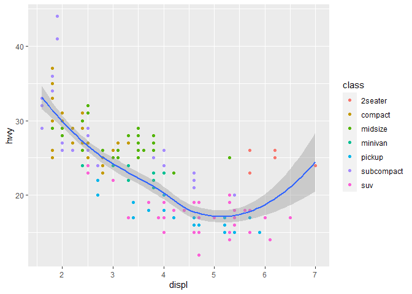<!-- -->


 
You can use the same idea to specify **different data for each layer**. Here, our smooth line displays just a subset of the mpg dataset, the subcompact cars. The local data argument in geom_smooth() overrides the global data argument in ggplot() for that layer only.


```r
ggplot(data = mpg, mapping = aes(x = displ, y = hwy)) + 
  geom_point(mapping = aes(color = class)) + 
  geom_smooth(data = filter(mpg, class == "subcompact"), se = FALSE)
```

```
## `geom_smooth()` using method = 'loess' and formula 'y ~ x'
```

<!-- -->


### 3.7 Statistical transformations
basic bar chart, as drawn with geom_bar(). The following chart displays the total number of diamonds in the diamonds dataset, grouped by cut. The diamonds dataset comes in ggplot2 and contains information about ~54,000 diamonds, including the price, carat, color, clarity, and cut of each diamond. The chart shows that more diamonds are available with high quality cuts than with low quality cuts.


```r
ggplot(data = diamonds) + 
  geom_bar(mapping = aes(x = cut))
```

<!-- -->

On the x-axis, the chart displays cut, a variable from diamonds. On the y-axis, **it displays count, but count is not a variable in diamonds!** Where does count come from? Many graphs, like scatterplots, plot the raw values of your dataset. Other graphs, like bar charts, calculate new values to plot:
•	bar charts, histograms, and frequency polygons bin your data and then plot bin counts, the number of points that fall in each bin.
•	smoothers fit a model to your data and then plot predictions from the model.
•	boxplots compute a robust summary of the distribution and then display a specially formatted box.

**THE STAT** 
ggplot2 provides over 20 stats for you to use. Each stat is a function, so you can get help in the usual way, e.g. ?stat_bin. To see a complete list of stats, try the ggplot2 cheatsheet.


### 3.8 Position adjustments -- stacked, identity, dodge, fill, jitter
You can **colour a bar chart** using either the colour aesthetic, or, more usefully, **fill**:


```r
ggplot(data = diamonds) + 
  geom_bar(mapping = aes(x = cut, colour = cut))
```

<!-- -->

```r
ggplot(data = diamonds) + 
  geom_bar(mapping = aes(x = cut, fill = cut))
```

<!-- -->


  
Note what happens if you map the fill aesthetic to another variable, like clarity: the bars are automatically **stacked**. Each colored rectangle represents a combination of cut and clarity.


```r
ggplot(data = diamonds) + 
  geom_bar(mapping = aes(x = cut, fill = clarity))
```

<!-- -->


 
The **stacking is performed automatically** by the position adjustment specified by the position argument. If you don’t want a stacked bar chart, you can use one of three other options: **"identity", "dodge" or "fill".**
position = "identity" will place each object exactly where it falls in the context of the graph. This is not very useful for bars, because it overlaps them. To see that overlapping we either need to make the bars slightly transparent by setting alpha to a small value, or completely transparent by setting fill = NA.


```r
ggplot(data = diamonds, mapping = aes(x = cut, fill = clarity)) + 
  geom_bar(alpha = 1/5, position = "identity")
```

<!-- -->

```r
ggplot(data = diamonds, mapping = aes(x = cut, colour = clarity)) + 
  geom_bar(fill = NA, position = "identity")
```

<!-- -->

The identity position adjustment is more useful for 2d geoms, like points, where it is the default.
•	position = "fill" works like stacking, but makes each set of stacked bars the same height. This makes it easier to compare proportions across groups.

```r
ggplot(data = diamonds) + 
  geom_bar(mapping = aes(x = cut, fill = clarity), position = "fill")
```

<!-- -->


•	position = "dodge" places overlapping objects directly beside one another. This makes it easier to compare individual values.

```r
ggplot(data = diamonds) + 
  geom_bar(mapping = aes(x = cut, fill = clarity), position = "dodge")
```

<!-- -->

There’s one other type of adjustment that’s not useful for bar charts, but it can be very useful for scatterplots. Recall our first scatterplot. Did you notice that the plot displays only 126 points, even though there are 234 observations in the dataset?
 
position = "jitter" adds a small amount of random noise to each point. This spreads the points out because no two points are likely to receive the same amount of random noise.

```r
ggplot(data = mpg) + 
  geom_point(mapping = aes(x = displ, y = hwy), position = "jitter")
```

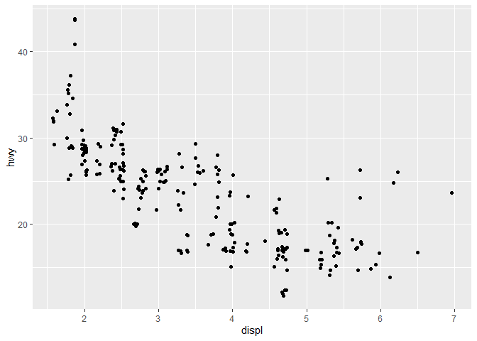<!-- -->
 

### 3.9 Coordinate systems -- coord_flip, quickmap, polar
Coordinate systems are probably the most complicated part of ggplot2. The default coordinate system is the Cartesian coordinate system where the x and y positions act independently to determine the location of each point. There are a number of other coordinate systems that are occasionally helpful.
**coord_flip()** switches the x and y axes. This is useful if you want horizontal boxplots. It’s also useful for long labels 


```r
ggplot(data = mpg, mapping = aes(x = class, y = hwy)) + 
  geom_boxplot()
```

<!-- -->

```r
ggplot(data = mpg, mapping = aes(x = class, y = hwy)) + 
  geom_boxplot() +
  coord_flip()
```

<!-- -->
  
**coord_quickmap()** sets the aspect ratio correctly for maps. 

nz <- map_data("nz")
ggplot(nz, aes(long, lat, group = group)) +
  geom_polygon(fill = "white", colour = "black")
ggplot(nz, aes(long, lat, group = group)) +
  geom_polygon(fill = "white", colour = "black") +
  coord_quickmap()


**coord_polar()** uses polar coordinates. Polar coordinates reveal an interesting connection between a bar chart and a Coxcomb chart.


```r
bar <- ggplot(data = diamonds) + 
  geom_bar(
    mapping = aes(x = cut, fill = cut), 
    show.legend = FALSE,
    width = 1
  ) + 
  theme(aspect.ratio = 1) +
  labs(x = NULL, y = NULL)
	
bar + coord_flip()
```

<!-- -->

```r
bar + coord_polar()
```

<!-- -->


### 3.10 The layered grammar of graphics
In the previous sections, you learned much more than how to make scatterplots, bar charts, and boxplots. You learned a foundation that you can use to make any type of plot with ggplot2. To see this, let’s add position adjustments, stats, coordinate systems, and faceting to our code template:
ggplot(data = <DATA>) + 
  <GEOM_FUNCTION>(
     mapping = aes(<MAPPINGS>),
     stat = <STAT>, 
     position = <POSITION>
  ) +
  <COORDINATE_FUNCTION> +
  <FACET_FUNCTION>
Our new template takes seven parameters, the bracketed words that appear in the template.

## 28 Graphics for communication

### 28.1 Introduction
In exploratory data analysis, you learned how to use plots as tools for exploration. When you make exploratory plots, you know—even before looking—which variables the plot will display. You made each plot for a purpose, could quickly look at it, and then move on to the next plot. In the course of most analyses, you’ll produce tens or hundreds of plots, most of which are immediately thrown away.
Now that you understand your data, you need to communicate your understanding to others. Your audience will likely not share your background knowledge and will not be deeply invested in the data. To help others quickly build up a good mental model of the data, you will need to invest considerable effort in making your plots as self-explanatory as possible. In this chapter, you’ll learn some of the tools that ggplot2 provides to do so.
This chapter focuses on the tools you need to create good graphics. I assume that you know what you want, and just need to know how to do it. For that reason, I highly recommend pairing this chapter with a good general visualisation book. I particularly like The Truthful Art, by Albert Cairo. It doesn’t teach the mechanics of creating visualisations, but instead focuses on what you need to think about in order to create effective graphics.

#### 28.1.1 Prerequisites
In this chapter, we’ll focus once again on ggplot2. We’ll also use a little dplyr for data manipulation, and a few ggplot2 extension packages, including ggrepel and viridis. Rather than loading those extensions here, we’ll refer to their functions explicitly, using the :: notation. This will help make it clear which functions are built into ggplot2, and which come from other packages. Don’t forget you’ll need to install those packages with install.packages() if you don’t already have them.

```r
library(tidyverse)
```

### 28.2 Label -- title, subtitle, caption, axis labels, color = variable
The easiest place to start when turning an exploratory graphic into an expository graphic is with good labels. You add labels with the labs() function. This example adds a plot title:


```r
ggplot(mpg, aes(displ, hwy)) +
  geom_point(aes(color = class)) +
  geom_smooth(se = FALSE) +
  labs(title = "Fuel efficiency generally decreases with engine size")
```

```
## `geom_smooth()` using method = 'loess' and formula 'y ~ x'
```

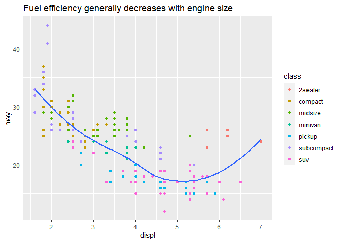<!-- -->


 
The purpose of a plot title is to summarise the main finding. Avoid titles that just describe what the plot is, e.g. “A scatterplot of engine displacement vs. fuel economy”.
If you need to add more text, there are two other useful labels that you can use in ggplot2 2.2.0 and above (which should be available by the time you’re reading this book):
•	**subtitle** adds additional detail in a smaller font beneath the title.
•	**caption** adds text at the bottom right of the plot, often used to describe the source of the data.

```r
ggplot(mpg, aes(displ, hwy)) +
  geom_point(aes(color = class)) +
  geom_smooth(se = FALSE) +
  labs(
    title = "Fuel efficiency generally decreases with engine size",
    subtitle = "   Two seaters (sports cars) are an exception because of their light weight",
    caption = "Data from fueleconomy.gov"
  )
```

```
## `geom_smooth()` using method = 'loess' and formula 'y ~ x'
```

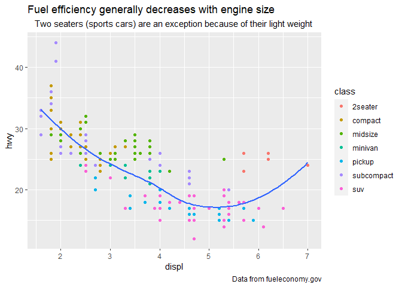<!-- -->

 
You can also use labs() to replace the axis and legend titles. It’s usually a good idea to replace short variable names with more detailed descriptions, and to include the units.

```r
ggplot(mpg, aes(displ, hwy)) +
  geom_point(aes(colour = class)) +
  geom_smooth(se = FALSE) +
  labs(
    x = "Engine displacement (L)",
    y = "Highway fuel economy (mpg)",
    colour = "Car type"
  )
```

```
## `geom_smooth()` using method = 'loess' and formula 'y ~ x'
```

<!-- -->

 
It’s possible to use **mathematical equation** instead of text strings. Just switch "" out for quote() and read about the available options in ?plotmath:

```r
df <- tibble(
  x = runif(10),
  y = runif(10)
)
ggplot(df, aes(x, y)) +
  geom_point() +
  labs(
    x = quote(sum(x[i] ^ 2, i == 1, n)),
    y = quote(alpha + beta + frac(delta, theta))
  )
```

<!-- -->

 
### 28.3 Annotations  -- labelling individual points -- geom_text, geom_label, nudge, ggrepel, 
In addition to labelling major components of your plot, it’s often useful to label individual observations or groups of observations. The first tool you have at your disposal is **geom_text()**. geom_text() is similar to geom_point(), but it has an additional aesthetic: label. This makes it possible to add textual labels to your plots.
There are two possible sources of labels. First, you might have a tibble that provides labels. The plot below isn’t terribly useful, but it illustrates a useful approach: pull out the most efficient car in each class with dplyr, and then label it on the plot:

```r
best_in_class <- mpg %>%
  group_by(class) %>%
  filter(row_number(desc(hwy)) == 1)

ggplot(mpg, aes(displ, hwy)) +
  geom_point(aes(colour = class)) +
  geom_text(aes(label = model), data = best_in_class)
```

<!-- -->

 
This is hard to read because the labels overlap with each other, and with the points. We can make things a little better by switching to **geom_label()** which draws a rectangle behind the text. We also use the **nudge_y** parameter to move the labels slightly above the corresponding points:

```r
ggplot(mpg, aes(displ, hwy)) +
  geom_point(aes(colour = class)) +
  geom_label(aes(label = model), data = best_in_class, nudge_y = 2, alpha = 0.5)
```

<!-- -->

That helps a bit, but if you look closely in the top-left hand corner, you’ll notice that there are two labels practically on top of each other. This happens because the highway mileage and displacement for the best cars in the compact and subcompact categories are exactly the same. There’s no way that we can fix these by applying the same transformation for every label. Instead, we can use the **ggrepel** package by Kamil Slowikowski. This useful package will automatically adjust labels so that they don’t overlap:

```r
ggplot(mpg, aes(displ, hwy)) +
  geom_point(aes(colour = class)) +
  geom_point(size = 3, shape = 1, data = best_in_class) +
  ggrepel::geom_label_repel(aes(label = model), data = best_in_class)
```

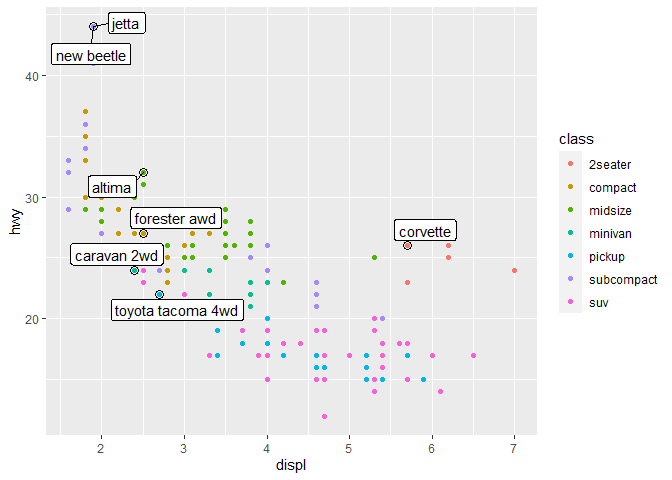<!-- -->

 
Note another handy technique used here: I added a second layer of large, hollow points to highlight the points that I’ve labelled.
You can sometimes use the same idea to replace the legend with labels placed directly on the plot. It’s not wonderful for this plot, but it isn’t too bad. (theme(legend.position = "none") turns the legend off — we’ll talk about it more shortly.)

```r
class_avg <- mpg %>%
  group_by(class) %>%
  summarise(
    displ = median(displ),
    hwy = median(hwy)
  )
```

```
## `summarise()` ungrouping output (override with `.groups` argument)
```

```r
ggplot(mpg, aes(displ, hwy, colour = class)) +
  ggrepel::geom_label_repel(aes(label = class),
    data = class_avg,
    size = 6,
    label.size = 0,
    segment.color = NA
  ) +
  geom_point() +
  theme(legend.position = "none")
```

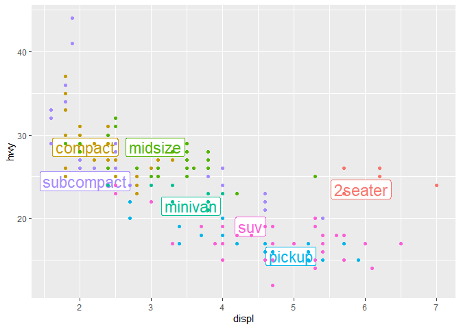<!-- -->

 
Alternatively, you might just want to add a single label to the plot, but you’ll still need to create a data frame. Often, you want the label in the corner of the plot, so it’s convenient to create a new data frame using summarise() to compute the maximum values of x and y.

```r
label <- mpg %>%
  summarise(
    displ = max(displ),
    hwy = max(hwy),
    label = "Increasing engine size is \nrelated to decreasing fuel economy."
  )

ggplot(mpg, aes(displ, hwy)) +
  geom_point() +
  geom_text(aes(label = label), data = label, vjust = "top", hjust = "right")
```

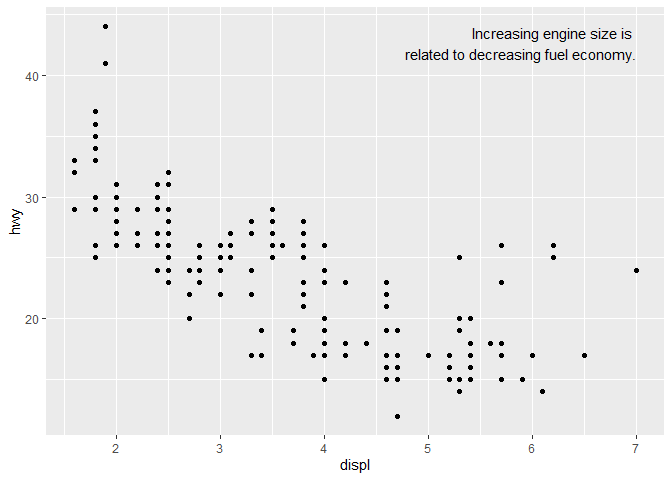<!-- -->

 
If you want to place the text exactly on the borders of the plot, you can use +Inf and -Inf. Since we’re no longer computing the positions from mpg, we can use tibble() to create the data frame:

```r
label <- tibble(
  displ = Inf,
  hwy = Inf,
  label = "Increasing engine size is \nrelated to decreasing fuel economy."
)

ggplot(mpg, aes(displ, hwy)) +
  geom_point() +
  geom_text(aes(label = label), data = label, vjust = "top", hjust = "right")
```

<!-- -->

 
In these examples, I manually broke the label up into lines using "\n". Another approach is to use stringr::str_wrap() to automatically add line breaks, given the number of characters you want per line:
"Increasing engine size is related to decreasing fuel economy." %>%
  stringr::str_wrap(width = 40) %>%
  writeLines()
#> Increasing engine size is related to
#> decreasing fuel economy.
Note the use of hjust and vjust to control the alignment of the label. Figure 28.1 shows all nine possible combinations.
 
Figure 28.1: All nine combinations of hjust and vjust.
Remember, in addition to geom_text(), you have many other geoms in ggplot2 available to help annotate your plot. A few ideas:
•	Use **geom_hline() and geom_vline()** to add reference lines. I often make them thick (size = 2) and white (colour = white), and draw them underneath the primary data layer. That makes them easy to see, without drawing attention away from the data.
•	Use **geom_rect()** to draw a rectangle around points of interest. The boundaries of the rectangle are defined by aesthetics xmin, xmax, ymin, ymax.
•	Use **geom_segment()** with the arrow argument to draw attention to a point with an arrow. Use aesthetics x and y to define the starting location, and xend and yend to define the end location.


### 28.4 Scales -- continuous, discrete, datetime, or date.  Ticks Marks and Legends
The third way you can make your plot better for communication is to adjust the scales. Scales control the mapping from data values to things that you can perceive. Normally, ggplot2 automatically adds scales for you. For example, when you type:
#```{r}
ggplot(mpg, aes(displ, hwy)) +
  geom_point(aes(colour = class))
ggplot2 automatically adds default scales behind the scenes:
ggplot(mpg, aes(displ, hwy)) +
  geom_point(aes(colour = class)) +
  scale_x_continuous() +
  scale_y_continuous() +
  scale_colour_discrete()
#```

Note the naming scheme for scales: scale_ followed by the name of the aesthetic, then _, then the name of the scale. The default scales are named according to the type of variable they align with: continuous, discrete, datetime, or date. There are lots of non-default scales which you’ll learn about below.
The default scales have been carefully chosen to do a good job for a wide range of inputs. Nevertheless, you might want to override the defaults for two reasons:
•	You might want to tweak some of the parameters of the default scale. This allows you to do things like change the breaks on the axes, or the key labels on the legend.
•	You might want to replace the scale altogether, and use a completely different algorithm. Often you can do better than the default because you know more about the data.

#### 28.4.1 Axis ticks and legend keys
There are two primary arguments that affect the appearance of the ticks on the axes and the keys on the legend: breaks and labels. **Breaks** controls the position of the ticks, or the values associated with the keys. **Labels** controls the text label associated with each tick/key. The most common use of breaks is to override the default choice:

```r
ggplot(mpg, aes(displ, hwy)) +
  geom_point() +
  scale_y_continuous(breaks = seq(15, 40, by = 5))
```

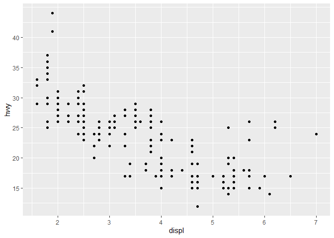<!-- -->

 
You can use labels in the same way (a character vector the same length as breaks), but you can also set it to **NULL to suppress the labels** altogether. This is useful for maps, or for publishing plots where you can’t share the absolute numbers.

```r
ggplot(mpg, aes(displ, hwy)) +
  geom_point() +
  scale_x_continuous(labels = NULL) +
  scale_y_continuous(labels = NULL)
```

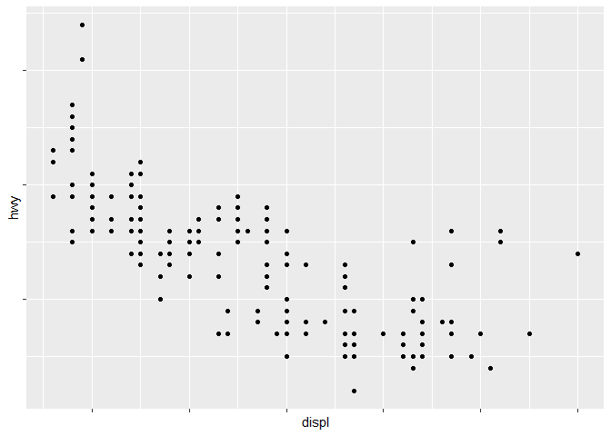<!-- -->

 
You can also use breaks and labels to control the appearance of legends. Collectively axes and legends are called guides. Axes are used for x and y aesthetics; legends are used for everything else.
Another use of breaks is when you have relatively few data points and want to highlight exactly where the observations occur. For example, take this plot that shows when each US president started and ended their term.

```r
presidential %>%
  mutate(id = 33 + row_number()) %>%
  ggplot(aes(start, id)) +
    geom_point() +
    geom_segment(aes(xend = end, yend = id)) +
    scale_x_date(NULL, breaks = presidential$start, date_labels = "'%y")
```

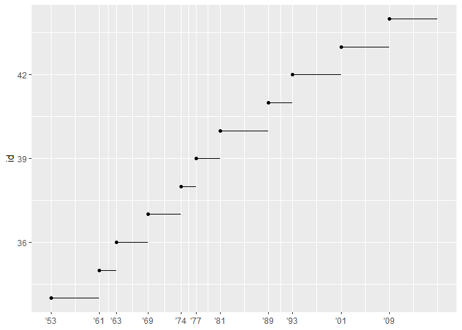<!-- -->

 
Note that the specification of breaks and labels for date and datetime scales is a little different:
•	date_labels takes a format specification, in the same form as parse_datetime().
•	date_breaks (not shown here), takes a string like “2 days” or “1 month”.

#### 28.4.2 Legend layout  position: top, bottom, left, right, none
You will most often use breaks and labels to tweak the axes. While they both also work for legends, there are a few other techniques you are more likely to use.
To control the overall position of the legend, you need to use a theme() setting. We’ll come back to themes at the end of the chapter, but in brief, they control the non-data parts of the plot. The theme setting legend.position controls where the legend is drawn:

```r
base <- ggplot(mpg, aes(displ, hwy)) +
  geom_point(aes(colour = class))

base + theme(legend.position = "left")
```

<!-- -->

```r
base + theme(legend.position = "top")
```

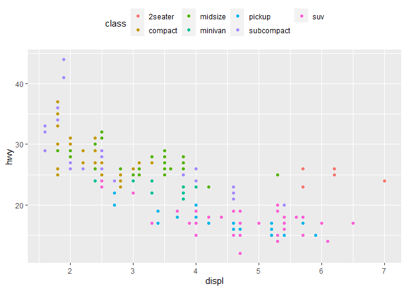<!-- -->

```r
base + theme(legend.position = "bottom")
```

<!-- -->

```r
base + theme(legend.position = "right") # the default
```

<!-- -->

    
You can also use **legend.position = "none" to suppress** the display of the legend altogether.
To control the display of individual legends, use guides() along with guide_legend() or guide_colourbar(). The following example shows two important settings: controlling the number of rows the legend uses with nrow, and overriding one of the aesthetics to make the points bigger. This is particularly useful if you have used a low alpha to display many points on a plot.

```r
ggplot(mpg, aes(displ, hwy)) +
  geom_point(aes(colour = class)) +
  geom_smooth(se = FALSE) +
  theme(legend.position = "bottom") +
  guides(colour = guide_legend(nrow = 1, override.aes = list(size = 4)))
```

```
## `geom_smooth()` using method = 'loess' and formula 'y ~ x'
```

<!-- -->

```r
#> `geom_smooth()` using method = 'loess' and formula 'y ~ x'
```

 
#### 28.4.3 Replacing a scale -- log transformations
Instead of just tweaking the details a little, you can instead replace the scale altogether. There are two types of scales you’re mostly likely to want to switch out: continuous position scales and colour scales. Fortunately, the same principles apply to all the other aesthetics, so once you’ve mastered position and colour, you’ll be able to quickly pick up other scale replacements.
It’s very useful to   **plot transformations** of your variable. For example, as we’ve seen in diamond prices it’s easier to see the precise relationship between carat and price if we log transform them:

```r
ggplot(diamonds, aes(carat, price)) +
  geom_bin2d()
```

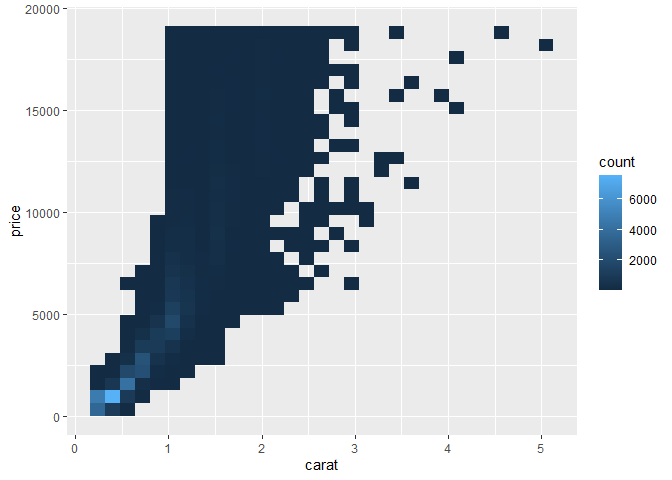<!-- -->

```r
ggplot(diamonds, aes(log10(carat), log10(price))) +
  geom_bin2d()
```

<!-- -->

  
However, the disadvantage of this transformation is that the axes are now labelled with the transformed values, making it hard to interpret the plot. Instead of doing the transformation in the aesthetic mapping, we can instead do it with the scale. This is visually identical, except the axes are labelled on the original data scale.

```r
ggplot(diamonds, aes(carat, price)) +
  geom_bin2d() + 
  scale_x_log10() + 
  scale_y_log10()
```

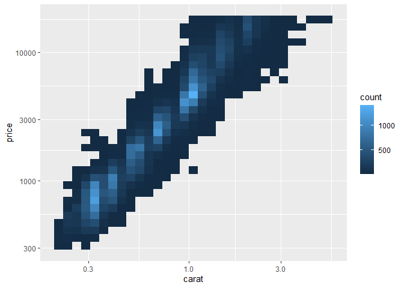<!-- -->

 
Another scale that is frequently customised is **colour**. The default categorical scale picks colours that are evenly spaced around the colour wheel. Useful alternatives are the **ColorBrewer** scales which have been hand tuned to work better for people with common types of colour blindness. The two plots below look similar, but there is enough difference in the shades of red and green that the dots on the right can be distinguished even by people with red-green colour blindness.

```r
ggplot(mpg, aes(displ, hwy)) +
  geom_point(aes(color = drv))
```

<!-- -->

```r
ggplot(mpg, aes(displ, hwy)) +
  geom_point(aes(color = drv)) +
  scale_colour_brewer(palette = "Set1")
```

<!-- -->

Don’t forget simpler techniques. If there are just a few colours, you can add a redundant shape mapping. This will also help ensure your plot is interpretable in black and white.

```r
ggplot(mpg, aes(displ, hwy)) +
  geom_point(aes(color = drv, shape = drv)) +
  scale_colour_brewer(palette = "Set1")
```

<!-- -->

 
The ColorBrewer scales are documented online at http://colorbrewer2.org/ and made available in R via the RColorBrewer package, by Erich Neuwirth. Figure 28.2 shows the complete list of all palettes. The sequential (top) and diverging (bottom) palettes are particularly useful if your categorical values are ordered, or have a “middle”. This often arises if you’ve used cut() to make a continuous variable into a categorical variable.
 
Figure 28.2: All ColourBrewer scales.
When you have a predefined mapping between values and colours, use scale_colour_manual(). For example, if we map presidential party to colour, we want to use the standard mapping of red for Republicans and blue for Democrats:

```r
presidential %>%
  mutate(id = 33 + row_number()) %>%
  ggplot(aes(start, id, colour = party)) +
    geom_point() +
    geom_segment(aes(xend = end, yend = id)) +
    scale_colour_manual(values = c(Republican = "red", Democratic = "blue"))
```

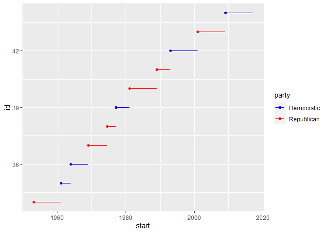<!-- -->

For **continuous colour gradient**, you can use the built-in scale_colour_gradient() or scale_fill_gradient(). If you have a diverging scale, you can use scale_colour_gradient2(). That allows you to give, for example, positive and negative values different colours. That’s sometimes also useful if you want to distinguish points above or below the mean.
Another option is scale_colour_viridis() provided by the viridis package. It’s a continuous analog of the categorical ColorBrewer scales. The designers, Nathaniel Smith and Stéfan van der Walt, carefully tailored a continuous colour scheme that has good perceptual properties. Here’s an example from the viridis vignette.

```r
df <- tibble(
  x = rnorm(10000),
  y = rnorm(10000)
)
ggplot(df, aes(x, y)) +
  geom_hex() +
  coord_fixed()
```

```
## Warning: Computation failed in `stat_binhex()`:
##   Package `hexbin` required for `stat_binhex`.
##   Please install and try again.
```

<!-- -->

```r
ggplot(df, aes(x, y)) +
  geom_hex() +
  viridis::scale_fill_viridis() +
  coord_fixed()
```

```
## Warning: Computation failed in `stat_binhex()`:
##   Package `hexbin` required for `stat_binhex`.
##   Please install and try again.
```

<!-- -->

  
Note that all colour scales come in two variety: **scale_colour_x() and scale_fill_x()** for the colour and fill aesthetics respectively (the colour scales are available in both UK and US spellings).


### 28.5 Zooming  
There are three ways to control the plot limits:
1.	Adjusting what data are plotted
2.	Setting the limits in each scale
3.	Setting xlim and ylim in coord_cartesian()
To zoom in on a region of the plot, it’s generally best to use coord_cartesian(). Compare the following two plots:

```r
library(ggplot2)
ggplot(mpg, mapping = aes(displ, hwy)) +
  geom_point(aes(color = class)) +
  geom_smooth() +
  coord_cartesian(xlim = c(5, 7), ylim = c(10, 30))
```

```
## `geom_smooth()` using method = 'loess' and formula 'y ~ x'
```

<!-- -->

```r
#Error in mpg %>% filter(displ >= 5, displ <= 7, hwy >= 10, hwy <= 30) %>%  : 
#  could not find function "%>%"
#mpg %>%     
#  filter(displ >= 5, displ <= 7, hwy >= 10, hwy <= 30) %>%
#  ggplot(aes(displ, hwy)) +
#  geom_point(aes(color = class)) +
#  geom_smooth()
```

You can also set the limits on individual scales. Reducing the limits is basically equivalent to subsetting the data. It is generally more useful if you want expand the limits, for example, to match scales across different plots. For example, if we extract two classes of cars and plot them separately, it’s difficult to compare the plots because all three scales (the x-axis, the y-axis, and the colour aesthetic) have different ranges.

```r
suv <- mpg %>% filter(class == "suv")
compact <- mpg %>% filter(class == "compact")

ggplot(suv, aes(displ, hwy, colour = drv)) +
  geom_point()
```

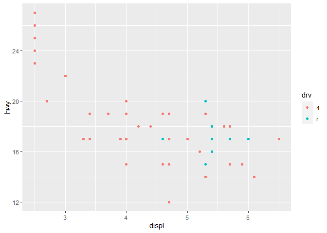<!-- -->

```r
ggplot(compact, aes(displ, hwy, colour = drv)) +
  geom_point()
```

<!-- -->

  
One way to overcome this problem is to share scales across multiple plots, training the scales with the limits of the full data.

```r
x_scale <- scale_x_continuous(limits = range(mpg$displ))
y_scale <- scale_y_continuous(limits = range(mpg$hwy))
col_scale <- scale_colour_discrete(limits = unique(mpg$drv))

ggplot(suv, aes(displ, hwy, colour = drv)) +
  geom_point() +
  x_scale +
  y_scale +
  col_scale
```

<!-- -->

```r
ggplot(compact, aes(displ, hwy, colour = drv)) +
  geom_point() +
  x_scale +
  y_scale +
  col_scale
```

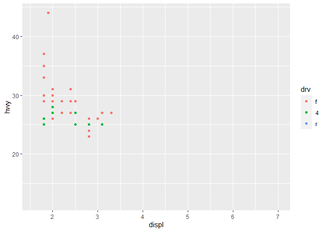<!-- -->

  
In this particular case, you could have simply used faceting, but this technique is useful more generally, if for instance, you want spread plots over multiple pages of a report.

### 28.6 Themes -- 8 built-in themes
Finally, you can customise the non-data elements of your plot with a theme:

```r
ggplot(mpg, aes(displ, hwy)) +
  geom_point(aes(color = class)) +
  geom_smooth(se = FALSE) +
  theme_bw()
```

```
## `geom_smooth()` using method = 'loess' and formula 'y ~ x'
```

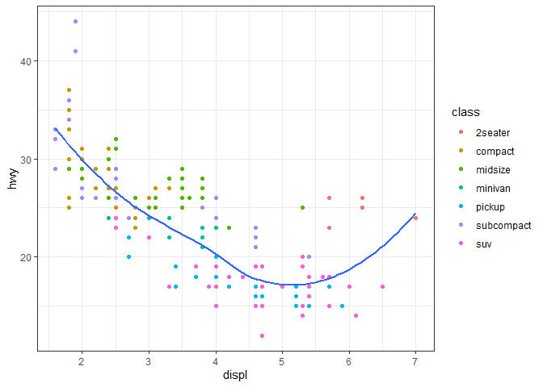<!-- -->

 
ggplot2 includes eight themes by default, as shown in Figure 28.3. Many more are included in add-on packages like ggthemes (https://github.com/jrnold/ggthemes), by Jeffrey Arnold.
 
Figure 28.3: The eight themes built-in to ggplot2.
Many people wonder why the default theme has a grey background. This was a deliberate choice because it puts the data forward while still making the grid lines visible. The white grid lines are visible (which is important because they significantly aid position judgements), but they have little visual impact and we can easily tune them out. The grey background gives the plot a similar typographic colour to the text, ensuring that the graphics fit in with the flow of a document without jumping out with a bright white background. Finally, the grey background creates a continuous field of colour which ensures that the plot is perceived as a single visual entity.
It’s also possible to control individual components of each theme, like the size and colour of the font used for the y axis. Unfortunately, this level of detail is outside the scope of this book, so you’ll need to read the ggplot2 book for the full details. You can also create your own themes, if you are trying to match a particular corporate or journal style.

### 28.7 Saving your plots -- ggsave overwrites without asking
There are two main ways to get your plots out of R and into your final write-up: ggsave() and knitr. ggsave() will save the most recent plot to disk:


```r
ggplot(mpg, aes(displ, hwy)) + geom_point()
```

<!-- -->

```r
ggsave("my-plot.pdf")
```

```
## Saving 7 x 5 in image
```

If you don’t specify the width and height they will be taken from the dimensions of the current plotting device. For reproducible code, you’ll want to specify them.
Generally, however, I think you should be assembling your final reports using R Markdown, so I want to focus on the important code chunk options that you should know about for graphics. You can learn more about ggsave() in the documentation.

#### 28.7.1 Figure sizing -- to a png
The biggest challenge of graphics in R Markdown is getting your figures the right size and shape. There are five main options that control figure sizing: fig.width, fig.height, fig.asp, out.width and out.height. Image sizing is challenging because there are two sizes (the size of the figure created by R and the size at which it is inserted in the output document), and multiple ways of specifying the size (i.e., height, width, and aspect ratio: pick two of three).
I only ever use three of the five options:
•	I find it most aesthetically pleasing for plots to have a consistent width. To enforce this, I set fig.width = 6 (6") and fig.asp = 0.618 (the golden ratio) in the defaults. Then in individual chunks, I only adjust fig.asp.
•	I control the output size with out.width and set it to a percentage of the line width. I default to out.width = "70%" and fig.align = "center". That give plots room to breathe, without taking up too much space.
•	To put multiple plots in a single row I set the out.width to 50% for two plots, 33% for 3 plots, or 25% to 4 plots, and set fig.align = "default". Depending on what I’m trying to illustrate ( e.g. show data or show plot variations), I’ll also tweak fig.width, as discussed below.
If you find that you’re having to squint to read the text in your plot, you need to tweak fig.width. If fig.width is larger than the size the figure is rendered in the final doc, the text will be too small; if fig.width is smaller, the text will be too big. You’ll often need to do a little experimentation to figure out the right ratio between the fig.width and the eventual width in your document. To illustrate the principle, the following three plots have fig.width of 4, 6, and 8 respectively:
   
If you want to make sure the font size is consistent across all your figures, whenever you set out.width, you’ll also need to adjust fig.width to maintain the same ratio with your default out.width. For example, if your default fig.width is 6 and out.width is 0.7, when you set out.width = "50%" you’ll need to set fig.width to 4.3 (6 * 0.5 / 0.7).

#### 28.7.2 Other important options -- fig hold, fig captions, 
When mingling code and text, like I do in this book, I recommend setting **fig.show = "hold" so that plots are shown after the code**. This has the pleasant side effect of forcing you to break up large blocks of code with their explanations.
To add a caption to the plot, use fig.cap. In R Markdown this will change the figure from inline to “floating”.
If you’re producing PDF output, the default graphics type is PDF. This is a good default because PDFs are high quality vector graphics. However, they can produce very large and slow plots if you are displaying thousands of points. In that case, set dev = "png" to force the use of PNGs. They are slightly lower quality, but will be much more compact.
It’s a good idea to name code chunks that produce figures, even if you don’t routinely label other chunks. The chunk label is used to generate the file name of the graphic on disk, so naming your chunks makes it much easier to pick out plots and reuse in other circumstances (i.e. if you want to quickly drop a single plot into an email or a tweet).

### 28.8 Learning more
The absolute best place to learn more is the ggplot2 book: ggplot2: Elegant graphics for data analysis. It goes into much more depth about the underlying theory, and has many more examples of how to combine the individual pieces to solve practical problems. Unfortunately, the book is not available online for free, although you can find the source code at https://github.com/hadley/ggplot2-book.
Another great resource is the ggplot2 extensions gallery https://exts.ggplot2.tidyverse.org/gallery/. This site lists many of the packages that extend ggplot2 with new geoms and scales. It’s a great place to start if you’re trying to do something that seems hard with ggplot2.

## 6 Workflow: scripts
So far you’ve been using the console to run code. That’s a great place to start, but you’ll find it gets cramped pretty quickly as you create more complex ggplot2 graphics and dplyr pipes. To give yourself more room to work, it’s a great idea to use the script editor. Open it up either by clicking the File menu, and selecting New File, then R script, or using the keyboard shortcut Cmd/Ctrl + Shift + N. Now you’ll see four panes:
 
The script editor is a great place to put code you care about. Keep experimenting in the console, but once you have written code that works and does what you want, put it in the script editor. RStudio will automatically save the contents of the editor when you quit RStudio, and will automatically load it when you re-open. Nevertheless, it’s a good idea to save your scripts regularly and to back them up.

### 6.1 Running code
The script editor is also a great place to build up complex ggplot2 plots or long sequences of dplyr manipulations. The key to using the script editor effectively is to memorise one of the most important keyboard shortcuts: Cmd/Ctrl + Enter. This executes the current R expression in the console. For example, take the code below. If your cursor is at █, pressing Cmd/Ctrl + Enter will run the complete command that generates not_cancelled. It will also move the cursor to the next statement (beginning with not_cancelled %>%). That makes it easy to run your complete script by repeatedly pressing Cmd/Ctrl + Enter.
library(dplyr)
library(nycflights13)

not_cancelled <- flights %>% 
  filter(!is.na(dep_delay)█, !is.na(arr_delay))

not_cancelled %>% 
  group_by(year, month, day) %>% 
  summarise(mean = mean(dep_delay))
Instead of running expression-by-expression, you can also execute the complete script in one step: Cmd/Ctrl + Shift + S. Doing this regularly is a great way to check that you’ve captured all the important parts of your code in the script.
I recommend that you always start your script with the packages that you need. That way, if you share your code with others, they can easily see what packages they need to install. Note, however, that you should never include install.packages() or setwd() in a script that you share. It’s very antisocial to change settings on someone else’s computer!
When working through future chapters, I highly recommend starting in the editor and practicing your keyboard shortcuts. Over time, sending code to the console in this way will become so natural that you won’t even think about it.

### 6.2 RStudio diagnostics
The script editor will also highlight syntax errors with a red squiggly line and a cross in the sidebar:
 
Hover over the cross to see what the problem is:
 
RStudio will also let you know about potential problems:
 
### 6.3 Exercises
1.	Go to the RStudio Tips twitter account, https://twitter.com/rstudiotips and find one tip that looks interesting. Practice using it!
2.	What other common mistakes will RStudio diagnostics report? Read https://support.rstudio.com/hc/en-us/articles/205753617-Code-Diagnostics to find out.

## 11 Data import

### 11.1 Introduction
how to read plain-text rectangular files into R. 

#### 11.1.1 Prerequisites

```r
library(tidyverse)
```


### 11.2 Reading in the Data Getting started -- Readr as opposed to read_csv()
Most of readr’s functions are concerned with turning flat files into data frames:
•	**read_csv()** reads comma delimited files, read_csv2() reads semicolon separated files (common in countries where , is used as the decimal place), read_tsv() reads tab delimited files, and **read_delim()** reads in files with any delimiter.
•	**read_fwf()** reads fixed width files. You can specify fields either by their widths with fwf_widths() or their position with fwf_positions(). read_table() reads a common variation of fixed width files where columns are separated by white space.
•	read_log() reads Apache style log files. (But also check out webreadr which is built on top of read_log() and provides many more helpful tools.)

The first argument to read_csv() is the most important: it’s the path to the file to read.

```r
## this file is not in E/...week03 working directory.  heights <- read_csv("data/heights.csv")
```

When you run read_csv() it prints out a column specification that gives the name and type of each column. That’s an important part of readr, which we’ll come back to in parsing a file.
You can also supply an inline csv file. This is useful for experimenting with readr and for creating reproducible examples to share with others:


```r
read_csv("a,b,c
1,2,3
4,5,6")
```

```
## # A tibble: 2 x 3
##       a     b     c
##   <dbl> <dbl> <dbl>
## 1     1     2     3
## 2     4     5     6
```
In both cases read_csv() uses the first line of the data for the column names, which is a very common convention. There are two cases where you might want to tweak this behaviour:
1.	Sometimes there are a few lines of metadata at the top of the file. You can use skip = n to skip the first n lines; or use comment = "#" to drop all lines that start with (e.g.) #.

```r
read_csv("The first line of metadata
  The second line of metadata
  x,y,z
  1,2,3", skip = 2)
```

```
## # A tibble: 1 x 3
##       x     y     z
##   <dbl> <dbl> <dbl>
## 1     1     2     3
```

```r
	read_csv("# A comment I want to skip
	  x,y,z
	  1,2,3", comment = "#")
```

```
## # A tibble: 1 x 3
##       x     y     z
##   <dbl> <dbl> <dbl>
## 1     1     2     3
```
The data might not have column names. You can use col_names = FALSE to tell read_csv() not to treat the first row as headings, and instead label them sequentially from X1 to Xn:

```r
read_csv("1,2,3\n4,5,6", col_names = FALSE)
```

```
## # A tibble: 2 x 3
##      X1    X2    X3
##   <dbl> <dbl> <dbl>
## 1     1     2     3
## 2     4     5     6
```
("\n" is a **convenient shortcut** for adding a new line. You’ll learn more about it and other types of string escape in string basics.)
Alternatively you can pass col_names a character vector which will be used as the column names:

```r
read_csv("1,2,3\n4,5,6", col_names = c("x", "y", "z"))
```

```
## # A tibble: 2 x 3
##       x     y     z
##   <dbl> <dbl> <dbl>
## 1     1     2     3
## 2     4     5     6
```
Another option that commonly needs tweaking is na: this specifies the value (or values) that are used to represent missing values in your file:

```r
read_csv("a,b,c\n1,2,.", na = ".")
```

```
## # A tibble: 1 x 3
##       a     b c    
##   <dbl> <dbl> <lgl>
## 1     1     2 NA
```
This is all you need to know to read ~75% of CSV files that you’ll encounter in practice. You can also easily adapt what you’ve learned to read tab separated files with read_tsv() and fixed width files with read_fwf(). To read in more challenging files, you’ll need to learn more about how readr parses each column, turning them into R vectors.

#### 11.2.1 Compared to base R
If you’ve used R before, you might wonder why we’re not using read.csv(). There are a few good reasons to favour readr functions over the base equivalents:
•	They are typically much faster (~10x) than their base equivalents. Long running jobs have a progress bar, so you can see what’s happening. If you’re looking for raw speed, try data.table::fread(). It doesn’t fit quite so well into the tidyverse, but it can be quite a bit faster.
•	They produce tibbles, they don’t convert character vectors to factors, use row names, or munge the column names. These are common sources of frustration with the base R functions.
•	They are more reproducible. Base R functions inherit some behaviour from your operating system and environment variables, so import code that works on your computer might not work on someone else’s.


### 11.3 Parsing a vector -- parse and recharacterize the data type for each column,variable
Before we get into the details of how readr reads files from disk, we need to take a little detour to talk about the parse_*() functions. These functions take a character vector and return a more specialised vector like a logical, integer, or date:

```r
str(parse_logical(c("TRUE", "FALSE", "NA")))
```

```
##  logi [1:3] TRUE FALSE NA
```


```r
str(parse_integer(c("1", "2", "3")))
```

```
##  int [1:3] 1 2 3
```


```r
str(parse_date(c("2010-01-01", "1979-10-14")))
```

```
##  Date[1:2], format: "2010-01-01" "1979-10-14"
```


These functions are useful in their own right, but are also an important building block for readr. Once you’ve learned how the individual parsers work in this section, we’ll circle back and see how they fit together to parse a complete file in the next section.
Like all functions in the tidyverse, the parse_*() functions are uniform: the first argument is a character vector to parse, and the na argument specifies which strings should be treated as missing:

```r
parse_integer(c("1", "231", ".", "456"), na = ".")
```

```
## [1]   1 231  NA 456
```


If parsing fails, you’ll get a warning:

```r
x <- parse_integer(c("123", "345", "abc", "123.45"))
```

```
## Warning: 2 parsing failures.
## row col               expected actual
##   3  -- an integer                abc
##   4  -- no trailing characters    .45
```


And the failures will be missing in the output:

```r
x
```

```
## [1] 123 345  NA  NA
## attr(,"problems")
## # A tibble: 2 x 4
##     row   col expected               actual
##   <int> <int> <chr>                  <chr> 
## 1     3    NA an integer             abc   
## 2     4    NA no trailing characters .45
```


If there are many parsing failures, you’ll need to use problems() to get the complete set. This returns a tibble, which you can then manipulate with dplyr.

```r
problems(x)
```

```
## # A tibble: 2 x 4
##     row   col expected               actual
##   <int> <int> <chr>                  <chr> 
## 1     3    NA an integer             abc   
## 2     4    NA no trailing characters .45
```


Using parsers is mostly a matter of understanding what’s available and how they deal with different types of input. There are eight particularly important parsers:
1.	parse_logical() and parse_integer() parse logicals and integers respectively. There’s basically nothing that can go wrong with these parsers so I won’t describe them here further.
2.	parse_double() is a strict numeric parser, and parse_number() is a flexible numeric parser. These are more complicated than you might expect because different parts of the world write numbers in different ways.
3.	parse_character() seems so simple that it shouldn’t be necessary. But one complication makes it quite important: character encodings.
4.	parse_factor() create factors, the data structure that R uses to represent categorical variables with fixed and known values.
5.	parse_datetime(), parse_date(), and parse_time() allow you to parse various date & time specifications. These are the most complicated because there are so many different ways of writing dates.
The following sections describe these parsers in more detail.

#### 11.3.1 Numbers - commas, decimals, dollar signs
It seems like it should be straightforward to parse a number, but three problems make it tricky:
1.	People write numbers differently in different parts of the world. For example, some countries use . in between the integer and fractional parts of a real number, while others use ,.
2.	Numbers are often surrounded by other characters that provide some context, like “$1000” or “10%”.
3.	Numbers often contain “grouping” characters to make them easier to read, like “1,000,000”, and these grouping characters vary around the world.
To address the first problem, readr has the notion of a “locale”, an object that specifies parsing options that differ from place to place. When parsing numbers, the most important option is the character you use for the decimal mark. You can override the default value of . by creating a new locale and setting the decimal_mark argument:

```r
parse_double("1.23")
```

```
## [1] 1.23
```


```r
parse_double("1,23", locale = locale(decimal_mark = ","))
```

```
## [1] 1.23
```


readr’s default locale is US-centric, because generally R is US-centric (i.e. the documentation of base R is written in American English). An alternative approach would be to try and guess the defaults from your operating system. This is hard to do well, and, more importantly, makes your code fragile: even if it works on your computer, it might fail when you email it to a colleague in another country.
parse_number() addresses the second problem: it ignores non-numeric characters before and after the number. This is particularly useful for currencies and percentages, but also works to extract numbers embedded in text.

```r
parse_number("$100")
```

```
## [1] 100
```


```r
parse_number("20%")
```

```
## [1] 20
```


```r
parse_number("It cost $123.45")
```

```
## [1] 123.45
```

The final problem is addressed by the combination of parse_number() and the locale as parse_number() will ignore the “grouping mark”:
# Used in America

```r
parse_number("$123,456,789")
```

```
## [1] 123456789
```


# Used in many parts of Europe

```r
parse_number("123.456.789", locale = locale(grouping_mark = "."))
```

```
## [1] 123456789
```


# Used in Switzerland

```r
parse_number("123'456'789", locale = locale(grouping_mark = "'"))
```

```
## [1] 123456789
```


#### 11.3.2 Strings
It seems like parse_character() should be really simple — it could just return its input. Unfortunately life isn’t so simple, as there are multiple ways to represent the same string. To understand what’s going on, we need to dive into the details of how computers represent strings. In R, we can get at the underlying representation of a string using charToRaw():

```r
charToRaw("Hadley")
```

```
## [1] 48 61 64 6c 65 79
```

Each hexadecimal number represents a byte of information: 48 is H, 61 is a, and so on. The mapping from hexadecimal number to character is called the encoding, and in this case the encoding is called ASCII. ASCII does a great job of representing English characters, because it’s the American Standard Code for Information Interchange.
Things get more complicated for languages other than English. In the early days of computing there were many competing standards for encoding non-English characters, and to correctly interpret a string you needed to know both the values and the encoding. For example, two common encodings are Latin1 (aka ISO-8859-1, used for Western European languages) and Latin2 (aka ISO-8859-2, used for Eastern European languages). In Latin1, the byte b1 is “±”, but in Latin2, it’s “ą”! Fortunately, today there is one standard that is supported almost everywhere: UTF-8. UTF-8 can encode just about every character used by humans today, as well as many extra symbols (like emoji!).
readr uses UTF-8 everywhere: it assumes your data is UTF-8 encoded when you read it, and always uses it when writing. This is a good default, but will fail for data produced by older systems that don’t understand UTF-8. If this happens to you, your strings will look weird when you print them. Sometimes just one or two characters might be messed up; other times you’ll get complete gibberish. For example:

```r
x1 <- "El Ni\xf1o was particularly bad this year"
x2 <- "\x82\xb1\x82\xf1\x82\xc9\x82\xbf\x82\xcd"

x1
```

```
## [1] "El Niño was particularly bad this year"
```


```r
x2
```

```
## [1] "‚±‚ñ‚É‚¿‚Í"
```


To fix the problem you need to specify the encoding in parse_character():

```r
parse_character(x1, locale = locale(encoding = "Latin1"))
```

```
## [1] "El Niño was particularly bad this year"
```


```r
parse_character(x2, locale = locale(encoding = "Shift-JIS"))
```

```
## [1] "<U+3053><U+3093><U+306B><U+3061><U+306F>"
```

How do you find the correct encoding? If you’re lucky, it’ll be included somewhere in the data documentation. Unfortunately, that’s rarely the case, so readr provides guess_encoding() to help you figure it out. It’s not foolproof, and it works better when you have lots of text (unlike here), but it’s a reasonable place to start. Expect to try a few different encodings before you find the right one.

```r
guess_encoding(charToRaw(x1))
```

```
## # A tibble: 2 x 2
##   encoding   confidence
##   <chr>           <dbl>
## 1 ISO-8859-1       0.46
## 2 ISO-8859-9       0.23
```


```r
guess_encoding(charToRaw(x2))
```

```
## # A tibble: 1 x 2
##   encoding confidence
##   <chr>         <dbl>
## 1 KOI8-R         0.42
```

The first argument to guess_encoding() can either be a path to a file, or, as in this case, a raw vector (useful if the strings are already in R).
Encodings are a rich and complex topic, and I’ve only scratched the surface here. If you’d like to learn more I’d recommend reading the detailed explanation at http://kunststube.net/encoding/.

#### 11.3.3 Factors -- variables with a set menu of possible values
R uses **factors to represent categorical variables that have a known set of possible values**. Give parse_factor() a vector of known levels to generate a warning whenever an unexpected value is present:

```r
fruit <- c("apple", "banana")
parse_factor(c("apple", "banana", "bananana"), levels = fruit)
```

```
## Warning: 1 parsing failure.
## row col           expected   actual
##   3  -- value in level set bananana
```

```
## [1] apple  banana <NA>  
## attr(,"problems")
## # A tibble: 1 x 4
##     row   col expected           actual  
##   <int> <int> <chr>              <chr>   
## 1     3    NA value in level set bananana
## Levels: apple banana
```

But if you have many problematic entries, it’s often easier to leave as character vectors and then use the tools you’ll learn about in strings and factors to clean them up.

#### 11.3.4 Dates, date-times, and times
You pick between **three parsers** depending on whether you want a date (the number of days since 1970-01-01), a date-time (the number of seconds since midnight 1970-01-01), or a time (the number of seconds since midnight). When called without any additional arguments:
•	parse_datetime() expects an ISO8601 date-time. ISO8601 is an international standard in which the components of a date are organised from biggest to smallest: year, month, day, hour, minute, second.

```r
parse_datetime("2010-10-01T2010")
```

```
## [1] "2010-10-01 20:10:00 UTC"
```

•	#> [1] "2010-10-01 20:10:00 UTC"
•	# If time is omitted, it will be set to midnight

```r
parse_datetime("20101010")
```

```
## [1] "2010-10-10 UTC"
```


This is the most important date/time standard, and if you work with dates and times frequently, I recommend reading https://en.wikipedia.org/wiki/ISO_8601
•	parse_date() expects a four digit year, a - or /, the month, a - or /, then the day:

```r
parse_date("2010-10-01")
```

```
## [1] "2010-10-01"
```


•	parse_time() expects the hour, :, minutes, optionally : and seconds, and an optional am/pm specifier:
•	library(hms)
•	parse_time("01:10 am")
•	#> 01:10:00

```r
parse_time("20:10:01")
```

```
## 20:10:01
```


Base R doesn’t have a great built in class for time data, so we use the one provided in the hms package.
If these defaults don’t work for your data you can supply your own date-time format, built up of the following pieces:
Year
%Y (4 digits).
%y (2 digits); 00-69 -> 2000-2069, 70-99 -> 1970-1999.
Month
%m (2 digits).
%b (abbreviated name, like “Jan”).
%B (full name, “January”).
Day
%d (2 digits).
%e (optional leading space).
Time
%H 0-23 hour.
%I 0-12, must be used with %p.
%p AM/PM indicator.
%M minutes.
%S integer seconds.
%OS real seconds.
%Z Time zone (as name, e.g. America/Chicago). Beware of abbreviations: if you’re American, note that “EST” is a Canadian time zone that does not have daylight savings time. It is not Eastern Standard Time! We’ll come back to this time zones.
%z (as offset from UTC, e.g. +0800).
Non-digits
%. skips one non-digit character.
%* skips any number of non-digits.
The best way to figure out the correct format is to create a few examples in a character vector, and test with one of the parsing functions. For example:

```r
parse_date("01/02/15", "%m/%d/%y")
```

```
## [1] "2015-01-02"
```


```r
parse_date("01/02/15", "%d/%m/%y")
```

```
## [1] "2015-02-01"
```


```r
parse_date("01/02/15", "%y/%m/%d")
```

```
## [1] "2001-02-15"
```

If you’re using %b or %B with non-English month names, you’ll need to set the lang argument to locale(). See the list of built-in languages in date_names_langs(), or if your language is not already included, create your own with date_names().

```r
parse_date("1 janvier 2015", "%d %B %Y", locale = locale("fr"))
```

```
## [1] "2015-01-01"
```


### 11.4 Parsing a file
Now that you’ve learned how to parse an individual vector, it’s time to return to the beginning and explore how readr parses a file. There are two new things that you’ll learn about in this section:
1.	How **readr automatically guesses the type of each column**.
2.	How to override the default specification.

#### 11.4.1 Strategy
readr uses a heuristic to figure out the type of each column: it reads the first 1000 rows and uses some (moderately conservative) heuristics to figure out the type of each column. You can emulate this process with a character vector using guess_parser(), which returns readr’s best guess, and parse_guess() which uses that guess to parse the column:

```r
guess_parser("2010-10-01")
```

```
## [1] "date"
```


```r
guess_parser("15:01")
```

```
## [1] "time"
```


```r
guess_parser(c("TRUE", "FALSE"))
```

```
## [1] "logical"
```


```r
guess_parser(c("1", "5", "9"))
```

```
## [1] "double"
```


```r
guess_parser(c("12,352,561"))
```

```
## [1] "number"
```


```r
str(parse_guess("2010-10-10"))
```

```
##  Date[1:1], format: "2010-10-10"
```

The heuristic tries each of the following types, stopping when it finds a match:
•	logical: contains only “F”, “T”, “FALSE”, or “TRUE”.
•	integer: contains only numeric characters (and -).
•	double: contains only valid doubles (including numbers like 4.5e-5).
•	number: contains valid doubles with the grouping mark inside.
•	time: matches the default time_format.
•	date: matches the default date_format.
•	date-time: any ISO8601 date.
If none of these rules apply, then the column will stay as a vector of strings.

#### 11.4.2 Problems
These defaults don’t always work for larger files. There are two basic problems:
1.	The first thousand rows might be a special case, and readr guesses a type that is not sufficiently general. For example, you might have a column of doubles that only contains integers in the first 1000 rows.
2.	The column might contain a lot of missing values. If the first 1000 rows contain only NAs, readr will guess that it’s a logical vector, whereas you probably want to parse it as something more specific.
readr contains a challenging CSV that illustrates both of these problems:

```r
challenge <- read_csv(readr_example("challenge.csv"))
```

```
## Parsed with column specification:
## cols(
##   x = col_double(),
##   y = col_logical()
## )
```

```
## Warning: 1000 parsing failures.
##  row col           expected     actual                                                                     file
## 1001   y 1/0/T/F/TRUE/FALSE 2015-01-16 'C:/Users/tomho/Documents/R/win-library/4.0/readr/extdata/challenge.csv'
## 1002   y 1/0/T/F/TRUE/FALSE 2018-05-18 'C:/Users/tomho/Documents/R/win-library/4.0/readr/extdata/challenge.csv'
## 1003   y 1/0/T/F/TRUE/FALSE 2015-09-05 'C:/Users/tomho/Documents/R/win-library/4.0/readr/extdata/challenge.csv'
## 1004   y 1/0/T/F/TRUE/FALSE 2012-11-28 'C:/Users/tomho/Documents/R/win-library/4.0/readr/extdata/challenge.csv'
## 1005   y 1/0/T/F/TRUE/FALSE 2020-01-13 'C:/Users/tomho/Documents/R/win-library/4.0/readr/extdata/challenge.csv'
## .... ... .................. .......... ........................................................................
## See problems(...) for more details.
```


(Note the use of readr_example() which finds the path to one of the files included with the package)
There are two printed outputs: the column specification generated by looking at the first 1000 rows, and the first five parsing failures. It’s always a good idea to explicitly pull out the problems(), so you can explore them in more depth:

```r
problems(challenge)
```

```
## # A tibble: 1,000 x 5
##      row col   expected       actual   file                                     
##    <int> <chr> <chr>          <chr>    <chr>                                    
##  1  1001 y     1/0/T/F/TRUE/~ 2015-01~ 'C:/Users/tomho/Documents/R/win-library/~
##  2  1002 y     1/0/T/F/TRUE/~ 2018-05~ 'C:/Users/tomho/Documents/R/win-library/~
##  3  1003 y     1/0/T/F/TRUE/~ 2015-09~ 'C:/Users/tomho/Documents/R/win-library/~
##  4  1004 y     1/0/T/F/TRUE/~ 2012-11~ 'C:/Users/tomho/Documents/R/win-library/~
##  5  1005 y     1/0/T/F/TRUE/~ 2020-01~ 'C:/Users/tomho/Documents/R/win-library/~
##  6  1006 y     1/0/T/F/TRUE/~ 2016-04~ 'C:/Users/tomho/Documents/R/win-library/~
##  7  1007 y     1/0/T/F/TRUE/~ 2011-05~ 'C:/Users/tomho/Documents/R/win-library/~
##  8  1008 y     1/0/T/F/TRUE/~ 2020-07~ 'C:/Users/tomho/Documents/R/win-library/~
##  9  1009 y     1/0/T/F/TRUE/~ 2011-04~ 'C:/Users/tomho/Documents/R/win-library/~
## 10  1010 y     1/0/T/F/TRUE/~ 2010-05~ 'C:/Users/tomho/Documents/R/win-library/~
## # ... with 990 more rows
```

A good strategy is to work column by column until there are no problems remaining. Here we can see that there are a lot of parsing problems with the y column. If we look at the last few rows, you’ll see that **they’re dates stored in a character vector**:

```r
tail(challenge)
```

```
## # A tibble: 6 x 2
##       x y    
##   <dbl> <lgl>
## 1 0.805 NA   
## 2 0.164 NA   
## 3 0.472 NA   
## 4 0.718 NA   
## 5 0.270 NA   
## 6 0.608 NA
```

That suggests we need to use a date parser instead. To fix the call, start by copying and pasting the column specification into your original call:


```r
challenge <- read_csv(
  readr_example("challenge.csv"), 
  col_types = cols(
    x = col_double(),
    y = col_logical()
  )
)
```

```
## Warning: 1000 parsing failures.
##  row col           expected     actual                                                                     file
## 1001   y 1/0/T/F/TRUE/FALSE 2015-01-16 'C:/Users/tomho/Documents/R/win-library/4.0/readr/extdata/challenge.csv'
## 1002   y 1/0/T/F/TRUE/FALSE 2018-05-18 'C:/Users/tomho/Documents/R/win-library/4.0/readr/extdata/challenge.csv'
## 1003   y 1/0/T/F/TRUE/FALSE 2015-09-05 'C:/Users/tomho/Documents/R/win-library/4.0/readr/extdata/challenge.csv'
## 1004   y 1/0/T/F/TRUE/FALSE 2012-11-28 'C:/Users/tomho/Documents/R/win-library/4.0/readr/extdata/challenge.csv'
## 1005   y 1/0/T/F/TRUE/FALSE 2020-01-13 'C:/Users/tomho/Documents/R/win-library/4.0/readr/extdata/challenge.csv'
## .... ... .................. .......... ........................................................................
## See problems(...) for more details.
```


Then you can **fix the type of the y column by specifying that y is a date column**:

```r
challenge <- read_csv(
  readr_example("challenge.csv"), 
  col_types = cols(
    x = col_double(),
    y = col_date()
  )
)
tail(challenge)
```

```
## # A tibble: 6 x 2
##       x y         
##   <dbl> <date>    
## 1 0.805 2019-11-21
## 2 0.164 2018-03-29
## 3 0.472 2014-08-04
## 4 0.718 2015-08-16
## 5 0.270 2020-02-04
## 6 0.608 2019-01-06
```

Every parse_xyz() function has a corresponding col_xyz() function. You use parse_xyz() when the data is in a character vector in R already; you use col_xyz() when you want to tell readr how to load the data.
I highly recommend always supplying col_types, building up from the print-out provided by readr. This ensures that you have a consistent and reproducible data import script. If you rely on the default guesses and your data changes, readr will continue to read it in. If you want to be really strict, use stop_for_problems(): that will throw an error and stop your script if there are any parsing problems.

#### 11.4.3 Other strategies
There are a few other general strategies to help you parse files:
•	In the previous example, we just got unlucky: if we look at just one more row than the default, we can correctly parse in one shot:

```r
challenge2 <- read_csv(readr_example("challenge.csv"), guess_max = 1001)
```

```
## Parsed with column specification:
## cols(
##   x = col_double(),
##   y = col_date(format = "")
## )
```


```r
challenge2
```

```
## # A tibble: 2,000 x 2
##        x y         
##    <dbl> <date>    
##  1   404 NA        
##  2  4172 NA        
##  3  3004 NA        
##  4   787 NA        
##  5    37 NA        
##  6  2332 NA        
##  7  2489 NA        
##  8  1449 NA        
##  9  3665 NA        
## 10  3863 NA        
## # ... with 1,990 more rows
```

•	Sometimes it’s easier to diagnose problems if you just read in all the columns as character vectors:

```r
challenge2 <- read_csv(readr_example("challenge.csv"), 
  col_types = cols(.default = col_character())
)
```

This is particularly useful in conjunction with type_convert(), which applies the parsing heuristics to the character columns in a data frame.

```r
df
```

```
## # A tibble: 10,000 x 2
##          x       y
##      <dbl>   <dbl>
##  1 -0.138   0.857 
##  2  2.09    1.08  
##  3  0.252   1.24  
##  4 -0.426  -0.982 
##  5  0.239   0.888 
##  6 -0.0325  1.11  
##  7 -0.561  -0.0957
##  8  1.75    0.211 
##  9  0.0193 -0.0486
## 10  0.201   1.58  
## # ... with 9,990 more rows
```


# Note the column types

```r
type_convert(df)
```

```
## Parsed with column specification:
## cols()
```

```
## # A tibble: 10,000 x 2
##          x       y
##      <dbl>   <dbl>
##  1 -0.138   0.857 
##  2  2.09    1.08  
##  3  0.252   1.24  
##  4 -0.426  -0.982 
##  5  0.239   0.888 
##  6 -0.0325  1.11  
##  7 -0.561  -0.0957
##  8  1.75    0.211 
##  9  0.0193 -0.0486
## 10  0.201   1.58  
## # ... with 9,990 more rows
```


•	If you’re reading a very large file, you might want to set n_max to a smallish number like 10,000 or 100,000. That will accelerate your iterations while you eliminate common problems.
•	If you’re having major parsing problems, sometimes it’s easier to just read into a character vector of lines with read_lines(), or even a character vector of length 1 with read_file(). Then you can use the string parsing skills you’ll learn later to parse more exotic formats.

### 11.5 Writing to a file
readr also comes with two useful functions for writing data back to disk: **write_csv()** and write_tsv(). Both functions increase the chances of the output file being read back in correctly by:
•	Always encoding strings in UTF-8.
•	Saving dates and date-times in ISO8601 format so they are easily parsed elsewhere.
If you want to export a csv file to Excel, use write_excel_csv() — this writes a special character (a “byte order mark”) at the start of the file which tells Excel that you’re using the UTF-8 encoding.
The most important arguments are **x (the data frame to save), and path (the location to save it). You can also specify how missing values are written with na, and if you want to append to an existing file.**

```r
write_csv(challenge, "challenge.csv")
```
Note that the **type information is lost** when you save to csv:

```r
challenge
```

```
## # A tibble: 2,000 x 2
##        x y         
##    <dbl> <date>    
##  1   404 NA        
##  2  4172 NA        
##  3  3004 NA        
##  4   787 NA        
##  5    37 NA        
##  6  2332 NA        
##  7  2489 NA        
##  8  1449 NA        
##  9  3665 NA        
## 10  3863 NA        
## # ... with 1,990 more rows
```


```r
write_csv(challenge, "challenge-2.csv")
read_csv("challenge-2.csv")
```

```
## Parsed with column specification:
## cols(
##   x = col_double(),
##   y = col_logical()
## )
```

```
## Warning: 1000 parsing failures.
##  row col           expected     actual              file
## 1001   y 1/0/T/F/TRUE/FALSE 2015-01-16 'challenge-2.csv'
## 1002   y 1/0/T/F/TRUE/FALSE 2018-05-18 'challenge-2.csv'
## 1003   y 1/0/T/F/TRUE/FALSE 2015-09-05 'challenge-2.csv'
## 1004   y 1/0/T/F/TRUE/FALSE 2012-11-28 'challenge-2.csv'
## 1005   y 1/0/T/F/TRUE/FALSE 2020-01-13 'challenge-2.csv'
## .... ... .................. .......... .................
## See problems(...) for more details.
```

```
## # A tibble: 2,000 x 2
##        x y    
##    <dbl> <lgl>
##  1   404 NA   
##  2  4172 NA   
##  3  3004 NA   
##  4   787 NA   
##  5    37 NA   
##  6  2332 NA   
##  7  2489 NA   
##  8  1449 NA   
##  9  3665 NA   
## 10  3863 NA   
## # ... with 1,990 more rows
```
This makes CSVs a little unreliable for caching interim results—you need to recreate the column specification every time you load in. There are two alternatives:
1.	**write_rds() and read_rds()** are uniform wrappers around the base functions readRDS() and saveRDS(). These store data in R’s custom binary format called RDS:

```r
write_rds(challenge, "challenge.rds")
read_rds("challenge.rds")
```

```
## # A tibble: 2,000 x 2
##        x y         
##    <dbl> <date>    
##  1   404 NA        
##  2  4172 NA        
##  3  3004 NA        
##  4   787 NA        
##  5    37 NA        
##  6  2332 NA        
##  7  2489 NA        
##  8  1449 NA        
##  9  3665 NA        
## 10  3863 NA        
## # ... with 1,990 more rows
```

The feather package implements a fast binary file format that can be shared across programming languages:   INSTALL FEATHER first

```r
library(feather)
write_feather(challenge, "challenge.feather")
read_feather("challenge.feather")
```

```
## # A tibble: 2,000 x 2
##        x y         
##    <dbl> <date>    
##  1   404 NA        
##  2  4172 NA        
##  3  3004 NA        
##  4   787 NA        
##  5    37 NA        
##  6  2332 NA        
##  7  2489 NA        
##  8  1449 NA        
##  9  3665 NA        
## 10  3863 NA        
## # ... with 1,990 more rows
```

Feather tends to be faster than RDS and is usable outside of R. RDS supports list-columns (which you’ll learn about in many models); feather currently does not.

### 11.6 Other types of data
To get other types of data into R, we recommend starting with the tidyverse packages listed below. They’re certainly not perfect, but they are a good place to start. For rectangular data:
•	haven reads SPSS, Stata, and SAS files.
•	readxl reads excel files (both .xls and .xlsx).
•	DBI, along with a database specific backend (e.g. RMySQL, RSQLite, RPostgreSQL etc) allows you to run SQL queries against a database and return a data frame.
For hierarchical data: use jsonlite (by Jeroen Ooms) for json, and xml2 for XML. Jenny Bryan has some excellent worked examples at https://jennybc.github.io/purrr-tutorial/.
For other file types, try the R data import/export manual and the rio package.

