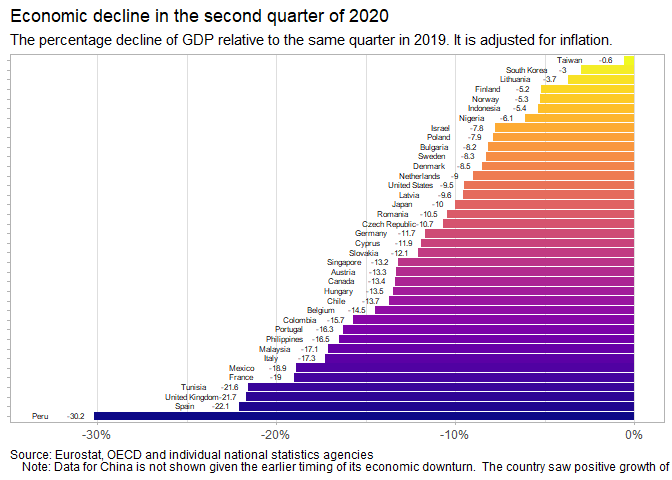
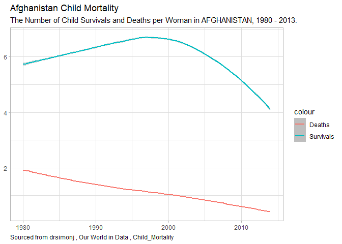

---
title: "Task 6: World Data Investigation"
author: "TomHollinberger"
date: "9/15/2020"
output: 
 html_document: 
   keep_md: yes
---  
THIS RSCRIPT USES ROXYGEN CHARACTERS.  
YOU CAN PRESS ctrl+shift+K AND GO STRAIGHT TO A HTML.  
SKIPS THE HANDWORK OF CREATING A RMD, AFTER THE ORIGINAL WORK IS NONE IN A RSCRIPT.

_________________________________

# **Recreating a World in Data graphic**
Downloaded to laptop repo from https://ourworldindata.org/covid-health-economy
Did a little clean up of the csv file in excel (removed China, EU, NAFTA, OECD rows which are in the file but not in the graphic)
Read in the data and investigate the structure.


```r
library("ggplot2")
ecodecl <- read.csv("E:/000 DTS 350 Data Visualization/DTS350-hollinbergert/DTS350TemplateMaster/Week_04/Class_Task_06/economic-decline-in-the-second-quarter-of-2020.csv")
head(ecodecl)
```

```
##          Ctry Code GDPQ2
## 1      Taiwan  TWN  -0.6
## 2 South Korea  KOR  -3.0
## 3   Lithuania  LTU  -3.7
## 4     Finland  FIN  -5.2
## 5      Norway  NOR  -5.3
## 6   Indonesia  IDN  -5.4
```

```r
str(ecodecl)
```

```
## 'data.frame':	38 obs. of  3 variables:
##  $ Ctry : chr  "Taiwan" "South Korea" "Lithuania" "Finland" ...
##  $ Code : chr  "TWN" "KOR" "LTU" "FIN" ...
##  $ GDPQ2: num  -0.6 -3 -3.7 -5.2 -5.3 -5.4 -6.1 -7.8 -7.9 -8.2 ...
```

Create factor / categorical / discrete variables out of Country and GDPQ2


```r
ecodecl$Ctryf <- as.factor(ecodecl$Ctry)
ecodecl$GDPQ2f <- as.factor(ecodecl$GDPQ2)
```

Create the Visualization


```r
ggplot(ecodecl, aes(x = reorder(GDPQ2,Ctry), y = GDPQ2)) +   #dbl-wide problems when value (CAN, MEX)is the same, had to alter the data
  geom_col(aes(fill = GDPQ2f)) +  geom_col(aes(fill = GDPQ2f)) +
  geom_text(aes(label = GDPQ2), nudge_x = 0.15, nudge_y = -1,size = rel(2)) +
  geom_text(aes(label = Ctry), nudge_x = 0.15, nudge_y = -3,size = rel(2)) +
  coord_flip() +
  scale_fill_viridis_d(
    option = "C") +               #plasma C from https://bids.github.io/colormap/ 
  labs(
    title = "Economic decline in the second quarter of 2020",
    subtitle = "The percentage decline of GDP relative to the same quarter in 2019. It is adjusted for inflation.",
    caption = "Source: Eurostat, OECD and individual national statistics agencies
    Note: Data for China is not shown given the earlier timing of its economic downturn.  The country saw positive growth of 3.2% in Q2 preceded by a fall of 6.8% in Q1") +
  scale_y_continuous(labels = function(x) paste0(x, "%")) +    #https://stackoverflow.com/questions/27433798/how-can-i-change-the-y-axis-figures-into-percentages-in-a-barplot
  theme_light() +
  theme(plot.caption = element_text(hjust = 0),   #left-justify the caption (default is right-justified) https://ggplot2.tidyverse.org/reference/theme.html
    axis.title.x = element_blank(),            #deletes the axis titles
    axis.title.y = element_blank(),
    legend.position = "none",                  #deletes the legend
    panel.grid.major.y = element_blank(),       #deletes the horizontal gridlines
    panel.grid.minor.y = element_blank(),
    axis.text.y = element_blank(),             #deletes the y axis ticks and numbers    axis.ticks.y = element_blank())
    )
```

```
## Warning in mean.default(X[[i]], ...): argument is not numeric or logical:
## returning NA

## Warning in mean.default(X[[i]], ...): argument is not numeric or logical:
## returning NA

## Warning in mean.default(X[[i]], ...): argument is not numeric or logical:
## returning NA

## Warning in mean.default(X[[i]], ...): argument is not numeric or logical:
## returning NA

## Warning in mean.default(X[[i]], ...): argument is not numeric or logical:
## returning NA

## Warning in mean.default(X[[i]], ...): argument is not numeric or logical:
## returning NA

## Warning in mean.default(X[[i]], ...): argument is not numeric or logical:
## returning NA

## Warning in mean.default(X[[i]], ...): argument is not numeric or logical:
## returning NA

## Warning in mean.default(X[[i]], ...): argument is not numeric or logical:
## returning NA

## Warning in mean.default(X[[i]], ...): argument is not numeric or logical:
## returning NA

## Warning in mean.default(X[[i]], ...): argument is not numeric or logical:
## returning NA

## Warning in mean.default(X[[i]], ...): argument is not numeric or logical:
## returning NA

## Warning in mean.default(X[[i]], ...): argument is not numeric or logical:
## returning NA

## Warning in mean.default(X[[i]], ...): argument is not numeric or logical:
## returning NA

## Warning in mean.default(X[[i]], ...): argument is not numeric or logical:
## returning NA

## Warning in mean.default(X[[i]], ...): argument is not numeric or logical:
## returning NA

## Warning in mean.default(X[[i]], ...): argument is not numeric or logical:
## returning NA

## Warning in mean.default(X[[i]], ...): argument is not numeric or logical:
## returning NA

## Warning in mean.default(X[[i]], ...): argument is not numeric or logical:
## returning NA

## Warning in mean.default(X[[i]], ...): argument is not numeric or logical:
## returning NA

## Warning in mean.default(X[[i]], ...): argument is not numeric or logical:
## returning NA

## Warning in mean.default(X[[i]], ...): argument is not numeric or logical:
## returning NA

## Warning in mean.default(X[[i]], ...): argument is not numeric or logical:
## returning NA

## Warning in mean.default(X[[i]], ...): argument is not numeric or logical:
## returning NA

## Warning in mean.default(X[[i]], ...): argument is not numeric or logical:
## returning NA

## Warning in mean.default(X[[i]], ...): argument is not numeric or logical:
## returning NA

## Warning in mean.default(X[[i]], ...): argument is not numeric or logical:
## returning NA

## Warning in mean.default(X[[i]], ...): argument is not numeric or logical:
## returning NA

## Warning in mean.default(X[[i]], ...): argument is not numeric or logical:
## returning NA

## Warning in mean.default(X[[i]], ...): argument is not numeric or logical:
## returning NA

## Warning in mean.default(X[[i]], ...): argument is not numeric or logical:
## returning NA

## Warning in mean.default(X[[i]], ...): argument is not numeric or logical:
## returning NA

## Warning in mean.default(X[[i]], ...): argument is not numeric or logical:
## returning NA

## Warning in mean.default(X[[i]], ...): argument is not numeric or logical:
## returning NA

## Warning in mean.default(X[[i]], ...): argument is not numeric or logical:
## returning NA

## Warning in mean.default(X[[i]], ...): argument is not numeric or logical:
## returning NA

## Warning in mean.default(X[[i]], ...): argument is not numeric or logical:
## returning NA

## Warning in mean.default(X[[i]], ...): argument is not numeric or logical:
## returning NA

## Warning in mean.default(X[[i]], ...): argument is not numeric or logical:
## returning NA

## Warning in mean.default(X[[i]], ...): argument is not numeric or logical:
## returning NA

## Warning in mean.default(X[[i]], ...): argument is not numeric or logical:
## returning NA

## Warning in mean.default(X[[i]], ...): argument is not numeric or logical:
## returning NA

## Warning in mean.default(X[[i]], ...): argument is not numeric or logical:
## returning NA

## Warning in mean.default(X[[i]], ...): argument is not numeric or logical:
## returning NA

## Warning in mean.default(X[[i]], ...): argument is not numeric or logical:
## returning NA

## Warning in mean.default(X[[i]], ...): argument is not numeric or logical:
## returning NA

## Warning in mean.default(X[[i]], ...): argument is not numeric or logical:
## returning NA

## Warning in mean.default(X[[i]], ...): argument is not numeric or logical:
## returning NA

## Warning in mean.default(X[[i]], ...): argument is not numeric or logical:
## returning NA

## Warning in mean.default(X[[i]], ...): argument is not numeric or logical:
## returning NA

## Warning in mean.default(X[[i]], ...): argument is not numeric or logical:
## returning NA

## Warning in mean.default(X[[i]], ...): argument is not numeric or logical:
## returning NA

## Warning in mean.default(X[[i]], ...): argument is not numeric or logical:
## returning NA

## Warning in mean.default(X[[i]], ...): argument is not numeric or logical:
## returning NA

## Warning in mean.default(X[[i]], ...): argument is not numeric or logical:
## returning NA

## Warning in mean.default(X[[i]], ...): argument is not numeric or logical:
## returning NA

## Warning in mean.default(X[[i]], ...): argument is not numeric or logical:
## returning NA

## Warning in mean.default(X[[i]], ...): argument is not numeric or logical:
## returning NA

## Warning in mean.default(X[[i]], ...): argument is not numeric or logical:
## returning NA

## Warning in mean.default(X[[i]], ...): argument is not numeric or logical:
## returning NA

## Warning in mean.default(X[[i]], ...): argument is not numeric or logical:
## returning NA

## Warning in mean.default(X[[i]], ...): argument is not numeric or logical:
## returning NA

## Warning in mean.default(X[[i]], ...): argument is not numeric or logical:
## returning NA

## Warning in mean.default(X[[i]], ...): argument is not numeric or logical:
## returning NA

## Warning in mean.default(X[[i]], ...): argument is not numeric or logical:
## returning NA

## Warning in mean.default(X[[i]], ...): argument is not numeric or logical:
## returning NA

## Warning in mean.default(X[[i]], ...): argument is not numeric or logical:
## returning NA

## Warning in mean.default(X[[i]], ...): argument is not numeric or logical:
## returning NA

## Warning in mean.default(X[[i]], ...): argument is not numeric or logical:
## returning NA

## Warning in mean.default(X[[i]], ...): argument is not numeric or logical:
## returning NA

## Warning in mean.default(X[[i]], ...): argument is not numeric or logical:
## returning NA

## Warning in mean.default(X[[i]], ...): argument is not numeric or logical:
## returning NA

## Warning in mean.default(X[[i]], ...): argument is not numeric or logical:
## returning NA

## Warning in mean.default(X[[i]], ...): argument is not numeric or logical:
## returning NA

## Warning in mean.default(X[[i]], ...): argument is not numeric or logical:
## returning NA

## Warning in mean.default(X[[i]], ...): argument is not numeric or logical:
## returning NA

## Warning in mean.default(X[[i]], ...): argument is not numeric or logical:
## returning NA

## Warning in mean.default(X[[i]], ...): argument is not numeric or logical:
## returning NA

## Warning in mean.default(X[[i]], ...): argument is not numeric or logical:
## returning NA

## Warning in mean.default(X[[i]], ...): argument is not numeric or logical:
## returning NA

## Warning in mean.default(X[[i]], ...): argument is not numeric or logical:
## returning NA

## Warning in mean.default(X[[i]], ...): argument is not numeric or logical:
## returning NA

## Warning in mean.default(X[[i]], ...): argument is not numeric or logical:
## returning NA

## Warning in mean.default(X[[i]], ...): argument is not numeric or logical:
## returning NA

## Warning in mean.default(X[[i]], ...): argument is not numeric or logical:
## returning NA

## Warning in mean.default(X[[i]], ...): argument is not numeric or logical:
## returning NA

## Warning in mean.default(X[[i]], ...): argument is not numeric or logical:
## returning NA

## Warning in mean.default(X[[i]], ...): argument is not numeric or logical:
## returning NA

## Warning in mean.default(X[[i]], ...): argument is not numeric or logical:
## returning NA

## Warning in mean.default(X[[i]], ...): argument is not numeric or logical:
## returning NA

## Warning in mean.default(X[[i]], ...): argument is not numeric or logical:
## returning NA

## Warning in mean.default(X[[i]], ...): argument is not numeric or logical:
## returning NA

## Warning in mean.default(X[[i]], ...): argument is not numeric or logical:
## returning NA

## Warning in mean.default(X[[i]], ...): argument is not numeric or logical:
## returning NA

## Warning in mean.default(X[[i]], ...): argument is not numeric or logical:
## returning NA

## Warning in mean.default(X[[i]], ...): argument is not numeric or logical:
## returning NA

## Warning in mean.default(X[[i]], ...): argument is not numeric or logical:
## returning NA

## Warning in mean.default(X[[i]], ...): argument is not numeric or logical:
## returning NA

## Warning in mean.default(X[[i]], ...): argument is not numeric or logical:
## returning NA

## Warning in mean.default(X[[i]], ...): argument is not numeric or logical:
## returning NA

## Warning in mean.default(X[[i]], ...): argument is not numeric or logical:
## returning NA

## Warning in mean.default(X[[i]], ...): argument is not numeric or logical:
## returning NA

## Warning in mean.default(X[[i]], ...): argument is not numeric or logical:
## returning NA

## Warning in mean.default(X[[i]], ...): argument is not numeric or logical:
## returning NA

## Warning in mean.default(X[[i]], ...): argument is not numeric or logical:
## returning NA

## Warning in mean.default(X[[i]], ...): argument is not numeric or logical:
## returning NA

## Warning in mean.default(X[[i]], ...): argument is not numeric or logical:
## returning NA

## Warning in mean.default(X[[i]], ...): argument is not numeric or logical:
## returning NA

## Warning in mean.default(X[[i]], ...): argument is not numeric or logical:
## returning NA

## Warning in mean.default(X[[i]], ...): argument is not numeric or logical:
## returning NA

## Warning in mean.default(X[[i]], ...): argument is not numeric or logical:
## returning NA

## Warning in mean.default(X[[i]], ...): argument is not numeric or logical:
## returning NA

## Warning in mean.default(X[[i]], ...): argument is not numeric or logical:
## returning NA

## Warning in mean.default(X[[i]], ...): argument is not numeric or logical:
## returning NA

## Warning in mean.default(X[[i]], ...): argument is not numeric or logical:
## returning NA

## Warning in mean.default(X[[i]], ...): argument is not numeric or logical:
## returning NA

## Warning in mean.default(X[[i]], ...): argument is not numeric or logical:
## returning NA

## Warning in mean.default(X[[i]], ...): argument is not numeric or logical:
## returning NA

## Warning in mean.default(X[[i]], ...): argument is not numeric or logical:
## returning NA

## Warning in mean.default(X[[i]], ...): argument is not numeric or logical:
## returning NA

## Warning in mean.default(X[[i]], ...): argument is not numeric or logical:
## returning NA

## Warning in mean.default(X[[i]], ...): argument is not numeric or logical:
## returning NA

## Warning in mean.default(X[[i]], ...): argument is not numeric or logical:
## returning NA

## Warning in mean.default(X[[i]], ...): argument is not numeric or logical:
## returning NA

## Warning in mean.default(X[[i]], ...): argument is not numeric or logical:
## returning NA

## Warning in mean.default(X[[i]], ...): argument is not numeric or logical:
## returning NA

## Warning in mean.default(X[[i]], ...): argument is not numeric or logical:
## returning NA

## Warning in mean.default(X[[i]], ...): argument is not numeric or logical:
## returning NA

## Warning in mean.default(X[[i]], ...): argument is not numeric or logical:
## returning NA

## Warning in mean.default(X[[i]], ...): argument is not numeric or logical:
## returning NA

## Warning in mean.default(X[[i]], ...): argument is not numeric or logical:
## returning NA

## Warning in mean.default(X[[i]], ...): argument is not numeric or logical:
## returning NA

## Warning in mean.default(X[[i]], ...): argument is not numeric or logical:
## returning NA

## Warning in mean.default(X[[i]], ...): argument is not numeric or logical:
## returning NA

## Warning in mean.default(X[[i]], ...): argument is not numeric or logical:
## returning NA

## Warning in mean.default(X[[i]], ...): argument is not numeric or logical:
## returning NA

## Warning in mean.default(X[[i]], ...): argument is not numeric or logical:
## returning NA

## Warning in mean.default(X[[i]], ...): argument is not numeric or logical:
## returning NA

## Warning in mean.default(X[[i]], ...): argument is not numeric or logical:
## returning NA

## Warning in mean.default(X[[i]], ...): argument is not numeric or logical:
## returning NA

## Warning in mean.default(X[[i]], ...): argument is not numeric or logical:
## returning NA

## Warning in mean.default(X[[i]], ...): argument is not numeric or logical:
## returning NA

## Warning in mean.default(X[[i]], ...): argument is not numeric or logical:
## returning NA

## Warning in mean.default(X[[i]], ...): argument is not numeric or logical:
## returning NA

## Warning in mean.default(X[[i]], ...): argument is not numeric or logical:
## returning NA

## Warning in mean.default(X[[i]], ...): argument is not numeric or logical:
## returning NA

## Warning in mean.default(X[[i]], ...): argument is not numeric or logical:
## returning NA

## Warning in mean.default(X[[i]], ...): argument is not numeric or logical:
## returning NA

## Warning in mean.default(X[[i]], ...): argument is not numeric or logical:
## returning NA

## Warning in mean.default(X[[i]], ...): argument is not numeric or logical:
## returning NA

## Warning in mean.default(X[[i]], ...): argument is not numeric or logical:
## returning NA

## Warning in mean.default(X[[i]], ...): argument is not numeric or logical:
## returning NA

## Warning in mean.default(X[[i]], ...): argument is not numeric or logical:
## returning NA

## Warning in mean.default(X[[i]], ...): argument is not numeric or logical:
## returning NA

## Warning in mean.default(X[[i]], ...): argument is not numeric or logical:
## returning NA

## Warning in mean.default(X[[i]], ...): argument is not numeric or logical:
## returning NA

## Warning in mean.default(X[[i]], ...): argument is not numeric or logical:
## returning NA

## Warning in mean.default(X[[i]], ...): argument is not numeric or logical:
## returning NA

## Warning in mean.default(X[[i]], ...): argument is not numeric or logical:
## returning NA

## Warning in mean.default(X[[i]], ...): argument is not numeric or logical:
## returning NA

## Warning in mean.default(X[[i]], ...): argument is not numeric or logical:
## returning NA

## Warning in mean.default(X[[i]], ...): argument is not numeric or logical:
## returning NA

## Warning in mean.default(X[[i]], ...): argument is not numeric or logical:
## returning NA

## Warning in mean.default(X[[i]], ...): argument is not numeric or logical:
## returning NA

## Warning in mean.default(X[[i]], ...): argument is not numeric or logical:
## returning NA

## Warning in mean.default(X[[i]], ...): argument is not numeric or logical:
## returning NA

## Warning in mean.default(X[[i]], ...): argument is not numeric or logical:
## returning NA

## Warning in mean.default(X[[i]], ...): argument is not numeric or logical:
## returning NA

## Warning in mean.default(X[[i]], ...): argument is not numeric or logical:
## returning NA

## Warning in mean.default(X[[i]], ...): argument is not numeric or logical:
## returning NA

## Warning in mean.default(X[[i]], ...): argument is not numeric or logical:
## returning NA

## Warning in mean.default(X[[i]], ...): argument is not numeric or logical:
## returning NA

## Warning in mean.default(X[[i]], ...): argument is not numeric or logical:
## returning NA

## Warning in mean.default(X[[i]], ...): argument is not numeric or logical:
## returning NA

## Warning in mean.default(X[[i]], ...): argument is not numeric or logical:
## returning NA

## Warning in mean.default(X[[i]], ...): argument is not numeric or logical:
## returning NA

## Warning in mean.default(X[[i]], ...): argument is not numeric or logical:
## returning NA

## Warning in mean.default(X[[i]], ...): argument is not numeric or logical:
## returning NA

## Warning in mean.default(X[[i]], ...): argument is not numeric or logical:
## returning NA

## Warning in mean.default(X[[i]], ...): argument is not numeric or logical:
## returning NA

## Warning in mean.default(X[[i]], ...): argument is not numeric or logical:
## returning NA

## Warning in mean.default(X[[i]], ...): argument is not numeric or logical:
## returning NA

## Warning in mean.default(X[[i]], ...): argument is not numeric or logical:
## returning NA

## Warning in mean.default(X[[i]], ...): argument is not numeric or logical:
## returning NA

## Warning in mean.default(X[[i]], ...): argument is not numeric or logical:
## returning NA

## Warning in mean.default(X[[i]], ...): argument is not numeric or logical:
## returning NA

## Warning in mean.default(X[[i]], ...): argument is not numeric or logical:
## returning NA

## Warning in mean.default(X[[i]], ...): argument is not numeric or logical:
## returning NA

## Warning in mean.default(X[[i]], ...): argument is not numeric or logical:
## returning NA

## Warning in mean.default(X[[i]], ...): argument is not numeric or logical:
## returning NA
```

<!-- -->

## Data Visualization from **Our World in Data**


```r
library(dplyr)
```

```
## 
## Attaching package: 'dplyr'
```

```
## The following objects are masked from 'package:stats':
## 
##     filter, lag
```

```
## The following objects are masked from 'package:base':
## 
##     intersect, setdiff, setequal, union
```

```r
library(tidyverse) 
```

```
## -- Attaching packages ------------------------------------------------------------------------------ tidyverse 1.3.0 --
```

```
## v tibble  3.0.3     v purrr   0.3.4
## v tidyr   1.1.0     v stringr 1.4.0
## v readr   1.3.1     v forcats 0.5.0
```

```
## -- Conflicts --------------------------------------------------------------------------------- tidyverse_conflicts() --
## x dplyr::filter() masks stats::filter()
## x dplyr::lag()    masks stats::lag()
```

```r
installed.packages("devtools")
```

```
##      Package LibPath Version Priority Depends Imports LinkingTo Suggests
##      Enhances License License_is_FOSS License_restricts_use OS_type Archs
##      MD5sum NeedsCompilation Built
```

```r
installed.packages("rtools")
```

```
##      Package LibPath Version Priority Depends Imports LinkingTo Suggests
##      Enhances License License_is_FOSS License_restricts_use OS_type Archs
##      MD5sum NeedsCompilation Built
```

```r
library("devtools")
```

```
## Loading required package: usethis
```

```r
library("ggplot2")
```

library("rtools") <br>
Read in the data and investigate the structure.  ONLY NEED TO DO THIS ONCE, then it's in <br>
devtools::install_github("drsimonj/ourworldindata") 


```r
cm <- ourworldindata::child_mortality   # as you are typing this line, you get popups for OurWorldInData, and ChildMortality
str(cm)
```

```
## tibble [44,926 x 10] (S3: tbl_df/tbl/data.frame)
##  $ year              : int [1:44926] 1957 1958 1959 1960 1961 1962 1963 1964 1965 1966 ...
##  $ country           : chr [1:44926] "Afghanistan" "Afghanistan" "Afghanistan" "Afghanistan" ...
##  $ continent         : chr [1:44926] "Asia" "Asia" "Asia" "Asia" ...
##  $ population        : int [1:44926] 9147286 9314915 9489453 9671046 9859928 10056480 10261254 10474903 10697983 10927724 ...
##  $ child_mort        : num [1:44926] 378 372 366 361 355 ...
##  $ survival_per_woman: num [1:44926] 4.75 4.8 4.85 4.89 4.94 ...
##  $ deaths_per_woman  : num [1:44926] 2.92 2.87 2.82 2.78 2.73 ...
##  $ poverty           : num [1:44926] NA NA NA NA NA NA NA NA NA NA ...
##  $ education         : num [1:44926] NA NA NA 0.37 NA NA NA NA 0.42 NA ...
##  $ health_exp        : num [1:44926] NA NA NA NA NA NA NA NA NA NA ...
```

?child_mortality <br>
view(cm)

## A Two-Line Plot that show year-by-year the change of Child Survival_per_Woman and Death_per_Woman in Afghanistan


```r
cm1 <- select(cm, year, country, deaths_per_woman, survival_per_woman) 
head(cm1)
```

```
## # A tibble: 6 x 4
##    year country     deaths_per_woman survival_per_woman
##   <int> <chr>                  <dbl>              <dbl>
## 1  1957 Afghanistan             2.92               4.75
## 2  1958 Afghanistan             2.87               4.80
## 3  1959 Afghanistan             2.82               4.85
## 4  1960 Afghanistan             2.78               4.89
## 5  1961 Afghanistan             2.73               4.94
## 6  1962 Afghanistan             2.69               4.98
```

```r
cm2 <- filter(cm1, cm$year >= "1980" & cm$year <= "2014") 

cm3 <- filter(cm2, country == "Afghanistan")
head(cm3)
```

```
## # A tibble: 6 x 4
##    year country     deaths_per_woman survival_per_woman
##   <int> <chr>                  <dbl>              <dbl>
## 1  1980 Afghanistan             1.91               5.76
## 2  1981 Afghanistan             1.86               5.81
## 3  1982 Afghanistan             1.81               5.86
## 4  1983 Afghanistan             1.76               5.91
## 5  1984 Afghanistan             1.71               5.97
## 6  1985 Afghanistan             1.66               6.02
```

```r
tail(cm3)
```

```
## # A tibble: 6 x 4
##    year country     deaths_per_woman survival_per_woman
##   <int> <chr>                  <dbl>              <dbl>
## 1  2009 Afghanistan            0.638               5.29
## 2  2010 Afghanistan            0.594               5.06
## 3  2011 Afghanistan            0.552               4.84
## 4  2012 Afghanistan            0.512               4.63
## 5  2013 Afghanistan            0.474               4.43
## 6  2014 Afghanistan            0.439               4.24
```

```r
ggplot(cm3) +
  geom_smooth(aes(x = year, y = deaths_per_woman, col = "Deaths"))  +
  geom_smooth(aes(x = year, y = survival_per_woman, col = "Survivals")) +
  labs(
    title = "Afghanistan Child Mortality",
    subtitle = "The Number of Child Survivals and Deaths per Woman in AFGHANISTAN, 1980 - 2013.",
    caption = "Sourced from drsimonj , Our World in Data , Child_Mortality") + 
  guides(fill = guide_legend(reverse = TRUE)) +
  theme_light() +
  theme(plot.caption = element_text(hjust = 0),   #left-justify the caption (default is right-justified) https://ggplot2.tidyverse.org/reference/theme.html
        axis.title.x = element_blank(),            #deletes the axis titles
        axis.title.y = element_blank(),
        legend.title = element_text("Children per Woman"))  #Can't get this to work.  Can't figure out where legend title COLOUR comes from.
```

```
## `geom_smooth()` using method = 'loess' and formula 'y ~ x'
## `geom_smooth()` using method = 'loess' and formula 'y ~ x'
```

```
## Warning in grid.Call(C_stringMetric, as.graphicsAnnot(x$label)): font family not
## found in Windows font database
```

```
## Warning in grid.Call(C_textBounds, as.graphicsAnnot(x$label), x$x, x$y, : font
## family not found in Windows font database
```

<!-- -->


### INTERPRETATION:  Interestingly, the survival per woman numbers have gone down, AND the deaths per woman have also gone down.  What's probably happening in Afghanistan is the typical developing country scenario where family sizes are going down, thus fewer children to "survive".  And the health conditions are improving so the deaths per woman are going down, too.


