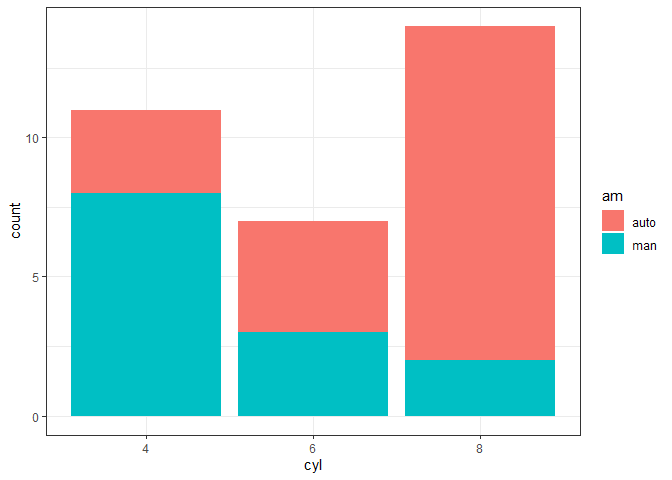
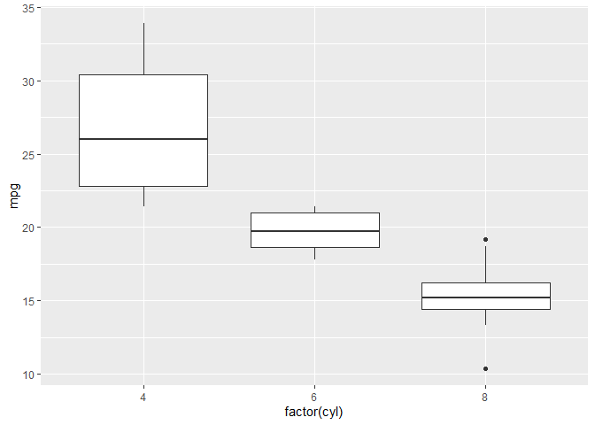

---
title: "Day 6: InClass Examples"
author: "TomHollinberger"
date: "9/13/2020"
output: 
 html_document: 
   keep_md: yes
   toc: TRUE
---  
THIS RSCRIPT USES ROXYGEN CHARACTERS.  
YOU CAN PRESS ctrl+shift+K AND GO STRAIGHT TO A HTML.  
SKIPS THE HANDWORK OF CREATING A RMD, AFTER THE ORIGINAL WORK IS NONE IN A RSCRIPT.

# **Day 6 Examples:  ggplot geom types** 

For all of our examples, we need the tidyverse and ggplot2 libraries.


```r
library(tidyverse)
```

```
## -- Attaching packages ----------------------------------------------------------------------------------- tidyverse 1.3.0 --
```

```
## v ggplot2 3.3.2     v purrr   0.3.4
## v tibble  3.0.3     v dplyr   1.0.0
## v tidyr   1.1.0     v stringr 1.4.0
## v readr   1.3.1     v forcats 0.5.0
```

```
## -- Conflicts -------------------------------------------------------------------------------------- tidyverse_conflicts() --
## x dplyr::filter() masks stats::filter()
## x dplyr::lag()    masks stats::lag()
```

```r
library(ggplot2)
```

## Bar Graphs
For our bar graphs, we will use the data in mtcars.  

### QUESTION:  What is the data type for cyl? 

Run the following script.  This will make our **basic bar chart**.  

###  QUESTION: Do you notice anything strange with the x-axis?


```r
?mtcars  #review the data
```

```
## starting httpd help server ... done
```

```r
str(mtcars)
```

```
## 'data.frame':	32 obs. of  11 variables:
##  $ mpg : num  21 21 22.8 21.4 18.7 18.1 14.3 24.4 22.8 19.2 ...
##  $ cyl : num  6 6 4 6 8 6 8 4 4 6 ...
##  $ disp: num  160 160 108 258 360 ...
##  $ hp  : num  110 110 93 110 175 105 245 62 95 123 ...
##  $ drat: num  3.9 3.9 3.85 3.08 3.15 2.76 3.21 3.69 3.92 3.92 ...
##  $ wt  : num  2.62 2.88 2.32 3.21 3.44 ...
##  $ qsec: num  16.5 17 18.6 19.4 17 ...
##  $ vs  : num  0 0 1 1 0 1 0 1 1 1 ...
##  $ am  : num  1 1 1 0 0 0 0 0 0 0 ...
##  $ gear: num  4 4 4 3 3 3 3 4 4 4 ...
##  $ carb: num  4 4 1 1 2 1 4 2 2 4 ...
```

```r
ggplot(mtcars, aes(x = cyl)) +
  geom_bar()
```

<!-- -->

We want to have our values in cyl be categories, not integers, 
so we tell R to make those values in cyl **factors**.  
We will also adjust some of the objects in the graph.
## FACTOR makes it a categorical (discrete) instead of a continuous


```r
ggplot(mtcars, aes(x = factor(cyl))) +
  geom_bar(width = 0.5, fill = "blue", alpha = 0.5) +
  theme_bw()
```

<!-- -->


### Complete the code below so that the color is determined by the cylinder type.
ggplot(mtcars, aes(x = ______(cyl), fill = ___________)) +
 geom_bar() 
 


```r
ggplot(mtcars, aes(x = factor(cyl), fill = cyl)) +
  geom_bar()
```

<!-- -->

We will create a graph to show the **number of automatic and manual transmission** based on the cylinder type.


```r
ggplot(mtcars, aes(x = factor(cyl), fill = factor(am))) +
  geom_bar() +
  theme_bw()
```

<!-- -->

If we want **better labels** on our data:


```r
library(dplyr)
data <- mtcars %>%
  mutate(am = factor(am, labels = c("auto", "man")),   #mutate replaces if you use same variable name before and after the =
         cyl = factor(cyl))   #factor, categorical, discrete
```


### QUESTION:  What did the mutate function do to our data set?


```r
ggplot(data, aes(x = cyl, fill = am)) +   #these are now factors
  geom_bar() +
  theme_bw()
```

<!-- -->

Note:  Altering our data set is important to get the data in a way we want it for our visualization.
We can put **bars side-by-side**


```r
ggplot(data, aes(x = cyl, fill = am)) +
  geom_bar(position = position_dodge()) +  #makes it clustered side by side
  theme_bw()
```

<!-- -->

We can make the **bars horizontal**


```r
ggplot(data, aes(x = cyl, fill = am)) +
  geom_bar(position = position_dodge()) + 
  coord_flip() +
  theme_bw()
```

<!-- -->

## Bar Graph Example: 
Now we will look at the **each car** and their mpg
First create a new data set so we have the data we want for displaying.


```r
df <- mtcars %>%
  rownames_to_column() %>%  #originally rownumbers are car types, this changes 
  as_data_frame() %>%
  mutate(cyl = as.factor(cyl)) %>%
  select(rowname, wt, mpg, cyl)
```

```
## Warning: `as_data_frame()` is deprecated as of tibble 2.0.0.
## Please use `as_tibble()` instead.
## The signature and semantics have changed, see `?as_tibble`.
## This warning is displayed once every 8 hours.
## Call `lifecycle::last_warnings()` to see where this warning was generated.
```

```r
df
```

```
## # A tibble: 32 x 4
##    rowname              wt   mpg cyl  
##    <chr>             <dbl> <dbl> <fct>
##  1 Mazda RX4          2.62  21   6    
##  2 Mazda RX4 Wag      2.88  21   6    
##  3 Datsun 710         2.32  22.8 4    
##  4 Hornet 4 Drive     3.22  21.4 6    
##  5 Hornet Sportabout  3.44  18.7 8    
##  6 Valiant            3.46  18.1 6    
##  7 Duster 360         3.57  14.3 8    
##  8 Merc 240D          3.19  24.4 4    
##  9 Merc 230           3.15  22.8 4    
## 10 Merc 280           3.44  19.2 6    
## # ... with 22 more rows
```

### Basic bar plot


```r
ggplot(df, aes(x = rowname, y = mpg)) +
  geom_col() +
  theme(axis.text.x = element_text(size = rel(.5), angle = 90))  #text labels up and down
```

<!-- -->

### Reorder (sort) row names by mpg values


```r
ggplot(df, aes(x = reorder(rowname, desc(mpg)), y=mpg)) +  #reorder rowname by mpg
  geom_col() +
  theme(axis.text.x = element_text(size = rel(.5), angle = 90))
```

<!-- -->

### Horizontal bar plot
Change **fill color by groups** and add text labels


```r
ggplot(df, aes(x = reorder(rowname, mpg), y = mpg)) +
  geom_col(aes(fill = cyl)) +
  geom_text(aes(label = mpg), nudge_y = 2, size = rel(2)) +
  coord_flip() +
  scale_fill_viridis_d()
```

<!-- -->

 Conclusion: fewer cyl = better mpg
 
## Line Plots
For this type of graph, we will use data from economics data frame.


```r
View(economics)
?economics

ggplot(data = economics, aes(x = date, y = pop, size = unemploy/pop)) + 
  geom_line() 
```

<!-- -->

```r
ggplot(data = economics, aes(x = date, y = psavert)) +
  geom_line()
```

<!-- -->

```r
ggplot(data = economics, aes(x = date)) +    #two lines
  geom_line(aes(y = psavert), color = "darkred") +
  geom_line(aes(y = uempmed), color = "steelblue", linetype = "twodash")
```

<!-- -->

### Alternate:  


```r
data_combined <- economics %>%
  select(date, psavert, uempmed) %>%
  gather(key = "variable", value = "value", -date)  #like reshape.  keep date, this puts psave and unemp in the same chart
head(data_combined)
```

```
## # A tibble: 6 x 3
##   date       variable value
##   <date>     <chr>    <dbl>
## 1 1967-07-01 psavert   12.6
## 2 1967-08-01 psavert   12.6
## 3 1967-09-01 psavert   11.9
## 4 1967-10-01 psavert   12.9
## 5 1967-11-01 psavert   12.8
## 6 1967-12-01 psavert   11.8
```

```r
tail(data_combined)
```

```
## # A tibble: 6 x 3
##   date       variable value
##   <date>     <chr>    <dbl>
## 1 2014-11-01 uempmed   13  
## 2 2014-12-01 uempmed   12.9
## 3 2015-01-01 uempmed   13.2
## 4 2015-02-01 uempmed   12.9
## 5 2015-03-01 uempmed   12  
## 6 2015-04-01 uempmed   11.5
```

```r
ggplot(data_combined, aes(x = date, y = value)) +   # now we get the legend
  geom_line(aes(color = variable, linetype = variable)) +
  scale_color_manual(values = c("darkred", "steelblue"))
```

<!-- -->

## Box Plots


```r
ggplot(mtcars, aes(factor(cyl), mpg)) +
  geom_boxplot()
```

<!-- -->

```r
ggplot(mtcars, aes(factor(cyl), mpg)) +    #add color, and side-by-side of auto&manual
  geom_boxplot(aes(color = factor(am)))
```

<!-- -->

```r
ggplot(mtcars, aes(factor(cyl), mpg, color = factor(am))) +    #adds dots to boxplot
  geom_boxplot() +
  geom_jitter()
```

<!-- -->

