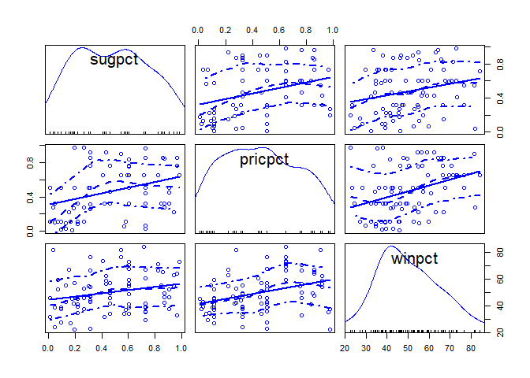
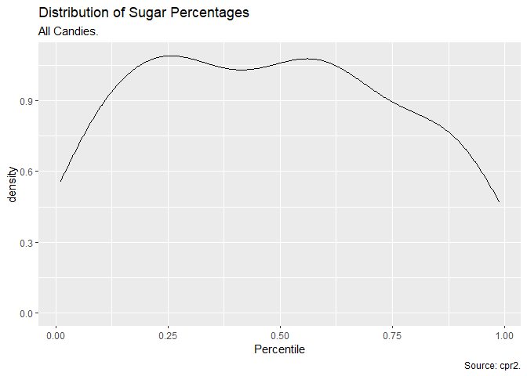
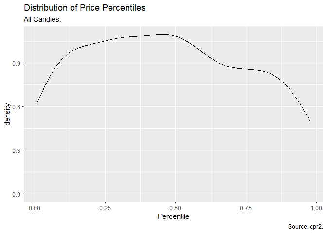
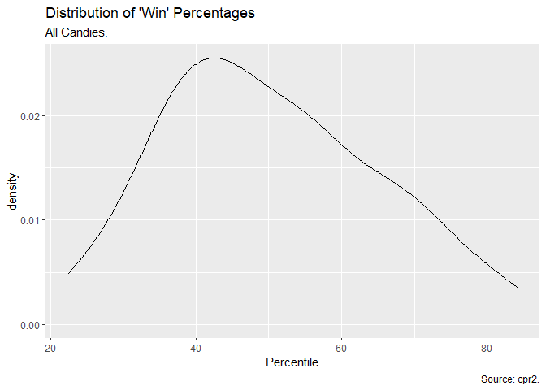
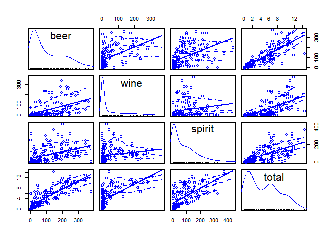
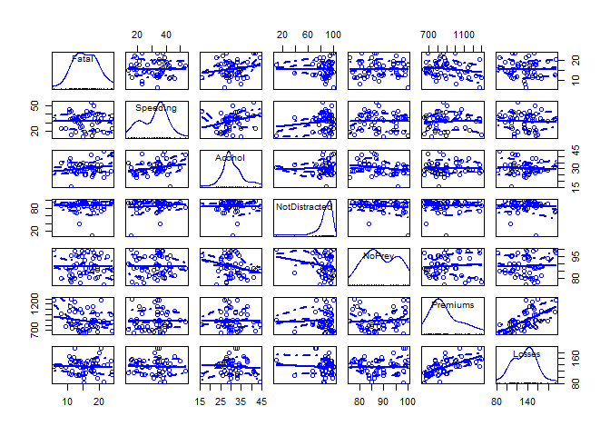

---
title: "Task 8: Data to Answer Questions"
author: "TomHollinberger"
date: "9/22/2020"
output: 
 html_document: 
   keep_md: yes
   toc: TRUE
   number_sections: true
---  
THIS RSCRIPT USES ROXYGEN CHARACTERS.  
YOU CAN PRESS ctrl+shift+K AND GO STRAIGHT TO A HTML.  
SKIPS THE HANDWORK OF CREATING A RMD, AFTER THE ORIGINAL WORK IS NONE IN A RSCRIPT.
[ ] In an .Rmd file include links to sources with a description of the quality of each data source.<br>
[ ] Find 3-5 potential data sources (that are free) and document some information about the source.<br>
[ ] Build an R script that reads in, formats, and visualizes the data using the principles of exploratory analysis.<br>
[ ] Write a short summary in your .Rmd file of the read in process and some coding secrets you learned.<br>
[ ] Include 2-3 quick visualizations in your .Rmd file that you used to check the quality of your data.<br>
[ ] Summarize the limitations of your final compiled data in addressing your original question.<br>
[ ] After formatting your data, identify any follow up or alternate questions that you could use for your project.<br>
_________________________________
_________________________________

# Task 8: : Data to Answer Questions
_________________________________
_________________________________
 
## Data Source 1 : **Candy Power Rankings**
### **My Question**:  What are the characteristics of the Winning candy? 
#### from fivethirtyeight, via github, candy-rank.csv
The data contains the following fields:<br>
chocolate =	Does it contain chocolate?<br>
fruity = Is it fruit flavored?<br>
caramel =	Is there caramel in the candy?<br>
peanutalmondy =	Does it contain peanuts, peanut butter or almonds?<br>
nougat =	Does it contain nougat?<br>
crispedricewafer =	Does it contain crisped rice, wafers, or a cookie component?<br>
hard =	Is it a hard candy?<br>
bar =	Is it a candy bar?<br>
pluribus =	Is it one of many candies in a bag or box?<br>
sugarpercent =	The percentile of sugar it falls under within the data set.<br>
pricepercent =	The unit price percentile compared to the rest of the set.<br>
winpercent =	The overall win percentage according to 269,000 matchups.<br>

read in https://github.com/fivethirtyeight/data/blob/master/candy-power-ranking/candy-data.csv

### **Download, Read, Explore/Inspect the Data, Manipulate (Change Column Titles), Check for Blanks, Save as csv, Overview Plots** 


```r
library(tidyverse)
```

```
## -- Attaching packages ---------------------------------------- tidyverse 1.3.0 --
```

```
## v ggplot2 3.3.2     v purrr   0.3.4
## v tibble  3.0.3     v dplyr   1.0.0
## v tidyr   1.1.0     v stringr 1.4.0
## v readr   1.3.1     v forcats 0.5.0
```

```
## -- Conflicts ------------------------------------------- tidyverse_conflicts() --
## x dplyr::filter() masks stats::filter()
## x dplyr::lag()    masks stats::lag()
```

```r
library(dplyr)
library(ggplot2)
library(car)  #for the scatterplotMatrix
```

```
## Loading required package: carData
```

```
## 
## Attaching package: 'car'
```

```
## The following object is masked from 'package:dplyr':
## 
##     recode
```

```
## The following object is masked from 'package:purrr':
## 
##     some
```

### **Download** a file from FiveThirtyEight
Check working directory first to make sure you agree with where it's going.


```r
getwd()   #Good to go:  "E:/000 DTS 350 Data Visualization/DTS350-hollinbergert/DTS350TemplateMaster/Week_05/Class_Task_08"
```

```
## [1] "E:/000 DTS 350 Data Visualization/DTS350-hollinbergert/DTS350TemplateMaster/Week_05/Class_Task_08"
```

```r
download.file("https://raw.githubusercontent.com/fivethirtyeight/data/master/candy-power-ranking/candy-data.csv",
              "cpr.csv", mode = "wb")  #saves to working directory
```

Breadcrumbs:  FiveThirtyEight, scroll down to bottom, DAta, click on the file-of-interest info button to view what it's about, 
you are now in GitHub, click on the csv filename, click on raw, copy that browser link into your Rscript download command

### **Read_csv** in the "Path/File" 


```r
cpr <- read_csv("E:/000 DTS 350 Data Visualization/DTS350-hollinbergert/DTS350TemplateMaster/Week_05/Class_Task_08/cpr.csv")   #could filter at this point
```

```
## Parsed with column specification:
## cols(
##   competitorname = col_character(),
##   chocolate = col_double(),
##   fruity = col_double(),
##   caramel = col_double(),
##   peanutyalmondy = col_double(),
##   nougat = col_double(),
##   crispedricewafer = col_double(),
##   hard = col_double(),
##   bar = col_double(),
##   pluribus = col_double(),
##   sugarpercent = col_double(),
##   pricepercent = col_double(),
##   winpercent = col_double()
## )
```


### **Explore/Inspect the Data**


```r
str(cpr)
```

```
## tibble [85 x 13] (S3: spec_tbl_df/tbl_df/tbl/data.frame)
##  $ competitorname  : chr [1:85] "100 Grand" "3 Musketeers" "One dime" "One quarter" ...
##  $ chocolate       : num [1:85] 1 1 0 0 0 1 1 0 0 0 ...
##  $ fruity          : num [1:85] 0 0 0 0 1 0 0 0 0 1 ...
##  $ caramel         : num [1:85] 1 0 0 0 0 0 1 0 0 1 ...
##  $ peanutyalmondy  : num [1:85] 0 0 0 0 0 1 1 1 0 0 ...
##  $ nougat          : num [1:85] 0 1 0 0 0 0 1 0 0 0 ...
##  $ crispedricewafer: num [1:85] 1 0 0 0 0 0 0 0 0 0 ...
##  $ hard            : num [1:85] 0 0 0 0 0 0 0 0 0 0 ...
##  $ bar             : num [1:85] 1 1 0 0 0 1 1 0 0 0 ...
##  $ pluribus        : num [1:85] 0 0 0 0 0 0 0 1 1 0 ...
##  $ sugarpercent    : num [1:85] 0.732 0.604 0.011 0.011 0.906 ...
##  $ pricepercent    : num [1:85] 0.86 0.511 0.116 0.511 0.511 ...
##  $ winpercent      : num [1:85] 67 67.6 32.3 46.1 52.3 ...
##  - attr(*, "spec")=
##   .. cols(
##   ..   competitorname = col_character(),
##   ..   chocolate = col_double(),
##   ..   fruity = col_double(),
##   ..   caramel = col_double(),
##   ..   peanutyalmondy = col_double(),
##   ..   nougat = col_double(),
##   ..   crispedricewafer = col_double(),
##   ..   hard = col_double(),
##   ..   bar = col_double(),
##   ..   pluribus = col_double(),
##   ..   sugarpercent = col_double(),
##   ..   pricepercent = col_double(),
##   ..   winpercent = col_double()
##   .. )
```

```r
head(cpr, n = 10)
```

```
## # A tibble: 10 x 13
##    competitorname chocolate fruity caramel peanutyalmondy nougat
##    <chr>              <dbl>  <dbl>   <dbl>          <dbl>  <dbl>
##  1 100 Grand              1      0       1              0      0
##  2 3 Musketeers           1      0       0              0      1
##  3 One dime               0      0       0              0      0
##  4 One quarter            0      0       0              0      0
##  5 Air Heads              0      1       0              0      0
##  6 Almond Joy             1      0       0              1      0
##  7 Baby Ruth              1      0       1              1      1
##  8 Boston Baked ~         0      0       0              1      0
##  9 Candy Corn             0      0       0              0      0
## 10 Caramel Apple~         0      1       1              0      0
## # ... with 7 more variables: crispedricewafer <dbl>, hard <dbl>, bar <dbl>,
## #   pluribus <dbl>, sugarpercent <dbl>, pricepercent <dbl>, winpercent <dbl>
```

```r
tail(cpr, n = 10)
```

```
## # A tibble: 10 x 13
##    competitorname chocolate fruity caramel peanutyalmondy nougat
##    <chr>              <dbl>  <dbl>   <dbl>          <dbl>  <dbl>
##  1 Tootsie Roll ~         1      0       0              0      0
##  2 Tootsie Roll ~         1      0       0              0      0
##  3 Tootsie Roll ~         1      0       0              0      0
##  4 Trolli Sour B~         0      1       0              0      0
##  5 Twix                   1      0       1              0      0
##  6 Twizzlers              0      1       0              0      0
##  7 Warheads               0      1       0              0      0
##  8 WelchÕs Fruit~         0      1       0              0      0
##  9 WertherÕs Ori~         0      0       1              0      0
## 10 Whoppers               1      0       0              0      0
## # ... with 7 more variables: crispedricewafer <dbl>, hard <dbl>, bar <dbl>,
## #   pluribus <dbl>, sugarpercent <dbl>, pricepercent <dbl>, winpercent <dbl>
```

```r
sapply(cpr,class)
```

```
##   competitorname        chocolate           fruity          caramel 
##      "character"        "numeric"        "numeric"        "numeric" 
##   peanutyalmondy           nougat crispedricewafer             hard 
##        "numeric"        "numeric"        "numeric"        "numeric" 
##              bar         pluribus     sugarpercent     pricepercent 
##        "numeric"        "numeric"        "numeric"        "numeric" 
##       winpercent 
##        "numeric"
```

```r
summary(cpr)
```

```
##  competitorname       chocolate          fruity          caramel      
##  Length:85          Min.   :0.0000   Min.   :0.0000   Min.   :0.0000  
##  Class :character   1st Qu.:0.0000   1st Qu.:0.0000   1st Qu.:0.0000  
##  Mode  :character   Median :0.0000   Median :0.0000   Median :0.0000  
##                     Mean   :0.4353   Mean   :0.4471   Mean   :0.1647  
##                     3rd Qu.:1.0000   3rd Qu.:1.0000   3rd Qu.:0.0000  
##                     Max.   :1.0000   Max.   :1.0000   Max.   :1.0000  
##  peanutyalmondy       nougat        crispedricewafer       hard       
##  Min.   :0.0000   Min.   :0.00000   Min.   :0.00000   Min.   :0.0000  
##  1st Qu.:0.0000   1st Qu.:0.00000   1st Qu.:0.00000   1st Qu.:0.0000  
##  Median :0.0000   Median :0.00000   Median :0.00000   Median :0.0000  
##  Mean   :0.1647   Mean   :0.08235   Mean   :0.08235   Mean   :0.1765  
##  3rd Qu.:0.0000   3rd Qu.:0.00000   3rd Qu.:0.00000   3rd Qu.:0.0000  
##  Max.   :1.0000   Max.   :1.00000   Max.   :1.00000   Max.   :1.0000  
##       bar            pluribus       sugarpercent     pricepercent   
##  Min.   :0.0000   Min.   :0.0000   Min.   :0.0110   Min.   :0.0110  
##  1st Qu.:0.0000   1st Qu.:0.0000   1st Qu.:0.2200   1st Qu.:0.2550  
##  Median :0.0000   Median :1.0000   Median :0.4650   Median :0.4650  
##  Mean   :0.2471   Mean   :0.5176   Mean   :0.4786   Mean   :0.4689  
##  3rd Qu.:0.0000   3rd Qu.:1.0000   3rd Qu.:0.7320   3rd Qu.:0.6510  
##  Max.   :1.0000   Max.   :1.0000   Max.   :0.9880   Max.   :0.9760  
##    winpercent   
##  Min.   :22.45  
##  1st Qu.:39.14  
##  Median :47.83  
##  Mean   :50.32  
##  3rd Qu.:59.86  
##  Max.   :84.18
```


### **Manipulate** (Use *'rename'* to Change Column Titles) 


```r
cpr2 <- rename(cpr,choc = chocolate, frut = fruity, carm = caramel, pean = peanutyalmondy, noug = nougat, rice = crispedricewafer, hard = hard, bar =  bar, plur = pluribus, sugpct = sugarpercent, pricpct = pricepercent, winpct = winpercent)
```

it's easy to write this if you copy the first line of the file (the old column names) and paste into this code line, then add the new column names, along with = signs and commas.


```r
# the result in the console has the old column titles, but when you call the new file's name it shows the new column titles.
```


### **Check for blank cells**


```r
table(is.na(cpr2$choc))    #looking for 85 False's, the fully-populated list, with no NA's
```

```
## 
## FALSE 
##    85
```

```r
table(is.na(cpr2$frut)) 
```

```
## 
## FALSE 
##    85
```

```r
table(is.na(cpr2$carm)) 
```

```
## 
## FALSE 
##    85
```

```r
table(is.na(cpr2$pean)) 
```

```
## 
## FALSE 
##    85
```

```r
table(is.na(cpr2$noug)) 
```

```
## 
## FALSE 
##    85
```

```r
table(is.na(cpr2$rice))
```

```
## 
## FALSE 
##    85
```

```r
table(is.na(cpr2$hard))
```

```
## 
## FALSE 
##    85
```

```r
table(is.na(cpr2$bar))
```

```
## 
## FALSE 
##    85
```

```r
table(is.na(cpr2$plur))
```

```
## 
## FALSE 
##    85
```

```r
table(is.na(cpr2$sugpct))
```

```
## 
## FALSE 
##    85
```

```r
table(is.na(cpr2$pricpct))
```

```
## 
## FALSE 
##    85
```

```r
table(is.na(cpr2$winpct))
```

```
## 
## FALSE 
##    85
```


### **Save as a csv**


```r
write_csv(cpr2,"cpr2.csv")  #check in excel to be sure you got what you wanted.
```


### **Plot Overview Graphics and save the plots** Density for single variables, scatterplotMatrix to find intuitively-paired variables


```r
scatterplotMatrix(formula = ~ sugpct + pricpct + winpct, data = cpr2)
```

<!-- -->

```r
g <- ggplot(cpr2, aes(sugpct))
g + geom_density(aes(), alpha = 0.8) + 
  labs(title = "Distribution of Sugar Percentages",    # I think this is really percent of mass that is sugar.
       subtitle = "All Candies.",
       caption = "Source: cpr2.",
       x = "Percentile"
  )
```

<!-- -->

```r
ggsave("sugpct.png", width = 8, units = "in")
```

```
## Saving 8 x 5 in image
```

```r
g <- ggplot(cpr2, aes(pricpct))
g + geom_density(aes(), alpha = 0.8) + 
  labs(title = "Distribution of Price Percentiles",    # I think this percentile ranking of price.
       subtitle = "All Candies.",
       caption = "Source: cpr2.",
       x = "Percentile"
  )
```

<!-- -->

```r
ggsave("pricpct.png", width = 8, units = "in")
```

```
## Saving 8 x 5 in image
```

```r
g <- ggplot(cpr2, aes(winpct))
g + geom_density(aes(), alpha = 0.8) + 
  labs(title = "Distribution of 'Win' Percentages",    # I think this is overall win percentage  Win in 269,000 random matchups.  Need to read article more.
       subtitle = "All Candies.",
       caption = "Source: cpr2.",
       x = "Percentile"
  )
```

<!-- -->

```r
ggsave("winpct.png", width = 8, units = "in")
```

```
## Saving 8 x 5 in image
```

### Count of 1's for Binary variables


```r
(pctchoc <- sum(cpr2$choc > 0)/85)       #43.5%  from https://www.theanalysisfactor.com/r-tutorial-count/
```

```
## [1] 0.4352941
```

```r
(pctfrut <- sum(cpr2$frut > 0)/85)       #44.7%
```

```
## [1] 0.4470588
```

```r
(pctcarm <- sum(cpr2$carm > 0)/85)       #16.4%
```

```
## [1] 0.1647059
```

```r
(pctpean <- sum(cpr2$pean > 0)/85)       #16.4%
```

```
## [1] 0.1647059
```

```r
(pctnoug <- sum(cpr2$noug > 0)/85)       #08.2%
```

```
## [1] 0.08235294
```

```r
(pctrice <- sum(cpr2$rice > 0)/85)       #08.2%
```

```
## [1] 0.08235294
```

```r
(pcthard <- sum(cpr2$hard > 0)/85)       #17.6%
```

```
## [1] 0.1764706
```

```r
(pctbar <- sum(cpr2$bar > 0)/85)         #24.7%
```

```
## [1] 0.2470588
```

```r
(pctplur <- sum(cpr2$plur > 0)/85)       #51.7%
```

```
## [1] 0.5176471
```


### **Data Limitations and Alternate Questions**:  
Not sure what the percentage variables (the last three) are saying.  Will need to read and analyze more thoroughly.<br>
Need to figure out how to plot multiple binary dummy variables (the first 9 variables) <br>
Maybe an interesting ALTERNATIVE question would be: What winning 'market-share' does each ingredient enjoy?  E.g. if Chocolate shows up in 43% of candy products lines, what if that were weighted by winning.
___________________________
___________________________

## Data Source 2 : **Beer, Wine, and Spirits Alcohol Consumption by Country**
### **My Question**:  Are there trade-offs between Beer, Wine, and Spirits?  When one goes up, does the other go down?
#### from fivethirtyeight, via github, alcohol-consumption/drinks.csv
The data contains the following fields:
country 	
beer_servings 	
spirit_servings 	
wine_servings 	
total_litres_of_pure_alcohol


### **Download, Read, Explore/Inspect the Data, Manipulate (Change Column Titles), Check for Blanks, Save as csv, Overview Plots** 


```r
library(tidyverse)
library(dplyr)
library(ggplot2)
library(car)  #for the scatterplotMatrix
```

### **Download** a file from FiveThirtyEight
Check working directory first to make sure you agree with where it's going.


```r
getwd()   #Good to go:  "E:/000 DTS 350 Data Visualization/DTS350-hollinbergert/DTS350TemplateMaster/Week_05/Class_Task_08"
```

```
## [1] "E:/000 DTS 350 Data Visualization/DTS350-hollinbergert/DTS350TemplateMaster/Week_05/Class_Task_08"
```

```r
download.file("https://raw.githubusercontent.com/fivethirtyeight/data/master/alcohol-consumption/drinks.csv",
              "ac.csv", mode = "wb")  #saves to working directory
```

Breadcrumbs:  FiveThirtyEight, scroll down to bottom, DAta, click on the file-of-interest info button to view what it's about, 
you are now in GitHub, click on the csv filename, click on raw, copy that browser link into your Rscript download command

### **Read_csv** in the "Path/File" 


```r
ac <- read_csv("E:/000 DTS 350 Data Visualization/DTS350-hollinbergert/DTS350TemplateMaster/Week_05/Class_Task_08/ac.csv")   #could filter at this point
```

```
## Parsed with column specification:
## cols(
##   country = col_character(),
##   beer_servings = col_double(),
##   spirit_servings = col_double(),
##   wine_servings = col_double(),
##   total_litres_of_pure_alcohol = col_double()
## )
```


### **Explore/Inspect the Data**


```r
str(ac)
```

```
## tibble [193 x 5] (S3: spec_tbl_df/tbl_df/tbl/data.frame)
##  $ country                     : chr [1:193] "Afghanistan" "Albania" "Algeria" "Andorra" ...
##  $ beer_servings               : num [1:193] 0 89 25 245 217 102 193 21 261 279 ...
##  $ spirit_servings             : num [1:193] 0 132 0 138 57 128 25 179 72 75 ...
##  $ wine_servings               : num [1:193] 0 54 14 312 45 45 221 11 212 191 ...
##  $ total_litres_of_pure_alcohol: num [1:193] 0 4.9 0.7 12.4 5.9 4.9 8.3 3.8 10.4 9.7 ...
##  - attr(*, "spec")=
##   .. cols(
##   ..   country = col_character(),
##   ..   beer_servings = col_double(),
##   ..   spirit_servings = col_double(),
##   ..   wine_servings = col_double(),
##   ..   total_litres_of_pure_alcohol = col_double()
##   .. )
```

```r
head(ac, n = 10)
```

```
## # A tibble: 10 x 5
##    country      beer_servings spirit_servings wine_servings total_litres_of_pur~
##    <chr>                <dbl>           <dbl>         <dbl>                <dbl>
##  1 Afghanistan              0               0             0                  0  
##  2 Albania                 89             132            54                  4.9
##  3 Algeria                 25               0            14                  0.7
##  4 Andorra                245             138           312                 12.4
##  5 Angola                 217              57            45                  5.9
##  6 Antigua & B~           102             128            45                  4.9
##  7 Argentina              193              25           221                  8.3
##  8 Armenia                 21             179            11                  3.8
##  9 Australia              261              72           212                 10.4
## 10 Austria                279              75           191                  9.7
```

```r
tail(ac, n = 10)
```

```
## # A tibble: 10 x 5
##    country   beer_servings spirit_servings wine_servings total_litres_of_pure_a~
##    <chr>             <dbl>           <dbl>         <dbl>                   <dbl>
##  1 Tanzania             36               6             1                     5.7
##  2 USA                 249             158            84                     8.7
##  3 Uruguay             115              35           220                     6.6
##  4 Uzbekist~            25             101             8                     2.4
##  5 Vanuatu              21              18            11                     0.9
##  6 Venezuela           333             100             3                     7.7
##  7 Vietnam             111               2             1                     2  
##  8 Yemen                 6               0             0                     0.1
##  9 Zambia               32              19             4                     2.5
## 10 Zimbabwe             64              18             4                     4.7
```

```r
sapply(ac,class)
```

```
##                      country                beer_servings 
##                  "character"                    "numeric" 
##              spirit_servings                wine_servings 
##                    "numeric"                    "numeric" 
## total_litres_of_pure_alcohol 
##                    "numeric"
```

```r
summary(ac)
```

```
##    country          beer_servings   spirit_servings  wine_servings   
##  Length:193         Min.   :  0.0   Min.   :  0.00   Min.   :  0.00  
##  Class :character   1st Qu.: 20.0   1st Qu.:  4.00   1st Qu.:  1.00  
##  Mode  :character   Median : 76.0   Median : 56.00   Median :  8.00  
##                     Mean   :106.2   Mean   : 80.99   Mean   : 49.45  
##                     3rd Qu.:188.0   3rd Qu.:128.00   3rd Qu.: 59.00  
##                     Max.   :376.0   Max.   :438.00   Max.   :370.00  
##  total_litres_of_pure_alcohol
##  Min.   : 0.000              
##  1st Qu.: 1.300              
##  Median : 4.200              
##  Mean   : 4.717              
##  3rd Qu.: 7.200              
##  Max.   :14.400
```


### **Manipulate** (Use *'rename'* to Change Column Titles) 


```r
ac2 <- rename(ac,ctry = country, beer = beer_servings, spirit = spirit_servings, wine = wine_servings, total = total_litres_of_pure_alcohol)
```


### **Check for blank cells**
it's easy to write this if you copy the first line of the file (the old column names) and paste into this code line, then add the new column names, along with = signs and commas.


```r
# the result in the console has the old column titles, but when you call the new file's name it shows the new column titles.
table(is.na(ac2$ctry))    #looking for 193 False's, the fully-populated list, with no NA's
```

```
## 
## FALSE 
##   193
```

```r
table(is.na(ac2$beer)) 
```

```
## 
## FALSE 
##   193
```

```r
table(is.na(ac2$wine)) 
```

```
## 
## FALSE 
##   193
```

```r
table(is.na(ac2$spirit)) 
```

```
## 
## FALSE 
##   193
```

```r
table(is.na(ac2$total)) 
```

```
## 
## FALSE 
##   193
```


### **Save as a csv**


```r
write_csv(ac2,"ac2.csv")  #check in excel to be sure you got what you wanted.
```


### **Plot Overview Graphics and save the plots** Density for single variables, scatterplotMatrix to find intuitively-paired variables


```r
ac2
```

```
## # A tibble: 193 x 5
##    ctry               beer spirit  wine total
##    <chr>             <dbl>  <dbl> <dbl> <dbl>
##  1 Afghanistan           0      0     0   0  
##  2 Albania              89    132    54   4.9
##  3 Algeria              25      0    14   0.7
##  4 Andorra             245    138   312  12.4
##  5 Angola              217     57    45   5.9
##  6 Antigua & Barbuda   102    128    45   4.9
##  7 Argentina           193     25   221   8.3
##  8 Armenia              21    179    11   3.8
##  9 Australia           261     72   212  10.4
## 10 Austria             279     75   191   9.7
## # ... with 183 more rows
```

```r
library(car)
scatterplotMatrix(formula = ~ beer + wine + spirit + total, data = ac2)  
```

<!-- -->


```r
#only list numerics, need to open the lower-right plots window

# ??How to save this as a png, can't use ggsave since it was not createsd in ggplot
#png("plot.png", width = 480, height = 240, res = 120) #from http://www.cookbook-r.com/Graphs/Output_to_a_file/
#plot()
#dev.off()
#dev.
```


### **Data Limitations and Alternate Questions**:  
Should be straightforward, would show up as a negative correlation.
Maybe a more interesting ALTERNATIVE question would be: What is the preferred mix of beer, wine, spirits?
 
     
___________________________
___________________________

## Data Source 3 : **Bad Drivers by State**
### **My Question**:  What are most common causes of fatal accidents, by State, weighted by something?
#### from fivethirtyeight, via github, bad-drivers.csv
The data contains the following fields:
State <br>
Number of drivers involved in fatal collisions per billion miles<br>
Percentage Of Drivers Involved In Fatal Collisions Who Were Speeding<br>
Percentage Of Drivers Involved In Fatal Collisions Who Were Alcohol-Impaired<br>
Percentage Of Drivers Involved In Fatal Collisions Who Were Not Distracted<br>
Percentage Of Drivers Involved In Fatal Collisions Who Had Not Been Involved In Any Previous Accidents<br>
Car Insurance Premiums 	<br>
Losses incurred by insurance companies for collisions per insured driver<br>

read   https://github.com/fivethirtyeight/data/blob/master/bad-drivers/bad-drivers.csv

### **Download, Read, Explore/Inspect the Data, Manipulate (Change Column Titles), Check for Blanks, Save as csv, Overview Plots** 


```r
library(tidyverse)
library(dplyr)
library(ggplot2)
library(car)  #for the scatterplotMatrix
```


### **Download** a file from FiveThirtyEight
Check working directory first to make sure you agree with where it's going.


```r
getwd()   #Good to go:  "E:/000 DTS 350 Data Visualization/DTS350-hollinbergert/DTS350TemplateMaster/Week_05/Class_Task_08"
```

```
## [1] "E:/000 DTS 350 Data Visualization/DTS350-hollinbergert/DTS350TemplateMaster/Week_05/Class_Task_08"
```

```r
download.file("https://raw.githubusercontent.com/fivethirtyeight/data/master/bad-drivers/bad-drivers.csv",
              "bd.csv", mode = "wb")  #saves to working directory
```

Breadcrumbs:  FiveThirtyEight, scroll down to bottom, DAta, click on the file-of-interest info button to view what it's about, 
you are now in GitHub, click on the csv filename, click on raw, copy that browser link into your Rscript download command

### **Read_csv** in the "Path/File" 


```r
bd <- read_csv("E:/000 DTS 350 Data Visualization/DTS350-hollinbergert/DTS350TemplateMaster/Week_05/Class_Task_08/bd.csv")   #could filter at this point
```

```
## Parsed with column specification:
## cols(
##   State = col_character(),
##   `Number of drivers involved in fatal collisions per billion miles` = col_double(),
##   `Percentage Of Drivers Involved In Fatal Collisions Who Were Speeding` = col_double(),
##   `Percentage Of Drivers Involved In Fatal Collisions Who Were Alcohol-Impaired` = col_double(),
##   `Percentage Of Drivers Involved In Fatal Collisions Who Were Not Distracted` = col_double(),
##   `Percentage Of Drivers Involved In Fatal Collisions Who Had Not Been Involved In Any Previous Accidents` = col_double(),
##   `Car Insurance Premiums ($)` = col_double(),
##   `Losses incurred by insurance companies for collisions per insured driver ($)` = col_double()
## )
```


### **Explore/Inspect the Data**


```r
str(bd)
```

```
## tibble [51 x 8] (S3: spec_tbl_df/tbl_df/tbl/data.frame)
##  $ State                                                                                                 : chr [1:51] "Alabama" "Alaska" "Arizona" "Arkansas" ...
##  $ Number of drivers involved in fatal collisions per billion miles                                      : num [1:51] 18.8 18.1 18.6 22.4 12 13.6 10.8 16.2 5.9 17.9 ...
##  $ Percentage Of Drivers Involved In Fatal Collisions Who Were Speeding                                  : num [1:51] 39 41 35 18 35 37 46 38 34 21 ...
##  $ Percentage Of Drivers Involved In Fatal Collisions Who Were Alcohol-Impaired                          : num [1:51] 30 25 28 26 28 28 36 30 27 29 ...
##  $ Percentage Of Drivers Involved In Fatal Collisions Who Were Not Distracted                            : num [1:51] 96 90 84 94 91 79 87 87 100 92 ...
##  $ Percentage Of Drivers Involved In Fatal Collisions Who Had Not Been Involved In Any Previous Accidents: num [1:51] 80 94 96 95 89 95 82 99 100 94 ...
##  $ Car Insurance Premiums ($)                                                                            : num [1:51] 785 1053 899 827 878 ...
##  $ Losses incurred by insurance companies for collisions per insured driver ($)                          : num [1:51] 145 134 110 142 166 ...
##  - attr(*, "spec")=
##   .. cols(
##   ..   State = col_character(),
##   ..   `Number of drivers involved in fatal collisions per billion miles` = col_double(),
##   ..   `Percentage Of Drivers Involved In Fatal Collisions Who Were Speeding` = col_double(),
##   ..   `Percentage Of Drivers Involved In Fatal Collisions Who Were Alcohol-Impaired` = col_double(),
##   ..   `Percentage Of Drivers Involved In Fatal Collisions Who Were Not Distracted` = col_double(),
##   ..   `Percentage Of Drivers Involved In Fatal Collisions Who Had Not Been Involved In Any Previous Accidents` = col_double(),
##   ..   `Car Insurance Premiums ($)` = col_double(),
##   ..   `Losses incurred by insurance companies for collisions per insured driver ($)` = col_double()
##   .. )
```

```r
head(bd, n = 10)
```

```
## # A tibble: 10 x 8
##    State `Number of driv~ `Percentage Of ~ `Percentage Of ~ `Percentage Of ~
##    <chr>            <dbl>            <dbl>            <dbl>            <dbl>
##  1 Alab~             18.8               39               30               96
##  2 Alas~             18.1               41               25               90
##  3 Ariz~             18.6               35               28               84
##  4 Arka~             22.4               18               26               94
##  5 Cali~             12                 35               28               91
##  6 Colo~             13.6               37               28               79
##  7 Conn~             10.8               46               36               87
##  8 Dela~             16.2               38               30               87
##  9 Dist~              5.9               34               27              100
## 10 Flor~             17.9               21               29               92
## # ... with 3 more variables: `Percentage Of Drivers Involved In Fatal
## #   Collisions Who Had Not Been Involved In Any Previous Accidents` <dbl>, `Car
## #   Insurance Premiums ($)` <dbl>, `Losses incurred by insurance companies for
## #   collisions per insured driver ($)` <dbl>
```

```r
tail(bd, n = 10)
```

```
## # A tibble: 10 x 8
##    State `Number of driv~ `Percentage Of ~ `Percentage Of ~ `Percentage Of ~
##    <chr>            <dbl>            <dbl>            <dbl>            <dbl>
##  1 Sout~             19.4               31               33               98
##  2 Tenn~             19.5               21               29               82
##  3 Texas             19.4               40               38               91
##  4 Utah              11.3               43               16               88
##  5 Verm~             13.6               30               30               96
##  6 Virg~             12.7               19               27               87
##  7 Wash~             10.6               42               33               82
##  8 West~             23.8               34               28               97
##  9 Wisc~             13.8               36               33               39
## 10 Wyom~             17.4               42               32               81
## # ... with 3 more variables: `Percentage Of Drivers Involved In Fatal
## #   Collisions Who Had Not Been Involved In Any Previous Accidents` <dbl>, `Car
## #   Insurance Premiums ($)` <dbl>, `Losses incurred by insurance companies for
## #   collisions per insured driver ($)` <dbl>
```

```r
sapply(bd,class)
```

```
##                                                                                                  State 
##                                                                                            "character" 
##                                       Number of drivers involved in fatal collisions per billion miles 
##                                                                                              "numeric" 
##                                   Percentage Of Drivers Involved In Fatal Collisions Who Were Speeding 
##                                                                                              "numeric" 
##                           Percentage Of Drivers Involved In Fatal Collisions Who Were Alcohol-Impaired 
##                                                                                              "numeric" 
##                             Percentage Of Drivers Involved In Fatal Collisions Who Were Not Distracted 
##                                                                                              "numeric" 
## Percentage Of Drivers Involved In Fatal Collisions Who Had Not Been Involved In Any Previous Accidents 
##                                                                                              "numeric" 
##                                                                             Car Insurance Premiums ($) 
##                                                                                              "numeric" 
##                           Losses incurred by insurance companies for collisions per insured driver ($) 
##                                                                                              "numeric"
```

```r
summary(bd)
```

```
##     State          
##  Length:51         
##  Class :character  
##  Mode  :character  
##                    
##                    
##                    
##  Number of drivers involved in fatal collisions per billion miles
##  Min.   : 5.90                                                   
##  1st Qu.:12.75                                                   
##  Median :15.60                                                   
##  Mean   :15.79                                                   
##  3rd Qu.:18.50                                                   
##  Max.   :23.90                                                   
##  Percentage Of Drivers Involved In Fatal Collisions Who Were Speeding
##  Min.   :13.00                                                       
##  1st Qu.:23.00                                                       
##  Median :34.00                                                       
##  Mean   :31.73                                                       
##  3rd Qu.:38.00                                                       
##  Max.   :54.00                                                       
##  Percentage Of Drivers Involved In Fatal Collisions Who Were Alcohol-Impaired
##  Min.   :16.00                                                               
##  1st Qu.:28.00                                                               
##  Median :30.00                                                               
##  Mean   :30.69                                                               
##  3rd Qu.:33.00                                                               
##  Max.   :44.00                                                               
##  Percentage Of Drivers Involved In Fatal Collisions Who Were Not Distracted
##  Min.   : 10.00                                                            
##  1st Qu.: 83.00                                                            
##  Median : 88.00                                                            
##  Mean   : 85.92                                                            
##  3rd Qu.: 95.00                                                            
##  Max.   :100.00                                                            
##  Percentage Of Drivers Involved In Fatal Collisions Who Had Not Been Involved In Any Previous Accidents
##  Min.   : 76.00                                                                                        
##  1st Qu.: 83.50                                                                                        
##  Median : 88.00                                                                                        
##  Mean   : 88.73                                                                                        
##  3rd Qu.: 95.00                                                                                        
##  Max.   :100.00                                                                                        
##  Car Insurance Premiums ($)
##  Min.   : 642.0            
##  1st Qu.: 768.4            
##  Median : 859.0            
##  Mean   : 887.0            
##  3rd Qu.:1007.9            
##  Max.   :1301.5            
##  Losses incurred by insurance companies for collisions per insured driver ($)
##  Min.   : 82.75                                                              
##  1st Qu.:114.64                                                              
##  Median :136.05                                                              
##  Mean   :134.49                                                              
##  3rd Qu.:151.87                                                              
##  Max.   :194.78
```


### **Manipulate** (Use *'rename'* to Change Column Titles)   MANUALLY took ($) out of last two column headers, and shorten all headers in csv.
MANUALLY saved as bd2    
bd2 <- bd      


```r
bd2 <- read_csv("E:/000 DTS 350 Data Visualization/DTS350-hollinbergert/DTS350TemplateMaster/Week_05/Class_Task_08/bd2.csv")
```

```
## Parsed with column specification:
## cols(
##   State = col_character(),
##   Fatal = col_double(),
##   Speeding = col_double(),
##   Acohol = col_double(),
##   NotDistracted = col_double(),
##   NoPrev = col_double(),
##   Premiums = col_double(),
##   Losses = col_double()
## )
```


### **Check for blank cells**
it's easy to write this if you copy the first line of the file (the old column names) and paste into this code line, then add the new column names, along with = signs and commas.


```r
# the result in the console has the old column titles, but when you call the new file's name it shows the new column titles.
table(is.na(bd2$State))    #looking for 193 False's, the fully-populated list, with no NA's
```

```
## 
## FALSE 
##    51
```

```r
table(is.na(bd2$Fatal)) 
```

```
## 
## FALSE 
##    51
```

```r
table(is.na(bd2$Speeding)) 
```

```
## 
## FALSE 
##    51
```

```r
table(is.na(bd2$Acohol)) 
```

```
## 
## FALSE 
##    51
```

```r
table(is.na(bd2$NotDistracted)) 
```

```
## 
## FALSE 
##    51
```

```r
table(is.na(bd2$NoPrev))
```

```
## 
## FALSE 
##    51
```

```r
table(is.na(bd2$Premiums))
```

```
## 
## FALSE 
##    51
```

```r
table(is.na(bd2$Losses))
```

```
## 
## FALSE 
##    51
```


### **Save as a csv**
write_csv(bd2,"bd2.csv")  #check in excel to be sure you got what you wanted.  #'this is obviated by the manual column name changes

### **Plot Overview Graphics and save the plots** Density for single variables, scatterplotMatrix to find intuitively-paired variables


```r
bd2
```

```
## # A tibble: 51 x 8
##    State              Fatal Speeding Acohol NotDistracted NoPrev Premiums Losses
##    <chr>              <dbl>    <dbl>  <dbl>         <dbl>  <dbl>    <dbl>  <dbl>
##  1 Alabama             18.8       39     30            96     80     785.   145.
##  2 Alaska              18.1       41     25            90     94    1053.   134.
##  3 Arizona             18.6       35     28            84     96     899.   110.
##  4 Arkansas            22.4       18     26            94     95     827.   142.
##  5 California          12         35     28            91     89     878.   166.
##  6 Colorado            13.6       37     28            79     95     836.   140.
##  7 Connecticut         10.8       46     36            87     82    1069.   167.
##  8 Delaware            16.2       38     30            87     99    1138.   151.
##  9 District of Colum~   5.9       34     27           100    100    1274.   136.
## 10 Florida             17.9       21     29            92     94    1160.   144.
## # ... with 41 more rows
```

```r
library(car)
scatterplotMatrix(formula = ~ Fatal + Speeding + Acohol + NotDistracted + NoPrev + Premiums + Losses, data = bd2)  
```

<!-- -->


### **Data Limitations and Alternate Questions**:  
Not sure what the percentage variab <br>
Maybe an interesting ALTERNATE question would be: do Premiums correlated with Losses?


```r
#only list numerics, need to open the lower-right plots window

# ??How to save this as a png, can't use ggsave since it was not createsd in ggplot
#png("plot.png", width = 480, height = 240, res = 120) #from http://www.cookbook-r.com/Graphs/Output_to_a_file/
#plot()
#dev.off()
#dev.
```

       
