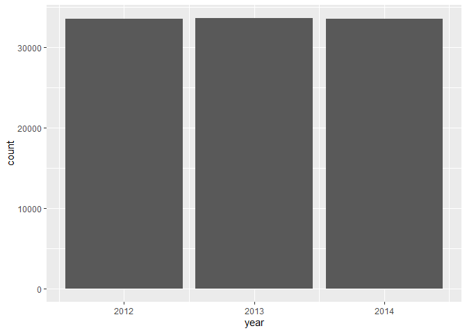
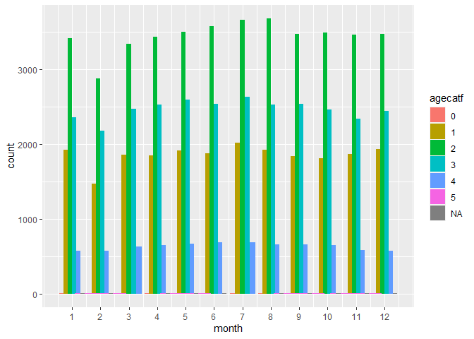
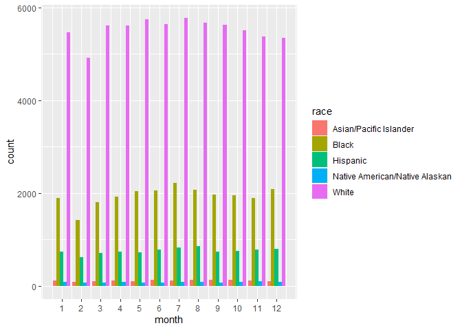
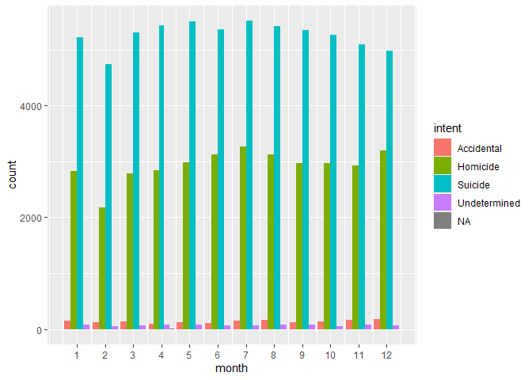
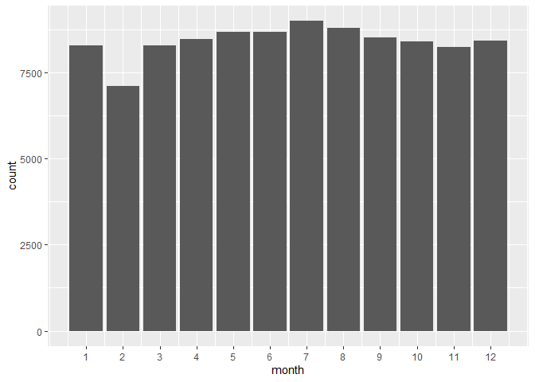
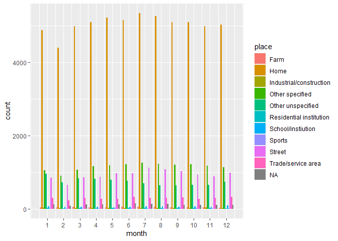
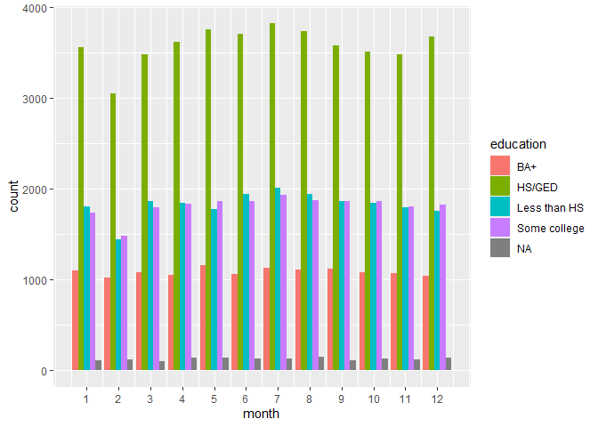
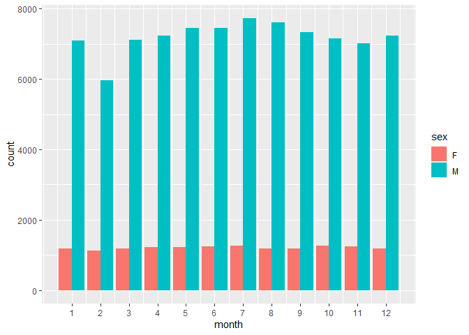

---
title: "Case Study 5: Reducing Gun Deaths"
author: "TomHollinberger"
date: "9/22/2020"
output: 
 html_document: 
   keep_md: yes
   toc: TRUE
   toc_depth: 6
---  
THIS RSCRIPT USES ROXYGEN CHARACTERS.  
YOU CAN PRESS ctrl+shift+K AND GO STRAIGHT TO A HTML.  
SKIPS THE HANDWORK OF CREATING A RMD, AFTER THE ORIGINAL WORK IS NONE IN A RSCRIPT.
[ ] Provide a brief summary of the FiveThirtyEight article.
[ ] [ ] Create one plot that provides similar insight to their visualization in the article. It does not have to look like theirs.
[ ] [ ] Write a short paragraph summarizing their article.
[ ] Address the client’s need for emphasis areas of their commercials for different seasons of the year.
[ ] [ ] Provide plots that help them know the different potential groups (variables) they could address in different seasons (2-4 visualizations seem necessary).
[ ] [ ] Write a short paragraph describing each image.
[ ] Compile your .md and .html file into your git repository.
[ ] Find two other student’s compiled files in their repository and provide feedback using the issues feature in GitHub. (If they already have three issues find a different student to critique.)
[ ] Address 1-2 of the issues posted on your project and push the updates to GitHub.
_________________________________
_________________________________

# Case Study 5: **Reducing Gun Deaths**
_________________________________
_________________________________

## **Brief summary** of the FiveThirtyEight article.
There is no single database. The numbers are confusingly subsetted.<br>
The obvious elephant in the room is Male-Suicides, but the other dimensions, such as Race, Gender, Police, Homocidal Intent, and the author's ulterior motive divert attention away from that. 

### 30,000 total gun deaths per year, of that,
#### 21,334 are Suicides, of that, 
##### ..18,134 (85%) are male, of that
###### ....9,600 (45% are males over 45)
#### 12,000 are Homicides, of that
##### ..6,000 are young men, of that
###### ....4,000 are young black men
##### ..1,700 are Women via Domestic Violence
##### ..1,000 are police-involved shootings
##### ..39 are police being shot
##### ..82 are by Terrorists
##### ..Rare, No Total Given for Mass-Shootings
#### 560 are Accidents
#### 240 are Undetermined


##Create one plot that provides similar insight to their visualization in the article. It does not have to look like theirs. <br>
Data Source : **guns-data/full_data**
### **My Question**: How do variable vary from month-to-month, and does that inform a marketing approach for public service announcments.<br> 
from fivethirtyeight, via github, guns-data/full_data.csv
The data contains the following fields:<br>
  ..   id = col_double(), 1 thru 100798<br>
  ..   year = col_double(), 2012 thru 2014<br>
  ..   month = col_double(), 1 thru 12<br>
  ..   intent = col_character(), Homocide, Suicide, Accidental, Undetermined, <br>
  ..   police = col_double(),  0 or 1  1= police-involved <br>
  ..   sex = col_character(), M or F <br>
  ..   age = col_double(),  numeric years <br>
  ..   race = col_character(), White, Black, Asian/Pacific Islander, Native American, Hispanic<br>
  ..   hispanic = col_double(),  100 if not Hispanic above, 9023 occurences of Hispanic.  998 ??   261, 211(very common), 210(very common), 222, 281, 282, <br>
  ..   place = col_character(),  Home, Street, Other, Trade/service area, Industrial/construction, etc....<br>
  ..   education = col_character()  BA+, Some College, HS/GED, Less THan HS, NA  <br>


**Download, Read, Explore/Inspect the Data, Manipulate (Change Column Titles), Check for Blanks, Save as csv, Overview Plots** 


```r
library(tidyverse)
```

```
## -- Attaching packages ------------------------------------------------- tidyverse 1.3.0 --
```

```
## v ggplot2 3.3.2     v purrr   0.3.4
## v tibble  3.0.3     v dplyr   1.0.0
## v tidyr   1.1.0     v stringr 1.4.0
## v readr   1.3.1     v forcats 0.5.0
```

```
## -- Conflicts ---------------------------------------------------- tidyverse_conflicts() --
## x dplyr::filter() masks stats::filter()
## x dplyr::lag()    masks stats::lag()
```

```r
library(dplyr)
library(ggplot2)
```

**Download** a file from FiveThirtyEight
Check working directory first to make sure you agree with where it's going.


```r
getwd()   #Good to go:  "E:/000 DTS 350 Data Visualization/DTS350-hollinbergert/DTS350TemplateMaster/Week_05/analysis"
```

```
## [1] "E:/000 DTS 350 Data Visualization/DTS350-hollinbergert/DTS350TemplateMaster/Week_05/analysis"
```


download.file("https://raw.githubusercontent.com/fivethirtyeight/guns-data/master/full_data.csv",
              "gdfd.csv", mode = "wb")  #saves to working directory
Breadcrumbs:  FiveThirtyEight, scroll down to bottom, DAta, click on the file-of-interest info button to view what it's about, 
you are now in GitHub, click on the csv filename, click on raw, copy that browser link into your Rscript download command

**Read_csv** in the "Path/File" 


```r
gdfd <- read_csv("E:/000 DTS 350 Data Visualization/DTS350-hollinbergert/DTS350TemplateMaster/Week_05/analysis/gdfd.csv")   #could filter at this point
```

```
## Parsed with column specification:
## cols(
##   id = col_double(),
##   year = col_double(),
##   month = col_double(),
##   intent = col_character(),
##   police = col_double(),
##   sex = col_character(),
##   age = col_double(),
##   race = col_character(),
##   hispanic = col_double(),
##   place = col_character(),
##   education = col_character()
## )
```


**Explore/Inspect the Data**
Looked at csv and put Col A header in "ID"


```r
str(gdfd)
```

```
## tibble [100,798 x 11] (S3: spec_tbl_df/tbl_df/tbl/data.frame)
##  $ id       : num [1:100798] 1 2 3 4 5 6 7 8 9 10 ...
##  $ year     : num [1:100798] 2012 2012 2012 2012 2012 ...
##  $ month    : num [1:100798] 1 1 1 2 2 2 2 3 2 2 ...
##  $ intent   : chr [1:100798] "Suicide" "Suicide" "Suicide" "Suicide" ...
##  $ police   : num [1:100798] 0 0 0 0 0 0 0 0 0 0 ...
##  $ sex      : chr [1:100798] "M" "F" "M" "M" ...
##  $ age      : num [1:100798] 34 21 60 64 31 17 48 41 50 NA ...
##  $ race     : chr [1:100798] "Asian/Pacific Islander" "White" "White" "White" ...
##  $ hispanic : num [1:100798] 100 100 100 100 100 100 100 100 100 998 ...
##  $ place    : chr [1:100798] "Home" "Street" "Other specified" "Home" ...
##  $ education: chr [1:100798] "BA+" "Some college" "BA+" "BA+" ...
##  - attr(*, "spec")=
##   .. cols(
##   ..   id = col_double(),
##   ..   year = col_double(),
##   ..   month = col_double(),
##   ..   intent = col_character(),
##   ..   police = col_double(),
##   ..   sex = col_character(),
##   ..   age = col_double(),
##   ..   race = col_character(),
##   ..   hispanic = col_double(),
##   ..   place = col_character(),
##   ..   education = col_character()
##   .. )
```

```r
head(gdfd, n = 10)
```

```
## # A tibble: 10 x 11
##       id  year month intent  police sex     age race    hispanic place education
##    <dbl> <dbl> <dbl> <chr>    <dbl> <chr> <dbl> <chr>      <dbl> <chr> <chr>    
##  1     1  2012     1 Suicide      0 M        34 Asian/~      100 Home  BA+      
##  2     2  2012     1 Suicide      0 F        21 White        100 Stre~ Some col~
##  3     3  2012     1 Suicide      0 M        60 White        100 Othe~ BA+      
##  4     4  2012     2 Suicide      0 M        64 White        100 Home  BA+      
##  5     5  2012     2 Suicide      0 M        31 White        100 Othe~ HS/GED   
##  6     6  2012     2 Suicide      0 M        17 Native~      100 Home  Less tha~
##  7     7  2012     2 Undete~      0 M        48 White        100 Home  HS/GED   
##  8     8  2012     3 Suicide      0 M        41 Native~      100 Home  HS/GED   
##  9     9  2012     2 Accide~      0 M        50 White        100 Othe~ Some col~
## 10    10  2012     2 Suicide      0 M        NA Black        998 Home  <NA>
```

```r
tail(gdfd, n = 10)
```

```
## # A tibble: 10 x 11
##        id  year month intent  police sex     age race   hispanic place education
##     <dbl> <dbl> <dbl> <chr>    <dbl> <chr> <dbl> <chr>     <dbl> <chr> <chr>    
##  1 100789  2014    12 Homici~      0 M        32 Asian~      100 Othe~ Some col~
##  2 100790  2014    12 Homici~      0 M        21 Hispa~      260 Stre~ HS/GED   
##  3 100791  2014    12 Suicide      0 M        28 Hispa~      260 Home  HS/GED   
##  4 100792  2014    12 Homici~      0 M        43 Black       100 Stre~ HS/GED   
##  5 100793  2014    12 Homici~      0 M        31 Black       100 Othe~ HS/GED   
##  6 100794  2014    12 Homici~      0 M        36 Black       100 Home  HS/GED   
##  7 100795  2014    12 Homici~      0 M        19 Black       100 Stre~ HS/GED   
##  8 100796  2014    12 Homici~      0 M        20 Black       100 Stre~ HS/GED   
##  9 100797  2014    12 Homici~      0 M        22 Hispa~      260 Stre~ Less tha~
## 10 100798  2014    10 Homici~      0 M        43 Black       100 Othe~ HS/GED
```

```r
sapply(gdfd,class)
```

```
##          id        year       month      intent      police         sex 
##   "numeric"   "numeric"   "numeric" "character"   "numeric" "character" 
##         age        race    hispanic       place   education 
##   "numeric" "character"   "numeric" "character" "character"
```

```r
summary(gdfd)
```

```
##        id              year          month           intent         
##  Min.   :     1   Min.   :2012   Min.   : 1.000   Length:100798     
##  1st Qu.: 25200   1st Qu.:2012   1st Qu.: 4.000   Class :character  
##  Median : 50400   Median :2013   Median : 7.000   Mode  :character  
##  Mean   : 50400   Mean   :2013   Mean   : 6.568                     
##  3rd Qu.: 75599   3rd Qu.:2014   3rd Qu.: 9.000                     
##  Max.   :100798   Max.   :2014   Max.   :12.000                     
##                                                                     
##      police            sex                 age             race          
##  Min.   :0.00000   Length:100798      Min.   :  0.00   Length:100798     
##  1st Qu.:0.00000   Class :character   1st Qu.: 27.00   Class :character  
##  Median :0.00000   Mode  :character   Median : 42.00   Mode  :character  
##  Mean   :0.01391                      Mean   : 43.86                     
##  3rd Qu.:0.00000                      3rd Qu.: 58.00                     
##  Max.   :1.00000                      Max.   :107.00                     
##                                       NA's   :18                         
##     hispanic        place            education        
##  Min.   :100.0   Length:100798      Length:100798     
##  1st Qu.:100.0   Class :character   Class :character  
##  Median :100.0   Mode  :character   Mode  :character  
##  Mean   :114.2                                        
##  3rd Qu.:100.0                                        
##  Max.   :998.0                                        
## 
```


**Manipulate** (Use *'rename'* to Change Column Titles) (NO NEED TO RENAME IN THIS CASE)(change to numerics)


```r
#gdfd2 <- rename(gdfd,new varname = oldvarname, etc...)
```

it's easy to write this if you copy the first line of the file (the old column names) and paste into this code line, then add the new column names, along with = signs and commas.


```r
# the result in the console has the old column titles, but when you call the new file's name it shows the new column titles.
gdfd2 <- gdfd
```


**Change to numerics**
id <- as.numeric(id)   #Error   cannot coerce type 'closure' to vector of type 'double'


```r
year <- as.numeric(gdfd2$year)
month <- as.numeric(gdfd2$month)
police <- as.numeric(gdfd2$police)
age <- as.numeric(gdfd2$age)
hispanic <- as.numeric(gdfd2$hispanic)
```


**Check for blank cells**


```r
table(is.na(gdfd2$id))    #looking for 100798 False's, the fully-populated list, with no NA's
```

```
## 
##  FALSE 
## 100798
```

```r
table(is.na(gdfd2$year)) 
```

```
## 
##  FALSE 
## 100798
```

```r
table(is.na(gdfd2$month)) 
```

```
## 
##  FALSE 
## 100798
```

```r
table(is.na(gdfd2$intent))   #there is one blank.
```

```
## 
##  FALSE   TRUE 
## 100797      1
```

```r
table(is.na(gdfd2$police)) 
```

```
## 
##  FALSE 
## 100798
```

```r
table(is.na(gdfd2$sex))
```

```
## 
##  FALSE 
## 100798
```

```r
table(is.na(gdfd2$age))      #there are 18 blanks
```

```
## 
##  FALSE   TRUE 
## 100780     18
```

```r
table(is.na(gdfd2$race))
```

```
## 
##  FALSE 
## 100798
```

```r
table(is.na(gdfd2$hispanic))
```

```
## 
##  FALSE 
## 100798
```

```r
table(is.na(gdfd2$place))      #there are 1384 blanks
```

```
## 
## FALSE  TRUE 
## 99414  1384
```

```r
table(is.na(gdfd2$education))  #there are 1422 blanks
```

```
## 
## FALSE  TRUE 
## 99376  1422
```


**Save as a csv**


```r
write_csv(gdfd2,"gdfd2.csv")  #check in excel to be sure you got what you wanted.
```


### View All-Combinations (Yates)  (All Variables except takeout year, hispanic, and age(replaced by agecat with four 25year-wide bins)


```r
gdfd3 <- mutate(gdfd2, agecat = ceiling(age/25))   #creates age categories for age <26 <51 <76 <101
gdfd3
```

```
## # A tibble: 100,798 x 12
##       id  year month intent police sex     age race  hispanic place education
##    <dbl> <dbl> <dbl> <chr>   <dbl> <chr> <dbl> <chr>    <dbl> <chr> <chr>    
##  1     1  2012     1 Suici~      0 M        34 Asia~      100 Home  BA+      
##  2     2  2012     1 Suici~      0 F        21 White      100 Stre~ Some col~
##  3     3  2012     1 Suici~      0 M        60 White      100 Othe~ BA+      
##  4     4  2012     2 Suici~      0 M        64 White      100 Home  BA+      
##  5     5  2012     2 Suici~      0 M        31 White      100 Othe~ HS/GED   
##  6     6  2012     2 Suici~      0 M        17 Nati~      100 Home  Less tha~
##  7     7  2012     2 Undet~      0 M        48 White      100 Home  HS/GED   
##  8     8  2012     3 Suici~      0 M        41 Nati~      100 Home  HS/GED   
##  9     9  2012     2 Accid~      0 M        50 White      100 Othe~ Some col~
## 10    10  2012     2 Suici~      0 M        NA Black      998 Home  <NA>     
## # ... with 100,788 more rows, and 1 more variable: agecat <dbl>
```

```r
gdfd4 <- select(gdfd3, police, month, intent, agecat, sex, race, education, place)  
gdfd4
```

```
## # A tibble: 100,798 x 8
##    police month intent     agecat sex   race               education  place     
##     <dbl> <dbl> <chr>       <dbl> <chr> <chr>              <chr>      <chr>     
##  1      0     1 Suicide         2 M     Asian/Pacific Isl~ BA+        Home      
##  2      0     1 Suicide         1 F     White              Some coll~ Street    
##  3      0     1 Suicide         3 M     White              BA+        Other spe~
##  4      0     2 Suicide         3 M     White              BA+        Home      
##  5      0     2 Suicide         2 M     White              HS/GED     Other spe~
##  6      0     2 Suicide         1 M     Native American/N~ Less than~ Home      
##  7      0     2 Undetermi~      2 M     White              HS/GED     Home      
##  8      0     3 Suicide         2 M     Native American/N~ HS/GED     Home      
##  9      0     2 Accidental      2 M     White              Some coll~ Other spe~
## 10      0     2 Suicide        NA M     Black              <NA>       Home      
## # ... with 100,788 more rows
```

```r
by_all <- group_by(gdfd4, police, month, intent, agecat, sex, race, education, place)
yates <- summarize(by_all,
                   count = n())
```

```
## `summarise()` regrouping output by 'police', 'month', 'intent', 'agecat', 'sex', 'race', 'education' (override with `.groups` argument)
```

```r
yates    #has 10,835 rows (combinations various levels of the 8 variables)
```

```
## # A tibble: 10,835 x 9
## # Groups:   police, month, intent, agecat, sex, race, education [4,358]
##    police month intent   agecat sex   race           education  place      count
##     <dbl> <dbl> <chr>     <dbl> <chr> <chr>          <chr>      <chr>      <int>
##  1      0     1 Acciden~      1 F     Black          HS/GED     Other uns~     1
##  2      0     1 Acciden~      1 F     Black          Less than~ Home           2
##  3      0     1 Acciden~      1 F     Black          Less than~ Other uns~     1
##  4      0     1 Acciden~      1 F     Black          <NA>       Home           1
##  5      0     1 Acciden~      1 F     White          Less than~ Home           1
##  6      0     1 Acciden~      1 F     White          Some coll~ Home           1
##  7      0     1 Acciden~      1 M     Asian/Pacific~ HS/GED     Home           1
##  8      0     1 Acciden~      1 M     Asian/Pacific~ Some coll~ Other uns~     1
##  9      0     1 Acciden~      1 M     Black          HS/GED     Home           1
## 10      0     1 Acciden~      1 M     Black          HS/GED     Other uns~     3
## # ... with 10,825 more rows
```

view(yates)  #then click on column header of Count to sort high to low, and see the most frequently occuring population-sector


```r
#  Also click on filter and see thumbnail distributions
```


## **Plots and Insights**

_____________________
_____________________
#### Plot 1:  Bar Chart,  Totals for Three years        


```r
ggplot(data = gdfd4) +
  geom_bar(mapping = aes(x = year), position = "dodge") 
```

<!-- -->

#### Insight 1:  Year -- Very similar numbers from year to year.  No trending up or down.


_____________________
_____________________
#### Plot 2: Age Category Clustered Bar Chart,  agecatf x month    Chap3 page 3.31


```r
agecatf <- as.factor(gdfd4$agecat)   #first need to change agecat to a factor
ggplot(data = gdfd4) +
  geom_bar(mapping = aes(x = month, fill = agecatf), position = "dodge") +
  scale_x_continuous(breaks = 1:12)
```

```
## Warning: position_dodge requires non-overlapping x intervals
```

<!-- -->

#### Insight 2:  Age Categories -- 1st) 25 to 50 years old, 2nd) 50 to 75 years old.    All age categories peak in Jul/Aug, with a secondary spike in Dec/Jan.  Largest month-to-month increase is from Feb to Mar.

_____________________
_____________________
#### Plot 3: Race Clustered Bar Chart,  race x month 


```r
ggplot(data = gdfd4) +
  geom_bar(mapping = aes(x = month, fill = race), position = "dodge") +
  scale_x_continuous(breaks = 1:12)
```

<!-- -->

#### Insight 3:  Race -- 1st) White, 2nd) Black.    All Race Categories peak in Jul/Aug (similar monthly profile as Age Categories)


_____________________
_____________________
#### Plot 4: Intent Clustered Bar Chart,  intent x month  


```r
ggplot(data = gdfd4) +
  geom_bar(mapping = aes(x = month, fill = intent), position = "dodge") +
  scale_x_continuous(breaks = 1:12)
```

<!-- -->

#### Insight 4:  Intent Categories -- 1st) Suicide, 2nd) Homicide.    Interesting differences in the month-to-month tracks of Homicides vs Suicides.  Both peak in Jul, but Homicides has a secondary peak in Dec/Jan, whereas Suicides are low in Dec.  

_____________________
_____________________
#### Plot 5: Police Clustered Bar Chart,  police x month    


```r
ggplot(data = gdfd4) +
  geom_bar(mapping = aes(x = month, fill = police), position = "dodge") +
  scale_x_continuous(breaks = 1:12)
```

<!-- -->

#### Insight 5:  Police Involved -- Shows the same month-to-month track as Homicides.  Both peak in Jul, and have a secondary peak in Dec/Jan.  


_____________________
_____________________
#### Plot 6: Place Clustered Bar Chart,  place x month  


```r
ggplot(data = gdfd4) +
  geom_bar(mapping = aes(x = month, fill = place), position = "dodge") +
  scale_x_continuous(breaks = 1:12)
```

<!-- -->

#### Insight 6:  Place -- 1st) Home, 2nd) Street.    Shows the same month-to-month track as Homicides.  Both peak in Jul, and have a secondary peak in Dec/Jan.


_____________________
_____________________
#### Plot 7: Education Clustered Bar Chart,  education x month  


```r
ggplot(data = gdfd4) +
  geom_bar(mapping = aes(x = month, fill = education), position = "dodge") +
  scale_x_continuous(breaks = 1:12)
```

<!-- -->

#### Insight 7:  Education -- 1st) HS/GED, 2nd) Tie: Less than HS, Some College.    All age categories peak in Jul/Aug, with a secondary spike in Dec/Jan.  Largest month-to-month increase is from Feb to Mar.


_____________________
_____________________
#### Plot 7: Gender Clustered Bar Chart,  gender x month  


```r
ggplot(data = gdfd4) +
  geom_bar(mapping = aes(x = month, fill = sex), position = "dodge") +
  scale_x_continuous(breaks = 1:12)
```

<!-- -->

#### Insight 7:  Gender -- 1st) Male, 2nd) Female.    Both genders peak in Jul/Aug, with a secondary spike in Dec/Jan.  Notice an anomaly for Females in October.

_____________________
_____________________
## **Consolidated Insight**<br>
All variables track similar year-long, month-to-month profiles.  That is, a peak in Jul/Aug and a secondary peak in Dec/Jan.  (Interestingly there is a consistent low in February.)<br>
From an intervention standpoint, that means that it isn't necessary to tailor or differentiate time-phased marketing strategies for the various races, ages, genders, etc.<br>
Just tailor it from month to month. And for the high-occurence subgroups:

### High Occurences:
#### Months:  1) Jul/Aug, 2) Dec/Jan
#### Gender:  1) Males, 2) Female
#### Age:    1) 25-50 year olds,  2) 50-75 year olds
#### Race:    1) White, 2) Black
#### Intents: 1) Suicides, 2) Homicides
#### Education:  1) HS/GED, 2) Less Than HS, and Some college
#### Place:  1) In the home, 2) on the street


