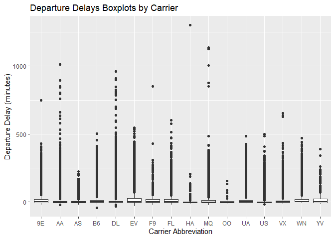
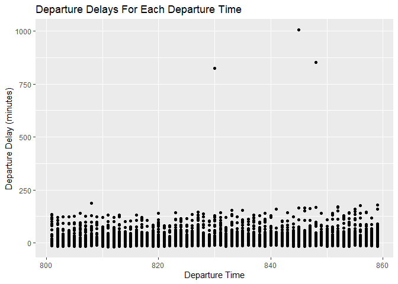
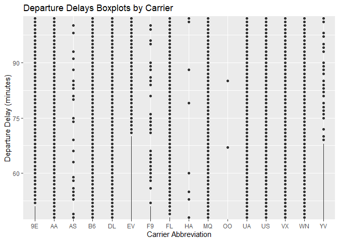
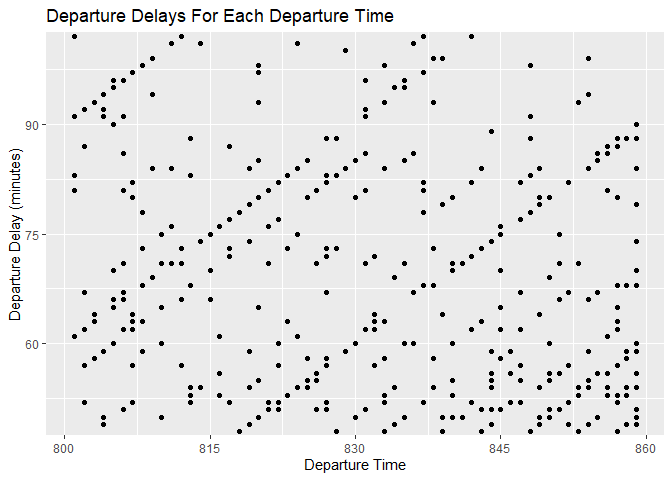
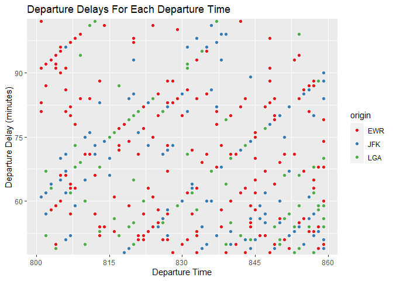
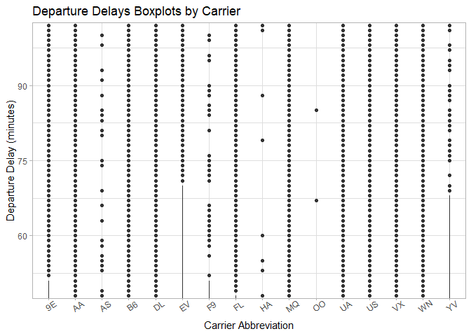
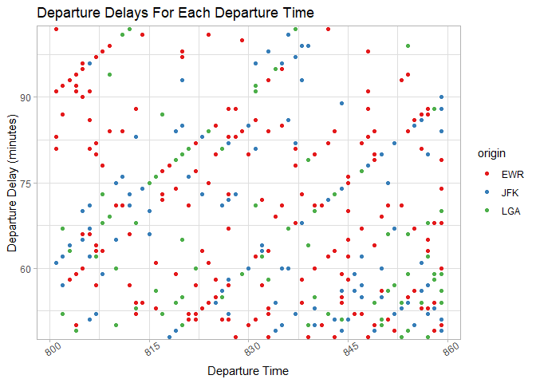
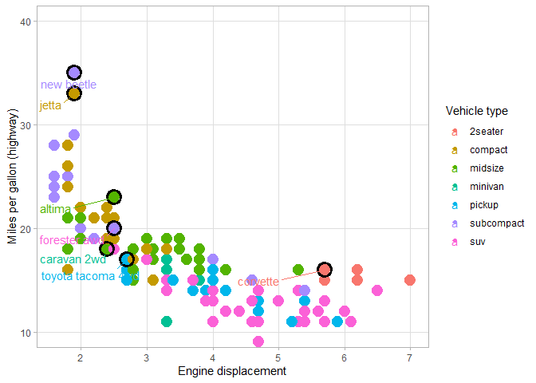

---
title: "Task 10 / Day 10 In Class : Labeling"
author: "TomHollinberger"
date: "9/29/2020"
output: 
 html_document: 
   keep_md: yes
   toc: TRUE
   toc_depth: 6
---  
THIS RSCRIPT USES ROXYGEN CHARACTERS.  
YOU CAN PRESS ctrl+shift+K AND GO STRAIGHT TO A HTML.  
SKIPS THE HANDWORK OF CREATING A RMD, AFTER THE ORIGINAL WORK IS NONE IN A RSCRIPT.


```r
library(ggplot2)
library(dplyr)
```

```
## 
## Attaching package: 'dplyr'
```

```
## The following objects are masked from 'package:stats':
## 
##     filter, lag
```

```
## The following objects are masked from 'package:base':
## 
##     intersect, setdiff, setequal, union
```

```r
library(nycflights13)
```

____________
____________
### Exercise 1: Look at the Data:  Top 10, Bottom 10, Row count, ID columns with NA's 


```r
head(flights,10)  # see the first 10 rows of data
```

```
## # A tibble: 10 x 19
##     year month   day dep_time sched_dep_time dep_delay arr_time sched_arr_time
##    <int> <int> <int>    <int>          <int>     <dbl>    <int>          <int>
##  1  2013     1     1      517            515         2      830            819
##  2  2013     1     1      533            529         4      850            830
##  3  2013     1     1      542            540         2      923            850
##  4  2013     1     1      544            545        -1     1004           1022
##  5  2013     1     1      554            600        -6      812            837
##  6  2013     1     1      554            558        -4      740            728
##  7  2013     1     1      555            600        -5      913            854
##  8  2013     1     1      557            600        -3      709            723
##  9  2013     1     1      557            600        -3      838            846
## 10  2013     1     1      558            600        -2      753            745
## # ... with 11 more variables: arr_delay <dbl>, carrier <chr>, flight <int>,
## #   tailnum <chr>, origin <chr>, dest <chr>, air_time <dbl>, distance <dbl>,
## #   hour <dbl>, minute <dbl>, time_hour <dttm>
```

```r
tail(flights,10)  # see the last 10 rows of data
```

```
## # A tibble: 10 x 19
##     year month   day dep_time sched_dep_time dep_delay arr_time sched_arr_time
##    <int> <int> <int>    <int>          <int>     <dbl>    <int>          <int>
##  1  2013     9    30     2240           2250       -10     2347              7
##  2  2013     9    30     2241           2246        -5     2345              1
##  3  2013     9    30     2307           2255        12     2359           2358
##  4  2013     9    30     2349           2359       -10      325            350
##  5  2013     9    30       NA           1842        NA       NA           2019
##  6  2013     9    30       NA           1455        NA       NA           1634
##  7  2013     9    30       NA           2200        NA       NA           2312
##  8  2013     9    30       NA           1210        NA       NA           1330
##  9  2013     9    30       NA           1159        NA       NA           1344
## 10  2013     9    30       NA            840        NA       NA           1020
## # ... with 11 more variables: arr_delay <dbl>, carrier <chr>, flight <int>,
## #   tailnum <chr>, origin <chr>, dest <chr>, air_time <dbl>, distance <dbl>,
## #   hour <dbl>, minute <dbl>, time_hour <dttm>
```

```r
str(flights)   #there are 336,776 rows of data 
```

```
## tibble [336,776 x 19] (S3: tbl_df/tbl/data.frame)
##  $ year          : int [1:336776] 2013 2013 2013 2013 2013 2013 2013 2013 2013 2013 ...
##  $ month         : int [1:336776] 1 1 1 1 1 1 1 1 1 1 ...
##  $ day           : int [1:336776] 1 1 1 1 1 1 1 1 1 1 ...
##  $ dep_time      : int [1:336776] 517 533 542 544 554 554 555 557 557 558 ...
##  $ sched_dep_time: int [1:336776] 515 529 540 545 600 558 600 600 600 600 ...
##  $ dep_delay     : num [1:336776] 2 4 2 -1 -6 -4 -5 -3 -3 -2 ...
##  $ arr_time      : int [1:336776] 830 850 923 1004 812 740 913 709 838 753 ...
##  $ sched_arr_time: int [1:336776] 819 830 850 1022 837 728 854 723 846 745 ...
##  $ arr_delay     : num [1:336776] 11 20 33 -18 -25 12 19 -14 -8 8 ...
##  $ carrier       : chr [1:336776] "UA" "UA" "AA" "B6" ...
##  $ flight        : int [1:336776] 1545 1714 1141 725 461 1696 507 5708 79 301 ...
##  $ tailnum       : chr [1:336776] "N14228" "N24211" "N619AA" "N804JB" ...
##  $ origin        : chr [1:336776] "EWR" "LGA" "JFK" "JFK" ...
##  $ dest          : chr [1:336776] "IAH" "IAH" "MIA" "BQN" ...
##  $ air_time      : num [1:336776] 227 227 160 183 116 150 158 53 140 138 ...
##  $ distance      : num [1:336776] 1400 1416 1089 1576 762 ...
##  $ hour          : num [1:336776] 5 5 5 5 6 5 6 6 6 6 ...
##  $ minute        : num [1:336776] 15 29 40 45 0 58 0 0 0 0 ...
##  $ time_hour     : POSIXct[1:336776], format: "2013-01-01 05:00:00" "2013-01-01 05:00:00" ...
```

```r
colnames(flights)[ apply(flights, 2, anyNA) ]    # there are 6 columns with NAs.  List COLUMNS with missing data, from https://stackoverflow.com/questions/20364450/find-names-of-columns-which-contain-missing-values
```

```
## [1] "dep_time"  "dep_delay" "arr_time"  "arr_delay" "tailnum"   "air_time"
```


Create the charts


```r
fl_bp <- flights %>%
  ggplot(aes(x = carrier, y = dep_delay))
fl_sc <- flights %>%
  filter(dep_time > 800, dep_time < 900) %>%
  ggplot(aes(x = dep_time, y = dep_delay))
```


____________
____________
### Exercise 2:  Create clean labels for the x and y axes using labs() so that we have the following plots.
Book Section 28.2 (pg 28.5)


```r
fl_bp <- flights %>%
  ggplot(aes(x = carrier, y = dep_delay))
fl_bp + geom_boxplot() +
  labs(
    x = "Carrier Abbreviation",
    y = "Departure Delay (minutes)",
    title = "Departure Delays Boxplots by Carrier"
  )
```

```
## Warning: Removed 8255 rows containing non-finite values (stat_boxplot).
```

<!-- -->

```r
fl_sc <- flights %>%
  filter(dep_time > 800, dep_time < 900) %>%
  ggplot(aes(x = dep_time, y = dep_delay))
fl_sc + geom_point() +
labs(
  x = "Departure Time",
  y = "Departure Delay (minutes)",
  title = "Departure Delays For Each Departure Time"
)
```

<!-- -->


____________
____________
### Exercise 3: Zoom in on the y axis from 50 to 100 minutes using coord_cartesian(), and also have breaks every 15 minutes using scale_y_continuous() and also scale_x_continuous on fl_sc plot. W
Book Section 28.5, (pg28.25) and https://rpubs.com/Mentors_Ubiqum/scale_x_continuous


```r
fl_bp <- flights %>%
ggplot(aes(x = carrier, y = dep_delay))
fl_bp + geom_boxplot() +
  labs(
    x = "Carrier Abbreviation",
    y = "Departure Delay (minutes)",
    title = "Departure Delays Boxplots by Carrier") +
  coord_cartesian(ylim = c(50,100) ) +
  scale_y_continuous(breaks = seq(from = 45, to = 105, by = 15))
```

```
## Warning: Removed 8255 rows containing non-finite values (stat_boxplot).
```

<!-- -->

```r
fl_sc <- flights %>%
  filter(dep_time > 800, dep_time < 900) %>%
  ggplot(aes(x = dep_time, y = dep_delay))
fl_sc + geom_point() +
  labs(
    x = "Departure Time",
    y = "Departure Delay (minutes)",
    title = "Departure Delays For Each Departure Time") +
  coord_cartesian(ylim = c(50,100) ) +
  scale_x_continuous(breaks = seq(from = 800, to = 860, by = 15)) +
  scale_y_continuous(breaks = seq(from = 45, to = 105, by = 15))  
```

<!-- -->


____________
____________
### Exercise 4: Color the points of fl_sc by origin using the Brewer scale using scale_color_brewer().  
Book Section 28.4.3.  (pg28.25)


```r
library(RColorBrewer)    #  load the colorbrewer library  Note: Brewer scale is for discrete variables.

fl_sc <- flights %>%
  filter(dep_time > 800, dep_time < 900) %>%
  ggplot(aes(x = dep_time, y = dep_delay, color = origin))   #add color=origin
fl_sc + geom_point() +
  labs(
    x = "Departure Time",
    y = "Departure Delay (minutes)",
    title = "Departure Delays For Each Departure Time") +
  coord_cartesian(ylim = c(50,100) ) +
  scale_x_continuous(breaks = seq(from = 800, to = 860, by = 15)) +
  scale_y_continuous(breaks = seq(from = 45, to = 105, by = 15)) +
  scale_colour_brewer(palette = "Set1")     #add the palette choice
```

<!-- -->


____________
____________
### Exercise 5: Choose a theme, change the orientation of the x-axis text to 35 degrees, and save your final plot.
Themes: Book Section 28.6. (pg 28.35) ;  Axis Text Orientation (5inclass line 320) ;  ggsave : Book Section 28.7 (pg28.39)


```r
library(tidyverse)
```

```
## -- Attaching packages ----------------------------------------------------------------------------------------- tidyverse 1.3.0 --
```

```
## v tibble  3.0.3     v purrr   0.3.4
## v tidyr   1.1.0     v stringr 1.4.0
## v readr   1.3.1     v forcats 0.5.0
```

```
## -- Conflicts -------------------------------------------------------------------------------------------- tidyverse_conflicts() --
## x dplyr::filter() masks stats::filter()
## x dplyr::lag()    masks stats::lag()
```

```r
fl_bp <- flights %>%
  ggplot(aes(x = carrier, y = dep_delay))
fl_bp + geom_boxplot() +
  theme_light() +
  labs(
    x = "Carrier Abbreviation",
    y = "Departure Delay (minutes)",
    title = "Departure Delays Boxplots by Carrier") +
    coord_cartesian(ylim = c(50,100) ) +
    scale_y_continuous(breaks = seq(from = 45, to = 105, by = 15)) +
    theme(axis.text.x = element_text(angle = 35))
```

```
## Warning: Removed 8255 rows containing non-finite values (stat_boxplot).
```

<!-- -->

```r
ggsave("10TaskBoxPlot.png")    
```

```
## Saving 7 x 5 in image
```

```
## Warning: Removed 8255 rows containing non-finite values (stat_boxplot).
```


____________
____________
### **10Task BoxPlot**: a short paragrph describing your plot and what you learned from creating the plot.<br>
This plot actually only shows the upper outliers because the y limits have excluded the box of the boxplots.  It now shows which carriers have late departures in the 50 to 100 minute range. 
I learned how to change the limits of the y-axis. 
I learned how to set the increments for breaks for the grid.
Re-learned how to set the color, and change the axis titles, and plot title.
<br>


```r
fl_sc <- flights %>%
  filter(dep_time > 800, dep_time < 900) %>%
  ggplot(aes(x = dep_time, y = dep_delay, color = origin))   
fl_sc + geom_point() +
  theme_light() +
  labs(
    x = "Departure Time",
    y = "Departure Delay (minutes)",
    title = "Departure Delays For Each Departure Time") +
  coord_cartesian(ylim = c(50,100) ) +
  scale_x_continuous(breaks = seq(from = 800, to = 860, by = 15)) +
  scale_y_continuous(breaks = seq(from = 45, to = 105, by = 15)) +
  scale_colour_brewer(palette = "Set1") +     
  theme(axis.text.x = element_text(angle = 35))
```

<!-- -->

```r
ggsave("10TaskScatterPlot.png")
```

```
## Saving 7 x 5 in image
```


____________
____________
### **10Task ScatterPlot**: a short paragrph describing your plot and what you learned from creating the plot.<br>
This plot shows departure times (x) between 8am and 8:30am. And Departur delays from 50 to 100 minutes on the y-axis.  Data points are colorized by carrier.  Interesting are the diagonal tracks of points from lower-left to upper-right.  Apparently there is a close correlation between when the flight was scheduled to leave, and how delayed it will be.  These tracks might show a bottleneck in the runway operations.  Once a logjam occurs, then each successive flight is pushed back by one more minute.  
I learned how to change the axis text angle, 
I learned how to pick the color_brewer palette.
<br>

____________
____________
### Exercise 6: Use the code from 28.3 and recreate the following plot as well as you can. Note, you don’t need to match the color scheme, but if you want to, I used library(viridis). Save your plot.


```r
library(viridis)
```

```
## Loading required package: viridisLite
```


```r
best_in_class <- mpg %>%
  group_by(class) %>%
  filter(row_number(desc(cty)) == 1)
best_in_class
```

```
## # A tibble: 7 x 11
## # Groups:   class [7]
##   manufacturer model     displ  year   cyl trans  drv     cty   hwy fl    class 
##   <chr>        <chr>     <dbl> <int> <int> <chr>  <chr> <int> <int> <chr> <chr> 
## 1 chevrolet    corvette    5.7  1999     8 manua~ r        16    26 p     2seat~
## 2 dodge        caravan ~   2.4  1999     4 auto(~ f        18    24 r     miniv~
## 3 nissan       altima      2.5  2008     4 auto(~ f        23    31 r     midsi~
## 4 subaru       forester~   2.5  2008     4 manua~ 4        20    27 r     suv   
## 5 toyota       toyota t~   2.7  2008     4 manua~ 4        17    22 r     pickup
## 6 volkswagen   jetta       1.9  1999     4 manua~ f        33    44 d     compa~
## 7 volkswagen   new beet~   1.9  1999     4 manua~ f        35    44 d     subco~
```

```r
ggplot(mpg, aes(displ, cty)) +
geom_point(aes(size = 8, colour = class)) +
  theme_light() +
  labs(
    x = "Engine displacement",
    y = "Miles per gallon (highway)",
    color = "Vehicle type") +
  coord_cartesian(ylim = c(10,40) ) +
  scale_x_continuous(breaks = seq(from = 2, to = 7, by = 1)) +
  scale_y_continuous(breaks = seq(from = 10, to = 40, by = 10)) +
  scale_fill_viridis() + 
  geom_point(shape = 21, size = 5, stroke = 2, data = best_in_class) +
  guides(size = FALSE, shape = 1) +             #book 28.4.1
  ggrepel::geom_text_repel(aes(label = model, color = class), data = best_in_class, nudge_x = -1, nudge_y = -1) +
  theme(panel.grid.minor.y = element_blank(),   #takes out the mminor horizontal white lines
          panel.grid.minor.x = element_blank())   #takes out the minor vertical white lines)
```

<!-- -->

```r
ggsave("10TaskExercise6Plot.png")
```

```
## Saving 7 x 5 in image
```


____________
____________
### **Plot for Exercise 6**: a short paragrph describing your plot and what you learned from creating the plot. <br>
This plot shows engine displacement (x) and miles per gallon (y),and calls out the best-in-class model for each of 7 classes.  Data points are colorized by class.  There is a negative correlation between engine displacement and miles per gallon, with larger engine displacement causing fewer miles per gallon.  Also the vertical dispersion of the datacloud shows that in the smaller-displacement engines there is a larger variation, from 17mpg up to 35 mpg.  While in the larger-displacement engines, there is less variation, from 11 to 16 mpg.
I learned how to change the shape, size, and stroke of the Best-In-Class points.
Can't figure out how to color-code them, though.
Learned how to turn off one of the sub-legends using 'guide' command.
Couldn't get viridis to work.
Learned about negative nudging to plave labels below and to the left of a point.
Can't figure out how to change the icon in the legend.  Used to be a circle, but it changes to a leaf, or something.
