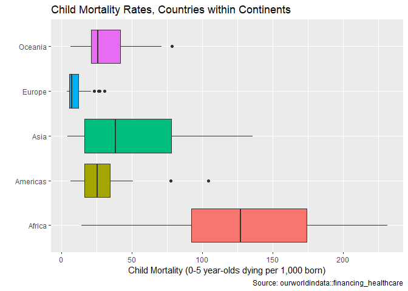

---
title: "Task 11 World Data Investigations PAert 2"
author: "TomHollinberger"
date: "10/01/2020"
output: 
 html_document: 
   keep_md: yes
   toc: TRUE
   toc_depth: 6
---  
THIS RSCRIPT USES ROXYGEN CHARACTERS.  
YOU CAN PRESS ctrl+shift+K AND GO STRAIGHT TO A HTML.  
SKIPS THE HANDWORK OF CREATING A RMD, AFTER THE ORIGINAL WORK IS NONE IN A RSCRIPT.


```r
library(tidyverse)
```

```
## -- Attaching packages --------------------------------------------------------------------------------------------- tidyverse 1.3.0 --
```

```
## v ggplot2 3.3.2     v purrr   0.3.4
## v tibble  3.0.3     v dplyr   1.0.0
## v tidyr   1.1.0     v stringr 1.4.0
## v readr   1.3.1     v forcats 0.5.0
```

```
## -- Conflicts ------------------------------------------------------------------------------------------------ tidyverse_conflicts() --
## x dplyr::filter() masks stats::filter()
## x dplyr::lag()    masks stats::lag()
```

```r
library(ggplot2)
library(dplyr)
library(devtools)
```

```
## Loading required package: usethis
```

```r
fh <- ourworldindata::financing_healthcare
```

fh
?ourworldindata::financing_healthcare
str(fh)
summary(fh)
child_mort is numeric, continuous variable, range from 2 to 756, median 369.  3632 NAs out of 36873.
year is an integer, discrete variable, from 1761 to 2015.  No NAs.

## Plot 1 Boxplot of Year 2000 Continental Child Mortality Rates
### Insight 1 : Africa has the worst median child lortality rates, but also the widest variation among its countries rates.  Europe has teh best median and the narrowest variation.
fh


```r
fhyr <- subset(fh, continent != "")   #get rid of rows with blanks in continent variable
fhyr <- subset(fhyr, year == "2000")
```

fhyr$year


```r
# view(fhyr)
ggplot(data = fhyr, mapping = aes(x = reorder(continent, child_mort, FUN = median), y = child_mort, fill = continent)) +
  geom_boxplot() +  #not reordering
  coord_flip() +
  theme(legend.position = "none") +
  labs(
    x = "",
    y = "Child Mortality (0-5 year-olds dying per 1,000 born)",
    title = "Child Mortality Rates, Countries within Continents",
    caption = "Source: ourworldindata::financing_healthcare"
    ) 
```

```
## Warning: Removed 17 rows containing non-finite values (stat_boxplot).
```

<!-- -->


## Plot 2 Scatterplot of GDP per Capita vs Child Mortality Rates (Year 2000, all countries)
### Insight 2 : It doesn't take much personal income (GDP per capita) to bring down the child mortality rate.  We could set a goal of Child Mortality of 25 deaths per thousand, and from the chart we could predict that we would need to raise the lower per capita GDP's to approximately $15,000 per year.
fh


```r
fhyr <- subset(fh, continent != "")   #get rid of rows with blanks in continent variable
fhyr <- subset(fhyr, year == "2000")  

ggplot(data = fhyr) +
  geom_point(mapping = aes(x = child_mort, y = (gdp))) +
  coord_cartesian(ylim = c(0,200)) +
coord_flip() +
labs(
  y = "GDP per Capita",
  x = "Child Mortality (0-5 year-olds dying per 1,000 born)",
  title = "Child Mortality Rates x GDP per Capita",
  subtitle = "Year 2000, All Countries",
  caption = "Source: ourworldindata::financing_healthcare"
)   
```

```
## Coordinate system already present. Adding new coordinate system, which will replace the existing one.
```

```
## Warning: Removed 32 rows containing missing values (geom_point).
```

<!-- -->

tried to colorize by continent but it didn't work'  
 listofcolors <- c("green","blue","red","yellow","orange")  #assigns these alphabetically to the continents
 scale_fill_discrete(continent) 
 scale_fill_manual(values = listofcolors)

## Plot 3 Mass Chart: Decreasing Child Mortality Rates (All Years, All Countries, By Continent)
### Insight 3 : 1900-1950 was a period of steep decline for all continents.  The flat spots show some suspicious data.  The vertical dimension of the mass portrays the range of country values within a particular continent, for a particular year.  Notice Europe in WWII, and Philippines in 1902 (Philippine/American War)
Get rid of NA's in child_mort column


```r
fhnocmna <- fh
fhnocmna <- filter(fh, child_mort != "NA") 
```

fhnocmna$child_mort                 
Get rid of NA's in Continent  doesn't seem to work, might be the difference between NA and blank.


```r
fhcontnona <- fh
fhcontnona %>% drop_na("continent")   
```

```
## # A tibble: 34,776 x 17
##     year country continent health_exp_total health_exp_publ~ health_insurance
##    <int> <chr>   <chr>                <dbl>            <dbl>            <int>
##  1  1800 Afghan~ Asia                    NA               NA               NA
##  2  1801 Afghan~ Asia                    NA               NA               NA
##  3  1802 Afghan~ Asia                    NA               NA               NA
##  4  1803 Afghan~ Asia                    NA               NA               NA
##  5  1804 Afghan~ Asia                    NA               NA               NA
##  6  1805 Afghan~ Asia                    NA               NA               NA
##  7  1806 Afghan~ Asia                    NA               NA               NA
##  8  1807 Afghan~ Asia                    NA               NA               NA
##  9  1808 Afghan~ Asia                    NA               NA               NA
## 10  1809 Afghan~ Asia                    NA               NA               NA
## # ... with 34,766 more rows, and 11 more variables: nhs_exp <dbl>,
## #   health_exp_private <dbl>, health_insurance_govt <dbl>,
## #   health_insurance_private <dbl>, health_insurance_any <dbl>,
## #   health_exp_public_percent <dbl>, health_exp_oop_percent <dbl>,
## #   no_health_insurance <dbl>, gdp <dbl>, life_expectancy <dbl>,
## #   child_mort <dbl>
```

fhcontnona
Get rid of rows with blank data in continent variable  (different that if they contain NA)


```r
fhcontnona <- fh
fhcontnona <- subset(fhcontnona, continent != "")
```

fhcontnona$continent


```r
ggplot(data = fhcontnona, mapping = aes(x = year, y = child_mort, colour = continent)) +
  geom_line() +
  facet_wrap(~ continent) +
  theme(legend.position = "none") +
  labs(
    x = "Year",
    y = "Range of Country Child Mortality Rates",
    title = "Decreasing Child Mortality Rates", 
    subtitle = "(All Years, All Countries, By Continent)",
    caption = "Source: ourworldindata::financing_healthcare"
)   
```

```
## Warning: Removed 426 row(s) containing missing values (geom_path).
```

<!-- -->

