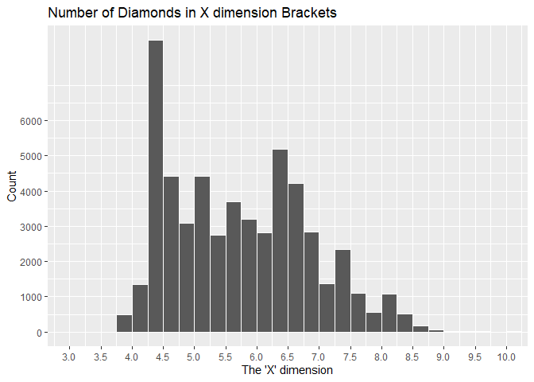
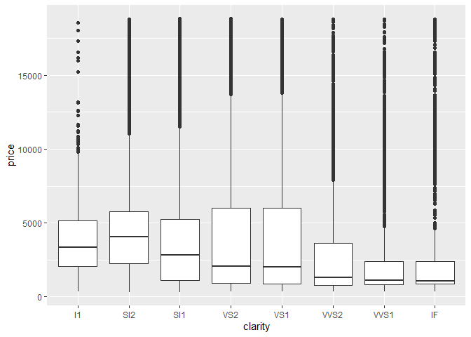
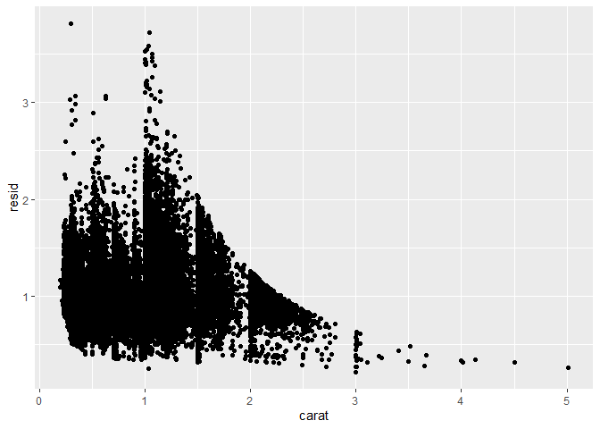

---
title: "Case Study 6"
author: "TomHollinberger"
date: "10/01/2020"
output: 
 html_document: 
   keep_md: yes
   toc: TRUE
   toc_depth: 6
---  
THIS RSCRIPT USES ROXYGEN CHARACTERS.  
YOU CAN PRESS ctrl+shift+K AND GO STRAIGHT TO A HTML.  
SKIPS THE HANDWORK OF CREATING A RMD, AFTER THE ORIGINAL WORK IS NONE IN A RSCRIPT.


```r
library(tidyverse)
```

```
## -- Attaching packages --------------------------------------------------------------------------- tidyverse 1.3.0 --
```

```
## v ggplot2 3.3.2     v purrr   0.3.4
## v tibble  3.0.3     v dplyr   1.0.0
## v tidyr   1.1.0     v stringr 1.4.0
## v readr   1.3.1     v forcats 0.5.0
```

```
## -- Conflicts ------------------------------------------------------------------------------ tidyverse_conflicts() --
## x dplyr::filter() masks stats::filter()
## x dplyr::lag()    masks stats::lag()
```

```r
library(ggplot2)
library(dplyr)
```


## [ ] Make visualizations to give the distribution of each of the x, y, and z variables in the diamonds data set.

### **Graph the X dimension** with ggplot


```r
ggplot(data = diamonds) +
  geom_histogram(mapping = aes(x = x), binwidth = .25, boundary = 0, color = "white") +
  labs(
    x = "The 'X' dimension",
    y = "Count",
    title = "Number of Diamonds in X dimension Brackets") +
    coord_cartesian(xlim = c(3,10) ) +
    scale_x_continuous(breaks = seq(from = 3.0, to = 10, by = .5)) +
    scale_y_continuous(breaks = seq(from = 0, to = 6000, by = 1000))
```

<!-- -->

  
### **Count the X dimension** frequencies with dplyr  -- 
#### Insights: Looks like some spurious data in 8 rows where X is between -.125 and +.125 -- likely ZERO.
#### Insights: Also some higher than normal values in 10.3 (2 obs), and 10.75 range.


```r
diamonds %>%
  count(cut_width(x,1,boundary = 0))  #keep adjusting the cut_width until 10 buckets can hold the full range: only then can you see the total range of values.
```

```
## # A tibble: 9 x 2
##   `cut_width(x, 1, boundary = 0)`     n
##   <fct>                           <int>
## 1 [0,1]                               8
## 2 (3,4]                             488
## 3 (4,5]                           17123
## 4 (5,6]                           14062
## 5 (6,7]                           15034
## 6 (7,8]                            5351
## 7 (8,9]                            1832
## 8 (9,10]                             37
## 9 (10,11]                             5
```

```r
  options(tibble.print_max = Inf) 
```

More detailed count, to see more than 10 buckets.  From the previous code, you know the range is 10.  If you want .25 bin width, you'll need to increase the head-count to 40 


```r
diacount <- count(diamonds, cut_width(x,.25,boundary = 0))
head(diacount, 23)  #goes up to a max of 20, unless you use options tibble...
```

```
## # A tibble: 23 x 2
##    `cut_width(x, 0.25, boundary = 0)`     n
##    <fct>                              <int>
##  1 [0,0.25]                               8
##  2 (3.5,3.75]                             3
##  3 (3.75,4]                             485
##  4 (4,4.25]                            1349
##  5 (4.25,4.5]                          8270
##  6 (4.5,4.75]                          4410
##  7 (4.75,5]                            3094
##  8 (5,5.25]                            4408
##  9 (5.25,5.5]                          2746
## 10 (5.5,5.75]                          3702
## 11 (5.75,6]                            3206
## 12 (6,6.25]                            2825
## 13 (6.25,6.5]                          5177
## 14 (6.5,6.75]                          4204
## 15 (6.75,7]                            2828
## 16 (7,7.25]                            1365
## 17 (7.25,7.5]                          2332
## 18 (7.5,7.75]                          1105
## 19 (7.75,8]                             549
## 20 (8,8.25]                            1071
## 21 (8.25,8.5]                           522
## 22 (8.5,8.75]                           177
## 23 (8.75,9]                              62
```

To Print more than 10 rows of a tibble from : https://cran.r-project.org/web/packages/tibble/vignettes/tibble.html
options(tibble.print_max = n, tibble.print_min = m)  #if there are more than n rows, print only the first m rows. Use options(tibble.print_max = Inf) to always show all rows.
Print All Columns 
options(tibble.width = Inf) # will always print all columns, regardless of the width of the screen.


```r
diamonds %>%
  count(cut_width(x,.25, boundary = 0)) 
```

```
## # A tibble: 29 x 2
##    `cut_width(x, 0.25, boundary = 0)`     n
##    <fct>                              <int>
##  1 [0,0.25]                               8
##  2 (3.5,3.75]                             3
##  3 (3.75,4]                             485
##  4 (4,4.25]                            1349
##  5 (4.25,4.5]                          8270
##  6 (4.5,4.75]                          4410
##  7 (4.75,5]                            3094
##  8 (5,5.25]                            4408
##  9 (5.25,5.5]                          2746
## 10 (5.5,5.75]                          3702
## 11 (5.75,6]                            3206
## 12 (6,6.25]                            2825
## 13 (6.25,6.5]                          5177
## 14 (6.5,6.75]                          4204
## 15 (6.75,7]                            2828
## 16 (7,7.25]                            1365
## 17 (7.25,7.5]                          2332
## 18 (7.5,7.75]                          1105
## 19 (7.75,8]                             549
## 20 (8,8.25]                            1071
## 21 (8.25,8.5]                           522
## 22 (8.5,8.75]                           177
## 23 (8.75,9]                              62
## 24 (9,9.25]                              17
## 25 (9.25,9.5]                            13
## 26 (9.5,9.75]                             5
## 27 (9.75,10]                              2
## 28 (10,10.2]                              4
## 29 (10.5,10.8]                            1
```

```r
options(tibble.print_max = Inf)  #this appears to be a toggle on forever situation.
```


### **Graph the Y dimension** with ggplot


```r
ggplot(data = diamonds) +
  geom_histogram(mapping = aes(x = y), binwidth = .25, boundary = 0, color = "white") +
  labs(
    x = "The 'Y' dimension",
    y = "Count",
    title = "Number of Diamonds in Y dimension Brackets") +
  coord_cartesian(xlim = c(3,10) ) +
  scale_x_continuous(breaks = seq(from = 3.0, to = 10, by = .5)) +
  scale_y_continuous(breaks = seq(from = 0, to = 6000, by = 1000))
```

<!-- -->


### **Count the Y dimension** frequencies with dplyr  -- 
#### Insights: Looks like some spurious data in 7 rows where y is between -.125 and +.125 -- likely ZERO.
#### Insights: Also some higher than normal values in 10.3, 10.5, 31.75, and 59 range.


```r
diamonds %>%
  count(cut_width(y,.25))
```

```
## # A tibble: 31 x 2
##    `cut_width(y, 0.25)`     n
##    <fct>                <int>
##  1 [-0.125,0.125]           7
##  2 (3.62,3.88]             30
##  3 (3.88,4.12]            895
##  4 (4.12,4.38]           4957
##  5 (4.38,4.62]           5882
##  6 (4.62,4.88]           5059
##  7 (4.88,5.12]           2374
##  8 (5.12,5.38]           4542
##  9 (5.38,5.62]           1885
## 10 (5.62,5.88]           4778
## 11 (5.88,6.12]           2419
## 12 (6.12,6.38]           3759
## 13 (6.38,6.62]           5506
## 14 (6.62,6.88]           3429
## 15 (6.88,7.12]           1937
## 16 (7.12,7.38]           1883
## 17 (7.38,7.62]           1810
## 18 (7.62,7.88]            674
## 19 (7.88,8.12]            832
## 20 (8.12,8.38]            849
## 21 (8.38,8.62]            287
## 22 (8.62,8.88]             92
## 23 (8.88,9.12]             24
## 24 (9.12,9.38]             13
## 25 (9.38,9.62]              7
## 26 (9.62,9.88]              3
## 27 (9.88,10.1]              3
## 28 (10.1,10.4]              1
## 29 (10.4,10.6]              1
## 30 (31.6,31.9]              1
## 31 (58.9,59.1]              1
```


### **Graph the Z dimension** with ggplot


```r
ggplot(data = diamonds) +
  geom_histogram(mapping = aes(x = z), binwidth = .25, boundary = 0, color = "white") +
  labs(
    x = "The 'Z' dimension",
    y = "Count",
    title = "Number of Diamonds in Z dimension Brackets") +
  coord_cartesian(xlim = c(0,10) ) +
  scale_x_continuous(breaks = seq(from = 0, to = 40, by = .5)) +
  scale_y_continuous(breaks = seq(from = 0, to = 6000, by = 1000))
```

<!-- -->


### **Count the Z dimension** frequencies with dplyr  -- 
#### Insights: Looks like some spurious data in 20 rows where y is between -.125 and +.125 -- likely ZERO.
#### Insights: Also a higher than normal value in 31.75 range.


```r
diamonds %>%
  count(cut_width(z,.25, boundary = 0))
```

```
## # A tibble: 26 x 2
##    `cut_width(z, 0.25, boundary = 0)`     n
##    <fct>                              <int>
##  1 [0,0.25]                              20
##  2 (1,1.25]                               1
##  3 (1.25,1.5]                             1
##  4 (1.5,1.75]                             1
##  5 (2,2.25]                               3
##  6 (2.25,2.5]                           698
##  7 (2.5,2.75]                          8578
##  8 (2.75,3]                            7521
##  9 (3,3.25]                            5819
## 10 (3.25,3.5]                          3705
## 11 (3.5,3.75]                          5867
## 12 (3.75,4]                            6706
## 13 (4,4.25]                            6878
## 14 (4.25,4.5]                          2551
## 15 (4.5,4.75]                          3038
## 16 (4.75,5]                            1096
## 17 (5,5.25]                            1192
## 18 (5.25,5.5]                           203
## 19 (5.5,5.75]                            35
## 20 (5.75,6]                              13
## 21 (6,6.25]                               6
## 22 (6.25,6.5]                             4
## 23 (6.5,6.75]                             1
## 24 (6.75,7]                               1
## 25 (8,8.25]                               1
## 26 (31.8,32]                              1
```


### **Zoom In on y axis, Zoom out on x-axis** 
Zoom-in on the y axis to see the small counts, Zoom-out to full extent of x-axis values

#### Insight: Gives a better appreciation of potential outliers.


```r
ggplot(data = diamonds) +
  geom_histogram(mapping = aes(x = z), binwidth = .25, boundary = 0, color = "white") +
  labs(
    x = "The 'Z' dimension",
    y = "Count",
    title = "Number of Diamonds in Z dimension Brackets") +
  coord_cartesian(xlim = c(0,35) ) +
  coord_cartesian(ylim = c(0,60) ) 
```

```
## Coordinate system already present. Adding new coordinate system, which will replace the existing one.
```

<!-- -->


## [ ] Explore the distribution of price. Is there anything unusual or surprising?
### **Graph Price** : a Frequency Distribution of Price with ggplot
#### Insight: Initial count to see extent shows prices ranging from zero to $20000.
#### Insight: Most frequent occurrences in the 2000 and below range.  A small bump in the $5000 range.


```r
diamonds %>%
count(cut_width(price,1000, boundary = 0))
```

```
## # A tibble: 19 x 2
##    `cut_width(price, 1000, boundary = 0)`     n
##    <fct>                                  <int>
##  1 [0,1e+03]                              14524
##  2 (1e+03,2e+03]                           9683
##  3 (2e+03,3e+03]                           6129
##  4 (3e+03,4e+03]                           4225
##  5 (4e+03,5e+03]                           4665
##  6 (5e+03,6e+03]                           3163
##  7 (6e+03,7e+03]                           2278
##  8 (7e+03,8e+03]                           1668
##  9 (8e+03,9e+03]                           1307
## 10 (9e+03,1e+04]                           1076
## 11 (1e+04,1.1e+04]                          934
## 12 (1.1e+04,1.2e+04]                        825
## 13 (1.2e+04,1.3e+04]                        701
## 14 (1.3e+04,1.4e+04]                        603
## 15 (1.4e+04,1.5e+04]                        504
## 16 (1.5e+04,1.6e+04]                        513
## 17 (1.6e+04,1.7e+04]                        425
## 18 (1.7e+04,1.8e+04]                        405
## 19 (1.8e+04,1.9e+04]                        312
```

```r
ggplot(data = diamonds) +
  geom_histogram(mapping = aes(x = price), binwidth = 500, boundary = 0, color = "white") +   #boundary = 0 sets the bins' edges at 1000's aot the centers at 1000's,
  labs(
    x = "Price",
    y = "Count",
    title = "Number of Diamonds in Price Brackets") +
  coord_cartesian(xlim = c(0,20000) ) +
  scale_x_continuous(breaks = seq(from = 0, to = 20000, by = 2000)) +
  scale_y_continuous(breaks = seq(from = 0, to = 10000, by = 1000)) +
  theme(axis.text.x = element_text(angle = 0))
```

<!-- -->


### **Count Price** frequencies with dplyr  -- 
#### Insights: Looks like some spurious data in 20 rows where y is between -.125 and +.125 -- likely ZERO.
#### Insights: Also a higher than normal value in 31.75 range.


```r
diamonds %>%
  count(cut_width(price,1000, boundary = 0))  #boundary = 0 sets the bins' edges at 1000's aot the centers at 1000's, from https://www.rdocumentation.org/packages/ggplot2/versions/3.3.2/topics/cut_interval
```

```
## # A tibble: 19 x 2
##    `cut_width(price, 1000, boundary = 0)`     n
##    <fct>                                  <int>
##  1 [0,1e+03]                              14524
##  2 (1e+03,2e+03]                           9683
##  3 (2e+03,3e+03]                           6129
##  4 (3e+03,4e+03]                           4225
##  5 (4e+03,5e+03]                           4665
##  6 (5e+03,6e+03]                           3163
##  7 (6e+03,7e+03]                           2278
##  8 (7e+03,8e+03]                           1668
##  9 (8e+03,9e+03]                           1307
## 10 (9e+03,1e+04]                           1076
## 11 (1e+04,1.1e+04]                          934
## 12 (1.1e+04,1.2e+04]                        825
## 13 (1.2e+04,1.3e+04]                        701
## 14 (1.3e+04,1.4e+04]                        603
## 15 (1.4e+04,1.5e+04]                        504
## 16 (1.5e+04,1.6e+04]                        513
## 17 (1.6e+04,1.7e+04]                        425
## 18 (1.7e+04,1.8e+04]                        405
## 19 (1.8e+04,1.9e+04]                        312
```


## [ ] Can you determine what variable in the diamonds dataset is most important for predicting the price of a diamond? 
### **BOXPLOT Price vs Cut** : shows very little correlation.  Flat, wobbling means.


```r
ggplot(data = diamonds, mapping = aes(x = cut, y = price)) +
  geom_boxplot()
```

<!-- -->


### **BOXPLOT Price vs Color** : shows a slight positive correlation, shallow up-slope of means.


```r
ggplot(data = diamonds, mapping = aes(x = color, y = price)) +
  geom_boxplot()
```

<!-- -->


### **BOXPLOT Price vs Clarity** : actually shows a slight negative correlation, shallow down-slope of means   


```r
ggplot(data = diamonds, mapping = aes(x = clarity, y = price)) +
  geom_boxplot()
```

<!-- -->


### **BOXPLOT Price vs Carat** (20 brackets w/ equal numbers of obs in each) : Shows the STRONGEST CORRELATION WITH PRICE.  For smaller carats, it shows an extremely strong positive correlation betweeen carat and price. For large carats, it shows a flat (lesser) correlation.  


```r
ggplot(data = diamonds, mapping = aes(x = carat, y = price)) +
  geom_boxplot(mapping = aes(group = cut_number(carat, 20)))
```

<!-- -->


## How is that variable (CARAT) correlated with cut? 
### Why does the combination of those two relationships lead to lower quality diamonds being more expensive?
### **BOXPLOT Cut vs Carat** : For smaller carats, it shows an extremely strong positive correlation between carat and cut. 
For large carats, it shows a flat (lesser) correlation.  
As a result, the effect of carats is masking (or collinear with) the effect of cut. SO we need to regress the effect of carats out.


```r
ggplot(data = diamonds, mapping = aes(x = carat, y = cut)) +
  geom_boxplot(mapping = aes(group = cut_number(carat, 20)))
```

<!-- -->


## **Regression** to Sort Out the Collinear Effects of Carat and Cut on Price.


```r
library(modelr)  #from textbook section 7.7

mod <- lm(log(price) ~ log(carat), data = diamonds)  #not sure why log-log, but the residuals will be sans the effect of carats.

diamonds2 <- diamonds %>%
  add_residuals(mod) %>%   #adds a column called resid to the dataframe
  mutate(resid = exp(resid))  #exponentiates resid, to reverse the effect of the log-log in the regression model, leaves it in the same column
```


**Graph: Carats vs Resids  **
This plot shows residuals tapering smaller (thus a tighter model of/by other non-carat variables, as carats get bigger.  Probably meaning that carats' collinear effect was mostly in the smaller carats. 


```r
ggplot(data = diamonds2) +
  geom_point(mapping = aes(x = carat, y = resid))  #this plot shows residuals tapering smaller (a tighter model of by other non-carat variables, as carats get bigger.  Probably meaning that carats' collinear effect was mostly in the smaller carats. 
```

<!-- -->


### **Graph: Cuts vs Resids  **
#### It shows a positive correlation, with the residual (price without the effect of carat) increasing as cut (quality) increases.


```r
ggplot(data = diamonds2) +
  geom_boxplot(mapping = aes(x = cut, y = resid)) #using a boxplot because cut is not continuous.  It shows a positive correlation of residual (price without the effect of carat) increasing as cut (quality) increases.
```

<!-- -->

 


## [ ] Make a visualization of carat partitioned by price.


```r
ggplot(data = diamonds, mapping = aes(x = price, y = carat)) + 
  geom_boxplot(mapping = aes(group = cut_width(price, 1000))) +
  coord_flip() +
  labs(
    x = "Price Brackets",
    y = "carats",
    title = "Distribution of Carat sizes in Price Brackets") +
    scale_x_continuous(breaks = seq(from = 0, to = 20000, by = 1000)) +
  theme(panel.grid.major.y = element_blank())   #takes out the major horizontal white lines
```

<!-- -->


#'###**Graph : Distribution of Prices by Carat Brackets**


```r
ggplot(data = diamonds, mapping = aes(x = carat, y = price)) + 
  geom_boxplot(mapping = aes(group = cut_number(carat, 4, boundary = 0))) +  #same number of obs in each of 4 brackets
#  coord_flip() +
  labs(
    x = "Carat Size Brackets",
    y = "Prices",
    title = "Distribution of Prices for Carat",
    subtitle = "4 carat-brackets with the same number of observations in each") +
    scale_x_continuous(breaks = seq(from = 0, to = 6, by = .5)) +
  scale_y_continuous(breaks = seq(from = 0, to = 20000, by = 2000)) +
  theme(panel.grid.minor.y = element_blank())   #takes out the minor horizontal white lines
```

<!-- -->


## [ ] How does the price distribution of very large diamonds compare to small diamonds? Does the data agree with your expectations?
### Insight :  The price range for smaller carats (the smallest quartile of carat sizes) is small. As diamonds become larger, and median price rises, the buyers become more sophisticated/discerning,
and the variables of cut, color, and clarity become important co-considerations.  
These additional variables now influence the price, causing a wider range of price outcomes seen in Carats 1.5 thru 5 (the 4th quartile of carat sizes).

### **Graph: Price Distribution of Large Diamonds (4th Quartile of Carat Size)**
#### Insights : Large-sized diamonds have a very wide price-variability, compared to small diamonds. Range is about $19000.  Skewed right, with a Median of about $8,500.


```r
large <- diamonds %>%
  filter(carat > 1.04)  #this is the break at Q3 from summary
ggplot(data = large, mapping = aes(x = price, color = "white")) + 
  geom_histogram(binwidth = 100, boundary = 0, color = "white") +
  labs(
    x = "Price",
    y = "Number of Observations",
    title = "Large Size (>75th pctl) :  Distribution of Prices") +  
  theme_bw() 
```

<!-- -->


### **Graph: Price Distribution of Small Diamonds**
#### Insights : Small-sized diamonds have a narrow price-variability, compared to large diamonds.  Range is about $1500. Not very skewed, with a median of about $750


```r
small <- diamonds %>%
  filter(carat < .4)   #this is Q1 from summary
ggplot(data = small, mapping = aes(x = price, color = "white")) + 
  geom_histogram(binwidth = 100, boundary = 0, color = "white") +
  labs(
    x = "Price",
    y = "Number of Observations",
    title = "Small Size (<25th pctl) :  Distribution of Prices") +  
  theme_bw() 
```

<!-- -->


## [ ] Visualize a combined distribution of cut, carat, and price.
### **Smoke-Trail Graph** :  The horizontal trail of smoke give a sense of the relationship of Carats and Prices for each Cut (facet).
The height of the smoke-trail shows the size (Carat).  Surprisingly, lower quality cuts often have larger sizes (carats) than high quality cuts. 
The slope and tightness of the smoke-trail indicates the strength of relationship between Carats and Price.
Comparing one facet to another, you can see that Better Cuts (Premium and Ideal) have a wider distribution of prices, than Good and Fair Cuts.   


```r
ggplot(data = diamonds) +
  geom_point(mapping = aes(x = price, y = carat), alpha = 3 / 100) +
  facet_wrap(~ cut, ncol = 1) +
  labs(
    x = "Price",
    y = "Size (Carat)",
    title = "Price by Size, for each Cut") +  
  theme(panel.grid.minor.y = element_blank())   #takes out the minor horizontal white lines
```

<!-- -->

#' ### **Graph: Price vs Carat SCATTERPLOT** : shows a strong correlation in the lower carats (weights), but become very broad in the higher carats and higher price.


```r
ggplot(data = diamonds, mapping = aes(x = carat, y = price)) +
  geom_point()
```

<!-- -->


### **Graph: Price vs Face Area (X+Y)/2** : This proxy calculation for area takes out the geometric effect of multiplying x & y.
### It shows the STRONGEST correlation -- meaning IT'S ABOUT THE SIZE.


```r
ggplot(data = diamonds, mapping = aes(x = (x+y)/2, y = price)) +
  geom_point() +
  coord_cartesian(xlim = c(3,11) ) +
  scale_x_continuous(breaks = seq(from = 3, to = 11, by = 2))
```

<!-- -->


## **Bottomline**
In reality the driver is carats (size) because that's what people see/understand the most.  It has the curb appeal.  The naked-eye can't really discern between cut, color, or clarity unless they know what to look for and are within a foot or two, which most observers will never be.  The people who care about cut, color, and clarity are salesmen and investors.  Not people who are in love and just want to prove it with a visible expression; i.e., a big diamond.  

