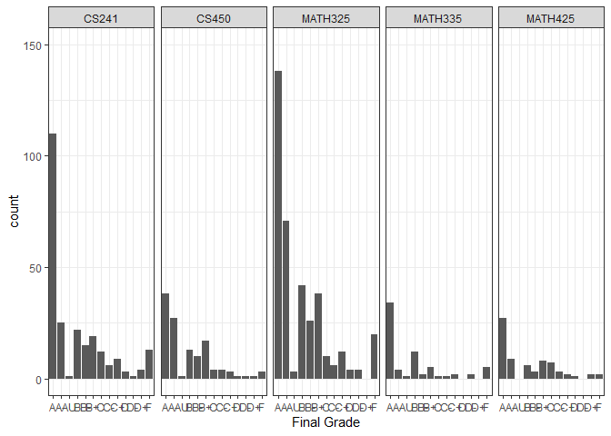
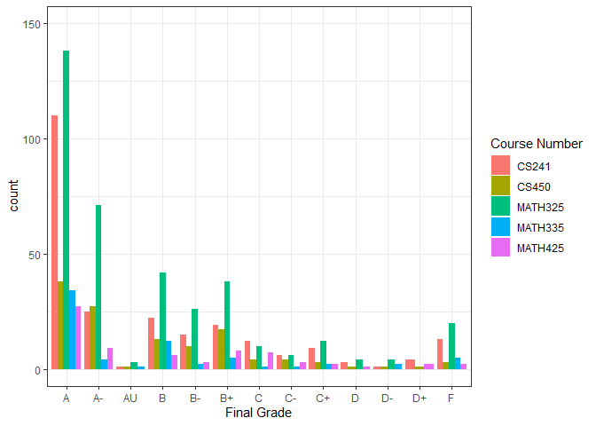
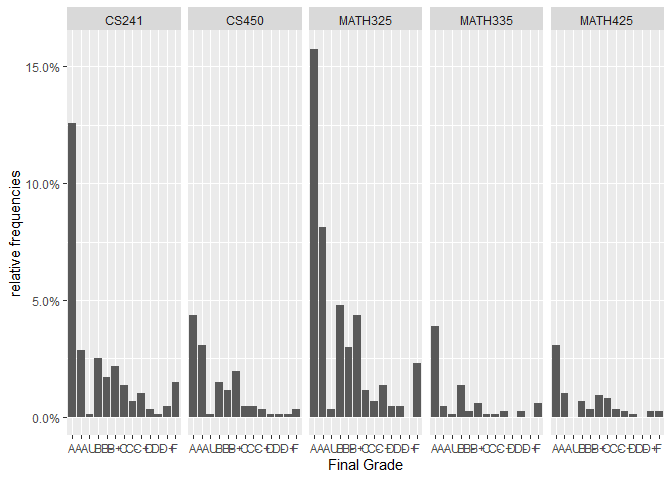
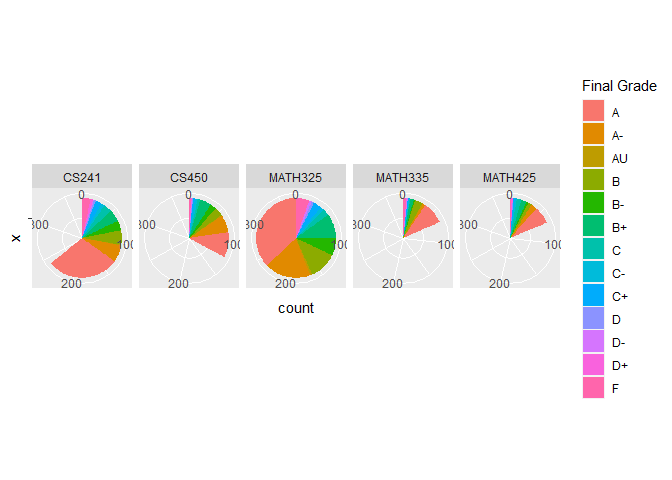

---
title: "Task 12 : Tidy Data"
author: "TomHollinberger"
date: "10/06/2020"
output: 
 html_document: 
   keep_md: yes
   toc: TRUE
   toc_depth: 6
---  
THIS RSCRIPT USES ROXYGEN CHARACTERS.  
YOU CAN PRESS ctrl+shift+K AND GO STRAIGHT TO A HTML.  
SKIPS THE HANDWORK OF CREATING A RMD, AFTER THE ORIGINAL WORK IS NONE IN A RSCRIPT.
E:/000 DTS 350 Data Visualization/DTS350-hollinbergert/DTS350TemplateMaster/Week_07/Class_Task_12/messy_data.xlsx


```r
library(tidyverse)
```

```
## -- Attaching packages ------------------------------------------------------------------------------------------- tidyverse 1.3.0 --
```

```
## v ggplot2 3.3.2     v purrr   0.3.4
## v tibble  3.0.3     v dplyr   1.0.0
## v tidyr   1.1.0     v stringr 1.4.0
## v readr   1.3.1     v forcats 0.5.0
```

```
## -- Conflicts ---------------------------------------------------------------------------------------------- tidyverse_conflicts() --
## x dplyr::filter() masks stats::filter()
## x dplyr::lag()    masks stats::lag()
```

```r
library(dplyr)
library(readxl)
library(devtools)
```

```
## Loading required package: usethis
```

```r
library(downloader)
```

```
## 
## Attaching package: 'downloader'
```

```
## The following object is masked from 'package:devtools':
## 
##     source_url
```

```r
tmp <- tempfile()

tmp
```

```
## [1] "C:\\Users\\tomho\\AppData\\Local\\Temp\\Rtmp2LeVY5\\file5b0416414cc5"
```

```r
tempdir()
```

```
## [1] "C:\\Users\\tomho\\AppData\\Local\\Temp\\Rtmp2LeVY5"
```

```r
download("https://github.com/WJC-Data-Science/DTS350/raw/master/messy_data.xlsx",tmp, mode = "wb")

grades <- read_xlsx(tmp)
```

```
## New names:
## * `` -> ...4
## * `` -> ...5
## * `` -> ...7
## * `` -> ...8
## * `` -> ...10
## * ...
```

```r
grades
```

```
## # A tibble: 689 x 17
##    `Studient ID` `Current Major` `CS   241` ...4  ...5  `CS   450` ...7  ...8 
##            <dbl> <chr>           <chr>      <chr> <chr> <chr>      <chr> <chr>
##  1            NA <NA>            Major at ~ Seme~ Fina~ Major at ~ Seme~ Fina~
##  2             1 Computer Scien~ <NA>       <NA>  <NA>  Computer ~ WI16  A    
##  3             2 Business Analy~ <NA>       <NA>  <NA>  <NA>       <NA>  <NA> 
##  4             3 Electrical Eng~ Electrica~ SP16  A     <NA>       <NA>  <NA> 
##  5             4 Computer Scien~ <NA>       <NA>  <NA>  Computer ~ WI17  B-   
##  6             5 Applied Mathem~ Applied M~ FA16  A-    Applied M~ WI17  A    
##  7             6 Psychology      <NA>       <NA>  <NA>  <NA>       <NA>  <NA> 
##  8             7 Software Engin~ <NA>       <NA>  <NA>  Software ~ WI17  B-   
##  9             8 Psychology      <NA>       <NA>  <NA>  <NA>       <NA>  <NA> 
## 10             9 Biochemistry    Electrica~ SP17  A-    <NA>       <NA>  <NA> 
## # ... with 679 more rows, and 9 more variables: `MATH 325` <chr>, ...10 <chr>,
## #   ...11 <chr>, `MATH 335` <chr>, ...13 <chr>, ...14 <chr>, `MATH 425` <chr>,
## #   ...16 <chr>, ...17 <chr>
```

```r
summary(grades)
```

```
##   Studient ID    Current Major        CS   241             ...4          
##  Min.   :  1.0   Length:689         Length:689         Length:689        
##  1st Qu.:172.8   Class :character   Class :character   Class :character  
##  Median :344.5   Mode  :character   Mode  :character   Mode  :character  
##  Mean   :344.5                                                           
##  3rd Qu.:516.2                                                           
##  Max.   :688.0                                                           
##  NA's   :1                                                               
##      ...5             CS   450             ...7               ...8          
##  Length:689         Length:689         Length:689         Length:689        
##  Class :character   Class :character   Class :character   Class :character  
##  Mode  :character   Mode  :character   Mode  :character   Mode  :character  
##                                                                             
##                                                                             
##                                                                             
##                                                                             
##    MATH 325            ...10              ...11             MATH 335        
##  Length:689         Length:689         Length:689         Length:689        
##  Class :character   Class :character   Class :character   Class :character  
##  Mode  :character   Mode  :character   Mode  :character   Mode  :character  
##                                                                             
##                                                                             
##                                                                             
##                                                                             
##     ...13              ...14             MATH 425            ...16          
##  Length:689         Length:689         Length:689         Length:689        
##  Class :character   Class :character   Class :character   Class :character  
##  Mode  :character   Mode  :character   Mode  :character   Mode  :character  
##                                                                             
##                                                                             
##                                                                             
##                                                                             
##     ...17          
##  Length:689        
##  Class :character  
##  Mode  :character  
##                    
##                    
##                    
## 
```

_________________________


```r
grades <- read_xlsx(tmp, skip = 2, col_names = FALSE)
```

```
## New names:
## * `` -> ...1
## * `` -> ...2
## * `` -> ...3
## * `` -> ...4
## * `` -> ...5
## * ...
```

```r
grades
```

```
## # A tibble: 688 x 17
##     ...1 ...2  ...3  ...4  ...5  ...6  ...7  ...8  ...9  ...10 ...11 ...12 ...13
##    <dbl> <chr> <chr> <chr> <chr> <chr> <chr> <chr> <chr> <chr> <chr> <chr> <chr>
##  1     1 Comp~ <NA>  <NA>  <NA>  Comp~ WI16  A     <NA>  <NA>  <NA>  <NA>  <NA> 
##  2     2 Busi~ <NA>  <NA>  <NA>  <NA>  <NA>  <NA>  Busi~ SP18  B+    Busi~ SP18 
##  3     3 Elec~ Elec~ SP16  A     <NA>  <NA>  <NA>  <NA>  <NA>  <NA>  <NA>  <NA> 
##  4     4 Comp~ <NA>  <NA>  <NA>  Comp~ WI17  B-    Comp~ WI17  A-    Comp~ FA17 
##  5     5 Appl~ Appl~ FA16  A-    Appl~ WI17  A     <NA>  <NA>  <NA>  <NA>  <NA> 
##  6     6 Psyc~ <NA>  <NA>  <NA>  <NA>  <NA>  <NA>  Psyc~ SP17  A-    Psyc~ FA17 
##  7     7 Soft~ <NA>  <NA>  <NA>  Soft~ WI17  B-    <NA>  <NA>  <NA>  <NA>  <NA> 
##  8     8 Psyc~ <NA>  <NA>  <NA>  <NA>  <NA>  <NA>  Psyc~ FA15  B-    <NA>  <NA> 
##  9     9 Bioc~ Elec~ SP17  A-    <NA>  <NA>  <NA>  <NA>  <NA>  <NA>  <NA>  <NA> 
## 10    10 Comp~ <NA>  <NA>  <NA>  Comp~ WI17  C     <NA>  <NA>  <NA>  <NA>  <NA> 
## # ... with 678 more rows, and 4 more variables: ...14 <chr>, ...15 <chr>,
## #   ...16 <chr>, ...17 <chr>
```

```r
grades1 <- select(grades,1:17)
grades1
```

```
## # A tibble: 688 x 17
##     ...1 ...2  ...3  ...4  ...5  ...6  ...7  ...8  ...9  ...10 ...11 ...12 ...13
##    <dbl> <chr> <chr> <chr> <chr> <chr> <chr> <chr> <chr> <chr> <chr> <chr> <chr>
##  1     1 Comp~ <NA>  <NA>  <NA>  Comp~ WI16  A     <NA>  <NA>  <NA>  <NA>  <NA> 
##  2     2 Busi~ <NA>  <NA>  <NA>  <NA>  <NA>  <NA>  Busi~ SP18  B+    Busi~ SP18 
##  3     3 Elec~ Elec~ SP16  A     <NA>  <NA>  <NA>  <NA>  <NA>  <NA>  <NA>  <NA> 
##  4     4 Comp~ <NA>  <NA>  <NA>  Comp~ WI17  B-    Comp~ WI17  A-    Comp~ FA17 
##  5     5 Appl~ Appl~ FA16  A-    Appl~ WI17  A     <NA>  <NA>  <NA>  <NA>  <NA> 
##  6     6 Psyc~ <NA>  <NA>  <NA>  <NA>  <NA>  <NA>  Psyc~ SP17  A-    Psyc~ FA17 
##  7     7 Soft~ <NA>  <NA>  <NA>  Soft~ WI17  B-    <NA>  <NA>  <NA>  <NA>  <NA> 
##  8     8 Psyc~ <NA>  <NA>  <NA>  <NA>  <NA>  <NA>  Psyc~ FA15  B-    <NA>  <NA> 
##  9     9 Bioc~ Elec~ SP17  A-    <NA>  <NA>  <NA>  <NA>  <NA>  <NA>  <NA>  <NA> 
## 10    10 Comp~ <NA>  <NA>  <NA>  Comp~ WI17  C     <NA>  <NA>  <NA>  <NA>  <NA> 
## # ... with 678 more rows, and 4 more variables: ...14 <chr>, ...15 <chr>,
## #   ...16 <chr>, ...17 <chr>
```

```r
grades1 <- add_column(grades, v = "CS241", .after = "...2")
grades1
```

```
## # A tibble: 688 x 18
##     ...1 ...2  v     ...3  ...4  ...5  ...6  ...7  ...8  ...9  ...10 ...11 ...12
##    <dbl> <chr> <chr> <chr> <chr> <chr> <chr> <chr> <chr> <chr> <chr> <chr> <chr>
##  1     1 Comp~ CS241 <NA>  <NA>  <NA>  Comp~ WI16  A     <NA>  <NA>  <NA>  <NA> 
##  2     2 Busi~ CS241 <NA>  <NA>  <NA>  <NA>  <NA>  <NA>  Busi~ SP18  B+    Busi~
##  3     3 Elec~ CS241 Elec~ SP16  A     <NA>  <NA>  <NA>  <NA>  <NA>  <NA>  <NA> 
##  4     4 Comp~ CS241 <NA>  <NA>  <NA>  Comp~ WI17  B-    Comp~ WI17  A-    Comp~
##  5     5 Appl~ CS241 Appl~ FA16  A-    Appl~ WI17  A     <NA>  <NA>  <NA>  <NA> 
##  6     6 Psyc~ CS241 <NA>  <NA>  <NA>  <NA>  <NA>  <NA>  Psyc~ SP17  A-    Psyc~
##  7     7 Soft~ CS241 <NA>  <NA>  <NA>  Soft~ WI17  B-    <NA>  <NA>  <NA>  <NA> 
##  8     8 Psyc~ CS241 <NA>  <NA>  <NA>  <NA>  <NA>  <NA>  Psyc~ FA15  B-    <NA> 
##  9     9 Bioc~ CS241 Elec~ SP17  A-    <NA>  <NA>  <NA>  <NA>  <NA>  <NA>  <NA> 
## 10    10 Comp~ CS241 <NA>  <NA>  <NA>  Comp~ WI17  C     <NA>  <NA>  <NA>  <NA> 
## # ... with 678 more rows, and 5 more variables: ...13 <chr>, ...14 <chr>,
## #   ...15 <chr>, ...16 <chr>, ...17 <chr>
```

```r
grades2 <- add_column(grades1, w = "CS450", .after = "...5")
grades2
```

```
## # A tibble: 688 x 19
##     ...1 ...2  v     ...3  ...4  ...5  w     ...6  ...7  ...8  ...9  ...10 ...11
##    <dbl> <chr> <chr> <chr> <chr> <chr> <chr> <chr> <chr> <chr> <chr> <chr> <chr>
##  1     1 Comp~ CS241 <NA>  <NA>  <NA>  CS450 Comp~ WI16  A     <NA>  <NA>  <NA> 
##  2     2 Busi~ CS241 <NA>  <NA>  <NA>  CS450 <NA>  <NA>  <NA>  Busi~ SP18  B+   
##  3     3 Elec~ CS241 Elec~ SP16  A     CS450 <NA>  <NA>  <NA>  <NA>  <NA>  <NA> 
##  4     4 Comp~ CS241 <NA>  <NA>  <NA>  CS450 Comp~ WI17  B-    Comp~ WI17  A-   
##  5     5 Appl~ CS241 Appl~ FA16  A-    CS450 Appl~ WI17  A     <NA>  <NA>  <NA> 
##  6     6 Psyc~ CS241 <NA>  <NA>  <NA>  CS450 <NA>  <NA>  <NA>  Psyc~ SP17  A-   
##  7     7 Soft~ CS241 <NA>  <NA>  <NA>  CS450 Soft~ WI17  B-    <NA>  <NA>  <NA> 
##  8     8 Psyc~ CS241 <NA>  <NA>  <NA>  CS450 <NA>  <NA>  <NA>  Psyc~ FA15  B-   
##  9     9 Bioc~ CS241 Elec~ SP17  A-    CS450 <NA>  <NA>  <NA>  <NA>  <NA>  <NA> 
## 10    10 Comp~ CS241 <NA>  <NA>  <NA>  CS450 Comp~ WI17  C     <NA>  <NA>  <NA> 
## # ... with 678 more rows, and 6 more variables: ...12 <chr>, ...13 <chr>,
## #   ...14 <chr>, ...15 <chr>, ...16 <chr>, ...17 <chr>
```

```r
grades3 <- add_column(grades2, x = "MATH325", .after = "...8")
grades3
```

```
## # A tibble: 688 x 20
##     ...1 ...2  v     ...3  ...4  ...5  w     ...6  ...7  ...8  x     ...9  ...10
##    <dbl> <chr> <chr> <chr> <chr> <chr> <chr> <chr> <chr> <chr> <chr> <chr> <chr>
##  1     1 Comp~ CS241 <NA>  <NA>  <NA>  CS450 Comp~ WI16  A     MATH~ <NA>  <NA> 
##  2     2 Busi~ CS241 <NA>  <NA>  <NA>  CS450 <NA>  <NA>  <NA>  MATH~ Busi~ SP18 
##  3     3 Elec~ CS241 Elec~ SP16  A     CS450 <NA>  <NA>  <NA>  MATH~ <NA>  <NA> 
##  4     4 Comp~ CS241 <NA>  <NA>  <NA>  CS450 Comp~ WI17  B-    MATH~ Comp~ WI17 
##  5     5 Appl~ CS241 Appl~ FA16  A-    CS450 Appl~ WI17  A     MATH~ <NA>  <NA> 
##  6     6 Psyc~ CS241 <NA>  <NA>  <NA>  CS450 <NA>  <NA>  <NA>  MATH~ Psyc~ SP17 
##  7     7 Soft~ CS241 <NA>  <NA>  <NA>  CS450 Soft~ WI17  B-    MATH~ <NA>  <NA> 
##  8     8 Psyc~ CS241 <NA>  <NA>  <NA>  CS450 <NA>  <NA>  <NA>  MATH~ Psyc~ FA15 
##  9     9 Bioc~ CS241 Elec~ SP17  A-    CS450 <NA>  <NA>  <NA>  MATH~ <NA>  <NA> 
## 10    10 Comp~ CS241 <NA>  <NA>  <NA>  CS450 Comp~ WI17  C     MATH~ <NA>  <NA> 
## # ... with 678 more rows, and 7 more variables: ...11 <chr>, ...12 <chr>,
## #   ...13 <chr>, ...14 <chr>, ...15 <chr>, ...16 <chr>, ...17 <chr>
```

```r
grades4 <- add_column(grades3, y = "MATH335", .after = "...11")
grades4
```

```
## # A tibble: 688 x 21
##     ...1 ...2  v     ...3  ...4  ...5  w     ...6  ...7  ...8  x     ...9  ...10
##    <dbl> <chr> <chr> <chr> <chr> <chr> <chr> <chr> <chr> <chr> <chr> <chr> <chr>
##  1     1 Comp~ CS241 <NA>  <NA>  <NA>  CS450 Comp~ WI16  A     MATH~ <NA>  <NA> 
##  2     2 Busi~ CS241 <NA>  <NA>  <NA>  CS450 <NA>  <NA>  <NA>  MATH~ Busi~ SP18 
##  3     3 Elec~ CS241 Elec~ SP16  A     CS450 <NA>  <NA>  <NA>  MATH~ <NA>  <NA> 
##  4     4 Comp~ CS241 <NA>  <NA>  <NA>  CS450 Comp~ WI17  B-    MATH~ Comp~ WI17 
##  5     5 Appl~ CS241 Appl~ FA16  A-    CS450 Appl~ WI17  A     MATH~ <NA>  <NA> 
##  6     6 Psyc~ CS241 <NA>  <NA>  <NA>  CS450 <NA>  <NA>  <NA>  MATH~ Psyc~ SP17 
##  7     7 Soft~ CS241 <NA>  <NA>  <NA>  CS450 Soft~ WI17  B-    MATH~ <NA>  <NA> 
##  8     8 Psyc~ CS241 <NA>  <NA>  <NA>  CS450 <NA>  <NA>  <NA>  MATH~ Psyc~ FA15 
##  9     9 Bioc~ CS241 Elec~ SP17  A-    CS450 <NA>  <NA>  <NA>  MATH~ <NA>  <NA> 
## 10    10 Comp~ CS241 <NA>  <NA>  <NA>  CS450 Comp~ WI17  C     MATH~ <NA>  <NA> 
## # ... with 678 more rows, and 8 more variables: ...11 <chr>, y <chr>,
## #   ...12 <chr>, ...13 <chr>, ...14 <chr>, ...15 <chr>, ...16 <chr>,
## #   ...17 <chr>
```

```r
grades5 <- add_column(grades4, z = "MATH425", .after = "...14")
grades5
```

```
## # A tibble: 688 x 22
##     ...1 ...2  v     ...3  ...4  ...5  w     ...6  ...7  ...8  x     ...9  ...10
##    <dbl> <chr> <chr> <chr> <chr> <chr> <chr> <chr> <chr> <chr> <chr> <chr> <chr>
##  1     1 Comp~ CS241 <NA>  <NA>  <NA>  CS450 Comp~ WI16  A     MATH~ <NA>  <NA> 
##  2     2 Busi~ CS241 <NA>  <NA>  <NA>  CS450 <NA>  <NA>  <NA>  MATH~ Busi~ SP18 
##  3     3 Elec~ CS241 Elec~ SP16  A     CS450 <NA>  <NA>  <NA>  MATH~ <NA>  <NA> 
##  4     4 Comp~ CS241 <NA>  <NA>  <NA>  CS450 Comp~ WI17  B-    MATH~ Comp~ WI17 
##  5     5 Appl~ CS241 Appl~ FA16  A-    CS450 Appl~ WI17  A     MATH~ <NA>  <NA> 
##  6     6 Psyc~ CS241 <NA>  <NA>  <NA>  CS450 <NA>  <NA>  <NA>  MATH~ Psyc~ SP17 
##  7     7 Soft~ CS241 <NA>  <NA>  <NA>  CS450 Soft~ WI17  B-    MATH~ <NA>  <NA> 
##  8     8 Psyc~ CS241 <NA>  <NA>  <NA>  CS450 <NA>  <NA>  <NA>  MATH~ Psyc~ FA15 
##  9     9 Bioc~ CS241 Elec~ SP17  A-    CS450 <NA>  <NA>  <NA>  MATH~ <NA>  <NA> 
## 10    10 Comp~ CS241 <NA>  <NA>  <NA>  CS450 Comp~ WI17  C     MATH~ <NA>  <NA> 
## # ... with 678 more rows, and 9 more variables: ...11 <chr>, y <chr>,
## #   ...12 <chr>, ...13 <chr>, ...14 <chr>, z <chr>, ...15 <chr>, ...16 <chr>,
## #   ...17 <chr>
```

```r
grades6 <- grades5 %>%
unite(pnl1,3,4,5,6, sep = "_")   #apparently uses column poitions, not column names, AND the individual columns are deleted, leaving only the united column, and ...6 column numbers are rewickered.
grades6$pnl1
```

```
##   [1] "CS241_NA_NA_NA"                        
##   [2] "CS241_NA_NA_NA"                        
##   [3] "CS241_Electrical Engineering_SP16_A"   
##   [4] "CS241_NA_NA_NA"                        
##   [5] "CS241_Applied Mathematics_FA16_A-"     
##   [6] "CS241_NA_NA_NA"                        
##   [7] "CS241_NA_NA_NA"                        
##   [8] "CS241_NA_NA_NA"                        
##   [9] "CS241_Electrical Engineering_SP17_A-"  
##  [10] "CS241_NA_NA_NA"                        
##  [11] "CS241_Biostatistics_SP18_B"            
##  [12] "CS241_Computer Science_WI18_B-"        
##  [13] "CS241_NA_NA_NA"                        
##  [14] "CS241_Computer Science_FA15_C-"        
##  [15] "CS241_NA_NA_NA"                        
##  [16] "CS241_Software Engineering_SP18_A"     
##  [17] "CS241_NA_NA_NA"                        
##  [18] "CS241_Computer Science_FA17_A"         
##  [19] "CS241_Electrical Engineering_FA17_B+"  
##  [20] "CS241_NA_NA_NA"                        
##  [21] "CS241_Computer Engineering_SP16_A"     
##  [22] "CS241_Mechanical Engineering_FA15_A"   
##  [23] "CS241_NA_NA_NA"                        
##  [24] "CS241_NA_NA_NA"                        
##  [25] "CS241_Electrical Engineering_FA17_B-"  
##  [26] "CS241_Electrical Engineering_SP18_D-"  
##  [27] "CS241_GeoBus & Data Analytics_WI18_A"  
##  [28] "CS241_NA_NA_NA"                        
##  [29] "CS241_Electrical Engineering_SP16_F"   
##  [30] "CS241_NA_NA_NA"                        
##  [31] "CS241_NA_NA_NA"                        
##  [32] "CS241_NA_NA_NA"                        
##  [33] "CS241_NA_NA_NA"                        
##  [34] "CS241_NA_NA_NA"                        
##  [35] "CS241_Data Science_SP18_F"             
##  [36] "CS241_Engineering Technology_FA15_A"   
##  [37] "CS241_NA_NA_NA"                        
##  [38] "CS241_NA_NA_NA"                        
##  [39] "CS241_NA_NA_NA"                        
##  [40] "CS241_NA_NA_NA"                        
##  [41] "CS241_NA_NA_NA"                        
##  [42] "CS241_Data Science_SP18_F"             
##  [43] "CS241_Electrical Engineering_FA17_F"   
##  [44] "CS241_NA_NA_NA"                        
##  [45] "CS241_NA_NA_NA"                        
##  [46] "CS241_Electrical Engineering_SP16_A"   
##  [47] "CS241_Applied Mathematics_SP17_A"      
##  [48] "CS241_Mechanical Engineering_SP17_A"   
##  [49] "CS241_NA_NA_NA"                        
##  [50] "CS241_University Studies_FA15_B-"      
##  [51] "CS241_Electrical Engineering_SP18_F"   
##  [52] "CS241_NA_NA_NA"                        
##  [53] "CS241_Electrical Engineering_SP16_A"   
##  [54] "CS241_NA_NA_NA"                        
##  [55] "CS241_NA_NA_NA"                        
##  [56] "CS241_Electrical Engineering_SP17_C"   
##  [57] "CS241_NA_NA_NA"                        
##  [58] "CS241_Mathematical Sciences_SP18_A"    
##  [59] "CS241_NA_NA_NA"                        
##  [60] "CS241_NA_NA_NA"                        
##  [61] "CS241_Electrical Engineering_WI16_A"   
##  [62] "CS241_NA_NA_NA"                        
##  [63] "CS241_NA_NA_NA"                        
##  [64] "CS241_Interdisciplinary_SP17_A-"       
##  [65] "CS241_NA_NA_NA"                        
##  [66] "CS241_Biostatistics_SP18_A"            
##  [67] "CS241_Electrical Engineering_FA15_C+"  
##  [68] "CS241_NA_NA_NA"                        
##  [69] "CS241_NA_NA_NA"                        
##  [70] "CS241_NA_NA_NA"                        
##  [71] "CS241_NA_NA_NA"                        
##  [72] "CS241_NA_NA_NA"                        
##  [73] "CS241_NA_NA_NA"                        
##  [74] "CS241_NA_NA_NA"                        
##  [75] "CS241_NA_NA_NA"                        
##  [76] "CS241_NA_NA_NA"                        
##  [77] "CS241_NA_NA_NA"                        
##  [78] "CS241_NA_NA_NA"                        
##  [79] "CS241_NA_NA_NA"                        
##  [80] "CS241_NA_NA_NA"                        
##  [81] "CS241_NA_NA_NA"                        
##  [82] "CS241_Electrical Engineering_FA17_B"   
##  [83] "CS241_NA_NA_NA"                        
##  [84] "CS241_NA_NA_NA"                        
##  [85] "CS241_NA_NA_NA"                        
##  [86] "CS241_NA_NA_NA"                        
##  [87] "CS241_Mechanical Engineering_FA15_A"   
##  [88] "CS241_NA_NA_NA"                        
##  [89] "CS241_NA_NA_NA"                        
##  [90] "CS241_NA_NA_NA"                        
##  [91] "CS241_NA_NA_NA"                        
##  [92] "CS241_NA_NA_NA"                        
##  [93] "CS241_NA_NA_NA"                        
##  [94] "CS241_NA_NA_NA"                        
##  [95] "CS241_NA_NA_NA"                        
##  [96] "CS241_Electrical Engineering_SP18_A"   
##  [97] "CS241_NA_NA_NA"                        
##  [98] "CS241_NA_NA_NA"                        
##  [99] "CS241_Computer Engineering_SP16_A"     
## [100] "CS241_NA_NA_NA"                        
## [101] "CS241_NA_NA_NA"                        
## [102] "CS241_NA_NA_NA"                        
## [103] "CS241_Electrical Engineering_WI18_A"   
## [104] "CS241_Electrical Engineering_WI16_B"   
## [105] "CS241_Electrical Engineering_FA17_A"   
## [106] "CS241_NA_NA_NA"                        
## [107] "CS241_NA_NA_NA"                        
## [108] "CS241_Electrical Engineering_SP16_D"   
## [109] "CS241_Applied Mathematics_WI16_A"      
## [110] "CS241_Electrical Engineering_SP18_C-"  
## [111] "CS241_NA_NA_NA"                        
## [112] "CS241_NA_NA_NA"                        
## [113] "CS241_NA_NA_NA"                        
## [114] "CS241_NA_NA_NA"                        
## [115] "CS241_Electrical Engineering_SP18_A-"  
## [116] "CS241_Data Science_WI18_A"             
## [117] "CS241_Electrical Engineering_SP18_B"   
## [118] "CS241_NA_NA_NA"                        
## [119] "CS241_NA_NA_NA"                        
## [120] "CS241_NA_NA_NA"                        
## [121] "CS241_NA_NA_NA"                        
## [122] "CS241_NA_NA_NA"                        
## [123] "CS241_NA_NA_NA"                        
## [124] "CS241_NA_NA_NA"                        
## [125] "CS241_NA_NA_NA"                        
## [126] "CS241_NA_NA_NA"                        
## [127] "CS241_Computer Engineering_WI18_C-"    
## [128] "CS241_NA_NA_NA"                        
## [129] "CS241_NA_NA_NA"                        
## [130] "CS241_NA_NA_NA"                        
## [131] "CS241_General Studies_FA16_A-"         
## [132] "CS241_NA_NA_NA"                        
## [133] "CS241_NA_NA_NA"                        
## [134] "CS241_NA_NA_NA"                        
## [135] "CS241_NA_NA_NA"                        
## [136] "CS241_NA_NA_NA"                        
## [137] "CS241_NA_NA_NA"                        
## [138] "CS241_NA_NA_NA"                        
## [139] "CS241_NA_NA_NA"                        
## [140] "CS241_NA_NA_NA"                        
## [141] "CS241_Electrical Engineering_WI17_A-"  
## [142] "CS241_NA_NA_NA"                        
## [143] "CS241_NA_NA_NA"                        
## [144] "CS241_Electrical Engineering_FA16_A-"  
## [145] "CS241_Physics_FA16_A-"                 
## [146] "CS241_Electrical Engineering_FA15_B-"  
## [147] "CS241_Electrical Engineering_SP17_A"   
## [148] "CS241_NA_NA_NA"                        
## [149] "CS241_NA_NA_NA"                        
## [150] "CS241_NA_NA_NA"                        
## [151] "CS241_NA_NA_NA"                        
## [152] "CS241_NA_NA_NA"                        
## [153] "CS241_Applied Mathematics_FA17_A"      
## [154] "CS241_NA_NA_NA"                        
## [155] "CS241_Electrical Engineering_SP17_A"   
## [156] "CS241_International Studies_WI18_A"    
## [157] "CS241_NA_NA_NA"                        
## [158] "CS241_NA_NA_NA"                        
## [159] "CS241_NA_NA_NA"                        
## [160] "CS241_NA_NA_NA"                        
## [161] "CS241_Data Science_FA17_A"             
## [162] "CS241_NA_NA_NA"                        
## [163] "CS241_NA_NA_NA"                        
## [164] "CS241_Electrical Engineering_WI16_A"   
## [165] "CS241_Data Science_SP18_A"             
## [166] "CS241_Electrical Engineering_FA16_B+"  
## [167] "CS241_Electrical Engineering_SP17_B"   
## [168] "CS241_NA_NA_NA"                        
## [169] "CS241_NA_NA_NA"                        
## [170] "CS241_Electrical Engineering_WI17_B-"  
## [171] "CS241_Electrical Engineering_SP16_B-"  
## [172] "CS241_Mathematical Sciences_FA17_C-"   
## [173] "CS241_NA_NA_NA"                        
## [174] "CS241_Electrical Engineering_FA17_A"   
## [175] "CS241_Exercise Physiology_FA17_A-"     
## [176] "CS241_Data Science_SP18_C+"            
## [177] "CS241_NA_NA_NA"                        
## [178] "CS241_Mechanical Engineering_FA15_A"   
## [179] "CS241_NA_NA_NA"                        
## [180] "CS241_NA_NA_NA"                        
## [181] "CS241_NA_NA_NA"                        
## [182] "CS241_NA_NA_NA"                        
## [183] "CS241_NA_NA_NA"                        
## [184] "CS241_NA_NA_NA"                        
## [185] "CS241_Data Science_FA17_C"             
## [186] "CS241_Software Engineering_FA17_C"     
## [187] "CS241_Electrical Engineering_WI16_B-"  
## [188] "CS241_Electrical Engineering_WI16_A"   
## [189] "CS241_NA_NA_NA"                        
## [190] "CS241_NA_NA_NA"                        
## [191] "CS241_NA_NA_NA"                        
## [192] "CS241_Electrical Engineering_SP17_B+"  
## [193] "CS241_NA_NA_NA"                        
## [194] "CS241_Electrical Engineering_WI16_A"   
## [195] "CS241_Electrical Engineering_WI17_D+"  
## [196] "CS241_Electrical Engineering_SP17_C"   
## [197] "CS241_NA_NA_NA"                        
## [198] "CS241_Interdisciplinary_FA16_A-"       
## [199] "CS241_NA_NA_NA"                        
## [200] "CS241_NA_NA_NA"                        
## [201] "CS241_Electrical Engineering_SP16_D"   
## [202] "CS241_Biology_WI18_A"                  
## [203] "CS241_NA_NA_NA"                        
## [204] "CS241_NA_NA_NA"                        
## [205] "CS241_Electrical Engineering_SP16_A"   
## [206] "CS241_Electrical Engineering_FA16_D+"  
## [207] "CS241_NA_NA_NA"                        
## [208] "CS241_NA_NA_NA"                        
## [209] "CS241_NA_NA_NA"                        
## [210] "CS241_Electrical Engineering_FA15_A-"  
## [211] "CS241_NA_NA_NA"                        
## [212] "CS241_Electrical Engineering_WI17_A"   
## [213] "CS241_NA_NA_NA"                        
## [214] "CS241_NA_NA_NA"                        
## [215] "CS241_Electrical Engineering_FA16_D+"  
## [216] "CS241_NA_NA_NA"                        
## [217] "CS241_NA_NA_NA"                        
## [218] "CS241_NA_NA_NA"                        
## [219] "CS241_Computer Info Technology_SP17_A" 
## [220] "CS241_Computer Science_SP18_A"         
## [221] "CS241_NA_NA_NA"                        
## [222] "CS241_NA_NA_NA"                        
## [223] "CS241_Electrical Engineering_SP17_B"   
## [224] "CS241_NA_NA_NA"                        
## [225] "CS241_NA_NA_NA"                        
## [226] "CS241_NA_NA_NA"                        
## [227] "CS241_NA_NA_NA"                        
## [228] "CS241_NA_NA_NA"                        
## [229] "CS241_NA_NA_NA"                        
## [230] "CS241_NA_NA_NA"                        
## [231] "CS241_Data Science_SP18_A"             
## [232] "CS241_NA_NA_NA"                        
## [233] "CS241_Data Science_SP18_B+"            
## [234] "CS241_NA_NA_NA"                        
## [235] "CS241_Biostatistics_FA17_A-"           
## [236] "CS241_NA_NA_NA"                        
## [237] "CS241_Software Engineering_SP18_B"     
## [238] "CS241_NA_NA_NA"                        
## [239] "CS241_NA_NA_NA"                        
## [240] "CS241_NA_NA_NA"                        
## [241] "CS241_Data Science_WI18_A"             
## [242] "CS241_Electrical Engineering_SP16_C+"  
## [243] "CS241_NA_NA_NA"                        
## [244] "CS241_Electrical Engineering_SP16_A"   
## [245] "CS241_NA_NA_NA"                        
## [246] "CS241_NA_NA_NA"                        
## [247] "CS241_Electrical Engineering_WI18_A-"  
## [248] "CS241_NA_NA_NA"                        
## [249] "CS241_NA_NA_NA"                        
## [250] "CS241_Electrical Engineering_SP17_B+"  
## [251] "CS241_Computer Science_WI18_B+"        
## [252] "CS241_Biostatistics_SP18_A"            
## [253] "CS241_NA_NA_NA"                        
## [254] "CS241_Electrical Engineering_SP18_A"   
## [255] "CS241_Electrical Engineering_FA15_A-"  
## [256] "CS241_NA_NA_NA"                        
## [257] "CS241_NA_NA_NA"                        
## [258] "CS241_NA_NA_NA"                        
## [259] "CS241_NA_NA_NA"                        
## [260] "CS241_NA_NA_NA"                        
## [261] "CS241_Electrical Engineering_WI16_C+"  
## [262] "CS241_NA_NA_NA"                        
## [263] "CS241_NA_NA_NA"                        
## [264] "CS241_NA_NA_NA"                        
## [265] "CS241_NA_NA_NA"                        
## [266] "CS241_NA_NA_NA"                        
## [267] "CS241_NA_NA_NA"                        
## [268] "CS241_NA_NA_NA"                        
## [269] "CS241_NA_NA_NA"                        
## [270] "CS241_NA_NA_NA"                        
## [271] "CS241_Computer Engineering_FA17_A"     
## [272] "CS241_NA_NA_NA"                        
## [273] "CS241_NA_NA_NA"                        
## [274] "CS241_Data Science_SP18_B-"            
## [275] "CS241_NA_NA_NA"                        
## [276] "CS241_NA_NA_NA"                        
## [277] "CS241_NA_NA_NA"                        
## [278] "CS241_NA_NA_NA"                        
## [279] "CS241_Electrical Engineering_WI18_B"   
## [280] "CS241_Electrical Engineering_WI16_A-"  
## [281] "CS241_NA_NA_NA"                        
## [282] "CS241_NA_NA_NA"                        
## [283] "CS241_NA_NA_NA"                        
## [284] "CS241_NA_NA_NA"                        
## [285] "CS241_NA_NA_NA"                        
## [286] "CS241_NA_NA_NA"                        
## [287] "CS241_NA_NA_NA"                        
## [288] "CS241_NA_NA_NA"                        
## [289] "CS241_NA_NA_NA"                        
## [290] "CS241_NA_NA_NA"                        
## [291] "CS241_Physics_SP18_A"                  
## [292] "CS241_NA_NA_NA"                        
## [293] "CS241_NA_NA_NA"                        
## [294] "CS241_Biostatistics_FA17_A-"           
## [295] "CS241_Business Analytics_FA17_A"       
## [296] "CS241_NA_NA_NA"                        
## [297] "CS241_NA_NA_NA"                        
## [298] "CS241_Electrical Engineering_SP16_A"   
## [299] "CS241_NA_NA_NA"                        
## [300] "CS241_NA_NA_NA"                        
## [301] "CS241_NA_NA_NA"                        
## [302] "CS241_Software Engineering_SP18_B"     
## [303] "CS241_NA_NA_NA"                        
## [304] "CS241_NA_NA_NA"                        
## [305] "CS241_NA_NA_NA"                        
## [306] "CS241_NA_NA_NA"                        
## [307] "CS241_NA_NA_NA"                        
## [308] "CS241_NA_NA_NA"                        
## [309] "CS241_NA_NA_NA"                        
## [310] "CS241_NA_NA_NA"                        
## [311] "CS241_NA_NA_NA"                        
## [312] "CS241_NA_NA_NA"                        
## [313] "CS241_NA_NA_NA"                        
## [314] "CS241_Biostatistics_SP17_A"            
## [315] "CS241_NA_NA_NA"                        
## [316] "CS241_Electrical Engineering_WI18_B-"  
## [317] "CS241_NA_NA_NA"                        
## [318] "CS241_Electrical Engineering_FA17_A"   
## [319] "CS241_NA_NA_NA"                        
## [320] "CS241_Electrical Engineering_WI16_B+"  
## [321] "CS241_NA_NA_NA"                        
## [322] "CS241_NA_NA_NA"                        
## [323] "CS241_NA_NA_NA"                        
## [324] "CS241_Software Engineering_WI18_A"     
## [325] "CS241_NA_NA_NA"                        
## [326] "CS241_NA_NA_NA"                        
## [327] "CS241_NA_NA_NA"                        
## [328] "CS241_Electrical Engineering_WI17_B+"  
## [329] "CS241_NA_NA_NA"                        
## [330] "CS241_Electrical Engineering_SP18_B"   
## [331] "CS241_NA_NA_NA"                        
## [332] "CS241_NA_NA_NA"                        
## [333] "CS241_NA_NA_NA"                        
## [334] "CS241_Data Science_WI18_C"             
## [335] "CS241_Electrical Engineering_FA15_A"   
## [336] "CS241_NA_NA_NA"                        
## [337] "CS241_Business Management_SP18_A"      
## [338] "CS241_Computer Info Technology_WI17_B+"
## [339] "CS241_Electrical Engineering_FA16_A"   
## [340] "CS241_NA_NA_NA"                        
## [341] "CS241_NA_NA_NA"                        
## [342] "CS241_NA_NA_NA"                        
## [343] "CS241_NA_NA_NA"                        
## [344] "CS241_Electrical Engineering_FA17_A-"  
## [345] "CS241_NA_NA_NA"                        
## [346] "CS241_NA_NA_NA"                        
## [347] "CS241_NA_NA_NA"                        
## [348] "CS241_NA_NA_NA"                        
## [349] "CS241_Computer Info Technology_SP18_B+"
## [350] "CS241_NA_NA_NA"                        
## [351] "CS241_Electrical Engineering_WI16_A"   
## [352] "CS241_NA_NA_NA"                        
## [353] "CS241_Electrical Engineering_WI16_A"   
## [354] "CS241_NA_NA_NA"                        
## [355] "CS241_NA_NA_NA"                        
## [356] "CS241_Physics_SP18_A"                  
## [357] "CS241_Electrical Engineering_WI18_A"   
## [358] "CS241_NA_NA_NA"                        
## [359] "CS241_Electrical Engineering_SP16_A"   
## [360] "CS241_NA_NA_NA"                        
## [361] "CS241_NA_NA_NA"                        
## [362] "CS241_NA_NA_NA"                        
## [363] "CS241_NA_NA_NA"                        
## [364] "CS241_NA_NA_NA"                        
## [365] "CS241_NA_NA_NA"                        
## [366] "CS241_NA_NA_NA"                        
## [367] "CS241_Electrical Engineering_SP17_A"   
## [368] "CS241_Applied Mathematics_WI18_A"      
## [369] "CS241_NA_NA_NA"                        
## [370] "CS241_NA_NA_NA"                        
## [371] "CS241_Electrical Engineering_SP18_B-"  
## [372] "CS241_NA_NA_NA"                        
## [373] "CS241_NA_NA_NA"                        
## [374] "CS241_Electrical Engineering_WI16_A"   
## [375] "CS241_Data Science_SP18_A"             
## [376] "CS241_NA_NA_NA"                        
## [377] "CS241_Electrical Engineering_WI16_A"   
## [378] "CS241_NA_NA_NA"                        
## [379] "CS241_NA_NA_NA"                        
## [380] "CS241_NA_NA_NA"                        
## [381] "CS241_Data Science_SP18_C"             
## [382] "CS241_NA_NA_NA"                        
## [383] "CS241_NA_NA_NA"                        
## [384] "CS241_Electrical Engineering_SP18_B"   
## [385] "CS241_NA_NA_NA"                        
## [386] "CS241_Business Management_SP18_A-"     
## [387] "CS241_Electrical Engineering_WI16_A"   
## [388] "CS241_NA_NA_NA"                        
## [389] "CS241_NA_NA_NA"                        
## [390] "CS241_NA_NA_NA"                        
## [391] "CS241_NA_NA_NA"                        
## [392] "CS241_Data Science_SP18_A"             
## [393] "CS241_Electrical Engineering_FA17_A"   
## [394] "CS241_NA_NA_NA"                        
## [395] "CS241_Computer Engineering_SP16_A"     
## [396] "CS241_Data Science_FA17_C-"            
## [397] "CS241_Electrical Engineering_WI16_A"   
## [398] "CS241_NA_NA_NA"                        
## [399] "CS241_NA_NA_NA"                        
## [400] "CS241_NA_NA_NA"                        
## [401] "CS241_NA_NA_NA"                        
## [402] "CS241_Electrical Engineering_WI18_A"   
## [403] "CS241_NA_NA_NA"                        
## [404] "CS241_NA_NA_NA"                        
## [405] "CS241_Electrical Engineering_FA17_A"   
## [406] "CS241_NA_NA_NA"                        
## [407] "CS241_Electrical Engineering_WI18_C"   
## [408] "CS241_NA_NA_NA"                        
## [409] "CS241_Electrical Engineering_WI16_A"   
## [410] "CS241_NA_NA_NA"                        
## [411] "CS241_Electrical Engineering_WI16_B"   
## [412] "CS241_NA_NA_NA"                        
## [413] "CS241_NA_NA_NA"                        
## [414] "CS241_NA_NA_NA"                        
## [415] "CS241_NA_NA_NA"                        
## [416] "CS241_NA_NA_NA"                        
## [417] "CS241_NA_NA_NA"                        
## [418] "CS241_Electrical Engineering_FA15_C+"  
## [419] "CS241_Electrical Engineering_SP17_B"   
## [420] "CS241_Mathematical Sciences_WI18_A"    
## [421] "CS241_Mathematical Sciences_FA17_A"    
## [422] "CS241_Electrical Engineering_WI16_B+"  
## [423] "CS241_NA_NA_NA"                        
## [424] "CS241_NA_NA_NA"                        
## [425] "CS241_Electrical Engineering_WI17_A"   
## [426] "CS241_NA_NA_NA"                        
## [427] "CS241_Electrical Engineering_FA15_B"   
## [428] "CS241_NA_NA_NA"                        
## [429] "CS241_NA_NA_NA"                        
## [430] "CS241_NA_NA_NA"                        
## [431] "CS241_NA_NA_NA"                        
## [432] "CS241_Data Science_WI18_A"             
## [433] "CS241_NA_NA_NA"                        
## [434] "CS241_Exercise Physiology_SP16_B"      
## [435] "CS241_Biostatistics_FA16_B"            
## [436] "CS241_Electrical Engineering_SP17_A"   
## [437] "CS241_NA_NA_NA"                        
## [438] "CS241_Electrical Engineering_SP18_F"   
## [439] "CS241_Electrical Engineering_WI16_A"   
## [440] "CS241_NA_NA_NA"                        
## [441] "CS241_NA_NA_NA"                        
## [442] "CS241_NA_NA_NA"                        
## [443] "CS241_NA_NA_NA"                        
## [444] "CS241_NA_NA_NA"                        
## [445] "CS241_Electrical Engineering_SP17_C"   
## [446] "CS241_NA_NA_NA"                        
## [447] "CS241_Computer Engineering_WI16_A-"    
## [448] "CS241_NA_NA_NA"                        
## [449] "CS241_NA_NA_NA"                        
## [450] "CS241_NA_NA_NA"                        
## [451] "CS241_NA_NA_NA"                        
## [452] "CS241_NA_NA_NA"                        
## [453] "CS241_NA_NA_NA"                        
## [454] "CS241_NA_NA_NA"                        
## [455] "CS241_NA_NA_NA"                        
## [456] "CS241_Economics_FA17_A"                
## [457] "CS241_NA_NA_NA"                        
## [458] "CS241_NA_NA_NA"                        
## [459] "CS241_NA_NA_NA"                        
## [460] "CS241_Data Science_SP18_F"             
## [461] "CS241_Psychology_WI16_A"               
## [462] "CS241_NA_NA_NA"                        
## [463] "CS241_Data Science_WI18_A"             
## [464] "CS241_NA_NA_NA"                        
## [465] "CS241_NA_NA_NA"                        
## [466] "CS241_Electrical Engineering_FA15_B+"  
## [467] "CS241_Electrical Engineering_FA16_A"   
## [468] "CS241_Electrical Engineering_SP16_B"   
## [469] "CS241_NA_NA_NA"                        
## [470] "CS241_Electrical Engineering_SP17_C+"  
## [471] "CS241_NA_NA_NA"                        
## [472] "CS241_NA_NA_NA"                        
## [473] "CS241_NA_NA_NA"                        
## [474] "CS241_NA_NA_NA"                        
## [475] "CS241_Electrical Engineering_FA17_C"   
## [476] "CS241_Electrical Engineering_SP17_B"   
## [477] "CS241_NA_NA_NA"                        
## [478] "CS241_NA_NA_NA"                        
## [479] "CS241_NA_NA_NA"                        
## [480] "CS241_NA_NA_NA"                        
## [481] "CS241_University Studies_FA15_D+"      
## [482] "CS241_Data Science_WI18_A"             
## [483] "CS241_NA_NA_NA"                        
## [484] "CS241_NA_NA_NA"                        
## [485] "CS241_NA_NA_NA"                        
## [486] "CS241_Electrical Engineering_WI16_A"   
## [487] "CS241_NA_NA_NA"                        
## [488] "CS241_NA_NA_NA"                        
## [489] "CS241_Electrical Engineering_WI18_C+"  
## [490] "CS241_NA_NA_NA"                        
## [491] "CS241_Electrical Engineering_SP16_B"   
## [492] "CS241_Psychology_FA17_A"               
## [493] "CS241_NA_NA_NA"                        
## [494] "CS241_NA_NA_NA"                        
## [495] "CS241_NA_NA_NA"                        
## [496] "CS241_NA_NA_NA"                        
## [497] "CS241_NA_NA_NA"                        
## [498] "CS241_Electrical & Comp Eng_SP18_A"    
## [499] "CS241_Electrical Engineering_SP17_A"   
## [500] "CS241_NA_NA_NA"                        
## [501] "CS241_Electrical Engineering_WI17_A"   
## [502] "CS241_NA_NA_NA"                        
## [503] "CS241_Biostatistics_SP16_C-"           
## [504] "CS241_Electrical Engineering_WI16_A"   
## [505] "CS241_NA_NA_NA"                        
## [506] "CS241_Electrical Engineering_SP18_C+"  
## [507] "CS241_NA_NA_NA"                        
## [508] "CS241_Mathematical Sciences_SP18_A-"   
## [509] "CS241_NA_NA_NA"                        
## [510] "CS241_NA_NA_NA"                        
## [511] "CS241_Electrical Engineering_SP18_B"   
## [512] "CS241_NA_NA_NA"                        
## [513] "CS241_NA_NA_NA"                        
## [514] "CS241_Electrical Engineering_WI17_B+"  
## [515] "CS241_NA_NA_NA"                        
## [516] "CS241_NA_NA_NA"                        
## [517] "CS241_NA_NA_NA"                        
## [518] "CS241_Electrical Engineering_SP18_A"   
## [519] "CS241_NA_NA_NA"                        
## [520] "CS241_Electrical Engineering_WI16_B"   
## [521] "CS241_NA_NA_NA"                        
## [522] "CS241_NA_NA_NA"                        
## [523] "CS241_NA_NA_NA"                        
## [524] "CS241_NA_NA_NA"                        
## [525] "CS241_NA_NA_NA"                        
## [526] "CS241_Software Engineering_SP18_A"     
## [527] "CS241_NA_NA_NA"                        
## [528] "CS241_NA_NA_NA"                        
## [529] "CS241_NA_NA_NA"                        
## [530] "CS241_NA_NA_NA"                        
## [531] "CS241_NA_NA_NA"                        
## [532] "CS241_NA_NA_NA"                        
## [533] "CS241_NA_NA_NA"                        
## [534] "CS241_NA_NA_NA"                        
## [535] "CS241_Electrical Engineering_SP16_F"   
## [536] "CS241_NA_NA_NA"                        
## [537] "CS241_NA_NA_NA"                        
## [538] "CS241_Electrical Engineering_SP17_A"   
## [539] "CS241_Electrical Engineering_SP16_F"   
## [540] "CS241_Electrical Engineering_FA17_B+"  
## [541] "CS241_NA_NA_NA"                        
## [542] "CS241_NA_NA_NA"                        
## [543] "CS241_NA_NA_NA"                        
## [544] "CS241_NA_NA_NA"                        
## [545] "CS241_Electrical Engineering_WI18_A"   
## [546] "CS241_NA_NA_NA"                        
## [547] "CS241_NA_NA_NA"                        
## [548] "CS241_NA_NA_NA"                        
## [549] "CS241_NA_NA_NA"                        
## [550] "CS241_NA_NA_NA"                        
## [551] "CS241_NA_NA_NA"                        
## [552] "CS241_NA_NA_NA"                        
## [553] "CS241_NA_NA_NA"                        
## [554] "CS241_NA_NA_NA"                        
## [555] "CS241_NA_NA_NA"                        
## [556] "CS241_Computer Programming_FA17_F"     
## [557] "CS241_Electrical Engineering_SP18_B-"  
## [558] "CS241_NA_NA_NA"                        
## [559] "CS241_NA_NA_NA"                        
## [560] "CS241_NA_NA_NA"                        
## [561] "CS241_Electrical Engineering_SP17_A"   
## [562] "CS241_Electrical Engineering_SP17_B+"  
## [563] "CS241_NA_NA_NA"                        
## [564] "CS241_NA_NA_NA"                        
## [565] "CS241_NA_NA_NA"                        
## [566] "CS241_NA_NA_NA"                        
## [567] "CS241_NA_NA_NA"                        
## [568] "CS241_NA_NA_NA"                        
## [569] "CS241_NA_NA_NA"                        
## [570] "CS241_NA_NA_NA"                        
## [571] "CS241_NA_NA_NA"                        
## [572] "CS241_Electrical Engineering_SP18_C"   
## [573] "CS241_NA_NA_NA"                        
## [574] "CS241_Software Engineering_SP18_B-"    
## [575] "CS241_NA_NA_NA"                        
## [576] "CS241_NA_NA_NA"                        
## [577] "CS241_NA_NA_NA"                        
## [578] "CS241_NA_NA_NA"                        
## [579] "CS241_NA_NA_NA"                        
## [580] "CS241_Electrical Engineering_WI17_B+"  
## [581] "CS241_NA_NA_NA"                        
## [582] "CS241_NA_NA_NA"                        
## [583] "CS241_NA_NA_NA"                        
## [584] "CS241_Applied Mathematics_WI18_A"      
## [585] "CS241_NA_NA_NA"                        
## [586] "CS241_Data Science_SP18_A"             
## [587] "CS241_NA_NA_NA"                        
## [588] "CS241_NA_NA_NA"                        
## [589] "CS241_NA_NA_NA"                        
## [590] "CS241_NA_NA_NA"                        
## [591] "CS241_NA_NA_NA"                        
## [592] "CS241_NA_NA_NA"                        
## [593] "CS241_NA_NA_NA"                        
## [594] "CS241_NA_NA_NA"                        
## [595] "CS241_NA_NA_NA"                        
## [596] "CS241_NA_NA_NA"                        
## [597] "CS241_NA_NA_NA"                        
## [598] "CS241_NA_NA_NA"                        
## [599] "CS241_NA_NA_NA"                        
## [600] "CS241_NA_NA_NA"                        
## [601] "CS241_NA_NA_NA"                        
## [602] "CS241_NA_NA_NA"                        
## [603] "CS241_NA_NA_NA"                        
## [604] "CS241_NA_NA_NA"                        
## [605] "CS241_NA_NA_NA"                        
## [606] "CS241_Electrical Engineering_FA16_B-"  
## [607] "CS241_Electrical Engineering_SP17_B"   
## [608] "CS241_NA_NA_NA"                        
## [609] "CS241_NA_NA_NA"                        
## [610] "CS241_NA_NA_NA"                        
## [611] "CS241_NA_NA_NA"                        
## [612] "CS241_NA_NA_NA"                        
## [613] "CS241_Advanced Vehicle Systems_SP17_A" 
## [614] "CS241_NA_NA_NA"                        
## [615] "CS241_NA_NA_NA"                        
## [616] "CS241_NA_NA_NA"                        
## [617] "CS241_Business Management_FA17_A"      
## [618] "CS241_NA_NA_NA"                        
## [619] "CS241_NA_NA_NA"                        
## [620] "CS241_Electrical Engineering_WI18_A"   
## [621] "CS241_Biology_SP18_F"                  
## [622] "CS241_NA_NA_NA"                        
## [623] "CS241_NA_NA_NA"                        
## [624] "CS241_NA_NA_NA"                        
## [625] "CS241_NA_NA_NA"                        
## [626] "CS241_NA_NA_NA"                        
## [627] "CS241_Electrical Engineering_SP18_F"   
## [628] "CS241_Electrical Engineering_SP17_B+"  
## [629] "CS241_NA_NA_NA"                        
## [630] "CS241_NA_NA_NA"                        
## [631] "CS241_Data Science_SP18_A-"            
## [632] "CS241_Data Science_WI18_A"             
## [633] "CS241_NA_NA_NA"                        
## [634] "CS241_NA_NA_NA"                        
## [635] "CS241_Electrical Engineering_SP17_A"   
## [636] "CS241_NA_NA_NA"                        
## [637] "CS241_NA_NA_NA"                        
## [638] "CS241_NA_NA_NA"                        
## [639] "CS241_Electrical Engineering_FA15_C"   
## [640] "CS241_NA_NA_NA"                        
## [641] "CS241_Electrical Engineering_FA16_AU"  
## [642] "CS241_Data Science_SP18_A-"            
## [643] "CS241_NA_NA_NA"                        
## [644] "CS241_Electrical Engineering_SP17_A"   
## [645] "CS241_NA_NA_NA"                        
## [646] "CS241_Electrical Engineering_SP17_B+"  
## [647] "CS241_NA_NA_NA"                        
## [648] "CS241_NA_NA_NA"                        
## [649] "CS241_Computer Science_WI18_A-"        
## [650] "CS241_Chemistry_FA17_A"                
## [651] "CS241_Electrical Engineering_FA16_A"   
## [652] "CS241_Electrical Engineering_WI17_A-"  
## [653] "CS241_NA_NA_NA"                        
## [654] "CS241_NA_NA_NA"                        
## [655] "CS241_Data Science_SP18_B+"            
## [656] "CS241_Electrical Engineering_SP17_A"   
## [657] "CS241_NA_NA_NA"                        
## [658] "CS241_Software Engineering_WI16_A-"    
## [659] "CS241_Data Science_SP18_A"             
## [660] "CS241_Electrical Engineering_SP18_F"   
## [661] "CS241_Data Science_SP18_A"             
## [662] "CS241_Data Science_SP18_A"             
## [663] "CS241_NA_NA_NA"                        
## [664] "CS241_Psychology_WI18_A"               
## [665] "CS241_NA_NA_NA"                        
## [666] "CS241_Electrical Engineering_WI18_D"   
## [667] "CS241_NA_NA_NA"                        
## [668] "CS241_NA_NA_NA"                        
## [669] "CS241_NA_NA_NA"                        
## [670] "CS241_NA_NA_NA"                        
## [671] "CS241_Mathematical Sciences_WI18_A"    
## [672] "CS241_Physics_SP17_A"                  
## [673] "CS241_NA_NA_NA"                        
## [674] "CS241_NA_NA_NA"                        
## [675] "CS241_NA_NA_NA"                        
## [676] "CS241_NA_NA_NA"                        
## [677] "CS241_NA_NA_NA"                        
## [678] "CS241_NA_NA_NA"                        
## [679] "CS241_NA_NA_NA"                        
## [680] "CS241_Electrical Engineering_FA16_B-"  
## [681] "CS241_Data Science_SP18_B-"            
## [682] "CS241_NA_NA_NA"                        
## [683] "CS241_NA_NA_NA"                        
## [684] "CS241_Software Engineering_SP18_C+"    
## [685] "CS241_Electrical Engineering_SP17_C"   
## [686] "CS241_Software Engineering_SP18_A"     
## [687] "CS241_NA_NA_NA"                        
## [688] "CS241_NA_NA_NA"
```

```r
str(grades6)
```

```
## tibble [688 x 19] (S3: tbl_df/tbl/data.frame)
##  $ ...1 : num [1:688] 1 2 3 4 5 6 7 8 9 10 ...
##  $ ...2 : chr [1:688] "Computer Science" "Business Analytics" "Electrical Engineering" "Computer Science" ...
##  $ pnl1 : chr [1:688] "CS241_NA_NA_NA" "CS241_NA_NA_NA" "CS241_Electrical Engineering_SP16_A" "CS241_NA_NA_NA" ...
##  $ w    : chr [1:688] "CS450" "CS450" "CS450" "CS450" ...
##  $ ...6 : chr [1:688] "Computer Science" NA NA "Computer Science" ...
##  $ ...7 : chr [1:688] "WI16" NA NA "WI17" ...
##  $ ...8 : chr [1:688] "A" NA NA "B-" ...
##  $ x    : chr [1:688] "MATH325" "MATH325" "MATH325" "MATH325" ...
##  $ ...9 : chr [1:688] NA "Business Analytics" NA "Computer Science" ...
##  $ ...10: chr [1:688] NA "SP18" NA "WI17" ...
##  $ ...11: chr [1:688] NA "B+" NA "A-" ...
##  $ y    : chr [1:688] "MATH335" "MATH335" "MATH335" "MATH335" ...
##  $ ...12: chr [1:688] NA "Business Analytics" NA "Computer Science" ...
##  $ ...13: chr [1:688] NA "SP18" NA "FA17" ...
##  $ ...14: chr [1:688] NA "A" NA "A" ...
##  $ z    : chr [1:688] "MATH425" "MATH425" "MATH425" "MATH425" ...
##  $ ...15: chr [1:688] NA NA NA "Computer Science" ...
##  $ ...16: chr [1:688] NA NA NA "WI18" ...
##  $ ...17: chr [1:688] NA NA NA "B" ...
```

```r
grades7 <- grades6 %>%
  unite(pnl2,4:7, sep = "_")   #apparently uses column poitions, not column names
grades7$pnl2
```

```
##   [1] "CS450_Computer Science_WI16_A"       
##   [2] "CS450_NA_NA_NA"                      
##   [3] "CS450_NA_NA_NA"                      
##   [4] "CS450_Computer Science_WI17_B-"      
##   [5] "CS450_Applied Mathematics_WI17_A"    
##   [6] "CS450_NA_NA_NA"                      
##   [7] "CS450_Software Engineering_WI17_B-"  
##   [8] "CS450_NA_NA_NA"                      
##   [9] "CS450_NA_NA_NA"                      
##  [10] "CS450_Computer Science_WI17_C"       
##  [11] "CS450_NA_NA_NA"                      
##  [12] "CS450_NA_NA_NA"                      
##  [13] "CS450_Computer Science_WI18_A"       
##  [14] "CS450_NA_NA_NA"                      
##  [15] "CS450_Software Engineering_WI18_A"   
##  [16] "CS450_NA_NA_NA"                      
##  [17] "CS450_NA_NA_NA"                      
##  [18] "CS450_NA_NA_NA"                      
##  [19] "CS450_NA_NA_NA"                      
##  [20] "CS450_NA_NA_NA"                      
##  [21] "CS450_NA_NA_NA"                      
##  [22] "CS450_NA_NA_NA"                      
##  [23] "CS450_NA_NA_NA"                      
##  [24] "CS450_NA_NA_NA"                      
##  [25] "CS450_NA_NA_NA"                      
##  [26] "CS450_NA_NA_NA"                      
##  [27] "CS450_NA_NA_NA"                      
##  [28] "CS450_NA_NA_NA"                      
##  [29] "CS450_NA_NA_NA"                      
##  [30] "CS450_NA_NA_NA"                      
##  [31] "CS450_NA_NA_NA"                      
##  [32] "CS450_NA_NA_NA"                      
##  [33] "CS450_NA_NA_NA"                      
##  [34] "CS450_NA_NA_NA"                      
##  [35] "CS450_NA_NA_NA"                      
##  [36] "CS450_NA_NA_NA"                      
##  [37] "CS450_NA_NA_NA"                      
##  [38] "CS450_NA_NA_NA"                      
##  [39] "CS450_Computer Science_WI18_A"       
##  [40] "CS450_Computer Science_WI16_C+"      
##  [41] "CS450_NA_NA_NA"                      
##  [42] "CS450_NA_NA_NA"                      
##  [43] "CS450_NA_NA_NA"                      
##  [44] "CS450_Computer Science_WI18_B+"      
##  [45] "CS450_NA_NA_NA"                      
##  [46] "CS450_NA_NA_NA"                      
##  [47] "CS450_NA_NA_NA"                      
##  [48] "CS450_NA_NA_NA"                      
##  [49] "CS450_NA_NA_NA"                      
##  [50] "CS450_NA_NA_NA"                      
##  [51] "CS450_NA_NA_NA"                      
##  [52] "CS450_Applied Mathematics_WI18_B+"   
##  [53] "CS450_NA_NA_NA"                      
##  [54] "CS450_Computer Science_WI18_B-"      
##  [55] "CS450_Computer Science_WI16_A"       
##  [56] "CS450_NA_NA_NA"                      
##  [57] "CS450_NA_NA_NA"                      
##  [58] "CS450_NA_NA_NA"                      
##  [59] "CS450_NA_NA_NA"                      
##  [60] "CS450_NA_NA_NA"                      
##  [61] "CS450_NA_NA_NA"                      
##  [62] "CS450_NA_NA_NA"                      
##  [63] "CS450_NA_NA_NA"                      
##  [64] "CS450_Data Science_WI18_A-"          
##  [65] "CS450_Applied Mathematics_WI18_A"    
##  [66] "CS450_NA_NA_NA"                      
##  [67] "CS450_NA_NA_NA"                      
##  [68] "CS450_NA_NA_NA"                      
##  [69] "CS450_NA_NA_NA"                      
##  [70] "CS450_Computer Science_WI18_A"       
##  [71] "CS450_NA_NA_NA"                      
##  [72] "CS450_NA_NA_NA"                      
##  [73] "CS450_NA_NA_NA"                      
##  [74] "CS450_NA_NA_NA"                      
##  [75] "CS450_NA_NA_NA"                      
##  [76] "CS450_NA_NA_NA"                      
##  [77] "CS450_NA_NA_NA"                      
##  [78] "CS450_NA_NA_NA"                      
##  [79] "CS450_NA_NA_NA"                      
##  [80] "CS450_NA_NA_NA"                      
##  [81] "CS450_Computer Science_WI16_B-"      
##  [82] "CS450_NA_NA_NA"                      
##  [83] "CS450_NA_NA_NA"                      
##  [84] "CS450_NA_NA_NA"                      
##  [85] "CS450_Computer Science_WI16_A"       
##  [86] "CS450_Software Engineering_WI16_B+"  
##  [87] "CS450_NA_NA_NA"                      
##  [88] "CS450_Software Engineering_FA16_A-"  
##  [89] "CS450_NA_NA_NA"                      
##  [90] "CS450_NA_NA_NA"                      
##  [91] "CS450_NA_NA_NA"                      
##  [92] "CS450_Computer Science_WI17_C"       
##  [93] "CS450_NA_NA_NA"                      
##  [94] "CS450_Computer Science_FA16_A-"      
##  [95] "CS450_NA_NA_NA"                      
##  [96] "CS450_NA_NA_NA"                      
##  [97] "CS450_NA_NA_NA"                      
##  [98] "CS450_Computer Science_WI17_D-"      
##  [99] "CS450_NA_NA_NA"                      
## [100] "CS450_NA_NA_NA"                      
## [101] "CS450_NA_NA_NA"                      
## [102] "CS450_NA_NA_NA"                      
## [103] "CS450_NA_NA_NA"                      
## [104] "CS450_NA_NA_NA"                      
## [105] "CS450_NA_NA_NA"                      
## [106] "CS450_Computer Science_FA16_A-"      
## [107] "CS450_NA_NA_NA"                      
## [108] "CS450_NA_NA_NA"                      
## [109] "CS450_NA_NA_NA"                      
## [110] "CS450_NA_NA_NA"                      
## [111] "CS450_NA_NA_NA"                      
## [112] "CS450_NA_NA_NA"                      
## [113] "CS450_Computer Science_FA16_A-"      
## [114] "CS450_NA_NA_NA"                      
## [115] "CS450_NA_NA_NA"                      
## [116] "CS450_NA_NA_NA"                      
## [117] "CS450_NA_NA_NA"                      
## [118] "CS450_Computer Science_FA16_A-"      
## [119] "CS450_Computer Science_WI18_A-"      
## [120] "CS450_NA_NA_NA"                      
## [121] "CS450_Software Engineering_WI18_A-"  
## [122] "CS450_NA_NA_NA"                      
## [123] "CS450_Computer Science_WI18_A-"      
## [124] "CS450_NA_NA_NA"                      
## [125] "CS450_NA_NA_NA"                      
## [126] "CS450_NA_NA_NA"                      
## [127] "CS450_NA_NA_NA"                      
## [128] "CS450_NA_NA_NA"                      
## [129] "CS450_NA_NA_NA"                      
## [130] "CS450_NA_NA_NA"                      
## [131] "CS450_NA_NA_NA"                      
## [132] "CS450_NA_NA_NA"                      
## [133] "CS450_Software Engineering_WI18_B"   
## [134] "CS450_NA_NA_NA"                      
## [135] "CS450_NA_NA_NA"                      
## [136] "CS450_NA_NA_NA"                      
## [137] "CS450_Computer Science_WI18_A-"      
## [138] "CS450_Software Engineering_WI18_A"   
## [139] "CS450_Computer Science_WI18_B"       
## [140] "CS450_NA_NA_NA"                      
## [141] "CS450_NA_NA_NA"                      
## [142] "CS450_NA_NA_NA"                      
## [143] "CS450_NA_NA_NA"                      
## [144] "CS450_NA_NA_NA"                      
## [145] "CS450_NA_NA_NA"                      
## [146] "CS450_NA_NA_NA"                      
## [147] "CS450_NA_NA_NA"                      
## [148] "CS450_NA_NA_NA"                      
## [149] "CS450_NA_NA_NA"                      
## [150] "CS450_NA_NA_NA"                      
## [151] "CS450_NA_NA_NA"                      
## [152] "CS450_NA_NA_NA"                      
## [153] "CS450_NA_NA_NA"                      
## [154] "CS450_NA_NA_NA"                      
## [155] "CS450_NA_NA_NA"                      
## [156] "CS450_NA_NA_NA"                      
## [157] "CS450_NA_NA_NA"                      
## [158] "CS450_NA_NA_NA"                      
## [159] "CS450_NA_NA_NA"                      
## [160] "CS450_Computer Science_WI18_A"       
## [161] "CS450_NA_NA_NA"                      
## [162] "CS450_NA_NA_NA"                      
## [163] "CS450_NA_NA_NA"                      
## [164] "CS450_NA_NA_NA"                      
## [165] "CS450_NA_NA_NA"                      
## [166] "CS450_NA_NA_NA"                      
## [167] "CS450_Electrical Engineering_WI18_A-"
## [168] "CS450_NA_NA_NA"                      
## [169] "CS450_NA_NA_NA"                      
## [170] "CS450_NA_NA_NA"                      
## [171] "CS450_NA_NA_NA"                      
## [172] "CS450_Mathematical Sciences_WI18_C+" 
## [173] "CS450_Computer Science_WI18_A-"      
## [174] "CS450_NA_NA_NA"                      
## [175] "CS450_NA_NA_NA"                      
## [176] "CS450_NA_NA_NA"                      
## [177] "CS450_Computer Science_WI17_A"       
## [178] "CS450_NA_NA_NA"                      
## [179] "CS450_NA_NA_NA"                      
## [180] "CS450_Computer Science_WI16_B+"      
## [181] "CS450_NA_NA_NA"                      
## [182] "CS450_Computer Science_FA16_B+"      
## [183] "CS450_NA_NA_NA"                      
## [184] "CS450_NA_NA_NA"                      
## [185] "CS450_NA_NA_NA"                      
## [186] "CS450_NA_NA_NA"                      
## [187] "CS450_NA_NA_NA"                      
## [188] "CS450_NA_NA_NA"                      
## [189] "CS450_NA_NA_NA"                      
## [190] "CS450_Computer Science_WI18_B+"      
## [191] "CS450_NA_NA_NA"                      
## [192] "CS450_NA_NA_NA"                      
## [193] "CS450_NA_NA_NA"                      
## [194] "CS450_NA_NA_NA"                      
## [195] "CS450_NA_NA_NA"                      
## [196] "CS450_NA_NA_NA"                      
## [197] "CS450_NA_NA_NA"                      
## [198] "CS450_NA_NA_NA"                      
## [199] "CS450_NA_NA_NA"                      
## [200] "CS450_NA_NA_NA"                      
## [201] "CS450_NA_NA_NA"                      
## [202] "CS450_NA_NA_NA"                      
## [203] "CS450_NA_NA_NA"                      
## [204] "CS450_NA_NA_NA"                      
## [205] "CS450_NA_NA_NA"                      
## [206] "CS450_NA_NA_NA"                      
## [207] "CS450_NA_NA_NA"                      
## [208] "CS450_NA_NA_NA"                      
## [209] "CS450_NA_NA_NA"                      
## [210] "CS450_NA_NA_NA"                      
## [211] "CS450_NA_NA_NA"                      
## [212] "CS450_NA_NA_NA"                      
## [213] "CS450_NA_NA_NA"                      
## [214] "CS450_Software Engineering_FA16_B"   
## [215] "CS450_NA_NA_NA"                      
## [216] "CS450_Computer Science_WI18_A"       
## [217] "CS450_Computer Science_WI16_C"       
## [218] "CS450_NA_NA_NA"                      
## [219] "CS450_NA_NA_NA"                      
## [220] "CS450_NA_NA_NA"                      
## [221] "CS450_NA_NA_NA"                      
## [222] "CS450_NA_NA_NA"                      
## [223] "CS450_NA_NA_NA"                      
## [224] "CS450_NA_NA_NA"                      
## [225] "CS450_NA_NA_NA"                      
## [226] "CS450_NA_NA_NA"                      
## [227] "CS450_Computer Science_WI17_B-"      
## [228] "CS450_Computer Science_WI18_A-"      
## [229] "CS450_NA_NA_NA"                      
## [230] "CS450_NA_NA_NA"                      
## [231] "CS450_NA_NA_NA"                      
## [232] "CS450_NA_NA_NA"                      
## [233] "CS450_NA_NA_NA"                      
## [234] "CS450_NA_NA_NA"                      
## [235] "CS450_NA_NA_NA"                      
## [236] "CS450_NA_NA_NA"                      
## [237] "CS450_NA_NA_NA"                      
## [238] "CS450_Software Engineering_WI18_A"   
## [239] "CS450_NA_NA_NA"                      
## [240] "CS450_NA_NA_NA"                      
## [241] "CS450_NA_NA_NA"                      
## [242] "CS450_NA_NA_NA"                      
## [243] "CS450_NA_NA_NA"                      
## [244] "CS450_NA_NA_NA"                      
## [245] "CS450_NA_NA_NA"                      
## [246] "CS450_NA_NA_NA"                      
## [247] "CS450_NA_NA_NA"                      
## [248] "CS450_NA_NA_NA"                      
## [249] "CS450_NA_NA_NA"                      
## [250] "CS450_NA_NA_NA"                      
## [251] "CS450_NA_NA_NA"                      
## [252] "CS450_NA_NA_NA"                      
## [253] "CS450_Software Engineering_WI16_AU"  
## [254] "CS450_NA_NA_NA"                      
## [255] "CS450_NA_NA_NA"                      
## [256] "CS450_Computer Science_WI16_B+"      
## [257] "CS450_NA_NA_NA"                      
## [258] "CS450_NA_NA_NA"                      
## [259] "CS450_NA_NA_NA"                      
## [260] "CS450_NA_NA_NA"                      
## [261] "CS450_NA_NA_NA"                      
## [262] "CS450_Software Engineering_WI18_B+"  
## [263] "CS450_Software Engineering_FA16_A-"  
## [264] "CS450_NA_NA_NA"                      
## [265] "CS450_NA_NA_NA"                      
## [266] "CS450_NA_NA_NA"                      
## [267] "CS450_NA_NA_NA"                      
## [268] "CS450_NA_NA_NA"                      
## [269] "CS450_NA_NA_NA"                      
## [270] "CS450_NA_NA_NA"                      
## [271] "CS450_NA_NA_NA"                      
## [272] "CS450_NA_NA_NA"                      
## [273] "CS450_Software Engineering_WI18_A"   
## [274] "CS450_NA_NA_NA"                      
## [275] "CS450_Computer Engineering_WI17_A-"  
## [276] "CS450_NA_NA_NA"                      
## [277] "CS450_Computer Engineering_WI16_A"   
## [278] "CS450_NA_NA_NA"                      
## [279] "CS450_NA_NA_NA"                      
## [280] "CS450_NA_NA_NA"                      
## [281] "CS450_NA_NA_NA"                      
## [282] "CS450_Computer Science_WI18_B+"      
## [283] "CS450_NA_NA_NA"                      
## [284] "CS450_NA_NA_NA"                      
## [285] "CS450_NA_NA_NA"                      
## [286] "CS450_NA_NA_NA"                      
## [287] "CS450_Computer Science_WI18_A-"      
## [288] "CS450_NA_NA_NA"                      
## [289] "CS450_NA_NA_NA"                      
## [290] "CS450_Software Engineering_FA16_B"   
## [291] "CS450_NA_NA_NA"                      
## [292] "CS450_NA_NA_NA"                      
## [293] "CS450_NA_NA_NA"                      
## [294] "CS450_Biostatistics_WI18_B"          
## [295] "CS450_NA_NA_NA"                      
## [296] "CS450_Computer Science_WI18_A"       
## [297] "CS450_Computer Science_WI18_A-"      
## [298] "CS450_NA_NA_NA"                      
## [299] "CS450_Computer Science_WI18_A"       
## [300] "CS450_NA_NA_NA"                      
## [301] "CS450_NA_NA_NA"                      
## [302] "CS450_NA_NA_NA"                      
## [303] "CS450_Computer Science_FA16_A"       
## [304] "CS450_NA_NA_NA"                      
## [305] "CS450_Software Engineering_WI17_B"   
## [306] "CS450_NA_NA_NA"                      
## [307] "CS450_NA_NA_NA"                      
## [308] "CS450_NA_NA_NA"                      
## [309] "CS450_NA_NA_NA"                      
## [310] "CS450_NA_NA_NA"                      
## [311] "CS450_NA_NA_NA"                      
## [312] "CS450_NA_NA_NA"                      
## [313] "CS450_NA_NA_NA"                      
## [314] "CS450_NA_NA_NA"                      
## [315] "CS450_NA_NA_NA"                      
## [316] "CS450_NA_NA_NA"                      
## [317] "CS450_NA_NA_NA"                      
## [318] "CS450_NA_NA_NA"                      
## [319] "CS450_NA_NA_NA"                      
## [320] "CS450_NA_NA_NA"                      
## [321] "CS450_NA_NA_NA"                      
## [322] "CS450_NA_NA_NA"                      
## [323] "CS450_NA_NA_NA"                      
## [324] "CS450_NA_NA_NA"                      
## [325] "CS450_NA_NA_NA"                      
## [326] "CS450_NA_NA_NA"                      
## [327] "CS450_NA_NA_NA"                      
## [328] "CS450_NA_NA_NA"                      
## [329] "CS450_Computer Science_WI17_B+"      
## [330] "CS450_NA_NA_NA"                      
## [331] "CS450_Financial Economics_WI17_A"    
## [332] "CS450_NA_NA_NA"                      
## [333] "CS450_NA_NA_NA"                      
## [334] "CS450_NA_NA_NA"                      
## [335] "CS450_NA_NA_NA"                      
## [336] "CS450_Applied Mathematics_WI16_A"    
## [337] "CS450_NA_NA_NA"                      
## [338] "CS450_NA_NA_NA"                      
## [339] "CS450_NA_NA_NA"                      
## [340] "CS450_Software Engineering_WI18_C-"  
## [341] "CS450_NA_NA_NA"                      
## [342] "CS450_NA_NA_NA"                      
## [343] "CS450_NA_NA_NA"                      
## [344] "CS450_NA_NA_NA"                      
## [345] "CS450_NA_NA_NA"                      
## [346] "CS450_Computer Science_WI16_A-"      
## [347] "CS450_NA_NA_NA"                      
## [348] "CS450_NA_NA_NA"                      
## [349] "CS450_NA_NA_NA"                      
## [350] "CS450_NA_NA_NA"                      
## [351] "CS450_NA_NA_NA"                      
## [352] "CS450_NA_NA_NA"                      
## [353] "CS450_NA_NA_NA"                      
## [354] "CS450_NA_NA_NA"                      
## [355] "CS450_Computer Science_WI16_A-"      
## [356] "CS450_NA_NA_NA"                      
## [357] "CS450_NA_NA_NA"                      
## [358] "CS450_Applied Mathematics_WI18_A"    
## [359] "CS450_NA_NA_NA"                      
## [360] "CS450_NA_NA_NA"                      
## [361] "CS450_NA_NA_NA"                      
## [362] "CS450_NA_NA_NA"                      
## [363] "CS450_Computer Science_FA16_C+"      
## [364] "CS450_Computer Science_WI16_A"       
## [365] "CS450_Computer Science_WI16_C"       
## [366] "CS450_Computer Science_WI16_B"       
## [367] "CS450_NA_NA_NA"                      
## [368] "CS450_NA_NA_NA"                      
## [369] "CS450_NA_NA_NA"                      
## [370] "CS450_NA_NA_NA"                      
## [371] "CS450_NA_NA_NA"                      
## [372] "CS450_NA_NA_NA"                      
## [373] "CS450_NA_NA_NA"                      
## [374] "CS450_NA_NA_NA"                      
## [375] "CS450_NA_NA_NA"                      
## [376] "CS450_Computer Science_WI16_B-"      
## [377] "CS450_NA_NA_NA"                      
## [378] "CS450_Software Engineering_WI18_A"   
## [379] "CS450_NA_NA_NA"                      
## [380] "CS450_NA_NA_NA"                      
## [381] "CS450_NA_NA_NA"                      
## [382] "CS450_NA_NA_NA"                      
## [383] "CS450_Computer Science_WI18_B"       
## [384] "CS450_NA_NA_NA"                      
## [385] "CS450_NA_NA_NA"                      
## [386] "CS450_NA_NA_NA"                      
## [387] "CS450_NA_NA_NA"                      
## [388] "CS450_NA_NA_NA"                      
## [389] "CS450_NA_NA_NA"                      
## [390] "CS450_NA_NA_NA"                      
## [391] "CS450_Computer Science_WI18_B"       
## [392] "CS450_NA_NA_NA"                      
## [393] "CS450_NA_NA_NA"                      
## [394] "CS450_Computer Science_FA16_A-"      
## [395] "CS450_NA_NA_NA"                      
## [396] "CS450_Data Science_WI18_F"           
## [397] "CS450_NA_NA_NA"                      
## [398] "CS450_NA_NA_NA"                      
## [399] "CS450_NA_NA_NA"                      
## [400] "CS450_NA_NA_NA"                      
## [401] "CS450_NA_NA_NA"                      
## [402] "CS450_NA_NA_NA"                      
## [403] "CS450_NA_NA_NA"                      
## [404] "CS450_NA_NA_NA"                      
## [405] "CS450_NA_NA_NA"                      
## [406] "CS450_NA_NA_NA"                      
## [407] "CS450_NA_NA_NA"                      
## [408] "CS450_NA_NA_NA"                      
## [409] "CS450_NA_NA_NA"                      
## [410] "CS450_Computer Science_WI16_A-"      
## [411] "CS450_NA_NA_NA"                      
## [412] "CS450_NA_NA_NA"                      
## [413] "CS450_NA_NA_NA"                      
## [414] "CS450_Computer Science_WI17_A"       
## [415] "CS450_NA_NA_NA"                      
## [416] "CS450_Computer Science_WI18_B-"      
## [417] "CS450_Computer Science_FA16_B-"      
## [418] "CS450_NA_NA_NA"                      
## [419] "CS450_NA_NA_NA"                      
## [420] "CS450_NA_NA_NA"                      
## [421] "CS450_NA_NA_NA"                      
## [422] "CS450_NA_NA_NA"                      
## [423] "CS450_NA_NA_NA"                      
## [424] "CS450_Computer Science_WI18_A-"      
## [425] "CS450_NA_NA_NA"                      
## [426] "CS450_NA_NA_NA"                      
## [427] "CS450_NA_NA_NA"                      
## [428] "CS450_NA_NA_NA"                      
## [429] "CS450_NA_NA_NA"                      
## [430] "CS450_Computer Science_WI17_A-"      
## [431] "CS450_NA_NA_NA"                      
## [432] "CS450_NA_NA_NA"                      
## [433] "CS450_Computer Science_WI16_B+"      
## [434] "CS450_NA_NA_NA"                      
## [435] "CS450_NA_WI16_D"                     
## [436] "CS450_NA_NA_NA"                      
## [437] "CS450_NA_NA_NA"                      
## [438] "CS450_NA_NA_NA"                      
## [439] "CS450_NA_NA_NA"                      
## [440] "CS450_NA_NA_NA"                      
## [441] "CS450_Computer Science_WI17_A"       
## [442] "CS450_NA_NA_NA"                      
## [443] "CS450_Computer Science_WI18_A"       
## [444] "CS450_NA_NA_NA"                      
## [445] "CS450_NA_NA_NA"                      
## [446] "CS450_NA_NA_NA"                      
## [447] "CS450_NA_NA_NA"                      
## [448] "CS450_NA_NA_NA"                      
## [449] "CS450_NA_NA_NA"                      
## [450] "CS450_NA_NA_NA"                      
## [451] "CS450_NA_NA_NA"                      
## [452] "CS450_NA_NA_NA"                      
## [453] "CS450_NA_NA_NA"                      
## [454] "CS450_Computer Science_WI18_A"       
## [455] "CS450_NA_NA_NA"                      
## [456] "CS450_NA_NA_NA"                      
## [457] "CS450_NA_NA_NA"                      
## [458] "CS450_NA_NA_NA"                      
## [459] "CS450_NA_NA_NA"                      
## [460] "CS450_NA_NA_NA"                      
## [461] "CS450_NA_NA_NA"                      
## [462] "CS450_NA_NA_NA"                      
## [463] "CS450_NA_NA_NA"                      
## [464] "CS450_NA_NA_NA"                      
## [465] "CS450_NA_NA_NA"                      
## [466] "CS450_NA_NA_NA"                      
## [467] "CS450_NA_NA_NA"                      
## [468] "CS450_NA_NA_NA"                      
## [469] "CS450_NA_NA_NA"                      
## [470] "CS450_NA_NA_NA"                      
## [471] "CS450_NA_NA_NA"                      
## [472] "CS450_NA_NA_NA"                      
## [473] "CS450_NA_NA_NA"                      
## [474] "CS450_NA_NA_NA"                      
## [475] "CS450_NA_NA_NA"                      
## [476] "CS450_NA_NA_NA"                      
## [477] "CS450_NA_NA_NA"                      
## [478] "CS450_NA_NA_NA"                      
## [479] "CS450_NA_NA_NA"                      
## [480] "CS450_Software Engineering_WI16_B+"  
## [481] "CS450_NA_NA_NA"                      
## [482] "CS450_NA_NA_NA"                      
## [483] "CS450_Computer Science_WI16_B+"      
## [484] "CS450_NA_NA_NA"                      
## [485] "CS450_NA_NA_NA"                      
## [486] "CS450_NA_NA_NA"                      
## [487] "CS450_NA_NA_NA"                      
## [488] "CS450_NA_NA_NA"                      
## [489] "CS450_NA_NA_NA"                      
## [490] "CS450_NA_NA_NA"                      
## [491] "CS450_NA_NA_NA"                      
## [492] "CS450_NA_NA_NA"                      
## [493] "CS450_Computer Science_WI18_A"       
## [494] "CS450_Non-Degree Seeking_WI17_F"     
## [495] "CS450_NA_NA_NA"                      
## [496] "CS450_NA_NA_NA"                      
## [497] "CS450_NA_NA_NA"                      
## [498] "CS450_NA_NA_NA"                      
## [499] "CS450_NA_NA_NA"                      
## [500] "CS450_NA_NA_NA"                      
## [501] "CS450_NA_NA_NA"                      
## [502] "CS450_NA_NA_NA"                      
## [503] "CS450_NA_NA_NA"                      
## [504] "CS450_NA_NA_NA"                      
## [505] "CS450_Computer Science_WI17_A"       
## [506] "CS450_NA_NA_NA"                      
## [507] "CS450_NA_NA_NA"                      
## [508] "CS450_NA_NA_NA"                      
## [509] "CS450_NA_NA_NA"                      
## [510] "CS450_Mathematical Sciences_WI18_A-" 
## [511] "CS450_NA_NA_NA"                      
## [512] "CS450_NA_NA_NA"                      
## [513] "CS450_NA_NA_NA"                      
## [514] "CS450_NA_NA_NA"                      
## [515] "CS450_Computer Science_WI17_A-"      
## [516] "CS450_NA_NA_NA"                      
## [517] "CS450_NA_NA_NA"                      
## [518] "CS450_NA_NA_NA"                      
## [519] "CS450_NA_NA_NA"                      
## [520] "CS450_NA_NA_NA"                      
## [521] "CS450_Computer Science_WI17_F"       
## [522] "CS450_Computer Science_WI16_B-"      
## [523] "CS450_NA_NA_NA"                      
## [524] "CS450_NA_NA_NA"                      
## [525] "CS450_NA_NA_NA"                      
## [526] "CS450_NA_NA_NA"                      
## [527] "CS450_NA_NA_NA"                      
## [528] "CS450_NA_NA_NA"                      
## [529] "CS450_NA_NA_NA"                      
## [530] "CS450_Software Engineering_WI18_B-"  
## [531] "CS450_NA_NA_NA"                      
## [532] "CS450_NA_NA_NA"                      
## [533] "CS450_NA_NA_NA"                      
## [534] "CS450_Computer Science_WI17_A"       
## [535] "CS450_NA_NA_NA"                      
## [536] "CS450_NA_NA_NA"                      
## [537] "CS450_Software Engineering_WI18_B+"  
## [538] "CS450_NA_NA_NA"                      
## [539] "CS450_NA_NA_NA"                      
## [540] "CS450_NA_NA_NA"                      
## [541] "CS450_NA_NA_NA"                      
## [542] "CS450_NA_NA_NA"                      
## [543] "CS450_Software Engineering_WI17_A-"  
## [544] "CS450_NA_NA_NA"                      
## [545] "CS450_NA_NA_NA"                      
## [546] "CS450_NA_NA_NA"                      
## [547] "CS450_Computer Engineering_WI18_C-"  
## [548] "CS450_NA_NA_NA"                      
## [549] "CS450_Computer Science_FA16_A"       
## [550] "CS450_NA_NA_NA"                      
## [551] "CS450_NA_NA_NA"                      
## [552] "CS450_NA_NA_NA"                      
## [553] "CS450_Computer Science_WI16_A"       
## [554] "CS450_NA_NA_NA"                      
## [555] "CS450_Software Engineering_WI16_B"   
## [556] "CS450_NA_NA_NA"                      
## [557] "CS450_NA_NA_NA"                      
## [558] "CS450_NA_NA_NA"                      
## [559] "CS450_NA_NA_NA"                      
## [560] "CS450_NA_NA_NA"                      
## [561] "CS450_NA_NA_NA"                      
## [562] "CS450_NA_NA_NA"                      
## [563] "CS450_NA_NA_NA"                      
## [564] "CS450_Computer Science_WI16_C-"      
## [565] "CS450_NA_NA_NA"                      
## [566] "CS450_NA_NA_NA"                      
## [567] "CS450_NA_NA_NA"                      
## [568] "CS450_NA_NA_NA"                      
## [569] "CS450_NA_NA_NA"                      
## [570] "CS450_NA_NA_NA"                      
## [571] "CS450_NA_NA_NA"                      
## [572] "CS450_NA_NA_NA"                      
## [573] "CS450_Computer Science_WI16_A"       
## [574] "CS450_NA_NA_NA"                      
## [575] "CS450_NA_NA_NA"                      
## [576] "CS450_NA_NA_NA"                      
## [577] "CS450_NA_NA_NA"                      
## [578] "CS450_NA_NA_NA"                      
## [579] "CS450_NA_NA_NA"                      
## [580] "CS450_NA_NA_NA"                      
## [581] "CS450_Computer Science_WI17_B+"      
## [582] "CS450_NA_NA_NA"                      
## [583] "CS450_Software Engineering_FA16_C-"  
## [584] "CS450_NA_NA_NA"                      
## [585] "CS450_NA_NA_NA"                      
## [586] "CS450_NA_NA_NA"                      
## [587] "CS450_NA_NA_NA"                      
## [588] "CS450_Software Engineering_FA16_B+"  
## [589] "CS450_NA_NA_NA"                      
## [590] "CS450_Computer Science_WI18_B"       
## [591] "CS450_NA_NA_NA"                      
## [592] "CS450_NA_NA_NA"                      
## [593] "CS450_NA_NA_NA"                      
## [594] "CS450_NA_NA_NA"                      
## [595] "CS450_NA_NA_NA"                      
## [596] "CS450_NA_NA_NA"                      
## [597] "CS450_NA_NA_NA"                      
## [598] "CS450_NA_NA_NA"                      
## [599] "CS450_Computer Science_WI18_A"       
## [600] "CS450_NA_NA_NA"                      
## [601] "CS450_NA_NA_NA"                      
## [602] "CS450_NA_NA_NA"                      
## [603] "CS450_NA_NA_NA"                      
## [604] "CS450_NA_NA_NA"                      
## [605] "CS450_Software Engineering_WI18_A"   
## [606] "CS450_NA_NA_NA"                      
## [607] "CS450_NA_NA_NA"                      
## [608] "CS450_NA_NA_NA"                      
## [609] "CS450_NA_NA_NA"                      
## [610] "CS450_NA_NA_NA"                      
## [611] "CS450_NA_NA_NA"                      
## [612] "CS450_NA_NA_NA"                      
## [613] "CS450_NA_NA_NA"                      
## [614] "CS450_NA_NA_NA"                      
## [615] "CS450_Computer Science_FA16_A"       
## [616] "CS450_Computer Science_WI16_A"       
## [617] "CS450_NA_NA_NA"                      
## [618] "CS450_NA_NA_NA"                      
## [619] "CS450_NA_NA_NA"                      
## [620] "CS450_NA_NA_NA"                      
## [621] "CS450_NA_NA_NA"                      
## [622] "CS450_Electrical Engineering_WI18_D+"
## [623] "CS450_NA_NA_NA"                      
## [624] "CS450_NA_NA_NA"                      
## [625] "CS450_NA_NA_NA"                      
## [626] "CS450_NA_NA_NA"                      
## [627] "CS450_NA_NA_NA"                      
## [628] "CS450_NA_NA_NA"                      
## [629] "CS450_Computer Science_FA16_A-"      
## [630] "CS450_NA_NA_NA"                      
## [631] "CS450_NA_NA_NA"                      
## [632] "CS450_NA_NA_NA"                      
## [633] "CS450_NA_NA_NA"                      
## [634] "CS450_NA_NA_NA"                      
## [635] "CS450_NA_NA_NA"                      
## [636] "CS450_NA_NA_NA"                      
## [637] "CS450_NA_NA_NA"                      
## [638] "CS450_NA_NA_NA"                      
## [639] "CS450_NA_NA_NA"                      
## [640] "CS450_NA_NA_NA"                      
## [641] "CS450_NA_NA_NA"                      
## [642] "CS450_NA_NA_NA"                      
## [643] "CS450_NA_NA_NA"                      
## [644] "CS450_NA_NA_NA"                      
## [645] "CS450_NA_NA_NA"                      
## [646] "CS450_NA_NA_NA"                      
## [647] "CS450_NA_NA_NA"                      
## [648] "CS450_NA_NA_NA"                      
## [649] "CS450_NA_NA_NA"                      
## [650] "CS450_NA_NA_NA"                      
## [651] "CS450_NA_NA_NA"                      
## [652] "CS450_NA_NA_NA"                      
## [653] "CS450_NA_NA_NA"                      
## [654] "CS450_Computer Science_WI16_B"       
## [655] "CS450_NA_NA_NA"                      
## [656] "CS450_NA_NA_NA"                      
## [657] "CS450_NA_NA_NA"                      
## [658] "CS450_NA_NA_NA"                      
## [659] "CS450_NA_NA_NA"                      
## [660] "CS450_NA_NA_NA"                      
## [661] "CS450_NA_NA_NA"                      
## [662] "CS450_NA_NA_NA"                      
## [663] "CS450_NA_NA_NA"                      
## [664] "CS450_NA_NA_NA"                      
## [665] "CS450_NA_NA_NA"                      
## [666] "CS450_NA_NA_NA"                      
## [667] "CS450_Computer Science_WI18_B+"      
## [668] "CS450_NA_NA_NA"                      
## [669] "CS450_NA_NA_NA"                      
## [670] "CS450_NA_NA_NA"                      
## [671] "CS450_NA_NA_NA"                      
## [672] "CS450_NA_NA_NA"                      
## [673] "CS450_NA_NA_NA"                      
## [674] "CS450_NA_NA_NA"                      
## [675] "CS450_NA_NA_NA"                      
## [676] "CS450_NA_NA_NA"                      
## [677] "CS450_NA_NA_NA"                      
## [678] "CS450_Software Engineering_WI18_B"   
## [679] "CS450_NA_NA_NA"                      
## [680] "CS450_NA_NA_NA"                      
## [681] "CS450_NA_NA_NA"                      
## [682] "CS450_NA_NA_NA"                      
## [683] "CS450_NA_NA_NA"                      
## [684] "CS450_NA_NA_NA"                      
## [685] "CS450_NA_NA_NA"                      
## [686] "CS450_NA_NA_NA"                      
## [687] "CS450_NA_NA_NA"                      
## [688] "CS450_NA_NA_NA"
```

```r
str(grades7)
```

```
## tibble [688 x 16] (S3: tbl_df/tbl/data.frame)
##  $ ...1 : num [1:688] 1 2 3 4 5 6 7 8 9 10 ...
##  $ ...2 : chr [1:688] "Computer Science" "Business Analytics" "Electrical Engineering" "Computer Science" ...
##  $ pnl1 : chr [1:688] "CS241_NA_NA_NA" "CS241_NA_NA_NA" "CS241_Electrical Engineering_SP16_A" "CS241_NA_NA_NA" ...
##  $ pnl2 : chr [1:688] "CS450_Computer Science_WI16_A" "CS450_NA_NA_NA" "CS450_NA_NA_NA" "CS450_Computer Science_WI17_B-" ...
##  $ x    : chr [1:688] "MATH325" "MATH325" "MATH325" "MATH325" ...
##  $ ...9 : chr [1:688] NA "Business Analytics" NA "Computer Science" ...
##  $ ...10: chr [1:688] NA "SP18" NA "WI17" ...
##  $ ...11: chr [1:688] NA "B+" NA "A-" ...
##  $ y    : chr [1:688] "MATH335" "MATH335" "MATH335" "MATH335" ...
##  $ ...12: chr [1:688] NA "Business Analytics" NA "Computer Science" ...
##  $ ...13: chr [1:688] NA "SP18" NA "FA17" ...
##  $ ...14: chr [1:688] NA "A" NA "A" ...
##  $ z    : chr [1:688] "MATH425" "MATH425" "MATH425" "MATH425" ...
##  $ ...15: chr [1:688] NA NA NA "Computer Science" ...
##  $ ...16: chr [1:688] NA NA NA "WI18" ...
##  $ ...17: chr [1:688] NA NA NA "B" ...
```

```r
grades8 <- grades7 %>%
  unite(pnl3,5:8, sep = "_")   #apparently uses column poitions, not column names
grades8$pnl3
```

```
##   [1] "MATH325_NA_NA_NA"                        
##   [2] "MATH325_Business Analytics_SP18_B+"      
##   [3] "MATH325_NA_NA_NA"                        
##   [4] "MATH325_Computer Science_WI17_A-"        
##   [5] "MATH325_NA_NA_NA"                        
##   [6] "MATH325_Psychology_SP17_A-"              
##   [7] "MATH325_NA_NA_NA"                        
##   [8] "MATH325_Psychology_FA15_B-"              
##   [9] "MATH325_NA_NA_NA"                        
##  [10] "MATH325_NA_NA_NA"                        
##  [11] "MATH325_Biostatistics_WI17_B-"           
##  [12] "MATH325_NA_NA_NA"                        
##  [13] "MATH325_NA_NA_NA"                        
##  [14] "MATH325_NA_NA_NA"                        
##  [15] "MATH325_NA_NA_NA"                        
##  [16] "MATH325_Software Engineering_WI18_A-"    
##  [17] "MATH325_Psychology_SP18_A"               
##  [18] "MATH325_NA_NA_NA"                        
##  [19] "MATH325_NA_NA_NA"                        
##  [20] "MATH325_Psychology_FA17_A-"              
##  [21] "MATH325_NA_NA_NA"                        
##  [22] "MATH325_NA_NA_NA"                        
##  [23] "MATH325_Math Education Composite_SP17_A-"
##  [24] "MATH325_Psychology_FA16_B-"              
##  [25] "MATH325_NA_NA_NA"                        
##  [26] "MATH325_NA_NA_NA"                        
##  [27] "MATH325_GeoBus & Data Analytics_FA17_A"  
##  [28] "MATH325_Public Health_WI17_B+"           
##  [29] "MATH325_NA_NA_NA"                        
##  [30] "MATH325_Political Science_FA16_B-"       
##  [31] "MATH325_Psychology_WI18_B+"              
##  [32] "MATH325_NA_NA_NA"                        
##  [33] "MATH325_Math Education Composite_WI18_B-"
##  [34] "MATH325_NA_NA_NA"                        
##  [35] "MATH325_NA_NA_NA"                        
##  [36] "MATH325_Computer Science_WI18_C"         
##  [37] "MATH325_Sociology_FA17_A-"               
##  [38] "MATH325_Public Health_SP18_B+"           
##  [39] "MATH325_NA_NA_NA"                        
##  [40] "MATH325_NA_NA_NA"                        
##  [41] "MATH325_Physics_WI18_A"                  
##  [42] "MATH325_Data Science_SP18_A"             
##  [43] "MATH325_NA_NA_NA"                        
##  [44] "MATH325_NA_NA_NA"                        
##  [45] "MATH325_Public Health_WI18_B"            
##  [46] "MATH325_NA_NA_NA"                        
##  [47] "MATH325_Applied Mathematics_FA17_C+"     
##  [48] "MATH325_NA_NA_NA"                        
##  [49] "MATH325_Mathematical Sciences_SP18_A-"   
##  [50] "MATH325_NA_NA_NA"                        
##  [51] "MATH325_NA_NA_NA"                        
##  [52] "MATH325_Applied Mathematics_FA15_A"      
##  [53] "MATH325_NA_NA_NA"                        
##  [54] "MATH325_NA_NA_NA"                        
##  [55] "MATH325_NA_NA_NA"                        
##  [56] "MATH325_NA_NA_NA"                        
##  [57] "MATH325_Math Education Composite_FA17_D-"
##  [58] "MATH325_Applied Mathematics_SP17_A"      
##  [59] "MATH325_Math Education Composite_SP18_A" 
##  [60] "MATH325_Psychology_SP16_A-"              
##  [61] "MATH325_NA_NA_NA"                        
##  [62] "MATH325_Psychology_SP17_B+"              
##  [63] "MATH325_Mathematical Sciences_WI18_C"    
##  [64] "MATH325_Interdisciplinary_WI17_A-"       
##  [65] "MATH325_NA_NA_NA"                        
##  [66] "MATH325_Biostatistics_FA17_A"            
##  [67] "MATH325_NA_NA_NA"                        
##  [68] "MATH325_Public Health_WI17_A"            
##  [69] "MATH325_Psychology_SP17_B+"              
##  [70] "MATH325_NA_NA_NA"                        
##  [71] "MATH325_Mechanical Engineering_WI18_A-"  
##  [72] "MATH325_Software Engineering_SP17_A-"    
##  [73] "MATH325_Math Education Composite_SP18_B+"
##  [74] "MATH325_NA_NA_NA"                        
##  [75] "MATH325_Applied Mathematics_FA16_B+"     
##  [76] "MATH325_Political Science_WI16_A-"       
##  [77] "MATH325_Math Education Composite_SP18_B-"
##  [78] "MATH325_Psychology_SP16_B+"              
##  [79] "MATH325_Political Science_WI16_B"        
##  [80] "MATH325_Math Education Composite_SP17_B" 
##  [81] "MATH325_NA_NA_NA"                        
##  [82] "MATH325_NA_NA_NA"                        
##  [83] "MATH325_Food Sciences_WI18_A"            
##  [84] "MATH325_Computer Engineering_FA17_B+"    
##  [85] "MATH325_NA_NA_NA"                        
##  [86] "MATH325_NA_NA_NA"                        
##  [87] "MATH325_NA_NA_NA"                        
##  [88] "MATH325_NA_NA_NA"                        
##  [89] "MATH325_Psychology_SP18_B+"              
##  [90] "MATH325_Math Education Composite_FA17_B+"
##  [91] "MATH325_Marriage and Fam Studies_FA16_B-"
##  [92] "MATH325_NA_NA_NA"                        
##  [93] "MATH325_Child Development_WI18_C"        
##  [94] "MATH325_NA_NA_NA"                        
##  [95] "MATH325_Psychology_WI18_B"               
##  [96] "MATH325_NA_NA_NA"                        
##  [97] "MATH325_Psychology_SP16_F"               
##  [98] "MATH325_NA_NA_NA"                        
##  [99] "MATH325_NA_NA_NA"                        
## [100] "MATH325_Public Health_FA16_A-"           
## [101] "MATH325_Math Education Composite_WI18_B-"
## [102] "MATH325_Public Health_FA16_B"            
## [103] "MATH325_NA_NA_NA"                        
## [104] "MATH325_NA_NA_NA"                        
## [105] "MATH325_NA_NA_NA"                        
## [106] "MATH325_NA_NA_NA"                        
## [107] "MATH325_Business Analytics_SP17_A"       
## [108] "MATH325_NA_NA_NA"                        
## [109] "MATH325_NA_NA_NA"                        
## [110] "MATH325_NA_NA_NA"                        
## [111] "MATH325_Psychology_SP17_B-"              
## [112] "MATH325_Software Engineering_SP17_A"     
## [113] "MATH325_NA_NA_NA"                        
## [114] "MATH325_Exercise Physiology_FA17_A"      
## [115] "MATH325_NA_NA_NA"                        
## [116] "MATH325_General Studies_FA16_A"          
## [117] "MATH325_NA_NA_NA"                        
## [118] "MATH325_NA_NA_NA"                        
## [119] "MATH325_NA_NA_NA"                        
## [120] "MATH325_Data Science_WI18_A"             
## [121] "MATH325_Software Engineering_SP17_A"     
## [122] "MATH325_Applied Mathematics_FA17_A"      
## [123] "MATH325_NA_NA_NA"                        
## [124] "MATH325_Business Management_WI17_A"      
## [125] "MATH325_Political Science_FA15_B+"       
## [126] "MATH325_Psychology_FA16_C+"              
## [127] "MATH325_NA_NA_NA"                        
## [128] "MATH325_Psychology_SP16_A-"              
## [129] "MATH325_NA_NA_NA"                        
## [130] "MATH325_Public Health_FA17_A"            
## [131] "MATH325_NA_NA_NA"                        
## [132] "MATH325_Math Education_WI16_F"           
## [133] "MATH325_NA_NA_NA"                        
## [134] "MATH325_Public Health_SP16_A"            
## [135] "MATH325_International Studies_WI18_C"    
## [136] "MATH325_Applied Mathematics_FA15_A-"     
## [137] "MATH325_NA_NA_NA"                        
## [138] "MATH325_NA_NA_NA"                        
## [139] "MATH325_NA_NA_NA"                        
## [140] "MATH325_Biostatistics_WI17_B"            
## [141] "MATH325_NA_NA_NA"                        
## [142] "MATH325_Applied Mathematics_WI16_F"      
## [143] "MATH325_Political Science_SP18_B"        
## [144] "MATH325_NA_NA_NA"                        
## [145] "MATH325_NA_NA_NA"                        
## [146] "MATH325_NA_NA_NA"                        
## [147] "MATH325_NA_NA_NA"                        
## [148] "MATH325_Data Science_SP18_B"             
## [149] "MATH325_Applied Mathematics_WI16_A"      
## [150] "MATH325_Business Management_WI18_C-"     
## [151] "MATH325_Applied Mathematics_FA17_B-"     
## [152] "MATH325_Math Education_FA16_B"           
## [153] "MATH325_NA_NA_NA"                        
## [154] "MATH325_Psychology_WI18_C+"              
## [155] "MATH325_NA_NA_NA"                        
## [156] "MATH325_International Studies_WI18_B+"   
## [157] "MATH325_NA_NA_NA"                        
## [158] "MATH325_Mathematical Sciences_WI18_F"    
## [159] "MATH325_Public Health_WI17_A-"           
## [160] "MATH325_Computer Science_FA15_A"         
## [161] "MATH325_Data Science_FA17_A"             
## [162] "MATH325_Computer Science_WI16_B-"        
## [163] "MATH325_Public Health_SP16_C+"           
## [164] "MATH325_NA_NA_NA"                        
## [165] "MATH325_Economics_SP17_A"                
## [166] "MATH325_NA_NA_NA"                        
## [167] "MATH325_NA_NA_NA"                        
## [168] "MATH325_Math Education Composite_SP17_A-"
## [169] "MATH325_Applied Mathematics_WI16_A"      
## [170] "MATH325_NA_NA_NA"                        
## [171] "MATH325_NA_NA_NA"                        
## [172] "MATH325_Mathematical Sciences_FA17_C"    
## [173] "MATH325_NA_NA_NA"                        
## [174] "MATH325_NA_NA_NA"                        
## [175] "MATH325_NA_NA_NA"                        
## [176] "MATH325_Applied Mathematics_SP17_C"      
## [177] "MATH325_NA_NA_NA"                        
## [178] "MATH325_NA_NA_NA"                        
## [179] "MATH325_Applied Mathematics_FA16_F"      
## [180] "MATH325_NA_NA_NA"                        
## [181] "MATH325_NA_NA_NA"                        
## [182] "MATH325_NA_NA_NA"                        
## [183] "MATH325_Psychology_FA16_B+"              
## [184] "MATH325_Agron, Crop & Soil Sci_FA15_A-"  
## [185] "MATH325_Accounting_SP17_A"               
## [186] "MATH325_NA_NA_NA"                        
## [187] "MATH325_NA_NA_NA"                        
## [188] "MATH325_NA_NA_NA"                        
## [189] "MATH325_Psychology_FA17_B+"              
## [190] "MATH325_NA_NA_NA"                        
## [191] "MATH325_Business Management_WI18_C+"     
## [192] "MATH325_NA_NA_NA"                        
## [193] "MATH325_Business Management_WI17_A"      
## [194] "MATH325_NA_NA_NA"                        
## [195] "MATH325_NA_NA_NA"                        
## [196] "MATH325_NA_NA_NA"                        
## [197] "MATH325_Art Education Composite_FA16_B-" 
## [198] "MATH325_NA_NA_NA"                        
## [199] "MATH325_Psychology_SP17_A"               
## [200] "MATH325_Public Policy & Admin_SP18_B-"   
## [201] "MATH325_NA_NA_NA"                        
## [202] "MATH325_NA_NA_NA"                        
## [203] "MATH325_Psychology_SP18_B+"              
## [204] "MATH325_University Studies_WI18_B"       
## [205] "MATH325_NA_NA_NA"                        
## [206] "MATH325_NA_NA_NA"                        
## [207] "MATH325_Math Education Composite_WI17_B" 
## [208] "MATH325_Math Education Composite_SP16_A" 
## [209] "MATH325_Psychology_WI16_A"               
## [210] "MATH325_NA_NA_NA"                        
## [211] "MATH325_Psychology_FA16_C-"              
## [212] "MATH325_NA_NA_NA"                        
## [213] "MATH325_Data Science_FA17_A"             
## [214] "MATH325_NA_NA_NA"                        
## [215] "MATH325_NA_NA_NA"                        
## [216] "MATH325_NA_NA_NA"                        
## [217] "MATH325_NA_NA_NA"                        
## [218] "MATH325_Psychology_WI17_D"               
## [219] "MATH325_NA_NA_NA"                        
## [220] "MATH325_NA_NA_NA"                        
## [221] "MATH325_Mathematical Sciences_WI18_A-"   
## [222] "MATH325_Non-Degree Seeking_SP17_A-"      
## [223] "MATH325_NA_NA_NA"                        
## [224] "MATH325_Sociology_FA17_A"                
## [225] "MATH325_Political Science_FA17_A-"       
## [226] "MATH325_Psychology_SP18_A"               
## [227] "MATH325_NA_NA_NA"                        
## [228] "MATH325_NA_NA_NA"                        
## [229] "MATH325_Plant & Wildlife Ecology_WI16_A" 
## [230] "MATH325_NA_NA_NA"                        
## [231] "MATH325_NA_NA_NA"                        
## [232] "MATH325_Public Health_WI17_A"            
## [233] "MATH325_Data Science_SP18_A-"            
## [234] "MATH325_Applied Mathematics_WI17_B-"     
## [235] "MATH325_Biostatistics_SP17_A"            
## [236] "MATH325_International Studies_WI16_A"    
## [237] "MATH325_NA_NA_NA"                        
## [238] "MATH325_NA_NA_NA"                        
## [239] "MATH325_Non-Degree Seeking_SP18_AU"      
## [240] "MATH325_Mathematical Sciences_WI18_D"    
## [241] "MATH325_Data Science_WI18_A"             
## [242] "MATH325_NA_NA_NA"                        
## [243] "MATH325_Economics_FA15_A"                
## [244] "MATH325_NA_NA_NA"                        
## [245] "MATH325_NA_NA_NA"                        
## [246] "MATH325_Psychology_FA16_B"               
## [247] "MATH325_NA_NA_NA"                        
## [248] "MATH325_Math Education Composite_SP16_A" 
## [249] "MATH325_Business Management_WI18_A"      
## [250] "MATH325_NA_NA_NA"                        
## [251] "MATH325_NA_NA_NA"                        
## [252] "MATH325_Biostatistics_WI18_B"            
## [253] "MATH325_NA_NA_NA"                        
## [254] "MATH325_NA_NA_NA"                        
## [255] "MATH325_NA_NA_NA"                        
## [256] "MATH325_NA_NA_NA"                        
## [257] "MATH325_NA_NA_NA"                        
## [258] "MATH325_Psychology_WI18_A-"              
## [259] "MATH325_Non-Degree Seeking_WI18_A"       
## [260] "MATH325_Non-Degree Seeking_WI18_A"       
## [261] "MATH325_NA_NA_NA"                        
## [262] "MATH325_NA_NA_NA"                        
## [263] "MATH325_NA_NA_NA"                        
## [264] "MATH325_Electrical Engineering_FA15_A"   
## [265] "MATH325_NA_NA_NA"                        
## [266] "MATH325_Occup Safety & Health_WI18_B"    
## [267] "MATH325_Applied Mathematics_FA17_A"      
## [268] "MATH325_Math Education Composite_SP18_B" 
## [269] "MATH325_Math Education Composite_WI17_B" 
## [270] "MATH325_Psychology_WI18_A-"              
## [271] "MATH325_NA_NA_NA"                        
## [272] "MATH325_Chemistry_SP17_A"                
## [273] "MATH325_NA_NA_NA"                        
## [274] "MATH325_Data Science_WI18_A"             
## [275] "MATH325_NA_NA_NA"                        
## [276] "MATH325_Political Science_WI17_A"        
## [277] "MATH325_NA_NA_NA"                        
## [278] "MATH325_Public Health_SP17_B"            
## [279] "MATH325_NA_NA_NA"                        
## [280] "MATH325_NA_NA_NA"                        
## [281] "MATH325_Applied Mathematics_SP17_B+"     
## [282] "MATH325_NA_NA_NA"                        
## [283] "MATH325_Mathematical Sciences_SP18_B+"   
## [284] "MATH325_Psychology_WI18_F"               
## [285] "MATH325_Psychology_SP18_A-"              
## [286] "MATH325_Plant & Wildlife Ecology_FA15_A" 
## [287] "MATH325_NA_NA_NA"                        
## [288] "MATH325_Math Education Composite_FA17_A" 
## [289] "MATH325_Non-Degree Seeking_WI18_B+"      
## [290] "MATH325_NA_NA_NA"                        
## [291] "MATH325_NA_NA_NA"                        
## [292] "MATH325_NA_NA_NA"                        
## [293] "MATH325_Public Health_WI18_A"            
## [294] "MATH325_Biostatistics_FA16_C+"           
## [295] "MATH325_Business Analytics_FA16_B+"      
## [296] "MATH325_NA_NA_NA"                        
## [297] "MATH325_NA_NA_NA"                        
## [298] "MATH325_NA_NA_NA"                        
## [299] "MATH325_NA_NA_NA"                        
## [300] "MATH325_Math Education Composite_WI18_A" 
## [301] "MATH325_Applied Mathematics_FA15_A"      
## [302] "MATH325_NA_NA_NA"                        
## [303] "MATH325_NA_NA_NA"                        
## [304] "MATH325_Math Education Composite_WI17_A" 
## [305] "MATH325_NA_NA_NA"                        
## [306] "MATH325_NA_WI16_A"                       
## [307] "MATH325_NA_NA_NA"                        
## [308] "MATH325_Math Education Composite_SP18_A" 
## [309] "MATH325_Psychology_WI18_A-"              
## [310] "MATH325_Sociology_FA15_A"                
## [311] "MATH325_Math Education_FA15_B"           
## [312] "MATH325_Psychology_FA17_A-"              
## [313] "MATH325_Math Education Composite_FA16_B" 
## [314] "MATH325_Exercise Physiology_FA16_A-"     
## [315] "MATH325_General Studies_SP18_D"          
## [316] "MATH325_NA_NA_NA"                        
## [317] "MATH325_Food Sciences_SP18_F"            
## [318] "MATH325_NA_NA_NA"                        
## [319] "MATH325_Sociology_FA17_A"                
## [320] "MATH325_NA_NA_NA"                        
## [321] "MATH325_Applied Mathematics_FA16_F"      
## [322] "MATH325_Psychology_SP18_A"               
## [323] "MATH325_Math Education Composite_WI18_B" 
## [324] "MATH325_NA_NA_NA"                        
## [325] "MATH325_Financial Economics_FA16_A-"     
## [326] "MATH325_Psychology_FA16_A"               
## [327] "MATH325_Psychology_WI16_A"               
## [328] "MATH325_NA_NA_NA"                        
## [329] "MATH325_Computer Science_FA17_A"         
## [330] "MATH325_NA_NA_NA"                        
## [331] "MATH325_Financial Economics_SP16_A"      
## [332] "MATH325_Applied Mathematics_FA15_A"      
## [333] "MATH325_Psychology_SP18_A"               
## [334] "MATH325_Accounting_WI17_B+"              
## [335] "MATH325_NA_NA_NA"                        
## [336] "MATH325_NA_NA_NA"                        
## [337] "MATH325_NA_NA_NA"                        
## [338] "MATH325_NA_NA_NA"                        
## [339] "MATH325_NA_NA_NA"                        
## [340] "MATH325_NA_NA_NA"                        
## [341] "MATH325_Psychology_SP18_C"               
## [342] "MATH325_Mathematical Sciences_FA17_A"    
## [343] "MATH325_Psychology_WI18_A-"              
## [344] "MATH325_NA_NA_NA"                        
## [345] "MATH325_Exercise Physiology_SP18_A"      
## [346] "MATH325_NA_NA_NA"                        
## [347] "MATH325_Math Education Composite_WI18_B-"
## [348] "MATH325_Math Education_FA16_A"           
## [349] "MATH325_NA_NA_NA"                        
## [350] "MATH325_Mathematical Sciences_WI18_D-"   
## [351] "MATH325_NA_NA_NA"                        
## [352] "MATH325_History Education_SP18_B-"       
## [353] "MATH325_NA_NA_NA"                        
## [354] "MATH325_Mathematical Sciences_WI18_A-"   
## [355] "MATH325_NA_NA_NA"                        
## [356] "MATH325_NA_NA_NA"                        
## [357] "MATH325_NA_NA_NA"                        
## [358] "MATH325_NA_NA_NA"                        
## [359] "MATH325_NA_NA_NA"                        
## [360] "MATH325_Computer Science_SP17_B"         
## [361] "MATH325_Psychology_FA16_B"               
## [362] "MATH325_Math Education Composite_SP17_B+"
## [363] "MATH325_NA_NA_NA"                        
## [364] "MATH325_NA_NA_NA"                        
## [365] "MATH325_NA_NA_NA"                        
## [366] "MATH325_NA_NA_NA"                        
## [367] "MATH325_NA_NA_NA"                        
## [368] "MATH325_Applied Mathematics_FA17_A"      
## [369] "MATH325_Non-Degree Seeking_SP17_AU"      
## [370] "MATH325_Data Science_SP18_A-"            
## [371] "MATH325_NA_NA_NA"                        
## [372] "MATH325_Math Education_FA15_A"           
## [373] "MATH325_Math Education Composite_WI18_F" 
## [374] "MATH325_NA_NA_NA"                        
## [375] "MATH325_Data Science_SP18_F"             
## [376] "MATH325_NA_NA_NA"                        
## [377] "MATH325_NA_NA_NA"                        
## [378] "MATH325_NA_NA_NA"                        
## [379] "MATH325_Math Education Composite_FA17_F" 
## [380] "MATH325_Public Health_SP18_A"            
## [381] "MATH325_Data Science_FA17_B-"            
## [382] "MATH325_Political Science_FA15_A-"       
## [383] "MATH325_NA_NA_NA"                        
## [384] "MATH325_NA_NA_NA"                        
## [385] "MATH325_Financial Economics_SP18_C+"     
## [386] "MATH325_Business Management_SP17_A-"     
## [387] "MATH325_NA_NA_NA"                        
## [388] "MATH325_Public Health_SP18_B-"           
## [389] "MATH325_Psychology_FA16_A"               
## [390] "MATH325_Psychology_WI17_A"               
## [391] "MATH325_NA_NA_NA"                        
## [392] "MATH325_Accounting_FA17_A"               
## [393] "MATH325_NA_NA_NA"                        
## [394] "MATH325_NA_NA_NA"                        
## [395] "MATH325_NA_NA_NA"                        
## [396] "MATH325_Business Analytics_SP17_C+"      
## [397] "MATH325_NA_NA_NA"                        
## [398] "MATH325_Math Education Composite_SP16_B+"
## [399] "MATH325_Business Management_WI16_A"      
## [400] "MATH325_Psychology_SP18_A"               
## [401] "MATH325_General Studies_WI17_A-"         
## [402] "MATH325_NA_NA_NA"                        
## [403] "MATH325_Marriage and Fam Studies_SP17_A" 
## [404] "MATH325_Psychology_WI18_A-"              
## [405] "MATH325_NA_NA_NA"                        
## [406] "MATH325_Sociology_FA15_A"                
## [407] "MATH325_NA_NA_NA"                        
## [408] "MATH325_Math Education Composite_WI18_B+"
## [409] "MATH325_NA_NA_NA"                        
## [410] "MATH325_NA_NA_NA"                        
## [411] "MATH325_NA_NA_NA"                        
## [412] "MATH325_Data Science_SP18_A"             
## [413] "MATH325_Applied Mathematics_WI16_A-"     
## [414] "MATH325_NA_NA_NA"                        
## [415] "MATH325_Psychology_FA16_A-"              
## [416] "MATH325_NA_NA_NA"                        
## [417] "MATH325_NA_NA_NA"                        
## [418] "MATH325_NA_NA_NA"                        
## [419] "MATH325_NA_NA_NA"                        
## [420] "MATH325_Mathematical Sciences_WI18_B"    
## [421] "MATH325_Psychology_SP16_A"               
## [422] "MATH325_NA_NA_NA"                        
## [423] "MATH325_Psychology_SP18_A"               
## [424] "MATH325_NA_NA_NA"                        
## [425] "MATH325_NA_NA_NA"                        
## [426] "MATH325_Data Science_WI18_B"             
## [427] "MATH325_NA_NA_NA"                        
## [428] "MATH325_Psychology_WI18_A-"              
## [429] "MATH325_Psychology_SP18_A"               
## [430] "MATH325_NA_NA_NA"                        
## [431] "MATH325_Sociology_WI16_A"                
## [432] "MATH325_Data Science_WI18_B+"            
## [433] "MATH325_NA_NA_NA"                        
## [434] "MATH325_NA_NA_NA"                        
## [435] "MATH325_NA_NA_NA"                        
## [436] "MATH325_NA_NA_NA"                        
## [437] "MATH325_Public Health_WI17_A-"           
## [438] "MATH325_NA_NA_NA"                        
## [439] "MATH325_NA_NA_NA"                        
## [440] "MATH325_Mathematical Sciences_WI18_D-"   
## [441] "MATH325_NA_NA_NA"                        
## [442] "MATH325_Psychology_FA16_B-"              
## [443] "MATH325_NA_NA_NA"                        
## [444] "MATH325_Economics_SP18_A"                
## [445] "MATH325_NA_NA_NA"                        
## [446] "MATH325_Political Science_SP18_B"        
## [447] "MATH325_NA_NA_NA"                        
## [448] "MATH325_Psychology_SP18_B"               
## [449] "MATH325_Math Education Composite_FA16_A-"
## [450] "MATH325_Exercise Physiology_FA17_A-"     
## [451] "MATH325_Business Analytics_WI17_A"       
## [452] "MATH325_Psychology_FA15_C-"              
## [453] "MATH325_NA_NA_NA"                        
## [454] "MATH325_NA_NA_NA"                        
## [455] "MATH325_Math Education Composite_SP16_C" 
## [456] "MATH325_Economics_SP17_A-"               
## [457] "MATH325_University Studies_FA16_A-"      
## [458] "MATH325_Math Education Composite_SP16_C+"
## [459] "MATH325_Psychology_SP16_A"               
## [460] "MATH325_Data Science_SP18_F"             
## [461] "MATH325_NA_NA_NA"                        
## [462] "MATH325_Applied Mathematics_FA15_A"      
## [463] "MATH325_Data Science_WI18_A"             
## [464] "MATH325_Psychology_WI18_C"               
## [465] "MATH325_Applied Mathematics_SP16_B-"     
## [466] "MATH325_NA_NA_NA"                        
## [467] "MATH325_NA_NA_NA"                        
## [468] "MATH325_NA_NA_NA"                        
## [469] "MATH325_Math Education Composite_WI18_A-"
## [470] "MATH325_NA_NA_NA"                        
## [471] "MATH325_Math Education Composite_SP18_A" 
## [472] "MATH325_Financial Economics_FA15_A-"     
## [473] "MATH325_Financial Economics_WI18_A"      
## [474] "MATH325_Biostatistics_WI18_B"            
## [475] "MATH325_NA_NA_NA"                        
## [476] "MATH325_NA_NA_NA"                        
## [477] "MATH325_Psychology_WI18_B"               
## [478] "MATH325_Psychology_WI18_A"               
## [479] "MATH325_Public Health_FA17_B+"           
## [480] "MATH325_NA_NA_NA"                        
## [481] "MATH325_NA_NA_NA"                        
## [482] "MATH325_Data Science_WI18_A"             
## [483] "MATH325_NA_NA_NA"                        
## [484] "MATH325_Applied Mathematics_SP18_F"      
## [485] "MATH325_NA_NA_NA"                        
## [486] "MATH325_NA_NA_NA"                        
## [487] "MATH325_Financial Economics_WI18_A"      
## [488] "MATH325_Financial Economics_SP17_A-"     
## [489] "MATH325_NA_NA_NA"                        
## [490] "MATH325_Math Education Composite_WI16_B-"
## [491] "MATH325_NA_NA_NA"                        
## [492] "MATH325_Psychology_FA17_A"               
## [493] "MATH325_NA_NA_NA"                        
## [494] "MATH325_NA_NA_NA"                        
## [495] "MATH325_Psychology_SP18_B+"              
## [496] "MATH325_Psychology_SP18_A"               
## [497] "MATH325_Math Education Composite_SP16_A" 
## [498] "MATH325_NA_NA_NA"                        
## [499] "MATH325_NA_NA_NA"                        
## [500] "MATH325_Political Science_FA16_B+"       
## [501] "MATH325_NA_NA_NA"                        
## [502] "MATH325_Psychology_SP17_A"               
## [503] "MATH325_NA_NA_NA"                        
## [504] "MATH325_NA_NA_NA"                        
## [505] "MATH325_NA_NA_NA"                        
## [506] "MATH325_NA_NA_NA"                        
## [507] "MATH325_Food Sciences_SP18_B+"           
## [508] "MATH325_Applied Mathematics_SP17_A"      
## [509] "MATH325_Psychology_FA16_C-"              
## [510] "MATH325_NA_NA_NA"                        
## [511] "MATH325_NA_NA_NA"                        
## [512] "MATH325_Applied Mathematics_FA17_A"      
## [513] "MATH325_Data Science_SP18_A-"            
## [514] "MATH325_NA_NA_NA"                        
## [515] "MATH325_NA_NA_NA"                        
## [516] "MATH325_Psychology_FA16_A-"              
## [517] "MATH325_Psychology_SP17_B+"              
## [518] "MATH325_NA_NA_NA"                        
## [519] "MATH325_Math Education Composite_WI17_A-"
## [520] "MATH325_NA_NA_NA"                        
## [521] "MATH325_NA_NA_NA"                        
## [522] "MATH325_NA_NA_NA"                        
## [523] "MATH325_Data Science_FA17_A"             
## [524] "MATH325_Biology_SP17_A-"                 
## [525] "MATH325_Psychology_FA15_B"               
## [526] "MATH325_NA_NA_NA"                        
## [527] "MATH325_Public Health_FA16_B"            
## [528] "MATH325_NA_NA_NA"                        
## [529] "MATH325_Mathematical Sciences_FA17_B+"   
## [530] "MATH325_NA_NA_NA"                        
## [531] "MATH325_Math Education Composite_WI18_B+"
## [532] "MATH325_Math Education Composite_WI17_A-"
## [533] "MATH325_Applied Mathematics_WI16_A"      
## [534] "MATH325_NA_NA_NA"                        
## [535] "MATH325_NA_NA_NA"                        
## [536] "MATH325_Business Analytics_SP18_A"       
## [537] "MATH325_NA_NA_NA"                        
## [538] "MATH325_NA_NA_NA"                        
## [539] "MATH325_NA_NA_NA"                        
## [540] "MATH325_Electrical Engineering_FA17_B"   
## [541] "MATH325_Business Management_SP18_A-"     
## [542] "MATH325_Math Education_FA15_A"           
## [543] "MATH325_NA_NA_NA"                        
## [544] "MATH325_Psychology_FA17_A"               
## [545] "MATH325_NA_NA_NA"                        
## [546] "MATH325_General Studies_SP18_D"          
## [547] "MATH325_NA_NA_NA"                        
## [548] "MATH325_Psychology_SP16_B"               
## [549] "MATH325_NA_NA_NA"                        
## [550] "MATH325_Math Education Composite_SP17_B" 
## [551] "MATH325_Health Science_SP16_A"           
## [552] "MATH325_Business Analytics_FA16_B+"      
## [553] "MATH325_NA_NA_NA"                        
## [554] "MATH325_Math Education Composite_SP18_C+"
## [555] "MATH325_NA_NA_NA"                        
## [556] "MATH325_NA_NA_NA"                        
## [557] "MATH325_NA_NA_NA"                        
## [558] "MATH325_Applied Mathematics_FA15_A-"     
## [559] "MATH325_Psychology_SP18_A-"              
## [560] "MATH325_Agron, Crop & Soil Sci_FA16_A-"  
## [561] "MATH325_NA_NA_NA"                        
## [562] "MATH325_NA_NA_NA"                        
## [563] "MATH325_Math Education Composite_WI16_A" 
## [564] "MATH325_NA_NA_NA"                        
## [565] "MATH325_Accounting_FA17_A"               
## [566] "MATH325_Sociology_WI18_F"                
## [567] "MATH325_NA_NA_NA"                        
## [568] "MATH325_Applied Mathematics_FA17_F"      
## [569] "MATH325_Economics_FA15_A"                
## [570] "MATH325_Mathematical Sciences_SP18_A"    
## [571] "MATH325_Psychology_FA16_F"               
## [572] "MATH325_NA_NA_NA"                        
## [573] "MATH325_NA_NA_NA"                        
## [574] "MATH325_NA_NA_NA"                        
## [575] "MATH325_Applied Mathematics_FA15_A"      
## [576] "MATH325_Psychology_SP17_A-"              
## [577] "MATH325_Computer Science_SP18_F"         
## [578] "MATH325_Psychology_WI18_A-"              
## [579] "MATH325_Exercise Physiology_WI18_B-"     
## [580] "MATH325_NA_NA_NA"                        
## [581] "MATH325_NA_NA_NA"                        
## [582] "MATH325_Political Science_FA16_B"        
## [583] "MATH325_NA_NA_NA"                        
## [584] "MATH325_NA_NA_NA"                        
## [585] "MATH325_Psychology_FA17_A"               
## [586] "MATH325_Data Science_SP18_A"             
## [587] "MATH325_Elementary Education_WI18_A-"    
## [588] "MATH325_NA_NA_NA"                        
## [589] "MATH325_Public Health_FA16_A-"           
## [590] "MATH325_NA_NA_NA"                        
## [591] "MATH325_Mathematical Sciences_SP18_F"    
## [592] "MATH325_Psychology_FA16_A"               
## [593] "MATH325_Public Health_WI16_A"            
## [594] "MATH325_Applied Mathematics_FA16_A"      
## [595] "MATH325_Public Health_SP18_B"            
## [596] "MATH325_Math Education Composite_FA16_B+"
## [597] "MATH325_Psychology_FA17_A"               
## [598] "MATH325_Biology_FA16_B+"                 
## [599] "MATH325_NA_NA_NA"                        
## [600] "MATH325_Math Education Composite_FA17_A" 
## [601] "MATH325_Psychology_WI17_A"               
## [602] "MATH325_Psychology_FA16_B"               
## [603] "MATH325_Psychology_SP18_A"               
## [604] "MATH325_Business Analytics_FA16_B"       
## [605] "MATH325_Software Engineering_WI18_A"     
## [606] "MATH325_NA_NA_NA"                        
## [607] "MATH325_NA_NA_NA"                        
## [608] "MATH325_Math Education Composite_SP17_C+"
## [609] "MATH325_Math Education Composite_WI18_C-"
## [610] "MATH325_Computer Info Technology_SP18_A" 
## [611] "MATH325_General Studies_SP17_B+"         
## [612] "MATH325_Math Education Composite_WI16_C+"
## [613] "MATH325_NA_NA_NA"                        
## [614] "MATH325_Business Management_FA17_A"      
## [615] "MATH325_NA_NA_NA"                        
## [616] "MATH325_NA_NA_NA"                        
## [617] "MATH325_NA_NA_NA"                        
## [618] "MATH325_Psychology_SP17_C"               
## [619] "MATH325_Mathematical Sciences_SP18_A"    
## [620] "MATH325_NA_NA_NA"                        
## [621] "MATH325_Biostatistics_FA16_F"            
## [622] "MATH325_NA_NA_NA"                        
## [623] "MATH325_NA_NA_NA"                        
## [624] "MATH325_Sociology_FA16_A-"               
## [625] "MATH325_NA_NA_NA"                        
## [626] "MATH325_Psychology_WI17_A-"              
## [627] "MATH325_NA_NA_NA"                        
## [628] "MATH325_NA_NA_NA"                        
## [629] "MATH325_NA_NA_NA"                        
## [630] "MATH325_Data Science_WI18_A-"            
## [631] "MATH325_Data Science_FA17_F"             
## [632] "MATH325_Data Science_WI18_A-"            
## [633] "MATH325_Marriage and Fam Studies_WI16_D-"
## [634] "MATH325_Political Science_FA17_B"        
## [635] "MATH325_NA_NA_NA"                        
## [636] "MATH325_Software Engineering_FA16_A-"    
## [637] "MATH325_Applied Mathematics_SP18_A"      
## [638] "MATH325_Mathematical Sciences_SP18_A"    
## [639] "MATH325_NA_NA_NA"                        
## [640] "MATH325_Financial Economics_WI18_B-"     
## [641] "MATH325_NA_NA_NA"                        
## [642] "MATH325_Data Science_WI18_A"             
## [643] "MATH325_Political Science_FA17_B"        
## [644] "MATH325_NA_NA_NA"                        
## [645] "MATH325_Computer Info Technology_WI17_A" 
## [646] "MATH325_NA_NA_NA"                        
## [647] "MATH325_Applied Mathematics_WI16_A"      
## [648] "MATH325_NA_NA_NA"                        
## [649] "MATH325_NA_NA_NA"                        
## [650] "MATH325_NA_NA_NA"                        
## [651] "MATH325_NA_NA_NA"                        
## [652] "MATH325_NA_NA_NA"                        
## [653] "MATH325_Data Science_SP18_B+"            
## [654] "MATH325_NA_NA_NA"                        
## [655] "MATH325_Data Science_SP18_B"             
## [656] "MATH325_NA_NA_NA"                        
## [657] "MATH325_Math Education Composite_FA15_A" 
## [658] "MATH325_NA_NA_NA"                        
## [659] "MATH325_Data Science_SP18_A"             
## [660] "MATH325_NA_NA_NA"                        
## [661] "MATH325_Accounting_SP17_B-"              
## [662] "MATH325_Data Science_SP18_A"             
## [663] "MATH325_Biology_FA17_A-"                 
## [664] "MATH325_Psychology_FA17_A"               
## [665] "MATH325_Software Engineering_SP17_A-"    
## [666] "MATH325_NA_NA_NA"                        
## [667] "MATH325_NA_NA_NA"                        
## [668] "MATH325_Data Science_SP18_A"             
## [669] "MATH325_Non-Degree Seeking_SP16_AU"      
## [670] "MATH325_Business Analytics_SP18_A-"      
## [671] "MATH325_Mathematical Sciences_WI18_A"    
## [672] "MATH325_NA_NA_NA"                        
## [673] "MATH325_Political Science_WI17_A-"       
## [674] "MATH325_NA_SP16_A-"                      
## [675] "MATH325_Math Education Composite_FA16_B-"
## [676] "MATH325_Applied Mathematics_SP18_A-"     
## [677] "MATH325_NA_NA_NA"                        
## [678] "MATH325_Software Engineering_SP18_B"     
## [679] "MATH325_Interdisciplinary_FA17_A"        
## [680] "MATH325_NA_NA_NA"                        
## [681] "MATH325_Data Science_WI18_C-"            
## [682] "MATH325_Mathematical Sciences_WI18_A"    
## [683] "MATH325_Public Health_SP18_B-"           
## [684] "MATH325_NA_NA_NA"                        
## [685] "MATH325_NA_NA_NA"                        
## [686] "MATH325_Software Engineering_SP18_A"     
## [687] "MATH325_General Studies_FA17_A"          
## [688] "MATH325_Math Education Composite_FA16_B"
```

```r
str(grades8)
```

```
## tibble [688 x 13] (S3: tbl_df/tbl/data.frame)
##  $ ...1 : num [1:688] 1 2 3 4 5 6 7 8 9 10 ...
##  $ ...2 : chr [1:688] "Computer Science" "Business Analytics" "Electrical Engineering" "Computer Science" ...
##  $ pnl1 : chr [1:688] "CS241_NA_NA_NA" "CS241_NA_NA_NA" "CS241_Electrical Engineering_SP16_A" "CS241_NA_NA_NA" ...
##  $ pnl2 : chr [1:688] "CS450_Computer Science_WI16_A" "CS450_NA_NA_NA" "CS450_NA_NA_NA" "CS450_Computer Science_WI17_B-" ...
##  $ pnl3 : chr [1:688] "MATH325_NA_NA_NA" "MATH325_Business Analytics_SP18_B+" "MATH325_NA_NA_NA" "MATH325_Computer Science_WI17_A-" ...
##  $ y    : chr [1:688] "MATH335" "MATH335" "MATH335" "MATH335" ...
##  $ ...12: chr [1:688] NA "Business Analytics" NA "Computer Science" ...
##  $ ...13: chr [1:688] NA "SP18" NA "FA17" ...
##  $ ...14: chr [1:688] NA "A" NA "A" ...
##  $ z    : chr [1:688] "MATH425" "MATH425" "MATH425" "MATH425" ...
##  $ ...15: chr [1:688] NA NA NA "Computer Science" ...
##  $ ...16: chr [1:688] NA NA NA "WI18" ...
##  $ ...17: chr [1:688] NA NA NA "B" ...
```

```r
grades9 <- grades8 %>%
  unite(pnl4,6:9, sep = "_")   #apparently uses column poitions, not column names
grades9$pnl4
```

```
##   [1] "MATH335_NA_NA_NA"                        
##   [2] "MATH335_Business Analytics_SP18_A"       
##   [3] "MATH335_NA_NA_NA"                        
##   [4] "MATH335_Computer Science_FA17_A"         
##   [5] "MATH335_NA_NA_NA"                        
##   [6] "MATH335_Psychology_FA17_A"               
##   [7] "MATH335_NA_NA_NA"                        
##   [8] "MATH335_NA_NA_NA"                        
##   [9] "MATH335_NA_NA_NA"                        
##  [10] "MATH335_NA_NA_NA"                        
##  [11] "MATH335_NA_NA_NA"                        
##  [12] "MATH335_NA_NA_NA"                        
##  [13] "MATH335_NA_NA_NA"                        
##  [14] "MATH335_NA_NA_NA"                        
##  [15] "MATH335_NA_NA_NA"                        
##  [16] "MATH335_NA_NA_NA"                        
##  [17] "MATH335_NA_NA_NA"                        
##  [18] "MATH335_NA_NA_NA"                        
##  [19] "MATH335_NA_NA_NA"                        
##  [20] "MATH335_NA_NA_NA"                        
##  [21] "MATH335_NA_NA_NA"                        
##  [22] "MATH335_NA_NA_NA"                        
##  [23] "MATH335_NA_NA_NA"                        
##  [24] "MATH335_NA_NA_NA"                        
##  [25] "MATH335_NA_NA_NA"                        
##  [26] "MATH335_NA_NA_NA"                        
##  [27] "MATH335_GeoBus & Data Analytics_FA17_A-" 
##  [28] "MATH335_NA_NA_NA"                        
##  [29] "MATH335_NA_NA_NA"                        
##  [30] "MATH335_NA_NA_NA"                        
##  [31] "MATH335_NA_NA_NA"                        
##  [32] "MATH335_NA_NA_NA"                        
##  [33] "MATH335_NA_NA_NA"                        
##  [34] "MATH335_NA_NA_NA"                        
##  [35] "MATH335_NA_NA_NA"                        
##  [36] "MATH335_Computer Science_FA17_B-"        
##  [37] "MATH335_NA_NA_NA"                        
##  [38] "MATH335_NA_NA_NA"                        
##  [39] "MATH335_NA_NA_NA"                        
##  [40] "MATH335_NA_NA_NA"                        
##  [41] "MATH335_NA_NA_NA"                        
##  [42] "MATH335_NA_NA_NA"                        
##  [43] "MATH335_NA_NA_NA"                        
##  [44] "MATH335_NA_NA_NA"                        
##  [45] "MATH335_NA_NA_NA"                        
##  [46] "MATH335_NA_NA_NA"                        
##  [47] "MATH335_NA_NA_NA"                        
##  [48] "MATH335_NA_NA_NA"                        
##  [49] "MATH335_NA_NA_NA"                        
##  [50] "MATH335_NA_NA_NA"                        
##  [51] "MATH335_NA_NA_NA"                        
##  [52] "MATH335_Applied Mathematics_FA17_A"      
##  [53] "MATH335_NA_NA_NA"                        
##  [54] "MATH335_NA_NA_NA"                        
##  [55] "MATH335_NA_NA_NA"                        
##  [56] "MATH335_NA_NA_NA"                        
##  [57] "MATH335_NA_NA_NA"                        
##  [58] "MATH335_Mathematical Sciences_FA17_A"    
##  [59] "MATH335_NA_NA_NA"                        
##  [60] "MATH335_NA_NA_NA"                        
##  [61] "MATH335_NA_NA_NA"                        
##  [62] "MATH335_NA_NA_NA"                        
##  [63] "MATH335_Mathematical Sciences_WI18_C+"   
##  [64] "MATH335_Data Science_WI18_A"             
##  [65] "MATH335_NA_NA_NA"                        
##  [66] "MATH335_Biostatistics_WI18_A"            
##  [67] "MATH335_NA_NA_NA"                        
##  [68] "MATH335_NA_NA_NA"                        
##  [69] "MATH335_NA_NA_NA"                        
##  [70] "MATH335_NA_NA_NA"                        
##  [71] "MATH335_NA_NA_NA"                        
##  [72] "MATH335_Data Science_FA17_A"             
##  [73] "MATH335_NA_NA_NA"                        
##  [74] "MATH335_NA_NA_NA"                        
##  [75] "MATH335_NA_NA_NA"                        
##  [76] "MATH335_NA_NA_NA"                        
##  [77] "MATH335_NA_NA_NA"                        
##  [78] "MATH335_NA_NA_NA"                        
##  [79] "MATH335_NA_NA_NA"                        
##  [80] "MATH335_NA_NA_NA"                        
##  [81] "MATH335_NA_NA_NA"                        
##  [82] "MATH335_NA_NA_NA"                        
##  [83] "MATH335_NA_NA_NA"                        
##  [84] "MATH335_NA_NA_NA"                        
##  [85] "MATH335_NA_NA_NA"                        
##  [86] "MATH335_NA_NA_NA"                        
##  [87] "MATH335_NA_NA_NA"                        
##  [88] "MATH335_NA_NA_NA"                        
##  [89] "MATH335_NA_NA_NA"                        
##  [90] "MATH335_Math Education Composite_WI18_B+"
##  [91] "MATH335_NA_NA_NA"                        
##  [92] "MATH335_Computer Science_FA17_C+"        
##  [93] "MATH335_NA_NA_NA"                        
##  [94] "MATH335_NA_NA_NA"                        
##  [95] "MATH335_NA_NA_NA"                        
##  [96] "MATH335_NA_NA_NA"                        
##  [97] "MATH335_NA_NA_NA"                        
##  [98] "MATH335_NA_NA_NA"                        
##  [99] "MATH335_NA_NA_NA"                        
## [100] "MATH335_NA_NA_NA"                        
## [101] "MATH335_NA_NA_NA"                        
## [102] "MATH335_NA_NA_NA"                        
## [103] "MATH335_NA_NA_NA"                        
## [104] "MATH335_NA_NA_NA"                        
## [105] "MATH335_NA_NA_NA"                        
## [106] "MATH335_NA_NA_NA"                        
## [107] "MATH335_NA_NA_NA"                        
## [108] "MATH335_NA_NA_NA"                        
## [109] "MATH335_NA_NA_NA"                        
## [110] "MATH335_NA_NA_NA"                        
## [111] "MATH335_NA_NA_NA"                        
## [112] "MATH335_Software Engineering_FA17_A"     
## [113] "MATH335_NA_NA_NA"                        
## [114] "MATH335_NA_NA_NA"                        
## [115] "MATH335_NA_NA_NA"                        
## [116] "MATH335_Applied Mathematics_FA17_A"      
## [117] "MATH335_NA_NA_NA"                        
## [118] "MATH335_NA_NA_NA"                        
## [119] "MATH335_NA_NA_NA"                        
## [120] "MATH335_Data Science_SP18_A"             
## [121] "MATH335_Software Engineering_FA17_B"     
## [122] "MATH335_NA_NA_NA"                        
## [123] "MATH335_NA_NA_NA"                        
## [124] "MATH335_NA_NA_NA"                        
## [125] "MATH335_NA_NA_NA"                        
## [126] "MATH335_NA_NA_NA"                        
## [127] "MATH335_NA_NA_NA"                        
## [128] "MATH335_NA_NA_NA"                        
## [129] "MATH335_NA_NA_NA"                        
## [130] "MATH335_NA_NA_NA"                        
## [131] "MATH335_NA_NA_NA"                        
## [132] "MATH335_NA_NA_NA"                        
## [133] "MATH335_NA_NA_NA"                        
## [134] "MATH335_NA_NA_NA"                        
## [135] "MATH335_International Studies_SP18_B-"   
## [136] "MATH335_NA_NA_NA"                        
## [137] "MATH335_NA_NA_NA"                        
## [138] "MATH335_NA_NA_NA"                        
## [139] "MATH335_NA_NA_NA"                        
## [140] "MATH335_Biostatistics_FA17_A"            
## [141] "MATH335_NA_NA_NA"                        
## [142] "MATH335_NA_NA_NA"                        
## [143] "MATH335_NA_NA_NA"                        
## [144] "MATH335_NA_NA_NA"                        
## [145] "MATH335_NA_NA_NA"                        
## [146] "MATH335_NA_NA_NA"                        
## [147] "MATH335_NA_NA_NA"                        
## [148] "MATH335_NA_NA_NA"                        
## [149] "MATH335_NA_NA_NA"                        
## [150] "MATH335_NA_NA_NA"                        
## [151] "MATH335_NA_NA_NA"                        
## [152] "MATH335_NA_NA_NA"                        
## [153] "MATH335_Applied Mathematics_FA17_A"      
## [154] "MATH335_NA_NA_NA"                        
## [155] "MATH335_NA_NA_NA"                        
## [156] "MATH335_NA_NA_NA"                        
## [157] "MATH335_Geology_WI18_B"                  
## [158] "MATH335_NA_NA_NA"                        
## [159] "MATH335_NA_NA_NA"                        
## [160] "MATH335_NA_NA_NA"                        
## [161] "MATH335_NA_NA_NA"                        
## [162] "MATH335_NA_NA_NA"                        
## [163] "MATH335_NA_NA_NA"                        
## [164] "MATH335_NA_NA_NA"                        
## [165] "MATH335_NA_NA_NA"                        
## [166] "MATH335_NA_NA_NA"                        
## [167] "MATH335_NA_NA_NA"                        
## [168] "MATH335_NA_NA_NA"                        
## [169] "MATH335_NA_NA_NA"                        
## [170] "MATH335_NA_NA_NA"                        
## [171] "MATH335_NA_NA_NA"                        
## [172] "MATH335_Mathematical Sciences_SP18_F"    
## [173] "MATH335_NA_NA_NA"                        
## [174] "MATH335_NA_NA_NA"                        
## [175] "MATH335_NA_NA_NA"                        
## [176] "MATH335_Data Science_SP18_B"             
## [177] "MATH335_NA_NA_NA"                        
## [178] "MATH335_NA_NA_NA"                        
## [179] "MATH335_NA_NA_NA"                        
## [180] "MATH335_NA_NA_NA"                        
## [181] "MATH335_NA_NA_NA"                        
## [182] "MATH335_NA_NA_NA"                        
## [183] "MATH335_NA_NA_NA"                        
## [184] "MATH335_NA_NA_NA"                        
## [185] "MATH335_Data Science_FA17_F"             
## [186] "MATH335_NA_NA_NA"                        
## [187] "MATH335_NA_NA_NA"                        
## [188] "MATH335_NA_NA_NA"                        
## [189] "MATH335_NA_NA_NA"                        
## [190] "MATH335_NA_NA_NA"                        
## [191] "MATH335_NA_NA_NA"                        
## [192] "MATH335_NA_NA_NA"                        
## [193] "MATH335_Business Management_WI18_A-"     
## [194] "MATH335_NA_NA_NA"                        
## [195] "MATH335_NA_NA_NA"                        
## [196] "MATH335_NA_NA_NA"                        
## [197] "MATH335_NA_NA_NA"                        
## [198] "MATH335_NA_NA_NA"                        
## [199] "MATH335_NA_NA_NA"                        
## [200] "MATH335_NA_NA_NA"                        
## [201] "MATH335_NA_NA_NA"                        
## [202] "MATH335_NA_NA_NA"                        
## [203] "MATH335_NA_NA_NA"                        
## [204] "MATH335_NA_NA_NA"                        
## [205] "MATH335_NA_NA_NA"                        
## [206] "MATH335_NA_NA_NA"                        
## [207] "MATH335_NA_NA_NA"                        
## [208] "MATH335_NA_NA_NA"                        
## [209] "MATH335_Psychology_SP18_A"               
## [210] "MATH335_NA_NA_NA"                        
## [211] "MATH335_NA_NA_NA"                        
## [212] "MATH335_NA_NA_NA"                        
## [213] "MATH335_Data Science_FA17_A"             
## [214] "MATH335_NA_NA_NA"                        
## [215] "MATH335_NA_NA_NA"                        
## [216] "MATH335_NA_NA_NA"                        
## [217] "MATH335_NA_NA_NA"                        
## [218] "MATH335_NA_NA_NA"                        
## [219] "MATH335_NA_NA_NA"                        
## [220] "MATH335_NA_NA_NA"                        
## [221] "MATH335_NA_NA_NA"                        
## [222] "MATH335_NA_NA_NA"                        
## [223] "MATH335_NA_NA_NA"                        
## [224] "MATH335_NA_NA_NA"                        
## [225] "MATH335_NA_NA_NA"                        
## [226] "MATH335_NA_NA_NA"                        
## [227] "MATH335_NA_NA_NA"                        
## [228] "MATH335_NA_NA_NA"                        
## [229] "MATH335_NA_NA_NA"                        
## [230] "MATH335_Applied Mathematics_SP18_F"      
## [231] "MATH335_NA_NA_NA"                        
## [232] "MATH335_NA_NA_NA"                        
## [233] "MATH335_NA_NA_NA"                        
## [234] "MATH335_NA_NA_NA"                        
## [235] "MATH335_NA_NA_NA"                        
## [236] "MATH335_NA_NA_NA"                        
## [237] "MATH335_NA_NA_NA"                        
## [238] "MATH335_NA_NA_NA"                        
## [239] "MATH335_NA_NA_NA"                        
## [240] "MATH335_NA_NA_NA"                        
## [241] "MATH335_Data Science_SP18_A"             
## [242] "MATH335_NA_NA_NA"                        
## [243] "MATH335_NA_NA_NA"                        
## [244] "MATH335_NA_NA_NA"                        
## [245] "MATH335_NA_NA_NA"                        
## [246] "MATH335_NA_NA_NA"                        
## [247] "MATH335_NA_NA_NA"                        
## [248] "MATH335_NA_NA_NA"                        
## [249] "MATH335_NA_NA_NA"                        
## [250] "MATH335_NA_NA_NA"                        
## [251] "MATH335_NA_NA_NA"                        
## [252] "MATH335_Biostatistics_WI18_A"            
## [253] "MATH335_NA_NA_NA"                        
## [254] "MATH335_NA_NA_NA"                        
## [255] "MATH335_NA_NA_NA"                        
## [256] "MATH335_NA_NA_NA"                        
## [257] "MATH335_Geology_FA17_D-"                 
## [258] "MATH335_NA_NA_NA"                        
## [259] "MATH335_NA_NA_NA"                        
## [260] "MATH335_NA_NA_NA"                        
## [261] "MATH335_NA_NA_NA"                        
## [262] "MATH335_NA_NA_NA"                        
## [263] "MATH335_NA_NA_NA"                        
## [264] "MATH335_NA_NA_NA"                        
## [265] "MATH335_NA_NA_NA"                        
## [266] "MATH335_NA_NA_NA"                        
## [267] "MATH335_Applied Mathematics_FA17_A"      
## [268] "MATH335_NA_NA_NA"                        
## [269] "MATH335_NA_NA_NA"                        
## [270] "MATH335_NA_NA_NA"                        
## [271] "MATH335_NA_NA_NA"                        
## [272] "MATH335_NA_NA_NA"                        
## [273] "MATH335_NA_NA_NA"                        
## [274] "MATH335_Data Science_SP18_D-"            
## [275] "MATH335_NA_NA_NA"                        
## [276] "MATH335_NA_NA_NA"                        
## [277] "MATH335_NA_NA_NA"                        
## [278] "MATH335_NA_NA_NA"                        
## [279] "MATH335_NA_NA_NA"                        
## [280] "MATH335_NA_NA_NA"                        
## [281] "MATH335_NA_NA_NA"                        
## [282] "MATH335_NA_NA_NA"                        
## [283] "MATH335_NA_NA_NA"                        
## [284] "MATH335_NA_NA_NA"                        
## [285] "MATH335_NA_NA_NA"                        
## [286] "MATH335_NA_NA_NA"                        
## [287] "MATH335_NA_NA_NA"                        
## [288] "MATH335_NA_NA_NA"                        
## [289] "MATH335_NA_NA_NA"                        
## [290] "MATH335_NA_NA_NA"                        
## [291] "MATH335_NA_NA_NA"                        
## [292] "MATH335_Non-Degree Seeking_SP18_A"       
## [293] "MATH335_NA_NA_NA"                        
## [294] "MATH335_Biostatistics_FA17_A"            
## [295] "MATH335_Business Analytics_FA17_B+"      
## [296] "MATH335_NA_NA_NA"                        
## [297] "MATH335_NA_NA_NA"                        
## [298] "MATH335_NA_NA_NA"                        
## [299] "MATH335_NA_NA_NA"                        
## [300] "MATH335_NA_NA_NA"                        
## [301] "MATH335_NA_NA_NA"                        
## [302] "MATH335_NA_NA_NA"                        
## [303] "MATH335_NA_NA_NA"                        
## [304] "MATH335_NA_NA_NA"                        
## [305] "MATH335_NA_NA_NA"                        
## [306] "MATH335_NA_NA_NA"                        
## [307] "MATH335_NA_NA_NA"                        
## [308] "MATH335_NA_NA_NA"                        
## [309] "MATH335_NA_NA_NA"                        
## [310] "MATH335_NA_NA_NA"                        
## [311] "MATH335_NA_NA_NA"                        
## [312] "MATH335_Data Science_SP18_F"             
## [313] "MATH335_NA_NA_NA"                        
## [314] "MATH335_Biostatistics_SP18_A"            
## [315] "MATH335_NA_NA_NA"                        
## [316] "MATH335_NA_NA_NA"                        
## [317] "MATH335_NA_NA_NA"                        
## [318] "MATH335_NA_NA_NA"                        
## [319] "MATH335_NA_NA_NA"                        
## [320] "MATH335_NA_NA_NA"                        
## [321] "MATH335_NA_NA_NA"                        
## [322] "MATH335_NA_NA_NA"                        
## [323] "MATH335_NA_NA_NA"                        
## [324] "MATH335_NA_NA_NA"                        
## [325] "MATH335_Financial Economics_WI18_A-"     
## [326] "MATH335_NA_NA_NA"                        
## [327] "MATH335_NA_NA_NA"                        
## [328] "MATH335_NA_NA_NA"                        
## [329] "MATH335_NA_NA_NA"                        
## [330] "MATH335_NA_NA_NA"                        
## [331] "MATH335_NA_NA_NA"                        
## [332] "MATH335_NA_NA_NA"                        
## [333] "MATH335_NA_NA_NA"                        
## [334] "MATH335_Data Science_WI18_B+"            
## [335] "MATH335_NA_NA_NA"                        
## [336] "MATH335_NA_NA_NA"                        
## [337] "MATH335_NA_NA_NA"                        
## [338] "MATH335_NA_NA_NA"                        
## [339] "MATH335_NA_NA_NA"                        
## [340] "MATH335_NA_NA_NA"                        
## [341] "MATH335_NA_NA_NA"                        
## [342] "MATH335_Mathematical Sciences_WI18_B"    
## [343] "MATH335_NA_NA_NA"                        
## [344] "MATH335_NA_NA_NA"                        
## [345] "MATH335_NA_NA_NA"                        
## [346] "MATH335_NA_NA_NA"                        
## [347] "MATH335_NA_NA_NA"                        
## [348] "MATH335_NA_NA_NA"                        
## [349] "MATH335_NA_NA_NA"                        
## [350] "MATH335_NA_NA_NA"                        
## [351] "MATH335_NA_NA_NA"                        
## [352] "MATH335_NA_NA_NA"                        
## [353] "MATH335_NA_NA_NA"                        
## [354] "MATH335_NA_NA_NA"                        
## [355] "MATH335_NA_NA_NA"                        
## [356] "MATH335_NA_NA_NA"                        
## [357] "MATH335_NA_NA_NA"                        
## [358] "MATH335_NA_NA_NA"                        
## [359] "MATH335_NA_NA_NA"                        
## [360] "MATH335_NA_NA_NA"                        
## [361] "MATH335_Psychology_WI18_A"               
## [362] "MATH335_NA_NA_NA"                        
## [363] "MATH335_NA_NA_NA"                        
## [364] "MATH335_NA_NA_NA"                        
## [365] "MATH335_NA_NA_NA"                        
## [366] "MATH335_NA_NA_NA"                        
## [367] "MATH335_NA_NA_NA"                        
## [368] "MATH335_Applied Mathematics_WI18_B"      
## [369] "MATH335_NA_NA_NA"                        
## [370] "MATH335_NA_NA_NA"                        
## [371] "MATH335_NA_NA_NA"                        
## [372] "MATH335_NA_NA_NA"                        
## [373] "MATH335_NA_NA_NA"                        
## [374] "MATH335_NA_NA_NA"                        
## [375] "MATH335_NA_NA_NA"                        
## [376] "MATH335_NA_NA_NA"                        
## [377] "MATH335_NA_NA_NA"                        
## [378] "MATH335_NA_NA_NA"                        
## [379] "MATH335_NA_NA_NA"                        
## [380] "MATH335_NA_NA_NA"                        
## [381] "MATH335_Data Science_SP18_B"             
## [382] "MATH335_NA_NA_NA"                        
## [383] "MATH335_NA_NA_NA"                        
## [384] "MATH335_NA_NA_NA"                        
## [385] "MATH335_NA_NA_NA"                        
## [386] "MATH335_Business Management_FA17_B+"     
## [387] "MATH335_NA_NA_NA"                        
## [388] "MATH335_NA_NA_NA"                        
## [389] "MATH335_NA_NA_NA"                        
## [390] "MATH335_NA_NA_NA"                        
## [391] "MATH335_NA_NA_NA"                        
## [392] "MATH335_Data Science_WI18_A"             
## [393] "MATH335_NA_NA_NA"                        
## [394] "MATH335_NA_NA_NA"                        
## [395] "MATH335_NA_NA_NA"                        
## [396] "MATH335_Data Science_SP18_B"             
## [397] "MATH335_NA_NA_NA"                        
## [398] "MATH335_NA_NA_NA"                        
## [399] "MATH335_Business Management_FA17_A"      
## [400] "MATH335_NA_NA_NA"                        
## [401] "MATH335_NA_NA_NA"                        
## [402] "MATH335_NA_NA_NA"                        
## [403] "MATH335_NA_NA_NA"                        
## [404] "MATH335_NA_NA_NA"                        
## [405] "MATH335_NA_NA_NA"                        
## [406] "MATH335_NA_NA_NA"                        
## [407] "MATH335_NA_NA_NA"                        
## [408] "MATH335_NA_NA_NA"                        
## [409] "MATH335_NA_NA_NA"                        
## [410] "MATH335_NA_NA_NA"                        
## [411] "MATH335_NA_NA_NA"                        
## [412] "MATH335_NA_NA_NA"                        
## [413] "MATH335_NA_NA_NA"                        
## [414] "MATH335_Computer Science_WI18_A"         
## [415] "MATH335_Mathematical Sciences_FA17_A"    
## [416] "MATH335_NA_NA_NA"                        
## [417] "MATH335_NA_NA_NA"                        
## [418] "MATH335_NA_NA_NA"                        
## [419] "MATH335_NA_NA_NA"                        
## [420] "MATH335_NA_NA_NA"                        
## [421] "MATH335_NA_NA_NA"                        
## [422] "MATH335_NA_NA_NA"                        
## [423] "MATH335_NA_NA_NA"                        
## [424] "MATH335_NA_NA_NA"                        
## [425] "MATH335_NA_NA_NA"                        
## [426] "MATH335_NA_NA_NA"                        
## [427] "MATH335_NA_NA_NA"                        
## [428] "MATH335_NA_NA_NA"                        
## [429] "MATH335_NA_NA_NA"                        
## [430] "MATH335_Computer Science_FA17_A"         
## [431] "MATH335_NA_NA_NA"                        
## [432] "MATH335_Data Science_SP18_C-"            
## [433] "MATH335_NA_NA_NA"                        
## [434] "MATH335_NA_NA_NA"                        
## [435] "MATH335_NA_NA_NA"                        
## [436] "MATH335_NA_NA_NA"                        
## [437] "MATH335_NA_NA_NA"                        
## [438] "MATH335_NA_NA_NA"                        
## [439] "MATH335_NA_NA_NA"                        
## [440] "MATH335_NA_NA_NA"                        
## [441] "MATH335_NA_NA_NA"                        
## [442] "MATH335_NA_NA_NA"                        
## [443] "MATH335_NA_NA_NA"                        
## [444] "MATH335_NA_NA_NA"                        
## [445] "MATH335_NA_NA_NA"                        
## [446] "MATH335_NA_NA_NA"                        
## [447] "MATH335_NA_NA_NA"                        
## [448] "MATH335_NA_NA_NA"                        
## [449] "MATH335_NA_NA_NA"                        
## [450] "MATH335_NA_NA_NA"                        
## [451] "MATH335_NA_NA_NA"                        
## [452] "MATH335_NA_NA_NA"                        
## [453] "MATH335_NA_NA_NA"                        
## [454] "MATH335_NA_NA_NA"                        
## [455] "MATH335_NA_NA_NA"                        
## [456] "MATH335_NA_NA_NA"                        
## [457] "MATH335_NA_NA_NA"                        
## [458] "MATH335_NA_NA_NA"                        
## [459] "MATH335_NA_NA_NA"                        
## [460] "MATH335_NA_NA_NA"                        
## [461] "MATH335_NA_NA_NA"                        
## [462] "MATH335_NA_NA_NA"                        
## [463] "MATH335_NA_NA_NA"                        
## [464] "MATH335_NA_NA_NA"                        
## [465] "MATH335_NA_NA_NA"                        
## [466] "MATH335_NA_NA_NA"                        
## [467] "MATH335_NA_NA_NA"                        
## [468] "MATH335_NA_NA_NA"                        
## [469] "MATH335_NA_NA_NA"                        
## [470] "MATH335_NA_NA_NA"                        
## [471] "MATH335_NA_NA_NA"                        
## [472] "MATH335_NA_NA_NA"                        
## [473] "MATH335_NA_NA_NA"                        
## [474] "MATH335_NA_NA_NA"                        
## [475] "MATH335_NA_NA_NA"                        
## [476] "MATH335_NA_NA_NA"                        
## [477] "MATH335_NA_NA_NA"                        
## [478] "MATH335_NA_NA_NA"                        
## [479] "MATH335_NA_NA_NA"                        
## [480] "MATH335_NA_NA_NA"                        
## [481] "MATH335_NA_NA_NA"                        
## [482] "MATH335_Applied Mathematics_FA17_A"      
## [483] "MATH335_NA_NA_NA"                        
## [484] "MATH335_NA_NA_NA"                        
## [485] "MATH335_Economics_WI18_B"                
## [486] "MATH335_NA_NA_NA"                        
## [487] "MATH335_NA_NA_NA"                        
## [488] "MATH335_NA_NA_NA"                        
## [489] "MATH335_NA_NA_NA"                        
## [490] "MATH335_NA_NA_NA"                        
## [491] "MATH335_NA_NA_NA"                        
## [492] "MATH335_NA_NA_NA"                        
## [493] "MATH335_NA_NA_NA"                        
## [494] "MATH335_NA_NA_NA"                        
## [495] "MATH335_NA_NA_NA"                        
## [496] "MATH335_NA_NA_NA"                        
## [497] "MATH335_NA_NA_NA"                        
## [498] "MATH335_NA_NA_NA"                        
## [499] "MATH335_NA_NA_NA"                        
## [500] "MATH335_NA_NA_NA"                        
## [501] "MATH335_NA_NA_NA"                        
## [502] "MATH335_NA_NA_NA"                        
## [503] "MATH335_NA_NA_NA"                        
## [504] "MATH335_NA_NA_NA"                        
## [505] "MATH335_NA_NA_NA"                        
## [506] "MATH335_NA_NA_NA"                        
## [507] "MATH335_NA_NA_NA"                        
## [508] "MATH335_Applied Mathematics_FA17_B"      
## [509] "MATH335_NA_NA_NA"                        
## [510] "MATH335_NA_NA_NA"                        
## [511] "MATH335_NA_NA_NA"                        
## [512] "MATH335_Applied Mathematics_SP18_B"      
## [513] "MATH335_NA_NA_NA"                        
## [514] "MATH335_NA_NA_NA"                        
## [515] "MATH335_NA_NA_NA"                        
## [516] "MATH335_NA_NA_NA"                        
## [517] "MATH335_NA_NA_NA"                        
## [518] "MATH335_NA_NA_NA"                        
## [519] "MATH335_NA_NA_NA"                        
## [520] "MATH335_NA_NA_NA"                        
## [521] "MATH335_NA_NA_NA"                        
## [522] "MATH335_NA_NA_NA"                        
## [523] "MATH335_NA_NA_NA"                        
## [524] "MATH335_Biology_FA17_AU"                 
## [525] "MATH335_NA_NA_NA"                        
## [526] "MATH335_NA_NA_NA"                        
## [527] "MATH335_NA_NA_NA"                        
## [528] "MATH335_Computer Science_SP18_C"         
## [529] "MATH335_NA_NA_NA"                        
## [530] "MATH335_NA_NA_NA"                        
## [531] "MATH335_NA_NA_NA"                        
## [532] "MATH335_NA_NA_NA"                        
## [533] "MATH335_NA_NA_NA"                        
## [534] "MATH335_NA_NA_NA"                        
## [535] "MATH335_NA_NA_NA"                        
## [536] "MATH335_NA_NA_NA"                        
## [537] "MATH335_NA_NA_NA"                        
## [538] "MATH335_NA_NA_NA"                        
## [539] "MATH335_NA_NA_NA"                        
## [540] "MATH335_NA_NA_NA"                        
## [541] "MATH335_NA_NA_NA"                        
## [542] "MATH335_NA_NA_NA"                        
## [543] "MATH335_NA_NA_NA"                        
## [544] "MATH335_Psychology_FA17_A"               
## [545] "MATH335_NA_NA_NA"                        
## [546] "MATH335_NA_NA_NA"                        
## [547] "MATH335_NA_NA_NA"                        
## [548] "MATH335_NA_NA_NA"                        
## [549] "MATH335_NA_NA_NA"                        
## [550] "MATH335_NA_NA_NA"                        
## [551] "MATH335_NA_NA_NA"                        
## [552] "MATH335_NA_NA_NA"                        
## [553] "MATH335_NA_NA_NA"                        
## [554] "MATH335_NA_NA_NA"                        
## [555] "MATH335_NA_NA_NA"                        
## [556] "MATH335_NA_NA_NA"                        
## [557] "MATH335_NA_NA_NA"                        
## [558] "MATH335_NA_NA_NA"                        
## [559] "MATH335_NA_NA_NA"                        
## [560] "MATH335_NA_NA_NA"                        
## [561] "MATH335_NA_NA_NA"                        
## [562] "MATH335_NA_NA_NA"                        
## [563] "MATH335_NA_NA_NA"                        
## [564] "MATH335_NA_NA_NA"                        
## [565] "MATH335_NA_NA_NA"                        
## [566] "MATH335_NA_NA_NA"                        
## [567] "MATH335_Applied Mathematics_FA17_B"      
## [568] "MATH335_NA_NA_NA"                        
## [569] "MATH335_NA_NA_NA"                        
## [570] "MATH335_NA_NA_NA"                        
## [571] "MATH335_NA_NA_NA"                        
## [572] "MATH335_NA_NA_NA"                        
## [573] "MATH335_NA_NA_NA"                        
## [574] "MATH335_NA_NA_NA"                        
## [575] "MATH335_NA_NA_NA"                        
## [576] "MATH335_NA_NA_NA"                        
## [577] "MATH335_NA_NA_NA"                        
## [578] "MATH335_NA_NA_NA"                        
## [579] "MATH335_NA_NA_NA"                        
## [580] "MATH335_NA_NA_NA"                        
## [581] "MATH335_NA_NA_NA"                        
## [582] "MATH335_NA_NA_NA"                        
## [583] "MATH335_NA_NA_NA"                        
## [584] "MATH335_NA_NA_NA"                        
## [585] "MATH335_NA_NA_NA"                        
## [586] "MATH335_NA_NA_NA"                        
## [587] "MATH335_NA_NA_NA"                        
## [588] "MATH335_NA_NA_NA"                        
## [589] "MATH335_NA_NA_NA"                        
## [590] "MATH335_NA_NA_NA"                        
## [591] "MATH335_NA_NA_NA"                        
## [592] "MATH335_NA_NA_NA"                        
## [593] "MATH335_NA_NA_NA"                        
## [594] "MATH335_NA_NA_NA"                        
## [595] "MATH335_NA_NA_NA"                        
## [596] "MATH335_NA_NA_NA"                        
## [597] "MATH335_Psychology_SP18_A"               
## [598] "MATH335_NA_NA_NA"                        
## [599] "MATH335_NA_NA_NA"                        
## [600] "MATH335_NA_NA_NA"                        
## [601] "MATH335_NA_NA_NA"                        
## [602] "MATH335_NA_NA_NA"                        
## [603] "MATH335_NA_NA_NA"                        
## [604] "MATH335_NA_NA_NA"                        
## [605] "MATH335_NA_NA_NA"                        
## [606] "MATH335_NA_NA_NA"                        
## [607] "MATH335_NA_NA_NA"                        
## [608] "MATH335_NA_NA_NA"                        
## [609] "MATH335_NA_NA_NA"                        
## [610] "MATH335_NA_NA_NA"                        
## [611] "MATH335_NA_NA_NA"                        
## [612] "MATH335_NA_NA_NA"                        
## [613] "MATH335_NA_NA_NA"                        
## [614] "MATH335_NA_NA_NA"                        
## [615] "MATH335_NA_NA_NA"                        
## [616] "MATH335_NA_NA_NA"                        
## [617] "MATH335_NA_NA_NA"                        
## [618] "MATH335_NA_NA_NA"                        
## [619] "MATH335_NA_NA_NA"                        
## [620] "MATH335_NA_NA_NA"                        
## [621] "MATH335_NA_NA_NA"                        
## [622] "MATH335_NA_NA_NA"                        
## [623] "MATH335_NA_NA_NA"                        
## [624] "MATH335_NA_NA_NA"                        
## [625] "MATH335_NA_NA_NA"                        
## [626] "MATH335_NA_NA_NA"                        
## [627] "MATH335_NA_NA_NA"                        
## [628] "MATH335_NA_NA_NA"                        
## [629] "MATH335_NA_NA_NA"                        
## [630] "MATH335_General Studies_FA17_A"          
## [631] "MATH335_NA_NA_NA"                        
## [632] "MATH335_Data Science_WI18_A"             
## [633] "MATH335_NA_NA_NA"                        
## [634] "MATH335_NA_NA_NA"                        
## [635] "MATH335_NA_NA_NA"                        
## [636] "MATH335_NA_NA_NA"                        
## [637] "MATH335_NA_NA_NA"                        
## [638] "MATH335_NA_NA_NA"                        
## [639] "MATH335_NA_NA_NA"                        
## [640] "MATH335_NA_NA_NA"                        
## [641] "MATH335_NA_NA_NA"                        
## [642] "MATH335_Data Science_SP18_A-"            
## [643] "MATH335_NA_NA_NA"                        
## [644] "MATH335_NA_NA_NA"                        
## [645] "MATH335_NA_NA_NA"                        
## [646] "MATH335_NA_NA_NA"                        
## [647] "MATH335_NA_NA_NA"                        
## [648] "MATH335_NA_NA_NA"                        
## [649] "MATH335_NA_NA_NA"                        
## [650] "MATH335_NA_NA_NA"                        
## [651] "MATH335_NA_NA_NA"                        
## [652] "MATH335_NA_NA_NA"                        
## [653] "MATH335_NA_NA_NA"                        
## [654] "MATH335_NA_NA_NA"                        
## [655] "MATH335_Data Science_SP18_B"             
## [656] "MATH335_NA_NA_NA"                        
## [657] "MATH335_NA_NA_NA"                        
## [658] "MATH335_NA_NA_NA"                        
## [659] "MATH335_NA_NA_NA"                        
## [660] "MATH335_NA_NA_NA"                        
## [661] "MATH335_Data Science_FA17_B+"            
## [662] "MATH335_NA_NA_NA"                        
## [663] "MATH335_NA_NA_NA"                        
## [664] "MATH335_Psychology_SP18_A"               
## [665] "MATH335_NA_NA_NA"                        
## [666] "MATH335_NA_NA_NA"                        
## [667] "MATH335_NA_NA_NA"                        
## [668] "MATH335_NA_NA_NA"                        
## [669] "MATH335_NA_NA_NA"                        
## [670] "MATH335_NA_NA_NA"                        
## [671] "MATH335_Mathematical Sciences_SP18_A"    
## [672] "MATH335_NA_NA_NA"                        
## [673] "MATH335_NA_NA_NA"                        
## [674] "MATH335_Biostatistics_WI18_F"            
## [675] "MATH335_NA_NA_NA"                        
## [676] "MATH335_NA_NA_NA"                        
## [677] "MATH335_NA_NA_NA"                        
## [678] "MATH335_NA_NA_NA"                        
## [679] "MATH335_NA_NA_NA"                        
## [680] "MATH335_NA_NA_NA"                        
## [681] "MATH335_NA_NA_NA"                        
## [682] "MATH335_NA_NA_NA"                        
## [683] "MATH335_NA_NA_NA"                        
## [684] "MATH335_NA_NA_NA"                        
## [685] "MATH335_NA_NA_NA"                        
## [686] "MATH335_NA_NA_NA"                        
## [687] "MATH335_NA_NA_NA"                        
## [688] "MATH335_NA_NA_NA"
```

```r
str(grades9)
```

```
## tibble [688 x 10] (S3: tbl_df/tbl/data.frame)
##  $ ...1 : num [1:688] 1 2 3 4 5 6 7 8 9 10 ...
##  $ ...2 : chr [1:688] "Computer Science" "Business Analytics" "Electrical Engineering" "Computer Science" ...
##  $ pnl1 : chr [1:688] "CS241_NA_NA_NA" "CS241_NA_NA_NA" "CS241_Electrical Engineering_SP16_A" "CS241_NA_NA_NA" ...
##  $ pnl2 : chr [1:688] "CS450_Computer Science_WI16_A" "CS450_NA_NA_NA" "CS450_NA_NA_NA" "CS450_Computer Science_WI17_B-" ...
##  $ pnl3 : chr [1:688] "MATH325_NA_NA_NA" "MATH325_Business Analytics_SP18_B+" "MATH325_NA_NA_NA" "MATH325_Computer Science_WI17_A-" ...
##  $ pnl4 : chr [1:688] "MATH335_NA_NA_NA" "MATH335_Business Analytics_SP18_A" "MATH335_NA_NA_NA" "MATH335_Computer Science_FA17_A" ...
##  $ z    : chr [1:688] "MATH425" "MATH425" "MATH425" "MATH425" ...
##  $ ...15: chr [1:688] NA NA NA "Computer Science" ...
##  $ ...16: chr [1:688] NA NA NA "WI18" ...
##  $ ...17: chr [1:688] NA NA NA "B" ...
```

```r
grades10 <- grades9 %>%
  unite(pnl5,7:10, sep = "_")   #apparently uses column poitions, not column names
grades10$pnl5
```

```
##   [1] "MATH425_NA_NA_NA"                     
##   [2] "MATH425_NA_NA_NA"                     
##   [3] "MATH425_NA_NA_NA"                     
##   [4] "MATH425_Computer Science_WI18_B"      
##   [5] "MATH425_NA_NA_NA"                     
##   [6] "MATH425_NA_NA_NA"                     
##   [7] "MATH425_NA_NA_NA"                     
##   [8] "MATH425_NA_NA_NA"                     
##   [9] "MATH425_NA_NA_NA"                     
##  [10] "MATH425_NA_NA_NA"                     
##  [11] "MATH425_NA_NA_NA"                     
##  [12] "MATH425_NA_NA_NA"                     
##  [13] "MATH425_NA_NA_NA"                     
##  [14] "MATH425_NA_NA_NA"                     
##  [15] "MATH425_NA_NA_NA"                     
##  [16] "MATH425_NA_NA_NA"                     
##  [17] "MATH425_NA_NA_NA"                     
##  [18] "MATH425_NA_NA_NA"                     
##  [19] "MATH425_NA_NA_NA"                     
##  [20] "MATH425_NA_NA_NA"                     
##  [21] "MATH425_NA_NA_NA"                     
##  [22] "MATH425_NA_NA_NA"                     
##  [23] "MATH425_NA_NA_NA"                     
##  [24] "MATH425_NA_NA_NA"                     
##  [25] "MATH425_NA_NA_NA"                     
##  [26] "MATH425_NA_NA_NA"                     
##  [27] "MATH425_NA_NA_NA"                     
##  [28] "MATH425_NA_NA_NA"                     
##  [29] "MATH425_NA_NA_NA"                     
##  [30] "MATH425_NA_NA_NA"                     
##  [31] "MATH425_NA_NA_NA"                     
##  [32] "MATH425_Psychology_WI16_A"            
##  [33] "MATH425_NA_NA_NA"                     
##  [34] "MATH425_Sociology_WI16_A-"            
##  [35] "MATH425_NA_NA_NA"                     
##  [36] "MATH425_NA_NA_NA"                     
##  [37] "MATH425_NA_NA_NA"                     
##  [38] "MATH425_NA_NA_NA"                     
##  [39] "MATH425_NA_NA_NA"                     
##  [40] "MATH425_NA_NA_NA"                     
##  [41] "MATH425_NA_NA_NA"                     
##  [42] "MATH425_NA_NA_NA"                     
##  [43] "MATH425_NA_NA_NA"                     
##  [44] "MATH425_NA_NA_NA"                     
##  [45] "MATH425_NA_NA_NA"                     
##  [46] "MATH425_NA_NA_NA"                     
##  [47] "MATH425_Applied Mathematics_WI18_C-"  
##  [48] "MATH425_NA_NA_NA"                     
##  [49] "MATH425_NA_NA_NA"                     
##  [50] "MATH425_NA_NA_NA"                     
##  [51] "MATH425_NA_NA_NA"                     
##  [52] "MATH425_Applied Mathematics_WI18_A-"  
##  [53] "MATH425_NA_NA_NA"                     
##  [54] "MATH425_NA_NA_NA"                     
##  [55] "MATH425_NA_NA_NA"                     
##  [56] "MATH425_NA_NA_NA"                     
##  [57] "MATH425_NA_NA_NA"                     
##  [58] "MATH425_Mathematical Sciences_WI18_B+"
##  [59] "MATH425_NA_NA_NA"                     
##  [60] "MATH425_NA_NA_NA"                     
##  [61] "MATH425_NA_NA_NA"                     
##  [62] "MATH425_NA_NA_NA"                     
##  [63] "MATH425_NA_NA_NA"                     
##  [64] "MATH425_Data Science_WI18_B+"         
##  [65] "MATH425_NA_NA_NA"                     
##  [66] "MATH425_Biostatistics_WI18_A"         
##  [67] "MATH425_NA_NA_NA"                     
##  [68] "MATH425_NA_NA_NA"                     
##  [69] "MATH425_NA_NA_NA"                     
##  [70] "MATH425_NA_NA_NA"                     
##  [71] "MATH425_NA_NA_NA"                     
##  [72] "MATH425_NA_NA_NA"                     
##  [73] "MATH425_NA_NA_NA"                     
##  [74] "MATH425_Applied Mathematics_WI16_C"   
##  [75] "MATH425_Mathematical Sciences_WI18_B-"
##  [76] "MATH425_NA_NA_NA"                     
##  [77] "MATH425_NA_NA_NA"                     
##  [78] "MATH425_NA_NA_NA"                     
##  [79] "MATH425_NA_NA_NA"                     
##  [80] "MATH425_NA_NA_NA"                     
##  [81] "MATH425_NA_NA_NA"                     
##  [82] "MATH425_NA_NA_NA"                     
##  [83] "MATH425_NA_NA_NA"                     
##  [84] "MATH425_NA_NA_NA"                     
##  [85] "MATH425_NA_NA_NA"                     
##  [86] "MATH425_NA_NA_NA"                     
##  [87] "MATH425_NA_NA_NA"                     
##  [88] "MATH425_NA_NA_NA"                     
##  [89] "MATH425_NA_NA_NA"                     
##  [90] "MATH425_NA_NA_NA"                     
##  [91] "MATH425_NA_NA_NA"                     
##  [92] "MATH425_NA_NA_NA"                     
##  [93] "MATH425_NA_NA_NA"                     
##  [94] "MATH425_NA_NA_NA"                     
##  [95] "MATH425_NA_NA_NA"                     
##  [96] "MATH425_NA_NA_NA"                     
##  [97] "MATH425_NA_NA_NA"                     
##  [98] "MATH425_NA_NA_NA"                     
##  [99] "MATH425_NA_NA_NA"                     
## [100] "MATH425_NA_NA_NA"                     
## [101] "MATH425_NA_NA_NA"                     
## [102] "MATH425_NA_NA_NA"                     
## [103] "MATH425_NA_NA_NA"                     
## [104] "MATH425_NA_NA_NA"                     
## [105] "MATH425_NA_NA_NA"                     
## [106] "MATH425_NA_NA_NA"                     
## [107] "MATH425_NA_NA_NA"                     
## [108] "MATH425_NA_NA_NA"                     
## [109] "MATH425_NA_NA_NA"                     
## [110] "MATH425_NA_NA_NA"                     
## [111] "MATH425_Psychology_WI18_F"            
## [112] "MATH425_NA_NA_NA"                     
## [113] "MATH425_NA_NA_NA"                     
## [114] "MATH425_NA_NA_NA"                     
## [115] "MATH425_NA_NA_NA"                     
## [116] "MATH425_Applied Mathematics_WI17_A"   
## [117] "MATH425_NA_NA_NA"                     
## [118] "MATH425_NA_NA_NA"                     
## [119] "MATH425_NA_NA_NA"                     
## [120] "MATH425_NA_NA_NA"                     
## [121] "MATH425_Software Engineering_WI18_B"  
## [122] "MATH425_Mathematical Sciences_WI18_A" 
## [123] "MATH425_NA_NA_NA"                     
## [124] "MATH425_NA_NA_NA"                     
## [125] "MATH425_NA_NA_NA"                     
## [126] "MATH425_NA_NA_NA"                     
## [127] "MATH425_NA_NA_NA"                     
## [128] "MATH425_NA_NA_NA"                     
## [129] "MATH425_Applied Mathematics_WI16_A"   
## [130] "MATH425_NA_NA_NA"                     
## [131] "MATH425_NA_NA_NA"                     
## [132] "MATH425_NA_NA_NA"                     
## [133] "MATH425_NA_NA_NA"                     
## [134] "MATH425_NA_NA_NA"                     
## [135] "MATH425_NA_NA_NA"                     
## [136] "MATH425_Applied Mathematics_WI17_B-"  
## [137] "MATH425_NA_NA_NA"                     
## [138] "MATH425_NA_NA_NA"                     
## [139] "MATH425_NA_NA_NA"                     
## [140] "MATH425_NA_NA_NA"                     
## [141] "MATH425_NA_NA_NA"                     
## [142] "MATH425_Applied Mathematics_WI18_C"   
## [143] "MATH425_NA_NA_NA"                     
## [144] "MATH425_NA_NA_NA"                     
## [145] "MATH425_NA_NA_NA"                     
## [146] "MATH425_NA_NA_NA"                     
## [147] "MATH425_NA_NA_NA"                     
## [148] "MATH425_NA_NA_NA"                     
## [149] "MATH425_NA_NA_NA"                     
## [150] "MATH425_NA_NA_NA"                     
## [151] "MATH425_NA_NA_NA"                     
## [152] "MATH425_NA_NA_NA"                     
## [153] "MATH425_NA_NA_NA"                     
## [154] "MATH425_NA_NA_NA"                     
## [155] "MATH425_NA_NA_NA"                     
## [156] "MATH425_NA_NA_NA"                     
## [157] "MATH425_NA_NA_NA"                     
## [158] "MATH425_NA_NA_NA"                     
## [159] "MATH425_NA_NA_NA"                     
## [160] "MATH425_NA_NA_NA"                     
## [161] "MATH425_NA_NA_NA"                     
## [162] "MATH425_NA_NA_NA"                     
## [163] "MATH425_NA_NA_NA"                     
## [164] "MATH425_NA_NA_NA"                     
## [165] "MATH425_Data Science_WI18_B+"         
## [166] "MATH425_NA_NA_NA"                     
## [167] "MATH425_NA_NA_NA"                     
## [168] "MATH425_NA_NA_NA"                     
## [169] "MATH425_Business Analytics_WI17_C-"   
## [170] "MATH425_NA_NA_NA"                     
## [171] "MATH425_NA_NA_NA"                     
## [172] "MATH425_Mathematical Sciences_WI18_D" 
## [173] "MATH425_NA_NA_NA"                     
## [174] "MATH425_NA_NA_NA"                     
## [175] "MATH425_NA_NA_NA"                     
## [176] "MATH425_Data Science_WI18_C+"         
## [177] "MATH425_NA_NA_NA"                     
## [178] "MATH425_NA_NA_NA"                     
## [179] "MATH425_NA_NA_NA"                     
## [180] "MATH425_NA_NA_NA"                     
## [181] "MATH425_Applied Mathematics_WI16_A"   
## [182] "MATH425_NA_NA_NA"                     
## [183] "MATH425_NA_NA_NA"                     
## [184] "MATH425_NA_NA_NA"                     
## [185] "MATH425_NA_NA_NA"                     
## [186] "MATH425_NA_NA_NA"                     
## [187] "MATH425_NA_NA_NA"                     
## [188] "MATH425_NA_NA_NA"                     
## [189] "MATH425_NA_NA_NA"                     
## [190] "MATH425_NA_NA_NA"                     
## [191] "MATH425_NA_NA_NA"                     
## [192] "MATH425_NA_NA_NA"                     
## [193] "MATH425_NA_NA_NA"                     
## [194] "MATH425_NA_NA_NA"                     
## [195] "MATH425_NA_NA_NA"                     
## [196] "MATH425_NA_NA_NA"                     
## [197] "MATH425_NA_NA_NA"                     
## [198] "MATH425_NA_NA_NA"                     
## [199] "MATH425_NA_NA_NA"                     
## [200] "MATH425_NA_NA_NA"                     
## [201] "MATH425_NA_NA_NA"                     
## [202] "MATH425_NA_NA_NA"                     
## [203] "MATH425_NA_NA_NA"                     
## [204] "MATH425_NA_NA_NA"                     
## [205] "MATH425_NA_NA_NA"                     
## [206] "MATH425_NA_NA_NA"                     
## [207] "MATH425_NA_NA_NA"                     
## [208] "MATH425_NA_NA_NA"                     
## [209] "MATH425_Psychology_WI18_A"            
## [210] "MATH425_NA_NA_NA"                     
## [211] "MATH425_NA_NA_NA"                     
## [212] "MATH425_NA_NA_NA"                     
## [213] "MATH425_Data Science_WI18_A"          
## [214] "MATH425_NA_NA_NA"                     
## [215] "MATH425_NA_NA_NA"                     
## [216] "MATH425_NA_NA_NA"                     
## [217] "MATH425_NA_NA_NA"                     
## [218] "MATH425_NA_NA_NA"                     
## [219] "MATH425_NA_NA_NA"                     
## [220] "MATH425_NA_NA_NA"                     
## [221] "MATH425_NA_NA_NA"                     
## [222] "MATH425_NA_NA_NA"                     
## [223] "MATH425_NA_NA_NA"                     
## [224] "MATH425_Sociology_WI18_A"             
## [225] "MATH425_NA_NA_NA"                     
## [226] "MATH425_NA_NA_NA"                     
## [227] "MATH425_NA_NA_NA"                     
## [228] "MATH425_NA_NA_NA"                     
## [229] "MATH425_NA_NA_NA"                     
## [230] "MATH425_NA_NA_NA"                     
## [231] "MATH425_NA_NA_NA"                     
## [232] "MATH425_NA_NA_NA"                     
## [233] "MATH425_NA_NA_NA"                     
## [234] "MATH425_NA_NA_NA"                     
## [235] "MATH425_Biostatistics_WI18_A"         
## [236] "MATH425_NA_NA_NA"                     
## [237] "MATH425_NA_NA_NA"                     
## [238] "MATH425_NA_NA_NA"                     
## [239] "MATH425_NA_NA_NA"                     
## [240] "MATH425_NA_NA_NA"                     
## [241] "MATH425_NA_NA_NA"                     
## [242] "MATH425_NA_NA_NA"                     
## [243] "MATH425_NA_NA_NA"                     
## [244] "MATH425_NA_NA_NA"                     
## [245] "MATH425_Financial Economics_WI16_A"   
## [246] "MATH425_NA_NA_NA"                     
## [247] "MATH425_NA_NA_NA"                     
## [248] "MATH425_NA_NA_NA"                     
## [249] "MATH425_NA_NA_NA"                     
## [250] "MATH425_NA_NA_NA"                     
## [251] "MATH425_NA_NA_NA"                     
## [252] "MATH425_NA_NA_NA"                     
## [253] "MATH425_NA_NA_NA"                     
## [254] "MATH425_NA_NA_NA"                     
## [255] "MATH425_NA_NA_NA"                     
## [256] "MATH425_NA_NA_NA"                     
## [257] "MATH425_NA_NA_NA"                     
## [258] "MATH425_NA_NA_NA"                     
## [259] "MATH425_NA_NA_NA"                     
## [260] "MATH425_NA_NA_NA"                     
## [261] "MATH425_NA_NA_NA"                     
## [262] "MATH425_NA_NA_NA"                     
## [263] "MATH425_NA_NA_NA"                     
## [264] "MATH425_NA_NA_NA"                     
## [265] "MATH425_Non-Degree Seeking_WI16_A"    
## [266] "MATH425_NA_NA_NA"                     
## [267] "MATH425_Applied Mathematics_WI18_A"   
## [268] "MATH425_NA_NA_NA"                     
## [269] "MATH425_NA_NA_NA"                     
## [270] "MATH425_NA_NA_NA"                     
## [271] "MATH425_NA_NA_NA"                     
## [272] "MATH425_Interdisciplinary_WI18_B+"    
## [273] "MATH425_NA_NA_NA"                     
## [274] "MATH425_NA_NA_NA"                     
## [275] "MATH425_NA_NA_NA"                     
## [276] "MATH425_NA_NA_NA"                     
## [277] "MATH425_NA_NA_NA"                     
## [278] "MATH425_NA_NA_NA"                     
## [279] "MATH425_NA_NA_NA"                     
## [280] "MATH425_NA_NA_NA"                     
## [281] "MATH425_Applied Mathematics_WI18_A"   
## [282] "MATH425_NA_NA_NA"                     
## [283] "MATH425_NA_NA_NA"                     
## [284] "MATH425_NA_NA_NA"                     
## [285] "MATH425_NA_NA_NA"                     
## [286] "MATH425_NA_NA_NA"                     
## [287] "MATH425_NA_NA_NA"                     
## [288] "MATH425_NA_NA_NA"                     
## [289] "MATH425_NA_NA_NA"                     
## [290] "MATH425_NA_NA_NA"                     
## [291] "MATH425_NA_NA_NA"                     
## [292] "MATH425_NA_NA_NA"                     
## [293] "MATH425_NA_NA_NA"                     
## [294] "MATH425_Biostatistics_WI18_B+"        
## [295] "MATH425_NA_NA_NA"                     
## [296] "MATH425_NA_NA_NA"                     
## [297] "MATH425_NA_NA_NA"                     
## [298] "MATH425_NA_NA_NA"                     
## [299] "MATH425_NA_NA_NA"                     
## [300] "MATH425_NA_NA_NA"                     
## [301] "MATH425_NA_NA_NA"                     
## [302] "MATH425_NA_NA_NA"                     
## [303] "MATH425_NA_NA_NA"                     
## [304] "MATH425_University Studies_WI18_A"    
## [305] "MATH425_NA_NA_NA"                     
## [306] "MATH425_NA_NA_NA"                     
## [307] "MATH425_Applied Mathematics_WI16_A"   
## [308] "MATH425_NA_NA_NA"                     
## [309] "MATH425_NA_NA_NA"                     
## [310] "MATH425_NA_NA_NA"                     
## [311] "MATH425_NA_NA_NA"                     
## [312] "MATH425_NA_NA_NA"                     
## [313] "MATH425_NA_NA_NA"                     
## [314] "MATH425_NA_NA_NA"                     
## [315] "MATH425_NA_NA_NA"                     
## [316] "MATH425_NA_NA_NA"                     
## [317] "MATH425_NA_NA_NA"                     
## [318] "MATH425_NA_NA_NA"                     
## [319] "MATH425_Sociology_WI18_A"             
## [320] "MATH425_NA_NA_NA"                     
## [321] "MATH425_NA_NA_NA"                     
## [322] "MATH425_NA_NA_NA"                     
## [323] "MATH425_NA_NA_NA"                     
## [324] "MATH425_NA_NA_NA"                     
## [325] "MATH425_Financial Economics_WI18_B"   
## [326] "MATH425_NA_NA_NA"                     
## [327] "MATH425_NA_NA_NA"                     
## [328] "MATH425_NA_NA_NA"                     
## [329] "MATH425_Mathematical Sciences_WI18_A-"
## [330] "MATH425_NA_NA_NA"                     
## [331] "MATH425_Financial Economics_WI18_A"   
## [332] "MATH425_NA_NA_NA"                     
## [333] "MATH425_NA_NA_NA"                     
## [334] "MATH425_NA_NA_NA"                     
## [335] "MATH425_NA_NA_NA"                     
## [336] "MATH425_NA_NA_NA"                     
## [337] "MATH425_NA_NA_NA"                     
## [338] "MATH425_NA_NA_NA"                     
## [339] "MATH425_NA_NA_NA"                     
## [340] "MATH425_NA_NA_NA"                     
## [341] "MATH425_NA_NA_NA"                     
## [342] "MATH425_NA_NA_NA"                     
## [343] "MATH425_NA_NA_NA"                     
## [344] "MATH425_NA_NA_NA"                     
## [345] "MATH425_NA_NA_NA"                     
## [346] "MATH425_NA_NA_NA"                     
## [347] "MATH425_NA_NA_NA"                     
## [348] "MATH425_NA_NA_NA"                     
## [349] "MATH425_NA_NA_NA"                     
## [350] "MATH425_NA_NA_NA"                     
## [351] "MATH425_NA_NA_NA"                     
## [352] "MATH425_NA_NA_NA"                     
## [353] "MATH425_NA_NA_NA"                     
## [354] "MATH425_NA_NA_NA"                     
## [355] "MATH425_NA_NA_NA"                     
## [356] "MATH425_NA_NA_NA"                     
## [357] "MATH425_NA_NA_NA"                     
## [358] "MATH425_NA_NA_NA"                     
## [359] "MATH425_NA_NA_NA"                     
## [360] "MATH425_NA_NA_NA"                     
## [361] "MATH425_Psychology_WI17_C"            
## [362] "MATH425_NA_NA_NA"                     
## [363] "MATH425_NA_NA_NA"                     
## [364] "MATH425_NA_NA_NA"                     
## [365] "MATH425_NA_NA_NA"                     
## [366] "MATH425_NA_NA_NA"                     
## [367] "MATH425_NA_NA_NA"                     
## [368] "MATH425_Applied Mathematics_WI18_A-"  
## [369] "MATH425_NA_NA_NA"                     
## [370] "MATH425_NA_NA_NA"                     
## [371] "MATH425_NA_NA_NA"                     
## [372] "MATH425_NA_NA_NA"                     
## [373] "MATH425_NA_NA_NA"                     
## [374] "MATH425_NA_NA_NA"                     
## [375] "MATH425_NA_NA_NA"                     
## [376] "MATH425_NA_NA_NA"                     
## [377] "MATH425_NA_NA_NA"                     
## [378] "MATH425_NA_NA_NA"                     
## [379] "MATH425_NA_NA_NA"                     
## [380] "MATH425_NA_NA_NA"                     
## [381] "MATH425_Data Science_WI18_C"          
## [382] "MATH425_NA_NA_NA"                     
## [383] "MATH425_NA_NA_NA"                     
## [384] "MATH425_NA_NA_NA"                     
## [385] "MATH425_NA_NA_NA"                     
## [386] "MATH425_Business Management_WI18_B"   
## [387] "MATH425_NA_NA_NA"                     
## [388] "MATH425_NA_NA_NA"                     
## [389] "MATH425_NA_NA_NA"                     
## [390] "MATH425_NA_NA_NA"                     
## [391] "MATH425_NA_NA_NA"                     
## [392] "MATH425_Data Science_WI18_A-"         
## [393] "MATH425_NA_NA_NA"                     
## [394] "MATH425_NA_NA_NA"                     
## [395] "MATH425_NA_NA_NA"                     
## [396] "MATH425_Data Science_SP18_C"          
## [397] "MATH425_NA_NA_NA"                     
## [398] "MATH425_NA_NA_NA"                     
## [399] "MATH425_Business Management_WI17_B+"  
## [400] "MATH425_NA_NA_NA"                     
## [401] "MATH425_NA_NA_NA"                     
## [402] "MATH425_NA_NA_NA"                     
## [403] "MATH425_NA_NA_NA"                     
## [404] "MATH425_NA_NA_NA"                     
## [405] "MATH425_NA_NA_NA"                     
## [406] "MATH425_Sociology_WI16_A"             
## [407] "MATH425_NA_NA_NA"                     
## [408] "MATH425_NA_NA_NA"                     
## [409] "MATH425_NA_NA_NA"                     
## [410] "MATH425_NA_NA_NA"                     
## [411] "MATH425_NA_NA_NA"                     
## [412] "MATH425_NA_NA_NA"                     
## [413] "MATH425_NA_NA_NA"                     
## [414] "MATH425_NA_NA_NA"                     
## [415] "MATH425_Mathematical Sciences_WI18_A-"
## [416] "MATH425_NA_NA_NA"                     
## [417] "MATH425_NA_NA_NA"                     
## [418] "MATH425_NA_NA_NA"                     
## [419] "MATH425_NA_NA_NA"                     
## [420] "MATH425_NA_NA_NA"                     
## [421] "MATH425_NA_NA_NA"                     
## [422] "MATH425_NA_NA_NA"                     
## [423] "MATH425_NA_NA_NA"                     
## [424] "MATH425_NA_NA_NA"                     
## [425] "MATH425_NA_NA_NA"                     
## [426] "MATH425_NA_NA_NA"                     
## [427] "MATH425_NA_NA_NA"                     
## [428] "MATH425_NA_NA_NA"                     
## [429] "MATH425_NA_NA_NA"                     
## [430] "MATH425_NA_NA_NA"                     
## [431] "MATH425_NA_NA_NA"                     
## [432] "MATH425_NA_NA_NA"                     
## [433] "MATH425_NA_NA_NA"                     
## [434] "MATH425_NA_NA_NA"                     
## [435] "MATH425_NA_WI16_D+"                   
## [436] "MATH425_NA_NA_NA"                     
## [437] "MATH425_NA_NA_NA"                     
## [438] "MATH425_NA_NA_NA"                     
## [439] "MATH425_NA_NA_NA"                     
## [440] "MATH425_NA_NA_NA"                     
## [441] "MATH425_NA_NA_NA"                     
## [442] "MATH425_NA_NA_NA"                     
## [443] "MATH425_NA_NA_NA"                     
## [444] "MATH425_NA_NA_NA"                     
## [445] "MATH425_NA_NA_NA"                     
## [446] "MATH425_NA_NA_NA"                     
## [447] "MATH425_NA_NA_NA"                     
## [448] "MATH425_NA_NA_NA"                     
## [449] "MATH425_NA_NA_NA"                     
## [450] "MATH425_NA_NA_NA"                     
## [451] "MATH425_NA_NA_NA"                     
## [452] "MATH425_NA_NA_NA"                     
## [453] "MATH425_Psychology_WI16_A-"           
## [454] "MATH425_NA_NA_NA"                     
## [455] "MATH425_NA_NA_NA"                     
## [456] "MATH425_NA_NA_NA"                     
## [457] "MATH425_NA_NA_NA"                     
## [458] "MATH425_NA_NA_NA"                     
## [459] "MATH425_NA_NA_NA"                     
## [460] "MATH425_NA_NA_NA"                     
## [461] "MATH425_NA_NA_NA"                     
## [462] "MATH425_NA_NA_NA"                     
## [463] "MATH425_NA_NA_NA"                     
## [464] "MATH425_NA_NA_NA"                     
## [465] "MATH425_Applied Mathematics_WI17_C"   
## [466] "MATH425_NA_NA_NA"                     
## [467] "MATH425_NA_NA_NA"                     
## [468] "MATH425_NA_NA_NA"                     
## [469] "MATH425_NA_NA_NA"                     
## [470] "MATH425_NA_NA_NA"                     
## [471] "MATH425_NA_NA_NA"                     
## [472] "MATH425_Financial Economics_WI16_C-"  
## [473] "MATH425_NA_NA_NA"                     
## [474] "MATH425_NA_NA_NA"                     
## [475] "MATH425_NA_NA_NA"                     
## [476] "MATH425_NA_NA_NA"                     
## [477] "MATH425_NA_NA_NA"                     
## [478] "MATH425_NA_NA_NA"                     
## [479] "MATH425_NA_NA_NA"                     
## [480] "MATH425_NA_NA_NA"                     
## [481] "MATH425_NA_NA_NA"                     
## [482] "MATH425_NA_NA_NA"                     
## [483] "MATH425_NA_NA_NA"                     
## [484] "MATH425_NA_NA_NA"                     
## [485] "MATH425_NA_NA_NA"                     
## [486] "MATH425_NA_NA_NA"                     
## [487] "MATH425_NA_NA_NA"                     
## [488] "MATH425_NA_NA_NA"                     
## [489] "MATH425_NA_NA_NA"                     
## [490] "MATH425_NA_NA_NA"                     
## [491] "MATH425_NA_NA_NA"                     
## [492] "MATH425_NA_NA_NA"                     
## [493] "MATH425_NA_NA_NA"                     
## [494] "MATH425_NA_NA_NA"                     
## [495] "MATH425_NA_NA_NA"                     
## [496] "MATH425_NA_NA_NA"                     
## [497] "MATH425_NA_NA_NA"                     
## [498] "MATH425_NA_NA_NA"                     
## [499] "MATH425_NA_NA_NA"                     
## [500] "MATH425_NA_NA_NA"                     
## [501] "MATH425_NA_NA_NA"                     
## [502] "MATH425_Psychology_WI18_A"            
## [503] "MATH425_NA_NA_NA"                     
## [504] "MATH425_NA_NA_NA"                     
## [505] "MATH425_NA_NA_NA"                     
## [506] "MATH425_NA_NA_NA"                     
## [507] "MATH425_NA_NA_NA"                     
## [508] "MATH425_Mathematical Sciences_WI18_A" 
## [509] "MATH425_NA_NA_NA"                     
## [510] "MATH425_NA_NA_NA"                     
## [511] "MATH425_NA_NA_NA"                     
## [512] "MATH425_Applied Mathematics_WI18_B+"  
## [513] "MATH425_NA_NA_NA"                     
## [514] "MATH425_NA_NA_NA"                     
## [515] "MATH425_NA_NA_NA"                     
## [516] "MATH425_NA_NA_NA"                     
## [517] "MATH425_NA_NA_NA"                     
## [518] "MATH425_NA_NA_NA"                     
## [519] "MATH425_NA_NA_NA"                     
## [520] "MATH425_NA_NA_NA"                     
## [521] "MATH425_NA_NA_NA"                     
## [522] "MATH425_NA_NA_NA"                     
## [523] "MATH425_NA_NA_NA"                     
## [524] "MATH425_NA_NA_NA"                     
## [525] "MATH425_NA_NA_NA"                     
## [526] "MATH425_NA_NA_NA"                     
## [527] "MATH425_NA_NA_NA"                     
## [528] "MATH425_NA_NA_NA"                     
## [529] "MATH425_NA_NA_NA"                     
## [530] "MATH425_NA_NA_NA"                     
## [531] "MATH425_NA_NA_NA"                     
## [532] "MATH425_NA_NA_NA"                     
## [533] "MATH425_Applied Mathematics_WI17_A-"  
## [534] "MATH425_NA_NA_NA"                     
## [535] "MATH425_NA_NA_NA"                     
## [536] "MATH425_NA_NA_NA"                     
## [537] "MATH425_NA_NA_NA"                     
## [538] "MATH425_NA_NA_NA"                     
## [539] "MATH425_NA_NA_NA"                     
## [540] "MATH425_NA_NA_NA"                     
## [541] "MATH425_NA_NA_NA"                     
## [542] "MATH425_NA_NA_NA"                     
## [543] "MATH425_NA_NA_NA"                     
## [544] "MATH425_Data Science_WI18_A-"         
## [545] "MATH425_NA_NA_NA"                     
## [546] "MATH425_NA_NA_NA"                     
## [547] "MATH425_NA_NA_NA"                     
## [548] "MATH425_NA_NA_NA"                     
## [549] "MATH425_NA_NA_NA"                     
## [550] "MATH425_NA_NA_NA"                     
## [551] "MATH425_NA_NA_NA"                     
## [552] "MATH425_NA_NA_NA"                     
## [553] "MATH425_NA_NA_NA"                     
## [554] "MATH425_NA_NA_NA"                     
## [555] "MATH425_NA_NA_NA"                     
## [556] "MATH425_NA_NA_NA"                     
## [557] "MATH425_NA_NA_NA"                     
## [558] "MATH425_NA_NA_NA"                     
## [559] "MATH425_NA_NA_NA"                     
## [560] "MATH425_NA_NA_NA"                     
## [561] "MATH425_NA_NA_NA"                     
## [562] "MATH425_NA_NA_NA"                     
## [563] "MATH425_NA_NA_NA"                     
## [564] "MATH425_NA_NA_NA"                     
## [565] "MATH425_Mathematical Sciences_WI18_A" 
## [566] "MATH425_NA_NA_NA"                     
## [567] "MATH425_NA_NA_NA"                     
## [568] "MATH425_NA_NA_NA"                     
## [569] "MATH425_NA_NA_NA"                     
## [570] "MATH425_NA_NA_NA"                     
## [571] "MATH425_NA_NA_NA"                     
## [572] "MATH425_NA_NA_NA"                     
## [573] "MATH425_NA_NA_NA"                     
## [574] "MATH425_NA_NA_NA"                     
## [575] "MATH425_NA_NA_NA"                     
## [576] "MATH425_Psychology_WI18_A"            
## [577] "MATH425_NA_NA_NA"                     
## [578] "MATH425_NA_NA_NA"                     
## [579] "MATH425_NA_NA_NA"                     
## [580] "MATH425_NA_NA_NA"                     
## [581] "MATH425_NA_NA_NA"                     
## [582] "MATH425_NA_NA_NA"                     
## [583] "MATH425_NA_NA_NA"                     
## [584] "MATH425_NA_NA_NA"                     
## [585] "MATH425_NA_NA_NA"                     
## [586] "MATH425_NA_NA_NA"                     
## [587] "MATH425_NA_NA_NA"                     
## [588] "MATH425_NA_NA_NA"                     
## [589] "MATH425_NA_NA_NA"                     
## [590] "MATH425_NA_NA_NA"                     
## [591] "MATH425_NA_NA_NA"                     
## [592] "MATH425_NA_NA_NA"                     
## [593] "MATH425_NA_NA_NA"                     
## [594] "MATH425_Applied Mathematics_WI17_A"   
## [595] "MATH425_NA_NA_NA"                     
## [596] "MATH425_NA_NA_NA"                     
## [597] "MATH425_Psychology_WI18_A"            
## [598] "MATH425_NA_NA_NA"                     
## [599] "MATH425_NA_NA_NA"                     
## [600] "MATH425_NA_NA_NA"                     
## [601] "MATH425_Psychology_WI18_C+"           
## [602] "MATH425_NA_NA_NA"                     
## [603] "MATH425_NA_NA_NA"                     
## [604] "MATH425_NA_NA_NA"                     
## [605] "MATH425_NA_NA_NA"                     
## [606] "MATH425_NA_NA_NA"                     
## [607] "MATH425_NA_NA_NA"                     
## [608] "MATH425_NA_NA_NA"                     
## [609] "MATH425_NA_NA_NA"                     
## [610] "MATH425_NA_NA_NA"                     
## [611] "MATH425_NA_NA_NA"                     
## [612] "MATH425_NA_NA_NA"                     
## [613] "MATH425_NA_NA_NA"                     
## [614] "MATH425_NA_NA_NA"                     
## [615] "MATH425_NA_NA_NA"                     
## [616] "MATH425_NA_NA_NA"                     
## [617] "MATH425_NA_NA_NA"                     
## [618] "MATH425_NA_NA_NA"                     
## [619] "MATH425_NA_NA_NA"                     
## [620] "MATH425_NA_NA_NA"                     
## [621] "MATH425_NA_NA_NA"                     
## [622] "MATH425_NA_NA_NA"                     
## [623] "MATH425_Psychology_WI16_B"            
## [624] "MATH425_Sociology_WI17_B-"            
## [625] "MATH425_Applied Mathematics_WI16_C"   
## [626] "MATH425_Psychology_WI18_B+"           
## [627] "MATH425_NA_NA_NA"                     
## [628] "MATH425_NA_NA_NA"                     
## [629] "MATH425_NA_NA_NA"                     
## [630] "MATH425_NA_NA_NA"                     
## [631] "MATH425_NA_NA_NA"                     
## [632] "MATH425_NA_NA_NA"                     
## [633] "MATH425_NA_NA_NA"                     
## [634] "MATH425_NA_NA_NA"                     
## [635] "MATH425_NA_NA_NA"                     
## [636] "MATH425_NA_NA_NA"                     
## [637] "MATH425_NA_NA_NA"                     
## [638] "MATH425_NA_NA_NA"                     
## [639] "MATH425_NA_NA_NA"                     
## [640] "MATH425_NA_NA_NA"                     
## [641] "MATH425_NA_NA_NA"                     
## [642] "MATH425_NA_NA_NA"                     
## [643] "MATH425_NA_NA_NA"                     
## [644] "MATH425_NA_NA_NA"                     
## [645] "MATH425_NA_NA_NA"                     
## [646] "MATH425_NA_NA_NA"                     
## [647] "MATH425_Applied Mathematics_WI16_A"   
## [648] "MATH425_Applied Mathematics_WI16_D+"  
## [649] "MATH425_NA_NA_NA"                     
## [650] "MATH425_NA_NA_NA"                     
## [651] "MATH425_NA_NA_NA"                     
## [652] "MATH425_NA_NA_NA"                     
## [653] "MATH425_NA_NA_NA"                     
## [654] "MATH425_NA_NA_NA"                     
## [655] "MATH425_NA_NA_NA"                     
## [656] "MATH425_NA_NA_NA"                     
## [657] "MATH425_NA_NA_NA"                     
## [658] "MATH425_NA_NA_NA"                     
## [659] "MATH425_NA_NA_NA"                     
## [660] "MATH425_NA_NA_NA"                     
## [661] "MATH425_NA_NA_NA"                     
## [662] "MATH425_NA_NA_NA"                     
## [663] "MATH425_Biology_WI18_B"               
## [664] "MATH425_Psychology_WI18_A"            
## [665] "MATH425_NA_NA_NA"                     
## [666] "MATH425_NA_NA_NA"                     
## [667] "MATH425_NA_NA_NA"                     
## [668] "MATH425_NA_NA_NA"                     
## [669] "MATH425_NA_NA_NA"                     
## [670] "MATH425_NA_NA_NA"                     
## [671] "MATH425_NA_NA_NA"                     
## [672] "MATH425_NA_NA_NA"                     
## [673] "MATH425_NA_NA_NA"                     
## [674] "MATH425_NA_NA_NA"                     
## [675] "MATH425_NA_NA_NA"                     
## [676] "MATH425_NA_NA_NA"                     
## [677] "MATH425_Applied Mathematics_WI17_F"   
## [678] "MATH425_NA_NA_NA"                     
## [679] "MATH425_NA_NA_NA"                     
## [680] "MATH425_NA_NA_NA"                     
## [681] "MATH425_NA_NA_NA"                     
## [682] "MATH425_NA_NA_NA"                     
## [683] "MATH425_NA_NA_NA"                     
## [684] "MATH425_NA_NA_NA"                     
## [685] "MATH425_NA_NA_NA"                     
## [686] "MATH425_NA_NA_NA"                     
## [687] "MATH425_NA_NA_NA"                     
## [688] "MATH425_NA_NA_NA"
```

```r
str(grades10)
```

```
## tibble [688 x 7] (S3: tbl_df/tbl/data.frame)
##  $ ...1: num [1:688] 1 2 3 4 5 6 7 8 9 10 ...
##  $ ...2: chr [1:688] "Computer Science" "Business Analytics" "Electrical Engineering" "Computer Science" ...
##  $ pnl1: chr [1:688] "CS241_NA_NA_NA" "CS241_NA_NA_NA" "CS241_Electrical Engineering_SP16_A" "CS241_NA_NA_NA" ...
##  $ pnl2: chr [1:688] "CS450_Computer Science_WI16_A" "CS450_NA_NA_NA" "CS450_NA_NA_NA" "CS450_Computer Science_WI17_B-" ...
##  $ pnl3: chr [1:688] "MATH325_NA_NA_NA" "MATH325_Business Analytics_SP18_B+" "MATH325_NA_NA_NA" "MATH325_Computer Science_WI17_A-" ...
##  $ pnl4: chr [1:688] "MATH335_NA_NA_NA" "MATH335_Business Analytics_SP18_A" "MATH335_NA_NA_NA" "MATH335_Computer Science_FA17_A" ...
##  $ pnl5: chr [1:688] "MATH425_NA_NA_NA" "MATH425_NA_NA_NA" "MATH425_NA_NA_NA" "MATH425_Computer Science_WI18_B" ...
```

```r
grades11 <- grades10 %>%
  pivot_longer(c(pnl1,pnl2,pnl3,pnl4,pnl5), names_to = "pnlnbr", values_to = "CMSF") 
grades11
```

```
## # A tibble: 3,440 x 4
##     ...1 ...2               pnlnbr CMSF                              
##    <dbl> <chr>              <chr>  <chr>                             
##  1     1 Computer Science   pnl1   CS241_NA_NA_NA                    
##  2     1 Computer Science   pnl2   CS450_Computer Science_WI16_A     
##  3     1 Computer Science   pnl3   MATH325_NA_NA_NA                  
##  4     1 Computer Science   pnl4   MATH335_NA_NA_NA                  
##  5     1 Computer Science   pnl5   MATH425_NA_NA_NA                  
##  6     2 Business Analytics pnl1   CS241_NA_NA_NA                    
##  7     2 Business Analytics pnl2   CS450_NA_NA_NA                    
##  8     2 Business Analytics pnl3   MATH325_Business Analytics_SP18_B+
##  9     2 Business Analytics pnl4   MATH335_Business Analytics_SP18_A 
## 10     2 Business Analytics pnl5   MATH425_NA_NA_NA                  
## # ... with 3,430 more rows
```

```r
grades12 <- grades11 %>%
  separate(CMSF, into = c("Course Number","Major at Begin of Term","Semester","Final Grade"), sep = "_")
grades12
```

```
## # A tibble: 3,440 x 7
##     ...1 ...2    pnlnbr `Course Number` `Major at Begin ~ Semester `Final Grade`
##    <dbl> <chr>   <chr>  <chr>           <chr>             <chr>    <chr>        
##  1     1 Comput~ pnl1   CS241           NA                NA       NA           
##  2     1 Comput~ pnl2   CS450           Computer Science  WI16     A            
##  3     1 Comput~ pnl3   MATH325         NA                NA       NA           
##  4     1 Comput~ pnl4   MATH335         NA                NA       NA           
##  5     1 Comput~ pnl5   MATH425         NA                NA       NA           
##  6     2 Busine~ pnl1   CS241           NA                NA       NA           
##  7     2 Busine~ pnl2   CS450           NA                NA       NA           
##  8     2 Busine~ pnl3   MATH325         Business Analyti~ SP18     B+           
##  9     2 Busine~ pnl4   MATH335         Business Analyti~ SP18     A            
## 10     2 Busine~ pnl5   MATH425         NA                NA       NA           
## # ... with 3,430 more rows
```

DOESNT WORK
grades13 <- grades12 
 gsub("pnl3","",grades13)
grades13

----

?gsub
DOESNT WORK
grades13 <- grades12 %>%
na.omit(grades13, cols=c("Course Number","Major at Begin of Term","Semester","Final Grade"))
grades13
----

DOESNT WORK


```r
#
```

grades13 <- grades12 %>%
 complete("Course Number","Major at Begin of Term","Semester","Final Grade")
grades13
----


```r
grades13 <- grades12 %>%
  filter(`Final Grade` != "NA")
grades13
```

```
## # A tibble: 876 x 7
##     ...1 ...2     pnlnbr `Course Number` `Major at Begin~ Semester `Final Grade`
##    <dbl> <chr>    <chr>  <chr>           <chr>            <chr>    <chr>        
##  1     1 Compute~ pnl2   CS450           Computer Science WI16     A            
##  2     2 Busines~ pnl3   MATH325         Business Analyt~ SP18     B+           
##  3     2 Busines~ pnl4   MATH335         Business Analyt~ SP18     A            
##  4     3 Electri~ pnl1   CS241           Electrical Engi~ SP16     A            
##  5     4 Compute~ pnl2   CS450           Computer Science WI17     B-           
##  6     4 Compute~ pnl3   MATH325         Computer Science WI17     A-           
##  7     4 Compute~ pnl4   MATH335         Computer Science FA17     A            
##  8     4 Compute~ pnl5   MATH425         Computer Science WI18     B            
##  9     5 Applied~ pnl1   CS241           Applied Mathema~ FA16     A-           
## 10     5 Applied~ pnl2   CS450           Applied Mathema~ WI17     A            
## # ... with 866 more rows
```

----
## Top 20 Rows of Data


```r
head(grades13, 20)
```

```
## # A tibble: 20 x 7
##     ...1 ...2     pnlnbr `Course Number` `Major at Begin~ Semester `Final Grade`
##    <dbl> <chr>    <chr>  <chr>           <chr>            <chr>    <chr>        
##  1     1 Compute~ pnl2   CS450           Computer Science WI16     A            
##  2     2 Busines~ pnl3   MATH325         Business Analyt~ SP18     B+           
##  3     2 Busines~ pnl4   MATH335         Business Analyt~ SP18     A            
##  4     3 Electri~ pnl1   CS241           Electrical Engi~ SP16     A            
##  5     4 Compute~ pnl2   CS450           Computer Science WI17     B-           
##  6     4 Compute~ pnl3   MATH325         Computer Science WI17     A-           
##  7     4 Compute~ pnl4   MATH335         Computer Science FA17     A            
##  8     4 Compute~ pnl5   MATH425         Computer Science WI18     B            
##  9     5 Applied~ pnl1   CS241           Applied Mathema~ FA16     A-           
## 10     5 Applied~ pnl2   CS450           Applied Mathema~ WI17     A            
## 11     6 Psychol~ pnl3   MATH325         Psychology       SP17     A-           
## 12     6 Psychol~ pnl4   MATH335         Psychology       FA17     A            
## 13     7 Softwar~ pnl2   CS450           Software Engine~ WI17     B-           
## 14     8 Psychol~ pnl3   MATH325         Psychology       FA15     B-           
## 15     9 Biochem~ pnl1   CS241           Electrical Engi~ SP17     A-           
## 16    10 Compute~ pnl2   CS450           Computer Science WI17     C            
## 17    11 Data Sc~ pnl1   CS241           Biostatistics    SP18     B            
## 18    11 Data Sc~ pnl3   MATH325         Biostatistics    WI17     B-           
## 19    12 Compute~ pnl1   CS241           Computer Science WI18     B-           
## 20    13 Compute~ pnl2   CS450           Computer Science WI18     A
```

## Visualization :  Grade Distribution for Five R and Python Courses


```r
ggplot(grades13, aes(x = `Final Grade`)) +
  geom_bar(position = position_dodge()) +  #makes it clustered side by side
  theme_bw() +
  facet_wrap(~ `Course Number`, nrow = 1) +
  coord_cartesian(ylim = c(0,150) ) +
  scale_y_continuous(breaks = seq(from = 0, to = 200, by = 50)) 
```

<!-- -->


## Insight :  
Lots of A's in these courses.  Also, CS241 and MATH325 have a higher proportion of A's and F's.  Assuming these are the intro courses, that would make sense because of students who are new to the material washing out of the course.  That also explains the higher proportion of A's because other students come in already knowing the material.  The grade distribution and the total counts of the higher level classes (CS450 & MATH425) have fewer A's and F's, as would be expected for tougher, completely-new-to-all-students material and a cadre of students from whom the weaker students have already been washed out.  We would need to percentize each course's grade distribution in and of itself, then compare to other non R or Python courses to say whether the courses are effecting the students worse or better than other courses.
</br></br>

##### Scratch Material after this point


```r
ggplot(grades13, aes(x = `Final Grade`, fill = `Course Number`)) +
  geom_bar(position = position_dodge()) +  #makes it clustered side by side
  theme_bw() +
  coord_cartesian(ylim = c(0,150) ) +
  scale_y_continuous(breaks = seq(from = 0, to = 200, by = 50)) 
```

<!-- -->


 
  
BUT they aren't scaled well. And maybe facet


 Need to percentize this  https://sebastiansauer.github.io/percentage_plot_ggplot2_V2/
 Still Not percentized


```r
ggplot(grades13, aes(`Final Grade`)) + 
  geom_bar(aes(y = (..count..)/sum(..count..))) + 
  scale_y_continuous(labels=scales::percent) +
  facet_wrap(~ `Course Number`, nrow = 1) +
  ylab("relative frequencies")
```

<!-- -->

Let's try faceted pie charts'


```r
pie <- ggplot(grades13, aes(x = "", fill = `Final Grade`)) +
  geom_bar(width = 1)  +
  facet_wrap(~ `Course Number`, nrow = 1) 
pie + coord_polar(theta = "y", start = 0)
```

<!-- -->

Still percentized to the base of MATH325

Try a tree map from the Top 50   DOESN"T WORK

library(treemapify)
treeMapCoordinates <- treemapify(grades13,
 area = `Final Grade`,
 fill = `Course Number`,
 label = `Final Grade`,
 group = `Course Number`)
 
treeMapPlot <- ggplotify(treeMapCoordinates)
print(treeMapPlot)
??ggplotify  #   DOESN'T EXIST'
