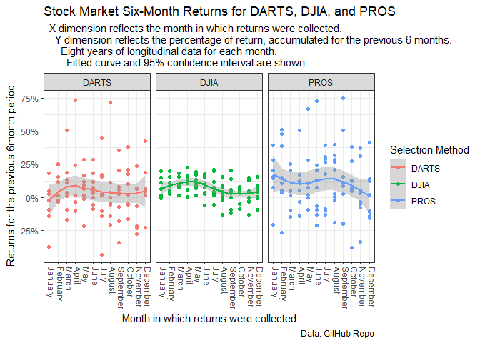

---
title: "Task 17 : Contr4olling Categorical Variables (Factors)"
author: "TomHollinberger"
date: "10/22/2020"
output: 
 html_document: 
   keep_md: yes
   toc: TRUE
   toc_depth: 6
---  
THIS RSCRIPT USES ROXYGEN CHARACTERS.  
YOU CAN PRESS ctrl+shift+K AND GO STRAIGHT TO A HTML.  
SKIPS THE HANDWORK OF CREATING A RMD, AFTER THE ORIGINAL WORK IS NONE IN A RSCRIPT.


```r
#"E:/000 DTS 350 Data Visualization/DTS350-hollinbergert/DTS350TemplateMaster/Week_07/Class_Task_13/dowrds4.rds"
library(tidyverse)
```

```
## -- Attaching packages ------------------------------------------------------------------------------------------------------------------ tidyverse 1.3.0 --
```

```
## v ggplot2 3.3.2     v purrr   0.3.4
## v tibble  3.0.3     v dplyr   1.0.0
## v tidyr   1.1.0     v stringr 1.4.0
## v readr   1.3.1     v forcats 0.5.0
```

```
## -- Conflicts --------------------------------------------------------------------------------------------------------------------- tidyverse_conflicts() --
## x dplyr::filter() masks stats::filter()
## x dplyr::lag()    masks stats::lag()
```

```r
library(dplyr)
dowrds1 <- read_rds("E:/000 DTS 350 Data Visualization/DTS350-hollinbergert/DTS350TemplateMaster/Week_07/Class_Task_13/dowrds4.rds")
mon_levels <- c("Jan","Feb","Mar","Apr","May","Jun","Jul","Aug","Sep","Oct","Nov","Dec")
month_levels <- c("January","February","March","April","May","June","July","August","September","October","November","December")
dowrds1$month_endf <- factor(dowrds1$month_end, levels = month_levels)
```


## Plot 1 :  


```r
ggplot(data = dowrds1, mapping = aes(x = month_endf, y = value, group = variable, color=variable)) +
  geom_point() +  
  geom_smooth(se = TRUE) +
  scale_size_continuous("Selection Method") +
  scale_y_continuous("Returns for the previous 6month period",labels = function(x) paste0(x, "%")) +
  scale_x_discrete("Month in which returns were collected") +
  scale_color_discrete("Selection Method") +
  facet_wrap(vars(variable)) +
  theme_bw() +
  theme(axis.text.x = element_text(angle = -90, hjust = 0, vjust = 0)) +
  labs(title = "Stock Market Six-Month Returns for DARTS, DJIA, and PROS",
       subtitle = "  X dimension reflects the month in which returns were collected.  \n    Y dimension reflects the percentage of return, accumulated for the previous 6 months. \n      Eight years of longitudinal data for each month.  \n        Fitted curve and 95% confidence interval are shown.",
       caption = "Data: GitHub Repo")
```

```
## `geom_smooth()` using method = 'loess' and formula 'y ~ x'
```

<!-- -->


### [ ] **Plot 1 Insight** :  DJIA has less variability throughout the year, and longitudinally for any specific month across eight years.  With this reduced DJIA variation, a mild pattern can be seen starting relatively high in January, raising a little more in Feb thru May, then dropping to lows in Oct thru Nov, then rising in Dec.  Similar patterns in the DARTS or PROS data are extremely vague.


### [ ] Using drop=FALSE in the scale_x_discrete command didn't alter the graph very much.  It removed the x-axis text and replaced it with the default (variable name).  I suppose that since months are now factors, the drop=FALSE didn't apply.

