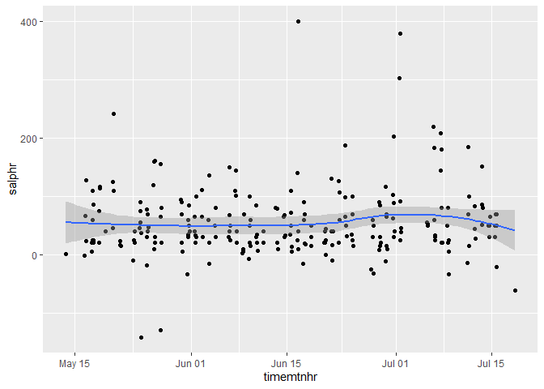
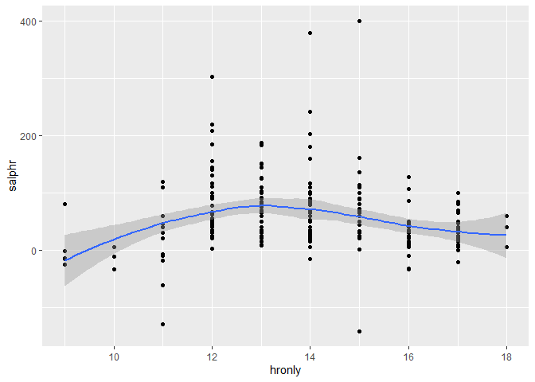
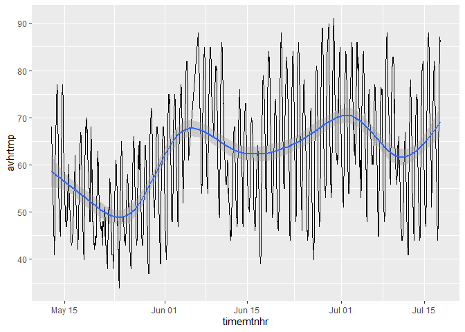
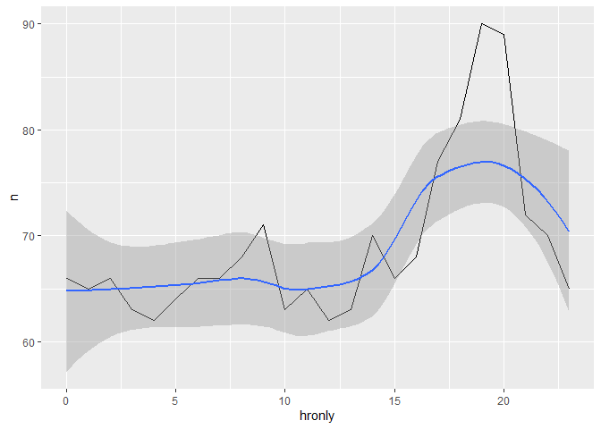
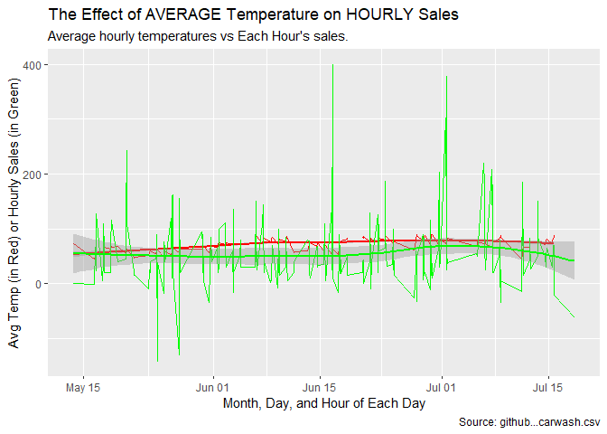
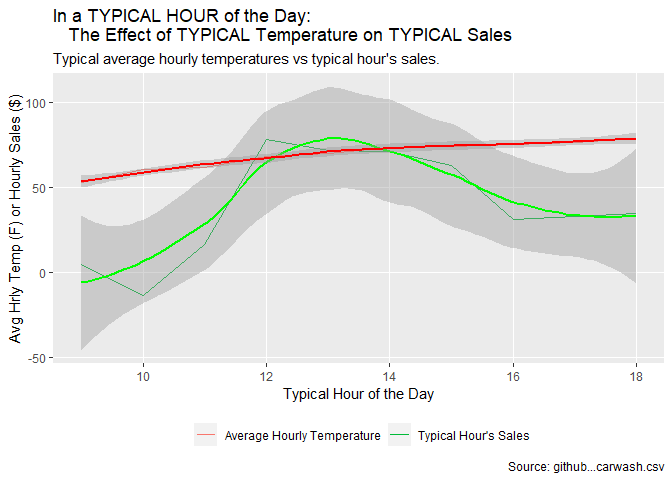

---
title: "18Task :  Does Weather Hurt My Bottomline?"
author: "TomHollinberger"
date: "10/28/2020"
output: 
 html_document: 
   keep_md: yes
   code_folding:  hide
   toc: TRUE
   toc_depth: 6
---  
THIS RSCRIPT USES ROXYGEN CHARACTERS.  
YOU CAN PRESS ctrl+shift+K AND GO STRAIGHT TO A HTML.  
SKIPS THE HANDWORK OF CREATING A RMD, AFTER THE ORIGINAL WORK IS NONE IN A RSCRIPT.
sample filepath E:/000 DTS 350 Data Visualization/DTS350-hollinbergert/DTS350TemplateMaster/Week_10/Class_Task_18/data.xlsx


```r
library(tidyverse)
```

```
## -- Attaching packages ---------------------------------------------------------------------------------------------- tidyverse 1.3.0 --
```

```
## v ggplot2 3.3.2     v purrr   0.3.4
## v tibble  3.0.3     v dplyr   1.0.0
## v tidyr   1.1.0     v stringr 1.4.0
## v readr   1.3.1     v forcats 0.5.0
```

```
## -- Conflicts ------------------------------------------------------------------------------------------------- tidyverse_conflicts() --
## x dplyr::filter() masks stats::filter()
## x dplyr::lag()    masks stats::lag()
```

```r
library(dplyr)
library(lubridate)
```

```
## 
## Attaching package: 'lubridate'
```

```
## The following objects are masked from 'package:base':
## 
##     date, intersect, setdiff, union
```

```r
library(ggplot2)
```

Check working directory
getwd() #"C:/Users/tomho/Documents"
alerady set by github   setwd("350 Data Visualization/DTS350-hollinbergert/DTS350TemplateMaster/Week_10/Class_Task_18/")


```r
getwd()
```

```
## [1] "E:/000 DTS 350 Data Visualization/DTS350-hollinbergert/DTS350TemplateMaster/Week_10/Class_Task_18"
```

Download the csv  go to github and copy the link and paste here...


```r
#download.file("https://github.com/WJC-Data-Science/DTS350/raw/master/carwash.csv", "cw.csv", mode = "wb")
```

Open csv in excel and filter each row to see what the column contents are (missing data = 99 for example, etc) .
Also look for opening lines to skip, comment flags, column names (header row), etc 
name	type	time	amount
Now we use the read_csv function to load the data.


```r
cw <- read_csv("cw.csv")
```

```
## Parsed with column specification:
## cols(
##   name = col_character(),
##   type = col_character(),
##   time = col_datetime(format = ""),
##   amount = col_double()
## )
```

```r
cw    #looks good, all columns came over.
```

```
## # A tibble: 533 x 4
##    name          type     time                amount
##    <chr>         <chr>    <dttm>               <dbl>
##  1 SplashandDash Services 2016-05-13 20:27:00    1  
##  2 SplashandDash Services 2016-05-13 20:27:00    0  
##  3 SplashandDash Services 2016-05-16 19:31:00   23.6
##  4 SplashandDash Services 2016-05-16 17:09:00   18.9
##  5 SplashandDash Services 2016-05-16 17:47:00   23.6
##  6 SplashandDash Services 2016-05-16 17:50:00   23.6
##  7 SplashandDash Services 2016-05-16 21:23:00   18.9
##  8 SplashandDash Services 2016-05-16 21:31:00   14.2
##  9 SplashandDash Services 2016-05-16 21:33:00   47.2
## 10 SplashandDash Services 2016-05-16 21:36:00   47.2
## # ... with 523 more rows
```

cols(name = col_character(), type = col_character(), time = col_datetime(format = ""), amount = col_double()
says name (char) = splashanddash only.  type (char) = services only,   


```r
str(cw)   
```

```
## tibble [533 x 4] (S3: spec_tbl_df/tbl_df/tbl/data.frame)
##  $ name  : chr [1:533] "SplashandDash" "SplashandDash" "SplashandDash" "SplashandDash" ...
##  $ type  : chr [1:533] "Services" "Services" "Services" "Services" ...
##  $ time  : POSIXct[1:533], format: "2016-05-13 20:27:00" "2016-05-13 20:27:00" ...
##  $ amount: num [1:533] 1 0 23.6 18.9 23.6 ...
##  - attr(*, "spec")=
##   .. cols(
##   ..   name = col_character(),
##   ..   type = col_character(),
##   ..   time = col_datetime(format = ""),
##   ..   amount = col_double()
##   .. )
```

```r
cwta <- select(cw, time, amount) 
cwta
```

```
## # A tibble: 533 x 2
##    time                amount
##    <dttm>               <dbl>
##  1 2016-05-13 20:27:00    1  
##  2 2016-05-13 20:27:00    0  
##  3 2016-05-16 19:31:00   23.6
##  4 2016-05-16 17:09:00   18.9
##  5 2016-05-16 17:47:00   23.6
##  6 2016-05-16 17:50:00   23.6
##  7 2016-05-16 21:23:00   18.9
##  8 2016-05-16 21:31:00   14.2
##  9 2016-05-16 21:33:00   47.2
## 10 2016-05-16 21:36:00   47.2
## # ... with 523 more rows
```

Convert the times from UTC time to mountain time using the right function out of library(lubridate).


```r
list(OlsonNames())  #see all 600 entries.  Choose "America/Denver" to represent Mountain tz
```

```
## [[1]]
##   [1] "Africa/Abidjan"                   "Africa/Accra"                    
##   [3] "Africa/Addis_Ababa"               "Africa/Algiers"                  
##   [5] "Africa/Asmara"                    "Africa/Asmera"                   
##   [7] "Africa/Bamako"                    "Africa/Bangui"                   
##   [9] "Africa/Banjul"                    "Africa/Bissau"                   
##  [11] "Africa/Blantyre"                  "Africa/Brazzaville"              
##  [13] "Africa/Bujumbura"                 "Africa/Cairo"                    
##  [15] "Africa/Casablanca"                "Africa/Ceuta"                    
##  [17] "Africa/Conakry"                   "Africa/Dakar"                    
##  [19] "Africa/Dar_es_Salaam"             "Africa/Djibouti"                 
##  [21] "Africa/Douala"                    "Africa/El_Aaiun"                 
##  [23] "Africa/Freetown"                  "Africa/Gaborone"                 
##  [25] "Africa/Harare"                    "Africa/Johannesburg"             
##  [27] "Africa/Juba"                      "Africa/Kampala"                  
##  [29] "Africa/Khartoum"                  "Africa/Kigali"                   
##  [31] "Africa/Kinshasa"                  "Africa/Lagos"                    
##  [33] "Africa/Libreville"                "Africa/Lome"                     
##  [35] "Africa/Luanda"                    "Africa/Lubumbashi"               
##  [37] "Africa/Lusaka"                    "Africa/Malabo"                   
##  [39] "Africa/Maputo"                    "Africa/Maseru"                   
##  [41] "Africa/Mbabane"                   "Africa/Mogadishu"                
##  [43] "Africa/Monrovia"                  "Africa/Nairobi"                  
##  [45] "Africa/Ndjamena"                  "Africa/Niamey"                   
##  [47] "Africa/Nouakchott"                "Africa/Ouagadougou"              
##  [49] "Africa/Porto-Novo"                "Africa/Sao_Tome"                 
##  [51] "Africa/Timbuktu"                  "Africa/Tripoli"                  
##  [53] "Africa/Tunis"                     "Africa/Windhoek"                 
##  [55] "America/Adak"                     "America/Anchorage"               
##  [57] "America/Anguilla"                 "America/Antigua"                 
##  [59] "America/Araguaina"                "America/Argentina/Buenos_Aires"  
##  [61] "America/Argentina/Catamarca"      "America/Argentina/ComodRivadavia"
##  [63] "America/Argentina/Cordoba"        "America/Argentina/Jujuy"         
##  [65] "America/Argentina/La_Rioja"       "America/Argentina/Mendoza"       
##  [67] "America/Argentina/Rio_Gallegos"   "America/Argentina/Salta"         
##  [69] "America/Argentina/San_Juan"       "America/Argentina/San_Luis"      
##  [71] "America/Argentina/Tucuman"        "America/Argentina/Ushuaia"       
##  [73] "America/Aruba"                    "America/Asuncion"                
##  [75] "America/Atikokan"                 "America/Atka"                    
##  [77] "America/Bahia"                    "America/Bahia_Banderas"          
##  [79] "America/Barbados"                 "America/Belem"                   
##  [81] "America/Belize"                   "America/Blanc-Sablon"            
##  [83] "America/Boa_Vista"                "America/Bogota"                  
##  [85] "America/Boise"                    "America/Buenos_Aires"            
##  [87] "America/Cambridge_Bay"            "America/Campo_Grande"            
##  [89] "America/Cancun"                   "America/Caracas"                 
##  [91] "America/Catamarca"                "America/Cayenne"                 
##  [93] "America/Cayman"                   "America/Chicago"                 
##  [95] "America/Chihuahua"                "America/Coral_Harbour"           
##  [97] "America/Cordoba"                  "America/Costa_Rica"              
##  [99] "America/Creston"                  "America/Cuiaba"                  
## [101] "America/Curacao"                  "America/Danmarkshavn"            
## [103] "America/Dawson"                   "America/Dawson_Creek"            
## [105] "America/Denver"                   "America/Detroit"                 
## [107] "America/Dominica"                 "America/Edmonton"                
## [109] "America/Eirunepe"                 "America/El_Salvador"             
## [111] "America/Ensenada"                 "America/Fort_Nelson"             
## [113] "America/Fort_Wayne"               "America/Fortaleza"               
## [115] "America/Glace_Bay"                "America/Godthab"                 
## [117] "America/Goose_Bay"                "America/Grand_Turk"              
## [119] "America/Grenada"                  "America/Guadeloupe"              
## [121] "America/Guatemala"                "America/Guayaquil"               
## [123] "America/Guyana"                   "America/Halifax"                 
## [125] "America/Havana"                   "America/Hermosillo"              
## [127] "America/Indiana/Indianapolis"     "America/Indiana/Knox"            
## [129] "America/Indiana/Marengo"          "America/Indiana/Petersburg"      
## [131] "America/Indiana/Tell_City"        "America/Indiana/Vevay"           
## [133] "America/Indiana/Vincennes"        "America/Indiana/Winamac"         
## [135] "America/Indianapolis"             "America/Inuvik"                  
## [137] "America/Iqaluit"                  "America/Jamaica"                 
## [139] "America/Jujuy"                    "America/Juneau"                  
## [141] "America/Kentucky/Louisville"      "America/Kentucky/Monticello"     
## [143] "America/Knox_IN"                  "America/Kralendijk"              
## [145] "America/La_Paz"                   "America/Lima"                    
## [147] "America/Los_Angeles"              "America/Louisville"              
## [149] "America/Lower_Princes"            "America/Maceio"                  
## [151] "America/Managua"                  "America/Manaus"                  
## [153] "America/Marigot"                  "America/Martinique"              
## [155] "America/Matamoros"                "America/Mazatlan"                
## [157] "America/Mendoza"                  "America/Menominee"               
## [159] "America/Merida"                   "America/Metlakatla"              
## [161] "America/Mexico_City"              "America/Miquelon"                
## [163] "America/Moncton"                  "America/Monterrey"               
## [165] "America/Montevideo"               "America/Montreal"                
## [167] "America/Montserrat"               "America/Nassau"                  
## [169] "America/New_York"                 "America/Nipigon"                 
## [171] "America/Nome"                     "America/Noronha"                 
## [173] "America/North_Dakota/Beulah"      "America/North_Dakota/Center"     
## [175] "America/North_Dakota/New_Salem"   "America/Nuuk"                    
## [177] "America/Ojinaga"                  "America/Panama"                  
## [179] "America/Pangnirtung"              "America/Paramaribo"              
## [181] "America/Phoenix"                  "America/Port-au-Prince"          
## [183] "America/Port_of_Spain"            "America/Porto_Acre"              
## [185] "America/Porto_Velho"              "America/Puerto_Rico"             
## [187] "America/Punta_Arenas"             "America/Rainy_River"             
## [189] "America/Rankin_Inlet"             "America/Recife"                  
## [191] "America/Regina"                   "America/Resolute"                
## [193] "America/Rio_Branco"               "America/Rosario"                 
## [195] "America/Santa_Isabel"             "America/Santarem"                
## [197] "America/Santiago"                 "America/Santo_Domingo"           
## [199] "America/Sao_Paulo"                "America/Scoresbysund"            
## [201] "America/Shiprock"                 "America/Sitka"                   
## [203] "America/St_Barthelemy"            "America/St_Johns"                
## [205] "America/St_Kitts"                 "America/St_Lucia"                
## [207] "America/St_Thomas"                "America/St_Vincent"              
## [209] "America/Swift_Current"            "America/Tegucigalpa"             
## [211] "America/Thule"                    "America/Thunder_Bay"             
## [213] "America/Tijuana"                  "America/Toronto"                 
## [215] "America/Tortola"                  "America/Vancouver"               
## [217] "America/Virgin"                   "America/Whitehorse"              
## [219] "America/Winnipeg"                 "America/Yakutat"                 
## [221] "America/Yellowknife"              "Antarctica/Casey"                
## [223] "Antarctica/Davis"                 "Antarctica/DumontDUrville"       
## [225] "Antarctica/Macquarie"             "Antarctica/Mawson"               
## [227] "Antarctica/McMurdo"               "Antarctica/Palmer"               
## [229] "Antarctica/Rothera"               "Antarctica/South_Pole"           
## [231] "Antarctica/Syowa"                 "Antarctica/Troll"                
## [233] "Antarctica/Vostok"                "Arctic/Longyearbyen"             
## [235] "Asia/Aden"                        "Asia/Almaty"                     
## [237] "Asia/Amman"                       "Asia/Anadyr"                     
## [239] "Asia/Aqtau"                       "Asia/Aqtobe"                     
## [241] "Asia/Ashgabat"                    "Asia/Ashkhabad"                  
## [243] "Asia/Atyrau"                      "Asia/Baghdad"                    
## [245] "Asia/Bahrain"                     "Asia/Baku"                       
## [247] "Asia/Bangkok"                     "Asia/Barnaul"                    
## [249] "Asia/Beirut"                      "Asia/Bishkek"                    
## [251] "Asia/Brunei"                      "Asia/Calcutta"                   
## [253] "Asia/Chita"                       "Asia/Choibalsan"                 
## [255] "Asia/Chongqing"                   "Asia/Chungking"                  
## [257] "Asia/Colombo"                     "Asia/Dacca"                      
## [259] "Asia/Damascus"                    "Asia/Dhaka"                      
## [261] "Asia/Dili"                        "Asia/Dubai"                      
## [263] "Asia/Dushanbe"                    "Asia/Famagusta"                  
## [265] "Asia/Gaza"                        "Asia/Harbin"                     
## [267] "Asia/Hebron"                      "Asia/Ho_Chi_Minh"                
## [269] "Asia/Hong_Kong"                   "Asia/Hovd"                       
## [271] "Asia/Irkutsk"                     "Asia/Istanbul"                   
## [273] "Asia/Jakarta"                     "Asia/Jayapura"                   
## [275] "Asia/Jerusalem"                   "Asia/Kabul"                      
## [277] "Asia/Kamchatka"                   "Asia/Karachi"                    
## [279] "Asia/Kashgar"                     "Asia/Kathmandu"                  
## [281] "Asia/Katmandu"                    "Asia/Khandyga"                   
## [283] "Asia/Kolkata"                     "Asia/Krasnoyarsk"                
## [285] "Asia/Kuala_Lumpur"                "Asia/Kuching"                    
## [287] "Asia/Kuwait"                      "Asia/Macao"                      
## [289] "Asia/Macau"                       "Asia/Magadan"                    
## [291] "Asia/Makassar"                    "Asia/Manila"                     
## [293] "Asia/Muscat"                      "Asia/Nicosia"                    
## [295] "Asia/Novokuznetsk"                "Asia/Novosibirsk"                
## [297] "Asia/Omsk"                        "Asia/Oral"                       
## [299] "Asia/Phnom_Penh"                  "Asia/Pontianak"                  
## [301] "Asia/Pyongyang"                   "Asia/Qatar"                      
## [303] "Asia/Qostanay"                    "Asia/Qyzylorda"                  
## [305] "Asia/Rangoon"                     "Asia/Riyadh"                     
## [307] "Asia/Saigon"                      "Asia/Sakhalin"                   
## [309] "Asia/Samarkand"                   "Asia/Seoul"                      
## [311] "Asia/Shanghai"                    "Asia/Singapore"                  
## [313] "Asia/Srednekolymsk"               "Asia/Taipei"                     
## [315] "Asia/Tashkent"                    "Asia/Tbilisi"                    
## [317] "Asia/Tehran"                      "Asia/Tel_Aviv"                   
## [319] "Asia/Thimbu"                      "Asia/Thimphu"                    
## [321] "Asia/Tokyo"                       "Asia/Tomsk"                      
## [323] "Asia/Ujung_Pandang"               "Asia/Ulaanbaatar"                
## [325] "Asia/Ulan_Bator"                  "Asia/Urumqi"                     
## [327] "Asia/Ust-Nera"                    "Asia/Vientiane"                  
## [329] "Asia/Vladivostok"                 "Asia/Yakutsk"                    
## [331] "Asia/Yangon"                      "Asia/Yekaterinburg"              
## [333] "Asia/Yerevan"                     "Atlantic/Azores"                 
## [335] "Atlantic/Bermuda"                 "Atlantic/Canary"                 
## [337] "Atlantic/Cape_Verde"              "Atlantic/Faeroe"                 
## [339] "Atlantic/Faroe"                   "Atlantic/Jan_Mayen"              
## [341] "Atlantic/Madeira"                 "Atlantic/Reykjavik"              
## [343] "Atlantic/South_Georgia"           "Atlantic/St_Helena"              
## [345] "Atlantic/Stanley"                 "Australia/ACT"                   
## [347] "Australia/Adelaide"               "Australia/Brisbane"              
## [349] "Australia/Broken_Hill"            "Australia/Canberra"              
## [351] "Australia/Currie"                 "Australia/Darwin"                
## [353] "Australia/Eucla"                  "Australia/Hobart"                
## [355] "Australia/LHI"                    "Australia/Lindeman"              
## [357] "Australia/Lord_Howe"              "Australia/Melbourne"             
## [359] "Australia/North"                  "Australia/NSW"                   
## [361] "Australia/Perth"                  "Australia/Queensland"            
## [363] "Australia/South"                  "Australia/Sydney"                
## [365] "Australia/Tasmania"               "Australia/Victoria"              
## [367] "Australia/West"                   "Australia/Yancowinna"            
## [369] "Brazil/Acre"                      "Brazil/DeNoronha"                
## [371] "Brazil/East"                      "Brazil/West"                     
## [373] "Canada/Atlantic"                  "Canada/Central"                  
## [375] "Canada/Eastern"                   "Canada/Mountain"                 
## [377] "Canada/Newfoundland"              "Canada/Pacific"                  
## [379] "Canada/Saskatchewan"              "Canada/Yukon"                    
## [381] "CET"                              "Chile/Continental"               
## [383] "Chile/EasterIsland"               "CST6CDT"                         
## [385] "Cuba"                             "EET"                             
## [387] "Egypt"                            "Eire"                            
## [389] "EST"                              "EST5EDT"                         
## [391] "Etc/GMT"                          "Etc/GMT-0"                       
## [393] "Etc/GMT-1"                        "Etc/GMT-10"                      
## [395] "Etc/GMT-11"                       "Etc/GMT-12"                      
## [397] "Etc/GMT-13"                       "Etc/GMT-14"                      
## [399] "Etc/GMT-2"                        "Etc/GMT-3"                       
## [401] "Etc/GMT-4"                        "Etc/GMT-5"                       
## [403] "Etc/GMT-6"                        "Etc/GMT-7"                       
## [405] "Etc/GMT-8"                        "Etc/GMT-9"                       
## [407] "Etc/GMT+0"                        "Etc/GMT+1"                       
## [409] "Etc/GMT+10"                       "Etc/GMT+11"                      
## [411] "Etc/GMT+12"                       "Etc/GMT+2"                       
## [413] "Etc/GMT+3"                        "Etc/GMT+4"                       
## [415] "Etc/GMT+5"                        "Etc/GMT+6"                       
## [417] "Etc/GMT+7"                        "Etc/GMT+8"                       
## [419] "Etc/GMT+9"                        "Etc/GMT0"                        
## [421] "Etc/Greenwich"                    "Etc/UCT"                         
## [423] "Etc/Universal"                    "Etc/UTC"                         
## [425] "Etc/Zulu"                         "Europe/Amsterdam"                
## [427] "Europe/Andorra"                   "Europe/Astrakhan"                
## [429] "Europe/Athens"                    "Europe/Belfast"                  
## [431] "Europe/Belgrade"                  "Europe/Berlin"                   
## [433] "Europe/Bratislava"                "Europe/Brussels"                 
## [435] "Europe/Bucharest"                 "Europe/Budapest"                 
## [437] "Europe/Busingen"                  "Europe/Chisinau"                 
## [439] "Europe/Copenhagen"                "Europe/Dublin"                   
## [441] "Europe/Gibraltar"                 "Europe/Guernsey"                 
## [443] "Europe/Helsinki"                  "Europe/Isle_of_Man"              
## [445] "Europe/Istanbul"                  "Europe/Jersey"                   
## [447] "Europe/Kaliningrad"               "Europe/Kiev"                     
## [449] "Europe/Kirov"                     "Europe/Lisbon"                   
## [451] "Europe/Ljubljana"                 "Europe/London"                   
## [453] "Europe/Luxembourg"                "Europe/Madrid"                   
## [455] "Europe/Malta"                     "Europe/Mariehamn"                
## [457] "Europe/Minsk"                     "Europe/Monaco"                   
## [459] "Europe/Moscow"                    "Europe/Nicosia"                  
## [461] "Europe/Oslo"                      "Europe/Paris"                    
## [463] "Europe/Podgorica"                 "Europe/Prague"                   
## [465] "Europe/Riga"                      "Europe/Rome"                     
## [467] "Europe/Samara"                    "Europe/San_Marino"               
## [469] "Europe/Sarajevo"                  "Europe/Saratov"                  
## [471] "Europe/Simferopol"                "Europe/Skopje"                   
## [473] "Europe/Sofia"                     "Europe/Stockholm"                
## [475] "Europe/Tallinn"                   "Europe/Tirane"                   
## [477] "Europe/Tiraspol"                  "Europe/Ulyanovsk"                
## [479] "Europe/Uzhgorod"                  "Europe/Vaduz"                    
## [481] "Europe/Vatican"                   "Europe/Vienna"                   
## [483] "Europe/Vilnius"                   "Europe/Volgograd"                
## [485] "Europe/Warsaw"                    "Europe/Zagreb"                   
## [487] "Europe/Zaporozhye"                "Europe/Zurich"                   
## [489] "GB"                               "GB-Eire"                         
## [491] "GMT"                              "GMT-0"                           
## [493] "GMT+0"                            "GMT0"                            
## [495] "Greenwich"                        "Hongkong"                        
## [497] "HST"                              "Iceland"                         
## [499] "Indian/Antananarivo"              "Indian/Chagos"                   
## [501] "Indian/Christmas"                 "Indian/Cocos"                    
## [503] "Indian/Comoro"                    "Indian/Kerguelen"                
## [505] "Indian/Mahe"                      "Indian/Maldives"                 
## [507] "Indian/Mauritius"                 "Indian/Mayotte"                  
## [509] "Indian/Reunion"                   "Iran"                            
## [511] "Israel"                           "Jamaica"                         
## [513] "Japan"                            "Kwajalein"                       
## [515] "Libya"                            "MET"                             
## [517] "Mexico/BajaNorte"                 "Mexico/BajaSur"                  
## [519] "Mexico/General"                   "MST"                             
## [521] "MST7MDT"                          "Navajo"                          
## [523] "NZ"                               "NZ-CHAT"                         
## [525] "Pacific/Apia"                     "Pacific/Auckland"                
## [527] "Pacific/Bougainville"             "Pacific/Chatham"                 
## [529] "Pacific/Chuuk"                    "Pacific/Easter"                  
## [531] "Pacific/Efate"                    "Pacific/Enderbury"               
## [533] "Pacific/Fakaofo"                  "Pacific/Fiji"                    
## [535] "Pacific/Funafuti"                 "Pacific/Galapagos"               
## [537] "Pacific/Gambier"                  "Pacific/Guadalcanal"             
## [539] "Pacific/Guam"                     "Pacific/Honolulu"                
## [541] "Pacific/Johnston"                 "Pacific/Kiritimati"              
## [543] "Pacific/Kosrae"                   "Pacific/Kwajalein"               
## [545] "Pacific/Majuro"                   "Pacific/Marquesas"               
## [547] "Pacific/Midway"                   "Pacific/Nauru"                   
## [549] "Pacific/Niue"                     "Pacific/Norfolk"                 
## [551] "Pacific/Noumea"                   "Pacific/Pago_Pago"               
## [553] "Pacific/Palau"                    "Pacific/Pitcairn"                
## [555] "Pacific/Pohnpei"                  "Pacific/Ponape"                  
## [557] "Pacific/Port_Moresby"             "Pacific/Rarotonga"               
## [559] "Pacific/Saipan"                   "Pacific/Samoa"                   
## [561] "Pacific/Tahiti"                   "Pacific/Tarawa"                  
## [563] "Pacific/Tongatapu"                "Pacific/Truk"                    
## [565] "Pacific/Wake"                     "Pacific/Wallis"                  
## [567] "Pacific/Yap"                      "Poland"                          
## [569] "Portugal"                         "PRC"                             
## [571] "PST8PDT"                          "ROC"                             
## [573] "ROK"                              "Singapore"                       
## [575] "Turkey"                           "UCT"                             
## [577] "Universal"                        "US/Alaska"                       
## [579] "US/Aleutian"                      "US/Arizona"                      
## [581] "US/Central"                       "US/East-Indiana"                 
## [583] "US/Eastern"                       "US/Hawaii"                       
## [585] "US/Indiana-Starke"                "US/Michigan"                     
## [587] "US/Mountain"                      "US/Pacific"                      
## [589] "US/Pacific-New"                   "US/Samoa"                        
## [591] "UTC"                              "W-SU"                            
## [593] "WET"                              "Zulu"                            
## attr(,"Version")
## [1] "2020a"
```

```r
cwtb <- cwta
cwtb
```

```
## # A tibble: 533 x 2
##    time                amount
##    <dttm>               <dbl>
##  1 2016-05-13 20:27:00    1  
##  2 2016-05-13 20:27:00    0  
##  3 2016-05-16 19:31:00   23.6
##  4 2016-05-16 17:09:00   18.9
##  5 2016-05-16 17:47:00   23.6
##  6 2016-05-16 17:50:00   23.6
##  7 2016-05-16 21:23:00   18.9
##  8 2016-05-16 21:31:00   14.2
##  9 2016-05-16 21:33:00   47.2
## 10 2016-05-16 21:36:00   47.2
## # ... with 523 more rows
```

```r
cwtb$time <- ymd_hms(cwtb$time, tz = "UTC") 
cwtb$timemtn <- with_tz(cwtb$time, tz = "America/Denver")  
cwtb   #now has Mountain time column
```

```
## # A tibble: 533 x 3
##    time                amount timemtn            
##    <dttm>               <dbl> <dttm>             
##  1 2016-05-13 20:27:00    1   2016-05-13 14:27:00
##  2 2016-05-13 20:27:00    0   2016-05-13 14:27:00
##  3 2016-05-16 19:31:00   23.6 2016-05-16 13:31:00
##  4 2016-05-16 17:09:00   18.9 2016-05-16 11:09:00
##  5 2016-05-16 17:47:00   23.6 2016-05-16 11:47:00
##  6 2016-05-16 17:50:00   23.6 2016-05-16 11:50:00
##  7 2016-05-16 21:23:00   18.9 2016-05-16 15:23:00
##  8 2016-05-16 21:31:00   14.2 2016-05-16 15:31:00
##  9 2016-05-16 21:33:00   47.2 2016-05-16 15:33:00
## 10 2016-05-16 21:36:00   47.2 2016-05-16 15:36:00
## # ... with 523 more rows
```

Create a new hourly grouping variable using ceiling_date() from library(lubridate).  Aggregate the point of sale data into hour sales totals


```r
cwtc <- cwtb
cwtc$timemtnhr <- ceiling_date(cwtb$timemtn, "hour")
cwtc
```

```
## # A tibble: 533 x 4
##    time                amount timemtn             timemtnhr          
##    <dttm>               <dbl> <dttm>              <dttm>             
##  1 2016-05-13 20:27:00    1   2016-05-13 14:27:00 2016-05-13 15:00:00
##  2 2016-05-13 20:27:00    0   2016-05-13 14:27:00 2016-05-13 15:00:00
##  3 2016-05-16 19:31:00   23.6 2016-05-16 13:31:00 2016-05-16 14:00:00
##  4 2016-05-16 17:09:00   18.9 2016-05-16 11:09:00 2016-05-16 12:00:00
##  5 2016-05-16 17:47:00   23.6 2016-05-16 11:47:00 2016-05-16 12:00:00
##  6 2016-05-16 17:50:00   23.6 2016-05-16 11:50:00 2016-05-16 12:00:00
##  7 2016-05-16 21:23:00   18.9 2016-05-16 15:23:00 2016-05-16 16:00:00
##  8 2016-05-16 21:31:00   14.2 2016-05-16 15:31:00 2016-05-16 16:00:00
##  9 2016-05-16 21:33:00   47.2 2016-05-16 15:33:00 2016-05-16 16:00:00
## 10 2016-05-16 21:36:00   47.2 2016-05-16 15:36:00 2016-05-16 16:00:00
## # ... with 523 more rows
```

Aggregate the point of sale data into hour sales totals.  HOW TO AGGREGATE : NEED TO SUM the AMOUNT columns


```r
cwhrly <- group_by(cwtc, timemtnhr)
cwsalhrly <- summarise(cwhrly, salphr = sum(amount, na.rm = TRUE))
```

```
## `summarise()` ungrouping output (override with `.groups` argument)
```

```r
cwsalhrly  #It's here  use this to merge or join to tmpc
```

```
## # A tibble: 240 x 2
##    timemtnhr           salphr
##    <dttm>               <dbl>
##  1 2016-05-13 15:00:00    1  
##  2 2016-05-16 09:00:00   -1  
##  3 2016-05-16 12:00:00   66.0
##  4 2016-05-16 14:00:00   23.6
##  5 2016-05-16 16:00:00  127. 
##  6 2016-05-17 10:00:00    5  
##  7 2016-05-17 11:00:00   20  
##  8 2016-05-17 12:00:00   25  
##  9 2016-05-17 13:00:00   60  
## 10 2016-05-17 14:00:00  110  
## # ... with 230 more rows
```

### PRELIM PLOT OF SALES (hourly across the whole time period)


```r
ggplot(cwsalhrly, aes(timemtnhr, salphr)) +
  geom_point() +
  geom_smooth()
```

```
## `geom_smooth()` using method = 'loess' and formula 'y ~ x'
```

<!-- -->

```r
cwsalhrlyb <- cwsalhrly
cwsalhrlyb
```

```
## # A tibble: 240 x 2
##    timemtnhr           salphr
##    <dttm>               <dbl>
##  1 2016-05-13 15:00:00    1  
##  2 2016-05-16 09:00:00   -1  
##  3 2016-05-16 12:00:00   66.0
##  4 2016-05-16 14:00:00   23.6
##  5 2016-05-16 16:00:00  127. 
##  6 2016-05-17 10:00:00    5  
##  7 2016-05-17 11:00:00   20  
##  8 2016-05-17 12:00:00   25  
##  9 2016-05-17 13:00:00   60  
## 10 2016-05-17 14:00:00  110  
## # ... with 230 more rows
```

```r
cwsalhrlyb$hronly <- hour(cwsalhrlyb$timemtnhr) 
cwsalhrlyb
```

```
## # A tibble: 240 x 3
##    timemtnhr           salphr hronly
##    <dttm>               <dbl>  <int>
##  1 2016-05-13 15:00:00    1       15
##  2 2016-05-16 09:00:00   -1        9
##  3 2016-05-16 12:00:00   66.0     12
##  4 2016-05-16 14:00:00   23.6     14
##  5 2016-05-16 16:00:00  127.      16
##  6 2016-05-17 10:00:00    5       10
##  7 2016-05-17 11:00:00   20       11
##  8 2016-05-17 12:00:00   25       12
##  9 2016-05-17 13:00:00   60       13
## 10 2016-05-17 14:00:00  110       14
## # ... with 230 more rows
```

### PRELIM PLOT OF TYPICAL DAY'S SALES  (hourly sales profile of a typical day)  
Pull out only the hour data, and graph by typical hour-of-the-day.  


```r
ggplot(cwsalhrlyb, aes(hronly, salphr)) +
  geom_point() +
  geom_smooth()
```

```
## `geom_smooth()` using method = 'loess' and formula 'y ~ x'
```

<!-- -->

Use riem_measures(station = "RXE",  date_start  = ,  date_end  =  ) for station RXE from library(riem) 
to get the matching temperatures.
Create a new hourly variable that matches your car wash hourly variable.
install riem


```r
library(riem)
```

```
## Warning: package 'riem' was built under R version 4.0.3
```

```r
summary(cwtc$timemtnhr)  
```

```
##                  Min.               1st Qu.                Median 
## "2016-05-13 15:00:00" "2016-05-31 10:00:00" "2016-06-15 15:00:00" 
##                  Mean               3rd Qu.                  Max. 
## "2016-06-15 08:48:10" "2016-06-30 17:00:00" "2016-07-18 11:00:00"
```

```r
#to find date window : min and max to be
#used as date_start adn date_end in the following riem_measures statement.
#  Min = 2016-05-13   Max = 2016-07-18
min(cwtc$timemtnhr)
```

```
## [1] "2016-05-13 15:00:00 MDT"
```

```r
max(cwtc$timemtnhr)
```

```
## [1] "2016-07-18 11:00:00 MDT"
```

```r
tmpa <- riem_measures(station = "RXE",  date_start  = "2016-05-13",  date_end  = "2016-07-18")
tmpa   #"valid" is the date variable (dttm).  It's in UTC.  tmpf is the temperature variable, it is a dbl
```

```
## # A tibble: 20,560 x 31
##    station valid                 lon   lat  tmpf  dwpf  relh  drct  sknt  p01i
##    <chr>   <dttm>              <dbl> <dbl> <dbl> <dbl> <dbl> <dbl> <dbl> <dbl>
##  1 RXE     2016-05-13 00:00:00 -112.  43.8    NA    NA    NA   220    14    NA
##  2 RXE     2016-05-13 00:05:00 -112.  43.8    NA    NA    NA   200    13    NA
##  3 RXE     2016-05-13 00:10:00 -112.  43.8    NA    NA    NA   200    12    NA
##  4 RXE     2016-05-13 00:15:00 -112.  43.8    NA    NA    NA   210    16    NA
##  5 RXE     2016-05-13 00:20:00 -112.  43.8    NA    NA    NA   200    14    NA
##  6 RXE     2016-05-13 00:25:00 -112.  43.8    NA    NA    NA   210    13    NA
##  7 RXE     2016-05-13 00:30:00 -112.  43.8    NA    NA    NA   220    12    NA
##  8 RXE     2016-05-13 00:35:00 -112.  43.8    NA    NA    NA   210    12    NA
##  9 RXE     2016-05-13 00:40:00 -112.  43.8    NA    NA    NA   200    14    NA
## 10 RXE     2016-05-13 00:45:00 -112.  43.8    NA    NA    NA   210    13    NA
## # ... with 20,550 more rows, and 21 more variables: alti <dbl>, mslp <dbl>,
## #   vsby <dbl>, gust <dbl>, skyc1 <chr>, skyc2 <chr>, skyc3 <chr>, skyc4 <lgl>,
## #   skyl1 <dbl>, skyl2 <dbl>, skyl3 <dbl>, skyl4 <lgl>, wxcodes <chr>,
## #   ice_accretion_1hr <lgl>, ice_accretion_3hr <lgl>, ice_accretion_6hr <lgl>,
## #   peak_wind_gust <dbl>, peak_wind_drct <dbl>, peak_wind_time <chr>,
## #   feel <dbl>, metar <chr>
```

```r
tmpa <- select(tmpa, valid, tmpf)
tmpa
```

```
## # A tibble: 20,560 x 2
##    valid                tmpf
##    <dttm>              <dbl>
##  1 2016-05-13 00:00:00    NA
##  2 2016-05-13 00:05:00    NA
##  3 2016-05-13 00:10:00    NA
##  4 2016-05-13 00:15:00    NA
##  5 2016-05-13 00:20:00    NA
##  6 2016-05-13 00:25:00    NA
##  7 2016-05-13 00:30:00    NA
##  8 2016-05-13 00:35:00    NA
##  9 2016-05-13 00:40:00    NA
## 10 2016-05-13 00:45:00    NA
## # ... with 20,550 more rows
```

```r
unique(tmpa$tmpf)  #has some NA's
```

```
##  [1]    NA 68.00 66.02 62.96 59.00 57.92 55.04 48.02 44.96 46.04 44.06 42.08
## [13] 41.00 46.94 53.06 60.08 64.04 66.92 69.98 71.96 73.94 75.92 77.00 75.02
## [25] 69.08 57.02 53.96 51.98 50.00 48.92 62.06 60.98 55.94 51.08 42.98 64.94
## [37] 39.92 51.80 48.20 46.40 60.80 39.02 37.94 37.04 33.98 35.96 53.60 64.40
## [49] 66.20 71.06 73.04 78.98 80.96 82.04 80.06 80.60 87.98 86.00 84.02 82.40
## [61] 78.80 82.94 84.92 78.08 57.20 73.40 71.60 69.80 87.08 89.06 89.60 87.80
## [73] 91.40 89.96 91.04 84.20
```

```r
tmpa <- filter(tmpa, !is.na(tmpf))
unique(tmpa$tmpf)  #OK, NA is gone
```

```
##  [1] 68.00 66.02 62.96 59.00 57.92 55.04 48.02 44.96 46.04 44.06 42.08 41.00
## [13] 46.94 53.06 60.08 64.04 66.92 69.98 71.96 73.94 75.92 77.00 75.02 69.08
## [25] 57.02 53.96 51.98 50.00 48.92 62.06 60.98 55.94 51.08 42.98 64.94 39.92
## [37] 51.80 48.20 46.40 60.80 39.02 37.94 37.04 33.98 35.96 53.60 64.40 66.20
## [49] 71.06 73.04 78.98 80.96 82.04 80.06 80.60 87.98 86.00 84.02 82.40 78.80
## [61] 82.94 84.92 78.08 57.20 73.40 71.60 69.80 87.08 89.06 89.60 87.80 91.40
## [73] 89.96 91.04 84.20
```

Convert the times from UTC time to mountain time using the right function out of library(lubridate).


```r
tmpb <- tmpa
tmpb
```

```
## # A tibble: 1,658 x 2
##    valid                tmpf
##    <dttm>              <dbl>
##  1 2016-05-13 00:53:00  68  
##  2 2016-05-13 01:53:00  66.0
##  3 2016-05-13 02:53:00  63.0
##  4 2016-05-13 03:53:00  59  
##  5 2016-05-13 04:53:00  57.9
##  6 2016-05-13 05:53:00  55.0
##  7 2016-05-13 06:53:00  55.0
##  8 2016-05-13 07:53:00  48.0
##  9 2016-05-13 08:53:00  45.0
## 10 2016-05-13 09:53:00  46.0
## # ... with 1,648 more rows
```

```r
tmpb$time <- ymd_hms(tmpb$valid, tz = "UTC") 
tmpb$timemtn <- with_tz(tmpb$time, tz = "America/Denver")  
tmpb$timemtn   #now has Mountain time column
```

```
##    [1] "2016-05-12 18:53:00 MDT" "2016-05-12 19:53:00 MDT"
##    [3] "2016-05-12 20:53:00 MDT" "2016-05-12 21:53:00 MDT"
##    [5] "2016-05-12 22:53:00 MDT" "2016-05-12 23:53:00 MDT"
##    [7] "2016-05-13 00:53:00 MDT" "2016-05-13 01:53:00 MDT"
##    [9] "2016-05-13 02:53:00 MDT" "2016-05-13 03:53:00 MDT"
##   [11] "2016-05-13 04:53:00 MDT" "2016-05-13 05:53:00 MDT"
##   [13] "2016-05-13 06:53:00 MDT" "2016-05-13 07:53:00 MDT"
##   [15] "2016-05-13 08:53:00 MDT" "2016-05-13 09:53:00 MDT"
##   [17] "2016-05-13 10:53:00 MDT" "2016-05-13 11:53:00 MDT"
##   [19] "2016-05-13 12:53:00 MDT" "2016-05-13 13:53:00 MDT"
##   [21] "2016-05-13 14:53:00 MDT" "2016-05-13 15:53:00 MDT"
##   [23] "2016-05-13 16:53:00 MDT" "2016-05-13 17:53:00 MDT"
##   [25] "2016-05-13 18:53:00 MDT" "2016-05-13 19:53:00 MDT"
##   [27] "2016-05-13 20:53:00 MDT" "2016-05-13 21:53:00 MDT"
##   [29] "2016-05-13 22:53:00 MDT" "2016-05-13 23:53:00 MDT"
##   [31] "2016-05-14 00:53:00 MDT" "2016-05-14 01:53:00 MDT"
##   [33] "2016-05-14 02:53:00 MDT" "2016-05-14 03:53:00 MDT"
##   [35] "2016-05-14 04:53:00 MDT" "2016-05-14 05:53:00 MDT"
##   [37] "2016-05-14 06:53:00 MDT" "2016-05-14 07:53:00 MDT"
##   [39] "2016-05-14 08:53:00 MDT" "2016-05-14 09:53:00 MDT"
##   [41] "2016-05-14 10:53:00 MDT" "2016-05-14 11:53:00 MDT"
##   [43] "2016-05-14 12:53:00 MDT" "2016-05-14 13:53:00 MDT"
##   [45] "2016-05-14 14:53:00 MDT" "2016-05-14 15:53:00 MDT"
##   [47] "2016-05-14 16:53:00 MDT" "2016-05-14 17:53:00 MDT"
##   [49] "2016-05-14 18:53:00 MDT" "2016-05-14 19:53:00 MDT"
##   [51] "2016-05-14 20:53:00 MDT" "2016-05-14 21:53:00 MDT"
##   [53] "2016-05-14 22:53:00 MDT" "2016-05-14 23:53:00 MDT"
##   [55] "2016-05-15 00:53:00 MDT" "2016-05-15 01:53:00 MDT"
##   [57] "2016-05-15 02:53:00 MDT" "2016-05-15 03:53:00 MDT"
##   [59] "2016-05-15 04:53:00 MDT" "2016-05-15 05:53:00 MDT"
##   [61] "2016-05-15 06:53:00 MDT" "2016-05-15 07:53:00 MDT"
##   [63] "2016-05-15 08:41:00 MDT" "2016-05-15 08:53:00 MDT"
##   [65] "2016-05-15 09:00:00 MDT" "2016-05-15 09:53:00 MDT"
##   [67] "2016-05-15 10:08:00 MDT" "2016-05-15 10:33:00 MDT"
##   [69] "2016-05-15 10:53:00 MDT" "2016-05-15 11:53:00 MDT"
##   [71] "2016-05-15 12:53:00 MDT" "2016-05-15 13:53:00 MDT"
##   [73] "2016-05-15 14:53:00 MDT" "2016-05-15 15:53:00 MDT"
##   [75] "2016-05-15 16:53:00 MDT" "2016-05-15 17:44:00 MDT"
##   [77] "2016-05-15 17:53:00 MDT" "2016-05-15 18:53:00 MDT"
##   [79] "2016-05-15 19:53:00 MDT" "2016-05-15 20:53:00 MDT"
##   [81] "2016-05-15 21:53:00 MDT" "2016-05-15 22:53:00 MDT"
##   [83] "2016-05-15 23:53:00 MDT" "2016-05-16 00:53:00 MDT"
##   [85] "2016-05-16 01:53:00 MDT" "2016-05-16 02:53:00 MDT"
##   [87] "2016-05-16 03:53:00 MDT" "2016-05-16 04:43:00 MDT"
##   [89] "2016-05-16 04:53:00 MDT" "2016-05-16 05:18:00 MDT"
##   [91] "2016-05-16 05:33:00 MDT" "2016-05-16 05:53:00 MDT"
##   [93] "2016-05-16 06:07:00 MDT" "2016-05-16 06:22:00 MDT"
##   [95] "2016-05-16 06:53:00 MDT" "2016-05-16 07:26:00 MDT"
##   [97] "2016-05-16 07:53:00 MDT" "2016-05-16 08:12:00 MDT"
##   [99] "2016-05-16 08:53:00 MDT" "2016-05-16 09:53:00 MDT"
##  [101] "2016-05-16 10:53:00 MDT" "2016-05-16 11:53:00 MDT"
##  [103] "2016-05-16 12:53:00 MDT" "2016-05-16 13:53:00 MDT"
##  [105] "2016-05-16 14:53:00 MDT" "2016-05-16 15:53:00 MDT"
##  [107] "2016-05-16 16:53:00 MDT" "2016-05-16 17:53:00 MDT"
##  [109] "2016-05-16 18:53:00 MDT" "2016-05-16 19:53:00 MDT"
##  [111] "2016-05-16 20:53:00 MDT" "2016-05-16 21:53:00 MDT"
##  [113] "2016-05-16 22:53:00 MDT" "2016-05-16 23:53:00 MDT"
##  [115] "2016-05-17 00:53:00 MDT" "2016-05-17 01:53:00 MDT"
##  [117] "2016-05-17 02:53:00 MDT" "2016-05-17 03:53:00 MDT"
##  [119] "2016-05-17 04:53:00 MDT" "2016-05-17 05:53:00 MDT"
##  [121] "2016-05-17 06:53:00 MDT" "2016-05-17 07:53:00 MDT"
##  [123] "2016-05-17 08:53:00 MDT" "2016-05-17 09:53:00 MDT"
##  [125] "2016-05-17 10:53:00 MDT" "2016-05-17 11:53:00 MDT"
##  [127] "2016-05-17 12:53:00 MDT" "2016-05-17 13:53:00 MDT"
##  [129] "2016-05-17 14:53:00 MDT" "2016-05-17 15:53:00 MDT"
##  [131] "2016-05-17 16:53:00 MDT" "2016-05-17 17:53:00 MDT"
##  [133] "2016-05-17 18:53:00 MDT" "2016-05-17 19:53:00 MDT"
##  [135] "2016-05-17 20:53:00 MDT" "2016-05-17 21:53:00 MDT"
##  [137] "2016-05-17 22:53:00 MDT" "2016-05-17 23:53:00 MDT"
##  [139] "2016-05-18 00:53:00 MDT" "2016-05-18 01:53:00 MDT"
##  [141] "2016-05-18 02:53:00 MDT" "2016-05-18 03:53:00 MDT"
##  [143] "2016-05-18 04:53:00 MDT" "2016-05-18 05:53:00 MDT"
##  [145] "2016-05-18 06:53:00 MDT" "2016-05-18 07:53:00 MDT"
##  [147] "2016-05-18 08:53:00 MDT" "2016-05-18 09:53:00 MDT"
##  [149] "2016-05-18 10:53:00 MDT" "2016-05-18 11:53:00 MDT"
##  [151] "2016-05-18 12:53:00 MDT" "2016-05-18 13:53:00 MDT"
##  [153] "2016-05-18 14:53:00 MDT" "2016-05-18 15:53:00 MDT"
##  [155] "2016-05-18 16:53:00 MDT" "2016-05-18 17:53:00 MDT"
##  [157] "2016-05-18 18:53:00 MDT" "2016-05-18 19:53:00 MDT"
##  [159] "2016-05-18 20:53:00 MDT" "2016-05-18 21:53:00 MDT"
##  [161] "2016-05-18 22:53:00 MDT" "2016-05-18 23:53:00 MDT"
##  [163] "2016-05-19 00:53:00 MDT" "2016-05-19 01:53:00 MDT"
##  [165] "2016-05-19 02:53:00 MDT" "2016-05-19 03:53:00 MDT"
##  [167] "2016-05-19 04:53:00 MDT" "2016-05-19 05:53:00 MDT"
##  [169] "2016-05-19 06:53:00 MDT" "2016-05-19 07:53:00 MDT"
##  [171] "2016-05-19 08:53:00 MDT" "2016-05-19 09:53:00 MDT"
##  [173] "2016-05-19 10:53:00 MDT" "2016-05-19 11:53:00 MDT"
##  [175] "2016-05-19 12:53:00 MDT" "2016-05-19 13:08:00 MDT"
##  [177] "2016-05-19 13:31:00 MDT" "2016-05-19 13:53:00 MDT"
##  [179] "2016-05-19 14:53:00 MDT" "2016-05-19 15:53:00 MDT"
##  [181] "2016-05-19 16:42:00 MDT" "2016-05-19 16:50:00 MDT"
##  [183] "2016-05-19 16:53:00 MDT" "2016-05-19 17:30:00 MDT"
##  [185] "2016-05-19 17:35:00 MDT" "2016-05-19 17:40:00 MDT"
##  [187] "2016-05-19 17:45:00 MDT" "2016-05-19 17:50:00 MDT"
##  [189] "2016-05-19 17:53:00 MDT" "2016-05-19 17:55:00 MDT"
##  [191] "2016-05-19 18:00:00 MDT" "2016-05-19 18:05:00 MDT"
##  [193] "2016-05-19 18:10:00 MDT" "2016-05-19 18:15:00 MDT"
##  [195] "2016-05-19 18:20:00 MDT" "2016-05-19 18:25:00 MDT"
##  [197] "2016-05-19 18:30:00 MDT" "2016-05-19 18:35:00 MDT"
##  [199] "2016-05-19 18:40:00 MDT" "2016-05-19 18:45:00 MDT"
##  [201] "2016-05-19 18:50:00 MDT" "2016-05-19 18:53:00 MDT"
##  [203] "2016-05-19 18:55:00 MDT" "2016-05-19 19:00:00 MDT"
##  [205] "2016-05-19 19:05:00 MDT" "2016-05-19 19:10:00 MDT"
##  [207] "2016-05-19 19:15:00 MDT" "2016-05-19 19:20:00 MDT"
##  [209] "2016-05-19 19:25:00 MDT" "2016-05-19 19:30:00 MDT"
##  [211] "2016-05-19 19:35:00 MDT" "2016-05-19 19:40:00 MDT"
##  [213] "2016-05-19 19:53:00 MDT" "2016-05-19 20:53:00 MDT"
##  [215] "2016-05-19 21:53:00 MDT" "2016-05-19 22:53:00 MDT"
##  [217] "2016-05-19 23:53:00 MDT" "2016-05-20 00:53:00 MDT"
##  [219] "2016-05-20 01:53:00 MDT" "2016-05-20 02:53:00 MDT"
##  [221] "2016-05-20 03:53:00 MDT" "2016-05-20 04:53:00 MDT"
##  [223] "2016-05-20 05:53:00 MDT" "2016-05-20 06:53:00 MDT"
##  [225] "2016-05-20 07:53:00 MDT" "2016-05-20 08:04:00 MDT"
##  [227] "2016-05-20 08:12:00 MDT" "2016-05-20 08:53:00 MDT"
##  [229] "2016-05-20 09:53:00 MDT" "2016-05-20 10:53:00 MDT"
##  [231] "2016-05-20 11:53:00 MDT" "2016-05-20 12:53:00 MDT"
##  [233] "2016-05-20 13:53:00 MDT" "2016-05-20 14:53:00 MDT"
##  [235] "2016-05-20 15:50:00 MDT" "2016-05-20 15:53:00 MDT"
##  [237] "2016-05-20 16:11:00 MDT" "2016-05-20 16:18:00 MDT"
##  [239] "2016-05-20 16:45:00 MDT" "2016-05-20 16:53:00 MDT"
##  [241] "2016-05-20 17:22:00 MDT" "2016-05-20 17:53:00 MDT"
##  [243] "2016-05-20 18:43:00 MDT" "2016-05-20 18:53:00 MDT"
##  [245] "2016-05-20 18:55:00 MDT" "2016-05-20 19:21:00 MDT"
##  [247] "2016-05-20 19:33:00 MDT" "2016-05-20 19:53:00 MDT"
##  [249] "2016-05-20 20:53:00 MDT" "2016-05-20 21:53:00 MDT"
##  [251] "2016-05-20 22:53:00 MDT" "2016-05-20 23:53:00 MDT"
##  [253] "2016-05-21 00:48:00 MDT" "2016-05-21 00:53:00 MDT"
##  [255] "2016-05-21 01:14:00 MDT" "2016-05-21 01:44:00 MDT"
##  [257] "2016-05-21 01:53:00 MDT" "2016-05-21 02:53:00 MDT"
##  [259] "2016-05-21 03:53:00 MDT" "2016-05-21 04:53:00 MDT"
##  [261] "2016-05-21 05:44:00 MDT" "2016-05-21 05:53:00 MDT"
##  [263] "2016-05-21 06:21:00 MDT" "2016-05-21 06:53:00 MDT"
##  [265] "2016-05-21 07:10:00 MDT" "2016-05-21 07:53:00 MDT"
##  [267] "2016-05-21 08:01:00 MDT" "2016-05-21 08:28:00 MDT"
##  [269] "2016-05-21 08:34:00 MDT" "2016-05-21 08:41:00 MDT"
##  [271] "2016-05-21 08:53:00 MDT" "2016-05-21 09:53:00 MDT"
##  [273] "2016-05-21 10:28:00 MDT" "2016-05-21 10:53:00 MDT"
##  [275] "2016-05-21 11:53:00 MDT" "2016-05-21 12:53:00 MDT"
##  [277] "2016-05-21 13:21:00 MDT" "2016-05-21 13:39:00 MDT"
##  [279] "2016-05-21 13:53:00 MDT" "2016-05-21 14:53:00 MDT"
##  [281] "2016-05-21 15:02:00 MDT" "2016-05-21 15:53:00 MDT"
##  [283] "2016-05-21 16:53:00 MDT" "2016-05-21 17:53:00 MDT"
##  [285] "2016-05-21 18:53:00 MDT" "2016-05-21 19:53:00 MDT"
##  [287] "2016-05-21 20:53:00 MDT" "2016-05-21 21:53:00 MDT"
##  [289] "2016-05-21 22:53:00 MDT" "2016-05-21 23:53:00 MDT"
##  [291] "2016-05-22 00:53:00 MDT" "2016-05-22 01:53:00 MDT"
##  [293] "2016-05-22 02:53:00 MDT" "2016-05-22 03:53:00 MDT"
##  [295] "2016-05-22 04:53:00 MDT" "2016-05-22 05:53:00 MDT"
##  [297] "2016-05-22 06:53:00 MDT" "2016-05-22 07:53:00 MDT"
##  [299] "2016-05-22 08:53:00 MDT" "2016-05-22 09:53:00 MDT"
##  [301] "2016-05-22 10:53:00 MDT" "2016-05-22 11:53:00 MDT"
##  [303] "2016-05-22 12:24:00 MDT" "2016-05-22 12:53:00 MDT"
##  [305] "2016-05-22 13:53:00 MDT" "2016-05-22 14:53:00 MDT"
##  [307] "2016-05-22 15:53:00 MDT" "2016-05-22 16:53:00 MDT"
##  [309] "2016-05-22 17:53:00 MDT" "2016-05-22 18:53:00 MDT"
##  [311] "2016-05-22 19:53:00 MDT" "2016-05-22 20:53:00 MDT"
##  [313] "2016-05-22 21:53:00 MDT" "2016-05-22 22:53:00 MDT"
##  [315] "2016-05-22 23:53:00 MDT" "2016-05-23 00:53:00 MDT"
##  [317] "2016-05-23 01:53:00 MDT" "2016-05-23 02:53:00 MDT"
##  [319] "2016-05-23 03:53:00 MDT" "2016-05-23 04:53:00 MDT"
##  [321] "2016-05-23 05:53:00 MDT" "2016-05-23 06:53:00 MDT"
##  [323] "2016-05-23 07:53:00 MDT" "2016-05-23 08:53:00 MDT"
##  [325] "2016-05-23 09:53:00 MDT" "2016-05-23 10:53:00 MDT"
##  [327] "2016-05-23 11:53:00 MDT" "2016-05-23 12:53:00 MDT"
##  [329] "2016-05-23 13:53:00 MDT" "2016-05-23 14:53:00 MDT"
##  [331] "2016-05-23 15:53:00 MDT" "2016-05-23 16:53:00 MDT"
##  [333] "2016-05-23 17:53:00 MDT" "2016-05-23 18:53:00 MDT"
##  [335] "2016-05-23 19:53:00 MDT" "2016-05-23 20:53:00 MDT"
##  [337] "2016-05-23 21:53:00 MDT" "2016-05-23 22:53:00 MDT"
##  [339] "2016-05-23 23:53:00 MDT" "2016-05-24 00:53:00 MDT"
##  [341] "2016-05-24 01:53:00 MDT" "2016-05-24 02:53:00 MDT"
##  [343] "2016-05-24 03:53:00 MDT" "2016-05-24 04:53:00 MDT"
##  [345] "2016-05-24 05:53:00 MDT" "2016-05-24 06:53:00 MDT"
##  [347] "2016-05-24 07:53:00 MDT" "2016-05-24 08:53:00 MDT"
##  [349] "2016-05-24 09:53:00 MDT" "2016-05-24 10:53:00 MDT"
##  [351] "2016-05-24 11:53:00 MDT" "2016-05-24 12:53:00 MDT"
##  [353] "2016-05-24 13:53:00 MDT" "2016-05-24 14:53:00 MDT"
##  [355] "2016-05-24 15:53:00 MDT" "2016-05-24 16:53:00 MDT"
##  [357] "2016-05-24 17:53:00 MDT" "2016-05-24 18:53:00 MDT"
##  [359] "2016-05-24 19:53:00 MDT" "2016-05-24 20:53:00 MDT"
##  [361] "2016-05-24 21:53:00 MDT" "2016-05-24 22:53:00 MDT"
##  [363] "2016-05-24 23:53:00 MDT" "2016-05-25 00:24:00 MDT"
##  [365] "2016-05-25 00:53:00 MDT" "2016-05-25 01:53:00 MDT"
##  [367] "2016-05-25 02:53:00 MDT" "2016-05-25 03:53:00 MDT"
##  [369] "2016-05-25 04:53:00 MDT" "2016-05-25 05:53:00 MDT"
##  [371] "2016-05-25 06:53:00 MDT" "2016-05-25 07:22:00 MDT"
##  [373] "2016-05-25 07:43:00 MDT" "2016-05-25 07:53:00 MDT"
##  [375] "2016-05-25 08:53:00 MDT" "2016-05-25 09:03:00 MDT"
##  [377] "2016-05-25 09:53:00 MDT" "2016-05-25 10:09:00 MDT"
##  [379] "2016-05-25 10:53:00 MDT" "2016-05-25 11:53:00 MDT"
##  [381] "2016-05-25 12:53:00 MDT" "2016-05-25 13:53:00 MDT"
##  [383] "2016-05-25 14:53:00 MDT" "2016-05-25 15:53:00 MDT"
##  [385] "2016-05-25 16:53:00 MDT" "2016-05-25 17:26:00 MDT"
##  [387] "2016-05-25 17:41:00 MDT" "2016-05-25 17:49:00 MDT"
##  [389] "2016-05-25 17:53:00 MDT" "2016-05-25 18:09:00 MDT"
##  [391] "2016-05-25 18:16:00 MDT" "2016-05-25 18:53:00 MDT"
##  [393] "2016-05-25 19:01:00 MDT" "2016-05-25 19:53:00 MDT"
##  [395] "2016-05-25 20:53:00 MDT" "2016-05-25 21:53:00 MDT"
##  [397] "2016-05-25 22:53:00 MDT" "2016-05-25 23:53:00 MDT"
##  [399] "2016-05-26 00:53:00 MDT" "2016-05-26 01:53:00 MDT"
##  [401] "2016-05-26 02:53:00 MDT" "2016-05-26 03:53:00 MDT"
##  [403] "2016-05-26 04:53:00 MDT" "2016-05-26 05:53:00 MDT"
##  [405] "2016-05-26 06:53:00 MDT" "2016-05-26 07:53:00 MDT"
##  [407] "2016-05-26 08:53:00 MDT" "2016-05-26 09:53:00 MDT"
##  [409] "2016-05-26 10:53:00 MDT" "2016-05-26 11:53:00 MDT"
##  [411] "2016-05-26 12:53:00 MDT" "2016-05-26 13:53:00 MDT"
##  [413] "2016-05-26 14:53:00 MDT" "2016-05-26 15:53:00 MDT"
##  [415] "2016-05-26 16:15:00 MDT" "2016-05-26 16:20:00 MDT"
##  [417] "2016-05-26 16:53:00 MDT" "2016-05-26 17:53:00 MDT"
##  [419] "2016-05-26 18:53:00 MDT" "2016-05-26 18:55:00 MDT"
##  [421] "2016-05-26 19:53:00 MDT" "2016-05-26 20:53:00 MDT"
##  [423] "2016-05-26 21:53:00 MDT" "2016-05-26 22:53:00 MDT"
##  [425] "2016-05-26 23:53:00 MDT" "2016-05-27 00:53:00 MDT"
##  [427] "2016-05-27 01:53:00 MDT" "2016-05-27 02:53:00 MDT"
##  [429] "2016-05-27 03:53:00 MDT" "2016-05-27 04:53:00 MDT"
##  [431] "2016-05-27 05:53:00 MDT" "2016-05-27 06:53:00 MDT"
##  [433] "2016-05-27 07:53:00 MDT" "2016-05-27 08:53:00 MDT"
##  [435] "2016-05-27 09:53:00 MDT" "2016-05-27 10:53:00 MDT"
##  [437] "2016-05-27 11:53:00 MDT" "2016-05-27 12:53:00 MDT"
##  [439] "2016-05-27 13:11:00 MDT" "2016-05-27 13:53:00 MDT"
##  [441] "2016-05-27 14:00:00 MDT" "2016-05-27 14:19:00 MDT"
##  [443] "2016-05-27 14:53:00 MDT" "2016-05-27 15:53:00 MDT"
##  [445] "2016-05-27 16:53:00 MDT" "2016-05-27 17:53:00 MDT"
##  [447] "2016-05-27 18:53:00 MDT" "2016-05-27 19:53:00 MDT"
##  [449] "2016-05-27 20:53:00 MDT" "2016-05-27 21:53:00 MDT"
##  [451] "2016-05-27 22:53:00 MDT" "2016-05-27 23:53:00 MDT"
##  [453] "2016-05-28 00:53:00 MDT" "2016-05-28 01:53:00 MDT"
##  [455] "2016-05-28 02:53:00 MDT" "2016-05-28 03:53:00 MDT"
##  [457] "2016-05-28 04:53:00 MDT" "2016-05-28 05:53:00 MDT"
##  [459] "2016-05-28 06:53:00 MDT" "2016-05-28 07:53:00 MDT"
##  [461] "2016-05-28 08:53:00 MDT" "2016-05-28 09:53:00 MDT"
##  [463] "2016-05-28 10:53:00 MDT" "2016-05-28 11:53:00 MDT"
##  [465] "2016-05-28 12:53:00 MDT" "2016-05-28 13:53:00 MDT"
##  [467] "2016-05-28 14:53:00 MDT" "2016-05-28 15:53:00 MDT"
##  [469] "2016-05-28 16:53:00 MDT" "2016-05-28 17:53:00 MDT"
##  [471] "2016-05-28 18:53:00 MDT" "2016-05-28 19:53:00 MDT"
##  [473] "2016-05-28 20:53:00 MDT" "2016-05-28 21:53:00 MDT"
##  [475] "2016-05-28 22:53:00 MDT" "2016-05-28 23:53:00 MDT"
##  [477] "2016-05-29 00:53:00 MDT" "2016-05-29 01:53:00 MDT"
##  [479] "2016-05-29 02:53:00 MDT" "2016-05-29 03:53:00 MDT"
##  [481] "2016-05-29 04:53:00 MDT" "2016-05-29 05:53:00 MDT"
##  [483] "2016-05-29 06:53:00 MDT" "2016-05-29 07:53:00 MDT"
##  [485] "2016-05-29 08:53:00 MDT" "2016-05-29 09:53:00 MDT"
##  [487] "2016-05-29 10:53:00 MDT" "2016-05-29 11:53:00 MDT"
##  [489] "2016-05-29 12:53:00 MDT" "2016-05-29 13:53:00 MDT"
##  [491] "2016-05-29 14:53:00 MDT" "2016-05-29 15:53:00 MDT"
##  [493] "2016-05-29 16:53:00 MDT" "2016-05-29 17:53:00 MDT"
##  [495] "2016-05-29 18:53:00 MDT" "2016-05-29 19:53:00 MDT"
##  [497] "2016-05-29 20:53:00 MDT" "2016-05-29 21:53:00 MDT"
##  [499] "2016-05-29 22:53:00 MDT" "2016-05-29 23:53:00 MDT"
##  [501] "2016-05-30 00:53:00 MDT" "2016-05-30 01:53:00 MDT"
##  [503] "2016-05-30 02:53:00 MDT" "2016-05-30 03:53:00 MDT"
##  [505] "2016-05-30 04:53:00 MDT" "2016-05-30 05:53:00 MDT"
##  [507] "2016-05-30 06:53:00 MDT" "2016-05-30 07:53:00 MDT"
##  [509] "2016-05-30 08:53:00 MDT" "2016-05-30 09:53:00 MDT"
##  [511] "2016-05-30 10:53:00 MDT" "2016-05-30 11:53:00 MDT"
##  [513] "2016-05-30 12:53:00 MDT" "2016-05-30 13:53:00 MDT"
##  [515] "2016-05-30 14:53:00 MDT" "2016-05-30 15:53:00 MDT"
##  [517] "2016-05-30 16:53:00 MDT" "2016-05-30 17:53:00 MDT"
##  [519] "2016-05-30 18:53:00 MDT" "2016-05-30 19:53:00 MDT"
##  [521] "2016-05-30 20:53:00 MDT" "2016-05-30 21:53:00 MDT"
##  [523] "2016-05-30 22:53:00 MDT" "2016-05-30 23:53:00 MDT"
##  [525] "2016-05-31 00:53:00 MDT" "2016-05-31 01:53:00 MDT"
##  [527] "2016-05-31 02:53:00 MDT" "2016-05-31 03:53:00 MDT"
##  [529] "2016-05-31 04:53:00 MDT" "2016-05-31 05:53:00 MDT"
##  [531] "2016-05-31 06:53:00 MDT" "2016-05-31 07:53:00 MDT"
##  [533] "2016-05-31 08:53:00 MDT" "2016-05-31 09:53:00 MDT"
##  [535] "2016-05-31 10:53:00 MDT" "2016-05-31 11:53:00 MDT"
##  [537] "2016-05-31 12:53:00 MDT" "2016-05-31 13:53:00 MDT"
##  [539] "2016-05-31 14:53:00 MDT" "2016-05-31 15:53:00 MDT"
##  [541] "2016-05-31 16:53:00 MDT" "2016-05-31 17:53:00 MDT"
##  [543] "2016-05-31 18:53:00 MDT" "2016-05-31 19:53:00 MDT"
##  [545] "2016-05-31 19:55:00 MDT" "2016-05-31 20:53:00 MDT"
##  [547] "2016-05-31 21:53:00 MDT" "2016-05-31 22:53:00 MDT"
##  [549] "2016-05-31 23:53:00 MDT" "2016-06-01 00:53:00 MDT"
##  [551] "2016-06-01 01:53:00 MDT" "2016-06-01 02:53:00 MDT"
##  [553] "2016-06-01 03:53:00 MDT" "2016-06-01 04:53:00 MDT"
##  [555] "2016-06-01 05:53:00 MDT" "2016-06-01 06:53:00 MDT"
##  [557] "2016-06-01 07:53:00 MDT" "2016-06-01 08:53:00 MDT"
##  [559] "2016-06-01 09:53:00 MDT" "2016-06-01 10:53:00 MDT"
##  [561] "2016-06-01 11:53:00 MDT" "2016-06-01 12:53:00 MDT"
##  [563] "2016-06-01 13:53:00 MDT" "2016-06-01 14:53:00 MDT"
##  [565] "2016-06-01 15:53:00 MDT" "2016-06-01 16:53:00 MDT"
##  [567] "2016-06-01 17:53:00 MDT" "2016-06-01 18:53:00 MDT"
##  [569] "2016-06-01 19:53:00 MDT" "2016-06-01 20:53:00 MDT"
##  [571] "2016-06-01 21:53:00 MDT" "2016-06-01 22:53:00 MDT"
##  [573] "2016-06-01 23:53:00 MDT" "2016-06-02 00:53:00 MDT"
##  [575] "2016-06-02 01:53:00 MDT" "2016-06-02 02:53:00 MDT"
##  [577] "2016-06-02 03:53:00 MDT" "2016-06-02 04:53:00 MDT"
##  [579] "2016-06-02 05:53:00 MDT" "2016-06-02 06:53:00 MDT"
##  [581] "2016-06-02 07:53:00 MDT" "2016-06-02 08:53:00 MDT"
##  [583] "2016-06-02 09:53:00 MDT" "2016-06-02 10:53:00 MDT"
##  [585] "2016-06-02 11:53:00 MDT" "2016-06-02 12:53:00 MDT"
##  [587] "2016-06-02 13:53:00 MDT" "2016-06-02 14:53:00 MDT"
##  [589] "2016-06-02 15:53:00 MDT" "2016-06-02 16:53:00 MDT"
##  [591] "2016-06-02 17:53:00 MDT" "2016-06-02 18:53:00 MDT"
##  [593] "2016-06-02 19:53:00 MDT" "2016-06-02 20:53:00 MDT"
##  [595] "2016-06-02 21:53:00 MDT" "2016-06-02 22:53:00 MDT"
##  [597] "2016-06-02 23:53:00 MDT" "2016-06-03 00:53:00 MDT"
##  [599] "2016-06-03 01:53:00 MDT" "2016-06-03 02:53:00 MDT"
##  [601] "2016-06-03 03:53:00 MDT" "2016-06-03 04:53:00 MDT"
##  [603] "2016-06-03 05:53:00 MDT" "2016-06-03 06:53:00 MDT"
##  [605] "2016-06-03 07:53:00 MDT" "2016-06-03 08:53:00 MDT"
##  [607] "2016-06-03 09:53:00 MDT" "2016-06-03 10:53:00 MDT"
##  [609] "2016-06-03 11:53:00 MDT" "2016-06-03 12:53:00 MDT"
##  [611] "2016-06-03 13:53:00 MDT" "2016-06-03 14:53:00 MDT"
##  [613] "2016-06-03 15:53:00 MDT" "2016-06-03 16:53:00 MDT"
##  [615] "2016-06-03 17:53:00 MDT" "2016-06-03 18:53:00 MDT"
##  [617] "2016-06-03 19:53:00 MDT" "2016-06-03 20:53:00 MDT"
##  [619] "2016-06-03 21:53:00 MDT" "2016-06-03 22:53:00 MDT"
##  [621] "2016-06-03 23:53:00 MDT" "2016-06-04 00:53:00 MDT"
##  [623] "2016-06-04 01:53:00 MDT" "2016-06-04 02:53:00 MDT"
##  [625] "2016-06-04 12:53:00 MDT" "2016-06-04 13:53:00 MDT"
##  [627] "2016-06-04 14:53:00 MDT" "2016-06-04 15:53:00 MDT"
##  [629] "2016-06-04 16:53:00 MDT" "2016-06-04 17:53:00 MDT"
##  [631] "2016-06-04 18:53:00 MDT" "2016-06-04 19:53:00 MDT"
##  [633] "2016-06-04 19:55:00 MDT" "2016-06-04 20:53:00 MDT"
##  [635] "2016-06-04 21:53:00 MDT" "2016-06-04 22:53:00 MDT"
##  [637] "2016-06-04 23:53:00 MDT" "2016-06-06 14:53:00 MDT"
##  [639] "2016-06-06 15:53:00 MDT" "2016-06-06 16:53:00 MDT"
##  [641] "2016-06-06 17:53:00 MDT" "2016-06-06 18:53:00 MDT"
##  [643] "2016-06-06 19:35:00 MDT" "2016-06-06 19:40:00 MDT"
##  [645] "2016-06-06 19:50:00 MDT" "2016-06-06 19:53:00 MDT"
##  [647] "2016-06-06 19:55:00 MDT" "2016-06-06 20:00:00 MDT"
##  [649] "2016-06-06 20:20:00 MDT" "2016-06-06 20:40:00 MDT"
##  [651] "2016-06-06 20:53:00 MDT" "2016-06-06 21:53:00 MDT"
##  [653] "2016-06-06 22:53:00 MDT" "2016-06-06 23:53:00 MDT"
##  [655] "2016-06-07 00:53:00 MDT" "2016-06-07 01:53:00 MDT"
##  [657] "2016-06-07 02:53:00 MDT" "2016-06-07 03:53:00 MDT"
##  [659] "2016-06-07 04:53:00 MDT" "2016-06-07 05:53:00 MDT"
##  [661] "2016-06-07 06:53:00 MDT" "2016-06-07 07:53:00 MDT"
##  [663] "2016-06-07 08:53:00 MDT" "2016-06-07 09:53:00 MDT"
##  [665] "2016-06-07 10:53:00 MDT" "2016-06-07 11:53:00 MDT"
##  [667] "2016-06-07 12:53:00 MDT" "2016-06-07 13:53:00 MDT"
##  [669] "2016-06-07 14:53:00 MDT" "2016-06-07 15:53:00 MDT"
##  [671] "2016-06-07 16:53:00 MDT" "2016-06-07 17:53:00 MDT"
##  [673] "2016-06-07 18:28:00 MDT" "2016-06-07 18:43:00 MDT"
##  [675] "2016-06-07 18:53:00 MDT" "2016-06-07 19:53:00 MDT"
##  [677] "2016-06-07 20:53:00 MDT" "2016-06-07 21:53:00 MDT"
##  [679] "2016-06-07 22:53:00 MDT" "2016-06-07 23:53:00 MDT"
##  [681] "2016-06-08 00:53:00 MDT" "2016-06-08 01:53:00 MDT"
##  [683] "2016-06-08 02:53:00 MDT" "2016-06-08 03:53:00 MDT"
##  [685] "2016-06-08 04:53:00 MDT" "2016-06-08 05:53:00 MDT"
##  [687] "2016-06-08 06:53:00 MDT" "2016-06-08 07:53:00 MDT"
##  [689] "2016-06-08 08:53:00 MDT" "2016-06-08 09:53:00 MDT"
##  [691] "2016-06-08 10:53:00 MDT" "2016-06-08 11:53:00 MDT"
##  [693] "2016-06-08 12:53:00 MDT" "2016-06-08 13:53:00 MDT"
##  [695] "2016-06-08 14:53:00 MDT" "2016-06-08 15:53:00 MDT"
##  [697] "2016-06-08 16:53:00 MDT" "2016-06-08 17:53:00 MDT"
##  [699] "2016-06-08 18:53:00 MDT" "2016-06-08 19:53:00 MDT"
##  [701] "2016-06-08 20:53:00 MDT" "2016-06-08 21:53:00 MDT"
##  [703] "2016-06-08 22:53:00 MDT" "2016-06-08 23:53:00 MDT"
##  [705] "2016-06-09 00:53:00 MDT" "2016-06-09 01:53:00 MDT"
##  [707] "2016-06-09 02:53:00 MDT" "2016-06-09 03:53:00 MDT"
##  [709] "2016-06-09 04:53:00 MDT" "2016-06-09 05:53:00 MDT"
##  [711] "2016-06-09 06:53:00 MDT" "2016-06-09 07:53:00 MDT"
##  [713] "2016-06-09 08:53:00 MDT" "2016-06-09 09:53:00 MDT"
##  [715] "2016-06-09 10:53:00 MDT" "2016-06-09 11:53:00 MDT"
##  [717] "2016-06-09 12:53:00 MDT" "2016-06-09 13:53:00 MDT"
##  [719] "2016-06-09 14:53:00 MDT" "2016-06-09 15:53:00 MDT"
##  [721] "2016-06-09 16:53:00 MDT" "2016-06-09 17:53:00 MDT"
##  [723] "2016-06-09 18:53:00 MDT" "2016-06-09 19:53:00 MDT"
##  [725] "2016-06-09 20:53:00 MDT" "2016-06-09 21:53:00 MDT"
##  [727] "2016-06-09 22:53:00 MDT" "2016-06-09 23:53:00 MDT"
##  [729] "2016-06-10 00:53:00 MDT" "2016-06-10 01:53:00 MDT"
##  [731] "2016-06-10 02:53:00 MDT" "2016-06-10 03:53:00 MDT"
##  [733] "2016-06-10 04:53:00 MDT" "2016-06-10 05:53:00 MDT"
##  [735] "2016-06-10 06:53:00 MDT" "2016-06-10 07:53:00 MDT"
##  [737] "2016-06-10 08:53:00 MDT" "2016-06-10 09:53:00 MDT"
##  [739] "2016-06-10 10:53:00 MDT" "2016-06-10 11:53:00 MDT"
##  [741] "2016-06-10 12:53:00 MDT" "2016-06-10 13:53:00 MDT"
##  [743] "2016-06-10 14:53:00 MDT" "2016-06-10 15:53:00 MDT"
##  [745] "2016-06-10 16:53:00 MDT" "2016-06-10 17:53:00 MDT"
##  [747] "2016-06-10 18:53:00 MDT" "2016-06-10 19:53:00 MDT"
##  [749] "2016-06-10 20:53:00 MDT" "2016-06-10 21:53:00 MDT"
##  [751] "2016-06-10 22:53:00 MDT" "2016-06-10 23:53:00 MDT"
##  [753] "2016-06-11 00:53:00 MDT" "2016-06-11 01:53:00 MDT"
##  [755] "2016-06-11 02:53:00 MDT" "2016-06-11 03:53:00 MDT"
##  [757] "2016-06-11 04:53:00 MDT" "2016-06-11 05:53:00 MDT"
##  [759] "2016-06-11 06:53:00 MDT" "2016-06-11 07:53:00 MDT"
##  [761] "2016-06-11 08:53:00 MDT" "2016-06-11 09:53:00 MDT"
##  [763] "2016-06-11 10:53:00 MDT" "2016-06-11 11:53:00 MDT"
##  [765] "2016-06-11 12:53:00 MDT" "2016-06-11 13:53:00 MDT"
##  [767] "2016-06-11 14:53:00 MDT" "2016-06-11 15:53:00 MDT"
##  [769] "2016-06-11 16:53:00 MDT" "2016-06-11 17:53:00 MDT"
##  [771] "2016-06-11 18:53:00 MDT" "2016-06-11 19:53:00 MDT"
##  [773] "2016-06-11 20:53:00 MDT" "2016-06-11 21:53:00 MDT"
##  [775] "2016-06-11 22:53:00 MDT" "2016-06-11 23:53:00 MDT"
##  [777] "2016-06-12 00:53:00 MDT" "2016-06-12 01:53:00 MDT"
##  [779] "2016-06-12 02:53:00 MDT" "2016-06-12 03:53:00 MDT"
##  [781] "2016-06-12 04:53:00 MDT" "2016-06-12 05:53:00 MDT"
##  [783] "2016-06-12 06:53:00 MDT" "2016-06-12 07:53:00 MDT"
##  [785] "2016-06-12 08:53:00 MDT" "2016-06-12 09:53:00 MDT"
##  [787] "2016-06-12 10:53:00 MDT" "2016-06-12 11:35:00 MDT"
##  [789] "2016-06-12 11:53:00 MDT" "2016-06-12 12:53:00 MDT"
##  [791] "2016-06-12 13:53:00 MDT" "2016-06-12 14:53:00 MDT"
##  [793] "2016-06-12 15:53:00 MDT" "2016-06-12 16:50:00 MDT"
##  [795] "2016-06-12 16:53:00 MDT" "2016-06-12 17:53:00 MDT"
##  [797] "2016-06-12 18:53:00 MDT" "2016-06-12 19:53:00 MDT"
##  [799] "2016-06-12 20:53:00 MDT" "2016-06-12 21:53:00 MDT"
##  [801] "2016-06-12 22:53:00 MDT" "2016-06-12 23:53:00 MDT"
##  [803] "2016-06-13 00:53:00 MDT" "2016-06-13 01:53:00 MDT"
##  [805] "2016-06-13 02:53:00 MDT" "2016-06-13 03:53:00 MDT"
##  [807] "2016-06-13 04:53:00 MDT" "2016-06-13 05:53:00 MDT"
##  [809] "2016-06-13 06:53:00 MDT" "2016-06-13 07:53:00 MDT"
##  [811] "2016-06-13 08:53:00 MDT" "2016-06-13 09:53:00 MDT"
##  [813] "2016-06-13 10:53:00 MDT" "2016-06-13 11:53:00 MDT"
##  [815] "2016-06-13 12:53:00 MDT" "2016-06-13 13:53:00 MDT"
##  [817] "2016-06-13 14:53:00 MDT" "2016-06-13 15:53:00 MDT"
##  [819] "2016-06-13 16:53:00 MDT" "2016-06-13 17:53:00 MDT"
##  [821] "2016-06-13 18:53:00 MDT" "2016-06-13 19:53:00 MDT"
##  [823] "2016-06-13 20:53:00 MDT" "2016-06-13 21:53:00 MDT"
##  [825] "2016-06-13 22:53:00 MDT" "2016-06-13 23:53:00 MDT"
##  [827] "2016-06-14 00:53:00 MDT" "2016-06-14 01:53:00 MDT"
##  [829] "2016-06-14 02:53:00 MDT" "2016-06-14 03:53:00 MDT"
##  [831] "2016-06-14 04:53:00 MDT" "2016-06-14 05:53:00 MDT"
##  [833] "2016-06-14 06:53:00 MDT" "2016-06-14 07:53:00 MDT"
##  [835] "2016-06-14 08:53:00 MDT" "2016-06-14 09:53:00 MDT"
##  [837] "2016-06-14 10:53:00 MDT" "2016-06-14 11:53:00 MDT"
##  [839] "2016-06-14 12:53:00 MDT" "2016-06-14 13:53:00 MDT"
##  [841] "2016-06-14 14:53:00 MDT" "2016-06-14 15:53:00 MDT"
##  [843] "2016-06-14 16:53:00 MDT" "2016-06-14 17:53:00 MDT"
##  [845] "2016-06-14 18:53:00 MDT" "2016-06-14 19:53:00 MDT"
##  [847] "2016-06-14 20:53:00 MDT" "2016-06-14 21:53:00 MDT"
##  [849] "2016-06-14 22:53:00 MDT" "2016-06-14 23:53:00 MDT"
##  [851] "2016-06-15 00:53:00 MDT" "2016-06-15 01:53:00 MDT"
##  [853] "2016-06-15 02:53:00 MDT" "2016-06-15 03:53:00 MDT"
##  [855] "2016-06-15 04:53:00 MDT" "2016-06-15 05:53:00 MDT"
##  [857] "2016-06-15 06:53:00 MDT" "2016-06-15 07:53:00 MDT"
##  [859] "2016-06-15 08:53:00 MDT" "2016-06-15 09:53:00 MDT"
##  [861] "2016-06-15 10:53:00 MDT" "2016-06-15 11:53:00 MDT"
##  [863] "2016-06-15 12:53:00 MDT" "2016-06-15 13:53:00 MDT"
##  [865] "2016-06-15 14:53:00 MDT" "2016-06-15 15:53:00 MDT"
##  [867] "2016-06-15 16:53:00 MDT" "2016-06-15 17:53:00 MDT"
##  [869] "2016-06-15 18:53:00 MDT" "2016-06-15 19:53:00 MDT"
##  [871] "2016-06-15 20:53:00 MDT" "2016-06-15 21:53:00 MDT"
##  [873] "2016-06-15 22:53:00 MDT" "2016-06-15 23:53:00 MDT"
##  [875] "2016-06-16 00:53:00 MDT" "2016-06-16 01:53:00 MDT"
##  [877] "2016-06-16 02:53:00 MDT" "2016-06-16 03:53:00 MDT"
##  [879] "2016-06-16 04:53:00 MDT" "2016-06-16 05:53:00 MDT"
##  [881] "2016-06-16 06:53:00 MDT" "2016-06-16 07:53:00 MDT"
##  [883] "2016-06-16 08:53:00 MDT" "2016-06-16 09:53:00 MDT"
##  [885] "2016-06-16 10:53:00 MDT" "2016-06-16 11:53:00 MDT"
##  [887] "2016-06-16 12:53:00 MDT" "2016-06-16 13:53:00 MDT"
##  [889] "2016-06-16 14:53:00 MDT" "2016-06-16 15:53:00 MDT"
##  [891] "2016-06-16 16:53:00 MDT" "2016-06-16 17:53:00 MDT"
##  [893] "2016-06-16 18:53:00 MDT" "2016-06-16 19:53:00 MDT"
##  [895] "2016-06-16 20:53:00 MDT" "2016-06-16 21:53:00 MDT"
##  [897] "2016-06-16 22:53:00 MDT" "2016-06-16 23:53:00 MDT"
##  [899] "2016-06-17 00:53:00 MDT" "2016-06-17 01:53:00 MDT"
##  [901] "2016-06-17 02:53:00 MDT" "2016-06-17 03:53:00 MDT"
##  [903] "2016-06-17 04:53:00 MDT" "2016-06-17 05:53:00 MDT"
##  [905] "2016-06-17 06:53:00 MDT" "2016-06-17 07:53:00 MDT"
##  [907] "2016-06-17 08:53:00 MDT" "2016-06-17 09:53:00 MDT"
##  [909] "2016-06-17 10:53:00 MDT" "2016-06-17 11:53:00 MDT"
##  [911] "2016-06-17 12:53:00 MDT" "2016-06-17 13:53:00 MDT"
##  [913] "2016-06-17 14:53:00 MDT" "2016-06-17 15:53:00 MDT"
##  [915] "2016-06-17 16:53:00 MDT" "2016-06-17 19:53:00 MDT"
##  [917] "2016-06-17 20:50:00 MDT" "2016-06-17 20:53:00 MDT"
##  [919] "2016-06-17 21:53:00 MDT" "2016-06-17 22:53:00 MDT"
##  [921] "2016-06-17 23:53:00 MDT" "2016-06-18 00:53:00 MDT"
##  [923] "2016-06-18 01:53:00 MDT" "2016-06-18 02:53:00 MDT"
##  [925] "2016-06-18 03:53:00 MDT" "2016-06-18 04:53:00 MDT"
##  [927] "2016-06-18 05:53:00 MDT" "2016-06-18 06:53:00 MDT"
##  [929] "2016-06-18 07:53:00 MDT" "2016-06-18 08:53:00 MDT"
##  [931] "2016-06-18 09:53:00 MDT" "2016-06-18 10:53:00 MDT"
##  [933] "2016-06-18 11:53:00 MDT" "2016-06-18 12:53:00 MDT"
##  [935] "2016-06-18 13:53:00 MDT" "2016-06-18 14:53:00 MDT"
##  [937] "2016-06-18 15:53:00 MDT" "2016-06-18 16:53:00 MDT"
##  [939] "2016-06-18 17:53:00 MDT" "2016-06-18 18:53:00 MDT"
##  [941] "2016-06-18 19:53:00 MDT" "2016-06-18 20:53:00 MDT"
##  [943] "2016-06-18 21:53:00 MDT" "2016-06-18 22:53:00 MDT"
##  [945] "2016-06-18 23:53:00 MDT" "2016-06-19 00:53:00 MDT"
##  [947] "2016-06-19 01:53:00 MDT" "2016-06-19 02:53:00 MDT"
##  [949] "2016-06-19 03:53:00 MDT" "2016-06-19 04:53:00 MDT"
##  [951] "2016-06-19 05:53:00 MDT" "2016-06-19 06:53:00 MDT"
##  [953] "2016-06-19 07:53:00 MDT" "2016-06-19 08:53:00 MDT"
##  [955] "2016-06-19 09:53:00 MDT" "2016-06-19 10:53:00 MDT"
##  [957] "2016-06-19 11:53:00 MDT" "2016-06-19 12:53:00 MDT"
##  [959] "2016-06-19 13:53:00 MDT" "2016-06-19 14:53:00 MDT"
##  [961] "2016-06-19 15:53:00 MDT" "2016-06-19 16:53:00 MDT"
##  [963] "2016-06-19 17:53:00 MDT" "2016-06-19 18:53:00 MDT"
##  [965] "2016-06-19 18:55:00 MDT" "2016-06-19 19:53:00 MDT"
##  [967] "2016-06-19 19:55:00 MDT" "2016-06-19 20:40:00 MDT"
##  [969] "2016-06-19 20:53:00 MDT" "2016-06-19 21:53:00 MDT"
##  [971] "2016-06-19 22:00:00 MDT" "2016-06-19 22:53:00 MDT"
##  [973] "2016-06-19 23:53:00 MDT" "2016-06-20 00:53:00 MDT"
##  [975] "2016-06-20 01:53:00 MDT" "2016-06-20 02:53:00 MDT"
##  [977] "2016-06-20 03:53:00 MDT" "2016-06-20 04:53:00 MDT"
##  [979] "2016-06-20 05:53:00 MDT" "2016-06-20 06:53:00 MDT"
##  [981] "2016-06-20 07:53:00 MDT" "2016-06-20 08:53:00 MDT"
##  [983] "2016-06-20 09:53:00 MDT" "2016-06-20 13:53:00 MDT"
##  [985] "2016-06-20 14:53:00 MDT" "2016-06-20 15:53:00 MDT"
##  [987] "2016-06-20 16:53:00 MDT" "2016-06-20 17:53:00 MDT"
##  [989] "2016-06-20 18:53:00 MDT" "2016-06-20 19:53:00 MDT"
##  [991] "2016-06-20 20:53:00 MDT" "2016-06-20 21:53:00 MDT"
##  [993] "2016-06-20 22:53:00 MDT" "2016-06-20 23:53:00 MDT"
##  [995] "2016-06-21 00:53:00 MDT" "2016-06-21 01:53:00 MDT"
##  [997] "2016-06-21 02:53:00 MDT" "2016-06-21 03:53:00 MDT"
##  [999] "2016-06-21 04:53:00 MDT" "2016-06-21 05:53:00 MDT"
## [1001] "2016-06-21 06:53:00 MDT" "2016-06-21 07:53:00 MDT"
## [1003] "2016-06-21 08:53:00 MDT" "2016-06-21 09:53:00 MDT"
## [1005] "2016-06-21 10:53:00 MDT" "2016-06-21 11:53:00 MDT"
## [1007] "2016-06-21 12:53:00 MDT" "2016-06-21 13:53:00 MDT"
## [1009] "2016-06-21 14:53:00 MDT" "2016-06-21 15:53:00 MDT"
## [1011] "2016-06-21 16:53:00 MDT" "2016-06-21 17:53:00 MDT"
## [1013] "2016-06-21 18:53:00 MDT" "2016-06-21 19:53:00 MDT"
## [1015] "2016-06-21 20:53:00 MDT" "2016-06-21 21:53:00 MDT"
## [1017] "2016-06-21 22:53:00 MDT" "2016-06-21 23:53:00 MDT"
## [1019] "2016-06-22 00:53:00 MDT" "2016-06-22 01:53:00 MDT"
## [1021] "2016-06-22 02:53:00 MDT" "2016-06-22 03:53:00 MDT"
## [1023] "2016-06-22 04:53:00 MDT" "2016-06-22 05:53:00 MDT"
## [1025] "2016-06-22 06:53:00 MDT" "2016-06-22 07:53:00 MDT"
## [1027] "2016-06-22 08:53:00 MDT" "2016-06-22 09:53:00 MDT"
## [1029] "2016-06-22 10:53:00 MDT" "2016-06-22 11:53:00 MDT"
## [1031] "2016-06-22 12:53:00 MDT" "2016-06-22 13:53:00 MDT"
## [1033] "2016-06-22 14:53:00 MDT" "2016-06-22 15:53:00 MDT"
## [1035] "2016-06-22 16:53:00 MDT" "2016-06-22 17:53:00 MDT"
## [1037] "2016-06-22 18:53:00 MDT" "2016-06-22 19:53:00 MDT"
## [1039] "2016-06-22 20:53:00 MDT" "2016-06-22 21:53:00 MDT"
## [1041] "2016-06-22 22:53:00 MDT" "2016-06-22 23:53:00 MDT"
## [1043] "2016-06-23 00:53:00 MDT" "2016-06-23 01:53:00 MDT"
## [1045] "2016-06-23 02:53:00 MDT" "2016-06-23 03:53:00 MDT"
## [1047] "2016-06-23 04:53:00 MDT" "2016-06-23 05:53:00 MDT"
## [1049] "2016-06-23 06:53:00 MDT" "2016-06-23 07:53:00 MDT"
## [1051] "2016-06-23 08:53:00 MDT" "2016-06-23 09:53:00 MDT"
## [1053] "2016-06-23 10:53:00 MDT" "2016-06-23 11:53:00 MDT"
## [1055] "2016-06-23 12:53:00 MDT" "2016-06-23 13:53:00 MDT"
## [1057] "2016-06-23 14:53:00 MDT" "2016-06-23 15:53:00 MDT"
## [1059] "2016-06-23 16:53:00 MDT" "2016-06-23 17:53:00 MDT"
## [1061] "2016-06-23 18:53:00 MDT" "2016-06-23 19:53:00 MDT"
## [1063] "2016-06-23 20:53:00 MDT" "2016-06-23 21:53:00 MDT"
## [1065] "2016-06-23 22:53:00 MDT" "2016-06-23 23:53:00 MDT"
## [1067] "2016-06-24 00:53:00 MDT" "2016-06-24 01:53:00 MDT"
## [1069] "2016-06-24 04:53:00 MDT" "2016-06-24 05:53:00 MDT"
## [1071] "2016-06-24 06:53:00 MDT" "2016-06-24 07:53:00 MDT"
## [1073] "2016-06-24 08:53:00 MDT" "2016-06-24 09:53:00 MDT"
## [1075] "2016-06-24 10:53:00 MDT" "2016-06-24 11:53:00 MDT"
## [1077] "2016-06-24 12:53:00 MDT" "2016-06-24 13:53:00 MDT"
## [1079] "2016-06-24 14:53:00 MDT" "2016-06-24 15:53:00 MDT"
## [1081] "2016-06-24 16:53:00 MDT" "2016-06-24 17:53:00 MDT"
## [1083] "2016-06-24 18:53:00 MDT" "2016-06-24 19:53:00 MDT"
## [1085] "2016-06-24 20:53:00 MDT" "2016-06-24 21:53:00 MDT"
## [1087] "2016-06-24 22:53:00 MDT" "2016-06-24 23:53:00 MDT"
## [1089] "2016-06-25 00:53:00 MDT" "2016-06-25 01:53:00 MDT"
## [1091] "2016-06-25 02:53:00 MDT" "2016-06-25 03:53:00 MDT"
## [1093] "2016-06-25 04:53:00 MDT" "2016-06-25 05:53:00 MDT"
## [1095] "2016-06-25 06:53:00 MDT" "2016-06-25 07:53:00 MDT"
## [1097] "2016-06-25 08:53:00 MDT" "2016-06-25 09:53:00 MDT"
## [1099] "2016-06-25 10:53:00 MDT" "2016-06-25 11:53:00 MDT"
## [1101] "2016-06-25 12:53:00 MDT" "2016-06-25 13:53:00 MDT"
## [1103] "2016-06-25 14:53:00 MDT" "2016-06-25 15:53:00 MDT"
## [1105] "2016-06-25 16:53:00 MDT" "2016-06-25 17:53:00 MDT"
## [1107] "2016-06-25 18:53:00 MDT" "2016-06-25 19:53:00 MDT"
## [1109] "2016-06-25 20:53:00 MDT" "2016-06-25 21:53:00 MDT"
## [1111] "2016-06-25 22:53:00 MDT" "2016-06-25 23:53:00 MDT"
## [1113] "2016-06-26 00:53:00 MDT" "2016-06-26 01:53:00 MDT"
## [1115] "2016-06-26 02:53:00 MDT" "2016-06-26 03:53:00 MDT"
## [1117] "2016-06-26 04:53:00 MDT" "2016-06-26 05:53:00 MDT"
## [1119] "2016-06-26 06:53:00 MDT" "2016-06-26 07:53:00 MDT"
## [1121] "2016-06-26 08:53:00 MDT" "2016-06-26 09:53:00 MDT"
## [1123] "2016-06-26 10:53:00 MDT" "2016-06-26 11:53:00 MDT"
## [1125] "2016-06-26 12:53:00 MDT" "2016-06-26 13:53:00 MDT"
## [1127] "2016-06-26 14:53:00 MDT" "2016-06-26 15:53:00 MDT"
## [1129] "2016-06-26 16:53:00 MDT" "2016-06-26 17:53:00 MDT"
## [1131] "2016-06-26 18:53:00 MDT" "2016-06-26 19:53:00 MDT"
## [1133] "2016-06-26 19:55:00 MDT" "2016-06-26 20:53:00 MDT"
## [1135] "2016-06-26 21:53:00 MDT" "2016-06-26 22:53:00 MDT"
## [1137] "2016-06-26 23:53:00 MDT" "2016-06-27 00:53:00 MDT"
## [1139] "2016-06-27 01:53:00 MDT" "2016-06-27 02:53:00 MDT"
## [1141] "2016-06-27 03:53:00 MDT" "2016-06-27 04:53:00 MDT"
## [1143] "2016-06-27 05:53:00 MDT" "2016-06-27 06:53:00 MDT"
## [1145] "2016-06-27 07:53:00 MDT" "2016-06-27 08:53:00 MDT"
## [1147] "2016-06-27 09:53:00 MDT" "2016-06-27 10:53:00 MDT"
## [1149] "2016-06-27 11:53:00 MDT" "2016-06-27 12:53:00 MDT"
## [1151] "2016-06-27 13:53:00 MDT" "2016-06-27 14:53:00 MDT"
## [1153] "2016-06-27 15:53:00 MDT" "2016-06-27 16:53:00 MDT"
## [1155] "2016-06-27 17:50:00 MDT" "2016-06-27 17:53:00 MDT"
## [1157] "2016-06-27 17:55:00 MDT" "2016-06-27 18:53:00 MDT"
## [1159] "2016-06-27 19:53:00 MDT" "2016-06-27 19:55:00 MDT"
## [1161] "2016-06-27 20:53:00 MDT" "2016-06-27 21:20:00 MDT"
## [1163] "2016-06-27 21:25:00 MDT" "2016-06-27 21:30:00 MDT"
## [1165] "2016-06-27 21:40:00 MDT" "2016-06-27 21:53:00 MDT"
## [1167] "2016-06-27 22:53:00 MDT" "2016-06-27 23:53:00 MDT"
## [1169] "2016-06-28 00:53:00 MDT" "2016-06-28 01:53:00 MDT"
## [1171] "2016-06-28 02:53:00 MDT" "2016-06-28 03:53:00 MDT"
## [1173] "2016-06-28 04:53:00 MDT" "2016-06-28 05:53:00 MDT"
## [1175] "2016-06-28 06:53:00 MDT" "2016-06-28 07:53:00 MDT"
## [1177] "2016-06-28 08:53:00 MDT" "2016-06-28 09:53:00 MDT"
## [1179] "2016-06-28 10:53:00 MDT" "2016-06-28 11:53:00 MDT"
## [1181] "2016-06-28 12:53:00 MDT" "2016-06-28 13:53:00 MDT"
## [1183] "2016-06-28 14:53:00 MDT" "2016-06-28 15:53:00 MDT"
## [1185] "2016-06-28 16:53:00 MDT" "2016-06-28 17:53:00 MDT"
## [1187] "2016-06-28 18:50:00 MDT" "2016-06-28 18:53:00 MDT"
## [1189] "2016-06-28 18:55:00 MDT" "2016-06-28 19:05:00 MDT"
## [1191] "2016-06-28 19:15:00 MDT" "2016-06-28 19:20:00 MDT"
## [1193] "2016-06-28 19:53:00 MDT" "2016-06-28 20:53:00 MDT"
## [1195] "2016-06-28 21:53:00 MDT" "2016-06-28 22:53:00 MDT"
## [1197] "2016-06-28 23:53:00 MDT" "2016-06-29 00:53:00 MDT"
## [1199] "2016-06-29 01:53:00 MDT" "2016-06-29 02:53:00 MDT"
## [1201] "2016-06-29 03:53:00 MDT" "2016-06-29 04:53:00 MDT"
## [1203] "2016-06-29 05:53:00 MDT" "2016-06-29 06:53:00 MDT"
## [1205] "2016-06-29 07:53:00 MDT" "2016-06-29 08:53:00 MDT"
## [1207] "2016-06-29 09:53:00 MDT" "2016-06-29 10:53:00 MDT"
## [1209] "2016-06-29 11:53:00 MDT" "2016-06-29 12:53:00 MDT"
## [1211] "2016-06-29 13:53:00 MDT" "2016-06-29 14:53:00 MDT"
## [1213] "2016-06-29 15:53:00 MDT" "2016-06-29 16:53:00 MDT"
## [1215] "2016-06-29 17:53:00 MDT" "2016-06-29 18:53:00 MDT"
## [1217] "2016-06-29 19:53:00 MDT" "2016-06-29 20:53:00 MDT"
## [1219] "2016-06-29 21:53:00 MDT" "2016-06-29 22:53:00 MDT"
## [1221] "2016-06-29 23:53:00 MDT" "2016-06-30 00:53:00 MDT"
## [1223] "2016-06-30 01:53:00 MDT" "2016-06-30 02:53:00 MDT"
## [1225] "2016-06-30 03:53:00 MDT" "2016-06-30 04:53:00 MDT"
## [1227] "2016-06-30 05:53:00 MDT" "2016-06-30 06:53:00 MDT"
## [1229] "2016-06-30 07:53:00 MDT" "2016-06-30 08:53:00 MDT"
## [1231] "2016-06-30 09:53:00 MDT" "2016-06-30 10:53:00 MDT"
## [1233] "2016-06-30 11:53:00 MDT" "2016-06-30 12:53:00 MDT"
## [1235] "2016-06-30 13:53:00 MDT" "2016-06-30 14:53:00 MDT"
## [1237] "2016-06-30 15:53:00 MDT" "2016-06-30 16:53:00 MDT"
## [1239] "2016-06-30 17:23:00 MDT" "2016-06-30 17:53:00 MDT"
## [1241] "2016-06-30 18:53:00 MDT" "2016-06-30 19:53:00 MDT"
## [1243] "2016-06-30 20:53:00 MDT" "2016-06-30 21:53:00 MDT"
## [1245] "2016-06-30 22:53:00 MDT" "2016-06-30 23:53:00 MDT"
## [1247] "2016-07-01 00:53:00 MDT" "2016-07-01 01:53:00 MDT"
## [1249] "2016-07-01 02:53:00 MDT" "2016-07-01 03:53:00 MDT"
## [1251] "2016-07-01 04:53:00 MDT" "2016-07-01 05:53:00 MDT"
## [1253] "2016-07-01 06:53:00 MDT" "2016-07-01 07:53:00 MDT"
## [1255] "2016-07-01 08:53:00 MDT" "2016-07-01 09:53:00 MDT"
## [1257] "2016-07-01 10:53:00 MDT" "2016-07-01 11:53:00 MDT"
## [1259] "2016-07-01 12:53:00 MDT" "2016-07-01 13:53:00 MDT"
## [1261] "2016-07-01 14:53:00 MDT" "2016-07-01 15:53:00 MDT"
## [1263] "2016-07-01 16:53:00 MDT" "2016-07-01 17:50:00 MDT"
## [1265] "2016-07-01 17:53:00 MDT" "2016-07-01 17:55:00 MDT"
## [1267] "2016-07-01 18:45:00 MDT" "2016-07-01 18:50:00 MDT"
## [1269] "2016-07-01 18:53:00 MDT" "2016-07-01 18:55:00 MDT"
## [1271] "2016-07-01 19:00:00 MDT" "2016-07-01 19:53:00 MDT"
## [1273] "2016-07-01 20:20:00 MDT" "2016-07-01 20:40:00 MDT"
## [1275] "2016-07-01 20:45:00 MDT" "2016-07-01 20:53:00 MDT"
## [1277] "2016-07-01 21:53:00 MDT" "2016-07-01 22:53:00 MDT"
## [1279] "2016-07-01 23:53:00 MDT" "2016-07-02 00:53:00 MDT"
## [1281] "2016-07-02 01:53:00 MDT" "2016-07-02 02:53:00 MDT"
## [1283] "2016-07-02 03:53:00 MDT" "2016-07-02 04:53:00 MDT"
## [1285] "2016-07-02 05:53:00 MDT" "2016-07-02 06:53:00 MDT"
## [1287] "2016-07-02 07:53:00 MDT" "2016-07-02 08:53:00 MDT"
## [1289] "2016-07-02 09:53:00 MDT" "2016-07-02 10:53:00 MDT"
## [1291] "2016-07-02 11:53:00 MDT" "2016-07-02 12:53:00 MDT"
## [1293] "2016-07-02 13:53:00 MDT" "2016-07-02 14:53:00 MDT"
## [1295] "2016-07-02 15:53:00 MDT" "2016-07-02 16:53:00 MDT"
## [1297] "2016-07-02 17:53:00 MDT" "2016-07-02 18:53:00 MDT"
## [1299] "2016-07-02 19:53:00 MDT" "2016-07-02 20:53:00 MDT"
## [1301] "2016-07-02 21:53:00 MDT" "2016-07-02 22:53:00 MDT"
## [1303] "2016-07-02 23:53:00 MDT" "2016-07-03 00:53:00 MDT"
## [1305] "2016-07-03 01:53:00 MDT" "2016-07-03 02:53:00 MDT"
## [1307] "2016-07-03 03:53:00 MDT" "2016-07-03 04:53:00 MDT"
## [1309] "2016-07-03 05:53:00 MDT" "2016-07-03 06:53:00 MDT"
## [1311] "2016-07-03 07:53:00 MDT" "2016-07-03 08:53:00 MDT"
## [1313] "2016-07-03 09:53:00 MDT" "2016-07-03 10:53:00 MDT"
## [1315] "2016-07-03 11:53:00 MDT" "2016-07-03 12:53:00 MDT"
## [1317] "2016-07-03 13:53:00 MDT" "2016-07-03 14:53:00 MDT"
## [1319] "2016-07-03 15:53:00 MDT" "2016-07-03 16:53:00 MDT"
## [1321] "2016-07-03 17:53:00 MDT" "2016-07-03 18:53:00 MDT"
## [1323] "2016-07-03 19:53:00 MDT" "2016-07-03 20:53:00 MDT"
## [1325] "2016-07-03 21:53:00 MDT" "2016-07-03 22:53:00 MDT"
## [1327] "2016-07-03 23:53:00 MDT" "2016-07-04 00:53:00 MDT"
## [1329] "2016-07-04 01:53:00 MDT" "2016-07-04 02:53:00 MDT"
## [1331] "2016-07-04 03:53:00 MDT" "2016-07-04 04:53:00 MDT"
## [1333] "2016-07-04 05:53:00 MDT" "2016-07-04 06:53:00 MDT"
## [1335] "2016-07-04 07:53:00 MDT" "2016-07-04 08:53:00 MDT"
## [1337] "2016-07-04 09:53:00 MDT" "2016-07-04 10:53:00 MDT"
## [1339] "2016-07-04 11:53:00 MDT" "2016-07-04 12:53:00 MDT"
## [1341] "2016-07-04 13:53:00 MDT" "2016-07-04 14:53:00 MDT"
## [1343] "2016-07-04 15:53:00 MDT" "2016-07-04 16:53:00 MDT"
## [1345] "2016-07-04 17:53:00 MDT" "2016-07-04 18:53:00 MDT"
## [1347] "2016-07-04 19:53:00 MDT" "2016-07-04 20:53:00 MDT"
## [1349] "2016-07-04 21:53:00 MDT" "2016-07-04 22:53:00 MDT"
## [1351] "2016-07-04 23:53:00 MDT" "2016-07-05 00:53:00 MDT"
## [1353] "2016-07-05 01:53:00 MDT" "2016-07-05 02:53:00 MDT"
## [1355] "2016-07-05 03:53:00 MDT" "2016-07-05 04:53:00 MDT"
## [1357] "2016-07-05 05:53:00 MDT" "2016-07-05 06:53:00 MDT"
## [1359] "2016-07-05 07:53:00 MDT" "2016-07-05 08:53:00 MDT"
## [1361] "2016-07-05 09:53:00 MDT" "2016-07-05 10:53:00 MDT"
## [1363] "2016-07-05 11:53:00 MDT" "2016-07-05 12:53:00 MDT"
## [1365] "2016-07-05 13:53:00 MDT" "2016-07-05 14:53:00 MDT"
## [1367] "2016-07-05 15:53:00 MDT" "2016-07-05 16:53:00 MDT"
## [1369] "2016-07-05 17:53:00 MDT" "2016-07-05 18:53:00 MDT"
## [1371] "2016-07-05 19:53:00 MDT" "2016-07-05 20:53:00 MDT"
## [1373] "2016-07-05 21:53:00 MDT" "2016-07-05 22:53:00 MDT"
## [1375] "2016-07-05 23:53:00 MDT" "2016-07-06 00:53:00 MDT"
## [1377] "2016-07-06 01:53:00 MDT" "2016-07-06 02:53:00 MDT"
## [1379] "2016-07-06 03:53:00 MDT" "2016-07-06 04:53:00 MDT"
## [1381] "2016-07-06 05:53:00 MDT" "2016-07-06 06:53:00 MDT"
## [1383] "2016-07-06 07:53:00 MDT" "2016-07-06 08:53:00 MDT"
## [1385] "2016-07-06 09:53:00 MDT" "2016-07-06 10:53:00 MDT"
## [1387] "2016-07-06 11:53:00 MDT" "2016-07-06 12:53:00 MDT"
## [1389] "2016-07-06 13:53:00 MDT" "2016-07-06 14:53:00 MDT"
## [1391] "2016-07-06 15:53:00 MDT" "2016-07-06 16:53:00 MDT"
## [1393] "2016-07-06 17:53:00 MDT" "2016-07-06 18:53:00 MDT"
## [1395] "2016-07-06 19:53:00 MDT" "2016-07-06 20:53:00 MDT"
## [1397] "2016-07-06 21:53:00 MDT" "2016-07-06 22:53:00 MDT"
## [1399] "2016-07-06 23:53:00 MDT" "2016-07-07 00:53:00 MDT"
## [1401] "2016-07-07 01:53:00 MDT" "2016-07-07 02:53:00 MDT"
## [1403] "2016-07-07 03:53:00 MDT" "2016-07-07 04:53:00 MDT"
## [1405] "2016-07-07 05:53:00 MDT" "2016-07-07 06:53:00 MDT"
## [1407] "2016-07-07 07:53:00 MDT" "2016-07-07 08:53:00 MDT"
## [1409] "2016-07-07 09:53:00 MDT" "2016-07-07 10:53:00 MDT"
## [1411] "2016-07-07 11:53:00 MDT" "2016-07-07 13:53:00 MDT"
## [1413] "2016-07-07 14:53:00 MDT" "2016-07-07 15:53:00 MDT"
## [1415] "2016-07-07 15:55:00 MDT" "2016-07-07 16:53:00 MDT"
## [1417] "2016-07-07 17:53:00 MDT" "2016-07-07 18:53:00 MDT"
## [1419] "2016-07-07 19:53:00 MDT" "2016-07-07 20:53:00 MDT"
## [1421] "2016-07-07 21:53:00 MDT" "2016-07-07 22:53:00 MDT"
## [1423] "2016-07-07 23:53:00 MDT" "2016-07-08 00:53:00 MDT"
## [1425] "2016-07-08 01:53:00 MDT" "2016-07-08 02:53:00 MDT"
## [1427] "2016-07-08 03:53:00 MDT" "2016-07-08 04:53:00 MDT"
## [1429] "2016-07-08 05:53:00 MDT" "2016-07-08 06:53:00 MDT"
## [1431] "2016-07-08 07:53:00 MDT" "2016-07-08 08:53:00 MDT"
## [1433] "2016-07-08 09:53:00 MDT" "2016-07-08 10:53:00 MDT"
## [1435] "2016-07-08 11:53:00 MDT" "2016-07-08 12:53:00 MDT"
## [1437] "2016-07-08 13:53:00 MDT" "2016-07-08 14:53:00 MDT"
## [1439] "2016-07-08 15:53:00 MDT" "2016-07-08 16:53:00 MDT"
## [1441] "2016-07-08 17:53:00 MDT" "2016-07-08 18:53:00 MDT"
## [1443] "2016-07-08 19:53:00 MDT" "2016-07-08 20:53:00 MDT"
## [1445] "2016-07-08 21:53:00 MDT" "2016-07-08 22:53:00 MDT"
## [1447] "2016-07-08 23:53:00 MDT" "2016-07-09 00:53:00 MDT"
## [1449] "2016-07-09 01:53:00 MDT" "2016-07-09 02:53:00 MDT"
## [1451] "2016-07-09 03:53:00 MDT" "2016-07-09 04:53:00 MDT"
## [1453] "2016-07-09 05:53:00 MDT" "2016-07-09 06:53:00 MDT"
## [1455] "2016-07-09 07:53:00 MDT" "2016-07-09 08:53:00 MDT"
## [1457] "2016-07-09 09:53:00 MDT" "2016-07-09 10:53:00 MDT"
## [1459] "2016-07-09 11:53:00 MDT" "2016-07-09 12:53:00 MDT"
## [1461] "2016-07-09 13:53:00 MDT" "2016-07-09 14:53:00 MDT"
## [1463] "2016-07-09 15:53:00 MDT" "2016-07-09 16:53:00 MDT"
## [1465] "2016-07-09 17:53:00 MDT" "2016-07-09 18:53:00 MDT"
## [1467] "2016-07-09 19:53:00 MDT" "2016-07-09 20:53:00 MDT"
## [1469] "2016-07-09 21:53:00 MDT" "2016-07-09 22:53:00 MDT"
## [1471] "2016-07-09 23:38:00 MDT" "2016-07-09 23:53:00 MDT"
## [1473] "2016-07-10 00:53:00 MDT" "2016-07-10 01:53:00 MDT"
## [1475] "2016-07-10 02:53:00 MDT" "2016-07-10 03:53:00 MDT"
## [1477] "2016-07-10 04:53:00 MDT" "2016-07-10 05:53:00 MDT"
## [1479] "2016-07-10 06:53:00 MDT" "2016-07-10 07:16:00 MDT"
## [1481] "2016-07-10 07:53:00 MDT" "2016-07-10 08:53:00 MDT"
## [1483] "2016-07-10 09:53:00 MDT" "2016-07-10 10:53:00 MDT"
## [1485] "2016-07-10 11:53:00 MDT" "2016-07-10 12:53:00 MDT"
## [1487] "2016-07-10 13:53:00 MDT" "2016-07-10 14:53:00 MDT"
## [1489] "2016-07-10 15:53:00 MDT" "2016-07-10 16:01:00 MDT"
## [1491] "2016-07-10 16:16:00 MDT" "2016-07-10 16:28:00 MDT"
## [1493] "2016-07-10 16:43:00 MDT" "2016-07-10 16:53:00 MDT"
## [1495] "2016-07-10 17:53:00 MDT" "2016-07-10 18:53:00 MDT"
## [1497] "2016-07-10 19:53:00 MDT" "2016-07-10 20:53:00 MDT"
## [1499] "2016-07-10 21:53:00 MDT" "2016-07-10 22:53:00 MDT"
## [1501] "2016-07-10 23:53:00 MDT" "2016-07-11 00:53:00 MDT"
## [1503] "2016-07-11 01:53:00 MDT" "2016-07-11 02:53:00 MDT"
## [1505] "2016-07-11 03:53:00 MDT" "2016-07-11 04:53:00 MDT"
## [1507] "2016-07-11 05:53:00 MDT" "2016-07-11 06:53:00 MDT"
## [1509] "2016-07-11 07:53:00 MDT" "2016-07-11 08:53:00 MDT"
## [1511] "2016-07-11 09:53:00 MDT" "2016-07-11 10:53:00 MDT"
## [1513] "2016-07-11 11:53:00 MDT" "2016-07-11 12:53:00 MDT"
## [1515] "2016-07-11 13:53:00 MDT" "2016-07-11 14:53:00 MDT"
## [1517] "2016-07-11 15:53:00 MDT" "2016-07-11 16:53:00 MDT"
## [1519] "2016-07-11 17:53:00 MDT" "2016-07-11 18:53:00 MDT"
## [1521] "2016-07-11 19:53:00 MDT" "2016-07-11 20:53:00 MDT"
## [1523] "2016-07-11 21:53:00 MDT" "2016-07-11 22:53:00 MDT"
## [1525] "2016-07-11 23:53:00 MDT" "2016-07-12 01:53:00 MDT"
## [1527] "2016-07-12 02:53:00 MDT" "2016-07-12 03:53:00 MDT"
## [1529] "2016-07-12 04:53:00 MDT" "2016-07-12 05:53:00 MDT"
## [1531] "2016-07-12 06:53:00 MDT" "2016-07-12 07:53:00 MDT"
## [1533] "2016-07-12 08:53:00 MDT" "2016-07-12 09:53:00 MDT"
## [1535] "2016-07-12 10:53:00 MDT" "2016-07-12 11:53:00 MDT"
## [1537] "2016-07-12 12:53:00 MDT" "2016-07-12 13:53:00 MDT"
## [1539] "2016-07-12 14:53:00 MDT" "2016-07-12 15:53:00 MDT"
## [1541] "2016-07-12 16:53:00 MDT" "2016-07-12 17:53:00 MDT"
## [1543] "2016-07-12 18:53:00 MDT" "2016-07-12 19:53:00 MDT"
## [1545] "2016-07-12 20:53:00 MDT" "2016-07-12 21:53:00 MDT"
## [1547] "2016-07-12 22:53:00 MDT" "2016-07-12 23:53:00 MDT"
## [1549] "2016-07-13 00:53:00 MDT" "2016-07-13 01:53:00 MDT"
## [1551] "2016-07-13 02:53:00 MDT" "2016-07-13 03:53:00 MDT"
## [1553] "2016-07-13 04:53:00 MDT" "2016-07-13 05:53:00 MDT"
## [1555] "2016-07-13 06:53:00 MDT" "2016-07-13 07:53:00 MDT"
## [1557] "2016-07-13 12:53:00 MDT" "2016-07-13 13:53:00 MDT"
## [1559] "2016-07-13 14:53:00 MDT" "2016-07-13 15:53:00 MDT"
## [1561] "2016-07-13 16:53:00 MDT" "2016-07-13 17:53:00 MDT"
## [1563] "2016-07-13 18:53:00 MDT" "2016-07-13 19:53:00 MDT"
## [1565] "2016-07-13 20:53:00 MDT" "2016-07-13 21:53:00 MDT"
## [1567] "2016-07-13 22:53:00 MDT" "2016-07-13 23:53:00 MDT"
## [1569] "2016-07-14 00:53:00 MDT" "2016-07-14 01:53:00 MDT"
## [1571] "2016-07-14 02:53:00 MDT" "2016-07-14 03:53:00 MDT"
## [1573] "2016-07-14 04:53:00 MDT" "2016-07-14 05:53:00 MDT"
## [1575] "2016-07-14 06:53:00 MDT" "2016-07-14 07:53:00 MDT"
## [1577] "2016-07-14 08:53:00 MDT" "2016-07-14 09:53:00 MDT"
## [1579] "2016-07-14 10:53:00 MDT" "2016-07-14 11:53:00 MDT"
## [1581] "2016-07-14 12:53:00 MDT" "2016-07-14 13:53:00 MDT"
## [1583] "2016-07-14 14:53:00 MDT" "2016-07-14 15:53:00 MDT"
## [1585] "2016-07-14 16:53:00 MDT" "2016-07-14 17:53:00 MDT"
## [1587] "2016-07-14 18:53:00 MDT" "2016-07-14 19:53:00 MDT"
## [1589] "2016-07-14 20:53:00 MDT" "2016-07-14 21:53:00 MDT"
## [1591] "2016-07-14 22:53:00 MDT" "2016-07-14 23:53:00 MDT"
## [1593] "2016-07-15 00:53:00 MDT" "2016-07-15 01:53:00 MDT"
## [1595] "2016-07-15 02:53:00 MDT" "2016-07-15 03:53:00 MDT"
## [1597] "2016-07-15 04:53:00 MDT" "2016-07-15 05:53:00 MDT"
## [1599] "2016-07-15 06:53:00 MDT" "2016-07-15 07:53:00 MDT"
## [1601] "2016-07-15 08:53:00 MDT" "2016-07-15 09:53:00 MDT"
## [1603] "2016-07-15 10:53:00 MDT" "2016-07-15 11:53:00 MDT"
## [1605] "2016-07-15 12:53:00 MDT" "2016-07-15 13:53:00 MDT"
## [1607] "2016-07-15 14:53:00 MDT" "2016-07-15 15:53:00 MDT"
## [1609] "2016-07-15 16:53:00 MDT" "2016-07-15 17:53:00 MDT"
## [1611] "2016-07-15 18:53:00 MDT" "2016-07-15 19:53:00 MDT"
## [1613] "2016-07-15 20:53:00 MDT" "2016-07-15 21:53:00 MDT"
## [1615] "2016-07-15 22:53:00 MDT" "2016-07-15 23:53:00 MDT"
## [1617] "2016-07-16 00:53:00 MDT" "2016-07-16 01:53:00 MDT"
## [1619] "2016-07-16 02:53:00 MDT" "2016-07-16 03:53:00 MDT"
## [1621] "2016-07-16 04:53:00 MDT" "2016-07-16 05:53:00 MDT"
## [1623] "2016-07-16 06:53:00 MDT" "2016-07-16 07:53:00 MDT"
## [1625] "2016-07-16 08:53:00 MDT" "2016-07-16 09:53:00 MDT"
## [1627] "2016-07-16 10:53:00 MDT" "2016-07-16 11:53:00 MDT"
## [1629] "2016-07-16 12:53:00 MDT" "2016-07-16 13:53:00 MDT"
## [1631] "2016-07-16 14:53:00 MDT" "2016-07-16 15:53:00 MDT"
## [1633] "2016-07-16 16:53:00 MDT" "2016-07-16 17:53:00 MDT"
## [1635] "2016-07-16 18:53:00 MDT" "2016-07-16 19:53:00 MDT"
## [1637] "2016-07-16 20:53:00 MDT" "2016-07-16 21:53:00 MDT"
## [1639] "2016-07-16 22:53:00 MDT" "2016-07-16 23:53:00 MDT"
## [1641] "2016-07-17 00:53:00 MDT" "2016-07-17 01:53:00 MDT"
## [1643] "2016-07-17 02:53:00 MDT" "2016-07-17 03:53:00 MDT"
## [1645] "2016-07-17 04:53:00 MDT" "2016-07-17 05:53:00 MDT"
## [1647] "2016-07-17 06:53:00 MDT" "2016-07-17 07:53:00 MDT"
## [1649] "2016-07-17 08:53:00 MDT" "2016-07-17 09:53:00 MDT"
## [1651] "2016-07-17 10:53:00 MDT" "2016-07-17 11:53:00 MDT"
## [1653] "2016-07-17 12:53:00 MDT" "2016-07-17 13:53:00 MDT"
## [1655] "2016-07-17 14:53:00 MDT" "2016-07-17 15:53:00 MDT"
## [1657] "2016-07-17 16:53:00 MDT" "2016-07-17 17:53:00 MDT"
```

Create a new hourly grouping variable using ceiling_date() from library(lubridate).  
Aggregate the TEMPERATURE data into average-for-that-day&hour


```r
tmpc <- tmpb
tmpc$timemtnhr <- ceiling_date(tmpb$timemtn, "hour")
tmpc
```

```
## # A tibble: 1,658 x 5
##    valid                tmpf time                timemtn            
##    <dttm>              <dbl> <dttm>              <dttm>             
##  1 2016-05-13 00:53:00  68   2016-05-13 00:53:00 2016-05-12 18:53:00
##  2 2016-05-13 01:53:00  66.0 2016-05-13 01:53:00 2016-05-12 19:53:00
##  3 2016-05-13 02:53:00  63.0 2016-05-13 02:53:00 2016-05-12 20:53:00
##  4 2016-05-13 03:53:00  59   2016-05-13 03:53:00 2016-05-12 21:53:00
##  5 2016-05-13 04:53:00  57.9 2016-05-13 04:53:00 2016-05-12 22:53:00
##  6 2016-05-13 05:53:00  55.0 2016-05-13 05:53:00 2016-05-12 23:53:00
##  7 2016-05-13 06:53:00  55.0 2016-05-13 06:53:00 2016-05-13 00:53:00
##  8 2016-05-13 07:53:00  48.0 2016-05-13 07:53:00 2016-05-13 01:53:00
##  9 2016-05-13 08:53:00  45.0 2016-05-13 08:53:00 2016-05-13 02:53:00
## 10 2016-05-13 09:53:00  46.0 2016-05-13 09:53:00 2016-05-13 03:53:00
## # ... with 1,648 more rows, and 1 more variable: timemtnhr <dttm>
```

```r
tmphrly <- group_by(tmpc, timemtnhr)
tmpavhr <- summarise(tmphrly, avhrtmp = mean(tmpf, na.rm = TRUE))
```

```
## `summarise()` ungrouping output (override with `.groups` argument)
```

```r
tmpavhr  #It's here  use this to merge or join to cwsalhrlyb
```

```
## # A tibble: 1,524 x 2
##    timemtnhr           avhrtmp
##    <dttm>                <dbl>
##  1 2016-05-12 19:00:00    68  
##  2 2016-05-12 20:00:00    66.0
##  3 2016-05-12 21:00:00    63.0
##  4 2016-05-12 22:00:00    59  
##  5 2016-05-12 23:00:00    57.9
##  6 2016-05-13 00:00:00    55.0
##  7 2016-05-13 01:00:00    55.0
##  8 2016-05-13 02:00:00    48.0
##  9 2016-05-13 03:00:00    45.0
## 10 2016-05-13 04:00:00    46.0
## # ... with 1,514 more rows
```

Aggregate the temperature data into hourly totals (average). 
Inspect original data with View


```r
#View(tmpa)  #two or three readings per hour
#View(tmpb)
#View(tmpc)   #  for example 2016-06-06 20:00:00  several readings in that hour
```

### PRELIM PLOT OF TEMPS (hourly across the whole time period)


```r
ggplot(tmpavhr, aes(timemtnhr, avhrtmp)) +
  geom_line() +
  geom_smooth()
```

```
## `geom_smooth()` using method = 'gam' and formula 'y ~ s(x, bs = "cs")'
```

<!-- -->

```r
tmpd <- tmpc
tmpd 
```

```
## # A tibble: 1,658 x 5
##    valid                tmpf time                timemtn            
##    <dttm>              <dbl> <dttm>              <dttm>             
##  1 2016-05-13 00:53:00  68   2016-05-13 00:53:00 2016-05-12 18:53:00
##  2 2016-05-13 01:53:00  66.0 2016-05-13 01:53:00 2016-05-12 19:53:00
##  3 2016-05-13 02:53:00  63.0 2016-05-13 02:53:00 2016-05-12 20:53:00
##  4 2016-05-13 03:53:00  59   2016-05-13 03:53:00 2016-05-12 21:53:00
##  5 2016-05-13 04:53:00  57.9 2016-05-13 04:53:00 2016-05-12 22:53:00
##  6 2016-05-13 05:53:00  55.0 2016-05-13 05:53:00 2016-05-12 23:53:00
##  7 2016-05-13 06:53:00  55.0 2016-05-13 06:53:00 2016-05-13 00:53:00
##  8 2016-05-13 07:53:00  48.0 2016-05-13 07:53:00 2016-05-13 01:53:00
##  9 2016-05-13 08:53:00  45.0 2016-05-13 08:53:00 2016-05-13 02:53:00
## 10 2016-05-13 09:53:00  46.0 2016-05-13 09:53:00 2016-05-13 03:53:00
## # ... with 1,648 more rows, and 1 more variable: timemtnhr <dttm>
```

```r
tmpd$hronly <- hour(tmpd$timemtnhr) 
tmpd
```

```
## # A tibble: 1,658 x 6
##    valid                tmpf time                timemtn            
##    <dttm>              <dbl> <dttm>              <dttm>             
##  1 2016-05-13 00:53:00  68   2016-05-13 00:53:00 2016-05-12 18:53:00
##  2 2016-05-13 01:53:00  66.0 2016-05-13 01:53:00 2016-05-12 19:53:00
##  3 2016-05-13 02:53:00  63.0 2016-05-13 02:53:00 2016-05-12 20:53:00
##  4 2016-05-13 03:53:00  59   2016-05-13 03:53:00 2016-05-12 21:53:00
##  5 2016-05-13 04:53:00  57.9 2016-05-13 04:53:00 2016-05-12 22:53:00
##  6 2016-05-13 05:53:00  55.0 2016-05-13 05:53:00 2016-05-12 23:53:00
##  7 2016-05-13 06:53:00  55.0 2016-05-13 06:53:00 2016-05-13 00:53:00
##  8 2016-05-13 07:53:00  48.0 2016-05-13 07:53:00 2016-05-13 01:53:00
##  9 2016-05-13 08:53:00  45.0 2016-05-13 08:53:00 2016-05-13 02:53:00
## 10 2016-05-13 09:53:00  46.0 2016-05-13 09:53:00 2016-05-13 03:53:00
## # ... with 1,648 more rows, and 2 more variables: timemtnhr <dttm>,
## #   hronly <int>
```

### PRELIM PLOT OF TYPICAL DAY'S TEMPs (hourly temperature profile of a typical day)  
Pull out only the hour data, and group by typical hour across all days.


```r
tmpd %>%
  count(hronly) %>%
  ggplot(aes(hronly, n)) +
  geom_line() +
  geom_smooth()
```

```
## `geom_smooth()` using method = 'loess' and formula 'y ~ x'
```

<!-- -->

Now Join hourly sales totals to hourly average temps, by mountain-time-hour 


```r
timeandtemp <- left_join(cwsalhrlyb, tmpavhr, by = "timemtnhr")
timeandtemp
```

```
## # A tibble: 240 x 4
##    timemtnhr           salphr hronly avhrtmp
##    <dttm>               <dbl>  <int>   <dbl>
##  1 2016-05-13 15:00:00    1       15    73.9
##  2 2016-05-16 09:00:00   -1        9    45.5
##  3 2016-05-16 12:00:00   66.0     12    50  
##  4 2016-05-16 14:00:00   23.6     14    54.0
##  5 2016-05-16 16:00:00  127.      16    57.0
##  6 2016-05-17 10:00:00    5       10    53.1
##  7 2016-05-17 11:00:00   20       11    55.9
##  8 2016-05-17 12:00:00   25       12    60.1
##  9 2016-05-17 13:00:00   60       13    59  
## 10 2016-05-17 14:00:00  110       14    62.1
## # ... with 230 more rows
```

### **FINAL PLOT : Hourly Sales Total, and Hourly Avg Temps** (hourly across the whole 2-month time period).


```r
ggplot(timeandtemp) +
  geom_line(aes(timemtnhr, avhrtmp), color = "red") +
  geom_smooth(aes(timemtnhr, avhrtmp), color = "red") +
  geom_line(aes(timemtnhr, salphr), color = "green") +
  geom_smooth(aes(timemtnhr, salphr), color = "green") +
  labs(title = "The Effect of AVERAGE Temperature on HOURLY Sales", 
       subtitle = "Average hourly temperatures vs Each Hour's sales.",
       caption = "Source: github...carwash.csv",
       x = "Month, Day, and Hour of Each Day",
       y = "Avg Temp (in Red) or Hourly Sales (in Green)")  
```

```
## `geom_smooth()` using method = 'loess' and formula 'y ~ x'
```

```
## Warning: Removed 9 rows containing non-finite values (stat_smooth).
```

```
## `geom_smooth()` using method = 'loess' and formula 'y ~ x'
```

```
## Warning: Removed 1 row(s) containing missing values (geom_path).
```

<!-- -->

### **Results : No Discernable Relationship** between Sales and Temperature across the whole 2-month time period.


```r
ggsave("EachHour.jpeg")
```

```
## Saving 7 x 5 in image
```

```
## `geom_smooth()` using method = 'loess' and formula 'y ~ x'
```

```
## Warning: Removed 9 rows containing non-finite values (stat_smooth).
```

```
## `geom_smooth()` using method = 'loess' and formula 'y ~ x'
```

```
## Warning: Removed 1 row(s) containing missing values (geom_path).
```


TYPICAL HOUR OF THE DAY -- Now groupby and summarize by typical hour.


```r
tnthr <- group_by(timeandtemp, hronly)
tnttypphr <- summarise(tnthr, typtmpphr = mean(avhrtmp, na.rm = TRUE), typsalphr = mean(salphr, na.rm = TRUE))
```

```
## `summarise()` ungrouping output (override with `.groups` argument)
```

```r
tnttypphr  
```

```
## # A tibble: 10 x 3
##    hronly typtmpphr typsalphr
##     <int>     <dbl>     <dbl>
##  1      9      52.9      4.65
##  2     10      60.7    -13.3 
##  3     11      62.2     16.5 
##  4     12      68.5     78.5 
##  5     13      70.4     72.2 
##  6     14      73.6     71.3 
##  7     15      74.4     63.3 
##  8     16      75.3     31.1 
##  9     17      76.7     33.1 
## 10     18      79.0     35
```

### **FINAL PLOT : Typical Avg Hourly Temps vs Typical Hour-of-the-Day Sales, for Typical Hours of the Day.**
from ggplot Top 50, time series plots, wide format, data in multiple columns.


```r
ggplot(tnttypphr, aes(x=hronly)) + 
  geom_line(aes(y=typsalphr, col="Typical Hour's Sales")) + 
  geom_smooth(aes(hronly, typsalphr), color = "green") +
  geom_line(aes(y=typtmpphr, col="Average Hourly Temperature")) + 
  geom_smooth(aes(hronly, typtmpphr), color = "red") +
  labs(title = "In a TYPICAL HOUR of the Day:   \n   The Effect of TYPICAL Temperature on TYPICAL Sales", 
       subtitle = "Typical average hourly temperatures vs typical hour's sales.",
       caption = "Source: github...carwash.csv",
       x = "Typical Hour of the Day",
       y = "Avg Hrly Temp (F) or Hourly Sales ($)") + 
  scale_color_manual(name="", 
                     values = c("Typical Hour's Sales"="#00ba38", "Average Hourly Temperature"="#f8766d")) +  # line color
  theme(panel.grid.minor = element_blank(), legend.position = "bottom")  # turn off minor grid, put legend on bottom, horizontally
```

```
## `geom_smooth()` using method = 'loess' and formula 'y ~ x'
## `geom_smooth()` using method = 'loess' and formula 'y ~ x'
```

<!-- -->

### **Results : No Discernable Relationship** between Sales and Temperature in the typical hour of a typical day.
### Sales appear to be **more related to people's activity patterns** (lunch hour, end-of-workday).


```r
ggsave("TypicalHour.jpeg") 
```

```
## Saving 7 x 5 in image
```

```
## `geom_smooth()` using method = 'loess' and formula 'y ~ x'
## `geom_smooth()` using method = 'loess' and formula 'y ~ x'
```

