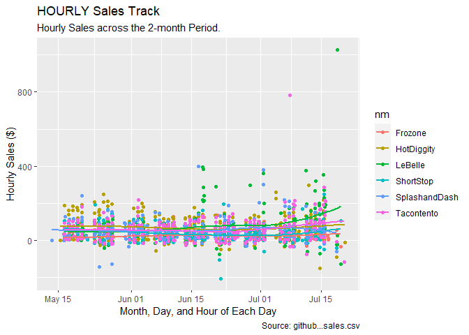
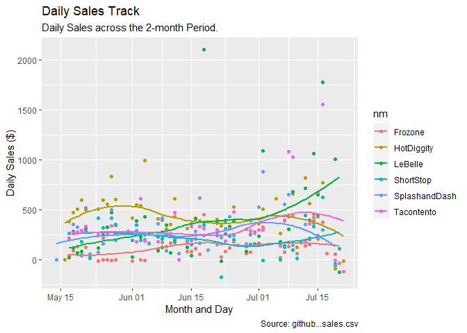
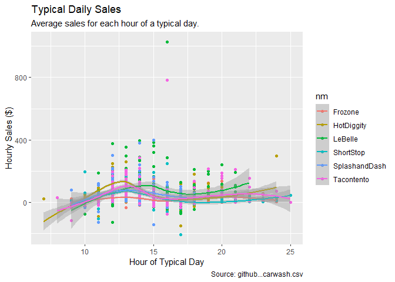
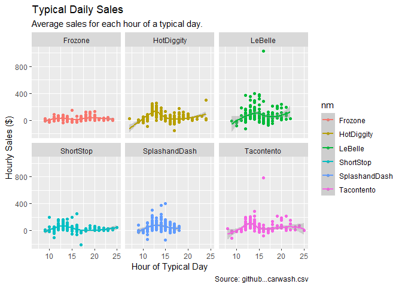

---
title: "10 Case Study :  It's About Time"
author: "TomHollinberger"
date: "10/28/2020"
output: 
 html_document: 
   keep_md: yes
   code_folding:  hide
   toc: TRUE
   toc_depth: 6
---  
THIS RSCRIPT USES ROXYGEN CHARACTERS.  
YOU CAN PRESS ctrl+shift+K AND GO STRAIGHT TO A HTML.  
SKIPS THE HANDWORK OF CREATING A RMD, AFTER THE ORIGINAL WORK IS NONE IN A RSCRIPT.
sample filepath E:/000 DTS 350 Data Visualization/DTS350-hollinbergert/DTS350TemplateMaster/Week_10/Class_Task_18/data.xlsx


```r
library(tidyverse)
```

```
## -- Attaching packages --------------------------------------------------------------------------------------- tidyverse 1.3.0 --
```

```
## v ggplot2 3.3.2     v purrr   0.3.4
## v tibble  3.0.3     v dplyr   1.0.0
## v tidyr   1.1.0     v stringr 1.4.0
## v readr   1.3.1     v forcats 0.5.0
```

```
## -- Conflicts ------------------------------------------------------------------------------------------ tidyverse_conflicts() --
## x dplyr::filter() masks stats::filter()
## x dplyr::lag()    masks stats::lag()
```

```r
library(dplyr)
library(lubridate)
```

```
## 
## Attaching package: 'lubridate'
```

```
## The following objects are masked from 'package:base':
## 
##     date, intersect, setdiff, union
```

```r
library(ggplot2)
```

Check working directory
getwd() #"C:/Users/tomho/Documents"
already set by github   setwd("E:/000 DTS 350 Data Visualization/DTS350-hollinbergert/DTS350TemplateMaster/Week_10/analysis")


```r
getwd()
```

```
## [1] "E:/000 DTS 350 Data Visualization/DTS350-hollinbergert/DTS350TemplateMaster/Week_10/analysis"
```

Download the csv  go to github and copy the link and paste here...once, then # it out


```r
#download.file("https://github.com/WJC-Data-Science/DTS350/raw/master/sales.csv", "sala.csv", mode = "wb")
```

Open csv in excel and filter each row to see what the column contents are (missing data = 99 for example, etc) .
Also look for opening lines to skip, comment flags, column names (header row), etc 
name	type	time	amount
Now we use the read_csv function to load the data.


```r
sal <- read_csv("sala.csv")
```

```
## Parsed with column specification:
## cols(
##   Name = col_character(),
##   Type = col_character(),
##   Time = col_datetime(format = ""),
##   Amount = col_double()
## )
```

```r
sal    #looks good, all columns came over.
```

```
## # A tibble: 15,656 x 4
##    Name       Type           Time                Amount
##    <chr>      <chr>          <dttm>               <dbl>
##  1 Tacontento Food(prepared) 2016-05-16 19:01:00    3  
##  2 Tacontento Food(prepared) 2016-05-16 19:01:00    1.5
##  3 Tacontento Food(prepared) 2016-05-16 19:04:00    3  
##  4 Tacontento Food(prepared) 2016-05-16 19:04:00    3  
##  5 Tacontento Food(prepared) 2016-05-16 19:04:00    1.5
##  6 Tacontento Food(prepared) 2016-05-16 19:04:00    1  
##  7 Tacontento Food(prepared) 2016-05-16 19:07:00    3  
##  8 Tacontento Food(prepared) 2016-05-16 19:07:00    3  
##  9 Tacontento Food(prepared) 2016-05-16 19:07:00    1.5
## 10 Tacontento Food(prepared) 2016-05-16 19:07:00    3  
## # ... with 15,646 more rows
```

Columns are Upper/Lower Case.  cols(Name = col_character(), Type = col_character(), Time = col_datetime(format = ""), Amount = col_double()


```r
sala <- sal
#Do unique() for character variables to see what we are dealing with:
unique(sala$Name)
```

```
## [1] "Tacontento"    "SplashandDash" "ShortStop"     "LeBelle"      
## [5] "HotDiggity"    "Frozone"       "Missing"
```

```r
#"Tacontento"    "SplashandDash" "ShortStop"     "LeBelle"       "HotDiggity"    "Frozone"       "Missing"    
unique(sala$Type)
```

```
## [1] "Food(prepared)"     "Services"           "Food(pre-packaged)"
## [4] "Goods"              "Missing"
```

```r
#"Food(prepared)"     "Services"           "Food(pre-packaged)" "Goods"              "Missing"   

#Do Summary of numeric adn date variables to see extent:
summary(sala$Time)
```

```
##                  Min.               1st Qu.                Median 
## "2016-04-20 19:01:00" "2016-05-31 19:46:00" "2016-06-15 17:16:00" 
##                  Mean               3rd Qu.                  Max. 
## "2016-06-16 05:58:39" "2016-07-02 00:30:00" "2016-07-20 15:53:00"
```

```r
#Min = "2016-04-20 19:01:00",  Max = "2016-07-20 15:53:00"   According to the Problem Stmt, these are MTN time zone.

summary(sala$Amount)
```

```
##     Min.  1st Qu.   Median     Mean  3rd Qu.     Max. 
## -194.500    2.500    3.000    5.294    4.500 1026.000
```

```r
#    Min.  1st Qu.   Median     Mean  3rd Qu.     Max. 
```

```r
#MISSING DATA or OUTLIERS-- 
#View(sala)  #use this code line then # it out, filter for "Missing" in Name and/or Type columns 
#Note the bottom of the View windows says there are 15,656 total entries.
#Results:
#1Missing	Missing	2016-06-17 21:12:00	150.00
#2Missing	Missing	2016-04-20 19:01:00	-3.07
sala  #15,656 rows
```

```
## # A tibble: 15,656 x 4
##    Name       Type           Time                Amount
##    <chr>      <chr>          <dttm>               <dbl>
##  1 Tacontento Food(prepared) 2016-05-16 19:01:00    3  
##  2 Tacontento Food(prepared) 2016-05-16 19:01:00    1.5
##  3 Tacontento Food(prepared) 2016-05-16 19:04:00    3  
##  4 Tacontento Food(prepared) 2016-05-16 19:04:00    3  
##  5 Tacontento Food(prepared) 2016-05-16 19:04:00    1.5
##  6 Tacontento Food(prepared) 2016-05-16 19:04:00    1  
##  7 Tacontento Food(prepared) 2016-05-16 19:07:00    3  
##  8 Tacontento Food(prepared) 2016-05-16 19:07:00    3  
##  9 Tacontento Food(prepared) 2016-05-16 19:07:00    1.5
## 10 Tacontento Food(prepared) 2016-05-16 19:07:00    3  
## # ... with 15,646 more rows
```

```r
salb <- filter(sala, Name != "Missing")
salb   #15,654 rows, thus removed the 2 Missing Datas
```

```
## # A tibble: 15,654 x 4
##    Name       Type           Time                Amount
##    <chr>      <chr>          <dttm>               <dbl>
##  1 Tacontento Food(prepared) 2016-05-16 19:01:00    3  
##  2 Tacontento Food(prepared) 2016-05-16 19:01:00    1.5
##  3 Tacontento Food(prepared) 2016-05-16 19:04:00    3  
##  4 Tacontento Food(prepared) 2016-05-16 19:04:00    3  
##  5 Tacontento Food(prepared) 2016-05-16 19:04:00    1.5
##  6 Tacontento Food(prepared) 2016-05-16 19:04:00    1  
##  7 Tacontento Food(prepared) 2016-05-16 19:07:00    3  
##  8 Tacontento Food(prepared) 2016-05-16 19:07:00    3  
##  9 Tacontento Food(prepared) 2016-05-16 19:07:00    1.5
## 10 Tacontento Food(prepared) 2016-05-16 19:07:00    3  
## # ... with 15,644 more rows
```

```r
# Also a comeback from first preliminary plot1, which showed an outlier due to an extremely early date:
#find it using View's filter
# HotDiggity	Food(prepared)	2016-04-20 19:01:00	-87.67
salb  #15,654 rows 
```

```
## # A tibble: 15,654 x 4
##    Name       Type           Time                Amount
##    <chr>      <chr>          <dttm>               <dbl>
##  1 Tacontento Food(prepared) 2016-05-16 19:01:00    3  
##  2 Tacontento Food(prepared) 2016-05-16 19:01:00    1.5
##  3 Tacontento Food(prepared) 2016-05-16 19:04:00    3  
##  4 Tacontento Food(prepared) 2016-05-16 19:04:00    3  
##  5 Tacontento Food(prepared) 2016-05-16 19:04:00    1.5
##  6 Tacontento Food(prepared) 2016-05-16 19:04:00    1  
##  7 Tacontento Food(prepared) 2016-05-16 19:07:00    3  
##  8 Tacontento Food(prepared) 2016-05-16 19:07:00    3  
##  9 Tacontento Food(prepared) 2016-05-16 19:07:00    1.5
## 10 Tacontento Food(prepared) 2016-05-16 19:07:00    3  
## # ... with 15,644 more rows
```

```r
salc <- filter(salb, Amount != -87.67)   #couldn't get it to filter on Time == "2016-04-20 19:01:00"
salc  #15,653, thus removed the 1 outlier early date.
```

```
## # A tibble: 15,653 x 4
##    Name       Type           Time                Amount
##    <chr>      <chr>          <dttm>               <dbl>
##  1 Tacontento Food(prepared) 2016-05-16 19:01:00    3  
##  2 Tacontento Food(prepared) 2016-05-16 19:01:00    1.5
##  3 Tacontento Food(prepared) 2016-05-16 19:04:00    3  
##  4 Tacontento Food(prepared) 2016-05-16 19:04:00    3  
##  5 Tacontento Food(prepared) 2016-05-16 19:04:00    1.5
##  6 Tacontento Food(prepared) 2016-05-16 19:04:00    1  
##  7 Tacontento Food(prepared) 2016-05-16 19:07:00    3  
##  8 Tacontento Food(prepared) 2016-05-16 19:07:00    3  
##  9 Tacontento Food(prepared) 2016-05-16 19:07:00    1.5
## 10 Tacontento Food(prepared) 2016-05-16 19:07:00    3  
## # ... with 15,643 more rows
```

```r
#THis is a long-form datafram.  Similar to:
#View(economics_long)

#Rename variables for ease of typing
sald <- salc %>%
rename(nm = Name, ty = Type, time = Time, amount = Amount)
sald
```

```
## # A tibble: 15,653 x 4
##    nm         ty             time                amount
##    <chr>      <chr>          <dttm>               <dbl>
##  1 Tacontento Food(prepared) 2016-05-16 19:01:00    3  
##  2 Tacontento Food(prepared) 2016-05-16 19:01:00    1.5
##  3 Tacontento Food(prepared) 2016-05-16 19:04:00    3  
##  4 Tacontento Food(prepared) 2016-05-16 19:04:00    3  
##  5 Tacontento Food(prepared) 2016-05-16 19:04:00    1.5
##  6 Tacontento Food(prepared) 2016-05-16 19:04:00    1  
##  7 Tacontento Food(prepared) 2016-05-16 19:07:00    3  
##  8 Tacontento Food(prepared) 2016-05-16 19:07:00    3  
##  9 Tacontento Food(prepared) 2016-05-16 19:07:00    1.5
## 10 Tacontento Food(prepared) 2016-05-16 19:07:00    3  
## # ... with 15,643 more rows
```

Assume the incoming data is in UTC.  It doesn't say so, but is UTC by default.  Convert the times from UTC time to mountain time using the right function out of library(lubridate).


```r
list(OlsonNames())  #see all 600 entries.  Choose "America/Denver" to represent Mountain tz
```

```
## [[1]]
##   [1] "Africa/Abidjan"                   "Africa/Accra"                    
##   [3] "Africa/Addis_Ababa"               "Africa/Algiers"                  
##   [5] "Africa/Asmara"                    "Africa/Asmera"                   
##   [7] "Africa/Bamako"                    "Africa/Bangui"                   
##   [9] "Africa/Banjul"                    "Africa/Bissau"                   
##  [11] "Africa/Blantyre"                  "Africa/Brazzaville"              
##  [13] "Africa/Bujumbura"                 "Africa/Cairo"                    
##  [15] "Africa/Casablanca"                "Africa/Ceuta"                    
##  [17] "Africa/Conakry"                   "Africa/Dakar"                    
##  [19] "Africa/Dar_es_Salaam"             "Africa/Djibouti"                 
##  [21] "Africa/Douala"                    "Africa/El_Aaiun"                 
##  [23] "Africa/Freetown"                  "Africa/Gaborone"                 
##  [25] "Africa/Harare"                    "Africa/Johannesburg"             
##  [27] "Africa/Juba"                      "Africa/Kampala"                  
##  [29] "Africa/Khartoum"                  "Africa/Kigali"                   
##  [31] "Africa/Kinshasa"                  "Africa/Lagos"                    
##  [33] "Africa/Libreville"                "Africa/Lome"                     
##  [35] "Africa/Luanda"                    "Africa/Lubumbashi"               
##  [37] "Africa/Lusaka"                    "Africa/Malabo"                   
##  [39] "Africa/Maputo"                    "Africa/Maseru"                   
##  [41] "Africa/Mbabane"                   "Africa/Mogadishu"                
##  [43] "Africa/Monrovia"                  "Africa/Nairobi"                  
##  [45] "Africa/Ndjamena"                  "Africa/Niamey"                   
##  [47] "Africa/Nouakchott"                "Africa/Ouagadougou"              
##  [49] "Africa/Porto-Novo"                "Africa/Sao_Tome"                 
##  [51] "Africa/Timbuktu"                  "Africa/Tripoli"                  
##  [53] "Africa/Tunis"                     "Africa/Windhoek"                 
##  [55] "America/Adak"                     "America/Anchorage"               
##  [57] "America/Anguilla"                 "America/Antigua"                 
##  [59] "America/Araguaina"                "America/Argentina/Buenos_Aires"  
##  [61] "America/Argentina/Catamarca"      "America/Argentina/ComodRivadavia"
##  [63] "America/Argentina/Cordoba"        "America/Argentina/Jujuy"         
##  [65] "America/Argentina/La_Rioja"       "America/Argentina/Mendoza"       
##  [67] "America/Argentina/Rio_Gallegos"   "America/Argentina/Salta"         
##  [69] "America/Argentina/San_Juan"       "America/Argentina/San_Luis"      
##  [71] "America/Argentina/Tucuman"        "America/Argentina/Ushuaia"       
##  [73] "America/Aruba"                    "America/Asuncion"                
##  [75] "America/Atikokan"                 "America/Atka"                    
##  [77] "America/Bahia"                    "America/Bahia_Banderas"          
##  [79] "America/Barbados"                 "America/Belem"                   
##  [81] "America/Belize"                   "America/Blanc-Sablon"            
##  [83] "America/Boa_Vista"                "America/Bogota"                  
##  [85] "America/Boise"                    "America/Buenos_Aires"            
##  [87] "America/Cambridge_Bay"            "America/Campo_Grande"            
##  [89] "America/Cancun"                   "America/Caracas"                 
##  [91] "America/Catamarca"                "America/Cayenne"                 
##  [93] "America/Cayman"                   "America/Chicago"                 
##  [95] "America/Chihuahua"                "America/Coral_Harbour"           
##  [97] "America/Cordoba"                  "America/Costa_Rica"              
##  [99] "America/Creston"                  "America/Cuiaba"                  
## [101] "America/Curacao"                  "America/Danmarkshavn"            
## [103] "America/Dawson"                   "America/Dawson_Creek"            
## [105] "America/Denver"                   "America/Detroit"                 
## [107] "America/Dominica"                 "America/Edmonton"                
## [109] "America/Eirunepe"                 "America/El_Salvador"             
## [111] "America/Ensenada"                 "America/Fort_Nelson"             
## [113] "America/Fort_Wayne"               "America/Fortaleza"               
## [115] "America/Glace_Bay"                "America/Godthab"                 
## [117] "America/Goose_Bay"                "America/Grand_Turk"              
## [119] "America/Grenada"                  "America/Guadeloupe"              
## [121] "America/Guatemala"                "America/Guayaquil"               
## [123] "America/Guyana"                   "America/Halifax"                 
## [125] "America/Havana"                   "America/Hermosillo"              
## [127] "America/Indiana/Indianapolis"     "America/Indiana/Knox"            
## [129] "America/Indiana/Marengo"          "America/Indiana/Petersburg"      
## [131] "America/Indiana/Tell_City"        "America/Indiana/Vevay"           
## [133] "America/Indiana/Vincennes"        "America/Indiana/Winamac"         
## [135] "America/Indianapolis"             "America/Inuvik"                  
## [137] "America/Iqaluit"                  "America/Jamaica"                 
## [139] "America/Jujuy"                    "America/Juneau"                  
## [141] "America/Kentucky/Louisville"      "America/Kentucky/Monticello"     
## [143] "America/Knox_IN"                  "America/Kralendijk"              
## [145] "America/La_Paz"                   "America/Lima"                    
## [147] "America/Los_Angeles"              "America/Louisville"              
## [149] "America/Lower_Princes"            "America/Maceio"                  
## [151] "America/Managua"                  "America/Manaus"                  
## [153] "America/Marigot"                  "America/Martinique"              
## [155] "America/Matamoros"                "America/Mazatlan"                
## [157] "America/Mendoza"                  "America/Menominee"               
## [159] "America/Merida"                   "America/Metlakatla"              
## [161] "America/Mexico_City"              "America/Miquelon"                
## [163] "America/Moncton"                  "America/Monterrey"               
## [165] "America/Montevideo"               "America/Montreal"                
## [167] "America/Montserrat"               "America/Nassau"                  
## [169] "America/New_York"                 "America/Nipigon"                 
## [171] "America/Nome"                     "America/Noronha"                 
## [173] "America/North_Dakota/Beulah"      "America/North_Dakota/Center"     
## [175] "America/North_Dakota/New_Salem"   "America/Nuuk"                    
## [177] "America/Ojinaga"                  "America/Panama"                  
## [179] "America/Pangnirtung"              "America/Paramaribo"              
## [181] "America/Phoenix"                  "America/Port-au-Prince"          
## [183] "America/Port_of_Spain"            "America/Porto_Acre"              
## [185] "America/Porto_Velho"              "America/Puerto_Rico"             
## [187] "America/Punta_Arenas"             "America/Rainy_River"             
## [189] "America/Rankin_Inlet"             "America/Recife"                  
## [191] "America/Regina"                   "America/Resolute"                
## [193] "America/Rio_Branco"               "America/Rosario"                 
## [195] "America/Santa_Isabel"             "America/Santarem"                
## [197] "America/Santiago"                 "America/Santo_Domingo"           
## [199] "America/Sao_Paulo"                "America/Scoresbysund"            
## [201] "America/Shiprock"                 "America/Sitka"                   
## [203] "America/St_Barthelemy"            "America/St_Johns"                
## [205] "America/St_Kitts"                 "America/St_Lucia"                
## [207] "America/St_Thomas"                "America/St_Vincent"              
## [209] "America/Swift_Current"            "America/Tegucigalpa"             
## [211] "America/Thule"                    "America/Thunder_Bay"             
## [213] "America/Tijuana"                  "America/Toronto"                 
## [215] "America/Tortola"                  "America/Vancouver"               
## [217] "America/Virgin"                   "America/Whitehorse"              
## [219] "America/Winnipeg"                 "America/Yakutat"                 
## [221] "America/Yellowknife"              "Antarctica/Casey"                
## [223] "Antarctica/Davis"                 "Antarctica/DumontDUrville"       
## [225] "Antarctica/Macquarie"             "Antarctica/Mawson"               
## [227] "Antarctica/McMurdo"               "Antarctica/Palmer"               
## [229] "Antarctica/Rothera"               "Antarctica/South_Pole"           
## [231] "Antarctica/Syowa"                 "Antarctica/Troll"                
## [233] "Antarctica/Vostok"                "Arctic/Longyearbyen"             
## [235] "Asia/Aden"                        "Asia/Almaty"                     
## [237] "Asia/Amman"                       "Asia/Anadyr"                     
## [239] "Asia/Aqtau"                       "Asia/Aqtobe"                     
## [241] "Asia/Ashgabat"                    "Asia/Ashkhabad"                  
## [243] "Asia/Atyrau"                      "Asia/Baghdad"                    
## [245] "Asia/Bahrain"                     "Asia/Baku"                       
## [247] "Asia/Bangkok"                     "Asia/Barnaul"                    
## [249] "Asia/Beirut"                      "Asia/Bishkek"                    
## [251] "Asia/Brunei"                      "Asia/Calcutta"                   
## [253] "Asia/Chita"                       "Asia/Choibalsan"                 
## [255] "Asia/Chongqing"                   "Asia/Chungking"                  
## [257] "Asia/Colombo"                     "Asia/Dacca"                      
## [259] "Asia/Damascus"                    "Asia/Dhaka"                      
## [261] "Asia/Dili"                        "Asia/Dubai"                      
## [263] "Asia/Dushanbe"                    "Asia/Famagusta"                  
## [265] "Asia/Gaza"                        "Asia/Harbin"                     
## [267] "Asia/Hebron"                      "Asia/Ho_Chi_Minh"                
## [269] "Asia/Hong_Kong"                   "Asia/Hovd"                       
## [271] "Asia/Irkutsk"                     "Asia/Istanbul"                   
## [273] "Asia/Jakarta"                     "Asia/Jayapura"                   
## [275] "Asia/Jerusalem"                   "Asia/Kabul"                      
## [277] "Asia/Kamchatka"                   "Asia/Karachi"                    
## [279] "Asia/Kashgar"                     "Asia/Kathmandu"                  
## [281] "Asia/Katmandu"                    "Asia/Khandyga"                   
## [283] "Asia/Kolkata"                     "Asia/Krasnoyarsk"                
## [285] "Asia/Kuala_Lumpur"                "Asia/Kuching"                    
## [287] "Asia/Kuwait"                      "Asia/Macao"                      
## [289] "Asia/Macau"                       "Asia/Magadan"                    
## [291] "Asia/Makassar"                    "Asia/Manila"                     
## [293] "Asia/Muscat"                      "Asia/Nicosia"                    
## [295] "Asia/Novokuznetsk"                "Asia/Novosibirsk"                
## [297] "Asia/Omsk"                        "Asia/Oral"                       
## [299] "Asia/Phnom_Penh"                  "Asia/Pontianak"                  
## [301] "Asia/Pyongyang"                   "Asia/Qatar"                      
## [303] "Asia/Qostanay"                    "Asia/Qyzylorda"                  
## [305] "Asia/Rangoon"                     "Asia/Riyadh"                     
## [307] "Asia/Saigon"                      "Asia/Sakhalin"                   
## [309] "Asia/Samarkand"                   "Asia/Seoul"                      
## [311] "Asia/Shanghai"                    "Asia/Singapore"                  
## [313] "Asia/Srednekolymsk"               "Asia/Taipei"                     
## [315] "Asia/Tashkent"                    "Asia/Tbilisi"                    
## [317] "Asia/Tehran"                      "Asia/Tel_Aviv"                   
## [319] "Asia/Thimbu"                      "Asia/Thimphu"                    
## [321] "Asia/Tokyo"                       "Asia/Tomsk"                      
## [323] "Asia/Ujung_Pandang"               "Asia/Ulaanbaatar"                
## [325] "Asia/Ulan_Bator"                  "Asia/Urumqi"                     
## [327] "Asia/Ust-Nera"                    "Asia/Vientiane"                  
## [329] "Asia/Vladivostok"                 "Asia/Yakutsk"                    
## [331] "Asia/Yangon"                      "Asia/Yekaterinburg"              
## [333] "Asia/Yerevan"                     "Atlantic/Azores"                 
## [335] "Atlantic/Bermuda"                 "Atlantic/Canary"                 
## [337] "Atlantic/Cape_Verde"              "Atlantic/Faeroe"                 
## [339] "Atlantic/Faroe"                   "Atlantic/Jan_Mayen"              
## [341] "Atlantic/Madeira"                 "Atlantic/Reykjavik"              
## [343] "Atlantic/South_Georgia"           "Atlantic/St_Helena"              
## [345] "Atlantic/Stanley"                 "Australia/ACT"                   
## [347] "Australia/Adelaide"               "Australia/Brisbane"              
## [349] "Australia/Broken_Hill"            "Australia/Canberra"              
## [351] "Australia/Currie"                 "Australia/Darwin"                
## [353] "Australia/Eucla"                  "Australia/Hobart"                
## [355] "Australia/LHI"                    "Australia/Lindeman"              
## [357] "Australia/Lord_Howe"              "Australia/Melbourne"             
## [359] "Australia/North"                  "Australia/NSW"                   
## [361] "Australia/Perth"                  "Australia/Queensland"            
## [363] "Australia/South"                  "Australia/Sydney"                
## [365] "Australia/Tasmania"               "Australia/Victoria"              
## [367] "Australia/West"                   "Australia/Yancowinna"            
## [369] "Brazil/Acre"                      "Brazil/DeNoronha"                
## [371] "Brazil/East"                      "Brazil/West"                     
## [373] "Canada/Atlantic"                  "Canada/Central"                  
## [375] "Canada/Eastern"                   "Canada/Mountain"                 
## [377] "Canada/Newfoundland"              "Canada/Pacific"                  
## [379] "Canada/Saskatchewan"              "Canada/Yukon"                    
## [381] "CET"                              "Chile/Continental"               
## [383] "Chile/EasterIsland"               "CST6CDT"                         
## [385] "Cuba"                             "EET"                             
## [387] "Egypt"                            "Eire"                            
## [389] "EST"                              "EST5EDT"                         
## [391] "Etc/GMT"                          "Etc/GMT-0"                       
## [393] "Etc/GMT-1"                        "Etc/GMT-10"                      
## [395] "Etc/GMT-11"                       "Etc/GMT-12"                      
## [397] "Etc/GMT-13"                       "Etc/GMT-14"                      
## [399] "Etc/GMT-2"                        "Etc/GMT-3"                       
## [401] "Etc/GMT-4"                        "Etc/GMT-5"                       
## [403] "Etc/GMT-6"                        "Etc/GMT-7"                       
## [405] "Etc/GMT-8"                        "Etc/GMT-9"                       
## [407] "Etc/GMT+0"                        "Etc/GMT+1"                       
## [409] "Etc/GMT+10"                       "Etc/GMT+11"                      
## [411] "Etc/GMT+12"                       "Etc/GMT+2"                       
## [413] "Etc/GMT+3"                        "Etc/GMT+4"                       
## [415] "Etc/GMT+5"                        "Etc/GMT+6"                       
## [417] "Etc/GMT+7"                        "Etc/GMT+8"                       
## [419] "Etc/GMT+9"                        "Etc/GMT0"                        
## [421] "Etc/Greenwich"                    "Etc/UCT"                         
## [423] "Etc/Universal"                    "Etc/UTC"                         
## [425] "Etc/Zulu"                         "Europe/Amsterdam"                
## [427] "Europe/Andorra"                   "Europe/Astrakhan"                
## [429] "Europe/Athens"                    "Europe/Belfast"                  
## [431] "Europe/Belgrade"                  "Europe/Berlin"                   
## [433] "Europe/Bratislava"                "Europe/Brussels"                 
## [435] "Europe/Bucharest"                 "Europe/Budapest"                 
## [437] "Europe/Busingen"                  "Europe/Chisinau"                 
## [439] "Europe/Copenhagen"                "Europe/Dublin"                   
## [441] "Europe/Gibraltar"                 "Europe/Guernsey"                 
## [443] "Europe/Helsinki"                  "Europe/Isle_of_Man"              
## [445] "Europe/Istanbul"                  "Europe/Jersey"                   
## [447] "Europe/Kaliningrad"               "Europe/Kiev"                     
## [449] "Europe/Kirov"                     "Europe/Lisbon"                   
## [451] "Europe/Ljubljana"                 "Europe/London"                   
## [453] "Europe/Luxembourg"                "Europe/Madrid"                   
## [455] "Europe/Malta"                     "Europe/Mariehamn"                
## [457] "Europe/Minsk"                     "Europe/Monaco"                   
## [459] "Europe/Moscow"                    "Europe/Nicosia"                  
## [461] "Europe/Oslo"                      "Europe/Paris"                    
## [463] "Europe/Podgorica"                 "Europe/Prague"                   
## [465] "Europe/Riga"                      "Europe/Rome"                     
## [467] "Europe/Samara"                    "Europe/San_Marino"               
## [469] "Europe/Sarajevo"                  "Europe/Saratov"                  
## [471] "Europe/Simferopol"                "Europe/Skopje"                   
## [473] "Europe/Sofia"                     "Europe/Stockholm"                
## [475] "Europe/Tallinn"                   "Europe/Tirane"                   
## [477] "Europe/Tiraspol"                  "Europe/Ulyanovsk"                
## [479] "Europe/Uzhgorod"                  "Europe/Vaduz"                    
## [481] "Europe/Vatican"                   "Europe/Vienna"                   
## [483] "Europe/Vilnius"                   "Europe/Volgograd"                
## [485] "Europe/Warsaw"                    "Europe/Zagreb"                   
## [487] "Europe/Zaporozhye"                "Europe/Zurich"                   
## [489] "GB"                               "GB-Eire"                         
## [491] "GMT"                              "GMT-0"                           
## [493] "GMT+0"                            "GMT0"                            
## [495] "Greenwich"                        "Hongkong"                        
## [497] "HST"                              "Iceland"                         
## [499] "Indian/Antananarivo"              "Indian/Chagos"                   
## [501] "Indian/Christmas"                 "Indian/Cocos"                    
## [503] "Indian/Comoro"                    "Indian/Kerguelen"                
## [505] "Indian/Mahe"                      "Indian/Maldives"                 
## [507] "Indian/Mauritius"                 "Indian/Mayotte"                  
## [509] "Indian/Reunion"                   "Iran"                            
## [511] "Israel"                           "Jamaica"                         
## [513] "Japan"                            "Kwajalein"                       
## [515] "Libya"                            "MET"                             
## [517] "Mexico/BajaNorte"                 "Mexico/BajaSur"                  
## [519] "Mexico/General"                   "MST"                             
## [521] "MST7MDT"                          "Navajo"                          
## [523] "NZ"                               "NZ-CHAT"                         
## [525] "Pacific/Apia"                     "Pacific/Auckland"                
## [527] "Pacific/Bougainville"             "Pacific/Chatham"                 
## [529] "Pacific/Chuuk"                    "Pacific/Easter"                  
## [531] "Pacific/Efate"                    "Pacific/Enderbury"               
## [533] "Pacific/Fakaofo"                  "Pacific/Fiji"                    
## [535] "Pacific/Funafuti"                 "Pacific/Galapagos"               
## [537] "Pacific/Gambier"                  "Pacific/Guadalcanal"             
## [539] "Pacific/Guam"                     "Pacific/Honolulu"                
## [541] "Pacific/Johnston"                 "Pacific/Kiritimati"              
## [543] "Pacific/Kosrae"                   "Pacific/Kwajalein"               
## [545] "Pacific/Majuro"                   "Pacific/Marquesas"               
## [547] "Pacific/Midway"                   "Pacific/Nauru"                   
## [549] "Pacific/Niue"                     "Pacific/Norfolk"                 
## [551] "Pacific/Noumea"                   "Pacific/Pago_Pago"               
## [553] "Pacific/Palau"                    "Pacific/Pitcairn"                
## [555] "Pacific/Pohnpei"                  "Pacific/Ponape"                  
## [557] "Pacific/Port_Moresby"             "Pacific/Rarotonga"               
## [559] "Pacific/Saipan"                   "Pacific/Samoa"                   
## [561] "Pacific/Tahiti"                   "Pacific/Tarawa"                  
## [563] "Pacific/Tongatapu"                "Pacific/Truk"                    
## [565] "Pacific/Wake"                     "Pacific/Wallis"                  
## [567] "Pacific/Yap"                      "Poland"                          
## [569] "Portugal"                         "PRC"                             
## [571] "PST8PDT"                          "ROC"                             
## [573] "ROK"                              "Singapore"                       
## [575] "Turkey"                           "UCT"                             
## [577] "Universal"                        "US/Alaska"                       
## [579] "US/Aleutian"                      "US/Arizona"                      
## [581] "US/Central"                       "US/East-Indiana"                 
## [583] "US/Eastern"                       "US/Hawaii"                       
## [585] "US/Indiana-Starke"                "US/Michigan"                     
## [587] "US/Mountain"                      "US/Pacific"                      
## [589] "US/Pacific-New"                   "US/Samoa"                        
## [591] "UTC"                              "W-SU"                            
## [593] "WET"                              "Zulu"                            
## attr(,"Version")
## [1] "2020a"
```

```r
sale <- sald
sale$time <- ymd_hms(sale$time, tz = "UTC") 
sale$timemtn <- with_tz(sale$time, tz = "America/Denver")  
sale   #now has Mountain time column
```

```
## # A tibble: 15,653 x 5
##    nm         ty             time                amount timemtn            
##    <chr>      <chr>          <dttm>               <dbl> <dttm>             
##  1 Tacontento Food(prepared) 2016-05-16 19:01:00    3   2016-05-16 13:01:00
##  2 Tacontento Food(prepared) 2016-05-16 19:01:00    1.5 2016-05-16 13:01:00
##  3 Tacontento Food(prepared) 2016-05-16 19:04:00    3   2016-05-16 13:04:00
##  4 Tacontento Food(prepared) 2016-05-16 19:04:00    3   2016-05-16 13:04:00
##  5 Tacontento Food(prepared) 2016-05-16 19:04:00    1.5 2016-05-16 13:04:00
##  6 Tacontento Food(prepared) 2016-05-16 19:04:00    1   2016-05-16 13:04:00
##  7 Tacontento Food(prepared) 2016-05-16 19:07:00    3   2016-05-16 13:07:00
##  8 Tacontento Food(prepared) 2016-05-16 19:07:00    3   2016-05-16 13:07:00
##  9 Tacontento Food(prepared) 2016-05-16 19:07:00    1.5 2016-05-16 13:07:00
## 10 Tacontento Food(prepared) 2016-05-16 19:07:00    3   2016-05-16 13:07:00
## # ... with 15,643 more rows
```

```r
# Also a comeback from third preliminary plot (hourly, faceted), which showed approximately 10 MIDNIGHT (MTN TZ) outliers:
#find it using View's filter


#salf <- sale
#salf$hronly <- hour(salf$timemtn) 
#salf   #15,653 rows
#salg <- filter(salf, (hronly != 0))   
#salg   #15,646 rows, thus removed the 7 outlier MIDHIGHT MTN TZ.

#View(salg)

#salh <- salg
#salh   #15,646 rows
#sali <- filter(salh, hour(timemtn) > 3)   
#sali   #still 15,646 rows, thus DID NOT removed the 3 outliers assume dto be at 1AM MTNTIME.
```

Create a new hourly grouping variable using ceiling_date() from library(lubridate).  


```r
salj <- sale
salj$timemtnhr <- ceiling_date(salj$timemtn, "hour")
salj
```

```
## # A tibble: 15,653 x 6
##    nm    ty    time                amount timemtn            
##    <chr> <chr> <dttm>               <dbl> <dttm>             
##  1 Taco~ Food~ 2016-05-16 19:01:00    3   2016-05-16 13:01:00
##  2 Taco~ Food~ 2016-05-16 19:01:00    1.5 2016-05-16 13:01:00
##  3 Taco~ Food~ 2016-05-16 19:04:00    3   2016-05-16 13:04:00
##  4 Taco~ Food~ 2016-05-16 19:04:00    3   2016-05-16 13:04:00
##  5 Taco~ Food~ 2016-05-16 19:04:00    1.5 2016-05-16 13:04:00
##  6 Taco~ Food~ 2016-05-16 19:04:00    1   2016-05-16 13:04:00
##  7 Taco~ Food~ 2016-05-16 19:07:00    3   2016-05-16 13:07:00
##  8 Taco~ Food~ 2016-05-16 19:07:00    3   2016-05-16 13:07:00
##  9 Taco~ Food~ 2016-05-16 19:07:00    1.5 2016-05-16 13:07:00
## 10 Taco~ Food~ 2016-05-16 19:07:00    3   2016-05-16 13:07:00
## # ... with 15,643 more rows, and 1 more variable: timemtnhr <dttm>
```

Create a new daily grouping variable using ceiling_date() from library(lubridate).  


```r
salk <- salj
salk$timemtnday <- ceiling_date(salk$timemtn, "day")
salk
```

```
## # A tibble: 15,653 x 7
##    nm    ty    time                amount timemtn            
##    <chr> <chr> <dttm>               <dbl> <dttm>             
##  1 Taco~ Food~ 2016-05-16 19:01:00    3   2016-05-16 13:01:00
##  2 Taco~ Food~ 2016-05-16 19:01:00    1.5 2016-05-16 13:01:00
##  3 Taco~ Food~ 2016-05-16 19:04:00    3   2016-05-16 13:04:00
##  4 Taco~ Food~ 2016-05-16 19:04:00    3   2016-05-16 13:04:00
##  5 Taco~ Food~ 2016-05-16 19:04:00    1.5 2016-05-16 13:04:00
##  6 Taco~ Food~ 2016-05-16 19:04:00    1   2016-05-16 13:04:00
##  7 Taco~ Food~ 2016-05-16 19:07:00    3   2016-05-16 13:07:00
##  8 Taco~ Food~ 2016-05-16 19:07:00    3   2016-05-16 13:07:00
##  9 Taco~ Food~ 2016-05-16 19:07:00    1.5 2016-05-16 13:07:00
## 10 Taco~ Food~ 2016-05-16 19:07:00    3   2016-05-16 13:07:00
## # ... with 15,643 more rows, and 2 more variables: timemtnhr <dttm>,
## #   timemtnday <dttm>
```

Aggregate the point of sale data into HOUR sales totals.  HOW TO AGGREGATE : NEED TO SUM the AMOUNT columns


```r
salhrly <- group_by(salk, nm, timemtnhr)
sumsalhrly <- summarise(salhrly, salphr = sum(amount, na.rm = TRUE))
```

```
## `summarise()` regrouping output by 'nm' (override with `.groups` argument)
```

```r
sumsalhrly  #It's here  use this to merge or join 
```

```
## # A tibble: 1,536 x 3
## # Groups:   nm [6]
##    nm      timemtnhr           salphr
##    <chr>   <dttm>               <dbl>
##  1 Frozone 2016-05-16 12:00:00   20  
##  2 Frozone 2016-05-16 13:00:00    1  
##  3 Frozone 2016-05-16 14:00:00   12  
##  4 Frozone 2016-05-16 15:00:00    7  
##  5 Frozone 2016-05-17 11:00:00   17  
##  6 Frozone 2016-05-17 12:00:00   17.5
##  7 Frozone 2016-05-17 13:00:00   20  
##  8 Frozone 2016-05-17 14:00:00   37.5
##  9 Frozone 2016-05-18 11:00:00   18.5
## 10 Frozone 2016-05-18 12:00:00   53  
## # ... with 1,526 more rows
```

Aggregate the point of sale data into DAILY sales totals.  HOW TO AGGREGATE : NEED TO SUM the AMOUNT columns


```r
saldaly <- group_by(salk, nm, timemtnday)
sumsaldaly <- summarise(saldaly, salpday = sum(amount, na.rm = TRUE))
```

```
## `summarise()` regrouping output by 'nm' (override with `.groups` argument)
```

```r
sumsaldaly  #It's here  use this to merge or join 
```

```
## # A tibble: 286 x 3
## # Groups:   nm [6]
##    nm      timemtnday          salpday
##    <chr>   <dttm>                <dbl>
##  1 Frozone 2016-05-17 00:00:00   40   
##  2 Frozone 2016-05-18 00:00:00   92   
##  3 Frozone 2016-05-19 00:00:00  128   
##  4 Frozone 2016-05-20 00:00:00   49.5 
##  5 Frozone 2016-05-21 00:00:00  126   
##  6 Frozone 2016-05-22 00:00:00   20   
##  7 Frozone 2016-05-24 00:00:00  -11.9 
##  8 Frozone 2016-05-25 00:00:00   -3.28
##  9 Frozone 2016-05-26 00:00:00   -2.36
## 10 Frozone 2016-05-27 00:00:00   -5.18
## # ... with 276 more rows
```

### PRELIM PLOT OF HOURLY SALES (hourly across the whole time period)


```r
ggplot(sumsalhrly, aes(timemtnhr, salphr, color = nm)) +
  geom_point() +
  geom_smooth(se = FALSE) +
labs(title = "HOURLY Sales Track", 
     subtitle = "Hourly Sales across the 2-month Period.",
     caption = "Source: github...sales.csv",
     x = "Month, Day, and Hour of Each Day",
     y = "Hourly Sales ($)")  
```

```
## `geom_smooth()` using method = 'loess' and formula 'y ~ x'
```

<!-- -->

```r
# There appears/appeared to be one outlying date (in early May), go back to View to filter and it.  Then filter out this outlier.
# Other extremely high or low dollar amopunts are not considered outliers at this point.
ggsave("HourlySales.jpeg")
```

```
## Saving 7 x 5 in image
## `geom_smooth()` using method = 'loess' and formula 'y ~ x'
```

### **FINAL PLOT** OF DAILY SALES (daily across the whole time period)


```r
ggplot(sumsaldaly, aes(timemtnday, salpday, color = nm)) +
  geom_point() +
  geom_smooth(se = FALSE) +
labs(title = "Daily Sales Track", 
     subtitle = "Daily Sales across the 2-month Period.",
     caption = "Source: github...sales.csv",
     x = "Month and Day",
     y = "Daily Sales ($)")  
```

```
## `geom_smooth()` using method = 'loess' and formula 'y ~ x'
```

<!-- -->

### **Insight**: Lebelle seems to have a large sales volume, with a recent up-trend.  
### **Insight**: All other companies have level or decreasing recent sales volume, which may indicate the waning of a seasonal market.


```r
ggsave("DailySales.jpeg")
```

```
## Saving 7 x 5 in image
```

```
## `geom_smooth()` using method = 'loess' and formula 'y ~ x'
```

TYPICAL DAY'S SALES  (hourly sales profile of a typical day)  
Pull out only the hour data, and graph by typical hour-of-the-day.  


```r
sumsalhrlyb <- sumsalhrly
sumsalhrlyb
```

```
## # A tibble: 1,536 x 3
## # Groups:   nm [6]
##    nm      timemtnhr           salphr
##    <chr>   <dttm>               <dbl>
##  1 Frozone 2016-05-16 12:00:00   20  
##  2 Frozone 2016-05-16 13:00:00    1  
##  3 Frozone 2016-05-16 14:00:00   12  
##  4 Frozone 2016-05-16 15:00:00    7  
##  5 Frozone 2016-05-17 11:00:00   17  
##  6 Frozone 2016-05-17 12:00:00   17.5
##  7 Frozone 2016-05-17 13:00:00   20  
##  8 Frozone 2016-05-17 14:00:00   37.5
##  9 Frozone 2016-05-18 11:00:00   18.5
## 10 Frozone 2016-05-18 12:00:00   53  
## # ... with 1,526 more rows
```

```r
sumsalhrlyb$hronly <- hour(sumsalhrlyb$timemtnhr) 

# View(sumsalhrlyb) it appears/appeared that there are approx 10 MIDNIGHT or 1AM Records = hronly = 0 or 1.
# It would be helpful to change 0 to 24, and 1 to 25, so that they graph on the far right , instead of far left

sumsalhrlyb$hronly <- as.double(sumsalhrlyb$hronly)  

sumsalhrlyc <- mutate(sumsalhrlyb, hronly = case_when(
  hronly == 0 ~ 24,
  hronly == 1 ~ 25,
  TRUE ~ hronly))
unique(sumsalhrlyc$hronly)   #correctly, only 1 thru 24
```

```
##  [1] 12 13 14 15 11 18 17 19 16 20 21 22 10  9 23 24  7 25  8
```

### **FINAL PLOT** OF TYPICAL DAY'S SALES  (hourly sales profile of a typical day)  
Pull out only the hour data, and graph by typical hour-of-the-day.  


```r
ggplot(sumsalhrlyc, aes(hronly, salphr, color = nm)) +
  geom_point() +
  geom_smooth() +
labs(title = "Typical Daily Sales", 
     subtitle = "Average sales for each hour of a typical day.",
     caption = "Source: github...carwash.csv",
     x = "Hour of Typical Day",
     y = "Hourly Sales ($)")  
```

```
## `geom_smooth()` using method = 'loess' and formula 'y ~ x'
```

<!-- -->

### **Insight**: Looks like HotDiggity has a high peak at NOON, but drops off quickly in the afternoon.
### **Insight**: Looks like LeBelle has a 3pm peak and has higher-than-others sales until closing time, which appears to be one hour earlier than the others.  LeBelle may have room to increase their hours of operation to take advantage of this healthy position. 


```r
ggsave("TypDaySales.jpeg")
```

```
## Saving 7 x 5 in image
```

```
## `geom_smooth()` using method = 'loess' and formula 'y ~ x'
```

### **FINAL PLOT** OF TYPICAL DAY'S SALES (FACETED)  (hourly sales profile of a typical day) 
Digging further, using facets to distinguish between Companies.


```r
ggplot(sumsalhrlyc, aes(hronly, salphr, color = nm)) +
  geom_point() +
  geom_smooth() +
  facet_wrap("nm") +
  labs(title = "Typical Daily Sales", 
       subtitle = "Average sales for each hour of a typical day.",
       caption = "Source: github...carwash.csv",
       x = "Hour of Typical Day",
       y = "Hourly Sales ($)")  
```

```
## `geom_smooth()` using method = 'loess' and formula 'y ~ x'
```

<!-- -->

### **Insight**: It appears that LeBelle has a shorter workday, starting later (9am), and closing sooner (10pm).  Interestingly, it closes as hourly sales are still increasing.  They may be turning away business. LeBelle may have room to increase their hours of operation to take advantage of this situation. 
### **Insight**: SplashandDash has an even shorter workday.  But it closes as hourly sales are waning, which makes sense.  
### **Insight**: LeBelle seems to have a relatively higher variance in sales volume from day to day.


```r
ggsave("TypDaySales-Faceted.jpeg")
```

```
## Saving 7 x 5 in image
```

```
## `geom_smooth()` using method = 'loess' and formula 'y ~ x'
```

Look at data in a table


```r
salj
```

```
## # A tibble: 15,653 x 6
##    nm    ty    time                amount timemtn            
##    <chr> <chr> <dttm>               <dbl> <dttm>             
##  1 Taco~ Food~ 2016-05-16 19:01:00    3   2016-05-16 13:01:00
##  2 Taco~ Food~ 2016-05-16 19:01:00    1.5 2016-05-16 13:01:00
##  3 Taco~ Food~ 2016-05-16 19:04:00    3   2016-05-16 13:04:00
##  4 Taco~ Food~ 2016-05-16 19:04:00    3   2016-05-16 13:04:00
##  5 Taco~ Food~ 2016-05-16 19:04:00    1.5 2016-05-16 13:04:00
##  6 Taco~ Food~ 2016-05-16 19:04:00    1   2016-05-16 13:04:00
##  7 Taco~ Food~ 2016-05-16 19:07:00    3   2016-05-16 13:07:00
##  8 Taco~ Food~ 2016-05-16 19:07:00    3   2016-05-16 13:07:00
##  9 Taco~ Food~ 2016-05-16 19:07:00    1.5 2016-05-16 13:07:00
## 10 Taco~ Food~ 2016-05-16 19:07:00    3   2016-05-16 13:07:00
## # ... with 15,643 more rows, and 1 more variable: timemtnhr <dttm>
```

```r
salw <- salj
salw$timemtnyear <- ceiling_date(salw$timemtn, "year")
salw
```

```
## # A tibble: 15,653 x 7
##    nm    ty    time                amount timemtn            
##    <chr> <chr> <dttm>               <dbl> <dttm>             
##  1 Taco~ Food~ 2016-05-16 19:01:00    3   2016-05-16 13:01:00
##  2 Taco~ Food~ 2016-05-16 19:01:00    1.5 2016-05-16 13:01:00
##  3 Taco~ Food~ 2016-05-16 19:04:00    3   2016-05-16 13:04:00
##  4 Taco~ Food~ 2016-05-16 19:04:00    3   2016-05-16 13:04:00
##  5 Taco~ Food~ 2016-05-16 19:04:00    1.5 2016-05-16 13:04:00
##  6 Taco~ Food~ 2016-05-16 19:04:00    1   2016-05-16 13:04:00
##  7 Taco~ Food~ 2016-05-16 19:07:00    3   2016-05-16 13:07:00
##  8 Taco~ Food~ 2016-05-16 19:07:00    3   2016-05-16 13:07:00
##  9 Taco~ Food~ 2016-05-16 19:07:00    1.5 2016-05-16 13:07:00
## 10 Taco~ Food~ 2016-05-16 19:07:00    3   2016-05-16 13:07:00
## # ... with 15,643 more rows, and 2 more variables: timemtnhr <dttm>,
## #   timemtnyear <dttm>
```

```r
salwyrly <- group_by(salw, nm, ty)
salwyrly
```

```
## # A tibble: 15,653 x 7
## # Groups:   nm, ty [6]
##    nm    ty    time                amount timemtn            
##    <chr> <chr> <dttm>               <dbl> <dttm>             
##  1 Taco~ Food~ 2016-05-16 19:01:00    3   2016-05-16 13:01:00
##  2 Taco~ Food~ 2016-05-16 19:01:00    1.5 2016-05-16 13:01:00
##  3 Taco~ Food~ 2016-05-16 19:04:00    3   2016-05-16 13:04:00
##  4 Taco~ Food~ 2016-05-16 19:04:00    3   2016-05-16 13:04:00
##  5 Taco~ Food~ 2016-05-16 19:04:00    1.5 2016-05-16 13:04:00
##  6 Taco~ Food~ 2016-05-16 19:04:00    1   2016-05-16 13:04:00
##  7 Taco~ Food~ 2016-05-16 19:07:00    3   2016-05-16 13:07:00
##  8 Taco~ Food~ 2016-05-16 19:07:00    3   2016-05-16 13:07:00
##  9 Taco~ Food~ 2016-05-16 19:07:00    1.5 2016-05-16 13:07:00
## 10 Taco~ Food~ 2016-05-16 19:07:00    3   2016-05-16 13:07:00
## # ... with 15,643 more rows, and 2 more variables: timemtnhr <dttm>,
## #   timemtnyear <dttm>
```

```r
sumwyrly <- summarise(salwyrly, Annual_Sales_Volume = sum(amount, na.rm = TRUE), Customers_Per_Year = n(), Avg_Sale = mean(amount, na.rm = TRUE))
```

```
## `summarise()` regrouping output by 'nm' (override with `.groups` argument)
```

```r
sumwyrly  
```

```
## # A tibble: 6 x 5
## # Groups:   nm [6]
##   nm            ty                Annual_Sales_Volume Customers_Per_Ye~ Avg_Sale
##   <chr>         <chr>                           <dbl>             <int>    <dbl>
## 1 Frozone       Food(pre-package~               5741.              1674     3.43
## 2 HotDiggity    Food(prepared)                 21207.              5886     3.60
## 3 LeBelle       Goods                          17089.               634    27.0 
## 4 ShortStop     Food(pre-package~              10101.              2593     3.90
## 5 SplashandDash Services                       13428.               533    25.2 
## 6 Tacontento    Food(prepared)                 15264.              4333     3.52
```

### **Table Insights**:   HotDiggity has the highest ovrall sales volume for the period.  LeBelle is second place.
### **Table Insights**:   HotDiggity and LeBelle are in different sectors; Food(prepared) and Goods, respectively.  They have dramatically different average sale amount.has the highest ovrall sales volume for the period.  LeBelle is second place. 
### **Overall Insights:** Lebelle seems to have a larger sales volume, with a recent up-trend, and room to increase their hours of operation to take advantage of this healthy position.  All other companies have level or decreasing recent sales volume, which may indicate the waning of a seasonal market.
### **Recommendation:** Approve the loan to LeBelle, inquire about extending hours of operations.  Hold off on approval of other companies' requests until after their seasonal cycle has run its course.
