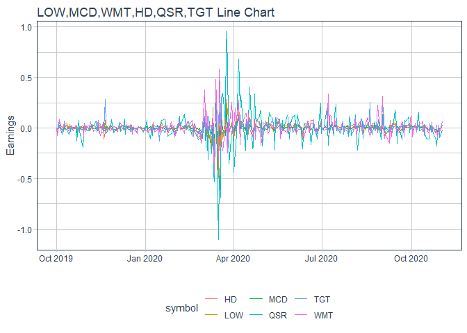
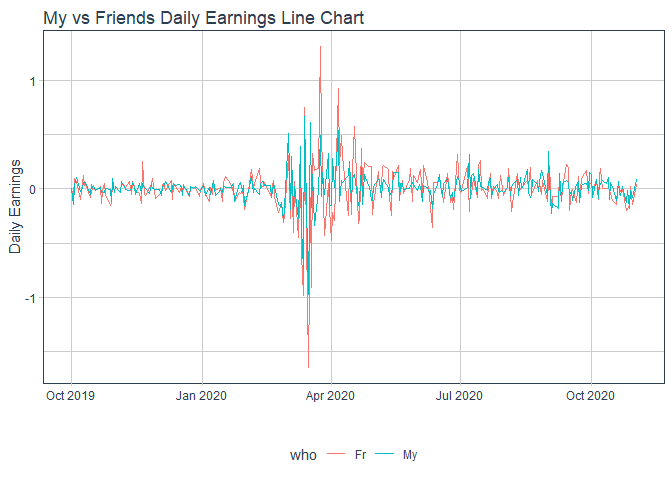
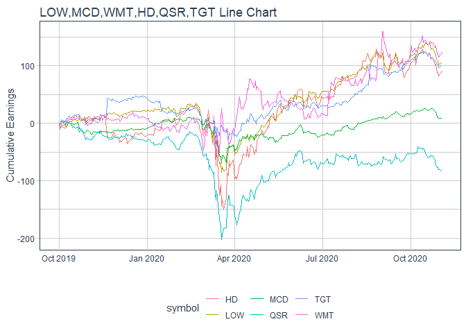
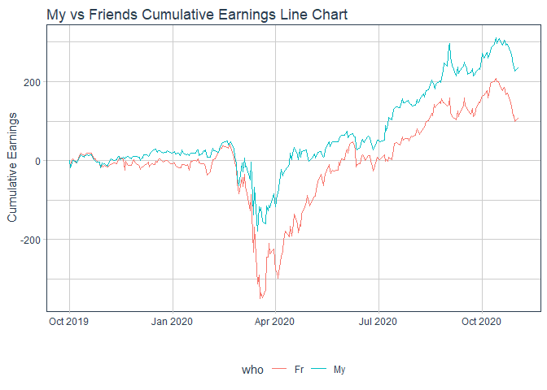

---
title: "Task 20 : My Investment is Better Than Yours"
author: "TomHollinberger"
date: "11/3/2020"
output: 
 html_document: 
   keep_md: yes
   toc: TRUE
   code_folding:  hide
   results: 'hide'
   message: FALSE
   warning: FALSE
---  
THIS RSCRIPT USES ROXYGEN CHARACTERS. <br> 
YOU CAN PRESS ctrl+shift+K AND GO STRAIGHT TO A HTML.  <br>
SKIPS THE HANDWORK OF CREATING A RMD, AFTER THE ORIGINAL WORK IS NONE IN A RSCRIPT.<br>

#### You and a friend each purchased about $1,000 of stock in three different stocks
#### at the start of October last year, and you want to compare your performance up to this week. 
#### Use the stock shares purchased and share prices to demonstrate how each of you fared 
#### over the period you were competing (assuming that you did not change your allocations).


```r
library(tidyquant)
```

```
## Warning: package 'tidyquant' was built under R version 4.0.3
```

```
## Loading required package: lubridate
```

```
## 
## Attaching package: 'lubridate'
```

```
## The following objects are masked from 'package:base':
## 
##     date, intersect, setdiff, union
```

```
## Loading required package: PerformanceAnalytics
```

```
## Warning: package 'PerformanceAnalytics' was built under R version 4.0.3
```

```
## Loading required package: xts
```

```
## Warning: package 'xts' was built under R version 4.0.3
```

```
## Loading required package: zoo
```

```
## 
## Attaching package: 'zoo'
```

```
## The following objects are masked from 'package:base':
## 
##     as.Date, as.Date.numeric
```

```
## 
## Attaching package: 'PerformanceAnalytics'
```

```
## The following object is masked from 'package:graphics':
## 
##     legend
```

```
## Loading required package: quantmod
```

```
## Warning: package 'quantmod' was built under R version 4.0.3
```

```
## Loading required package: TTR
```

```
## Warning: package 'TTR' was built under R version 4.0.3
```

```
## Registered S3 method overwritten by 'quantmod':
##   method            from
##   as.zoo.data.frame zoo
```

```
## Version 0.4-0 included new data defaults. See ?getSymbols.
```

```
## == Need to Learn tidyquant? ===================================================================================
## Business Science offers a 1-hour course - Learning Lab #9: Performance Analysis & Portfolio Optimization with tidyquant!
## </> Learn more at: https://university.business-science.io/p/learning-labs-pro </>
```

```r
library(ggplot2)
library(tidyverse)
```

```
## -- Attaching packages ---------------------------------------------------------------------- tidyverse 1.3.0 --
```

```
## v tibble  3.0.3     v dplyr   1.0.0
## v tidyr   1.1.0     v stringr 1.4.0
## v readr   1.3.1     v forcats 0.5.0
## v purrr   0.3.4
```

```
## -- Conflicts ------------------------------------------------------------------------- tidyverse_conflicts() --
## x lubridate::as.difftime() masks base::as.difftime()
## x lubridate::date()        masks base::date()
## x dplyr::filter()          masks stats::filter()
## x dplyr::first()           masks xts::first()
## x lubridate::intersect()   masks base::intersect()
## x dplyr::lag()             masks stats::lag()
## x dplyr::last()            masks xts::last()
## x lubridate::setdiff()     masks base::setdiff()
## x lubridate::union()       masks base::union()
```

```r
library(lubridate)
library(timetk)
```

```
## Warning: package 'timetk' was built under R version 4.0.3
```

### [ ] List the three stocks that your friend picks and the three that you pick.
#### My picks:  Lowes (LOW), Walmart (WMT), McDonalds (MCD)
#### Friend's picks: Home Depot (HD), Target (TGT), Restaurant Brands Inc (Burger King, Tim Horton, Popeye's) (QSR)
### [ ] Pull the price performance data using library(tidyquant).


```r
#### and Bind it into My Portfolio, Friend's Portfolio, and All Portfolio
mystocks <- c("LOW","MCD","WMT") %>%
  tq_get(get = "stock.prices", 
                    from = "2019-10-01")
mystocks
```

```
## # A tibble: 828 x 8
##    symbol date        open  high   low close  volume adjusted
##    <chr>  <date>     <dbl> <dbl> <dbl> <dbl>   <dbl>    <dbl>
##  1 LOW    2019-10-01  110.  112.  109.  110. 3966100     107.
##  2 LOW    2019-10-02  109.  109.  106.  106. 5040700     104.
##  3 LOW    2019-10-03  106.  107.  105.  106. 5002800     104.
##  4 LOW    2019-10-04  107.  108.  106.  107. 4311800     105.
##  5 LOW    2019-10-07  108.  109.  107.  108. 3686800     106.
##  6 LOW    2019-10-08  107.  108.  106.  106. 3261700     104.
##  7 LOW    2019-10-09  107.  108.  106.  106. 3224000     104.
##  8 LOW    2019-10-10  106.  108.  106.  108. 3218500     106.
##  9 LOW    2019-10-11  110.  112.  109.  111. 4498500     108.
## 10 LOW    2019-10-14  110.  111.  110.  111. 2129900     108.
## # ... with 818 more rows
```

```r
frstocks <- c("HD","QSR","TGT") %>%
  tq_get(get = "stock.prices", 
         from = "2019-10-01")
frstocks   
```

```
## # A tibble: 828 x 8
##    symbol date        open  high   low close  volume adjusted
##    <chr>  <date>     <dbl> <dbl> <dbl> <dbl>   <dbl>    <dbl>
##  1 HD     2019-10-01  233.  235.  231.  231. 3335400     226.
##  2 HD     2019-10-02  231.  231.  224.  226. 4336100     220.
##  3 HD     2019-10-03  225   227.  222.  227. 2777700     221.
##  4 HD     2019-10-04  227.  229.  227.  228. 3163100     222.
##  5 HD     2019-10-07  228.  228.  226.  227. 2917600     221.
##  6 HD     2019-10-08  225.  229.  225.  227. 3438500     221.
##  7 HD     2019-10-09  228.  230.  227.  229. 2657600     223.
##  8 HD     2019-10-10  229.  232.  229.  232. 2781500     226.
##  9 HD     2019-10-11  234.  237.  234.  235. 3459200     229.
## 10 HD     2019-10-14  234.  235.  234.  234. 2183900     229.
## # ... with 818 more rows
```

```r
#BOTH HAVE 828 ROWS

#Bind my and fr together
allstocks <- bind_rows(mystocks, frstocks)
allstocks  
```

```
## # A tibble: 1,656 x 8
##    symbol date        open  high   low close  volume adjusted
##    <chr>  <date>     <dbl> <dbl> <dbl> <dbl>   <dbl>    <dbl>
##  1 LOW    2019-10-01  110.  112.  109.  110. 3966100     107.
##  2 LOW    2019-10-02  109.  109.  106.  106. 5040700     104.
##  3 LOW    2019-10-03  106.  107.  105.  106. 5002800     104.
##  4 LOW    2019-10-04  107.  108.  106.  107. 4311800     105.
##  5 LOW    2019-10-07  108.  109.  107.  108. 3686800     106.
##  6 LOW    2019-10-08  107.  108.  106.  106. 3261700     104.
##  7 LOW    2019-10-09  107.  108.  106.  106. 3224000     104.
##  8 LOW    2019-10-10  106.  108.  106.  108. 3218500     106.
##  9 LOW    2019-10-11  110.  112.  109.  111. 4498500     108.
## 10 LOW    2019-10-14  110.  111.  110.  111. 2129900     108.
## # ... with 1,646 more rows
```

```r
#1656 rows

allstocks <-arrange(allstocks, date)
allstocks
```

```
## # A tibble: 1,656 x 8
##    symbol date        open  high   low close  volume adjusted
##    <chr>  <date>     <dbl> <dbl> <dbl> <dbl>   <dbl>    <dbl>
##  1 LOW    2019-10-01 110.  112.  109.  110.  3966100    107. 
##  2 MCD    2019-10-01 211.  212.  208.  209.  4811900    204. 
##  3 WMT    2019-10-01 119.  119.  118.  118.  3729300    116. 
##  4 HD     2019-10-01 233.  235.  231.  231.  3335400    226. 
##  5 QSR    2019-10-01  71.3  71.8  70.5  70.8 1776300     68.2
##  6 TGT    2019-10-01 107.  108.  106.  106.  3557400    104. 
##  7 LOW    2019-10-02 109.  109.  106.  106.  5040700    104. 
##  8 MCD    2019-10-02 208.  208.  206.  206.  4171400    201. 
##  9 WMT    2019-10-02 117.  118.  116.  116.  5944500    114. 
## 10 HD     2019-10-02 231.  231.  224.  226.  4336100    220. 
## # ... with 1,646 more rows
```

```r
#add a daily returns columns (will be used to calculate daily earnings)
allstocksgrp <- group_by(allstocks,symbol)
allstocksgrp
```

```
## # A tibble: 1,656 x 8
## # Groups:   symbol [6]
##    symbol date        open  high   low close  volume adjusted
##    <chr>  <date>     <dbl> <dbl> <dbl> <dbl>   <dbl>    <dbl>
##  1 LOW    2019-10-01 110.  112.  109.  110.  3966100    107. 
##  2 MCD    2019-10-01 211.  212.  208.  209.  4811900    204. 
##  3 WMT    2019-10-01 119.  119.  118.  118.  3729300    116. 
##  4 HD     2019-10-01 233.  235.  231.  231.  3335400    226. 
##  5 QSR    2019-10-01  71.3  71.8  70.5  70.8 1776300     68.2
##  6 TGT    2019-10-01 107.  108.  106.  106.  3557400    104. 
##  7 LOW    2019-10-02 109.  109.  106.  106.  5040700    104. 
##  8 MCD    2019-10-02 208.  208.  206.  206.  4171400    201. 
##  9 WMT    2019-10-02 117.  118.  116.  116.  5944500    114. 
## 10 HD     2019-10-02 231.  231.  224.  226.  4336100    220. 
## # ... with 1,646 more rows
```

```r
allstocksgrp <- tq_mutate(allstocksgrp, adjusted, mutate_fun = dailyReturn)
allstocksgrp
```

```
## # A tibble: 1,656 x 9
## # Groups:   symbol [6]
##    symbol date        open  high   low close  volume adjusted daily.returns
##    <chr>  <date>     <dbl> <dbl> <dbl> <dbl>   <dbl>    <dbl>         <dbl>
##  1 LOW    2019-10-01  110.  112.  109.  110. 3966100     107.      0       
##  2 LOW    2019-10-02  109.  109.  106.  106. 5040700     104.     -0.0289  
##  3 LOW    2019-10-03  106.  107.  105.  106. 5002800     104.      0.000188
##  4 LOW    2019-10-04  107.  108.  106.  107. 4311800     105.      0.00987 
##  5 LOW    2019-10-07  108.  109.  107.  108. 3686800     106.      0.00754 
##  6 LOW    2019-10-08  107.  108.  106.  106. 3261700     104.     -0.0160  
##  7 LOW    2019-10-09  107.  108.  106.  106. 3224000     104.     -0.00188 
##  8 LOW    2019-10-10  106.  108.  106.  108. 3218500     106.      0.0178  
##  9 LOW    2019-10-11  110.  112.  109.  111. 4498500     108.      0.0242  
## 10 LOW    2019-10-14  110.  111.  110.  111. 2129900     108.     -0.00126 
## # ... with 1,646 more rows
```

```r
#Has these columns:  symbol date  open  high   low close  volume adjusted daily.returns
# 1565 rows
```

#### Create a separate baseline dataframe, using the first day's adjusted price.


```r
baseline <- filter(allstocks, date == "2019-10-01")
baseline <- mutate(baseline, bsln = adjusted)
baseline  #in this order LOW,MCD,WMT,HD,QSR,TGT
```

```
## # A tibble: 6 x 9
##   symbol date        open  high   low close  volume adjusted  bsln
##   <chr>  <date>     <dbl> <dbl> <dbl> <dbl>   <dbl>    <dbl> <dbl>
## 1 LOW    2019-10-01 110.  112.  109.  110.  3966100    107.  107. 
## 2 MCD    2019-10-01 211.  212.  208.  209.  4811900    204.  204. 
## 3 WMT    2019-10-01 119.  119.  118.  118.  3729300    116.  116. 
## 4 HD     2019-10-01 233.  235.  231.  231.  3335400    226.  226. 
## 5 QSR    2019-10-01  71.3  71.8  70.5  70.8 1776300     68.2  68.2
## 6 TGT    2019-10-01 107.  108.  106.  106.  3557400    104.  104.
```

#### Decide how many shares of each stock you will purchace with the $1000.
Used a scratch excel sheet and sumproduct to come close to 1000
Make a vector to become the shrs column


```r
shrs <- c(2,1,5,2,5,2)
baseline$shrs <- shrs
(baseline <- select(baseline, symbol, bsln, shrs))
```

```
## # A tibble: 6 x 3
##   symbol  bsln  shrs
##   <chr>  <dbl> <dbl>
## 1 LOW    107.      2
## 2 MCD    204.      1
## 3 WMT    116.      5
## 4 HD     226.      2
## 5 QSR     68.2     5
## 6 TGT    104.      2
```

```r
#Has these columns:  symbol bsln  shrs
#and only 6 rows  (the 6 symbols)
```

#### Join so that baseline price and shrs are populated/repeated for every row.


```r
allstkwbsl <- left_join(allstocksgrp,baseline, by = "symbol")
allstkwbsl
```

```
## # A tibble: 1,656 x 11
## # Groups:   symbol [6]
##    symbol date        open  high   low close volume adjusted daily.returns  bsln
##    <chr>  <date>     <dbl> <dbl> <dbl> <dbl>  <dbl>    <dbl>         <dbl> <dbl>
##  1 LOW    2019-10-01  110.  112.  109.  110. 3.97e6     107.      0         107.
##  2 LOW    2019-10-02  109.  109.  106.  106. 5.04e6     104.     -0.0289    107.
##  3 LOW    2019-10-03  106.  107.  105.  106. 5.00e6     104.      0.000188  107.
##  4 LOW    2019-10-04  107.  108.  106.  107. 4.31e6     105.      0.00987   107.
##  5 LOW    2019-10-07  108.  109.  107.  108. 3.69e6     106.      0.00754   107.
##  6 LOW    2019-10-08  107.  108.  106.  106. 3.26e6     104.     -0.0160    107.
##  7 LOW    2019-10-09  107.  108.  106.  106. 3.22e6     104.     -0.00188   107.
##  8 LOW    2019-10-10  106.  108.  106.  108. 3.22e6     106.      0.0178    107.
##  9 LOW    2019-10-11  110.  112.  109.  111. 4.50e6     108.      0.0242    107.
## 10 LOW    2019-10-14  110.  111.  110.  111. 2.13e6     108.     -0.00126   107.
## # ... with 1,646 more rows, and 1 more variable: shrs <dbl>
```

```r
#Now has these columns:  symbol date  open  high   low close  volume adjusted  daily.returns bsln  shrs
#and 1656 rows  (all days for all 6 symbols)
```

#### Add a VAL column = shrs x adjusted, 
#### Add an CUMEARN column = (adjusted - bsln) x shrs, 
#### Add a DLYEARN column = daily.return x shrs,


```r
alstkwbslearn <- mutate(allstkwbsl, 
                        val = shrs * adjusted, 
                        cumearn = (adjusted - bsln)*shrs, 
                        dlyearn = daily.returns*shrs)
alstkwbslearn
```

```
## # A tibble: 1,656 x 14
## # Groups:   symbol [6]
##    symbol date        open  high   low close volume adjusted daily.returns  bsln
##    <chr>  <date>     <dbl> <dbl> <dbl> <dbl>  <dbl>    <dbl>         <dbl> <dbl>
##  1 LOW    2019-10-01  110.  112.  109.  110. 3.97e6     107.      0         107.
##  2 LOW    2019-10-02  109.  109.  106.  106. 5.04e6     104.     -0.0289    107.
##  3 LOW    2019-10-03  106.  107.  105.  106. 5.00e6     104.      0.000188  107.
##  4 LOW    2019-10-04  107.  108.  106.  107. 4.31e6     105.      0.00987   107.
##  5 LOW    2019-10-07  108.  109.  107.  108. 3.69e6     106.      0.00754   107.
##  6 LOW    2019-10-08  107.  108.  106.  106. 3.26e6     104.     -0.0160    107.
##  7 LOW    2019-10-09  107.  108.  106.  106. 3.22e6     104.     -0.00188   107.
##  8 LOW    2019-10-10  106.  108.  106.  108. 3.22e6     106.      0.0178    107.
##  9 LOW    2019-10-11  110.  112.  109.  111. 4.50e6     108.      0.0242    107.
## 10 LOW    2019-10-14  110.  111.  110.  111. 2.13e6     108.     -0.00126   107.
## # ... with 1,646 more rows, and 4 more variables: shrs <dbl>, val <dbl>,
## #   cumearn <dbl>, dlyearn <dbl>
```

```r
#Plot of 6 separate daily earnings
alstkwbslearn %>%
  ggplot(aes(x = date, y = dlyearn, color = symbol)) +
  geom_line() +
  labs(title = "LOW,MCD,WMT,HD,QSR,TGT Line Chart", y = "Earnings", x = "") +
  theme_tq()
```

<!-- -->

```r
#Bundle into My vs Friends Portfolios
#Make a variable for My or Friends, first create it = symbol, then mutate-case-when 
alstkwbslearn <- mutate(alstkwbslearn, who = symbol)
alstkwbslearn
```

```
## # A tibble: 1,656 x 15
## # Groups:   symbol [6]
##    symbol date        open  high   low close volume adjusted daily.returns  bsln
##    <chr>  <date>     <dbl> <dbl> <dbl> <dbl>  <dbl>    <dbl>         <dbl> <dbl>
##  1 LOW    2019-10-01  110.  112.  109.  110. 3.97e6     107.      0         107.
##  2 LOW    2019-10-02  109.  109.  106.  106. 5.04e6     104.     -0.0289    107.
##  3 LOW    2019-10-03  106.  107.  105.  106. 5.00e6     104.      0.000188  107.
##  4 LOW    2019-10-04  107.  108.  106.  107. 4.31e6     105.      0.00987   107.
##  5 LOW    2019-10-07  108.  109.  107.  108. 3.69e6     106.      0.00754   107.
##  6 LOW    2019-10-08  107.  108.  106.  106. 3.26e6     104.     -0.0160    107.
##  7 LOW    2019-10-09  107.  108.  106.  106. 3.22e6     104.     -0.00188   107.
##  8 LOW    2019-10-10  106.  108.  106.  108. 3.22e6     106.      0.0178    107.
##  9 LOW    2019-10-11  110.  112.  109.  111. 4.50e6     108.      0.0242    107.
## 10 LOW    2019-10-14  110.  111.  110.  111. 2.13e6     108.     -0.00126   107.
## # ... with 1,646 more rows, and 5 more variables: shrs <dbl>, val <dbl>,
## #   cumearn <dbl>, dlyearn <dbl>, who <chr>
```

```r
alstkwbslearn <- mutate(alstkwbslearn,who=case_when(
  who == "LOW" ~ "My",
  who == "WMT" ~ "My",
  who == "MCD" ~ "My",
  who == "HD" ~ "Fr",
  who == "TGT" ~ "Fr",
  who == "QSR" ~ "Fr"))
alstkwbslearn
```

```
## # A tibble: 1,656 x 15
## # Groups:   symbol [6]
##    symbol date        open  high   low close volume adjusted daily.returns  bsln
##    <chr>  <date>     <dbl> <dbl> <dbl> <dbl>  <dbl>    <dbl>         <dbl> <dbl>
##  1 LOW    2019-10-01  110.  112.  109.  110. 3.97e6     107.      0         107.
##  2 LOW    2019-10-02  109.  109.  106.  106. 5.04e6     104.     -0.0289    107.
##  3 LOW    2019-10-03  106.  107.  105.  106. 5.00e6     104.      0.000188  107.
##  4 LOW    2019-10-04  107.  108.  106.  107. 4.31e6     105.      0.00987   107.
##  5 LOW    2019-10-07  108.  109.  107.  108. 3.69e6     106.      0.00754   107.
##  6 LOW    2019-10-08  107.  108.  106.  106. 3.26e6     104.     -0.0160    107.
##  7 LOW    2019-10-09  107.  108.  106.  106. 3.22e6     104.     -0.00188   107.
##  8 LOW    2019-10-10  106.  108.  106.  108. 3.22e6     106.      0.0178    107.
##  9 LOW    2019-10-11  110.  112.  109.  111. 4.50e6     108.      0.0242    107.
## 10 LOW    2019-10-14  110.  111.  110.  111. 2.13e6     108.     -0.00126   107.
## # ... with 1,646 more rows, and 5 more variables: shrs <dbl>, val <dbl>,
## #   cumearn <dbl>, dlyearn <dbl>, who <chr>
```

```r
#Create a dailyReturn grouped by portfolio
alstkwbslearnbyport <- group_by(alstkwbslearn, date, who)  
alstkwbslearnbyport
```

```
## # A tibble: 1,656 x 15
## # Groups:   date, who [552]
##    symbol date        open  high   low close volume adjusted daily.returns  bsln
##    <chr>  <date>     <dbl> <dbl> <dbl> <dbl>  <dbl>    <dbl>         <dbl> <dbl>
##  1 LOW    2019-10-01  110.  112.  109.  110. 3.97e6     107.      0         107.
##  2 LOW    2019-10-02  109.  109.  106.  106. 5.04e6     104.     -0.0289    107.
##  3 LOW    2019-10-03  106.  107.  105.  106. 5.00e6     104.      0.000188  107.
##  4 LOW    2019-10-04  107.  108.  106.  107. 4.31e6     105.      0.00987   107.
##  5 LOW    2019-10-07  108.  109.  107.  108. 3.69e6     106.      0.00754   107.
##  6 LOW    2019-10-08  107.  108.  106.  106. 3.26e6     104.     -0.0160    107.
##  7 LOW    2019-10-09  107.  108.  106.  106. 3.22e6     104.     -0.00188   107.
##  8 LOW    2019-10-10  106.  108.  106.  108. 3.22e6     106.      0.0178    107.
##  9 LOW    2019-10-11  110.  112.  109.  111. 4.50e6     108.      0.0242    107.
## 10 LOW    2019-10-14  110.  111.  110.  111. 2.13e6     108.     -0.00126   107.
## # ... with 1,646 more rows, and 5 more variables: shrs <dbl>, val <dbl>,
## #   cumearn <dbl>, dlyearn <dbl>, who <chr>
```

```r
alstkwbslearndlyport <- summarise(alstkwbslearnbyport, portdlyearn = sum(dlyearn, na.rm = TRUE)) # Produce the daily earnings for each portfolio (My vs Fr)
```

```
## `summarise()` regrouping output by 'date' (override with `.groups` argument)
```

```r
alstkwbslearndlyport
```

```
## # A tibble: 552 x 3
## # Groups:   date [276]
##    date       who   portdlyearn
##    <date>     <chr>       <dbl>
##  1 2019-10-01 Fr         0     
##  2 2019-10-01 My         0     
##  3 2019-10-02 Fr        -0.0746
##  4 2019-10-02 My        -0.144 
##  5 2019-10-03 Fr         0.0934
##  6 2019-10-03 My         0.0268
##  7 2019-10-04 Fr         0.0683
##  8 2019-10-04 My         0.107 
##  9 2019-10-07 Fr        -0.0944
## 10 2019-10-07 My        -0.0232
## # ... with 542 more rows
```

```r
tail(alstkwbslearndlyport)
```

```
## # A tibble: 6 x 3
## # Groups:   date [3]
##   date       who   portdlyearn
##   <date>     <chr>       <dbl>
## 1 2020-10-29 Fr         0.0173
## 2 2020-10-29 My        -0.0114
## 3 2020-10-30 Fr        -0.144 
## 4 2020-10-30 My        -0.0839
## 5 2020-11-02 Fr         0.0357
## 6 2020-11-02 My         0.0843
```

### [ ] Build a visualization that shows who is winning each day of the competition.
## **PLOT 1 : "Who Won Each Day?** Portfolio Daily Earnings
## **INSIGHT 1** :  A very busy chart.  Need a zoom-in capability to feret-out who really won each day.  And the win changes hands frequently.  Daily is probably too small of a periodicity to see useful trends.


```r
alstkwbslearndlyport %>%
  ggplot(aes(x = date, y = portdlyearn, color = who)) +
  geom_line() +
  labs(title = "My vs Friends Daily Earnings Line Chart", y = "Daily Earnings", x = "") +
  theme_tq()
```

<!-- -->

```r
ggsave("Who Won each Day.jpeg")
```

```
## Saving 7 x 5 in image
```

## **PLOT 1A : Who Won Each Day? INTERACTIVE and ZOOM-ABLE** Portfolio Daily Earnings
## **INSIGHT 1A** :  Zooming in just confirms that the win changes hands frequently. Daily is probably too small of a periodicity to see useful trends.


```r
library(timetk)
library(dygraphs)
```

```
## Warning: package 'dygraphs' was built under R version 4.0.3
```

```r
alstkwbslearndlyport_xts <- alstkwbslearndlyport %>%
  select(who, date, portdlyearn) %>%
  pivot_wider(names_from = who, values_from = portdlyearn) %>%
  tk_xts(date_var = date)  #caused an error when knitting 

dygraph(alstkwbslearndlyport_xts, main = "Daily Portfolio Earnings") %>%
  dySeries("My", label = "My Portfolio") %>%
  dySeries("Fr", label = "Friend's Portfolio") %>%
  dyAxis("y", label = "Daily Earnings", valueRange = c(-.75, +1.)) %>%
  dyLegend(width = 300) %>% 
  dyRangeSelector()
```

<!--html_preserve--><div id="htmlwidget-d3070ba870301d06483b" style="width:672px;height:480px;" class="dygraphs html-widget"></div>
<script type="application/json" data-for="htmlwidget-d3070ba870301d06483b">{"x":{"attrs":{"axes":{"x":{"pixelsPerLabel":60},"y":{"valueRange":[-0.75,1]}},"series":{"My Portfolio":{"axis":"y"},"Friend's Portfolio":{"axis":"y"}},"title":"Daily Portfolio Earnings","labels":["day","date","My Portfolio","Friend's Portfolio"],"retainDateWindow":false,"ylabel":"Daily Earnings","legend":"auto","labelsDivWidth":300,"labelsShowZeroValues":true,"labelsSeparateLines":false,"hideOverlayOnMouseOut":true,"showRangeSelector":true,"rangeSelectorHeight":40,"rangeSelectorPlotFillColor":" #A7B1C4","rangeSelectorPlotStrokeColor":"#808FAB","interactionModel":"Dygraph.Interaction.defaultModel"},"scale":"daily","annotations":[],"shadings":[],"events":[],"format":"date","data":[["2019-10-01T00:00:00.000Z","2019-10-02T00:00:00.000Z","2019-10-03T00:00:00.000Z","2019-10-04T00:00:00.000Z","2019-10-07T00:00:00.000Z","2019-10-08T00:00:00.000Z","2019-10-09T00:00:00.000Z","2019-10-10T00:00:00.000Z","2019-10-11T00:00:00.000Z","2019-10-14T00:00:00.000Z","2019-10-15T00:00:00.000Z","2019-10-16T00:00:00.000Z","2019-10-17T00:00:00.000Z","2019-10-18T00:00:00.000Z","2019-10-21T00:00:00.000Z","2019-10-22T00:00:00.000Z","2019-10-23T00:00:00.000Z","2019-10-24T00:00:00.000Z","2019-10-25T00:00:00.000Z","2019-10-28T00:00:00.000Z","2019-10-29T00:00:00.000Z","2019-10-30T00:00:00.000Z","2019-10-31T00:00:00.000Z","2019-11-01T00:00:00.000Z","2019-11-04T00:00:00.000Z","2019-11-05T00:00:00.000Z","2019-11-06T00:00:00.000Z","2019-11-07T00:00:00.000Z","2019-11-08T00:00:00.000Z","2019-11-11T00:00:00.000Z","2019-11-12T00:00:00.000Z","2019-11-13T00:00:00.000Z","2019-11-14T00:00:00.000Z","2019-11-15T00:00:00.000Z","2019-11-18T00:00:00.000Z","2019-11-19T00:00:00.000Z","2019-11-20T00:00:00.000Z","2019-11-21T00:00:00.000Z","2019-11-22T00:00:00.000Z","2019-11-25T00:00:00.000Z","2019-11-26T00:00:00.000Z","2019-11-27T00:00:00.000Z","2019-11-29T00:00:00.000Z","2019-12-02T00:00:00.000Z","2019-12-03T00:00:00.000Z","2019-12-04T00:00:00.000Z","2019-12-05T00:00:00.000Z","2019-12-06T00:00:00.000Z","2019-12-09T00:00:00.000Z","2019-12-10T00:00:00.000Z","2019-12-11T00:00:00.000Z","2019-12-12T00:00:00.000Z","2019-12-13T00:00:00.000Z","2019-12-16T00:00:00.000Z","2019-12-17T00:00:00.000Z","2019-12-18T00:00:00.000Z","2019-12-19T00:00:00.000Z","2019-12-20T00:00:00.000Z","2019-12-23T00:00:00.000Z","2019-12-24T00:00:00.000Z","2019-12-26T00:00:00.000Z","2019-12-27T00:00:00.000Z","2019-12-30T00:00:00.000Z","2019-12-31T00:00:00.000Z","2020-01-02T00:00:00.000Z","2020-01-03T00:00:00.000Z","2020-01-06T00:00:00.000Z","2020-01-07T00:00:00.000Z","2020-01-08T00:00:00.000Z","2020-01-09T00:00:00.000Z","2020-01-10T00:00:00.000Z","2020-01-13T00:00:00.000Z","2020-01-14T00:00:00.000Z","2020-01-15T00:00:00.000Z","2020-01-16T00:00:00.000Z","2020-01-17T00:00:00.000Z","2020-01-21T00:00:00.000Z","2020-01-22T00:00:00.000Z","2020-01-23T00:00:00.000Z","2020-01-24T00:00:00.000Z","2020-01-27T00:00:00.000Z","2020-01-28T00:00:00.000Z","2020-01-29T00:00:00.000Z","2020-01-30T00:00:00.000Z","2020-01-31T00:00:00.000Z","2020-02-03T00:00:00.000Z","2020-02-04T00:00:00.000Z","2020-02-05T00:00:00.000Z","2020-02-06T00:00:00.000Z","2020-02-07T00:00:00.000Z","2020-02-10T00:00:00.000Z","2020-02-11T00:00:00.000Z","2020-02-12T00:00:00.000Z","2020-02-13T00:00:00.000Z","2020-02-14T00:00:00.000Z","2020-02-18T00:00:00.000Z","2020-02-19T00:00:00.000Z","2020-02-20T00:00:00.000Z","2020-02-21T00:00:00.000Z","2020-02-24T00:00:00.000Z","2020-02-25T00:00:00.000Z","2020-02-26T00:00:00.000Z","2020-02-27T00:00:00.000Z","2020-02-28T00:00:00.000Z","2020-03-02T00:00:00.000Z","2020-03-03T00:00:00.000Z","2020-03-04T00:00:00.000Z","2020-03-05T00:00:00.000Z","2020-03-06T00:00:00.000Z","2020-03-09T00:00:00.000Z","2020-03-10T00:00:00.000Z","2020-03-11T00:00:00.000Z","2020-03-12T00:00:00.000Z","2020-03-13T00:00:00.000Z","2020-03-16T00:00:00.000Z","2020-03-17T00:00:00.000Z","2020-03-18T00:00:00.000Z","2020-03-19T00:00:00.000Z","2020-03-20T00:00:00.000Z","2020-03-23T00:00:00.000Z","2020-03-24T00:00:00.000Z","2020-03-25T00:00:00.000Z","2020-03-26T00:00:00.000Z","2020-03-27T00:00:00.000Z","2020-03-30T00:00:00.000Z","2020-03-31T00:00:00.000Z","2020-04-01T00:00:00.000Z","2020-04-02T00:00:00.000Z","2020-04-03T00:00:00.000Z","2020-04-06T00:00:00.000Z","2020-04-07T00:00:00.000Z","2020-04-08T00:00:00.000Z","2020-04-09T00:00:00.000Z","2020-04-13T00:00:00.000Z","2020-04-14T00:00:00.000Z","2020-04-15T00:00:00.000Z","2020-04-16T00:00:00.000Z","2020-04-17T00:00:00.000Z","2020-04-20T00:00:00.000Z","2020-04-21T00:00:00.000Z","2020-04-22T00:00:00.000Z","2020-04-23T00:00:00.000Z","2020-04-24T00:00:00.000Z","2020-04-27T00:00:00.000Z","2020-04-28T00:00:00.000Z","2020-04-29T00:00:00.000Z","2020-04-30T00:00:00.000Z","2020-05-01T00:00:00.000Z","2020-05-04T00:00:00.000Z","2020-05-05T00:00:00.000Z","2020-05-06T00:00:00.000Z","2020-05-07T00:00:00.000Z","2020-05-08T00:00:00.000Z","2020-05-11T00:00:00.000Z","2020-05-12T00:00:00.000Z","2020-05-13T00:00:00.000Z","2020-05-14T00:00:00.000Z","2020-05-15T00:00:00.000Z","2020-05-18T00:00:00.000Z","2020-05-19T00:00:00.000Z","2020-05-20T00:00:00.000Z","2020-05-21T00:00:00.000Z","2020-05-22T00:00:00.000Z","2020-05-26T00:00:00.000Z","2020-05-27T00:00:00.000Z","2020-05-28T00:00:00.000Z","2020-05-29T00:00:00.000Z","2020-06-01T00:00:00.000Z","2020-06-02T00:00:00.000Z","2020-06-03T00:00:00.000Z","2020-06-04T00:00:00.000Z","2020-06-05T00:00:00.000Z","2020-06-08T00:00:00.000Z","2020-06-09T00:00:00.000Z","2020-06-10T00:00:00.000Z","2020-06-11T00:00:00.000Z","2020-06-12T00:00:00.000Z","2020-06-15T00:00:00.000Z","2020-06-16T00:00:00.000Z","2020-06-17T00:00:00.000Z","2020-06-18T00:00:00.000Z","2020-06-19T00:00:00.000Z","2020-06-22T00:00:00.000Z","2020-06-23T00:00:00.000Z","2020-06-24T00:00:00.000Z","2020-06-25T00:00:00.000Z","2020-06-26T00:00:00.000Z","2020-06-29T00:00:00.000Z","2020-06-30T00:00:00.000Z","2020-07-01T00:00:00.000Z","2020-07-02T00:00:00.000Z","2020-07-06T00:00:00.000Z","2020-07-07T00:00:00.000Z","2020-07-08T00:00:00.000Z","2020-07-09T00:00:00.000Z","2020-07-10T00:00:00.000Z","2020-07-13T00:00:00.000Z","2020-07-14T00:00:00.000Z","2020-07-15T00:00:00.000Z","2020-07-16T00:00:00.000Z","2020-07-17T00:00:00.000Z","2020-07-20T00:00:00.000Z","2020-07-21T00:00:00.000Z","2020-07-22T00:00:00.000Z","2020-07-23T00:00:00.000Z","2020-07-24T00:00:00.000Z","2020-07-27T00:00:00.000Z","2020-07-28T00:00:00.000Z","2020-07-29T00:00:00.000Z","2020-07-30T00:00:00.000Z","2020-07-31T00:00:00.000Z","2020-08-03T00:00:00.000Z","2020-08-04T00:00:00.000Z","2020-08-05T00:00:00.000Z","2020-08-06T00:00:00.000Z","2020-08-07T00:00:00.000Z","2020-08-10T00:00:00.000Z","2020-08-11T00:00:00.000Z","2020-08-12T00:00:00.000Z","2020-08-13T00:00:00.000Z","2020-08-14T00:00:00.000Z","2020-08-17T00:00:00.000Z","2020-08-18T00:00:00.000Z","2020-08-19T00:00:00.000Z","2020-08-20T00:00:00.000Z","2020-08-21T00:00:00.000Z","2020-08-24T00:00:00.000Z","2020-08-25T00:00:00.000Z","2020-08-26T00:00:00.000Z","2020-08-27T00:00:00.000Z","2020-08-28T00:00:00.000Z","2020-08-31T00:00:00.000Z","2020-09-01T00:00:00.000Z","2020-09-02T00:00:00.000Z","2020-09-03T00:00:00.000Z","2020-09-04T00:00:00.000Z","2020-09-08T00:00:00.000Z","2020-09-09T00:00:00.000Z","2020-09-10T00:00:00.000Z","2020-09-11T00:00:00.000Z","2020-09-14T00:00:00.000Z","2020-09-15T00:00:00.000Z","2020-09-16T00:00:00.000Z","2020-09-17T00:00:00.000Z","2020-09-18T00:00:00.000Z","2020-09-21T00:00:00.000Z","2020-09-22T00:00:00.000Z","2020-09-23T00:00:00.000Z","2020-09-24T00:00:00.000Z","2020-09-25T00:00:00.000Z","2020-09-28T00:00:00.000Z","2020-09-29T00:00:00.000Z","2020-09-30T00:00:00.000Z","2020-10-01T00:00:00.000Z","2020-10-02T00:00:00.000Z","2020-10-05T00:00:00.000Z","2020-10-06T00:00:00.000Z","2020-10-07T00:00:00.000Z","2020-10-08T00:00:00.000Z","2020-10-09T00:00:00.000Z","2020-10-12T00:00:00.000Z","2020-10-13T00:00:00.000Z","2020-10-14T00:00:00.000Z","2020-10-15T00:00:00.000Z","2020-10-16T00:00:00.000Z","2020-10-19T00:00:00.000Z","2020-10-20T00:00:00.000Z","2020-10-21T00:00:00.000Z","2020-10-22T00:00:00.000Z","2020-10-23T00:00:00.000Z","2020-10-26T00:00:00.000Z","2020-10-27T00:00:00.000Z","2020-10-28T00:00:00.000Z","2020-10-29T00:00:00.000Z","2020-10-30T00:00:00.000Z","2020-11-02T00:00:00.000Z"],["2019-10-01","2019-10-02","2019-10-03","2019-10-04","2019-10-07","2019-10-08","2019-10-09","2019-10-10","2019-10-11","2019-10-14","2019-10-15","2019-10-16","2019-10-17","2019-10-18","2019-10-21","2019-10-22","2019-10-23","2019-10-24","2019-10-25","2019-10-28","2019-10-29","2019-10-30","2019-10-31","2019-11-01","2019-11-04","2019-11-05","2019-11-06","2019-11-07","2019-11-08","2019-11-11","2019-11-12","2019-11-13","2019-11-14","2019-11-15","2019-11-18","2019-11-19","2019-11-20","2019-11-21","2019-11-22","2019-11-25","2019-11-26","2019-11-27","2019-11-29","2019-12-02","2019-12-03","2019-12-04","2019-12-05","2019-12-06","2019-12-09","2019-12-10","2019-12-11","2019-12-12","2019-12-13","2019-12-16","2019-12-17","2019-12-18","2019-12-19","2019-12-20","2019-12-23","2019-12-24","2019-12-26","2019-12-27","2019-12-30","2019-12-31","2020-01-02","2020-01-03","2020-01-06","2020-01-07","2020-01-08","2020-01-09","2020-01-10","2020-01-13","2020-01-14","2020-01-15","2020-01-16","2020-01-17","2020-01-21","2020-01-22","2020-01-23","2020-01-24","2020-01-27","2020-01-28","2020-01-29","2020-01-30","2020-01-31","2020-02-03","2020-02-04","2020-02-05","2020-02-06","2020-02-07","2020-02-10","2020-02-11","2020-02-12","2020-02-13","2020-02-14","2020-02-18","2020-02-19","2020-02-20","2020-02-21","2020-02-24","2020-02-25","2020-02-26","2020-02-27","2020-02-28","2020-03-02","2020-03-03","2020-03-04","2020-03-05","2020-03-06","2020-03-09","2020-03-10","2020-03-11","2020-03-12","2020-03-13","2020-03-16","2020-03-17","2020-03-18","2020-03-19","2020-03-20","2020-03-23","2020-03-24","2020-03-25","2020-03-26","2020-03-27","2020-03-30","2020-03-31","2020-04-01","2020-04-02","2020-04-03","2020-04-06","2020-04-07","2020-04-08","2020-04-09","2020-04-13","2020-04-14","2020-04-15","2020-04-16","2020-04-17","2020-04-20","2020-04-21","2020-04-22","2020-04-23","2020-04-24","2020-04-27","2020-04-28","2020-04-29","2020-04-30","2020-05-01","2020-05-04","2020-05-05","2020-05-06","2020-05-07","2020-05-08","2020-05-11","2020-05-12","2020-05-13","2020-05-14","2020-05-15","2020-05-18","2020-05-19","2020-05-20","2020-05-21","2020-05-22","2020-05-26","2020-05-27","2020-05-28","2020-05-29","2020-06-01","2020-06-02","2020-06-03","2020-06-04","2020-06-05","2020-06-08","2020-06-09","2020-06-10","2020-06-11","2020-06-12","2020-06-15","2020-06-16","2020-06-17","2020-06-18","2020-06-19","2020-06-22","2020-06-23","2020-06-24","2020-06-25","2020-06-26","2020-06-29","2020-06-30","2020-07-01","2020-07-02","2020-07-06","2020-07-07","2020-07-08","2020-07-09","2020-07-10","2020-07-13","2020-07-14","2020-07-15","2020-07-16","2020-07-17","2020-07-20","2020-07-21","2020-07-22","2020-07-23","2020-07-24","2020-07-27","2020-07-28","2020-07-29","2020-07-30","2020-07-31","2020-08-03","2020-08-04","2020-08-05","2020-08-06","2020-08-07","2020-08-10","2020-08-11","2020-08-12","2020-08-13","2020-08-14","2020-08-17","2020-08-18","2020-08-19","2020-08-20","2020-08-21","2020-08-24","2020-08-25","2020-08-26","2020-08-27","2020-08-28","2020-08-31","2020-09-01","2020-09-02","2020-09-03","2020-09-04","2020-09-08","2020-09-09","2020-09-10","2020-09-11","2020-09-14","2020-09-15","2020-09-16","2020-09-17","2020-09-18","2020-09-21","2020-09-22","2020-09-23","2020-09-24","2020-09-25","2020-09-28","2020-09-29","2020-09-30","2020-10-01","2020-10-02","2020-10-05","2020-10-06","2020-10-07","2020-10-08","2020-10-09","2020-10-12","2020-10-13","2020-10-14","2020-10-15","2020-10-16","2020-10-19","2020-10-20","2020-10-21","2020-10-22","2020-10-23","2020-10-26","2020-10-27","2020-10-28","2020-10-29","2020-10-30","2020-11-02"],[" 0.0000000000","-0.1444446089"," 0.0267860071"," 0.1071749156","-0.0231856506","-0.0208631553"," 0.0617991632"," 0.0591208540"," 0.0618294699","-0.0500832854"," 0.0411631015","-0.0009905425"," 0.0154310994","-0.0169657262"," 0.0158800580","-0.0378872212","-0.0269897357","-0.0379651893"," 0.0030956078","-0.0059056967","-0.1202347363"," 0.0946689392","-0.0305967659"," 0.0253310967","-0.0351936776"," 0.0660603735"," 0.0457069015"," 0.0236367752","-0.0052419724","-0.0138604122"," 0.0044107780"," 0.0612543853"," 0.0111841871","-0.0568096407"," 0.0509879922","-0.0474608275"," 0.0500016756"," 0.0077208669"," 0.0034169514","-0.0452083684"," 0.0357334647"," 0.0053119256","-0.0084447762","-0.0107569056","-0.0611247516"," 0.0228932537"," 0.0227215525"," 0.0651759061"," 0.0063865083","-0.0314144354"," 0.0132059210"," 0.0492770036"," 0.0313299298"," 0.0409136543"," 0.0111641042","-0.0632384705"," 0.0315738133"," 0.0011640868","-0.0594803476"," 0.0255689155"," 0.0017332330"," 0.0169135849","-0.0172960951","-0.0247270026"," 0.0319896472","-0.0619544075"," 0.0136077719","-0.0568055340"," 0.0307929895"," 0.0720602131","-0.0641418113","-0.0243214795"," 0.0006753350","-0.0360768537"," 0.0278560617"," 0.0166220216"," 0.0090841347"," 0.0395941526"," 0.0099996384","-0.1128056499"," 0.0483266289"," 0.0601633697","-0.0232470172"," 0.0262580922","-0.1579966130"," 0.0122203164"," 0.0781906667"," 0.1122202070","-0.0385524494","-0.0003943442","-0.0484083987"," 0.0483576518"," 0.0600287470"," 0.0642806982"," 0.0280599058"," 0.0345450193","-0.0804988116"," 0.0485868920"," 0.0215744608","-0.1444855555","-0.1610457169","-0.1241787684","-0.2921096510","-0.1706365359"," 0.5078040848","-0.1878268887"," 0.2957155031","-0.1802836283"," 0.0181189776","-0.2739459654"," 0.3898340804","-0.3754512690","-0.7359897112"," 0.6702154008","-0.9757893929"," 0.6091599372","-0.1684193900"," 0.1319282960","-0.3366124176","-0.0197057426"," 0.4943041883","-0.0722525055"," 0.1508820006","-0.0565349066"," 0.3208769877","-0.1446533888","-0.1513943304"," 0.2792995259"," 0.0118014368"," 0.5398547878","-0.1206640804"," 0.0792107501"," 0.0536962969"," 0.1218815475"," 0.2504338796","-0.1382160617"," 0.1076848053"," 0.1296555625","-0.1503948457","-0.0884955521"," 0.1925289212","-0.1411330496"," 0.1274151923"," 0.0313414773"," 0.0189247794","-0.1107053554","-0.1108766953"," 0.0246933762"," 0.0827352987"," 0.0793380292","-0.0796114342"," 0.0299780610"," 0.0849586668"," 0.0130507578","-0.0574685924","-0.0384625889"," 0.0025413286"," 0.1543875119"," 0.1547766037","-0.1051884923"," 0.0472883171"," 0.0493877148","-0.0033309688"," 0.0053527129"," 0.0313997839"," 0.0564948427"," 0.0435805571","-0.0139838526"," 0.0412921192"," 0.0244568925","-0.1179647704"," 0.0333573774"," 0.0122399003","-0.0298675957","-0.0182924532","-0.1811922743","-0.0549414931"," 0.0427865076"," 0.1336491596"," 0.0359196123","-0.0667183447"," 0.0526552819"," 0.0944703336","-0.0360787769","-0.0785420039","-0.0360064874","-0.1104010981"," 0.1118148303"," 0.0633386185"," 0.0048224605","-0.0250460103"," 0.0144510361"," 0.3138496351","-0.0878830191"," 0.1227544537"," 0.1445020909","-0.0569723409"," 0.1788984134"," 0.0216907522"," 0.0248118915"," 0.0085126353","-0.0135858745"," 0.0600595769"," 0.0905219033","-0.0712985291","-0.0020348814"," 0.0400179683","-0.0228464551","-0.0272166454","-0.0192949432","-0.0373370133"," 0.0150200679"," 0.1080157508","-0.0621253946"," 0.0143332743"," 0.0519880521"," 0.0834375617","-0.0574318144"," 0.1057507262"," 0.0094392072"," 0.0135870013"," 0.1737846248","-0.0312225929","-0.0845338244","-0.0639243036"," 0.0882448830"," 0.0419225659","-0.0230077232"," 0.0617804004"," 0.1716209252"," 0.1375021979","-0.0622386257"," 0.3460579588"," 0.0543012086","-0.2227750778","-0.1323564217","-0.1784812917"," 0.1372991620","-0.1180377309"," 0.0444474097"," 0.0751893192"," 0.0561545095","-0.0565189045","-0.0292914884","-0.1065276712"," 0.0420150378"," 0.0696682451","-0.1269208081"," 0.0303192579"," 0.0433758032"," 0.0469117974","-0.0152400069"," 0.1490693301"," 0.1295390547","-0.0842687463"," 0.0861587365","-0.0921399772"," 0.0620936407"," 0.0421689375"," 0.0735537812"," 0.0513983005"," 0.1042197837","-0.0967337423"," 0.0586299681"," 0.0226500912","-0.1044289235"," 0.0689799354","-0.0086239581","-0.0624741209"," 0.0189234910","-0.1247449706","-0.0163928381","-0.1812288907","-0.0113745877","-0.0838517743"," 0.0843383502"],[" 0.000000e+00","-7.458585e-02"," 9.341815e-02"," 6.829432e-02","-9.436361e-02","-2.541259e-02"," 1.230179e-01"," 2.853559e-02"," 3.648853e-02","-7.820690e-02","-2.927684e-02"," 3.152422e-02"," 5.113205e-03","-1.851006e-02"," 2.172188e-02","-1.370556e-01","-2.478323e-02"," 5.073664e-02","-5.438078e-02","-1.556973e-01","-1.270031e-01"," 6.320617e-02","-3.753419e-02"," 2.298088e-02","-3.037349e-02"," 6.147293e-02"," 3.747852e-02"," 2.724633e-02"," 1.079791e-02"," 6.865123e-02","-5.182243e-02"," 6.481711e-02"," 2.536205e-02","-1.613042e-02","-4.052348e-02","-1.365360e-01"," 2.523767e-01","-4.297643e-02","-6.571498e-02"," 4.732014e-05"," 5.184181e-02"," 9.063105e-02","-8.550444e-02","-4.878448e-02","-4.755719e-02"," 3.830451e-02"," 4.872150e-02","-1.629807e-02"," 5.282563e-02"," 7.284655e-02","-1.004211e-01"," 3.828118e-02"," 2.582753e-02","-3.652800e-02"," 1.916100e-02","-2.742432e-02"," 4.393080e-02"," 4.265906e-03","-7.361661e-02"," 1.659323e-02"," 8.982102e-03"," 1.203394e-02","-7.098594e-02","-1.711488e-02"," 5.125788e-02","-4.752114e-02","-1.127040e-01"," 1.265128e-02","-5.383338e-02"," 6.512793e-02","-1.575719e-02"," 4.769116e-03"," 1.451243e-02","-1.190942e-01"," 6.111573e-02"," 1.133096e-01"," 5.092598e-02","-1.590169e-02"," 4.657772e-02","-1.147276e-01","-3.358874e-02","-4.412485e-02","-1.651286e-02","-6.718480e-02","-1.902640e-01"," 4.164057e-02"," 1.195720e-01"," 1.810139e-01"," 3.342275e-03"," 5.148393e-02"," 1.886157e-01"," 6.457013e-02"," 9.618303e-03"," 2.284460e-02"," 5.738581e-02","-5.787181e-02","-2.731352e-02"," 7.214949e-02","-6.791868e-02","-2.196014e-01","-1.620826e-01","-1.391477e-01","-3.072914e-01","-2.432314e-01"," 3.065389e-01","-2.700163e-01"," 1.763469e-01","-4.017730e-01"," 6.407960e-02","-4.468131e-01"," 2.581159e-01","-6.053436e-01","-9.853333e-01"," 7.447485e-01","-1.642457e+00","-8.144480e-02","-9.087795e-01"," 3.264385e-01"," 1.724213e-01"," 1.856088e-01"," 1.309136e+00"," 4.568406e-01"," 2.311450e-01","-4.306919e-01"," 5.298820e-02","-1.888940e-01","-4.792411e-01","-2.192973e-01","-2.879310e-01"," 9.273749e-01"," 2.265294e-01"," 4.879471e-01"," 2.968288e-01","-2.434916e-01"," 2.408796e-01","-2.371269e-01"," 1.746027e-01"," 5.767568e-01","-3.170885e-01","-2.849405e-01"," 3.742322e-01"," 2.885603e-02"," 2.397719e-01"," 2.030116e-01"," 2.098441e-01"," 2.038685e-01","-2.370272e-01","-1.383746e-01"," 1.635593e-01"," 3.386262e-02"," 1.146306e-02"," 1.937201e-01"," 2.160308e-01"," 1.823080e-01","-8.116945e-02","-2.427920e-01"," 1.565838e-01"," 9.823148e-02"," 2.111872e-01","-8.110028e-02","-3.571320e-02"," 7.994093e-02","-4.174776e-02"," 8.909850e-02"," 1.867713e-01","-1.131873e-01"," 1.216827e-01"," 5.945914e-02"," 1.468816e-01"," 1.746607e-01","-1.103173e-01"," 2.132739e-01"," 5.627359e-02","-4.964643e-02","-1.846483e-01","-3.591717e-01"," 5.497155e-02"," 5.364281e-02"," 9.899759e-02"," 2.637078e-02","-4.638258e-02","-1.292175e-01"," 1.372157e-01","-8.683820e-03","-1.217148e-01","-6.155517e-02","-1.909279e-01"," 3.178037e-01"," 2.505053e-03","-3.227221e-02","-1.735768e-02"," 2.052826e-01","-2.081297e-01"," 3.883742e-02","-5.273655e-02"," 9.150973e-02","-8.149165e-02"," 2.154593e-01"," 2.567756e-01","-1.815629e-02","-8.368359e-03","-8.755908e-02"," 2.100655e-02"," 1.392365e-01","-8.803466e-02"," 2.131969e-02","-3.224618e-02","-8.765462e-02"," 1.195220e-01"," 6.833731e-02","-5.765077e-02"," 2.395388e-02"," 1.865561e-01","-3.156372e-02","-2.113851e-01","-7.382068e-02"," 1.375955e-01"," 4.875842e-02","-1.054203e-02"," 3.688675e-03"," 2.407523e-02"," 7.711406e-02"," 1.572589e-02"," 1.961271e-01","-3.282709e-02","-3.140902e-02"," 8.018788e-02","-2.502502e-02"," 5.897423e-02","-5.312289e-02"," 7.352470e-02","-1.185599e-01"," 6.962054e-02"," 2.175495e-01","-1.890887e-01","-6.832848e-02","-7.092067e-02"," 1.079899e-01","-1.207831e-01"," 5.241042e-04"," 2.226692e-01"," 1.967724e-01","-2.027781e-01","-1.699517e-02","-1.051552e-02","-1.220484e-01"," 1.146413e-01","-9.475470e-02"," 8.566712e-02"," 1.113233e-01"," 1.676033e-01","-4.210417e-02"," 5.947822e-02"," 3.520983e-02","-1.528604e-02"," 8.576095e-02","-9.623518e-02"," 1.212863e-01"," 1.869917e-01"," 2.680543e-03"," 4.847692e-03"," 3.410825e-03","-7.971534e-03","-4.344029e-02","-1.087767e-01","-1.457378e-01"," 6.628677e-02","-5.103202e-02","-1.294313e-02","-5.295953e-03","-1.980376e-01","-1.865777e-01","-1.410847e-01"," 1.732268e-02","-1.441704e-01"," 3.565431e-02"]]},"evals":["attrs.interactionModel"],"jsHooks":[]}</script><!--/html_preserve-->

## [ ] In the previous visualization or with another visualization show which stock is helping the winner of the competition.
## **PLOT 2 : Which Stock is helping the winner of the competition?**  Separate cumulative earnings for each stock.  
## **INSIGHT 2** : The restaurant stocks (MCD and QSR) did not help either portfolio.  MCD and QSR suffered in March/April and didn't fully recover.  QSR was especially poor.  Home improvement and Department store stocks were in a tight cluster that earned around 10% over the period. 


```r
alstkwbslearn %>%
  ggplot(aes(x = date, y = cumearn, color = symbol)) +
  geom_line() +
  labs(title = "LOW,MCD,WMT,HD,QSR,TGT Line Chart", y = "Cumulative Earnings", x = "") +
  theme_tq()
```

<!-- -->

```r
ggsave("Which Stock Helped Most.jpeg")
```

```
## Saving 7 x 5 in image
```

```r
alstkwbslearncumport <- group_by(alstkwbslearn, date, who)  
alstkwbslearncumport
```

```
## # A tibble: 1,656 x 15
## # Groups:   date, who [552]
##    symbol date        open  high   low close volume adjusted daily.returns  bsln
##    <chr>  <date>     <dbl> <dbl> <dbl> <dbl>  <dbl>    <dbl>         <dbl> <dbl>
##  1 LOW    2019-10-01  110.  112.  109.  110. 3.97e6     107.      0         107.
##  2 LOW    2019-10-02  109.  109.  106.  106. 5.04e6     104.     -0.0289    107.
##  3 LOW    2019-10-03  106.  107.  105.  106. 5.00e6     104.      0.000188  107.
##  4 LOW    2019-10-04  107.  108.  106.  107. 4.31e6     105.      0.00987   107.
##  5 LOW    2019-10-07  108.  109.  107.  108. 3.69e6     106.      0.00754   107.
##  6 LOW    2019-10-08  107.  108.  106.  106. 3.26e6     104.     -0.0160    107.
##  7 LOW    2019-10-09  107.  108.  106.  106. 3.22e6     104.     -0.00188   107.
##  8 LOW    2019-10-10  106.  108.  106.  108. 3.22e6     106.      0.0178    107.
##  9 LOW    2019-10-11  110.  112.  109.  111. 4.50e6     108.      0.0242    107.
## 10 LOW    2019-10-14  110.  111.  110.  111. 2.13e6     108.     -0.00126   107.
## # ... with 1,646 more rows, and 5 more variables: shrs <dbl>, val <dbl>,
## #   cumearn <dbl>, dlyearn <dbl>, who <chr>
```

```r
alstkwbslearncumport <- summarise(alstkwbslearncumport, portcumearn = sum(cumearn, na.rm = TRUE)) # Produce the sum for each portfolio (My vs Fr)
```

```
## `summarise()` regrouping output by 'date' (override with `.groups` argument)
```

```r
alstkwbslearncumport
```

```
## # A tibble: 552 x 3
## # Groups:   date [276]
##    date       who   portcumearn
##    <date>     <chr>       <dbl>
##  1 2019-10-01 Fr         0     
##  2 2019-10-01 My         0     
##  3 2019-10-02 Fr       -13.1   
##  4 2019-10-02 My       -17.4   
##  5 2019-10-03 Fr        -4.12  
##  6 2019-10-03 My       -12.7   
##  7 2019-10-04 Fr         3.74  
##  8 2019-10-04 My         0.0204
##  9 2019-10-07 Fr        -5.16  
## 10 2019-10-07 My        -2.74  
## # ... with 542 more rows
```

```r
tail(alstkwbslearncumport)
```

```
## # A tibble: 6 x 3
## # Groups:   date [3]
##   date       who   portcumearn
##   <date>     <chr>       <dbl>
## 1 2020-10-29 Fr          114. 
## 2 2020-10-29 My          239. 
## 3 2020-10-30 Fr           98.6
## 4 2020-10-30 My          226. 
## 5 2020-11-02 Fr          110. 
## 6 2020-11-02 My          238.
```

## **BONUS PLOT : Portfolio Cumulative Earnings**    Who won after the whole time period?
## **BONUS INSIGHT** : My portfolio pulled ahead in November/December and stayed ahead the entire rest of the time period.  In the end, My total cumulative earnings were ahead, $238 to $110.


```r
alstkwbslearncumport %>%
  ggplot(aes(x = date, y = portcumearn, color = who)) +
  geom_line() +
  labs(title = "My vs Friends Cumulative Earnings Line Chart", y = "Cumulative Earnings", x = "") +
  theme_tq()
```

<!-- -->

```r
ggsave("Portfolio Cumulative Earnings.jpeg")
```

```
## Saving 7 x 5 in image
```

### [ ] Take notes on your reading of the new R package in the README.md or in a ‘.R’ script in the class task folder.
