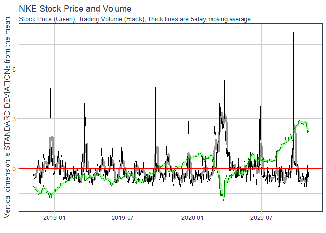

---
title: "Case Study 11 : Interacting with Time"
author: "TomHollinberger"
date: "11/6/2020"
output: 
 html_document: 
   keep_md: yes
   toc: TRUE
   code_folding:  hide
   results: 'hide'
   message: FALSE
   warning: FALSE
---  
THIS RSCRIPT USES ROXYGEN CHARACTERS. <br> 
YOU CAN PRESS ctrl+shift+K AND GO STRAIGHT TO A HTML.  <br>
SKIPS THE HANDWORK OF CREATING A RMD, AFTER THE ORIGINAL WORK IS NONE IN A RSCRIPT.<br>

_________________________________
_________________________________

### DYGRAPHS DESCRIPTION : 
The dygraphs are laid out in a three tier arrangment for easy comparison of growth of a dollar, percent growth, and actual stock price.  
They are syncronized so that a zoom-in on one will automatically be reflected in the other two.
There is a Reset Zoom function that turns-on in the upper left after a zoom has occurred.
The legend has been set to width=100, so that it sits in a vertical column for easier reading.
There is a range-selector at the bottom, which is also syncronized between the three graphs.
The range selector is enlarged and has a red topline for easy "where am I" interpretation.
There is a rolling average selector in the lower left, which is initially set to 5 to help smooth the lines for easier reading.
Data lines are set to magnify when hovered on, and other datalines fade.  
There are also datadots and crosshairs that appear as the mouse hovers.  These aid in reading across to axis values associated with particular datapoints.
Grid color is set to gold, so as to not visually interfere with the datalines or the crosshairs.
The period start date is built-in via formula to the main title.  Note: In this unique case, JCPenney data is incomplete, which hampers the value-growth and percentage growth calculations.

### GGPLOT DESCRIPTION :  
Based on internet research on how to use stock sales volume to inform stock purchases, a template graph was developed.    
This template is applied to each individual stock.  These individual graphs help compare a particular stock sales volume to its share price over time.  
In order to facilitate comparison of stock price and sales volume behaviors, which are usually on vastly different numeric scales, the price and volume amounts were standardized using the "scale" function.
The graphs now show standard deviations from the mean price or mean volume on the vertical dimension.  A red horizontal zero line shows the mean.
At a glance, the reader can see whether they are above or below average price or volume, and the magnitudes are now on comparable scales.  
The daily data is very busy, so 5-day moving average lines are added, using geom_ma, in their corresponding color, but with some transparency.
Visual interpretation and professional judgment can then be applied to make a buy/don't buy recommendations.  
Patterns and relationships between Price and Volume are mentioned in https://www.investopedia.com/articles/technical/02/010702.asp and can be easily identified in the graphs.


```r
######
```

[ ] Use library(dygraphs) to build interactive visualizations of the stock performances over the last 5 years.


```r
# Load packages
library(quantmod)
```

```
## Warning: package 'quantmod' was built under R version 4.0.3
```

```
## Loading required package: xts
```

```
## Warning: package 'xts' was built under R version 4.0.3
```

```
## Loading required package: zoo
```

```
## 
## Attaching package: 'zoo'
```

```
## The following objects are masked from 'package:base':
## 
##     as.Date, as.Date.numeric
```

```
## Loading required package: TTR
```

```
## Warning: package 'TTR' was built under R version 4.0.3
```

```
## Registered S3 method overwritten by 'quantmod':
##   method            from
##   as.zoo.data.frame zoo
```

```
## Version 0.4-0 included new data defaults. See ?getSymbols.
```

```r
library(tidyquant) # to get stock data
```

```
## Warning: package 'tidyquant' was built under R version 4.0.3
```

```
## Loading required package: lubridate
```

```
## 
## Attaching package: 'lubridate'
```

```
## The following objects are masked from 'package:base':
## 
##     date, intersect, setdiff, union
```

```
## Loading required package: PerformanceAnalytics
```

```
## Warning: package 'PerformanceAnalytics' was built under R version 4.0.3
```

```
## 
## Attaching package: 'PerformanceAnalytics'
```

```
## The following object is masked from 'package:graphics':
## 
##     legend
```

```
## == Need to Learn tidyquant? ==================================================================================================================================================================
## Business Science offers a 1-hour course - Learning Lab #9: Performance Analysis & Portfolio Optimization with tidyquant!
## </> Learn more at: https://university.business-science.io/p/learning-labs-pro </>
```

```r
library(tidyverse) # for pipes
```

```
## -- Attaching packages ----------------------------------------------------------------------------------------------------------------------------------------------------- tidyverse 1.3.0 --
```

```
## v ggplot2 3.3.2     v purrr   0.3.4
## v tibble  3.0.3     v dplyr   1.0.0
## v tidyr   1.1.0     v stringr 1.4.0
## v readr   1.3.1     v forcats 0.5.0
```

```
## -- Conflicts -------------------------------------------------------------------------------------------------------------------------------------------------------- tidyverse_conflicts() --
## x lubridate::as.difftime() masks base::as.difftime()
## x lubridate::date()        masks base::date()
## x dplyr::filter()          masks stats::filter()
## x dplyr::first()           masks xts::first()
## x lubridate::intersect()   masks base::intersect()
## x dplyr::lag()             masks stats::lag()
## x dplyr::last()            masks xts::last()
## x lubridate::setdiff()     masks base::setdiff()
## x lubridate::union()       masks base::union()
```

```r
library(dplyr) # for data transformations
library(lubridate) # for date/time functions
library(timetk) # for converting dates to xts
```

```
## Warning: package 'timetk' was built under R version 4.0.3
```

```r
library(dygraphs) # for interactive plots
```

```
## Warning: package 'dygraphs' was built under R version 4.0.3
```

```r
#install this plugin to enable crosshairs
dyCrosshair <- function(dygraph, 
                        direction = c("both", "horizontal", "vertical")) {
  dyPlugin(
    dygraph = dygraph,
    name = "Crosshair",
    path = system.file("plugins/crosshair.js", 
                       package = "dygraphs"),
    options = list(direction = match.arg(direction))
  )
}

#install this plugin to enable UNZOOM
dyUnzoom <-function(dygraph) {
  dyPlugin(
    dygraph = dygraph,
    name = "Unzoom",
    path = system.file("plugins/unzoom.js", package = "dygraphs")
  )
}

# Tickers and Pull Data
#Manually enter tickers
tickers_today <- c("CXW", "F", "GM", "JCPNQ", "KR", "WDC", "NKE","T", "WDAY", "WFC", "WMT")
#note: JCP is JCPNQ while they are in bankruptcy, and has no data until Nov2019
x1 <- tickers_today[1]
x2 <- tickers_today[2]
x3 <- tickers_today[3]
x4 <- tickers_today[4]
x5 <- tickers_today[5]
x6 <- tickers_today[6]
x7 <- tickers_today[7]
x8 <- tickers_today[8]
x9 <- tickers_today[9]
x10 <- tickers_today[10]
x11 <- tickers_today[11]

end <- today() - days(3)    #manually set date window, eg, a rolling two year retrospective, ending three days ago
start <- end - years(2)

x1_prices <- tq_get(x1, get = "stock.prices", from = start, to = end)
x2_prices <- tq_get(x2, get = "stock.prices", from = start, to = end)
x3_prices <- tq_get(x3, get = "stock.prices", from = start, to = end)
x4_prices <- tq_get(x4, get = "stock.prices", from = start, to = end)
x5_prices <- tq_get(x5, get = "stock.prices", from = start, to = end)
x6_prices <- tq_get(x6, get = "stock.prices", from = start, to = end)
x7_prices <- tq_get(x7, get = "stock.prices", from = start, to = end)
x8_prices <- tq_get(x8, get = "stock.prices", from = start, to = end)
x9_prices <- tq_get(x9, get = "stock.prices", from = start, to = end)
x10_prices <- tq_get(x10, get = "stock.prices", from = start, to = end)
x11_prices <- tq_get(x11, get = "stock.prices", from = start, to = end)

My_stockPrices <- bind_rows(x1_prices, x2_prices, x3_prices, x4_prices, x5_prices, x6_prices, x7_prices, x8_prices, x9_prices, x10_prices, x11_prices) %>%
  select(symbol, date, adjusted) %>%
  pivot_wider(names_from = symbol, values_from = adjusted) %>%
  tk_xts(date_var = date)
```

```
## Warning: Non-numeric columns being dropped: date
```

```r
My_stockPrices 
```

```
##                  CXW         F       GM JCPNQ       KR      WDC       NKE
## 2018-11-05 19.979475  8.787239 34.01024    NA 29.31426 45.27693  75.92086
## 2018-11-06 18.636679  8.796461 34.20726    NA 29.52495 45.78251  74.98077
## 2018-11-07 18.807732  8.851785 34.60131    NA 29.99421 45.43609  76.35171
## 2018-11-08 18.970236  8.722695 34.31047    NA 30.02294 44.52793  76.16565
## 2018-11-09 18.687992  8.648931 33.49422    NA 30.06124 42.81461  74.77513
## 2018-11-12 19.423536  8.750357 33.48484    NA 30.04209 40.68932  73.54127
## 2018-11-13 19.278141  8.796461 33.71002    NA 30.05167 41.84091  73.63921
## 2018-11-14 18.867601  8.796461 33.05326    NA 29.13781 42.17795  73.63921
## 2018-11-15 18.602463  8.584388 33.35349    NA 28.88770 43.75085  72.78725
## 2018-11-16 18.320219  8.344650 33.54113    NA 29.08971 43.62913  73.18875
## 2018-11-19 18.303114  8.529062 33.47546    NA 29.39754 42.23413  71.01482
## 2018-11-20 18.174820  8.353872 32.92191    NA 28.46444 42.76779  69.64389
## 2018-11-21 18.149160  8.399974 33.35349    NA 28.40672 43.91001  70.86795
## 2018-11-23 18.439959  8.418415 33.71002    NA 28.56063 44.32196  70.00620
## 2018-11-26 18.747860  8.667371 35.32374    NA 28.44519 44.86498  71.20089
## 2018-11-27 18.277458  8.556725 34.42305    NA 28.89732 45.57653  70.59375
## 2018-11-28 18.747860  8.676593 34.66699    NA 29.09933 45.08033  73.11043
## 2018-11-29 18.824839  8.639710 34.48873    NA 29.20514 42.61799  72.79707
## 2018-11-30 18.773521  8.676593 35.60520    NA 28.53177 42.49628  73.77922
## 2018-12-03 19.064316  8.851785 36.07431    NA 28.62797 43.41380  76.54887
## 2018-12-04 18.337326  8.464518 34.26356    NA 27.55057 40.29610  74.43726
## 2018-12-06 18.961681  8.316989 33.84640    NA 28.43558 40.82040  74.19172
## 2018-12-07 18.918919  8.132576 32.88884    NA 28.06041 39.35048  72.03097
## 2018-12-10 18.722202  7.855958 32.63286    NA 27.69487 39.00407  71.21580
## 2018-12-11 18.576807  7.874399 32.88884    NA 28.12775 38.94790  72.25688
## 2018-12-12 18.362982  7.966605 33.82744    NA 28.61835 38.35806  72.99349
## 2018-12-13 18.397198  7.837517 33.28703    NA 28.62797 37.41245  71.62830
## 2018-12-14 17.969551  7.855958 33.27755    NA 28.42595 36.30768  71.23543
## 2018-12-17 17.037292  7.837517 32.86040    NA 27.81992 35.81147  68.65238
## 2018-12-18 17.182690  7.809855 33.08794    NA 27.46399 36.25151  69.88007
## 2018-12-19 16.053713  7.671545 33.11639    NA 27.15616 34.24794  67.73898
## 2018-12-20 16.438589  7.616223 32.49065    NA 26.62709 34.35092  66.32467
## 2018-12-21 15.745810  7.422589 31.26763    NA 26.35774 33.61129  71.07830
## 2018-12-24 15.138557  7.035324 30.68930    NA 25.58817 32.82484  66.88451
## 2018-12-26 15.514880  7.238178 31.77959    NA 26.67519 34.57562  71.70688
## 2018-12-27 15.087240  7.238178 32.19675    NA 26.33850 35.01221  72.35509
## 2018-12-28 15.506329  7.201295 32.15882    NA 26.53090 34.86985  72.03097
## 2018-12-31 15.620215  7.053765 31.71322    NA 26.45393 35.08814  72.81670
## 2019-01-02 15.225986  7.284280 31.89336    NA 26.26154 36.31247  72.73812
## 2019-01-03 15.339878  7.173633 30.57553    NA 26.30964 33.83533  71.45150
## 2019-01-04 15.690303  7.450252 31.59945    NA 26.60785 35.26847  73.31760
## 2019-01-07 15.918077  7.643884 32.57598    NA 26.85796 36.52128  74.36850
## 2019-01-08 16.426197  7.717649 33.00262    NA 27.37742 36.17010  75.36048
## 2019-01-09 16.653973  8.040372 33.35340    NA 26.98301 37.76459  75.22297
## 2019-01-10 16.899269  7.994267 32.92677    NA 27.39666 37.78358  75.05599
## 2019-01-11 17.074484  8.132576 35.24956    NA 27.34856 37.99237  74.68278
## 2019-01-14 16.557606  8.289328 35.70464    NA 27.22350 36.12265  74.73189
## 2019-01-15 16.794144  8.151017 35.60035    NA 27.53133 35.76200  76.48994
## 2019-01-16 17.162090  7.643884 35.71411    NA 27.60829 35.90436  76.29351
## 2019-01-17 17.056961  7.708428 36.27348    NA 27.82954 34.61359  77.71764
## 2019-01-18 17.074484  7.911282 36.60531    NA 28.31052 37.20463  79.01408
## 2019-01-22 16.724058  7.837517 36.16920    NA 28.20470 35.64811  79.30872
## 2019-01-23 16.732819  7.689988 35.71411    NA 28.12775 35.70505  79.06319
## 2019-01-24 16.811665  7.929724 36.17868    NA 27.61791 38.09678  79.00426
## 2019-01-25 16.794144  8.169458 36.63375    NA 27.05035 40.96305  79.17122
## 2019-01-28 16.855467  7.985046 36.46310    NA 27.14655 41.76029  78.88639
## 2019-01-29 17.197130  8.077253 36.47258    NA 27.01187 40.38410  78.78818
## 2019-01-30 17.144569  8.171064 37.06039    NA 27.18502 41.59895  79.82926
## 2019-01-31 17.407387  8.255496 36.99402    NA 27.25236 42.69990  80.41855
## 2019-02-01 17.083244  8.180448 36.76648    NA 27.00225 44.60759  80.05516
## 2019-02-04 17.494995  8.161684 36.90870    NA 27.05035 45.41432  80.52658
## 2019-02-05 17.573837  8.208590 37.25949    NA 27.22350 44.99672  81.38107
## 2019-02-06 17.459953  8.180448 37.83781    NA 27.21389 45.55668  81.23373
## 2019-02-07 17.643927  7.795816 36.64324    NA 27.10807 43.52562  80.91945
## 2019-02-08 17.766575  7.870865 36.69064    NA 26.77138 44.33234  80.88999
## 2019-02-11 17.775335  7.814578 36.62427    NA 26.50203 43.59205  82.18642
## 2019-02-12 17.530037  7.936534 37.00350    NA 27.49285 44.85435  83.19804
## 2019-02-13 17.600122  7.889627 36.97506    NA 27.85840 45.26247  83.87573
## 2019-02-14 17.521276  7.899010 36.87077    NA 27.99373 45.53770  83.16858
## 2019-02-15 17.819138  8.011583 37.06039    NA 28.51571 45.22450  83.85608
## 2019-02-19 17.933025  8.283641 37.47754    NA 28.56404 45.55668  83.06055
## 2019-02-20 18.695200  8.386833 37.87573    NA 27.79073 45.99327  83.32572
## 2019-02-21 18.958021  8.171064 37.56287    NA 27.62641 44.78791  82.45161
## 2019-02-22 19.308447  8.171064 37.91366    NA 27.56841 46.97084  83.24715
## 2019-02-25 19.247120  8.217972 38.05587    NA 27.88740 48.74565  83.64983
## 2019-02-26 18.922979  8.330546 38.02743    NA 27.95506 48.37550  84.26860
## 2019-02-27 18.800329  8.236733 37.92314    NA 28.80570 46.06920  84.63199
## 2019-02-28 18.555031  8.227353 37.43014    NA 28.35138 47.73960  84.19984
## 2019-03-01 18.213367  8.246116 37.47754    NA 27.08509 49.03038  85.82456
## 2019-03-04 18.458664  8.264878 37.21208    NA 27.68440 49.93202  84.32785
## 2019-03-05 18.292212  8.227353 37.24052    NA 27.95506 48.15721  84.13090
## 2019-03-06 17.451189  8.049109 36.66219    NA 27.49108 45.67058  83.82566
## 2019-03-07 17.179613  7.955296 36.42283    NA 24.75550 44.59809  83.95367
## 2019-03-08 17.065722  7.899010 36.37495    NA 23.65354 45.06315  83.50071
## 2019-03-11 17.311022  8.077252 36.97817    NA 23.84686 47.13219  84.50509
## 2019-03-12 17.074484  8.039727 36.97817    NA 23.66321 46.64814  84.12106
## 2019-03-13 16.846706  8.002203 37.15051    NA 23.90486 46.49629  84.61341
## 2019-03-14 16.820425  7.889627 36.41325    NA 23.92420 45.15806  85.53900
## 2019-03-15 16.759100  7.908391 36.45155    NA 23.54721 45.65159  85.47008
## 2019-03-18 16.759100  8.039727 36.36538    NA 23.73087 45.83192  86.47444
## 2019-03-19 16.706537  8.161684 36.64305    NA 23.51821 45.44279  86.34644
## 2019-03-20 16.618931  7.983441 35.42704    NA 23.18955 44.76893  85.36176
## 2019-03-21 17.074484  8.152303 35.76215    NA 23.50854 49.14427  86.66153
## 2019-03-22 16.811665  8.011583 34.89085    NA 23.52788 45.92683  80.93071
## 2019-03-25 16.802904  7.983441 35.18766    NA 23.34421 45.45228  81.06856
## 2019-03-26 17.109528  8.217972 35.30256    NA 23.65354 44.68352  82.10246
## 2019-03-27 16.978115  8.086635 35.05362    NA 23.46022 43.07005  81.81692
## 2019-03-28 17.293499  8.227353 35.48449    NA 23.62454 43.90496  82.75236
## 2019-03-29 17.427906  8.236733 35.52278    NA 23.77920 46.12180  82.91976
## 2019-04-01 17.669834  8.424358 36.15473    NA 23.66321 47.32140  83.92413
## 2019-04-02 17.616072  8.452501 36.20260    NA 22.96723 48.34824  83.07731
## 2019-04-03 17.786318  8.565078 36.75794    NA 23.00589 49.91251  83.17577
## 2019-04-04 17.974485  8.668272 37.14094    NA 22.88990 49.32711  83.97336
## 2019-04-05 18.216415  8.677652 37.28456    NA 23.10255 49.94130  84.09153
## 2019-04-08 18.198496  8.724559 37.39946    NA 23.06389 49.50944  83.43180
## 2019-04-09 17.875925  8.640128 37.20797    NA 23.14122 48.08913  82.98868
## 2019-04-10 18.225378  8.752703 37.58138    NA 24.14652 48.64573  83.57949
## 2019-04-11 18.162653  8.808990 37.65798    NA 24.88116 48.78009  83.69765
## 2019-04-12 18.234337  8.865276 38.02182    NA 24.81350 49.73976  84.91865
## 2019-04-15 18.458347  8.752703 37.88778    NA 24.62017 49.76855  85.49962
## 2019-04-16 18.126812  8.780846 37.97395    NA 24.71684 52.10055  86.45474
## 2019-04-17 18.395622  8.912184 38.28992    NA 24.68784 52.25411  87.37051
## 2019-04-18 18.512108  8.959090 38.58674    NA 24.91983 53.15619  87.83330
## 2019-04-22 18.234337  8.912184 37.82075    NA 24.64917 52.02378  86.02150
## 2019-04-23 18.368742  9.055160 38.13673    NA 24.37852 52.25411  86.09042
## 2019-04-24 18.422503  9.121881 38.03140    NA 24.71684 51.76467  87.03571
## 2019-04-25 18.225378  8.959842 37.44733    NA 24.91016 50.81459  86.21843
## 2019-04-26 18.422503  9.922548 37.99311    NA 24.16586 48.86646  86.95694
## 2019-04-29 18.314980  9.836762 38.30907    NA 24.71684 48.43461  86.90771
## 2019-04-30 18.646513  9.960675 37.29414    NA 24.91983 49.05839  86.48430
## 2019-05-01 18.933245  9.817699 37.10263    NA 24.72650 48.75130  84.58386
## 2019-05-02 18.583792  9.855827 36.62389    NA 24.91983 47.75324  83.96351
## 2019-05-03 19.085571  9.922548 37.15051    NA 24.88116 48.75130  84.38691
## 2019-05-06 19.166214  9.884421 36.47069    NA 24.85216 47.56131  82.28955
## 2019-05-07 18.556910  9.893953 36.89199    NA 24.91016 45.30608  81.27535
## 2019-05-08 18.288097  9.855827 36.58559    NA 24.43651 44.81665  81.50182
## 2019-05-09 19.345423  9.722382 35.98238    NA 24.51384 44.54794  81.70860
## 2019-05-10 19.605270  9.893953 36.27920    NA 24.96816 44.01053  82.66373
## 2019-05-13 19.435026  9.608002 35.00574    NA 24.54284 41.25627  81.26550
## 2019-05-14 19.354383  9.760509 35.46534    NA 24.54284 42.83013  82.38802
## 2019-05-15 19.551510  9.874889 35.78130    NA 24.50396 43.65545  82.72282
## 2019-05-16 19.829279  9.913016 35.79088    NA 23.96937 43.27158  82.98868
## 2019-05-17 19.784479  9.808168 35.42704    NA 23.54169 42.83013  83.27425
## 2019-05-20 19.856161  9.798635 35.39831    NA 23.39589 40.25821  81.58060
## 2019-05-21 20.062250  9.760509 35.55151    NA 23.61945 41.69772  82.35848
## 2019-05-22 20.017450  9.503152 34.03868    NA 23.32785 40.48853  81.92523
## 2019-05-23 19.981607  9.388772 33.63654    NA 22.87101 39.81676  81.37381
## 2019-05-24 20.008490  9.369707 33.62696    NA 23.05569 39.32733  80.90118
## 2019-05-28 19.721756  9.322048 33.36843    NA 22.95849 37.98379  79.95587
## 2019-05-29 19.452944  9.255326 33.31099    NA 22.38501 38.06056  77.66158
## 2019-05-30 19.488789  9.283922 33.33972    NA 22.14202 37.86863  78.04559
## 2019-05-31 19.623194  9.074224 31.92263    NA 22.17117 35.71896  76.16949
## 2019-06-03 19.282700  9.160008 32.26733    NA 22.31697 35.58461  76.97919
## 2019-06-04 19.390224  9.455493 34.21102    NA 22.96821 37.56153  80.59314
## 2019-06-05 19.372303  9.322048 34.31635    NA 22.71549 36.37154  81.67931
## 2019-06-06 19.820322  9.293454 34.05506    NA 23.03625 36.45791  81.41269
## 2019-06-07 20.411705  9.302985 34.34538    NA 23.25981 35.45026  82.36061
## 2019-06-10 20.716358  9.360175 34.84861    NA 23.70693 36.44832  81.54106
## 2019-06-11 21.083733  9.455493 35.03249    NA 23.96937 36.86097  82.21252
## 2019-06-12 21.262938  9.388772 34.51958    NA 23.94020 34.77849  81.59042
## 2019-06-13 21.504869  9.588937 34.85829    NA 23.93049 35.83413  82.55810
## 2019-06-14 21.325663  9.512683 34.50990    NA 23.58057 34.86486  82.39024
## 2019-06-17 21.460068  9.579405 34.97442    NA 23.67777 34.80728  81.07697
## 2019-06-18 21.567591  9.627065 35.51636    NA 23.26953 36.57307  83.23943
## 2019-06-19 21.415266  9.569874 35.59378    NA 22.97793 37.27363  82.49886
## 2019-06-20 21.325663  9.569874 35.76797    NA 22.48222 38.04137  84.16760
## 2019-06-21 20.044331  9.522215 35.72926    NA 21.61714 38.42524  84.67118
## 2019-06-24 19.883043  9.484088 35.76797    NA 21.46162 39.37531  83.43690
## 2019-06-25 19.372303  9.379239 36.46475    NA 21.23806 39.44249  81.58056
## 2019-06-26 18.521069  9.445961 36.90024    NA 20.82982 42.32150  81.51144
## 2019-06-27 18.673395  9.722382 37.08411    NA 20.79095 43.24365  82.60748
## 2019-06-28 19.002924  9.750978 37.28733    NA 21.10198 46.15568  82.89383
## 2019-07-01 18.490324  9.674723 37.50024    NA 20.99506 48.19410  84.33546
## 2019-07-02 18.490324  9.646129 37.10347    NA 20.83955 46.91281  83.89112
## 2019-07-03 18.435400  9.722382 36.92927    NA 20.94646 46.53424  85.11552
## 2019-07-05 18.545242  9.722382 37.25831    NA 21.14086 47.09724  85.72772
## 2019-07-08 18.435400  9.722382 36.99701    NA 21.18946 48.40765  87.36684
## 2019-07-09 17.977718  9.665193 36.85185    NA 21.10198 49.97044  86.93237
## 2019-07-10 17.703110  9.636596 36.87121    NA 21.04366 52.45537  86.33991
## 2019-07-11 16.650444  9.712851 37.19056    NA 21.15058 52.66891  87.17922
## 2019-07-12 16.641291  9.998802 37.94540    NA 21.27694 53.67842  87.99879
## 2019-07-15 16.412449  9.932080 38.09057    NA 21.46162 53.03777  88.35426
## 2019-07-16 15.991382 10.017866 38.15831    NA 21.34498 49.98015  87.48532
## 2019-07-17 16.119534  9.846294 37.89702    NA 21.03394 49.98015  86.39916
## 2019-07-18 15.561162  9.779572 37.85831    NA 21.05338 51.32938  86.33991
## 2019-07-19 15.222476  9.722382 38.20670    NA 21.08254 50.92170  85.46112
## 2019-07-22 14.883794  9.693360 38.57444    NA 20.27579 53.68813  84.88842
## 2019-07-23 15.414704  9.838470 39.39703    NA 20.23691 54.33848  85.60922
## 2019-07-24 15.021098  9.993254 39.56155    NA 20.64514 55.67802  85.60922
## 2019-07-25 14.462727  9.248356 39.43574    NA 20.54795 55.29945  86.18193
## 2019-07-26 14.810565  9.258030 39.45509    NA 20.87843 54.84323  86.43866
## 2019-07-29 14.838025  9.287052 39.36800    NA 20.82982 54.15406  86.51765
## 2019-07-30 15.167556  9.238682 39.12606    NA 20.82982 54.93059  86.10294
## 2019-07-31 15.533700  9.219334 39.03896    NA 20.56739 52.30977  84.94765
## 2019-08-01 15.158401  9.006506 38.85509    NA 20.91730 53.88227  82.07428
## 2019-08-02 15.195017  8.977483 38.49702    NA 21.61714 52.79510  80.11919
## 2019-08-05 15.378087  8.929112 37.75185    NA 21.30610 51.20319  77.97648
## 2019-08-06 15.963923  9.170962 37.81960    NA 21.65602 52.00886  80.27717
## 2019-08-07 16.229376  9.219334 38.11960    NA 23.23065 51.28085  80.25741
## 2019-08-08 16.494831  9.248356 38.80670    NA 22.69605 53.58136  81.95579
## 2019-08-09 16.192762  9.141941 38.33250    NA 22.66689 52.66891  80.94862
## 2019-08-12 16.156147  8.987157 37.60670    NA 22.42390 52.58156  80.62277
## 2019-08-13 16.265991  8.958136 37.75185    NA 22.40445 53.96962  82.27174
## 2019-08-14 15.725927  8.706611 35.99056    NA 21.64100 52.83393  80.01056
## 2019-08-15 15.753386  8.571175 35.29378    NA 21.75846 52.47478  78.50969
## 2019-08-16 16.174456  8.667914 35.80668    NA 22.17933 53.57165  79.27000
## 2019-08-19 16.064611  8.735632 36.15507    NA 22.50233 55.57124  80.10930
## 2019-08-20 15.890693  8.667914 35.76797    NA 22.42403 54.54232  79.51685
## 2019-08-21 15.854078  8.745307 35.92281    NA 22.84491 54.69763  81.69904
## 2019-08-22 15.817463  8.745307 36.05830    NA 23.16791 55.25092  82.26188
## 2019-08-23 15.268246  8.484109 34.89700    NA 22.79597 53.02807  79.42799
## 2019-08-26 15.762540  8.532478 35.08087    NA 23.41261 53.03777  81.21522
## 2019-08-27 15.240785  8.474435 34.73248    NA 22.62958 51.11584  80.99798
## 2019-08-28 15.579469  8.706611 35.26474    NA 23.01131 51.87296  82.42973
## 2019-08-29 15.634392  8.822700 35.71959    NA 23.16791 53.46487  84.30583
## 2019-08-30 15.515394  8.871069 35.89378    NA 23.17770 55.59066  83.65245
## 2019-09-03 15.771696  8.803351 35.71959    NA 23.50070 55.78479  83.82075
## 2019-09-04 15.908998  8.900091 37.00669    NA 24.13691 57.59025  85.48389
## 2019-09-05 15.918152  9.035527 37.85708    NA 24.30330 60.13342  87.53314
## 2019-09-06 15.835769  9.035527 37.90595    NA 24.17606 60.41492  87.80044
## 2019-09-09 16.110380  9.229008 38.68792    NA 24.65567 60.90996  87.78062
## 2019-09-10 16.384987  9.112919 38.68792    NA 25.27230 60.44404  85.95908
## 2019-09-11 16.751133  9.112919 38.57062    NA 25.02761 62.41452  85.87988
## 2019-09-12 16.531445  9.103246 38.18942    NA 25.04718 62.80278  86.79067
## 2019-09-13 16.302603  9.141941 37.98415    NA 25.67361 62.70571  86.44418
## 2019-09-16 16.384987  8.996831 36.37134    NA 25.42891 61.14293  86.39467
## 2019-09-17 16.073763  8.977483 37.42700    NA 25.10591 62.03595  86.71146
## 2019-09-18 16.018845  8.948462 37.31948    NA 24.68503 61.69621  87.19654
## 2019-09-19 15.863232  8.803351 36.92849    NA 25.27230 60.81289  86.82036
## 2019-09-20 15.890693  8.871069 36.52773    NA 25.13528 58.90066  85.81059
## 2019-09-23 15.606929  8.861395 36.40066    NA 25.17443 59.20157  86.81046
## 2019-09-24 15.826618  8.813025 35.94125    NA 25.26252 57.83292  86.30557
## 2019-09-25 16.558908  8.900091 36.27359    NA 25.22336 59.25981  89.89916
## 2019-09-26 16.320913  8.842048 36.76232    NA 25.23316 59.98782  91.24552
## 2019-09-27 16.220221  8.784003 36.57661    NA 25.19400 58.71624  91.38412
## 2019-09-30 16.220222  8.861395 36.63525    NA 25.23316 57.89116  92.97797
## 2019-10-01 15.253392  8.609870 35.29613    NA 25.04718 56.87195  91.35442
## 2019-10-02 14.906084  8.329324 33.89836    NA 24.51864 55.15385  90.57234
## 2019-10-03 15.093819  8.426064 34.19160    NA 24.06840 56.58362  91.29502
## 2019-10-04 15.412967  8.455086 34.12318    NA 24.26415 57.35726  92.13649
## 2019-10-07 15.262779  8.397042 33.96679    NA 24.31309 56.78928  92.23550
## 2019-10-08 14.849764  8.261606 33.11639    NA 23.94115 54.37042  90.82974
## 2019-10-09 14.652643  8.280955 33.37053    NA 24.00967 55.35950  91.59201
## 2019-10-10 14.173923  8.338999 33.87881    NA 23.33431 56.15273  92.06720
## 2019-10-11 14.586936  8.493782 34.76830    NA 23.73561 57.14182  92.93837
## 2019-10-14 14.708963  8.532478 34.69988    NA 23.58879 58.05256  93.92834
## 2019-10-15 14.464910  8.774328 35.44275    NA 23.79433 59.56068  93.83925
## 2019-10-16 14.371043  8.774328 35.82396    NA 23.99009 58.22883  93.92834
## 2019-10-17 14.596323  8.813025 35.37432    NA 23.91179 58.38552  94.60152
## 2019-10-18 14.389815  8.987157 35.35478    NA 23.43218 56.92637  95.13610
## 2019-10-21 14.568164  8.878997 35.12019    NA 23.59858 57.38664  95.25491
## 2019-10-22 14.971791  8.918327 35.49162    NA 24.32288 57.64126  94.64111
## 2019-10-23 15.206460  9.055987 35.78487    NA 24.45012 56.45631  91.39402
## 2019-10-24 14.915471  8.456188 35.01267    NA 24.40118 58.28759  90.58225
## 2019-10-25 14.859151  8.574182 35.91193    NA 24.74376 59.96218  90.00806
## 2019-10-28 14.643257  8.466020 35.81419    NA 24.79270 61.43113  89.93875
## 2019-10-29 14.521230  8.495519 37.34880    NA 24.10755 61.48988  88.38451
## 2019-10-30 14.521230  8.397191 37.05556    NA 24.21521 60.87293  89.28539
## 2019-10-31 14.324109  8.446355 36.32246    NA 24.11733 50.58055  88.65180
## 2019-11-01 14.746511  8.741339 37.11421    NA 24.45991 52.71541  88.28552
## 2019-11-04 15.150138  8.849499 37.52475    NA 24.45991 53.82201  88.95869
## 2019-11-05 14.896698  8.869164 37.36835    NA 27.23967 53.01899  88.97849
## 2019-11-06 14.624483  8.770837 37.55407    NA 26.42727 52.60769  88.58250
## 2019-11-07 14.953018  8.741339 37.62249    NA 26.29024 52.13763  89.49329
## 2019-11-08 15.159526  8.888829 37.79843    NA 26.44685 50.94289  88.90919
## 2019-11-11 14.962404  8.928161 37.84730    NA 26.04555 50.91351  89.14680
## 2019-11-12 14.924858  8.888829 37.72023    NA 26.42727 51.45212  88.60229
## 2019-11-13 14.662030  8.662676 36.35179    NA 26.48600 49.96359  90.37434
## 2019-11-14 14.774671  8.643010 35.97058    NA 26.49585 49.33684  90.35455
## 2019-11-15 14.502456  8.800335 36.05855    NA 26.33831 49.29767  92.10680
## 2019-11-18 14.511843  8.800335 35.79464    NA 26.59431 48.48486  93.23536
## 2019-11-19 14.417975  8.751170 35.56005    NA 26.45646 46.53606  92.67108
## 2019-11-20 14.371043  8.584013 34.48484  1.11 26.18077 47.49577  92.11670
## 2019-11-21 14.164535  8.564348 33.88859  1.08 26.28908 46.84943  91.23563
## 2019-11-22 14.145761  8.741339 34.53371  1.10 26.63369 47.45660  92.40379
## 2019-11-25 14.164535  8.849499 35.00290  1.15 26.58446 48.72968  91.96820
## 2019-11-26 14.361655  8.859331 35.10064  1.17 26.62385 47.70142  92.39389
## 2019-11-27 14.455523  8.947826 35.32545  1.11 26.81092 49.36622  93.19576
## 2019-11-29 14.220855  8.908496 35.18861  1.13 26.91923 49.28788  92.79378
## 2019-12-02 14.004960  8.859331 35.07132  1.10 27.31307 47.49577  92.86326
## 2019-12-03 14.033121  8.741339 34.72920  1.13 26.96846 46.72213  91.77145
## 2019-12-04 14.173923  8.800335 34.99311  1.14 27.21461 46.45772  93.02207
## 2019-12-05 13.948640  8.780669 34.88444  1.10 26.38754 46.40876  95.07665
## 2019-12-06 14.126988  8.869164 35.11167  1.13 27.06692 48.06376  96.27764
## 2019-12-09 14.427362  8.859331 34.95360  1.14 27.41154 47.06488  95.91039
## 2019-12-10 14.324109  8.918327 34.68686  1.17 27.44107 48.22045  96.28757
## 2019-12-11 14.164535  8.957659 34.81529  1.13 27.58876 50.01255  96.45631
## 2019-12-12 14.399202  9.164147 35.66492  1.13 27.76600 52.61748  96.99228
## 2019-12-13 14.943631  9.075652 35.22035  1.11 27.65769 53.17567  97.04191
## 2019-12-16 15.056273  9.232977 35.67480  1.10 27.87430 55.33012  98.07416
## 2019-12-17 15.694568  9.232977 35.87239  1.06 28.25830 56.05480  98.90791
## 2019-12-18 15.994943  9.380468 36.86034  1.06 27.89399 56.04501  99.82105
## 2019-12-19 16.032490  9.252643 36.81094  1.09 28.31737 57.55312 100.39674
## 2019-12-20 16.370411  9.321471 36.80106  1.08 28.55368 59.84467  99.21560
## 2019-12-23 16.257771  9.282141 36.32685  1.10 28.44537 61.40175  99.29501
## 2019-12-24 16.276543  9.311640 36.13914  1.10 28.65214 60.94148  99.39426
## 2019-12-26 16.576918  9.291973 36.04034  1.15 28.44537 61.49968  99.96001
## 2019-12-27 16.445505  9.203478 36.11938  1.14 28.31737 60.84355 100.81361
## 2019-12-30 16.285931  9.095318 36.00082  1.11 28.61276 61.08837 100.04935
## 2019-12-31 16.314089  9.144482 36.15889  1.12 28.54384 62.15580 100.55554
## 2020-01-02 16.210836  9.262475 36.92950  1.12 28.21892 64.77155 101.43891
## 2020-01-03 15.526958  9.055987 35.88227  1.10 28.25830 63.77460 101.16100
## 2020-01-06 15.498060  9.006823 35.40806  1.12 28.35676 62.55063 101.07168
## 2020-01-07 15.430635  9.095318 34.72638  1.18 28.14999 66.78516 101.02204
## 2020-01-08 15.392107  9.095318 34.23240  1.20 27.98261 67.75249 100.79376
## 2020-01-09 14.987559  9.105151 34.65722  1.07 28.00230 67.73275 100.72428
## 2020-01-10 15.026088  9.095318 34.23240  1.01 27.92353 67.06155 100.14861
## 2020-01-13 15.295786  9.085485 34.55842  0.85 27.98261 68.23615 101.39922
## 2020-01-14 15.642542  9.134649 34.72638  0.80 28.39614 68.31512 102.15356
## 2020-01-15 15.825552  9.036321 34.72638  0.77 27.85461 65.80796 102.02452
## 2020-01-16 15.989298  9.016656 35.12155  0.84 27.64784 67.78210 102.60020
## 2020-01-17 15.604014  9.006823 35.17095  0.85 27.71676 67.37740 103.75156
## 2020-01-21 15.594381  9.055987 34.56830  0.81 27.97276 67.90055 103.80119
## 2020-01-22 15.546220  9.006823 34.48927  0.79 27.93338 67.78210 103.71186
## 2020-01-23 15.729231  8.987158 34.45963  0.81 28.00230 70.01288 102.25281
## 2020-01-24 15.632909  8.849499 33.89650  0.80 27.75615 68.62111 101.27018
## 2020-01-27 15.623277  8.741339 33.00734  0.79 27.89399 65.79810  99.49351
## 2020-01-28 15.950768  8.820001 33.23457  0.80 27.89399 67.52547  99.66225
## 2020-01-29 15.815920  8.860000 33.19505  0.80 27.02754 65.89680  99.09648
## 2020-01-30 15.815920  8.840000 32.92831  0.78 27.12600 66.09422  97.45879
## 2020-01-31 15.363211  8.820000 32.98758  0.75 26.44662 64.65309  95.58286
## 2020-02-03 15.459531  8.980000 33.31361  0.71 26.56477 66.37059  98.53074
## 2020-02-04 15.777390  9.180000 33.95577  0.71 26.96846 67.54520 100.62502
## 2020-02-05 16.201204  8.310000 34.60782  0.73 27.64784 67.22935  99.79128
## 2020-02-06 16.220469  8.250000 33.91626  0.73 27.61830 67.81171  99.52329
## 2020-02-07 15.979666  8.110000 33.22469  0.69 27.52969 66.16331  98.69948
## 2020-02-10 16.162676  8.060000 33.83722  0.71 27.70692 67.14050  99.27515
## 2020-02-11 16.326422  8.100000 34.58806  0.71 28.00230 68.02887  99.27515
## 2020-02-12 16.750233  8.240000 35.06227  0.74 28.24845 69.44038 102.23296
## 2020-02-13 16.278261  8.250000 34.86469  0.72 28.34746 68.68034 102.60020
## 2020-02-14 16.230101  8.100000 34.34107  0.71 27.95141 68.35461 102.76894
## 2020-02-18 16.326422  8.060000 33.99529  0.71 29.41681 67.42676 101.24041
## 2020-02-19 16.143412  8.000000 34.49914  0.71 29.24849 68.66059 101.69698
## 2020-02-20 16.576855  8.030000 34.86469  0.77 29.48612 68.16706 101.76646
## 2020-02-21 16.759867  7.890000 34.23240  0.72 30.01088 66.11396  99.50343
## 2020-02-24 16.220469  7.570000 32.69120  0.69 29.97128 62.73817  95.19576
## 2020-02-25 15.266890  7.230000 31.36735  0.70 29.37720 58.76028  92.20818
## 2020-02-26 15.536588  7.210000 31.61434  0.73 28.46628 58.84912  91.31487
## 2020-02-27 15.180201  6.970000 30.33988  0.69 28.08013 54.45665  87.89056
## 2020-02-28 14.265151  6.960000 30.13241  0.69 27.85240 54.84161  88.96052
## 2020-03-02 15.488428  7.200000 31.04133  0.69 29.38710 59.26369  92.24504
## 2020-03-03 15.132040  6.970000 30.15217  0.66 29.05046 56.19390  90.50324
## 2020-03-04 15.931506  7.080000 31.15000  0.65 30.65447 58.37532  93.34983
## 2020-03-05 15.738863  6.740000 30.10000  0.62 33.13970 56.96381  90.15489
## 2020-03-06 15.565485  6.490000 28.69000  0.61 31.72382 54.02235  87.94531
## 2020-03-09 14.255519  5.900000 24.69000  0.59 30.94161 46.78713  83.71526
## 2020-03-10 14.159197  6.260000 27.12000  0.57 32.27829 49.30415  87.88559
## 2020-03-11 12.743278  5.900000 26.00000  0.50 30.28812 44.55634  83.60577
## 2020-03-12 10.431572  5.350000 23.04000  0.41 28.83263 38.60431  73.85176
## 2020-03-13 11.654850  5.630000 24.71000  0.60 30.40694 41.27927  75.22530
## 2020-03-16 10.171505  5.010000 21.00000  0.54 30.79309 32.83982  66.47655
## 2020-03-17 11.385150  5.010000 20.32000  0.51 32.67434 33.60974  69.51222
## 2020-03-18  8.803746  4.500000 16.80000  0.41 33.57536 28.81258  67.72068
## 2020-03-19  9.603211  4.470000 17.71000  0.50 33.84270 30.93478  70.00988
## 2020-03-20  9.535786  4.330000 18.14000  0.45 31.45648 30.64852  67.13344
## 2020-03-23  8.408829  4.010000 17.60000  0.40 30.77329 33.92560  62.50527
## 2020-03-24  9.757324  4.950000 21.11000  0.44 29.85246 39.94673  71.99055
## 2020-03-25  9.892175  5.390000 21.49000  0.42 27.66428 41.09173  78.63919
## 2020-03-26 10.739799  5.250000 22.56000  0.40 28.71381 43.71733  83.90437
## 2020-03-27 10.999866  5.190000 21.38000  0.38 28.84253 41.70371  82.83939
## 2020-03-30 11.520000  5.030000 21.32000  0.37 29.35740 42.94742  84.97929
## 2020-03-31 11.170000  4.830000 20.78000  0.36 29.82276 41.08186  82.35168
## 2020-04-01 10.080000  4.400000 19.26000  0.33 30.19901 38.17000  78.85816
## 2020-04-02  9.780000  4.360000 18.19000  0.30 31.28816 38.40000  79.76389
## 2020-04-03  8.980000  4.240000 18.04000  0.27 31.97135 38.21000  78.48990
## 2020-04-06  9.600000  4.530000 19.55000  0.32 32.30799 43.31000  84.23281
## 2020-04-07  9.480000  4.710000 21.30000  0.32 31.54559 42.86000  83.76502
## 2020-04-08 10.340000  5.030000 23.13000  0.33 30.71388 45.34000  84.89967
## 2020-04-09 11.260000  5.370000 24.06000  0.34 30.75349 45.05000  86.38268
## 2020-04-13 12.020000  5.160000 23.01000  0.33 31.02082 43.76000  84.06361
## 2020-04-14 12.480000  5.290000 22.98000  0.32 31.77332 44.77000  87.05949
## 2020-04-15 11.960000  5.030000 21.66000  0.23 31.71391 42.65000  84.64089
## 2020-04-16 11.390000  4.940000 20.87000  0.25 31.63470 41.08000  85.89497
## 2020-04-17 11.640000  5.120000 22.48000  0.28 31.61490 42.32000  89.48804
## 2020-04-20 11.420000  4.980000 22.38000  0.25 31.61490 39.55000  87.48747
## 2020-04-21 11.100000  4.770000 21.24000  0.26 31.85253 37.83000  84.80013
## 2020-04-22 11.100000  4.770000 21.30000  0.25 31.99115 39.93000  88.35339
## 2020-04-23 10.930000  4.890000 21.52000  0.28 32.55553 39.39000  86.94005
## 2020-04-24 11.160000  4.870000 21.95000  0.24 32.63473 40.69000  87.95526
## 2020-04-27 11.840000  5.170000 22.45000  0.25 32.95158 43.09000  88.95057
## 2020-04-28 12.500000  5.380000 22.18000  0.28 32.04066 44.70000  88.38325
## 2020-04-29 13.210000  5.260000 23.78000  0.26 31.20895 47.73000  87.65667
## 2020-04-30 13.120000  5.090000 22.29000  0.25 31.29806 46.08000  86.77084
## 2020-05-01 12.160000  4.920000 20.90000  0.24 31.64460 40.48000  85.13854
## 2020-05-04 11.720000  4.860000 20.75000  0.24 32.20898 39.67000  85.34756
## 2020-05-05 11.810000  4.970000 21.26000  0.21 32.48622 40.34000  86.79075
## 2020-05-06 11.540000  4.870000 21.89000  0.19 32.45651 40.63000  88.02493
## 2020-05-07 11.000000  4.870000 22.44000    NA 32.35750 41.85000  88.14436
## 2020-05-08 12.330000  5.240000 23.93000    NA 33.01099 44.20000  90.03545
## 2020-05-11 11.650000  5.120000 22.80000    NA 33.39714 42.39000  90.50324
## 2020-05-12 11.000000  4.980000 22.56000    NA 33.21891 40.98000  87.84578
## 2020-05-13 10.330000  4.720000 21.46000    NA 33.76349 39.25000  85.61629
## 2020-05-14 10.050000  4.890000 22.31000    NA 32.60952 40.34000  86.14381
## 2020-05-15 10.240000  4.900000 22.63000    NA 32.34092 39.21000  86.58173
## 2020-05-18 11.620000  5.310000 24.81000    NA 32.09222 42.38000  90.61273
## 2020-05-19 11.060000  5.300000 24.69000  0.11 31.59482 41.74000  91.08053
## 2020-05-20 11.430000  5.490000 25.48000  0.19 32.13201 42.98000  92.51377
## 2020-05-21 11.580000  5.630000 25.80000  0.15 31.95295 42.69000  93.81762
## 2020-05-22 11.480000  5.650000 25.98000  0.16 32.20165 42.42000  93.31001
## 2020-05-26 12.230000  5.840000 27.40000  0.16 31.20685 45.07000  96.16655
## 2020-05-27 13.070000  6.030000 27.79000  0.18 33.10692 46.01000  99.40130
## 2020-05-28 12.560000  5.850000 26.68000  0.19 31.89326 43.62000  97.99790
## 2020-05-29 12.030000  5.710000 25.88000  0.22 32.45035 44.37000  98.36211
## 2020-06-01 12.550000  5.870000 26.94000  0.21 32.32103 43.08000  99.31998
## 2020-06-02 12.200000  5.900000 27.41000  0.21 32.82837 44.00000 100.51733
## 2020-06-03 12.970000  6.190000 29.07000  0.20 32.51004 45.44000 103.87987
## 2020-06-04 12.930000  6.570000 29.16000  0.21 32.93780 45.98000 101.05613
## 2020-06-05 13.790000  7.340000 30.61000  0.32 32.31108 48.46000 102.48297
## 2020-06-08 13.960000  7.530000 30.68000  0.63 32.83832 48.53000 104.05948
## 2020-06-09 14.160000  7.240000 29.86000  0.43 32.74879 47.83000 102.40314
## 2020-06-10 13.220000  6.810000 28.75000  0.30 32.40061 46.85000 101.89428
## 2020-06-11 11.960000  6.130000 26.50000  0.33 32.52993 42.35000  94.95963
## 2020-06-12 12.380000  6.460000 27.96000  0.32 32.09222 42.95000  96.21685
## 2020-06-15 12.500000  6.500000 27.77000  0.37 31.91316 42.93000  97.62373
## 2020-06-16 12.520000  6.550000 27.78000  0.39 32.36082 44.47000  98.82108
## 2020-06-17 10.430000  6.330000 27.16000  0.35 32.63936 43.71000  98.99071
## 2020-06-18 10.190000  6.330000 27.09000  0.32 31.64456 42.82000  98.23238
## 2020-06-19  9.840000  6.230000 26.59000  0.34 32.07233 44.39000  95.56829
## 2020-06-22 10.100000  6.280000 26.37000  0.34 31.90321 45.11000  99.29005
## 2020-06-23  9.730000  6.150000 26.25000  0.31 31.93305 43.51000 101.69472
## 2020-06-24  9.350000  5.950000 25.28000  0.28 32.64931 42.25000  99.85879
## 2020-06-25  9.450000  6.030000 25.23000  0.27 32.60952 42.57000 101.17587
## 2020-06-26  9.020000  5.910000 24.46000  0.27 32.51004 40.87000  93.46295
## 2020-06-29  9.530000  6.010000 25.30000  0.34 33.95250 41.99000  95.65810
## 2020-06-30  9.360000  6.080000 25.30000  0.33 33.67395 44.15000  97.83328
## 2020-07-01  9.400000  5.980000 24.96000  0.33 33.39541 42.45000  97.18471
## 2020-07-02  9.530000  6.050000 25.24000  0.34 33.32577 42.44000  98.21243
## 2020-07-06  9.260000  6.190000 25.73000  0.32 33.55458 42.95000  99.72907
## 2020-07-07  9.170000  6.120000 25.13000  0.33 33.50484 41.72000  96.85544
## 2020-07-08  9.250000  6.090000 24.94000  0.32 32.25139 42.80000  98.62152
## 2020-07-09  8.800000  5.840000 23.42000  0.30 32.58962 42.32000  96.77561
## 2020-07-10  9.250000  6.100000 24.39000  0.31 33.26608 42.31000  97.77340
## 2020-07-13  9.120000  6.060000 24.86000  0.26 33.10692 41.85000  96.24679
## 2020-07-14  9.110000  6.360000 25.64000  0.27 34.06193 42.05000  96.54613
## 2020-07-15  9.420000  6.740000 26.88000  0.27 33.59437 44.07000  98.32219
## 2020-07-16  9.240000  6.860000 26.85000  0.27 33.55458 43.80000  97.04502
## 2020-07-17  9.140000  6.800000 26.45000  0.28 33.67395 43.41000  96.06718
## 2020-07-20  8.830000  6.660000 26.01000  0.25 33.97239 43.58000  95.43858
## 2020-07-21  9.160000  6.680000 26.15000  0.26 34.60907 44.17000  98.14259
## 2020-07-22  9.160000  6.840000 26.30000  0.26 34.97714 43.96000  98.69138
## 2020-07-23  9.170000  6.980000 26.76000  0.26 34.94730 46.16000  98.08273
## 2020-07-24  8.910000  6.880000 26.25000  0.26 34.52948 42.85000  98.21243
## 2020-07-27  8.840000  6.930000 25.70000  0.26 34.57922 43.73000  96.99513
## 2020-07-28  8.910000  7.010000 26.33000  0.32 35.04678 42.85000  96.05720
## 2020-07-29  9.040000  6.920000 25.89000  0.33 34.92740 42.42000  96.75566
## 2020-07-30  8.790000  6.740000 25.20000  0.32 34.23104 42.76000  96.60599
## 2020-07-31  8.910000  6.610000 24.89000  0.31 34.60907 43.10000  97.39425
## 2020-08-03  8.920000  6.690000 25.64000  0.31 34.91745 43.90000  98.11266
## 2020-08-04  9.210000  6.860000 25.80000  0.31 35.20594 44.76000  97.11487
## 2020-08-05  9.140000  6.960000 26.33000  0.31 34.90751 44.47000 100.71689
## 2020-08-06  8.740000  6.930000 26.62000  0.30 34.84782 37.30000 100.22797
## 2020-08-07  8.740000  6.860000 26.72000  0.31 35.05673 36.99000 101.63485
## 2020-08-10  8.980000  7.090000 27.98000  0.37 34.84782 37.36000 105.17701
## 2020-08-11  9.160000  7.230000 28.52000  0.36 34.08182 36.98000 104.88765
## 2020-08-12  9.900000  7.110000 28.03000  0.33 34.43000 36.77000 104.98743
## 2020-08-13  9.680000  7.030000 27.55000  0.33 34.59000 35.74000 106.28455
## 2020-08-14  9.870000  7.040000 27.86000  0.34 35.39000 35.74000 106.19475
## 2020-08-17 10.050000  6.980000 30.01000  0.33 36.00000 35.60000 105.42645
## 2020-08-18  9.590000  6.890000 29.84000  0.31 36.24000 34.71000 106.73356
## 2020-08-19  9.370000  6.870000 29.22000  0.35 36.22000 34.45000 108.15041
## 2020-08-20  9.310000  6.840000 28.83000  0.34 35.92000 34.10000 107.77125
## 2020-08-21  9.250000  6.660000 28.56000  0.33 35.91000 33.71000 109.50741
## 2020-08-24  9.660000  6.980000 30.31000  0.31 36.06000 34.54000 111.58282
## 2020-08-25  9.540000  6.940000 29.69000  0.29 36.08000 34.31000 111.26352
## 2020-08-26  9.210000  6.820000 29.48000  0.28 36.37000 34.30000 111.28348
## 2020-08-27  9.430000  6.910000 29.69000  0.28 36.16000 35.24000 110.59500
## 2020-08-28  9.350000  6.940000 30.02000  0.29 35.30000 37.84000 112.29000
## 2020-08-31  9.310000  6.820000 29.63000  0.22 35.68000 38.42000 111.89000
## 2020-09-01  9.410000  6.830000 29.79000  0.20 35.40000 37.34000 114.84000
## 2020-09-02  9.480000  6.950000 30.96000  0.19 36.60000 38.86000 116.80000
## 2020-09-03  9.530000  6.820000 29.48000  0.19 36.11000 37.71000 112.85000
## 2020-09-04  9.490000  6.900000 30.00000  0.20 35.47000 38.16000 112.40000
## 2020-09-08  9.500000  7.030000 32.38000  0.19 34.62000 36.45000 112.72000
## 2020-09-09  9.400000  6.970000 31.95000  0.40 35.18000 36.55000 114.90000
## 2020-09-10  9.060000  6.910000 30.17000  0.29 34.74000 36.25000 114.79000
## 2020-09-11  9.030000  7.000000 30.46000  0.29 34.37000 37.37000 118.00000
## 2020-09-14  9.130000  7.120000 31.18000  0.33 32.84000 38.94000 119.28000
## 2020-09-15  9.150000  7.040000 31.58000  0.29 32.72000 37.78000 119.27000
## 2020-09-16  9.130000  7.020000 31.79000  0.28 32.02000 38.78000 118.59000
## 2020-09-17  8.930000  7.280000 31.92000  0.27 32.51000 38.28000 116.36000
## 2020-09-18  8.570000  7.230000 31.50000  0.28 33.21000 37.21000 114.66000
## 2020-09-21  8.220000  6.870000 30.00000  0.25 33.46000 36.09000 113.37000
## 2020-09-22  8.210000  6.780000 29.44000  0.27 33.74000 36.47000 116.87000
## 2020-09-23  8.000000  6.640000 29.34000  0.26 33.28000 38.92000 127.11000
## 2020-09-24  8.000000  6.660000 29.11000  0.27 33.43000 37.53000 124.75000
## 2020-09-25  8.040000  6.510000 29.00000  0.27 33.53000 38.47000 124.23000
## 2020-09-28  8.250000  6.690000 29.44000  0.27 33.70000 38.62000 124.32000
## 2020-09-29  8.160000  6.600000 28.74000  0.28 33.77000 39.32000 126.35000
## 2020-09-30  8.000000  6.660000 29.59000  0.24 33.91000 36.55000 125.54000
## 2020-10-01  8.180000  6.750000 30.38000  0.25 34.02000 36.33000 126.64000
## 2020-10-02  8.310000  6.890000 30.46000  0.25 34.07000 35.96000 126.64000
## 2020-10-05  8.030000  7.020000 30.96000  0.26 34.53000 36.57000 127.91000
## 2020-10-06  7.980000  6.980000 30.40000  0.26 33.95000 36.26000 127.65000
## 2020-10-07  7.910000  7.230000 31.62000  0.26 34.03000 37.55000 130.06000
## 2020-10-08  7.990000  7.350000 32.21000  0.26 34.29000 38.70000 129.71001
## 2020-10-09  7.920000  7.250000 32.16000  0.25 34.45000 38.12000 130.98000
## 2020-10-12  7.890000  7.670000 32.21000  0.24 34.63000 38.32000 129.46001
## 2020-10-13  7.720000  7.760000 31.87000  0.24 34.80000 37.85000 129.20000
## 2020-10-14  7.820000  7.570000 31.67000  0.23 33.84000 37.73000 127.66000
## 2020-10-15  7.940000  7.620000 32.59000  0.23 33.98000 38.00000 129.00000
## 2020-10-16  7.760000  7.670000 33.45000  0.24 34.07000 37.94000 128.00000
## 2020-10-19  7.640000  7.590000 33.35000  0.24 33.88000 40.92000 127.43000
## 2020-10-20  7.660000  7.740000 35.60000  0.22 33.33000 41.41000 128.49000
## 2020-10-21  6.850000  7.850000 35.77000  0.20 33.33000 42.06000 129.42999
## 2020-10-22  6.730000  8.210000 37.41000  0.20 32.64000 42.94000 130.02000
## 2020-10-23  6.620000  8.160000 36.83000  0.18 32.76000 41.72000 129.99000
## 2020-10-26  6.410000  8.030000 35.82000  0.18 33.16000 40.49000 128.36999
## 2020-10-27  6.000000  7.920000 34.89000  0.15 32.34000 40.32000 127.99000
## 2020-10-28  5.920000  7.700000 34.09000  0.15 32.16000 38.81000 122.08000
## 2020-10-29  6.320000  7.900000 34.89000  0.15 32.26000 38.11000 122.86000
## 2020-10-30  6.410000  7.730000 34.53000  0.13 32.21000 37.73000 120.08000
## 2020-11-02  7.190000  7.710000 34.55000  0.14 32.06000 37.03000 122.39000
##                   T   WDAY      WFC       WMT
## 2018-11-05 26.97183 130.32 49.19683  99.03325
## 2018-11-06 27.26242 134.98 49.09597  99.43742
## 2018-11-07 27.38570 144.24 49.12349 100.39013
## 2018-11-08 27.33287 145.99 49.13273 100.92902
## 2018-11-09 27.02467 139.93 49.02182 101.58341
## 2018-11-12 27.10392 133.10 48.38409  99.95707
## 2018-11-13 26.70766 135.06 48.74455  99.06210
## 2018-11-14 26.86617 132.39 48.19924  97.70522
## 2018-11-15 26.52275 136.18 48.81849  95.79019
## 2018-11-16 26.67244 134.23 48.92939  94.00989
## 2018-11-19 26.72528 124.07 49.28061  93.13416
## 2018-11-20 25.90634 126.81 48.55970  90.61286
## 2018-11-21 26.21455 133.10 48.45804  90.62249
## 2018-11-23 25.85351 135.26 47.90349  91.51746
## 2018-11-26 26.37305 140.23 48.87394  91.56558
## 2018-11-27 26.80453 138.75 49.16045  91.45971
## 2018-11-28 27.06870 145.83 50.23258  93.78855
## 2018-11-29 26.91900 145.30 49.94606  93.62495
## 2018-11-30 27.50898 164.00 50.16788  93.97139
## 2018-12-03 27.92285 167.80 50.13091  95.02994
## 2018-12-04 27.05989 165.02 47.85727  92.20070
## 2018-12-06 26.88378 168.13 47.21955  91.69756
## 2018-12-07 26.54036 160.43 46.45242  90.16880
## 2018-12-10 26.33783 159.68 45.10303  90.89448
## 2018-12-11 26.15291 162.94 44.14182  90.80740
## 2018-12-12 26.55797 165.52 44.12333  90.09140
## 2018-12-13 26.33783 164.65 43.46713  89.94625
## 2018-12-14 26.61080 162.03 43.01425  88.87222
## 2018-12-17 26.29380 153.76 43.07894  87.82725
## 2018-12-18 26.19693 155.71 42.99576  88.12721
## 2018-12-19 26.25858 155.69 42.21015  87.61438
## 2018-12-20 25.22831 152.06 42.55213  84.45039
## 2018-12-21 24.92891 144.93 41.70182  84.30526
## 2018-12-24 24.09237 142.41 40.29697  83.03772
## 2018-12-26 24.72638 153.81 42.13621  87.47892
## 2018-12-27 24.78803 158.49 42.08076  88.62067
## 2018-12-28 25.06100 159.56 42.31182  89.14315
## 2018-12-31 25.13144 159.68 42.58910  90.13008
## 2019-01-02 26.01202 159.74 43.38394  90.31392
## 2019-01-03 26.04724 154.02 43.04197  89.84950
## 2019-01-04 26.71647 163.35 44.31743  90.41069
## 2019-01-07 27.20078 163.50 44.03091  91.47504
## 2019-01-08 27.54421 166.95 43.93849  92.11362
## 2019-01-09 26.94445 166.18 44.17879  91.81369
## 2019-01-10 27.21300 167.96 44.13257  91.88141
## 2019-01-11 27.63373 167.46 44.24348  91.76528
## 2019-01-14 27.40993 163.33 44.75182  91.87173
## 2019-01-15 27.39203 164.47 44.05864  93.12959
## 2019-01-16 27.35622 165.34 45.23242  93.22633
## 2019-01-17 27.42783 166.58 45.50046  93.60370
## 2019-01-18 27.71429 172.08 46.22136  94.56161
## 2019-01-22 27.37413 170.77 46.08273  94.32938
## 2019-01-23 27.65162 171.66 46.32303  95.50984
## 2019-01-24 27.39203 171.20 46.19363  95.17118
## 2019-01-25 27.44574 175.58 46.33228  93.79723
## 2019-01-28 27.45469 172.50 46.04576  93.91332
## 2019-01-29 27.48155 166.69 46.07348  93.57468
## 2019-01-30 26.29098 172.62 46.29530  91.72660
## 2019-01-31 26.90864 181.53 45.61449  92.72320
## 2019-02-01 26.85493 186.06 45.61449  90.81708
## 2019-02-04 26.50582 186.78 45.75439  91.69756
## 2019-02-05 26.52372 189.29 45.95024  92.50065
## 2019-02-06 26.46106 188.48 45.90361  92.53936
## 2019-02-07 26.36259 186.61 44.84042  93.59403
## 2019-02-08 26.45211 189.41 44.43940  92.48132
## 2019-02-11 26.59533 190.30 44.43940  93.08121
## 2019-02-12 26.68485 189.52 45.74506  93.82624
## 2019-02-13 26.71170 187.75 45.71708  94.76480
## 2019-02-14 26.66695 188.54 45.25077  95.32599
## 2019-02-15 27.27565 190.79 45.90361  96.74833
## 2019-02-19 27.41888 192.74 46.05283  98.88668
## 2019-02-20 27.61582 188.65 46.45386  96.64191
## 2019-02-21 27.59792 189.47 46.22070  96.16779
## 2019-02-22 27.88437 194.70 45.71708  96.32259
## 2019-02-25 27.86647 196.23 46.31396  95.90655
## 2019-02-26 27.94703 195.12 46.24867  95.49048
## 2019-02-27 27.80381 197.45 46.53778  94.92928
## 2019-02-28 27.85751 197.93 46.52846  95.78075
## 2019-03-01 27.58897 189.14 46.65902  94.75512
## 2019-03-04 26.83703 179.22 46.73364  94.67771
## 2019-03-05 26.81017 181.96 46.52846  95.15183
## 2019-03-06 26.68485 182.43 46.46318  95.07442
## 2019-03-07 26.78332 181.75 46.33261  94.29067
## 2019-03-08 26.81912 181.61 46.44452  94.42614
## 2019-03-11 27.05186 185.50 46.40722  95.28729
## 2019-03-12 27.41888 187.34 46.30463  95.18086
## 2019-03-13 27.10558 186.16 46.55644  95.81946
## 2019-03-14 27.10558 187.04 46.95747  95.54708
## 2019-03-15 27.45469 186.69 47.24658  95.74164
## 2019-03-18 27.57106 187.51 48.24448  96.94789
## 2019-03-19 27.46364 191.53 47.94604  97.13273
## 2019-03-20 27.31147 192.71 47.00410  95.95565
## 2019-03-21 27.80381 197.58 46.50048  96.36421
## 2019-03-22 27.81276 191.08 45.05492  95.60544
## 2019-03-25 27.54421 190.70 44.84042  95.49843
## 2019-03-26 28.09921 192.64 45.70775  95.64436
## 2019-03-27 28.10816 189.68 45.48392  94.56455
## 2019-03-28 27.75905 190.20 45.78237  94.48674
## 2019-03-29 28.07235 192.85 45.06424  94.87585
## 2019-04-01 28.60050 192.75 45.52123  95.15796
## 2019-04-02 28.31405 193.78 44.96166  94.30192
## 2019-04-03 28.52889 193.50 45.56786  94.54512
## 2019-04-04 28.62735 185.47 45.85697  95.44007
## 2019-04-05 28.95857 186.29 45.49325  96.14048
## 2019-04-08 28.99437 187.11 45.58651  96.52959
## 2019-04-09 28.87614 190.80 44.89637  96.00428
## 2019-04-10 28.99437 195.10 44.56996  96.88953
## 2019-04-11 29.28541 195.87 44.52333  98.05688
## 2019-04-12 29.28541 195.75 43.35755  98.79618
## 2019-04-15 29.12170 192.91 43.61869  99.64253
## 2019-04-16 29.33088 195.79 44.43940 100.12890
## 2019-04-17 29.05804 191.02 44.34613 100.35265
## 2019-04-18 29.13079 187.83 44.37411 100.37210
## 2019-04-22 29.17627 189.37 44.07567  99.58415
## 2019-04-23 29.19446 195.20 44.15960 100.26509
## 2019-04-24 28.00304 195.37 44.28085 100.71258
## 2019-04-25 27.59377 198.82 44.30882 100.70284
## 2019-04-26 27.90299 204.41 44.72850  98.76700
## 2019-04-29 28.08489 204.51 45.01762  98.79618
## 2019-04-30 28.15765 205.63 45.14818 100.04135
## 2019-05-01 28.00304 201.18 44.98031  98.60162
## 2019-05-02 27.84842 198.65 45.04560  98.39735
## 2019-05-03 27.92118 203.12 45.37201  99.30204
## 2019-05-06 27.82114 202.98 45.16684  99.67169
## 2019-05-07 27.76656 198.54 43.99174  98.54326
## 2019-05-08 27.55738 196.92 43.83319  97.57046
## 2019-05-09 27.63014 200.35 44.01210  97.34554
## 2019-05-10 27.84842 203.53 44.39817  99.66329
## 2019-05-13 27.71200 194.08 43.62602  97.68782
## 2019-05-14 28.27588 201.28 43.77669  98.07901
## 2019-05-15 28.42140 204.99 43.16462  97.67804
## 2019-05-16 28.75791 212.00 43.22112  99.07651
## 2019-05-17 28.92161 210.38 43.03280  98.63645
## 2019-05-20 29.27631 202.81 42.79739  99.28188
## 2019-05-21 29.47640 206.83 43.62602  98.89071
## 2019-05-22 29.35816 210.41 43.40945  99.97623
## 2019-05-23 29.23084 205.32 42.90097  99.61440
## 2019-05-24 29.34907 210.72 43.47536 100.40653
## 2019-05-28 29.03984 212.87 42.92921 100.16205
## 2019-05-29 29.02166 203.23 42.82563  99.86867
## 2019-05-30 28.97619 207.91 42.42073  99.93712
## 2019-05-31 27.81204 204.12 41.78042  99.20365
## 2019-06-03 28.27588 191.88 41.92166  99.71220
## 2019-06-04 28.63058 195.79 43.01396 100.29896
## 2019-06-05 28.81247 199.60 43.18346 102.11795
## 2019-06-06 29.19446 204.11 43.23996 102.79274
## 2019-06-07 29.54916 211.47 42.96688 103.72180
## 2019-06-10 29.03984 213.69 43.56953 105.14961
## 2019-06-11 29.20355 205.77 43.56011 105.56036
## 2019-06-12 29.26722 209.45 42.28890 106.42095
## 2019-06-13 29.36726 208.46 42.64673 106.25470
## 2019-06-14 29.42183 208.00 42.92921 106.66546
## 2019-06-17 29.37635 209.03 42.62789 106.75347
## 2019-06-18 29.50368 213.24 43.40945 107.23265
## 2019-06-19 29.47640 215.76 42.98572 107.20332
## 2019-06-20 29.59464 220.11 43.18346 107.88789
## 2019-06-21 29.51278 216.33 44.15334 108.68002
## 2019-06-24 29.63102 209.07 43.56953 108.78760
## 2019-06-25 29.60373 204.52 43.44711 108.27907
## 2019-06-26 29.58554 204.58 43.12696 107.73142
## 2019-06-27 29.99481 206.26 43.58836 107.67274
## 2019-06-28 30.47683 205.58 44.55824 108.05414
## 2019-07-01 30.40408 213.47 44.90665 108.18127
## 2019-07-02 30.77696 213.96 44.47350 109.13966
## 2019-07-03 30.90429 216.80 44.87840 109.84379
## 2019-07-05 31.19533 216.01 44.98198 109.51129
## 2019-07-08 31.14985 215.27 44.75599 110.23496
## 2019-07-09 30.96520 218.74 45.03848 110.39144
## 2019-07-10 31.16831 219.23 44.39817 110.48925
## 2019-07-11 30.89135 224.30 44.38876 111.40852
## 2019-07-12 31.06676 222.17 44.59591 112.07352
## 2019-07-15 31.12215 218.00 43.98385 112.44514
## 2019-07-16 31.00214 213.50 42.65614 112.23000
## 2019-07-17 30.70670 218.01 42.57139 112.07352
## 2019-07-18 30.54975 217.88 43.14579 112.19089
## 2019-07-19 30.27278 214.24 43.34353 111.38897
## 2019-07-22 29.66345 214.34 43.76728 110.33277
## 2019-07-23 29.62652 211.97 44.44525 109.61887
## 2019-07-24 30.68824 214.59 45.62230 109.53085
## 2019-07-25 31.21448 215.01 45.28331 109.74599
## 2019-07-26 31.52838 215.89 46.42268 110.52836
## 2019-07-29 31.70379 212.50 45.46221 109.79490
## 2019-07-30 31.55607 205.97 45.71646 109.58953
## 2019-07-31 31.43605 199.98 45.58463 107.94656
## 2019-08-01 31.50068 203.86 44.31343 106.96860
## 2019-08-02 31.54684 195.83 44.67124 106.98816
## 2019-08-05 30.91904 187.84 43.44711 103.48709
## 2019-08-06 31.35296 187.33 44.19101 104.90511
## 2019-08-07 31.44529 187.15 43.13638 105.81463
## 2019-08-08 31.88844 192.79 44.18384 106.64996
## 2019-08-09 31.88844 191.52 44.08861 105.43134
## 2019-08-12 31.83304 189.74 43.26017 103.40685
## 2019-08-13 32.18387 192.15 43.76485 105.55911
## 2019-08-14 31.47298 185.77 41.86990 104.36994
## 2019-08-15 31.70379 185.99 41.30808 110.74812
## 2019-08-16 32.28543 192.39 42.26984 111.04295
## 2019-08-19 32.66396 187.64 43.08876 111.84882
## 2019-08-20 32.29465 186.15 42.54599 110.11915
## 2019-08-21 32.46084 190.92 42.85070 110.08966
## 2019-08-22 32.67318 193.37 43.44109 109.98156
## 2019-08-23 32.14694 192.13 42.29841 108.92017
## 2019-08-26 32.24849 193.86 42.83166 110.06017
## 2019-08-27 32.05462 188.35 42.61264 110.48277
## 2019-08-28 32.27619 185.31 43.29826 110.77760
## 2019-08-29 32.45161 187.65 43.98386 112.11417
## 2019-08-30 32.55316 177.28 44.34572 112.29106
## 2019-09-03 32.66396 174.98 43.88864 112.66451
## 2019-09-04 32.97785 173.67 44.27906 113.91264
## 2019-09-05 33.13480 175.90 45.34557 113.45073
## 2019-09-06 33.46716 172.30 44.89801 112.75297
## 2019-09-09 33.96571 171.04 46.09784 114.32539
## 2019-09-10 34.69506 173.89 46.00261 114.05022
## 2019-09-11 35.76601 172.56 46.51682 114.02073
## 2019-09-12 35.43365 170.38 46.32637 114.90522
## 2019-09-13 34.99973 167.59 46.58348 115.40644
## 2019-09-16 34.44579 173.00 46.64061 113.57848
## 2019-09-17 34.30730 175.07 46.43112 114.50229
## 2019-09-18 33.93801 175.51 46.59300 115.14110
## 2019-09-19 34.29807 172.74 46.57395 115.09195
## 2019-09-20 34.99973 174.97 46.30733 114.96420
## 2019-09-23 34.71352 174.45 46.62157 115.59316
## 2019-09-24 34.51041 167.51 46.32637 116.35972
## 2019-09-25 34.51041 169.98 46.90724 116.42851
## 2019-09-26 34.51041 174.44 46.53587 116.26144
## 2019-09-27 34.55658 168.65 48.28798 116.40887
## 2019-09-30 34.93510 169.96 48.03087 116.63490
## 2019-10-01 34.53811 168.74 46.71679 115.81921
## 2019-10-02 34.23345 165.81 46.15497 114.11901
## 2019-10-03 34.33500 172.09 46.16449 114.30573
## 2019-10-04 34.63044 173.88 46.85963 116.12386
## 2019-10-07 34.76892 177.84 46.47873 115.20989
## 2019-10-08 34.60274 169.49 45.53601 115.55386
## 2019-10-09 34.67761 173.29 45.85026 116.88059
## 2019-10-10 35.02392 174.32 46.32637 117.54888
## 2019-10-11 35.17368 180.44 46.85963 118.16802
## 2019-10-14 35.07072 180.24 46.91676 117.11646
## 2019-10-15 35.47319 180.96 47.71664 117.47025
## 2019-10-16 35.37024 160.46 47.22148 117.36214
## 2019-10-17 35.38896 157.83 47.24053 117.77490
## 2019-10-18 36.00670 154.54 47.58333 117.08697
## 2019-10-21 35.78205 154.09 48.04992 117.67662
## 2019-10-22 35.72590 153.02 48.20228 117.51939
## 2019-10-23 35.32344 152.29 48.49748 117.29335
## 2019-10-24 34.46234 158.59 48.65935 117.04766
## 2019-10-25 34.54658 160.75 49.10691 116.98869
## 2019-10-28 36.02541 159.40 49.18309 117.16560
## 2019-10-29 35.62295 158.11 49.67825 115.13126
## 2019-10-30 35.75398 164.10 49.54494 116.06489
## 2019-10-31 36.02541 162.16 49.16404 115.23937
## 2019-11-01 36.45596 165.33 49.68777 115.59316
## 2019-11-04 36.39980 165.19 50.20198 115.54402
## 2019-11-05 36.66186 161.38 50.75428 116.81181
## 2019-11-06 36.73675 161.55 51.23040 117.44076
## 2019-11-07 36.89585 160.44 51.91296 118.15819
## 2019-11-08 36.85842 162.42 52.00909 117.38180
## 2019-11-11 36.84906 163.97 51.96102 116.98869
## 2019-11-12 36.66186 163.71 52.12445 117.06731
## 2019-11-13 36.65251 166.38 51.23040 118.89526
## 2019-11-14 36.45596 164.80 51.42267 118.57095
## 2019-11-15 36.97074 165.98 51.72069 116.82162
## 2019-11-18 37.09242 164.00 51.91296 118.17784
## 2019-11-19 35.56678 166.89 51.94180 117.82405
## 2019-11-20 34.79929 172.56 51.47074 117.07715
## 2019-11-21 35.19239 171.51 51.48996 117.79456
## 2019-11-22 35.33279 172.84 52.18213 117.30318
## 2019-11-25 34.87417 176.45 52.11484 116.87076
## 2019-11-26 35.00521 177.99 51.73031 117.13611
## 2019-11-27 35.24855 179.68 52.23982 116.71352
## 2019-11-29 34.98649 179.12 52.35518 117.03783
## 2019-12-02 34.93033 171.93 51.54764 117.22456
## 2019-12-03 35.14560 173.50 50.54784 116.62507
## 2019-12-04 35.66038 165.39 51.18234 116.64473
## 2019-12-05 35.74462 160.97 51.17271 117.13831
## 2019-12-06 35.75398 166.22 52.26866 118.24394
## 2019-12-09 35.60422 163.63 51.83605 117.82934
## 2019-12-10 35.62295 163.22 51.61494 117.61215
## 2019-12-11 35.72590 165.00 51.11503 117.47395
## 2019-12-12 35.89437 159.74 52.25905 118.22420
## 2019-12-13 35.81013 159.46 51.71108 118.74741
## 2019-12-16 36.11901 160.45 52.12445 118.99419
## 2019-12-17 36.03478 159.61 52.23982 119.72471
## 2019-12-18 36.25940 161.48 51.59571 118.32292
## 2019-12-19 36.43724 161.57 51.55726 118.54010
## 2019-12-20 36.64315 167.16 51.26886 118.74741
## 2019-12-23 36.56827 165.61 51.73031 117.50356
## 2019-12-24 36.46531 166.19 51.73992 117.97741
## 2019-12-26 36.65251 165.36 52.05716 117.98727
## 2019-12-27 36.72739 165.85 51.83605 118.05638
## 2019-12-30 36.54019 163.84 51.52842 117.86882
## 2019-12-31 36.57763 164.45 51.72069 117.31600
## 2020-01-02 36.37172 167.46 51.67262 117.41472
## 2020-01-03 36.55891 168.44 51.35537 116.37819
## 2020-01-06 36.59635 169.49 51.04774 116.14126
## 2020-01-07 36.73675 172.95 50.62475 115.06525
## 2020-01-08 36.84906 178.71 50.77857 114.67037
## 2020-01-09 36.80164 179.48 50.69204 115.85498
## 2020-01-10 36.58348 180.11 50.47093 114.88754
## 2020-01-13 36.13769 181.92 50.09600 114.39396
## 2020-01-14 36.12820 179.98 47.39461 114.69012
## 2020-01-15 35.91954 179.18 46.45248 113.80166
## 2020-01-16 36.07130 182.78 47.34654 114.41370
## 2020-01-17 36.40327 181.06 47.27924 113.48576
## 2020-01-21 36.53606 182.31 47.04852 114.10768
## 2020-01-22 37.02927 182.41 46.68321 114.61114
## 2020-01-23 36.64039 184.38 46.35635 114.32486
## 2020-01-24 36.51709 186.07 45.73147 112.90333
## 2020-01-27 36.27997 183.96 45.27964 114.37422
## 2020-01-28 36.59297 186.68 45.53920 115.10472
## 2020-01-29 35.14177 183.61 45.44307 114.40383
## 2020-01-30 35.50220 188.15 46.05833 115.08498
## 2020-01-31 35.68241 184.63 45.12582 113.02179
## 2020-02-03 35.05641 188.57 45.29887 112.80460
## 2020-02-04 35.69190 194.70 45.43345 113.79178
## 2020-02-05 35.86263 188.47 46.44287 115.31203
## 2020-02-06 36.46018 187.50 46.61776 114.81844
## 2020-02-07 36.46966 192.08 46.48174 114.95665
## 2020-02-10 36.36533 194.86 46.41372 113.77204
## 2020-02-11 36.20408 193.07 46.62748 113.92012
## 2020-02-12 36.08078 194.40 46.43315 114.36434
## 2020-02-13 36.33688 194.67 46.75378 115.93396
## 2020-02-14 36.27997 196.99 46.85095 116.37819
## 2020-02-18 36.28945 199.38 45.65587 118.09587
## 2020-02-19 36.46018 197.58 45.75303 116.17088
## 2020-02-20 36.62142 190.56 45.99593 116.18075
## 2020-02-21 36.56451 183.86 46.34571 117.05934
## 2020-02-24 36.09026 177.11 45.07290 114.82832
## 2020-02-25 35.42632 175.47 43.83896 112.92306
## 2020-02-26 35.18919 175.36 42.88679 112.32089
## 2020-02-27 33.88976 171.20 41.26420 108.98424
## 2020-02-28 33.40602 173.25 39.69019 106.29912
## 2020-03-02 35.26508 172.89 41.06016 114.39396
## 2020-03-03 34.43039 166.56 39.37928 111.46205
## 2020-03-04 36.21357 170.89 40.22458 115.27254
## 2020-03-05 35.26508 165.31 37.79556 114.43345
## 2020-03-06 35.12280 158.68 36.03695 115.72665
## 2020-03-09 32.90332 142.97 31.55783 115.65755
## 2020-03-10 34.00357 150.31 34.08402 118.25382
## 2020-03-11 32.74208 142.03 31.41210 112.96255
## 2020-03-12 29.71637 131.29 26.42774 102.71568
## 2020-03-13 32.69465 137.76 30.01298 112.63679
## 2020-03-16 30.17165 120.19 25.74762 105.39092
## 2020-03-17 32.00225 124.02 28.78875 117.73062
## 2020-03-18 31.15808 113.87 27.32162 121.00804
## 2020-03-19 29.54565 126.74 27.48680 118.43993
## 2020-03-20 26.98471 125.00 25.74762 113.00628
## 2020-03-23 25.39123 127.15 24.53311 113.31365
## 2020-03-24 26.64325 132.39 28.09891 114.05731
## 2020-03-25 26.93728 135.73 28.14749 108.47492
## 2020-03-26 29.02397 145.28 30.02269 108.89136
## 2020-03-27 28.30311 136.21 29.42030 108.65340
## 2020-03-30 28.67303 137.30 29.07052 114.21596
## 2020-03-31 27.64865 130.22 27.88516 112.65924
## 2020-04-01 26.60531 126.28 25.81563 113.17484
## 2020-04-02 27.27874 122.37 26.44717 117.64671
## 2020-04-03 26.04569 116.08 25.48528 118.46969
## 2020-04-06 27.92372 130.31 27.81714 125.00396
## 2020-04-07 28.53075 131.80 27.95317 120.95846
## 2020-04-08 28.84926 142.11 29.42030 120.80972
## 2020-04-09 29.66002 145.41 32.25739 120.77007
## 2020-04-13 29.13882 141.18 30.53765 124.24047
## 2020-04-14 30.04609 149.45 29.32314 127.90918
## 2020-04-15 29.04230 146.07 27.63254 127.67121
## 2020-04-16 29.10986 142.58 26.12655 131.21103
## 2020-04-17 30.14261 149.30 27.57424 131.00279
## 2020-04-20 29.90131 150.90 26.89411 128.75200
## 2020-04-21 28.82996 140.15 26.07796 128.11742
## 2020-04-22 28.44389 145.82 26.03910 130.47728
## 2020-04-23 28.47284 143.60 25.77677 127.44315
## 2020-04-24 28.67553 144.96 26.15569 128.34546
## 2020-04-27 29.47663 148.10 27.60339 127.21510
## 2020-04-28 29.58280 145.07 28.05033 126.91764
## 2020-04-29 30.33564 154.77 29.14824 122.55484
## 2020-04-30 29.40907 153.90 28.22522 120.52218
## 2020-05-01 28.85891 146.66 26.80667 121.88059
## 2020-05-04 28.56936 148.47 26.57348 122.65400
## 2020-05-05 28.70449 152.18 25.57272 123.67529
## 2020-05-06 27.78757 152.28 24.88289 122.25738
## 2020-05-07 27.88408 160.66 25.01176 121.39095
## 2020-05-08 28.75275 165.55 25.21003 122.43665
## 2020-05-11 28.35702 166.58 24.56565 123.16366
## 2020-05-12 27.88408 159.73 23.83206 123.27321
## 2020-05-13 27.11194 153.76 22.33512 123.20349
## 2020-05-14 27.58488 155.23 23.85188 122.91468
## 2020-05-15 27.32428 154.30 23.15794 125.42436
## 2020-05-18 28.42459 150.56 25.19020 127.13732
## 2020-05-19 27.95164 157.42 23.74283 124.43842
## 2020-05-20 28.55971 159.54 24.30790 124.93636
## 2020-05-21 28.73344 163.83 24.24842 124.47825
## 2020-05-22 28.83961 168.15 23.96093 123.82095
## 2020-05-26 29.74688 168.34 26.03285 123.35288
## 2020-05-27 30.74102 170.38 27.70823 121.97853
## 2020-05-28 29.97853 182.56 26.98455 123.18358
## 2020-05-29 29.78549 183.43 26.24103 123.55205
## 2020-06-01 29.85305 177.96 26.85567 123.45247
## 2020-06-02 29.91096 178.83 27.16299 123.43256
## 2020-06-03 30.41286 181.71 28.58062 122.96448
## 2020-06-04 30.69276 175.30 29.95859 121.61005
## 2020-06-05 31.62899 178.67 31.39606 121.06229
## 2020-06-08 32.07297 181.23 33.03178 120.74361
## 2020-06-09 31.48421 179.76 32.34775 120.85316
## 2020-06-10 31.02092 183.05 29.45301 120.66394
## 2020-06-11 29.11951 173.50 26.55827 119.59831
## 2020-06-12 29.43802 173.55 27.72806 117.25794
## 2020-06-15 29.43802 178.00 27.96598 117.59655
## 2020-06-16 29.70828 181.14 28.27330 119.16012
## 2020-06-17 29.20638 182.56 27.21256 118.54266
## 2020-06-18 29.29325 187.81 27.31169 117.50691
## 2020-06-19 29.25464 183.56 27.36126 119.35930
## 2020-06-22 29.06160 184.94 27.11342 121.18181
## 2020-06-23 29.19673 185.34 26.99446 120.57430
## 2020-06-24 28.39563 180.07 25.89406 119.80746
## 2020-06-25 28.68518 186.26 27.13325 119.21987
## 2020-06-26 28.06747 187.48 25.12081 117.83556
## 2020-06-29 28.86857 186.18 25.47770 118.57253
## 2020-06-30 29.17742 187.36 25.37856 119.28958
## 2020-07-01 28.85891 191.47 24.87297 119.19996
## 2020-07-02 29.03265 188.45 25.12081 118.72192
## 2020-07-06 29.42837 190.79 25.26951 118.40323
## 2020-07-07 29.26429 191.60 24.24842 126.43022
## 2020-07-08 29.39942 198.30 24.33764 123.93050
## 2020-07-09 29.00664 197.56 23.83206 127.22695
## 2020-07-10 29.58599 195.88 25.24968 130.14494
## 2020-07-13 29.22267 184.77 25.19020 128.98972
## 2020-07-14 29.41905 185.68 24.04024 131.46951
## 2020-07-15 29.46815 183.23 25.13072 131.45955
## 2020-07-16 29.84129 181.71 25.23977 131.65874
## 2020-07-17 29.70382 182.83 24.73418 131.20062
## 2020-07-20 29.31104 193.99 24.35747 130.93172
## 2020-07-21 29.70382 188.50 25.97337 131.78821
## 2020-07-22 29.61544 188.57 26.03285 132.11685
## 2020-07-23 29.36014 185.37 26.12207 131.10103
## 2020-07-24 29.03610 182.78 26.03285 130.70267
## 2020-07-27 28.76115 183.76 25.26951 130.67279
## 2020-07-28 29.15393 180.38 25.30917 131.22054
## 2020-07-29 29.02628 183.91 25.55700 130.15492
## 2020-07-30 29.03610 180.58 24.43678 129.58725
## 2020-07-31 29.04592 180.92 24.05015 128.87019
## 2020-08-03 29.08520 181.59 24.07989 128.77061
## 2020-08-04 29.46815 181.49 24.01050 131.10103
## 2020-08-05 29.31104 183.99 24.18894 129.27852
## 2020-08-06 29.30122 183.69 24.12921 128.82040
## 2020-08-07 29.47797 177.47 24.95542 129.43787
## 2020-08-10 29.65472 181.05 24.58711 131.34004
## 2020-08-11 29.65472 177.55 25.20428 129.66692
## 2020-08-12 29.63508 178.25 25.07487 131.35001
## 2020-08-13 29.36996 183.76 24.90565 131.85001
## 2020-08-14 29.46815 181.58 25.18437 132.60001
## 2020-08-17 29.31104 185.24 24.35816 135.60001
## 2020-08-18 29.25213 191.56 23.93013 134.71001
## 2020-08-19 29.19321 191.20 23.95999 132.41000
## 2020-08-20 29.13429 194.32 23.64146 130.57001
## 2020-08-21 29.15393 192.65 23.53196 131.63001
## 2020-08-24 29.48779 191.60 24.37807 131.33000
## 2020-08-25 29.36014 194.03 24.49752 130.63001
## 2020-08-26 29.44851 213.62 23.93013 130.70000
## 2020-08-27 29.36014 216.63 24.47762 136.63001
## 2020-08-28 29.49761 243.88 24.57716 140.30000
## 2020-08-31 29.27176 239.71 24.03963 138.85001
## 2020-09-01 28.93790 241.75 23.94008 147.59000
## 2020-09-02 29.16375 233.48 24.45771 147.67999
## 2020-09-03 29.05574 223.00 24.40793 144.53999
## 2020-09-04 28.88881 215.80 24.67670 142.83000
## 2020-09-08 28.97718 208.58 23.86045 138.45000
## 2020-09-09 28.83971 210.75 23.73104 139.89000
## 2020-09-10 28.38801 207.31 23.84054 136.81000
## 2020-09-11 28.47639 206.20 24.15908 136.70000
## 2020-09-14 28.61386 208.41 24.69661 137.32001
## 2020-09-15 28.59422 207.63 24.76629 137.36000
## 2020-09-16 28.71205 205.62 25.59249 136.26000
## 2020-09-17 28.54512 203.19 24.99524 136.69000
## 2020-09-18 28.40765 200.45 25.01515 135.28999
## 2020-09-21 28.11307 203.55 23.93013 137.07001
## 2020-09-22 27.99524 211.80 23.54191 138.31000
## 2020-09-23 27.36679 207.39 22.72566 135.99000
## 2020-09-24 27.53372 208.69 23.21342 136.70000
## 2020-09-25 27.53372 215.78 23.53196 137.27000
## 2020-09-28 27.86758 220.34 23.71113 137.25000
## 2020-09-29 27.78903 220.78 23.15369 137.14000
## 2020-09-30 27.99524 215.13 23.40255 139.91000
## 2020-10-01 27.97560 220.52 23.45232 143.08000
## 2020-10-02 28.16217 218.98 23.88036 140.50000
## 2020-10-05 28.15235 222.04 24.33826 141.80000
## 2020-10-06 28.19162 217.01 24.06949 140.63001
## 2020-10-07 28.28000 227.21 24.69661 140.89000
## 2020-10-08 28.61000 224.04 25.18437 141.36000
## 2020-10-09 28.32000 225.73 25.18437 142.78000
## 2020-10-12 28.13000 228.19 25.56263 144.25000
## 2020-10-13 27.75000 232.90 24.62693 146.23000
## 2020-10-14 27.49000 230.54 23.14374 143.94000
## 2020-10-15 27.45000 226.67 22.84511 144.53000
## 2020-10-16 27.33000 229.45 22.75552 144.71001
## 2020-10-19 26.88000 227.64 22.43698 142.95000
## 2020-10-20 26.76000 224.43 22.70575 143.89999
## 2020-10-21 26.72000 224.31 22.59625 144.39999
## 2020-10-22 28.28000 220.85 23.14374 143.55000
## 2020-10-23 27.82000 224.14 23.17360 143.85001
## 2020-10-26 27.38000 210.33 22.59625 142.16000
## 2020-10-27 26.92000 214.17 21.72027 142.86999
## 2020-10-28 26.50000 209.70 21.08320 140.03999
## 2020-10-29 26.76000 217.63 21.04338 139.92000
## 2020-10-30 27.02000 210.12 21.35197 138.75000
## 2020-11-02 27.34000 205.48 21.79991 140.39999
```

```r
invamt <- 100  #manually input the initial investment amount
```

## Three Useful **dyGraphs of Stock Performance**, grouped for syncronized zooming


```r
dygraph(My_stockPrices, main = paste("Value of an initial $",invamt,", invested on", start), group = "stock2") %>%  #this assumes no missing values, which would delay the start of accumulation calcs.
  dyRebase(value = invamt) %>%
  dyRangeSelector() %>%
  dyHighlight(highlightSeriesOpts = list(strokeWidth = 3)) %>%
  dyLegend(width = 100) %>%
  dyRoller(rollPeriod = 5) %>%
  dyRangeSelector(dateWindow = c(start, end),height = 100, strokeColor = "red") %>%   #or "yyy-mm-dd" or with no RangeSelector(dateWindow) command,or RangeSelector()  it inherits the extent of the "get"
  dyCrosshair(direction = "both") %>%
  dyUnzoom() %>%
  dyOptions(gridLineColor = "Gold")
```

<!--html_preserve--><div id="htmlwidget-8c72d87f8ddeaddf3626" style="width:672px;height:480px;" class="dygraphs html-widget"></div>
<script type="application/json" data-for="htmlwidget-8c72d87f8ddeaddf3626">{"x":{"attrs":{"title":"Value of an initial $ 100 , invested on 2018-11-03","labels":["day","CXW","F","GM","JCPNQ","KR","WDC","NKE","T","WDAY","WFC","WMT"],"retainDateWindow":false,"axes":{"x":{"pixelsPerLabel":60,"drawAxis":true},"y":{"drawAxis":true}},"highlightCircleSize":3,"highlightSeriesBackgroundAlpha":0.5,"highlightSeriesOpts":{"strokeWidth":3},"legend":"auto","labelsDivWidth":100,"labelsShowZeroValues":true,"labelsSeparateLines":false,"hideOverlayOnMouseOut":true,"showRoller":true,"rollPeriod":5,"showRangeSelector":true,"dateWindow":["2018-11-03T00:00:00.000Z","2020-11-03T00:00:00.000Z"],"rangeSelectorHeight":100,"rangeSelectorPlotFillColor":" #A7B1C4","rangeSelectorPlotStrokeColor":"red","interactionModel":"Dygraph.Interaction.defaultModel","stackedGraph":false,"fillGraph":false,"fillAlpha":0.15,"stepPlot":false,"drawPoints":false,"pointSize":1,"drawGapEdgePoints":false,"connectSeparatedPoints":false,"strokeWidth":1,"strokeBorderColor":"white","colorValue":0.5,"colorSaturation":1,"includeZero":false,"drawAxesAtZero":false,"logscale":false,"axisTickSize":3,"axisLineColor":"black","axisLineWidth":0.3,"axisLabelColor":"black","axisLabelFontSize":14,"axisLabelWidth":60,"drawGrid":true,"gridLineColor":"Gold","gridLineWidth":0.3,"rightGap":5,"digitsAfterDecimal":2,"labelsKMB":false,"labelsKMG2":false,"labelsUTC":false,"maxNumberWidth":6,"animatedZooms":false,"mobileDisableYTouch":true,"disableZoom":false},"scale":"daily","group":"stock2","annotations":[],"shadings":[],"events":[],"format":"date","data":[["2018-11-05T00:00:00.000Z","2018-11-06T00:00:00.000Z","2018-11-07T00:00:00.000Z","2018-11-08T00:00:00.000Z","2018-11-09T00:00:00.000Z","2018-11-12T00:00:00.000Z","2018-11-13T00:00:00.000Z","2018-11-14T00:00:00.000Z","2018-11-15T00:00:00.000Z","2018-11-16T00:00:00.000Z","2018-11-19T00:00:00.000Z","2018-11-20T00:00:00.000Z","2018-11-21T00:00:00.000Z","2018-11-23T00:00:00.000Z","2018-11-26T00:00:00.000Z","2018-11-27T00:00:00.000Z","2018-11-28T00:00:00.000Z","2018-11-29T00:00:00.000Z","2018-11-30T00:00:00.000Z","2018-12-03T00:00:00.000Z","2018-12-04T00:00:00.000Z","2018-12-06T00:00:00.000Z","2018-12-07T00:00:00.000Z","2018-12-10T00:00:00.000Z","2018-12-11T00:00:00.000Z","2018-12-12T00:00:00.000Z","2018-12-13T00:00:00.000Z","2018-12-14T00:00:00.000Z","2018-12-17T00:00:00.000Z","2018-12-18T00:00:00.000Z","2018-12-19T00:00:00.000Z","2018-12-20T00:00:00.000Z","2018-12-21T00:00:00.000Z","2018-12-24T00:00:00.000Z","2018-12-26T00:00:00.000Z","2018-12-27T00:00:00.000Z","2018-12-28T00:00:00.000Z","2018-12-31T00:00:00.000Z","2019-01-02T00:00:00.000Z","2019-01-03T00:00:00.000Z","2019-01-04T00:00:00.000Z","2019-01-07T00:00:00.000Z","2019-01-08T00:00:00.000Z","2019-01-09T00:00:00.000Z","2019-01-10T00:00:00.000Z","2019-01-11T00:00:00.000Z","2019-01-14T00:00:00.000Z","2019-01-15T00:00:00.000Z","2019-01-16T00:00:00.000Z","2019-01-17T00:00:00.000Z","2019-01-18T00:00:00.000Z","2019-01-22T00:00:00.000Z","2019-01-23T00:00:00.000Z","2019-01-24T00:00:00.000Z","2019-01-25T00:00:00.000Z","2019-01-28T00:00:00.000Z","2019-01-29T00:00:00.000Z","2019-01-30T00:00:00.000Z","2019-01-31T00:00:00.000Z","2019-02-01T00:00:00.000Z","2019-02-04T00:00:00.000Z","2019-02-05T00:00:00.000Z","2019-02-06T00:00:00.000Z","2019-02-07T00:00:00.000Z","2019-02-08T00:00:00.000Z","2019-02-11T00:00:00.000Z","2019-02-12T00:00:00.000Z","2019-02-13T00:00:00.000Z","2019-02-14T00:00:00.000Z","2019-02-15T00:00:00.000Z","2019-02-19T00:00:00.000Z","2019-02-20T00:00:00.000Z","2019-02-21T00:00:00.000Z","2019-02-22T00:00:00.000Z","2019-02-25T00:00:00.000Z","2019-02-26T00:00:00.000Z","2019-02-27T00:00:00.000Z","2019-02-28T00:00:00.000Z","2019-03-01T00:00:00.000Z","2019-03-04T00:00:00.000Z","2019-03-05T00:00:00.000Z","2019-03-06T00:00:00.000Z","2019-03-07T00:00:00.000Z","2019-03-08T00:00:00.000Z","2019-03-11T00:00:00.000Z","2019-03-12T00:00:00.000Z","2019-03-13T00:00:00.000Z","2019-03-14T00:00:00.000Z","2019-03-15T00:00:00.000Z","2019-03-18T00:00:00.000Z","2019-03-19T00:00:00.000Z","2019-03-20T00:00:00.000Z","2019-03-21T00:00:00.000Z","2019-03-22T00:00:00.000Z","2019-03-25T00:00:00.000Z","2019-03-26T00:00:00.000Z","2019-03-27T00:00:00.000Z","2019-03-28T00:00:00.000Z","2019-03-29T00:00:00.000Z","2019-04-01T00:00:00.000Z","2019-04-02T00:00:00.000Z","2019-04-03T00:00:00.000Z","2019-04-04T00:00:00.000Z","2019-04-05T00:00:00.000Z","2019-04-08T00:00:00.000Z","2019-04-09T00:00:00.000Z","2019-04-10T00:00:00.000Z","2019-04-11T00:00:00.000Z","2019-04-12T00:00:00.000Z","2019-04-15T00:00:00.000Z","2019-04-16T00:00:00.000Z","2019-04-17T00:00:00.000Z","2019-04-18T00:00:00.000Z","2019-04-22T00:00:00.000Z","2019-04-23T00:00:00.000Z","2019-04-24T00:00:00.000Z","2019-04-25T00:00:00.000Z","2019-04-26T00:00:00.000Z","2019-04-29T00:00:00.000Z","2019-04-30T00:00:00.000Z","2019-05-01T00:00:00.000Z","2019-05-02T00:00:00.000Z","2019-05-03T00:00:00.000Z","2019-05-06T00:00:00.000Z","2019-05-07T00:00:00.000Z","2019-05-08T00:00:00.000Z","2019-05-09T00:00:00.000Z","2019-05-10T00:00:00.000Z","2019-05-13T00:00:00.000Z","2019-05-14T00:00:00.000Z","2019-05-15T00:00:00.000Z","2019-05-16T00:00:00.000Z","2019-05-17T00:00:00.000Z","2019-05-20T00:00:00.000Z","2019-05-21T00:00:00.000Z","2019-05-22T00:00:00.000Z","2019-05-23T00:00:00.000Z","2019-05-24T00:00:00.000Z","2019-05-28T00:00:00.000Z","2019-05-29T00:00:00.000Z","2019-05-30T00:00:00.000Z","2019-05-31T00:00:00.000Z","2019-06-03T00:00:00.000Z","2019-06-04T00:00:00.000Z","2019-06-05T00:00:00.000Z","2019-06-06T00:00:00.000Z","2019-06-07T00:00:00.000Z","2019-06-10T00:00:00.000Z","2019-06-11T00:00:00.000Z","2019-06-12T00:00:00.000Z","2019-06-13T00:00:00.000Z","2019-06-14T00:00:00.000Z","2019-06-17T00:00:00.000Z","2019-06-18T00:00:00.000Z","2019-06-19T00:00:00.000Z","2019-06-20T00:00:00.000Z","2019-06-21T00:00:00.000Z","2019-06-24T00:00:00.000Z","2019-06-25T00:00:00.000Z","2019-06-26T00:00:00.000Z","2019-06-27T00:00:00.000Z","2019-06-28T00:00:00.000Z","2019-07-01T00:00:00.000Z","2019-07-02T00:00:00.000Z","2019-07-03T00:00:00.000Z","2019-07-05T00:00:00.000Z","2019-07-08T00:00:00.000Z","2019-07-09T00:00:00.000Z","2019-07-10T00:00:00.000Z","2019-07-11T00:00:00.000Z","2019-07-12T00:00:00.000Z","2019-07-15T00:00:00.000Z","2019-07-16T00:00:00.000Z","2019-07-17T00:00:00.000Z","2019-07-18T00:00:00.000Z","2019-07-19T00:00:00.000Z","2019-07-22T00:00:00.000Z","2019-07-23T00:00:00.000Z","2019-07-24T00:00:00.000Z","2019-07-25T00:00:00.000Z","2019-07-26T00:00:00.000Z","2019-07-29T00:00:00.000Z","2019-07-30T00:00:00.000Z","2019-07-31T00:00:00.000Z","2019-08-01T00:00:00.000Z","2019-08-02T00:00:00.000Z","2019-08-05T00:00:00.000Z","2019-08-06T00:00:00.000Z","2019-08-07T00:00:00.000Z","2019-08-08T00:00:00.000Z","2019-08-09T00:00:00.000Z","2019-08-12T00:00:00.000Z","2019-08-13T00:00:00.000Z","2019-08-14T00:00:00.000Z","2019-08-15T00:00:00.000Z","2019-08-16T00:00:00.000Z","2019-08-19T00:00:00.000Z","2019-08-20T00:00:00.000Z","2019-08-21T00:00:00.000Z","2019-08-22T00:00:00.000Z","2019-08-23T00:00:00.000Z","2019-08-26T00:00:00.000Z","2019-08-27T00:00:00.000Z","2019-08-28T00:00:00.000Z","2019-08-29T00:00:00.000Z","2019-08-30T00:00:00.000Z","2019-09-03T00:00:00.000Z","2019-09-04T00:00:00.000Z","2019-09-05T00:00:00.000Z","2019-09-06T00:00:00.000Z","2019-09-09T00:00:00.000Z","2019-09-10T00:00:00.000Z","2019-09-11T00:00:00.000Z","2019-09-12T00:00:00.000Z","2019-09-13T00:00:00.000Z","2019-09-16T00:00:00.000Z","2019-09-17T00:00:00.000Z","2019-09-18T00:00:00.000Z","2019-09-19T00:00:00.000Z","2019-09-20T00:00:00.000Z","2019-09-23T00:00:00.000Z","2019-09-24T00:00:00.000Z","2019-09-25T00:00:00.000Z","2019-09-26T00:00:00.000Z","2019-09-27T00:00:00.000Z","2019-09-30T00:00:00.000Z","2019-10-01T00:00:00.000Z","2019-10-02T00:00:00.000Z","2019-10-03T00:00:00.000Z","2019-10-04T00:00:00.000Z","2019-10-07T00:00:00.000Z","2019-10-08T00:00:00.000Z","2019-10-09T00:00:00.000Z","2019-10-10T00:00:00.000Z","2019-10-11T00:00:00.000Z","2019-10-14T00:00:00.000Z","2019-10-15T00:00:00.000Z","2019-10-16T00:00:00.000Z","2019-10-17T00:00:00.000Z","2019-10-18T00:00:00.000Z","2019-10-21T00:00:00.000Z","2019-10-22T00:00:00.000Z","2019-10-23T00:00:00.000Z","2019-10-24T00:00:00.000Z","2019-10-25T00:00:00.000Z","2019-10-28T00:00:00.000Z","2019-10-29T00:00:00.000Z","2019-10-30T00:00:00.000Z","2019-10-31T00:00:00.000Z","2019-11-01T00:00:00.000Z","2019-11-04T00:00:00.000Z","2019-11-05T00:00:00.000Z","2019-11-06T00:00:00.000Z","2019-11-07T00:00:00.000Z","2019-11-08T00:00:00.000Z","2019-11-11T00:00:00.000Z","2019-11-12T00:00:00.000Z","2019-11-13T00:00:00.000Z","2019-11-14T00:00:00.000Z","2019-11-15T00:00:00.000Z","2019-11-18T00:00:00.000Z","2019-11-19T00:00:00.000Z","2019-11-20T00:00:00.000Z","2019-11-21T00:00:00.000Z","2019-11-22T00:00:00.000Z","2019-11-25T00:00:00.000Z","2019-11-26T00:00:00.000Z","2019-11-27T00:00:00.000Z","2019-11-29T00:00:00.000Z","2019-12-02T00:00:00.000Z","2019-12-03T00:00:00.000Z","2019-12-04T00:00:00.000Z","2019-12-05T00:00:00.000Z","2019-12-06T00:00:00.000Z","2019-12-09T00:00:00.000Z","2019-12-10T00:00:00.000Z","2019-12-11T00:00:00.000Z","2019-12-12T00:00:00.000Z","2019-12-13T00:00:00.000Z","2019-12-16T00:00:00.000Z","2019-12-17T00:00:00.000Z","2019-12-18T00:00:00.000Z","2019-12-19T00:00:00.000Z","2019-12-20T00:00:00.000Z","2019-12-23T00:00:00.000Z","2019-12-24T00:00:00.000Z","2019-12-26T00:00:00.000Z","2019-12-27T00:00:00.000Z","2019-12-30T00:00:00.000Z","2019-12-31T00:00:00.000Z","2020-01-02T00:00:00.000Z","2020-01-03T00:00:00.000Z","2020-01-06T00:00:00.000Z","2020-01-07T00:00:00.000Z","2020-01-08T00:00:00.000Z","2020-01-09T00:00:00.000Z","2020-01-10T00:00:00.000Z","2020-01-13T00:00:00.000Z","2020-01-14T00:00:00.000Z","2020-01-15T00:00:00.000Z","2020-01-16T00:00:00.000Z","2020-01-17T00:00:00.000Z","2020-01-21T00:00:00.000Z","2020-01-22T00:00:00.000Z","2020-01-23T00:00:00.000Z","2020-01-24T00:00:00.000Z","2020-01-27T00:00:00.000Z","2020-01-28T00:00:00.000Z","2020-01-29T00:00:00.000Z","2020-01-30T00:00:00.000Z","2020-01-31T00:00:00.000Z","2020-02-03T00:00:00.000Z","2020-02-04T00:00:00.000Z","2020-02-05T00:00:00.000Z","2020-02-06T00:00:00.000Z","2020-02-07T00:00:00.000Z","2020-02-10T00:00:00.000Z","2020-02-11T00:00:00.000Z","2020-02-12T00:00:00.000Z","2020-02-13T00:00:00.000Z","2020-02-14T00:00:00.000Z","2020-02-18T00:00:00.000Z","2020-02-19T00:00:00.000Z","2020-02-20T00:00:00.000Z","2020-02-21T00:00:00.000Z","2020-02-24T00:00:00.000Z","2020-02-25T00:00:00.000Z","2020-02-26T00:00:00.000Z","2020-02-27T00:00:00.000Z","2020-02-28T00:00:00.000Z","2020-03-02T00:00:00.000Z","2020-03-03T00:00:00.000Z","2020-03-04T00:00:00.000Z","2020-03-05T00:00:00.000Z","2020-03-06T00:00:00.000Z","2020-03-09T00:00:00.000Z","2020-03-10T00:00:00.000Z","2020-03-11T00:00:00.000Z","2020-03-12T00:00:00.000Z","2020-03-13T00:00:00.000Z","2020-03-16T00:00:00.000Z","2020-03-17T00:00:00.000Z","2020-03-18T00:00:00.000Z","2020-03-19T00:00:00.000Z","2020-03-20T00:00:00.000Z","2020-03-23T00:00:00.000Z","2020-03-24T00:00:00.000Z","2020-03-25T00:00:00.000Z","2020-03-26T00:00:00.000Z","2020-03-27T00:00:00.000Z","2020-03-30T00:00:00.000Z","2020-03-31T00:00:00.000Z","2020-04-01T00:00:00.000Z","2020-04-02T00:00:00.000Z","2020-04-03T00:00:00.000Z","2020-04-06T00:00:00.000Z","2020-04-07T00:00:00.000Z","2020-04-08T00:00:00.000Z","2020-04-09T00:00:00.000Z","2020-04-13T00:00:00.000Z","2020-04-14T00:00:00.000Z","2020-04-15T00:00:00.000Z","2020-04-16T00:00:00.000Z","2020-04-17T00:00:00.000Z","2020-04-20T00:00:00.000Z","2020-04-21T00:00:00.000Z","2020-04-22T00:00:00.000Z","2020-04-23T00:00:00.000Z","2020-04-24T00:00:00.000Z","2020-04-27T00:00:00.000Z","2020-04-28T00:00:00.000Z","2020-04-29T00:00:00.000Z","2020-04-30T00:00:00.000Z","2020-05-01T00:00:00.000Z","2020-05-04T00:00:00.000Z","2020-05-05T00:00:00.000Z","2020-05-06T00:00:00.000Z","2020-05-07T00:00:00.000Z","2020-05-08T00:00:00.000Z","2020-05-11T00:00:00.000Z","2020-05-12T00:00:00.000Z","2020-05-13T00:00:00.000Z","2020-05-14T00:00:00.000Z","2020-05-15T00:00:00.000Z","2020-05-18T00:00:00.000Z","2020-05-19T00:00:00.000Z","2020-05-20T00:00:00.000Z","2020-05-21T00:00:00.000Z","2020-05-22T00:00:00.000Z","2020-05-26T00:00:00.000Z","2020-05-27T00:00:00.000Z","2020-05-28T00:00:00.000Z","2020-05-29T00:00:00.000Z","2020-06-01T00:00:00.000Z","2020-06-02T00:00:00.000Z","2020-06-03T00:00:00.000Z","2020-06-04T00:00:00.000Z","2020-06-05T00:00:00.000Z","2020-06-08T00:00:00.000Z","2020-06-09T00:00:00.000Z","2020-06-10T00:00:00.000Z","2020-06-11T00:00:00.000Z","2020-06-12T00:00:00.000Z","2020-06-15T00:00:00.000Z","2020-06-16T00:00:00.000Z","2020-06-17T00:00:00.000Z","2020-06-18T00:00:00.000Z","2020-06-19T00:00:00.000Z","2020-06-22T00:00:00.000Z","2020-06-23T00:00:00.000Z","2020-06-24T00:00:00.000Z","2020-06-25T00:00:00.000Z","2020-06-26T00:00:00.000Z","2020-06-29T00:00:00.000Z","2020-06-30T00:00:00.000Z","2020-07-01T00:00:00.000Z","2020-07-02T00:00:00.000Z","2020-07-06T00:00:00.000Z","2020-07-07T00:00:00.000Z","2020-07-08T00:00:00.000Z","2020-07-09T00:00:00.000Z","2020-07-10T00:00:00.000Z","2020-07-13T00:00:00.000Z","2020-07-14T00:00:00.000Z","2020-07-15T00:00:00.000Z","2020-07-16T00:00:00.000Z","2020-07-17T00:00:00.000Z","2020-07-20T00:00:00.000Z","2020-07-21T00:00:00.000Z","2020-07-22T00:00:00.000Z","2020-07-23T00:00:00.000Z","2020-07-24T00:00:00.000Z","2020-07-27T00:00:00.000Z","2020-07-28T00:00:00.000Z","2020-07-29T00:00:00.000Z","2020-07-30T00:00:00.000Z","2020-07-31T00:00:00.000Z","2020-08-03T00:00:00.000Z","2020-08-04T00:00:00.000Z","2020-08-05T00:00:00.000Z","2020-08-06T00:00:00.000Z","2020-08-07T00:00:00.000Z","2020-08-10T00:00:00.000Z","2020-08-11T00:00:00.000Z","2020-08-12T00:00:00.000Z","2020-08-13T00:00:00.000Z","2020-08-14T00:00:00.000Z","2020-08-17T00:00:00.000Z","2020-08-18T00:00:00.000Z","2020-08-19T00:00:00.000Z","2020-08-20T00:00:00.000Z","2020-08-21T00:00:00.000Z","2020-08-24T00:00:00.000Z","2020-08-25T00:00:00.000Z","2020-08-26T00:00:00.000Z","2020-08-27T00:00:00.000Z","2020-08-28T00:00:00.000Z","2020-08-31T00:00:00.000Z","2020-09-01T00:00:00.000Z","2020-09-02T00:00:00.000Z","2020-09-03T00:00:00.000Z","2020-09-04T00:00:00.000Z","2020-09-08T00:00:00.000Z","2020-09-09T00:00:00.000Z","2020-09-10T00:00:00.000Z","2020-09-11T00:00:00.000Z","2020-09-14T00:00:00.000Z","2020-09-15T00:00:00.000Z","2020-09-16T00:00:00.000Z","2020-09-17T00:00:00.000Z","2020-09-18T00:00:00.000Z","2020-09-21T00:00:00.000Z","2020-09-22T00:00:00.000Z","2020-09-23T00:00:00.000Z","2020-09-24T00:00:00.000Z","2020-09-25T00:00:00.000Z","2020-09-28T00:00:00.000Z","2020-09-29T00:00:00.000Z","2020-09-30T00:00:00.000Z","2020-10-01T00:00:00.000Z","2020-10-02T00:00:00.000Z","2020-10-05T00:00:00.000Z","2020-10-06T00:00:00.000Z","2020-10-07T00:00:00.000Z","2020-10-08T00:00:00.000Z","2020-10-09T00:00:00.000Z","2020-10-12T00:00:00.000Z","2020-10-13T00:00:00.000Z","2020-10-14T00:00:00.000Z","2020-10-15T00:00:00.000Z","2020-10-16T00:00:00.000Z","2020-10-19T00:00:00.000Z","2020-10-20T00:00:00.000Z","2020-10-21T00:00:00.000Z","2020-10-22T00:00:00.000Z","2020-10-23T00:00:00.000Z","2020-10-26T00:00:00.000Z","2020-10-27T00:00:00.000Z","2020-10-28T00:00:00.000Z","2020-10-29T00:00:00.000Z","2020-10-30T00:00:00.000Z","2020-11-02T00:00:00.000Z"],[19.979475,18.636679,18.807732,18.970236,18.687992,19.423536,19.278141,18.867601,18.602463,18.320219,18.303114,18.17482,18.14916,18.439959,18.74786,18.277458,18.74786,18.824839,18.773521,19.064316,18.337326,18.961681,18.918919,18.722202,18.576807,18.362982,18.397198,17.969551,17.037292,17.18269,16.053713,16.438589,15.74581,15.138557,15.51488,15.08724,15.506329,15.620215,15.225986,15.339878,15.690303,15.918077,16.426197,16.653973,16.899269,17.074484,16.557606,16.794144,17.16209,17.056961,17.074484,16.724058,16.732819,16.811665,16.794144,16.855467,17.19713,17.144569,17.407387,17.083244,17.494995,17.573837,17.459953,17.643927,17.766575,17.775335,17.530037,17.600122,17.521276,17.819138,17.933025,18.6952,18.958021,19.308447,19.24712,18.922979,18.800329,18.555031,18.213367,18.458664,18.292212,17.451189,17.179613,17.065722,17.311022,17.074484,16.846706,16.820425,16.7591,16.7591,16.706537,16.618931,17.074484,16.811665,16.802904,17.109528,16.978115,17.293499,17.427906,17.669834,17.616072,17.786318,17.974485,18.216415,18.198496,17.875925,18.225378,18.162653,18.234337,18.458347,18.126812,18.395622,18.512108,18.234337,18.368742,18.422503,18.225378,18.422503,18.31498,18.646513,18.933245,18.583792,19.085571,19.166214,18.55691,18.288097,19.345423,19.60527,19.435026,19.354383,19.55151,19.829279,19.784479,19.856161,20.06225,20.01745,19.981607,20.00849,19.721756,19.452944,19.488789,19.623194,19.2827,19.390224,19.372303,19.820322,20.411705,20.716358,21.083733,21.262938,21.504869,21.325663,21.460068,21.567591,21.415266,21.325663,20.044331,19.883043,19.372303,18.521069,18.673395,19.002924,18.490324,18.490324,18.4354,18.545242,18.4354,17.977718,17.70311,16.650444,16.641291,16.412449,15.991382,16.119534,15.561162,15.222476,14.883794,15.414704,15.021098,14.462727,14.810565,14.838025,15.167556,15.5337,15.158401,15.195017,15.378087,15.963923,16.229376,16.494831,16.192762,16.156147,16.265991,15.725927,15.753386,16.174456,16.064611,15.890693,15.854078,15.817463,15.268246,15.76254,15.240785,15.579469,15.634392,15.515394,15.771696,15.908998,15.918152,15.835769,16.11038,16.384987,16.751133,16.531445,16.302603,16.384987,16.073763,16.018845,15.863232,15.890693,15.606929,15.826618,16.558908,16.320913,16.220221,16.220222,15.253392,14.906084,15.093819,15.412967,15.262779,14.849764,14.652643,14.173923,14.586936,14.708963,14.46491,14.371043,14.596323,14.389815,14.568164,14.971791,15.20646,14.915471,14.859151,14.643257,14.52123,14.52123,14.324109,14.746511,15.150138,14.896698,14.624483,14.953018,15.159526,14.962404,14.924858,14.66203,14.774671,14.502456,14.511843,14.417975,14.371043,14.164535,14.145761,14.164535,14.361655,14.455523,14.220855,14.00496,14.033121,14.173923,13.94864,14.126988,14.427362,14.324109,14.164535,14.399202,14.943631,15.056273,15.694568,15.994943,16.03249,16.370411,16.257771,16.276543,16.576918,16.445505,16.285931,16.314089,16.210836,15.526958,15.49806,15.430635,15.392107,14.987559,15.026088,15.295786,15.642542,15.825552,15.989298,15.604014,15.594381,15.54622,15.729231,15.632909,15.623277,15.950768,15.81592,15.81592,15.363211,15.459531,15.77739,16.201204,16.220469,15.979666,16.162676,16.326422,16.750233,16.278261,16.230101,16.326422,16.143412,16.576855,16.759867,16.220469,15.26689,15.536588,15.180201,14.265151,15.488428,15.13204,15.931506,15.738863,15.565485,14.255519,14.159197,12.743278,10.431572,11.65485,10.171505,11.38515,8.803746,9.603211,9.535786,8.408829,9.757324,9.892175,10.739799,10.999866,11.52,11.17,10.08,9.78,8.98,9.6,9.48,10.34,11.26,12.02,12.48,11.96,11.39,11.64,11.42,11.1,11.1,10.93,11.16,11.84,12.5,13.21,13.12,12.16,11.72,11.81,11.54,11,12.33,11.65,11,10.33,10.05,10.24,11.62,11.06,11.43,11.58,11.48,12.23,13.07,12.56,12.03,12.55,12.2,12.97,12.93,13.79,13.96,14.16,13.22,11.96,12.38,12.5,12.52,10.43,10.19,9.84,10.1,9.73,9.35,9.45,9.02,9.53,9.36,9.4,9.53,9.26,9.17,9.25,8.8,9.25,9.12,9.11,9.42,9.24,9.14,8.83,9.16,9.16,9.17,8.91,8.84,8.91,9.04,8.79,8.91,8.92,9.21,9.14,8.74,8.74,8.98,9.16,9.9,9.68,9.87,10.05,9.59,9.37,9.31,9.25,9.66,9.54,9.21,9.43,9.35,9.31,9.41,9.48,9.53,9.49,9.5,9.4,9.06,9.03,9.13,9.15,9.13,8.93,8.57,8.22,8.21,8,8,8.04,8.25,8.16,8,8.18,8.31,8.03,7.98,7.91,7.99,7.92,7.89,7.72,7.82,7.94,7.76,7.64,7.66,6.85,6.73,6.62,6.41,6,5.92,6.32,6.41,7.19],[8.787239,8.796461,8.851785,8.722695,8.648931,8.750357,8.796461,8.796461,8.584388,8.34465,8.529062,8.353872,8.399974,8.418415,8.667371,8.556725,8.676593,8.63971,8.676593,8.851785,8.464518,8.316989,8.132576,7.855958,7.874399,7.966605,7.837517,7.855958,7.837517,7.809855,7.671545,7.616223,7.422589,7.035324,7.238178,7.238178,7.201295,7.053765,7.28428,7.173633,7.450252,7.643884,7.717649,8.040372,7.994267,8.132576,8.289328,8.151017,7.643884,7.708428,7.911282,7.837517,7.689988,7.929724,8.169458,7.985046,8.077253,8.171064,8.255496,8.180448,8.161684,8.20859,8.180448,7.795816,7.870865,7.814578,7.936534,7.889627,7.89901,8.011583,8.283641,8.386833,8.171064,8.171064,8.217972,8.330546,8.236733,8.227353,8.246116,8.264878,8.227353,8.049109,7.955296,7.89901,8.077252,8.039727,8.002203,7.889627,7.908391,8.039727,8.161684,7.983441,8.152303,8.011583,7.983441,8.217972,8.086635,8.227353,8.236733,8.424358,8.452501,8.565078,8.668272,8.677652,8.724559,8.640128,8.752703,8.80899,8.865276,8.752703,8.780846,8.912184,8.95909,8.912184,9.05516,9.121881,8.959842,9.922548,9.836762,9.960675,9.817699,9.855827,9.922548,9.884421,9.893953,9.855827,9.722382,9.893953,9.608002,9.760509,9.874889,9.913016,9.808168,9.798635,9.760509,9.503152,9.388772,9.369707,9.322048,9.255326,9.283922,9.074224,9.160008,9.455493,9.322048,9.293454,9.302985,9.360175,9.455493,9.388772,9.588937,9.512683,9.579405,9.627065,9.569874,9.569874,9.522215,9.484088,9.379239,9.445961,9.722382,9.750978,9.674723,9.646129,9.722382,9.722382,9.722382,9.665193,9.636596,9.712851,9.998802,9.93208,10.017866,9.846294,9.779572,9.722382,9.69336,9.83847,9.993254,9.248356,9.25803,9.287052,9.238682,9.219334,9.006506,8.977483,8.929112,9.170962,9.219334,9.248356,9.141941,8.987157,8.958136,8.706611,8.571175,8.667914,8.735632,8.667914,8.745307,8.745307,8.484109,8.532478,8.474435,8.706611,8.8227,8.871069,8.803351,8.900091,9.035527,9.035527,9.229008,9.112919,9.112919,9.103246,9.141941,8.996831,8.977483,8.948462,8.803351,8.871069,8.861395,8.813025,8.900091,8.842048,8.784003,8.861395,8.60987,8.329324,8.426064,8.455086,8.397042,8.261606,8.280955,8.338999,8.493782,8.532478,8.774328,8.774328,8.813025,8.987157,8.878997,8.918327,9.055987,8.456188,8.574182,8.46602,8.495519,8.397191,8.446355,8.741339,8.849499,8.869164,8.770837,8.741339,8.888829,8.928161,8.888829,8.662676,8.64301,8.800335,8.800335,8.75117,8.584013,8.564348,8.741339,8.849499,8.859331,8.947826,8.908496,8.859331,8.741339,8.800335,8.780669,8.869164,8.859331,8.918327,8.957659,9.164147,9.075652,9.232977,9.232977,9.380468,9.252643,9.321471,9.282141,9.31164,9.291973,9.203478,9.095318,9.144482,9.262475,9.055987,9.006823,9.095318,9.095318,9.105151,9.095318,9.085485,9.134649,9.036321,9.016656,9.006823,9.055987,9.006823,8.987158,8.849499,8.741339,8.820001,8.86,8.84,8.82,8.98,9.18,8.31,8.25,8.11,8.06,8.1,8.24,8.25,8.1,8.06,8,8.03,7.89,7.57,7.23,7.21,6.97,6.96,7.2,6.97,7.08,6.74,6.49,5.9,6.26,5.9,5.35,5.63,5.01,5.01,4.5,4.47,4.33,4.01,4.95,5.39,5.25,5.19,5.03,4.83,4.4,4.36,4.24,4.53,4.71,5.03,5.37,5.16,5.29,5.03,4.94,5.12,4.98,4.77,4.77,4.89,4.87,5.17,5.38,5.26,5.09,4.92,4.86,4.97,4.87,4.87,5.24,5.12,4.98,4.72,4.89,4.9,5.31,5.3,5.49,5.63,5.65,5.84,6.03,5.85,5.71,5.87,5.9,6.19,6.57,7.34,7.53,7.24,6.81,6.13,6.46,6.5,6.55,6.33,6.33,6.23,6.28,6.15,5.95,6.03,5.91,6.01,6.08,5.98,6.05,6.19,6.12,6.09,5.84,6.1,6.06,6.36,6.74,6.86,6.8,6.66,6.68,6.84,6.98,6.88,6.93,7.01,6.92,6.74,6.61,6.69,6.86,6.96,6.93,6.86,7.09,7.23,7.11,7.03,7.04,6.98,6.89,6.87,6.84,6.66,6.98,6.94,6.82,6.91,6.94,6.82,6.83,6.95,6.82,6.9,7.03,6.97,6.91,7,7.12,7.04,7.02,7.28,7.23,6.87,6.78,6.64,6.66,6.51,6.69,6.6,6.66,6.75,6.89,7.02,6.98,7.23,7.35,7.25,7.67,7.76,7.57,7.62,7.67,7.59,7.74,7.85,8.21,8.16,8.03,7.92,7.7,7.9,7.73,7.71],[34.010242,34.207264,34.601311,34.310467,33.494221,33.484837,33.710018,33.053261,33.353493,33.541134,33.475456,32.921909,33.353493,33.710018,35.323738,34.423054,34.666992,34.488728,35.605202,36.07431,34.263557,33.846405,32.888844,32.632858,32.888844,33.827442,33.287033,33.277554,32.860401,33.087936,33.116386,32.49065,31.267626,30.689297,31.779591,32.196747,32.158821,31.713224,31.89336,30.575533,31.599455,32.575977,33.002617,33.353401,32.926765,35.249557,35.704636,35.600349,35.714115,36.273479,36.605312,36.169197,35.714115,36.178677,36.633751,36.463097,36.47258,37.060394,36.994022,36.766479,36.908699,37.259487,37.837807,36.643238,36.690636,36.624275,37.003498,36.97506,36.870773,37.060394,37.477543,37.875732,37.56287,37.913658,38.05587,38.027428,37.923141,37.430138,37.477543,37.212078,37.240524,36.662193,36.422825,36.37495,36.978168,36.978168,37.150509,36.413246,36.451546,36.365376,36.643047,35.427036,35.762154,34.890846,35.18766,35.302563,35.053616,35.484489,35.522785,36.154728,36.202602,36.757942,37.140938,37.284561,37.399464,37.207966,37.581383,37.657982,38.021824,37.887779,37.973953,38.289925,38.586742,37.820755,38.13673,38.031403,37.447334,37.993107,38.309067,37.29414,37.102634,36.623894,37.150509,36.470695,36.891991,36.585594,35.98238,36.279202,35.005741,35.465336,35.781303,35.790882,35.427036,35.398315,35.55151,34.038681,33.636536,33.626961,33.368435,33.310989,33.339718,31.922632,32.267326,34.211025,34.316353,34.055058,34.345383,34.84861,35.032486,34.519577,34.858288,34.509899,34.974415,35.516357,35.593781,35.767975,35.729259,35.767975,36.464748,36.900238,37.08411,37.287334,37.50024,37.103466,36.929272,37.258308,36.997013,36.851849,36.871208,37.190559,37.945404,38.090569,38.158314,37.897018,37.858307,38.206699,38.57444,39.397026,39.561546,39.435738,39.455093,39.367996,39.126057,39.03896,38.855087,38.497021,37.75185,37.819603,38.119598,38.806702,38.332504,37.606697,37.75185,35.990555,35.293777,35.806683,36.155075,35.767975,35.922806,36.058296,34.896999,35.080872,34.732479,35.264744,35.719585,35.89378,35.719585,37.006691,37.857082,37.905952,38.687923,38.687923,38.570625,38.189419,37.98415,36.371338,37.426998,37.319477,36.92849,36.527733,36.400665,35.941254,36.273594,36.762325,36.576607,36.635254,35.296131,33.898361,34.191601,34.123177,33.966785,33.116394,33.370529,33.878811,34.768299,34.699879,35.442749,35.823963,35.374325,35.354778,35.12019,35.491623,35.784866,35.012669,35.911934,35.814186,37.348797,37.055561,36.322464,37.114208,37.524746,37.368351,37.554066,37.62249,37.798431,37.847305,37.720234,36.351791,35.970581,36.058548,35.794636,35.560051,34.484837,33.888588,34.533714,35.002895,35.100639,35.325455,35.18861,35.071316,34.729202,34.993114,34.884445,35.111671,34.953602,34.686855,34.815289,35.664921,35.220348,35.674805,35.872395,36.86034,36.81094,36.801064,36.326847,36.139141,36.040344,36.119381,36.000824,36.158894,36.929497,35.882271,35.408058,34.726376,34.232399,34.657219,34.232399,34.558422,34.726376,34.726376,35.121552,35.170948,34.568302,34.489265,34.459629,33.896496,33.007343,33.23457,33.195053,32.92831,32.987583,33.313606,33.955772,34.607819,33.916256,33.224693,33.837219,34.588058,35.062275,34.864685,34.341072,33.995289,34.499142,34.864685,34.232399,32.6912,31.36735,31.614336,30.339882,30.132414,31.041327,30.152174,31.150002,30.1,28.690001,24.690001,27.120001,26,23.040001,24.709999,21,20.32,16.799999,17.709999,18.139999,17.6,21.110001,21.49,22.559999,21.379999,21.32,20.780001,19.26,18.190001,18.040001,19.549999,21.299999,23.129999,24.059999,23.01,22.98,21.66,20.870001,22.48,22.379999,21.24,21.299999,21.52,21.950001,22.450001,22.18,23.780001,22.290001,20.9,20.75,21.26,21.889999,22.440001,23.93,22.799999,22.559999,21.459999,22.309999,22.629999,24.809999,24.690001,25.48,25.799999,25.98,27.4,27.790001,26.68,25.879999,26.940001,27.41,29.07,29.16,30.610001,30.68,29.860001,28.75,26.5,27.959999,27.77,27.780001,27.16,27.09,26.59,26.370001,26.25,25.280001,25.23,24.459999,25.299999,25.299999,24.959999,25.24,25.73,25.129999,24.940001,23.42,24.389999,24.860001,25.639999,26.879999,26.85,26.450001,26.01,26.15,26.299999,26.76,26.25,25.700001,26.33,25.889999,25.200001,24.889999,25.639999,25.799999,26.33,26.620001,26.719999,27.98,28.52,28.030001,27.549999,27.860001,30.01,29.84,29.219999,28.83,28.559999,30.309999,29.690001,29.48,29.690001,30.02,29.629999,29.790001,30.959999,29.48,30,32.380001,31.950001,30.17,30.459999,31.18,31.58,31.790001,31.92,31.5,30,29.440001,29.34,29.110001,29,29.440001,28.74,29.59,30.379999,30.459999,30.959999,30.4,31.620001,32.209999,32.16,32.209999,31.870001,31.67,32.59,33.450001,33.349998,35.599998,35.77,37.41,36.830002,35.82,34.889999,34.09,34.889999,34.529999,34.549999],[null,null,null,null,null,null,null,null,null,null,null,null,null,null,null,null,null,null,null,null,null,null,null,null,null,null,null,null,null,null,null,null,null,null,null,null,null,null,null,null,null,null,null,null,null,null,null,null,null,null,null,null,null,null,null,null,null,null,null,null,null,null,null,null,null,null,null,null,null,null,null,null,null,null,null,null,null,null,null,null,null,null,null,null,null,null,null,null,null,null,null,null,null,null,null,null,null,null,null,null,null,null,null,null,null,null,null,null,null,null,null,null,null,null,null,null,null,null,null,null,null,null,null,null,null,null,null,null,null,null,null,null,null,null,null,null,null,null,null,null,null,null,null,null,null,null,null,null,null,null,null,null,null,null,null,null,null,null,null,null,null,null,null,null,null,null,null,null,null,null,null,null,null,null,null,null,null,null,null,null,null,null,null,null,null,null,null,null,null,null,null,null,null,null,null,null,null,null,null,null,null,null,null,null,null,null,null,null,null,null,null,null,null,null,null,null,null,null,null,null,null,null,null,null,null,null,null,null,null,null,null,null,null,null,null,null,null,null,null,null,null,null,null,null,null,null,null,null,null,null,null,null,null,null,null,null,null,null,null,null,null,null,1.11,1.08,1.1,1.15,1.17,1.11,1.13,1.1,1.13,1.14,1.1,1.13,1.14,1.17,1.13,1.13,1.11,1.1,1.06,1.06,1.09,1.08,1.1,1.1,1.15,1.14,1.11,1.12,1.12,1.1,1.12,1.18,1.2,1.07,1.01,0.85,0.8,0.77,0.84,0.85,0.81,0.79,0.81,0.8,0.79,0.8,0.8,0.78,0.75,0.71,0.71,0.73,0.73,0.69,0.71,0.71,0.74,0.72,0.71,0.71,0.71,0.77,0.72,0.69,0.7,0.73,0.69,0.69,0.69,0.66,0.65,0.62,0.61,0.59,0.57,0.5,0.41,0.6,0.54,0.51,0.41,0.5,0.45,0.4,0.44,0.42,0.4,0.38,0.37,0.36,0.33,0.3,0.27,0.32,0.32,0.33,0.34,0.33,0.32,0.23,0.25,0.28,0.25,0.26,0.25,0.28,0.24,0.25,0.28,0.26,0.25,0.24,0.24,0.21,0.19,null,null,null,null,null,null,null,null,0.11,0.19,0.15,0.16,0.16,0.18,0.19,0.22,0.21,0.21,0.2,0.21,0.32,0.63,0.43,0.3,0.33,0.32,0.37,0.39,0.35,0.32,0.34,0.34,0.31,0.28,0.27,0.27,0.34,0.33,0.33,0.34,0.32,0.33,0.32,0.3,0.31,0.26,0.27,0.27,0.27,0.28,0.25,0.26,0.26,0.26,0.26,0.26,0.32,0.33,0.32,0.31,0.31,0.31,0.31,0.3,0.31,0.37,0.36,0.33,0.33,0.34,0.33,0.31,0.35,0.34,0.33,0.31,0.29,0.28,0.28,0.29,0.22,0.2,0.19,0.19,0.2,0.19,0.4,0.29,0.29,0.33,0.29,0.28,0.27,0.28,0.25,0.27,0.26,0.27,0.27,0.27,0.28,0.24,0.25,0.25,0.26,0.26,0.26,0.26,0.25,0.24,0.24,0.23,0.23,0.24,0.24,0.22,0.2,0.2,0.18,0.18,0.15,0.15,0.15,0.13,0.14],[29.314264,29.524952,29.994209,30.022938,30.061245,30.042091,30.051668,29.137806,28.887697,29.089708,29.397535,28.464436,28.406717,28.560631,28.445192,28.897318,29.099329,29.205143,28.531773,28.627966,27.550571,28.435575,28.060411,27.694866,28.127747,28.618349,28.627966,28.425953,27.81992,27.463993,27.156164,26.627087,26.357737,25.588167,26.675186,26.338497,26.530895,26.453932,26.261543,26.309641,26.607851,26.85796,27.377417,26.983013,27.396656,27.348555,27.223499,27.53133,27.60829,27.829538,28.310522,28.204704,28.127747,27.617907,27.050354,27.146547,27.011871,27.185024,27.252363,27.002253,27.050354,27.223499,27.213886,27.108067,26.771381,26.502031,27.492853,27.858398,27.993729,28.515711,28.564039,27.790731,27.626406,27.568407,27.887396,27.955063,28.805698,28.351381,27.085091,27.684402,27.955063,27.491077,24.755503,23.653538,23.846863,23.663206,23.904863,23.924196,23.547209,23.730871,23.518209,23.189554,23.508543,23.527878,23.344213,23.653538,23.460215,23.624538,23.779202,23.663206,22.967228,23.005894,22.889898,23.102554,23.063892,23.141224,24.146521,24.881163,24.813499,24.620173,24.716837,24.687838,24.919832,24.649172,24.378515,24.716837,24.910162,24.165855,24.716837,24.919832,24.726501,24.919832,24.881163,24.852163,24.910162,24.436512,24.513844,24.968163,24.542841,24.542841,24.50396,23.969366,23.541689,23.395887,23.619448,23.327848,22.871012,23.055691,22.958492,22.385015,22.142017,22.171173,22.316975,22.96821,22.715492,23.036253,23.259809,23.706926,23.969366,23.940205,23.930487,23.580566,23.677767,23.269529,22.977932,22.482216,21.61714,21.46162,21.238064,20.829824,20.790945,21.101982,20.995064,20.839546,20.946463,21.140863,21.189463,21.101982,21.043663,21.150583,21.276941,21.46162,21.344982,21.033943,21.053385,21.082544,20.275791,20.236908,20.645145,20.547947,20.878426,20.829824,20.829824,20.567389,20.917305,21.61714,21.306105,21.656019,23.230648,22.696054,22.666893,22.423895,22.404455,21.641003,21.758455,22.179335,22.502335,22.42403,22.844912,23.167912,22.795973,23.412609,22.629578,23.011305,23.167912,23.1777,23.500698,24.136909,24.303303,24.176062,24.655668,25.272305,25.027609,25.047184,25.673607,25.428911,25.105909,24.685032,25.272305,25.135275,25.174427,25.262516,25.223364,25.233156,25.194,25.233156,25.047184,24.518637,24.068396,24.264154,24.313091,23.941153,24.009668,23.334305,23.735607,23.588791,23.794334,23.990093,23.911789,23.432182,23.598577,24.322882,24.450123,24.401184,24.743759,24.792698,24.107546,24.215214,24.117334,24.459909,24.459909,27.23967,26.427273,26.290245,26.44685,26.045547,26.427273,26.486002,26.49585,26.338308,26.594309,26.456463,26.180771,26.28908,26.633692,26.584461,26.623848,26.810923,26.91923,27.313074,26.968458,27.214611,26.387539,27.066921,27.411535,27.441074,27.588764,27.765995,27.657686,27.8743,28.258301,27.893993,28.317375,28.553682,28.445374,28.652142,28.445374,28.317375,28.612757,28.543835,28.218916,28.258301,28.356758,28.149992,27.982607,28.0023,27.923531,27.982607,28.396143,27.85461,27.64784,27.716763,27.972761,27.933378,28.0023,27.756147,27.893993,27.893993,27.027538,27.125996,26.446619,26.56477,26.968458,27.64784,27.618301,27.529686,27.706917,28.0023,28.248453,28.347464,27.951412,29.416805,29.248487,29.486116,30.010885,29.971281,29.377203,28.466282,28.08013,27.852398,29.387104,29.050459,30.65447,33.139702,31.723816,30.94161,32.278286,30.288124,28.832632,30.406937,30.793091,32.674339,33.575359,33.842697,31.45648,30.773287,29.852465,27.664276,28.713814,28.842529,29.357399,29.822763,30.199011,31.288157,31.971346,32.307991,31.545589,30.713881,30.753485,31.020821,31.773321,31.713911,31.634703,31.614899,31.614899,31.85253,31.991152,32.555527,32.634735,32.951576,32.040657,31.208946,31.298058,31.644602,32.208977,32.486217,32.456512,32.357498,33.010986,33.397137,33.218914,33.763485,32.609516,32.340919,32.09222,31.594822,32.132011,31.95295,32.201649,31.206852,33.106915,31.893263,32.450348,32.321026,32.828373,32.510036,32.937801,32.311077,32.838322,32.748787,32.400608,32.529934,32.09222,31.91316,32.360817,32.639362,31.644562,32.072327,31.90321,31.933052,32.649311,32.609516,32.510036,33.952499,33.67395,33.395409,33.325771,33.554577,33.504837,32.251389,32.589619,33.266083,33.106915,34.061928,33.594368,33.554577,33.67395,33.972393,34.609066,34.977139,34.947296,34.52948,34.57922,35.046776,34.927399,34.231041,34.609066,34.91745,35.205944,34.907505,34.847816,35.056725,34.847816,34.081818,34.43,34.59,35.389999,36,36.240002,36.220001,35.919998,35.91,36.060001,36.080002,36.369999,36.16,35.299999,35.68,35.400002,36.599998,36.110001,35.470001,34.619999,35.18,34.740002,34.369999,32.84,32.720001,32.02,32.509998,33.209999,33.459999,33.740002,33.279999,33.43,33.529999,33.700001,33.77,33.91,34.02,34.07,34.529999,33.950001,34.029999,34.290001,34.450001,34.630001,34.799999,33.84,33.98,34.07,33.880001,33.330002,33.330002,32.639999,32.759998,33.16,32.34,32.16,32.259998,32.209999,32.060001],[45.276932,45.782509,45.436092,44.527935,42.814606,40.689323,41.840908,42.177952,43.750847,43.629131,42.234131,42.767792,43.910011,44.32196,44.864983,45.57653,45.080326,42.617989,42.496277,43.413803,40.296097,40.820396,39.350483,39.004066,38.947899,38.358063,37.412453,36.307678,35.811474,36.251511,34.247936,34.350925,33.611286,32.824841,34.575623,35.012207,34.869846,35.088139,36.312473,33.835327,35.268467,36.521275,36.170105,37.764587,37.783577,37.992371,36.122654,35.761997,35.904362,34.61359,37.204628,35.648106,35.705048,38.096779,40.963051,41.760292,40.384102,41.598949,42.699902,44.60759,45.414318,44.996716,45.556679,43.525616,44.332344,43.592052,44.854351,45.262466,45.537697,45.224499,45.556679,45.993267,44.78791,46.970844,48.745647,48.3755,46.069195,47.739605,49.03038,49.932022,48.157207,45.670578,44.598091,45.063148,47.132187,46.648144,46.496288,45.158062,45.651588,45.831921,45.442791,44.768929,49.144268,45.926834,45.452278,44.683517,43.070049,43.904964,46.121803,47.321396,48.348244,49.912506,49.327106,49.941296,49.509445,48.08913,48.645733,48.780094,49.739761,49.768555,52.100555,52.254105,53.156193,52.023777,52.254105,51.764668,50.814594,48.866463,48.434612,49.058395,48.751301,47.753242,48.751301,47.56131,45.306084,44.81665,44.547943,44.010525,41.256268,42.830132,43.655453,43.27158,42.830132,40.258213,41.69772,40.488529,39.816765,39.327332,37.983791,38.060562,37.868629,35.718964,35.584614,37.561535,36.371544,36.457912,35.45026,36.448315,36.860973,34.778492,35.834129,34.864861,34.807278,36.573074,37.273632,38.04137,38.42524,39.375313,39.44249,42.321503,43.243649,46.155678,48.194099,46.912807,46.534237,47.097237,48.407646,49.970436,52.455372,52.668915,53.678421,53.037773,49.980145,49.980145,51.329384,50.9217,53.688129,54.338482,55.678017,55.299454,54.843231,54.154057,54.930592,52.309769,53.882267,52.795101,51.203194,52.008862,51.280849,53.581356,52.668915,52.581558,53.969624,52.833935,52.474785,53.571648,55.571243,54.542324,54.697628,55.250916,53.028072,53.037773,51.115837,51.872963,53.464874,55.59066,55.78479,57.590252,60.133423,60.414921,60.909962,60.444038,62.414516,62.80278,62.705711,61.142929,62.03595,61.696213,60.812893,58.900665,59.201572,57.83292,59.259811,59.98782,58.716236,57.891159,56.871952,55.153851,56.583622,57.357262,56.789276,54.370415,55.359505,56.152733,57.141819,58.052559,59.560677,58.228832,58.385521,56.926373,57.386639,57.641258,56.456314,58.287594,59.962185,61.431129,61.489883,60.872932,50.580547,52.715408,53.82201,53.018986,52.607689,52.137627,50.942886,50.913509,51.452122,49.963593,49.336845,49.297672,48.484856,46.536064,47.49577,46.849434,47.4566,48.729679,47.70142,49.366222,49.28788,47.49577,46.722126,46.457718,46.408756,48.063763,47.064884,48.220451,50.012554,52.617477,53.175674,55.330124,56.054802,56.04501,57.553123,59.844673,61.401749,60.941479,61.499676,60.843552,61.088375,62.155804,64.771545,63.774597,62.550629,66.785164,67.752487,67.73275,67.061546,68.236153,68.315117,65.807961,67.782104,67.377403,67.900551,67.782104,70.012878,68.621109,65.798096,67.525467,65.896797,66.094215,64.653091,66.37059,67.545204,67.229347,67.811714,66.163307,67.140503,68.02887,69.440376,68.680336,68.354607,67.426758,68.660591,68.167061,66.11396,62.738174,58.760281,58.849117,54.456654,54.841614,59.263687,56.193901,58.375324,56.963814,54.022346,46.787125,49.30415,44.556343,38.604313,41.27927,32.839821,33.609737,28.812576,30.934776,30.648525,33.925598,39.946728,41.091728,43.717335,41.703712,42.947418,41.081856,38.169998,38.400002,38.209999,43.310001,42.860001,45.34,45.049999,43.759998,44.77,42.650002,41.080002,42.32,39.549999,37.830002,39.93,39.389999,40.689999,43.09,44.700001,47.73,46.080002,40.48,39.669998,40.34,40.630001,41.849998,44.200001,42.389999,40.98,39.25,40.34,39.209999,42.380001,41.740002,42.98,42.689999,42.419998,45.07,46.009998,43.619999,44.369999,43.080002,44,45.439999,45.98,48.459999,48.529999,47.830002,46.849998,42.349998,42.950001,42.93,44.470001,43.709999,42.82,44.389999,45.110001,43.509998,42.25,42.57,40.869999,41.990002,44.150002,42.450001,42.439999,42.950001,41.720001,42.799999,42.32,42.310001,41.849998,42.049999,44.07,43.799999,43.41,43.580002,44.169998,43.959999,46.16,42.849998,43.73,42.849998,42.419998,42.759998,43.099998,43.900002,44.759998,44.470001,37.299999,36.990002,37.360001,36.98,36.77,35.740002,35.740002,35.599998,34.709999,34.450001,34.099998,33.709999,34.540001,34.310001,34.299999,35.240002,37.84,38.419998,37.34,38.860001,37.709999,38.16,36.450001,36.549999,36.25,37.369999,38.939999,37.779999,38.779999,38.279999,37.209999,36.09,36.470001,38.919998,37.529999,38.470001,38.619999,39.32,36.549999,36.330002,35.959999,36.57,36.259998,37.549999,38.700001,38.119999,38.32,37.849998,37.73,38,37.939999,40.919998,41.41,42.060001,42.939999,41.720001,40.490002,40.32,38.810001,38.110001,37.73,37.029999],[75.92086,74.980774,76.351715,76.165649,74.775131,73.541275,73.639206,73.639206,72.787247,73.188751,71.014824,69.64389,70.86795,70.006203,71.20089,70.59375,73.110428,72.797066,73.779221,76.548874,74.437256,74.191719,72.030975,71.215797,72.256882,72.993492,71.628304,71.235435,68.652382,69.880074,67.738983,66.324669,71.0783,66.884506,71.706879,72.355087,72.030975,72.816696,72.738121,71.4515,73.317596,74.3685,75.360481,75.222969,75.055992,74.682785,74.731888,76.489944,76.29351,77.717636,79.014076,79.308723,79.063194,79.004257,79.171219,78.886391,78.788185,79.829262,80.418549,80.055161,80.526581,81.381065,81.233734,80.919449,80.889992,82.186424,83.198036,83.875732,83.168579,83.856079,83.060547,83.325722,82.451607,83.247147,83.649834,84.2686,84.631989,84.199837,85.824562,84.32785,84.130905,83.825661,83.953674,83.50071,84.505089,84.121063,84.613411,85.539001,85.470078,86.474442,86.346436,85.361763,86.66153,80.93071,81.068558,82.102463,81.816917,82.752357,82.919762,83.924126,83.077309,83.175774,83.973358,84.09153,83.431801,82.988678,83.579491,83.697647,84.918648,85.499619,86.454742,87.370506,87.833298,86.0215,86.090424,87.035713,86.21843,86.95694,86.907715,86.484299,84.583862,83.963509,84.386909,82.289551,81.275345,81.501816,81.708603,82.663734,81.265495,82.388023,82.722816,82.988678,83.274246,81.580597,82.358482,81.925232,81.37381,80.901176,79.955872,77.661583,78.045593,76.169495,76.979187,80.59314,81.679306,81.412689,82.360611,81.541061,82.212517,81.590424,82.558105,82.390244,81.076973,83.239433,82.498863,84.167595,84.671181,83.436905,81.580559,81.511436,82.607483,82.893829,84.335464,83.891121,85.115517,85.727715,87.366837,86.932365,86.339912,87.179222,87.998787,88.354256,87.485321,86.399162,86.339912,85.461121,84.88842,85.609215,85.609215,86.181931,86.43866,86.517654,86.102936,84.947647,82.07428,80.119186,77.976479,80.277168,80.257408,81.955788,80.948616,80.622765,82.271744,80.010559,78.509689,79.269997,80.109299,79.516853,81.699036,82.261879,79.427986,81.215218,80.997978,82.429733,84.305832,83.652451,83.820747,85.483894,87.533142,87.800438,87.780617,85.959084,85.879883,86.790665,86.444176,86.394669,86.711464,87.196541,86.820358,85.810593,86.810455,86.305573,89.899162,91.245522,91.384117,92.977966,91.354416,90.572342,91.295021,92.13649,92.235497,90.829742,91.59201,92.0672,92.93837,93.928345,93.839249,93.928345,94.601517,95.136101,95.254906,94.641113,91.39402,90.582245,90.008064,89.938751,88.384514,89.285385,88.651802,88.285515,88.958687,88.978493,88.582504,89.493286,88.909195,89.146797,88.602295,90.374344,90.354546,92.106796,93.235359,92.671082,92.116699,91.235626,92.403786,91.968201,92.39389,93.195755,92.793777,92.863258,91.771454,93.022072,95.076653,96.277641,95.910385,96.287567,96.456306,96.992279,97.041908,98.074158,98.907906,99.821053,100.396736,99.215599,99.295006,99.394257,99.960014,100.813614,100.049347,100.555542,101.438911,101.161003,101.071678,101.022041,100.793755,100.724281,100.148605,101.399223,102.153557,102.024521,102.600204,103.751564,103.801193,103.711861,102.252808,101.27018,99.493507,99.662247,99.096481,97.458786,95.582863,98.530739,100.625023,99.791283,99.523285,98.699478,99.275146,99.275146,102.232964,102.600204,102.768936,101.24041,101.696976,101.766464,99.503433,95.195763,92.208176,91.314873,87.890564,88.960518,92.245041,90.503242,93.349831,90.154892,87.945313,83.715256,87.88559,83.605774,73.851761,75.225296,66.476547,69.512222,67.72068,70.00988,67.133438,62.505268,71.990547,78.639191,83.904366,82.839394,84.979286,82.351677,78.858162,79.763885,78.489899,84.232811,83.765022,84.899673,86.382683,84.063614,87.059486,84.640892,85.894974,89.488037,87.487473,84.800133,88.353386,86.940048,87.955261,88.950569,88.383247,87.65667,86.770844,85.138542,85.347557,86.790749,88.024933,88.144363,90.035454,90.503242,87.845779,85.616287,86.143806,86.581734,90.612732,91.080528,92.513771,93.817619,93.310013,96.16655,99.401299,97.997902,98.362106,99.319977,100.517326,103.879875,101.056129,102.482971,104.059479,102.403145,101.894279,94.959633,96.21685,97.623734,98.821083,98.990707,98.232384,95.568291,99.290047,101.694717,99.858788,101.175873,93.462952,95.658096,97.833275,97.184708,98.212433,99.729073,96.855438,98.621521,96.775612,97.773399,96.246788,96.546127,98.322189,97.045021,96.067184,95.438576,98.142586,98.691376,98.082726,98.212433,96.995125,96.057205,96.755661,96.605988,97.394249,98.112656,97.114868,100.716888,100.227966,101.63485,105.17701,104.88765,104.987427,106.284546,106.194748,105.426453,106.733559,108.150414,107.771255,109.507408,111.582817,111.263519,111.283478,110.595001,112.290001,111.889999,114.839996,116.800003,112.849998,112.400002,112.720001,114.900002,114.790001,118,119.279999,119.269997,118.589996,116.360001,114.660004,113.370003,116.870003,127.110001,124.75,124.230003,124.32,126.349998,125.540001,126.639999,126.639999,127.910004,127.650002,130.059998,129.710007,130.979996,129.460007,129.199997,127.660004,129,128,127.43,128.490005,129.429993,130.020004,129.990005,128.369995,127.989998,122.080002,122.860001,120.080002,122.389999],[26.971834,27.262423,27.385704,27.332869,27.024672,27.103922,26.707661,26.866169,26.522749,26.672443,26.725277,25.906343,26.214548,25.853512,26.373051,26.804527,27.068699,26.919001,27.508984,27.922848,27.059893,26.88378,26.540359,26.337826,26.152906,26.557968,26.337826,26.610804,26.293798,26.196934,26.258575,25.228308,24.928915,24.092373,24.726383,24.788025,25.061001,25.131445,26.012018,26.047237,26.716471,27.200781,27.544209,26.944447,27.212997,27.633726,27.409933,27.392029,27.356222,27.427834,27.714287,27.374126,27.651625,27.392029,27.44574,27.454689,27.481548,26.290977,26.908638,26.854929,26.505816,26.52372,26.461056,26.362591,26.452108,26.595331,26.684847,26.711704,26.666946,27.275654,27.41888,27.61582,27.597916,27.884369,27.866467,27.947031,27.803806,27.857513,27.588966,26.837025,26.810173,26.684847,26.783318,26.819124,27.051865,27.41888,27.105576,27.105576,27.454689,27.571062,27.46364,27.311466,27.803806,27.812756,27.544209,28.099211,28.108158,27.759045,28.072351,28.6005,28.314051,28.528889,28.627354,28.958567,28.99437,28.876139,28.994371,29.285406,29.285406,29.1217,29.330881,29.058037,29.130793,29.176271,29.194456,28.003035,27.593765,27.90299,28.084887,28.157646,28.003035,27.848423,27.921181,27.82114,27.766565,27.557384,27.630144,27.848423,27.711998,28.275879,28.421396,28.75791,28.921612,29.276312,29.476398,29.358164,29.230839,29.349073,29.039845,29.021658,28.976185,27.81204,28.275879,28.630577,28.812475,29.194456,29.54916,29.039845,29.203554,29.26722,29.367262,29.421831,29.376354,29.503681,29.476398,29.594635,29.512779,29.631016,29.603725,29.585535,29.994806,30.47683,30.404076,30.77696,30.904293,31.195326,31.149851,30.965204,31.168314,30.891346,31.066761,31.122154,31.002136,30.706696,30.549746,30.272781,29.663446,29.626518,30.688238,31.214478,31.528379,31.703793,31.556072,31.436052,31.500683,31.546839,30.919044,31.352964,31.445286,31.888439,31.888439,31.833038,32.183872,31.472982,31.703793,32.285427,32.663956,32.294655,32.460842,32.67318,32.146938,32.248493,32.054623,32.276192,32.451607,32.553165,32.663956,32.977852,33.134796,33.467163,33.96571,34.695061,35.766014,35.433647,34.999729,34.445789,34.307301,33.938007,34.298069,34.999729,34.713524,34.51041,34.51041,34.51041,34.55658,34.935101,34.538113,34.233448,34.334999,34.630436,34.768921,34.602737,34.677612,35.023922,35.173679,35.070721,35.47319,35.370235,35.388958,36.006695,35.782055,35.725899,35.323437,34.462341,34.546581,36.025414,35.622948,35.753979,36.025414,36.455956,36.399796,36.661865,36.736748,36.895855,36.858425,36.849064,36.661865,36.652508,36.455956,36.970737,37.092419,35.566784,34.799294,35.192394,35.33279,34.874168,35.005207,35.248554,34.986488,34.930325,35.145599,35.660378,35.744617,35.753979,35.604225,35.622948,35.725899,35.894371,35.810131,36.119011,36.034775,36.259403,36.437237,36.64315,36.568272,36.465313,36.652508,36.727386,36.540188,36.577629,36.371719,36.55891,36.596352,36.736748,36.849064,36.801636,36.583481,36.137688,36.128204,35.919537,36.071297,36.403267,36.536057,37.029274,36.640388,36.51709,36.279968,36.592968,35.141769,35.502201,35.682411,35.056408,35.691895,35.862629,36.460178,36.469662,36.36533,36.204082,36.08078,36.336876,36.279968,36.289448,36.460178,36.621422,36.56451,36.090263,35.426319,35.189194,33.889755,33.406025,35.265076,34.430393,36.21357,35.265076,35.122799,32.90332,34.003571,32.742077,29.716373,32.694653,30.17165,32.002251,31.158085,29.545645,26.984705,25.391233,26.643246,26.937283,29.023972,28.303114,28.673027,27.648653,26.605307,27.27874,26.045694,27.923717,28.530754,28.849262,29.660015,29.138819,30.046087,29.042299,29.109863,30.142607,29.90131,28.82996,28.443888,28.472843,28.675529,29.476633,29.582802,30.335644,29.409069,28.858915,28.569363,28.704487,27.787565,27.884083,28.752747,28.357021,27.884083,27.111938,27.584875,27.324278,28.424585,27.951645,28.55971,28.733442,28.839611,29.746881,30.74102,29.978525,29.78549,29.853052,29.910963,30.412859,30.692759,31.628988,32.072968,31.484207,31.020922,29.119514,29.438025,29.438025,29.708275,29.206383,29.293247,29.254639,29.061604,29.19673,28.395628,28.685183,28.067467,28.868567,29.177425,28.858915,29.032648,29.428371,29.264292,29.399418,29.006639,29.585985,29.222668,29.419054,29.468153,29.841291,29.703819,29.311043,29.703819,29.615444,29.360138,29.036097,28.761154,29.153931,29.026278,29.036097,29.045916,29.085196,29.468153,29.311043,29.301222,29.477972,29.654722,29.654722,29.635084,29.369959,29.468153,29.311043,29.252127,29.193209,29.134293,29.153931,29.487793,29.360138,29.448513,29.360138,29.497612,29.271763,28.937902,29.163752,29.055737,28.888805,28.97718,28.839708,28.388014,28.476389,28.613861,28.594223,28.712055,28.545124,28.407654,28.113068,27.995235,27.366793,27.533724,27.533724,27.867582,27.789026,27.995235,27.975597,28.162167,28.152348,28.191624,28.279999,28.610001,28.32,28.129999,27.75,27.49,27.450001,27.33,26.879999,26.76,26.719999,28.280001,27.82,27.379999,26.92,26.5,26.76,27.02,27.34],[130.320007,134.979996,144.240005,145.990005,139.929993,133.100006,135.059998,132.389999,136.179993,134.229996,124.07,126.809998,133.100006,135.259995,140.229996,138.75,145.830002,145.300003,164,167.800003,165.020004,168.130005,160.429993,159.679993,162.940002,165.520004,164.649994,162.029999,153.759995,155.710007,155.690002,152.059998,144.929993,142.410004,153.809998,158.490005,159.559998,159.679993,159.740005,154.020004,163.350006,163.5,166.949997,166.179993,167.960007,167.460007,163.330002,164.470001,165.339996,166.580002,172.080002,170.770004,171.660004,171.199997,175.580002,172.5,166.690002,172.619995,181.529999,186.059998,186.779999,189.289993,188.479996,186.610001,189.410004,190.300003,189.520004,187.75,188.539993,190.789993,192.740005,188.649994,189.470001,194.699997,196.229996,195.119995,197.449997,197.929993,189.139999,179.220001,181.960007,182.429993,181.75,181.610001,185.5,187.339996,186.160004,187.039993,186.690002,187.509995,191.529999,192.710007,197.580002,191.080002,190.699997,192.639999,189.679993,190.199997,192.850006,192.75,193.779999,193.5,185.470001,186.289993,187.110001,190.800003,195.100006,195.869995,195.75,192.910004,195.789993,191.020004,187.830002,189.369995,195.199997,195.369995,198.820007,204.410004,204.509995,205.630005,201.179993,198.649994,203.119995,202.979996,198.539993,196.919998,200.350006,203.529999,194.080002,201.279999,204.990005,212,210.380005,202.809998,206.830002,210.410004,205.320007,210.720001,212.869995,203.229996,207.910004,204.119995,191.880005,195.789993,199.600006,204.110001,211.470001,213.690002,205.770004,209.449997,208.460007,208,209.029999,213.240005,215.759995,220.110001,216.330002,209.070007,204.520004,204.580002,206.259995,205.580002,213.470001,213.960007,216.800003,216.009995,215.270004,218.740005,219.229996,224.300003,222.169998,218,213.5,218.009995,217.880005,214.240005,214.339996,211.970001,214.589996,215.009995,215.889999,212.5,205.970001,199.979996,203.860001,195.830002,187.839996,187.330002,187.149994,192.789993,191.520004,189.740005,192.149994,185.770004,185.990005,192.389999,187.639999,186.149994,190.919998,193.369995,192.130005,193.860001,188.350006,185.309998,187.649994,177.279999,174.979996,173.669998,175.899994,172.300003,171.039993,173.889999,172.559998,170.380005,167.589996,173,175.070007,175.509995,172.740005,174.970001,174.449997,167.509995,169.979996,174.440002,168.649994,169.960007,168.740005,165.809998,172.089996,173.880005,177.839996,169.490005,173.289993,174.320007,180.440002,180.240005,180.960007,160.460007,157.830002,154.539993,154.089996,153.020004,152.289993,158.589996,160.75,159.399994,158.110001,164.100006,162.160004,165.330002,165.190002,161.380005,161.550003,160.440002,162.419998,163.970001,163.710007,166.380005,164.800003,165.979996,164,166.889999,172.559998,171.509995,172.839996,176.449997,177.990005,179.679993,179.119995,171.929993,173.5,165.389999,160.970001,166.220001,163.630005,163.220001,165,159.740005,159.460007,160.449997,159.610001,161.479996,161.570007,167.160004,165.610001,166.190002,165.360001,165.850006,163.839996,164.449997,167.460007,168.440002,169.490005,172.949997,178.710007,179.479996,180.110001,181.919998,179.979996,179.179993,182.779999,181.059998,182.309998,182.410004,184.380005,186.070007,183.960007,186.679993,183.610001,188.149994,184.630005,188.570007,194.699997,188.470001,187.5,192.080002,194.860001,193.070007,194.399994,194.669998,196.990005,199.380005,197.580002,190.559998,183.860001,177.110001,175.470001,175.360001,171.199997,173.25,172.889999,166.559998,170.889999,165.309998,158.679993,142.970001,150.309998,142.029999,131.289993,137.759995,120.190002,124.019997,113.870003,126.739998,125,127.150002,132.389999,135.729996,145.279999,136.210007,137.300003,130.220001,126.279999,122.370003,116.080002,130.309998,131.800003,142.110001,145.410004,141.179993,149.449997,146.070007,142.580002,149.300003,150.899994,140.149994,145.820007,143.600006,144.960007,148.100006,145.070007,154.770004,153.899994,146.660004,148.470001,152.179993,152.279999,160.660004,165.550003,166.580002,159.729996,153.759995,155.229996,154.300003,150.559998,157.419998,159.539993,163.830002,168.149994,168.339996,170.380005,182.559998,183.429993,177.960007,178.830002,181.710007,175.300003,178.669998,181.229996,179.759995,183.050003,173.5,173.550003,178,181.139999,182.559998,187.809998,183.559998,184.940002,185.339996,180.070007,186.259995,187.479996,186.179993,187.360001,191.470001,188.449997,190.789993,191.600006,198.300003,197.559998,195.880005,184.770004,185.679993,183.229996,181.710007,182.830002,193.990005,188.5,188.570007,185.369995,182.779999,183.759995,180.380005,183.910004,180.580002,180.919998,181.589996,181.490005,183.990005,183.690002,177.470001,181.050003,177.550003,178.25,183.759995,181.580002,185.240005,191.559998,191.199997,194.320007,192.649994,191.600006,194.029999,213.619995,216.630005,243.880005,239.710007,241.75,233.479996,223,215.800003,208.580002,210.75,207.309998,206.199997,208.410004,207.630005,205.619995,203.190002,200.449997,203.550003,211.800003,207.389999,208.690002,215.779999,220.339996,220.779999,215.130005,220.520004,218.979996,222.039993,217.009995,227.210007,224.039993,225.729996,228.190002,232.899994,230.539993,226.669998,229.449997,227.639999,224.429993,224.309998,220.850006,224.139999,210.330002,214.169998,209.699997,217.630005,210.119995,205.479996],[49.196831,49.095974,49.123486,49.132725,49.021816,48.38409,48.744549,48.199242,48.818485,48.929394,49.280605,48.5597,48.458035,47.903488,48.873943,49.16045,50.232578,49.94606,50.167881,50.130913,47.857273,47.219547,46.452419,45.103035,44.141815,44.123333,43.467125,43.014248,43.078945,42.995758,42.210152,42.552128,41.701817,40.29697,42.136215,42.080761,42.311817,42.589096,43.383938,43.041973,44.317429,44.030907,43.938488,44.178787,44.132572,44.243481,44.751816,44.058636,45.232422,45.500462,46.221363,46.082729,46.323029,46.193634,46.332279,46.045757,46.073483,46.295303,45.614487,45.614487,45.754387,45.950237,45.903606,44.84042,44.439396,44.439396,45.74506,45.717079,45.250767,45.903606,46.05283,46.453857,46.220699,45.717079,46.313957,46.248672,46.537785,46.528458,46.659023,46.733643,46.528458,46.463177,46.332611,46.444523,46.407219,46.304634,46.556435,46.957466,47.246582,48.24448,47.946045,47.004101,46.500484,45.054916,44.84042,45.707752,45.483925,45.782368,45.064243,45.521229,44.961655,45.56786,45.856972,45.493252,45.586514,44.896374,44.569958,44.523327,43.357555,43.618687,44.439396,44.34613,44.374107,44.075665,44.159599,44.280846,44.308823,44.7285,45.017616,45.148182,44.980309,45.045597,45.372009,45.16684,43.991737,43.833187,44.0121,44.398167,43.626022,43.776688,43.164619,43.221119,43.032795,42.79739,43.626022,43.409447,42.90097,43.475361,42.929214,42.825634,42.420734,41.780418,41.921665,43.013962,43.183456,43.239956,42.966885,43.56953,43.560108,42.288902,42.646725,42.929214,42.627892,43.409447,42.985718,43.183456,44.153343,43.56953,43.447113,43.126957,43.588364,44.558243,44.906651,44.473499,44.878403,44.981983,44.755989,45.038483,44.398167,44.388756,44.595913,43.983849,42.656139,42.571392,43.14579,43.343533,43.767277,44.445251,45.622295,45.283306,46.422684,45.462212,45.716461,45.584629,44.313427,44.671242,43.447113,44.19101,43.136379,44.183842,44.088615,43.26017,43.764854,41.869904,41.308079,42.26984,43.08876,42.54599,42.850704,43.441093,42.298405,42.831661,42.612644,43.298256,43.983864,44.345722,43.888645,44.279064,45.345566,44.898014,46.097836,46.002613,46.516819,46.32637,46.583477,46.64061,46.431118,46.593002,46.573952,46.307331,46.621567,46.32637,46.907238,46.535866,48.287983,48.030872,46.716793,46.154972,46.164494,46.859627,46.478729,45.536011,45.850258,46.32637,46.859627,46.916759,47.716644,47.221478,47.240528,47.583328,48.049923,48.202278,48.497475,48.659355,49.106907,49.18309,49.678246,49.544937,49.16404,49.687771,50.201981,50.75428,51.230396,51.91296,52.00909,51.961025,52.124454,51.230404,51.422672,51.720688,51.91296,51.941799,51.470741,51.489964,52.182133,52.114841,51.730305,52.239819,52.355183,51.547642,50.547836,51.182335,51.172714,52.268661,51.836048,51.614937,51.115032,52.259048,51.711079,52.124454,52.239819,51.595711,51.557259,51.268856,51.730305,51.739918,52.057159,51.836048,51.528416,51.720688,51.672619,51.355373,51.047741,50.624748,50.778568,50.692043,50.470932,50.096004,47.394608,46.452484,47.346542,47.279243,47.048519,46.683212,46.35635,45.731472,45.279636,45.5392,45.443066,46.058331,45.125816,45.298866,45.433453,46.442871,46.61776,46.481735,46.413723,46.627476,46.433155,46.753784,46.850948,45.655872,45.753033,45.99593,46.345711,45.072899,43.838959,42.886787,41.264198,39.690193,41.060162,39.379276,40.224583,37.795559,36.036949,31.557833,34.084019,31.412096,26.427744,30.012976,25.747616,28.788748,27.321623,27.486797,25.747616,24.533106,28.098907,28.147488,30.022692,29.420296,29.070517,27.885155,25.815628,26.447174,25.485283,27.817141,27.953169,29.420296,32.257389,30.537645,29.323135,27.632536,26.126545,27.574238,26.894115,26.077963,26.039099,25.776766,26.155693,27.603388,28.050329,29.148245,28.225218,26.806669,26.573483,25.572725,24.882887,25.011761,25.210032,24.565653,23.832056,22.335117,23.851881,23.157936,25.190205,23.742832,24.307901,24.248421,23.96093,26.032852,27.708235,26.984547,26.241034,26.855671,27.162989,28.580622,29.958595,31.396055,33.031784,32.347752,29.453007,26.558268,27.72806,27.965984,28.273304,27.212559,27.311691,27.361259,27.113422,26.994461,25.894064,27.133249,25.12081,25.477695,25.378561,24.872972,25.12081,25.26951,24.248421,24.337643,23.832056,25.249683,25.190205,24.040237,25.130724,25.239771,24.734182,24.35747,25.973372,26.032852,26.122072,26.032852,25.26951,25.309166,25.557003,24.436777,24.05015,24.079893,24.010496,24.18894,24.129213,24.955421,24.587112,25.204279,25.074873,24.905649,25.184368,24.358162,23.93013,23.959991,23.641455,23.531956,24.378071,24.497524,23.93013,24.477615,24.577158,24.039625,23.940083,24.457706,24.407934,24.676702,23.860447,23.731043,23.84054,24.159079,24.696609,24.766289,25.592495,24.995239,25.015146,23.93013,23.54191,22.725658,23.213419,23.531956,23.711134,23.153694,23.402552,23.452322,23.880356,24.338255,24.069489,24.696609,25.184368,25.184368,25.562634,24.626928,23.14374,22.84511,22.755522,22.436985,22.70575,22.596254,23.14374,23.173603,22.596254,21.720274,21.0832,21.043383,21.351967,21.799908],[99.033249,99.437424,100.390129,100.929024,101.583412,99.957069,99.062096,97.705223,95.790192,94.009888,93.134163,90.612862,90.62249,91.517456,91.565582,91.459709,93.788551,93.624954,93.97139,95.029945,92.200699,91.697556,90.1688,90.894478,90.807396,90.0914,89.946251,88.872223,87.827248,88.127205,87.61438,84.450394,84.30526,83.03772,87.47892,88.620667,89.14315,90.130081,90.313919,89.849495,90.41069,91.475037,92.113625,91.81369,91.881409,91.765282,91.871727,93.129593,93.226334,93.603699,94.561607,94.329384,95.509842,95.171181,93.797226,93.913322,93.574677,91.726601,92.723198,90.817078,91.697556,92.500648,92.53936,93.594032,92.481316,93.081207,93.826241,94.764801,95.325989,96.748329,98.886681,96.641907,96.167786,96.322594,95.906548,95.490479,94.929283,95.780754,94.755119,94.677711,95.151825,95.074417,94.290672,94.42614,95.287292,95.180862,95.819458,95.547081,95.741638,96.947891,97.132729,95.95565,96.364212,95.605438,95.498428,95.644356,94.564552,94.48674,94.875854,95.157959,94.301918,94.54512,95.440071,96.14048,96.529594,96.00428,96.889526,98.056877,98.796181,99.642525,100.128899,100.352646,100.372101,99.584145,100.265091,100.712578,100.702843,98.766998,98.796181,100.041351,98.601624,98.397346,99.30204,99.671692,98.543259,97.570465,97.345543,99.663292,97.68782,98.07901,97.67804,99.076508,98.636452,99.281883,98.890709,99.976234,99.614395,100.406532,100.162048,99.868668,99.937119,99.203651,99.712204,100.298958,102.11795,102.79274,103.721802,105.149612,105.560364,106.420952,106.2547,106.665459,106.753471,107.232651,107.203316,107.887886,108.680023,108.787598,108.279068,107.731422,107.672737,108.054138,108.181274,109.139664,109.843788,109.511292,110.234962,110.391441,110.48925,111.408524,112.073524,112.445145,112.230003,112.073524,112.190895,111.388969,110.332771,109.618866,109.530846,109.745995,110.528358,109.794899,109.589531,107.946556,106.968605,106.988159,103.487091,104.905113,105.814629,106.649963,105.431335,103.406845,105.559105,104.369942,110.748123,111.042946,111.848816,110.119148,110.089661,109.98156,108.920174,110.060173,110.482773,110.777596,112.114166,112.291061,112.664513,113.912636,113.450729,112.752968,114.325386,114.050217,114.020729,114.90522,115.406441,113.578484,114.502289,115.141098,115.091949,114.964203,115.593163,116.359718,116.428513,116.261444,116.408867,116.634895,115.819206,114.119011,114.305733,116.123856,115.209892,115.553856,116.880592,117.548882,118.168022,117.116455,117.470245,117.362144,117.774902,117.086975,117.67662,117.519394,117.29335,117.047661,116.988693,117.165596,115.131256,116.064888,115.239372,115.593163,115.544022,116.811806,117.440765,118.158188,117.381805,116.988693,117.067314,118.895264,118.570946,116.821625,118.177841,117.824051,117.077148,117.794563,117.303185,116.870758,117.136108,116.713516,117.037827,117.224564,116.625069,116.64473,117.138313,118.243942,117.829338,117.612152,117.473953,118.224205,118.747406,118.994194,119.724709,118.322922,118.5401,118.747406,117.503563,117.977409,117.987274,118.056381,117.86882,117.316002,117.414719,116.378189,116.141258,115.065247,114.670372,115.85498,114.887543,114.393959,114.690117,113.801659,114.413704,113.485756,114.107681,114.611137,114.32486,112.903328,114.374222,115.104721,114.403831,115.084984,113.02179,112.804604,113.791779,115.312027,114.818443,114.95665,113.772041,113.92012,114.364342,115.93396,116.378189,118.095871,116.170876,116.180748,117.059341,114.828316,112.923065,112.320892,108.984238,106.299118,114.393959,111.462051,115.272545,114.433449,115.726654,115.657547,118.253822,112.962555,102.715675,112.636787,105.390915,117.730621,121.008041,118.439934,113.006279,113.313652,114.057312,108.474922,108.891365,108.653397,114.215958,112.659241,113.174835,117.646706,118.469688,125.00396,120.958458,120.809723,120.770065,124.240471,127.90918,127.671211,131.211029,131.002792,128.751999,128.117416,130.47728,127.443153,128.345459,127.215103,126.917641,122.55484,120.522179,121.880592,122.653999,123.675293,122.257385,121.390945,122.436646,123.163658,123.273209,123.203491,122.91468,125.424362,127.137321,124.438416,124.936363,124.478249,123.820953,123.352882,121.978531,123.183578,123.552055,123.452469,123.432556,122.964478,121.610046,121.062294,120.743607,120.853157,120.66394,119.598312,117.257935,117.59655,119.160118,118.542656,117.506912,119.359299,121.181808,120.574303,119.807457,119.219872,117.835564,118.572533,119.289581,119.199959,118.721916,118.403229,126.430222,123.930504,127.226952,130.144943,128.989716,131.469513,131.459549,131.658737,131.200623,130.931717,131.788208,132.116852,131.101028,130.702667,130.672791,131.220535,130.154922,129.58725,128.870193,128.770615,131.101028,129.278519,128.820404,129.437866,131.340042,129.666916,131.350006,131.850006,132.600006,135.600006,134.710007,132.410004,130.570007,131.630005,131.330002,130.630005,130.699997,136.630005,140.300003,138.850006,147.589996,147.679993,144.539993,142.830002,138.449997,139.889999,136.809998,136.699997,137.320007,137.360001,136.259995,136.690002,135.289993,137.070007,138.309998,135.990005,136.699997,137.270004,137.25,137.139999,139.910004,143.080002,140.5,141.800003,140.630005,140.889999,141.360001,142.779999,144.25,146.229996,143.940002,144.529999,144.710007,142.949997,143.899994,144.399994,143.550003,143.850006,142.160004,142.869995,140.039993,139.919998,138.75,140.399994]],"plugins":{"Rebase":100,"Crosshair":{"direction":"both"},"Unzoom":"{}"},"fixedtz":false,"tzone":"UTC"},"evals":["attrs.interactionModel","plugins.Unzoom"],"jsHooks":[]}</script><!--/html_preserve-->

```r
dygraph(My_stockPrices, main = paste("Percent Growth since",start), group = "stock2") %>%
  dyRebase(percent = TRUE) %>%
  dyRangeSelector() %>%
  dyHighlight(highlightSeriesOpts = list(strokeWidth = 3)) %>%
  dyLegend(width = 100) %>%
  dyRoller(rollPeriod = 5) %>%
  dyRangeSelector(dateWindow = c(start, end),height = 100, strokeColor = "red") %>% 
  dyCrosshair(direction = "both") %>%
  dyUnzoom() %>%
  dyOptions(gridLineColor = "Gold")
```

<!--html_preserve--><div id="htmlwidget-875d7ff655ba154637b6" style="width:672px;height:480px;" class="dygraphs html-widget"></div>
<script type="application/json" data-for="htmlwidget-875d7ff655ba154637b6">{"x":{"attrs":{"title":"Percent Growth since 2018-11-03","labels":["day","CXW","F","GM","JCPNQ","KR","WDC","NKE","T","WDAY","WFC","WMT"],"retainDateWindow":false,"axes":{"x":{"pixelsPerLabel":60,"drawAxis":true},"y":{"drawAxis":true}},"highlightCircleSize":3,"highlightSeriesBackgroundAlpha":0.5,"highlightSeriesOpts":{"strokeWidth":3},"legend":"auto","labelsDivWidth":100,"labelsShowZeroValues":true,"labelsSeparateLines":false,"hideOverlayOnMouseOut":true,"showRoller":true,"rollPeriod":5,"showRangeSelector":true,"dateWindow":["2018-11-03T00:00:00.000Z","2020-11-03T00:00:00.000Z"],"rangeSelectorHeight":100,"rangeSelectorPlotFillColor":" #A7B1C4","rangeSelectorPlotStrokeColor":"red","interactionModel":"Dygraph.Interaction.defaultModel","stackedGraph":false,"fillGraph":false,"fillAlpha":0.15,"stepPlot":false,"drawPoints":false,"pointSize":1,"drawGapEdgePoints":false,"connectSeparatedPoints":false,"strokeWidth":1,"strokeBorderColor":"white","colorValue":0.5,"colorSaturation":1,"includeZero":false,"drawAxesAtZero":false,"logscale":false,"axisTickSize":3,"axisLineColor":"black","axisLineWidth":0.3,"axisLabelColor":"black","axisLabelFontSize":14,"axisLabelWidth":60,"drawGrid":true,"gridLineColor":"Gold","gridLineWidth":0.3,"rightGap":5,"digitsAfterDecimal":2,"labelsKMB":false,"labelsKMG2":false,"labelsUTC":false,"maxNumberWidth":6,"animatedZooms":false,"mobileDisableYTouch":true,"disableZoom":false},"scale":"daily","group":"stock2","annotations":[],"shadings":[],"events":[],"format":"date","data":[["2018-11-05T00:00:00.000Z","2018-11-06T00:00:00.000Z","2018-11-07T00:00:00.000Z","2018-11-08T00:00:00.000Z","2018-11-09T00:00:00.000Z","2018-11-12T00:00:00.000Z","2018-11-13T00:00:00.000Z","2018-11-14T00:00:00.000Z","2018-11-15T00:00:00.000Z","2018-11-16T00:00:00.000Z","2018-11-19T00:00:00.000Z","2018-11-20T00:00:00.000Z","2018-11-21T00:00:00.000Z","2018-11-23T00:00:00.000Z","2018-11-26T00:00:00.000Z","2018-11-27T00:00:00.000Z","2018-11-28T00:00:00.000Z","2018-11-29T00:00:00.000Z","2018-11-30T00:00:00.000Z","2018-12-03T00:00:00.000Z","2018-12-04T00:00:00.000Z","2018-12-06T00:00:00.000Z","2018-12-07T00:00:00.000Z","2018-12-10T00:00:00.000Z","2018-12-11T00:00:00.000Z","2018-12-12T00:00:00.000Z","2018-12-13T00:00:00.000Z","2018-12-14T00:00:00.000Z","2018-12-17T00:00:00.000Z","2018-12-18T00:00:00.000Z","2018-12-19T00:00:00.000Z","2018-12-20T00:00:00.000Z","2018-12-21T00:00:00.000Z","2018-12-24T00:00:00.000Z","2018-12-26T00:00:00.000Z","2018-12-27T00:00:00.000Z","2018-12-28T00:00:00.000Z","2018-12-31T00:00:00.000Z","2019-01-02T00:00:00.000Z","2019-01-03T00:00:00.000Z","2019-01-04T00:00:00.000Z","2019-01-07T00:00:00.000Z","2019-01-08T00:00:00.000Z","2019-01-09T00:00:00.000Z","2019-01-10T00:00:00.000Z","2019-01-11T00:00:00.000Z","2019-01-14T00:00:00.000Z","2019-01-15T00:00:00.000Z","2019-01-16T00:00:00.000Z","2019-01-17T00:00:00.000Z","2019-01-18T00:00:00.000Z","2019-01-22T00:00:00.000Z","2019-01-23T00:00:00.000Z","2019-01-24T00:00:00.000Z","2019-01-25T00:00:00.000Z","2019-01-28T00:00:00.000Z","2019-01-29T00:00:00.000Z","2019-01-30T00:00:00.000Z","2019-01-31T00:00:00.000Z","2019-02-01T00:00:00.000Z","2019-02-04T00:00:00.000Z","2019-02-05T00:00:00.000Z","2019-02-06T00:00:00.000Z","2019-02-07T00:00:00.000Z","2019-02-08T00:00:00.000Z","2019-02-11T00:00:00.000Z","2019-02-12T00:00:00.000Z","2019-02-13T00:00:00.000Z","2019-02-14T00:00:00.000Z","2019-02-15T00:00:00.000Z","2019-02-19T00:00:00.000Z","2019-02-20T00:00:00.000Z","2019-02-21T00:00:00.000Z","2019-02-22T00:00:00.000Z","2019-02-25T00:00:00.000Z","2019-02-26T00:00:00.000Z","2019-02-27T00:00:00.000Z","2019-02-28T00:00:00.000Z","2019-03-01T00:00:00.000Z","2019-03-04T00:00:00.000Z","2019-03-05T00:00:00.000Z","2019-03-06T00:00:00.000Z","2019-03-07T00:00:00.000Z","2019-03-08T00:00:00.000Z","2019-03-11T00:00:00.000Z","2019-03-12T00:00:00.000Z","2019-03-13T00:00:00.000Z","2019-03-14T00:00:00.000Z","2019-03-15T00:00:00.000Z","2019-03-18T00:00:00.000Z","2019-03-19T00:00:00.000Z","2019-03-20T00:00:00.000Z","2019-03-21T00:00:00.000Z","2019-03-22T00:00:00.000Z","2019-03-25T00:00:00.000Z","2019-03-26T00:00:00.000Z","2019-03-27T00:00:00.000Z","2019-03-28T00:00:00.000Z","2019-03-29T00:00:00.000Z","2019-04-01T00:00:00.000Z","2019-04-02T00:00:00.000Z","2019-04-03T00:00:00.000Z","2019-04-04T00:00:00.000Z","2019-04-05T00:00:00.000Z","2019-04-08T00:00:00.000Z","2019-04-09T00:00:00.000Z","2019-04-10T00:00:00.000Z","2019-04-11T00:00:00.000Z","2019-04-12T00:00:00.000Z","2019-04-15T00:00:00.000Z","2019-04-16T00:00:00.000Z","2019-04-17T00:00:00.000Z","2019-04-18T00:00:00.000Z","2019-04-22T00:00:00.000Z","2019-04-23T00:00:00.000Z","2019-04-24T00:00:00.000Z","2019-04-25T00:00:00.000Z","2019-04-26T00:00:00.000Z","2019-04-29T00:00:00.000Z","2019-04-30T00:00:00.000Z","2019-05-01T00:00:00.000Z","2019-05-02T00:00:00.000Z","2019-05-03T00:00:00.000Z","2019-05-06T00:00:00.000Z","2019-05-07T00:00:00.000Z","2019-05-08T00:00:00.000Z","2019-05-09T00:00:00.000Z","2019-05-10T00:00:00.000Z","2019-05-13T00:00:00.000Z","2019-05-14T00:00:00.000Z","2019-05-15T00:00:00.000Z","2019-05-16T00:00:00.000Z","2019-05-17T00:00:00.000Z","2019-05-20T00:00:00.000Z","2019-05-21T00:00:00.000Z","2019-05-22T00:00:00.000Z","2019-05-23T00:00:00.000Z","2019-05-24T00:00:00.000Z","2019-05-28T00:00:00.000Z","2019-05-29T00:00:00.000Z","2019-05-30T00:00:00.000Z","2019-05-31T00:00:00.000Z","2019-06-03T00:00:00.000Z","2019-06-04T00:00:00.000Z","2019-06-05T00:00:00.000Z","2019-06-06T00:00:00.000Z","2019-06-07T00:00:00.000Z","2019-06-10T00:00:00.000Z","2019-06-11T00:00:00.000Z","2019-06-12T00:00:00.000Z","2019-06-13T00:00:00.000Z","2019-06-14T00:00:00.000Z","2019-06-17T00:00:00.000Z","2019-06-18T00:00:00.000Z","2019-06-19T00:00:00.000Z","2019-06-20T00:00:00.000Z","2019-06-21T00:00:00.000Z","2019-06-24T00:00:00.000Z","2019-06-25T00:00:00.000Z","2019-06-26T00:00:00.000Z","2019-06-27T00:00:00.000Z","2019-06-28T00:00:00.000Z","2019-07-01T00:00:00.000Z","2019-07-02T00:00:00.000Z","2019-07-03T00:00:00.000Z","2019-07-05T00:00:00.000Z","2019-07-08T00:00:00.000Z","2019-07-09T00:00:00.000Z","2019-07-10T00:00:00.000Z","2019-07-11T00:00:00.000Z","2019-07-12T00:00:00.000Z","2019-07-15T00:00:00.000Z","2019-07-16T00:00:00.000Z","2019-07-17T00:00:00.000Z","2019-07-18T00:00:00.000Z","2019-07-19T00:00:00.000Z","2019-07-22T00:00:00.000Z","2019-07-23T00:00:00.000Z","2019-07-24T00:00:00.000Z","2019-07-25T00:00:00.000Z","2019-07-26T00:00:00.000Z","2019-07-29T00:00:00.000Z","2019-07-30T00:00:00.000Z","2019-07-31T00:00:00.000Z","2019-08-01T00:00:00.000Z","2019-08-02T00:00:00.000Z","2019-08-05T00:00:00.000Z","2019-08-06T00:00:00.000Z","2019-08-07T00:00:00.000Z","2019-08-08T00:00:00.000Z","2019-08-09T00:00:00.000Z","2019-08-12T00:00:00.000Z","2019-08-13T00:00:00.000Z","2019-08-14T00:00:00.000Z","2019-08-15T00:00:00.000Z","2019-08-16T00:00:00.000Z","2019-08-19T00:00:00.000Z","2019-08-20T00:00:00.000Z","2019-08-21T00:00:00.000Z","2019-08-22T00:00:00.000Z","2019-08-23T00:00:00.000Z","2019-08-26T00:00:00.000Z","2019-08-27T00:00:00.000Z","2019-08-28T00:00:00.000Z","2019-08-29T00:00:00.000Z","2019-08-30T00:00:00.000Z","2019-09-03T00:00:00.000Z","2019-09-04T00:00:00.000Z","2019-09-05T00:00:00.000Z","2019-09-06T00:00:00.000Z","2019-09-09T00:00:00.000Z","2019-09-10T00:00:00.000Z","2019-09-11T00:00:00.000Z","2019-09-12T00:00:00.000Z","2019-09-13T00:00:00.000Z","2019-09-16T00:00:00.000Z","2019-09-17T00:00:00.000Z","2019-09-18T00:00:00.000Z","2019-09-19T00:00:00.000Z","2019-09-20T00:00:00.000Z","2019-09-23T00:00:00.000Z","2019-09-24T00:00:00.000Z","2019-09-25T00:00:00.000Z","2019-09-26T00:00:00.000Z","2019-09-27T00:00:00.000Z","2019-09-30T00:00:00.000Z","2019-10-01T00:00:00.000Z","2019-10-02T00:00:00.000Z","2019-10-03T00:00:00.000Z","2019-10-04T00:00:00.000Z","2019-10-07T00:00:00.000Z","2019-10-08T00:00:00.000Z","2019-10-09T00:00:00.000Z","2019-10-10T00:00:00.000Z","2019-10-11T00:00:00.000Z","2019-10-14T00:00:00.000Z","2019-10-15T00:00:00.000Z","2019-10-16T00:00:00.000Z","2019-10-17T00:00:00.000Z","2019-10-18T00:00:00.000Z","2019-10-21T00:00:00.000Z","2019-10-22T00:00:00.000Z","2019-10-23T00:00:00.000Z","2019-10-24T00:00:00.000Z","2019-10-25T00:00:00.000Z","2019-10-28T00:00:00.000Z","2019-10-29T00:00:00.000Z","2019-10-30T00:00:00.000Z","2019-10-31T00:00:00.000Z","2019-11-01T00:00:00.000Z","2019-11-04T00:00:00.000Z","2019-11-05T00:00:00.000Z","2019-11-06T00:00:00.000Z","2019-11-07T00:00:00.000Z","2019-11-08T00:00:00.000Z","2019-11-11T00:00:00.000Z","2019-11-12T00:00:00.000Z","2019-11-13T00:00:00.000Z","2019-11-14T00:00:00.000Z","2019-11-15T00:00:00.000Z","2019-11-18T00:00:00.000Z","2019-11-19T00:00:00.000Z","2019-11-20T00:00:00.000Z","2019-11-21T00:00:00.000Z","2019-11-22T00:00:00.000Z","2019-11-25T00:00:00.000Z","2019-11-26T00:00:00.000Z","2019-11-27T00:00:00.000Z","2019-11-29T00:00:00.000Z","2019-12-02T00:00:00.000Z","2019-12-03T00:00:00.000Z","2019-12-04T00:00:00.000Z","2019-12-05T00:00:00.000Z","2019-12-06T00:00:00.000Z","2019-12-09T00:00:00.000Z","2019-12-10T00:00:00.000Z","2019-12-11T00:00:00.000Z","2019-12-12T00:00:00.000Z","2019-12-13T00:00:00.000Z","2019-12-16T00:00:00.000Z","2019-12-17T00:00:00.000Z","2019-12-18T00:00:00.000Z","2019-12-19T00:00:00.000Z","2019-12-20T00:00:00.000Z","2019-12-23T00:00:00.000Z","2019-12-24T00:00:00.000Z","2019-12-26T00:00:00.000Z","2019-12-27T00:00:00.000Z","2019-12-30T00:00:00.000Z","2019-12-31T00:00:00.000Z","2020-01-02T00:00:00.000Z","2020-01-03T00:00:00.000Z","2020-01-06T00:00:00.000Z","2020-01-07T00:00:00.000Z","2020-01-08T00:00:00.000Z","2020-01-09T00:00:00.000Z","2020-01-10T00:00:00.000Z","2020-01-13T00:00:00.000Z","2020-01-14T00:00:00.000Z","2020-01-15T00:00:00.000Z","2020-01-16T00:00:00.000Z","2020-01-17T00:00:00.000Z","2020-01-21T00:00:00.000Z","2020-01-22T00:00:00.000Z","2020-01-23T00:00:00.000Z","2020-01-24T00:00:00.000Z","2020-01-27T00:00:00.000Z","2020-01-28T00:00:00.000Z","2020-01-29T00:00:00.000Z","2020-01-30T00:00:00.000Z","2020-01-31T00:00:00.000Z","2020-02-03T00:00:00.000Z","2020-02-04T00:00:00.000Z","2020-02-05T00:00:00.000Z","2020-02-06T00:00:00.000Z","2020-02-07T00:00:00.000Z","2020-02-10T00:00:00.000Z","2020-02-11T00:00:00.000Z","2020-02-12T00:00:00.000Z","2020-02-13T00:00:00.000Z","2020-02-14T00:00:00.000Z","2020-02-18T00:00:00.000Z","2020-02-19T00:00:00.000Z","2020-02-20T00:00:00.000Z","2020-02-21T00:00:00.000Z","2020-02-24T00:00:00.000Z","2020-02-25T00:00:00.000Z","2020-02-26T00:00:00.000Z","2020-02-27T00:00:00.000Z","2020-02-28T00:00:00.000Z","2020-03-02T00:00:00.000Z","2020-03-03T00:00:00.000Z","2020-03-04T00:00:00.000Z","2020-03-05T00:00:00.000Z","2020-03-06T00:00:00.000Z","2020-03-09T00:00:00.000Z","2020-03-10T00:00:00.000Z","2020-03-11T00:00:00.000Z","2020-03-12T00:00:00.000Z","2020-03-13T00:00:00.000Z","2020-03-16T00:00:00.000Z","2020-03-17T00:00:00.000Z","2020-03-18T00:00:00.000Z","2020-03-19T00:00:00.000Z","2020-03-20T00:00:00.000Z","2020-03-23T00:00:00.000Z","2020-03-24T00:00:00.000Z","2020-03-25T00:00:00.000Z","2020-03-26T00:00:00.000Z","2020-03-27T00:00:00.000Z","2020-03-30T00:00:00.000Z","2020-03-31T00:00:00.000Z","2020-04-01T00:00:00.000Z","2020-04-02T00:00:00.000Z","2020-04-03T00:00:00.000Z","2020-04-06T00:00:00.000Z","2020-04-07T00:00:00.000Z","2020-04-08T00:00:00.000Z","2020-04-09T00:00:00.000Z","2020-04-13T00:00:00.000Z","2020-04-14T00:00:00.000Z","2020-04-15T00:00:00.000Z","2020-04-16T00:00:00.000Z","2020-04-17T00:00:00.000Z","2020-04-20T00:00:00.000Z","2020-04-21T00:00:00.000Z","2020-04-22T00:00:00.000Z","2020-04-23T00:00:00.000Z","2020-04-24T00:00:00.000Z","2020-04-27T00:00:00.000Z","2020-04-28T00:00:00.000Z","2020-04-29T00:00:00.000Z","2020-04-30T00:00:00.000Z","2020-05-01T00:00:00.000Z","2020-05-04T00:00:00.000Z","2020-05-05T00:00:00.000Z","2020-05-06T00:00:00.000Z","2020-05-07T00:00:00.000Z","2020-05-08T00:00:00.000Z","2020-05-11T00:00:00.000Z","2020-05-12T00:00:00.000Z","2020-05-13T00:00:00.000Z","2020-05-14T00:00:00.000Z","2020-05-15T00:00:00.000Z","2020-05-18T00:00:00.000Z","2020-05-19T00:00:00.000Z","2020-05-20T00:00:00.000Z","2020-05-21T00:00:00.000Z","2020-05-22T00:00:00.000Z","2020-05-26T00:00:00.000Z","2020-05-27T00:00:00.000Z","2020-05-28T00:00:00.000Z","2020-05-29T00:00:00.000Z","2020-06-01T00:00:00.000Z","2020-06-02T00:00:00.000Z","2020-06-03T00:00:00.000Z","2020-06-04T00:00:00.000Z","2020-06-05T00:00:00.000Z","2020-06-08T00:00:00.000Z","2020-06-09T00:00:00.000Z","2020-06-10T00:00:00.000Z","2020-06-11T00:00:00.000Z","2020-06-12T00:00:00.000Z","2020-06-15T00:00:00.000Z","2020-06-16T00:00:00.000Z","2020-06-17T00:00:00.000Z","2020-06-18T00:00:00.000Z","2020-06-19T00:00:00.000Z","2020-06-22T00:00:00.000Z","2020-06-23T00:00:00.000Z","2020-06-24T00:00:00.000Z","2020-06-25T00:00:00.000Z","2020-06-26T00:00:00.000Z","2020-06-29T00:00:00.000Z","2020-06-30T00:00:00.000Z","2020-07-01T00:00:00.000Z","2020-07-02T00:00:00.000Z","2020-07-06T00:00:00.000Z","2020-07-07T00:00:00.000Z","2020-07-08T00:00:00.000Z","2020-07-09T00:00:00.000Z","2020-07-10T00:00:00.000Z","2020-07-13T00:00:00.000Z","2020-07-14T00:00:00.000Z","2020-07-15T00:00:00.000Z","2020-07-16T00:00:00.000Z","2020-07-17T00:00:00.000Z","2020-07-20T00:00:00.000Z","2020-07-21T00:00:00.000Z","2020-07-22T00:00:00.000Z","2020-07-23T00:00:00.000Z","2020-07-24T00:00:00.000Z","2020-07-27T00:00:00.000Z","2020-07-28T00:00:00.000Z","2020-07-29T00:00:00.000Z","2020-07-30T00:00:00.000Z","2020-07-31T00:00:00.000Z","2020-08-03T00:00:00.000Z","2020-08-04T00:00:00.000Z","2020-08-05T00:00:00.000Z","2020-08-06T00:00:00.000Z","2020-08-07T00:00:00.000Z","2020-08-10T00:00:00.000Z","2020-08-11T00:00:00.000Z","2020-08-12T00:00:00.000Z","2020-08-13T00:00:00.000Z","2020-08-14T00:00:00.000Z","2020-08-17T00:00:00.000Z","2020-08-18T00:00:00.000Z","2020-08-19T00:00:00.000Z","2020-08-20T00:00:00.000Z","2020-08-21T00:00:00.000Z","2020-08-24T00:00:00.000Z","2020-08-25T00:00:00.000Z","2020-08-26T00:00:00.000Z","2020-08-27T00:00:00.000Z","2020-08-28T00:00:00.000Z","2020-08-31T00:00:00.000Z","2020-09-01T00:00:00.000Z","2020-09-02T00:00:00.000Z","2020-09-03T00:00:00.000Z","2020-09-04T00:00:00.000Z","2020-09-08T00:00:00.000Z","2020-09-09T00:00:00.000Z","2020-09-10T00:00:00.000Z","2020-09-11T00:00:00.000Z","2020-09-14T00:00:00.000Z","2020-09-15T00:00:00.000Z","2020-09-16T00:00:00.000Z","2020-09-17T00:00:00.000Z","2020-09-18T00:00:00.000Z","2020-09-21T00:00:00.000Z","2020-09-22T00:00:00.000Z","2020-09-23T00:00:00.000Z","2020-09-24T00:00:00.000Z","2020-09-25T00:00:00.000Z","2020-09-28T00:00:00.000Z","2020-09-29T00:00:00.000Z","2020-09-30T00:00:00.000Z","2020-10-01T00:00:00.000Z","2020-10-02T00:00:00.000Z","2020-10-05T00:00:00.000Z","2020-10-06T00:00:00.000Z","2020-10-07T00:00:00.000Z","2020-10-08T00:00:00.000Z","2020-10-09T00:00:00.000Z","2020-10-12T00:00:00.000Z","2020-10-13T00:00:00.000Z","2020-10-14T00:00:00.000Z","2020-10-15T00:00:00.000Z","2020-10-16T00:00:00.000Z","2020-10-19T00:00:00.000Z","2020-10-20T00:00:00.000Z","2020-10-21T00:00:00.000Z","2020-10-22T00:00:00.000Z","2020-10-23T00:00:00.000Z","2020-10-26T00:00:00.000Z","2020-10-27T00:00:00.000Z","2020-10-28T00:00:00.000Z","2020-10-29T00:00:00.000Z","2020-10-30T00:00:00.000Z","2020-11-02T00:00:00.000Z"],[19.979475,18.636679,18.807732,18.970236,18.687992,19.423536,19.278141,18.867601,18.602463,18.320219,18.303114,18.17482,18.14916,18.439959,18.74786,18.277458,18.74786,18.824839,18.773521,19.064316,18.337326,18.961681,18.918919,18.722202,18.576807,18.362982,18.397198,17.969551,17.037292,17.18269,16.053713,16.438589,15.74581,15.138557,15.51488,15.08724,15.506329,15.620215,15.225986,15.339878,15.690303,15.918077,16.426197,16.653973,16.899269,17.074484,16.557606,16.794144,17.16209,17.056961,17.074484,16.724058,16.732819,16.811665,16.794144,16.855467,17.19713,17.144569,17.407387,17.083244,17.494995,17.573837,17.459953,17.643927,17.766575,17.775335,17.530037,17.600122,17.521276,17.819138,17.933025,18.6952,18.958021,19.308447,19.24712,18.922979,18.800329,18.555031,18.213367,18.458664,18.292212,17.451189,17.179613,17.065722,17.311022,17.074484,16.846706,16.820425,16.7591,16.7591,16.706537,16.618931,17.074484,16.811665,16.802904,17.109528,16.978115,17.293499,17.427906,17.669834,17.616072,17.786318,17.974485,18.216415,18.198496,17.875925,18.225378,18.162653,18.234337,18.458347,18.126812,18.395622,18.512108,18.234337,18.368742,18.422503,18.225378,18.422503,18.31498,18.646513,18.933245,18.583792,19.085571,19.166214,18.55691,18.288097,19.345423,19.60527,19.435026,19.354383,19.55151,19.829279,19.784479,19.856161,20.06225,20.01745,19.981607,20.00849,19.721756,19.452944,19.488789,19.623194,19.2827,19.390224,19.372303,19.820322,20.411705,20.716358,21.083733,21.262938,21.504869,21.325663,21.460068,21.567591,21.415266,21.325663,20.044331,19.883043,19.372303,18.521069,18.673395,19.002924,18.490324,18.490324,18.4354,18.545242,18.4354,17.977718,17.70311,16.650444,16.641291,16.412449,15.991382,16.119534,15.561162,15.222476,14.883794,15.414704,15.021098,14.462727,14.810565,14.838025,15.167556,15.5337,15.158401,15.195017,15.378087,15.963923,16.229376,16.494831,16.192762,16.156147,16.265991,15.725927,15.753386,16.174456,16.064611,15.890693,15.854078,15.817463,15.268246,15.76254,15.240785,15.579469,15.634392,15.515394,15.771696,15.908998,15.918152,15.835769,16.11038,16.384987,16.751133,16.531445,16.302603,16.384987,16.073763,16.018845,15.863232,15.890693,15.606929,15.826618,16.558908,16.320913,16.220221,16.220222,15.253392,14.906084,15.093819,15.412967,15.262779,14.849764,14.652643,14.173923,14.586936,14.708963,14.46491,14.371043,14.596323,14.389815,14.568164,14.971791,15.20646,14.915471,14.859151,14.643257,14.52123,14.52123,14.324109,14.746511,15.150138,14.896698,14.624483,14.953018,15.159526,14.962404,14.924858,14.66203,14.774671,14.502456,14.511843,14.417975,14.371043,14.164535,14.145761,14.164535,14.361655,14.455523,14.220855,14.00496,14.033121,14.173923,13.94864,14.126988,14.427362,14.324109,14.164535,14.399202,14.943631,15.056273,15.694568,15.994943,16.03249,16.370411,16.257771,16.276543,16.576918,16.445505,16.285931,16.314089,16.210836,15.526958,15.49806,15.430635,15.392107,14.987559,15.026088,15.295786,15.642542,15.825552,15.989298,15.604014,15.594381,15.54622,15.729231,15.632909,15.623277,15.950768,15.81592,15.81592,15.363211,15.459531,15.77739,16.201204,16.220469,15.979666,16.162676,16.326422,16.750233,16.278261,16.230101,16.326422,16.143412,16.576855,16.759867,16.220469,15.26689,15.536588,15.180201,14.265151,15.488428,15.13204,15.931506,15.738863,15.565485,14.255519,14.159197,12.743278,10.431572,11.65485,10.171505,11.38515,8.803746,9.603211,9.535786,8.408829,9.757324,9.892175,10.739799,10.999866,11.52,11.17,10.08,9.78,8.98,9.6,9.48,10.34,11.26,12.02,12.48,11.96,11.39,11.64,11.42,11.1,11.1,10.93,11.16,11.84,12.5,13.21,13.12,12.16,11.72,11.81,11.54,11,12.33,11.65,11,10.33,10.05,10.24,11.62,11.06,11.43,11.58,11.48,12.23,13.07,12.56,12.03,12.55,12.2,12.97,12.93,13.79,13.96,14.16,13.22,11.96,12.38,12.5,12.52,10.43,10.19,9.84,10.1,9.73,9.35,9.45,9.02,9.53,9.36,9.4,9.53,9.26,9.17,9.25,8.8,9.25,9.12,9.11,9.42,9.24,9.14,8.83,9.16,9.16,9.17,8.91,8.84,8.91,9.04,8.79,8.91,8.92,9.21,9.14,8.74,8.74,8.98,9.16,9.9,9.68,9.87,10.05,9.59,9.37,9.31,9.25,9.66,9.54,9.21,9.43,9.35,9.31,9.41,9.48,9.53,9.49,9.5,9.4,9.06,9.03,9.13,9.15,9.13,8.93,8.57,8.22,8.21,8,8,8.04,8.25,8.16,8,8.18,8.31,8.03,7.98,7.91,7.99,7.92,7.89,7.72,7.82,7.94,7.76,7.64,7.66,6.85,6.73,6.62,6.41,6,5.92,6.32,6.41,7.19],[8.787239,8.796461,8.851785,8.722695,8.648931,8.750357,8.796461,8.796461,8.584388,8.34465,8.529062,8.353872,8.399974,8.418415,8.667371,8.556725,8.676593,8.63971,8.676593,8.851785,8.464518,8.316989,8.132576,7.855958,7.874399,7.966605,7.837517,7.855958,7.837517,7.809855,7.671545,7.616223,7.422589,7.035324,7.238178,7.238178,7.201295,7.053765,7.28428,7.173633,7.450252,7.643884,7.717649,8.040372,7.994267,8.132576,8.289328,8.151017,7.643884,7.708428,7.911282,7.837517,7.689988,7.929724,8.169458,7.985046,8.077253,8.171064,8.255496,8.180448,8.161684,8.20859,8.180448,7.795816,7.870865,7.814578,7.936534,7.889627,7.89901,8.011583,8.283641,8.386833,8.171064,8.171064,8.217972,8.330546,8.236733,8.227353,8.246116,8.264878,8.227353,8.049109,7.955296,7.89901,8.077252,8.039727,8.002203,7.889627,7.908391,8.039727,8.161684,7.983441,8.152303,8.011583,7.983441,8.217972,8.086635,8.227353,8.236733,8.424358,8.452501,8.565078,8.668272,8.677652,8.724559,8.640128,8.752703,8.80899,8.865276,8.752703,8.780846,8.912184,8.95909,8.912184,9.05516,9.121881,8.959842,9.922548,9.836762,9.960675,9.817699,9.855827,9.922548,9.884421,9.893953,9.855827,9.722382,9.893953,9.608002,9.760509,9.874889,9.913016,9.808168,9.798635,9.760509,9.503152,9.388772,9.369707,9.322048,9.255326,9.283922,9.074224,9.160008,9.455493,9.322048,9.293454,9.302985,9.360175,9.455493,9.388772,9.588937,9.512683,9.579405,9.627065,9.569874,9.569874,9.522215,9.484088,9.379239,9.445961,9.722382,9.750978,9.674723,9.646129,9.722382,9.722382,9.722382,9.665193,9.636596,9.712851,9.998802,9.93208,10.017866,9.846294,9.779572,9.722382,9.69336,9.83847,9.993254,9.248356,9.25803,9.287052,9.238682,9.219334,9.006506,8.977483,8.929112,9.170962,9.219334,9.248356,9.141941,8.987157,8.958136,8.706611,8.571175,8.667914,8.735632,8.667914,8.745307,8.745307,8.484109,8.532478,8.474435,8.706611,8.8227,8.871069,8.803351,8.900091,9.035527,9.035527,9.229008,9.112919,9.112919,9.103246,9.141941,8.996831,8.977483,8.948462,8.803351,8.871069,8.861395,8.813025,8.900091,8.842048,8.784003,8.861395,8.60987,8.329324,8.426064,8.455086,8.397042,8.261606,8.280955,8.338999,8.493782,8.532478,8.774328,8.774328,8.813025,8.987157,8.878997,8.918327,9.055987,8.456188,8.574182,8.46602,8.495519,8.397191,8.446355,8.741339,8.849499,8.869164,8.770837,8.741339,8.888829,8.928161,8.888829,8.662676,8.64301,8.800335,8.800335,8.75117,8.584013,8.564348,8.741339,8.849499,8.859331,8.947826,8.908496,8.859331,8.741339,8.800335,8.780669,8.869164,8.859331,8.918327,8.957659,9.164147,9.075652,9.232977,9.232977,9.380468,9.252643,9.321471,9.282141,9.31164,9.291973,9.203478,9.095318,9.144482,9.262475,9.055987,9.006823,9.095318,9.095318,9.105151,9.095318,9.085485,9.134649,9.036321,9.016656,9.006823,9.055987,9.006823,8.987158,8.849499,8.741339,8.820001,8.86,8.84,8.82,8.98,9.18,8.31,8.25,8.11,8.06,8.1,8.24,8.25,8.1,8.06,8,8.03,7.89,7.57,7.23,7.21,6.97,6.96,7.2,6.97,7.08,6.74,6.49,5.9,6.26,5.9,5.35,5.63,5.01,5.01,4.5,4.47,4.33,4.01,4.95,5.39,5.25,5.19,5.03,4.83,4.4,4.36,4.24,4.53,4.71,5.03,5.37,5.16,5.29,5.03,4.94,5.12,4.98,4.77,4.77,4.89,4.87,5.17,5.38,5.26,5.09,4.92,4.86,4.97,4.87,4.87,5.24,5.12,4.98,4.72,4.89,4.9,5.31,5.3,5.49,5.63,5.65,5.84,6.03,5.85,5.71,5.87,5.9,6.19,6.57,7.34,7.53,7.24,6.81,6.13,6.46,6.5,6.55,6.33,6.33,6.23,6.28,6.15,5.95,6.03,5.91,6.01,6.08,5.98,6.05,6.19,6.12,6.09,5.84,6.1,6.06,6.36,6.74,6.86,6.8,6.66,6.68,6.84,6.98,6.88,6.93,7.01,6.92,6.74,6.61,6.69,6.86,6.96,6.93,6.86,7.09,7.23,7.11,7.03,7.04,6.98,6.89,6.87,6.84,6.66,6.98,6.94,6.82,6.91,6.94,6.82,6.83,6.95,6.82,6.9,7.03,6.97,6.91,7,7.12,7.04,7.02,7.28,7.23,6.87,6.78,6.64,6.66,6.51,6.69,6.6,6.66,6.75,6.89,7.02,6.98,7.23,7.35,7.25,7.67,7.76,7.57,7.62,7.67,7.59,7.74,7.85,8.21,8.16,8.03,7.92,7.7,7.9,7.73,7.71],[34.010242,34.207264,34.601311,34.310467,33.494221,33.484837,33.710018,33.053261,33.353493,33.541134,33.475456,32.921909,33.353493,33.710018,35.323738,34.423054,34.666992,34.488728,35.605202,36.07431,34.263557,33.846405,32.888844,32.632858,32.888844,33.827442,33.287033,33.277554,32.860401,33.087936,33.116386,32.49065,31.267626,30.689297,31.779591,32.196747,32.158821,31.713224,31.89336,30.575533,31.599455,32.575977,33.002617,33.353401,32.926765,35.249557,35.704636,35.600349,35.714115,36.273479,36.605312,36.169197,35.714115,36.178677,36.633751,36.463097,36.47258,37.060394,36.994022,36.766479,36.908699,37.259487,37.837807,36.643238,36.690636,36.624275,37.003498,36.97506,36.870773,37.060394,37.477543,37.875732,37.56287,37.913658,38.05587,38.027428,37.923141,37.430138,37.477543,37.212078,37.240524,36.662193,36.422825,36.37495,36.978168,36.978168,37.150509,36.413246,36.451546,36.365376,36.643047,35.427036,35.762154,34.890846,35.18766,35.302563,35.053616,35.484489,35.522785,36.154728,36.202602,36.757942,37.140938,37.284561,37.399464,37.207966,37.581383,37.657982,38.021824,37.887779,37.973953,38.289925,38.586742,37.820755,38.13673,38.031403,37.447334,37.993107,38.309067,37.29414,37.102634,36.623894,37.150509,36.470695,36.891991,36.585594,35.98238,36.279202,35.005741,35.465336,35.781303,35.790882,35.427036,35.398315,35.55151,34.038681,33.636536,33.626961,33.368435,33.310989,33.339718,31.922632,32.267326,34.211025,34.316353,34.055058,34.345383,34.84861,35.032486,34.519577,34.858288,34.509899,34.974415,35.516357,35.593781,35.767975,35.729259,35.767975,36.464748,36.900238,37.08411,37.287334,37.50024,37.103466,36.929272,37.258308,36.997013,36.851849,36.871208,37.190559,37.945404,38.090569,38.158314,37.897018,37.858307,38.206699,38.57444,39.397026,39.561546,39.435738,39.455093,39.367996,39.126057,39.03896,38.855087,38.497021,37.75185,37.819603,38.119598,38.806702,38.332504,37.606697,37.75185,35.990555,35.293777,35.806683,36.155075,35.767975,35.922806,36.058296,34.896999,35.080872,34.732479,35.264744,35.719585,35.89378,35.719585,37.006691,37.857082,37.905952,38.687923,38.687923,38.570625,38.189419,37.98415,36.371338,37.426998,37.319477,36.92849,36.527733,36.400665,35.941254,36.273594,36.762325,36.576607,36.635254,35.296131,33.898361,34.191601,34.123177,33.966785,33.116394,33.370529,33.878811,34.768299,34.699879,35.442749,35.823963,35.374325,35.354778,35.12019,35.491623,35.784866,35.012669,35.911934,35.814186,37.348797,37.055561,36.322464,37.114208,37.524746,37.368351,37.554066,37.62249,37.798431,37.847305,37.720234,36.351791,35.970581,36.058548,35.794636,35.560051,34.484837,33.888588,34.533714,35.002895,35.100639,35.325455,35.18861,35.071316,34.729202,34.993114,34.884445,35.111671,34.953602,34.686855,34.815289,35.664921,35.220348,35.674805,35.872395,36.86034,36.81094,36.801064,36.326847,36.139141,36.040344,36.119381,36.000824,36.158894,36.929497,35.882271,35.408058,34.726376,34.232399,34.657219,34.232399,34.558422,34.726376,34.726376,35.121552,35.170948,34.568302,34.489265,34.459629,33.896496,33.007343,33.23457,33.195053,32.92831,32.987583,33.313606,33.955772,34.607819,33.916256,33.224693,33.837219,34.588058,35.062275,34.864685,34.341072,33.995289,34.499142,34.864685,34.232399,32.6912,31.36735,31.614336,30.339882,30.132414,31.041327,30.152174,31.150002,30.1,28.690001,24.690001,27.120001,26,23.040001,24.709999,21,20.32,16.799999,17.709999,18.139999,17.6,21.110001,21.49,22.559999,21.379999,21.32,20.780001,19.26,18.190001,18.040001,19.549999,21.299999,23.129999,24.059999,23.01,22.98,21.66,20.870001,22.48,22.379999,21.24,21.299999,21.52,21.950001,22.450001,22.18,23.780001,22.290001,20.9,20.75,21.26,21.889999,22.440001,23.93,22.799999,22.559999,21.459999,22.309999,22.629999,24.809999,24.690001,25.48,25.799999,25.98,27.4,27.790001,26.68,25.879999,26.940001,27.41,29.07,29.16,30.610001,30.68,29.860001,28.75,26.5,27.959999,27.77,27.780001,27.16,27.09,26.59,26.370001,26.25,25.280001,25.23,24.459999,25.299999,25.299999,24.959999,25.24,25.73,25.129999,24.940001,23.42,24.389999,24.860001,25.639999,26.879999,26.85,26.450001,26.01,26.15,26.299999,26.76,26.25,25.700001,26.33,25.889999,25.200001,24.889999,25.639999,25.799999,26.33,26.620001,26.719999,27.98,28.52,28.030001,27.549999,27.860001,30.01,29.84,29.219999,28.83,28.559999,30.309999,29.690001,29.48,29.690001,30.02,29.629999,29.790001,30.959999,29.48,30,32.380001,31.950001,30.17,30.459999,31.18,31.58,31.790001,31.92,31.5,30,29.440001,29.34,29.110001,29,29.440001,28.74,29.59,30.379999,30.459999,30.959999,30.4,31.620001,32.209999,32.16,32.209999,31.870001,31.67,32.59,33.450001,33.349998,35.599998,35.77,37.41,36.830002,35.82,34.889999,34.09,34.889999,34.529999,34.549999],[null,null,null,null,null,null,null,null,null,null,null,null,null,null,null,null,null,null,null,null,null,null,null,null,null,null,null,null,null,null,null,null,null,null,null,null,null,null,null,null,null,null,null,null,null,null,null,null,null,null,null,null,null,null,null,null,null,null,null,null,null,null,null,null,null,null,null,null,null,null,null,null,null,null,null,null,null,null,null,null,null,null,null,null,null,null,null,null,null,null,null,null,null,null,null,null,null,null,null,null,null,null,null,null,null,null,null,null,null,null,null,null,null,null,null,null,null,null,null,null,null,null,null,null,null,null,null,null,null,null,null,null,null,null,null,null,null,null,null,null,null,null,null,null,null,null,null,null,null,null,null,null,null,null,null,null,null,null,null,null,null,null,null,null,null,null,null,null,null,null,null,null,null,null,null,null,null,null,null,null,null,null,null,null,null,null,null,null,null,null,null,null,null,null,null,null,null,null,null,null,null,null,null,null,null,null,null,null,null,null,null,null,null,null,null,null,null,null,null,null,null,null,null,null,null,null,null,null,null,null,null,null,null,null,null,null,null,null,null,null,null,null,null,null,null,null,null,null,null,null,null,null,null,null,null,null,null,null,null,null,null,null,1.11,1.08,1.1,1.15,1.17,1.11,1.13,1.1,1.13,1.14,1.1,1.13,1.14,1.17,1.13,1.13,1.11,1.1,1.06,1.06,1.09,1.08,1.1,1.1,1.15,1.14,1.11,1.12,1.12,1.1,1.12,1.18,1.2,1.07,1.01,0.85,0.8,0.77,0.84,0.85,0.81,0.79,0.81,0.8,0.79,0.8,0.8,0.78,0.75,0.71,0.71,0.73,0.73,0.69,0.71,0.71,0.74,0.72,0.71,0.71,0.71,0.77,0.72,0.69,0.7,0.73,0.69,0.69,0.69,0.66,0.65,0.62,0.61,0.59,0.57,0.5,0.41,0.6,0.54,0.51,0.41,0.5,0.45,0.4,0.44,0.42,0.4,0.38,0.37,0.36,0.33,0.3,0.27,0.32,0.32,0.33,0.34,0.33,0.32,0.23,0.25,0.28,0.25,0.26,0.25,0.28,0.24,0.25,0.28,0.26,0.25,0.24,0.24,0.21,0.19,null,null,null,null,null,null,null,null,0.11,0.19,0.15,0.16,0.16,0.18,0.19,0.22,0.21,0.21,0.2,0.21,0.32,0.63,0.43,0.3,0.33,0.32,0.37,0.39,0.35,0.32,0.34,0.34,0.31,0.28,0.27,0.27,0.34,0.33,0.33,0.34,0.32,0.33,0.32,0.3,0.31,0.26,0.27,0.27,0.27,0.28,0.25,0.26,0.26,0.26,0.26,0.26,0.32,0.33,0.32,0.31,0.31,0.31,0.31,0.3,0.31,0.37,0.36,0.33,0.33,0.34,0.33,0.31,0.35,0.34,0.33,0.31,0.29,0.28,0.28,0.29,0.22,0.2,0.19,0.19,0.2,0.19,0.4,0.29,0.29,0.33,0.29,0.28,0.27,0.28,0.25,0.27,0.26,0.27,0.27,0.27,0.28,0.24,0.25,0.25,0.26,0.26,0.26,0.26,0.25,0.24,0.24,0.23,0.23,0.24,0.24,0.22,0.2,0.2,0.18,0.18,0.15,0.15,0.15,0.13,0.14],[29.314264,29.524952,29.994209,30.022938,30.061245,30.042091,30.051668,29.137806,28.887697,29.089708,29.397535,28.464436,28.406717,28.560631,28.445192,28.897318,29.099329,29.205143,28.531773,28.627966,27.550571,28.435575,28.060411,27.694866,28.127747,28.618349,28.627966,28.425953,27.81992,27.463993,27.156164,26.627087,26.357737,25.588167,26.675186,26.338497,26.530895,26.453932,26.261543,26.309641,26.607851,26.85796,27.377417,26.983013,27.396656,27.348555,27.223499,27.53133,27.60829,27.829538,28.310522,28.204704,28.127747,27.617907,27.050354,27.146547,27.011871,27.185024,27.252363,27.002253,27.050354,27.223499,27.213886,27.108067,26.771381,26.502031,27.492853,27.858398,27.993729,28.515711,28.564039,27.790731,27.626406,27.568407,27.887396,27.955063,28.805698,28.351381,27.085091,27.684402,27.955063,27.491077,24.755503,23.653538,23.846863,23.663206,23.904863,23.924196,23.547209,23.730871,23.518209,23.189554,23.508543,23.527878,23.344213,23.653538,23.460215,23.624538,23.779202,23.663206,22.967228,23.005894,22.889898,23.102554,23.063892,23.141224,24.146521,24.881163,24.813499,24.620173,24.716837,24.687838,24.919832,24.649172,24.378515,24.716837,24.910162,24.165855,24.716837,24.919832,24.726501,24.919832,24.881163,24.852163,24.910162,24.436512,24.513844,24.968163,24.542841,24.542841,24.50396,23.969366,23.541689,23.395887,23.619448,23.327848,22.871012,23.055691,22.958492,22.385015,22.142017,22.171173,22.316975,22.96821,22.715492,23.036253,23.259809,23.706926,23.969366,23.940205,23.930487,23.580566,23.677767,23.269529,22.977932,22.482216,21.61714,21.46162,21.238064,20.829824,20.790945,21.101982,20.995064,20.839546,20.946463,21.140863,21.189463,21.101982,21.043663,21.150583,21.276941,21.46162,21.344982,21.033943,21.053385,21.082544,20.275791,20.236908,20.645145,20.547947,20.878426,20.829824,20.829824,20.567389,20.917305,21.61714,21.306105,21.656019,23.230648,22.696054,22.666893,22.423895,22.404455,21.641003,21.758455,22.179335,22.502335,22.42403,22.844912,23.167912,22.795973,23.412609,22.629578,23.011305,23.167912,23.1777,23.500698,24.136909,24.303303,24.176062,24.655668,25.272305,25.027609,25.047184,25.673607,25.428911,25.105909,24.685032,25.272305,25.135275,25.174427,25.262516,25.223364,25.233156,25.194,25.233156,25.047184,24.518637,24.068396,24.264154,24.313091,23.941153,24.009668,23.334305,23.735607,23.588791,23.794334,23.990093,23.911789,23.432182,23.598577,24.322882,24.450123,24.401184,24.743759,24.792698,24.107546,24.215214,24.117334,24.459909,24.459909,27.23967,26.427273,26.290245,26.44685,26.045547,26.427273,26.486002,26.49585,26.338308,26.594309,26.456463,26.180771,26.28908,26.633692,26.584461,26.623848,26.810923,26.91923,27.313074,26.968458,27.214611,26.387539,27.066921,27.411535,27.441074,27.588764,27.765995,27.657686,27.8743,28.258301,27.893993,28.317375,28.553682,28.445374,28.652142,28.445374,28.317375,28.612757,28.543835,28.218916,28.258301,28.356758,28.149992,27.982607,28.0023,27.923531,27.982607,28.396143,27.85461,27.64784,27.716763,27.972761,27.933378,28.0023,27.756147,27.893993,27.893993,27.027538,27.125996,26.446619,26.56477,26.968458,27.64784,27.618301,27.529686,27.706917,28.0023,28.248453,28.347464,27.951412,29.416805,29.248487,29.486116,30.010885,29.971281,29.377203,28.466282,28.08013,27.852398,29.387104,29.050459,30.65447,33.139702,31.723816,30.94161,32.278286,30.288124,28.832632,30.406937,30.793091,32.674339,33.575359,33.842697,31.45648,30.773287,29.852465,27.664276,28.713814,28.842529,29.357399,29.822763,30.199011,31.288157,31.971346,32.307991,31.545589,30.713881,30.753485,31.020821,31.773321,31.713911,31.634703,31.614899,31.614899,31.85253,31.991152,32.555527,32.634735,32.951576,32.040657,31.208946,31.298058,31.644602,32.208977,32.486217,32.456512,32.357498,33.010986,33.397137,33.218914,33.763485,32.609516,32.340919,32.09222,31.594822,32.132011,31.95295,32.201649,31.206852,33.106915,31.893263,32.450348,32.321026,32.828373,32.510036,32.937801,32.311077,32.838322,32.748787,32.400608,32.529934,32.09222,31.91316,32.360817,32.639362,31.644562,32.072327,31.90321,31.933052,32.649311,32.609516,32.510036,33.952499,33.67395,33.395409,33.325771,33.554577,33.504837,32.251389,32.589619,33.266083,33.106915,34.061928,33.594368,33.554577,33.67395,33.972393,34.609066,34.977139,34.947296,34.52948,34.57922,35.046776,34.927399,34.231041,34.609066,34.91745,35.205944,34.907505,34.847816,35.056725,34.847816,34.081818,34.43,34.59,35.389999,36,36.240002,36.220001,35.919998,35.91,36.060001,36.080002,36.369999,36.16,35.299999,35.68,35.400002,36.599998,36.110001,35.470001,34.619999,35.18,34.740002,34.369999,32.84,32.720001,32.02,32.509998,33.209999,33.459999,33.740002,33.279999,33.43,33.529999,33.700001,33.77,33.91,34.02,34.07,34.529999,33.950001,34.029999,34.290001,34.450001,34.630001,34.799999,33.84,33.98,34.07,33.880001,33.330002,33.330002,32.639999,32.759998,33.16,32.34,32.16,32.259998,32.209999,32.060001],[45.276932,45.782509,45.436092,44.527935,42.814606,40.689323,41.840908,42.177952,43.750847,43.629131,42.234131,42.767792,43.910011,44.32196,44.864983,45.57653,45.080326,42.617989,42.496277,43.413803,40.296097,40.820396,39.350483,39.004066,38.947899,38.358063,37.412453,36.307678,35.811474,36.251511,34.247936,34.350925,33.611286,32.824841,34.575623,35.012207,34.869846,35.088139,36.312473,33.835327,35.268467,36.521275,36.170105,37.764587,37.783577,37.992371,36.122654,35.761997,35.904362,34.61359,37.204628,35.648106,35.705048,38.096779,40.963051,41.760292,40.384102,41.598949,42.699902,44.60759,45.414318,44.996716,45.556679,43.525616,44.332344,43.592052,44.854351,45.262466,45.537697,45.224499,45.556679,45.993267,44.78791,46.970844,48.745647,48.3755,46.069195,47.739605,49.03038,49.932022,48.157207,45.670578,44.598091,45.063148,47.132187,46.648144,46.496288,45.158062,45.651588,45.831921,45.442791,44.768929,49.144268,45.926834,45.452278,44.683517,43.070049,43.904964,46.121803,47.321396,48.348244,49.912506,49.327106,49.941296,49.509445,48.08913,48.645733,48.780094,49.739761,49.768555,52.100555,52.254105,53.156193,52.023777,52.254105,51.764668,50.814594,48.866463,48.434612,49.058395,48.751301,47.753242,48.751301,47.56131,45.306084,44.81665,44.547943,44.010525,41.256268,42.830132,43.655453,43.27158,42.830132,40.258213,41.69772,40.488529,39.816765,39.327332,37.983791,38.060562,37.868629,35.718964,35.584614,37.561535,36.371544,36.457912,35.45026,36.448315,36.860973,34.778492,35.834129,34.864861,34.807278,36.573074,37.273632,38.04137,38.42524,39.375313,39.44249,42.321503,43.243649,46.155678,48.194099,46.912807,46.534237,47.097237,48.407646,49.970436,52.455372,52.668915,53.678421,53.037773,49.980145,49.980145,51.329384,50.9217,53.688129,54.338482,55.678017,55.299454,54.843231,54.154057,54.930592,52.309769,53.882267,52.795101,51.203194,52.008862,51.280849,53.581356,52.668915,52.581558,53.969624,52.833935,52.474785,53.571648,55.571243,54.542324,54.697628,55.250916,53.028072,53.037773,51.115837,51.872963,53.464874,55.59066,55.78479,57.590252,60.133423,60.414921,60.909962,60.444038,62.414516,62.80278,62.705711,61.142929,62.03595,61.696213,60.812893,58.900665,59.201572,57.83292,59.259811,59.98782,58.716236,57.891159,56.871952,55.153851,56.583622,57.357262,56.789276,54.370415,55.359505,56.152733,57.141819,58.052559,59.560677,58.228832,58.385521,56.926373,57.386639,57.641258,56.456314,58.287594,59.962185,61.431129,61.489883,60.872932,50.580547,52.715408,53.82201,53.018986,52.607689,52.137627,50.942886,50.913509,51.452122,49.963593,49.336845,49.297672,48.484856,46.536064,47.49577,46.849434,47.4566,48.729679,47.70142,49.366222,49.28788,47.49577,46.722126,46.457718,46.408756,48.063763,47.064884,48.220451,50.012554,52.617477,53.175674,55.330124,56.054802,56.04501,57.553123,59.844673,61.401749,60.941479,61.499676,60.843552,61.088375,62.155804,64.771545,63.774597,62.550629,66.785164,67.752487,67.73275,67.061546,68.236153,68.315117,65.807961,67.782104,67.377403,67.900551,67.782104,70.012878,68.621109,65.798096,67.525467,65.896797,66.094215,64.653091,66.37059,67.545204,67.229347,67.811714,66.163307,67.140503,68.02887,69.440376,68.680336,68.354607,67.426758,68.660591,68.167061,66.11396,62.738174,58.760281,58.849117,54.456654,54.841614,59.263687,56.193901,58.375324,56.963814,54.022346,46.787125,49.30415,44.556343,38.604313,41.27927,32.839821,33.609737,28.812576,30.934776,30.648525,33.925598,39.946728,41.091728,43.717335,41.703712,42.947418,41.081856,38.169998,38.400002,38.209999,43.310001,42.860001,45.34,45.049999,43.759998,44.77,42.650002,41.080002,42.32,39.549999,37.830002,39.93,39.389999,40.689999,43.09,44.700001,47.73,46.080002,40.48,39.669998,40.34,40.630001,41.849998,44.200001,42.389999,40.98,39.25,40.34,39.209999,42.380001,41.740002,42.98,42.689999,42.419998,45.07,46.009998,43.619999,44.369999,43.080002,44,45.439999,45.98,48.459999,48.529999,47.830002,46.849998,42.349998,42.950001,42.93,44.470001,43.709999,42.82,44.389999,45.110001,43.509998,42.25,42.57,40.869999,41.990002,44.150002,42.450001,42.439999,42.950001,41.720001,42.799999,42.32,42.310001,41.849998,42.049999,44.07,43.799999,43.41,43.580002,44.169998,43.959999,46.16,42.849998,43.73,42.849998,42.419998,42.759998,43.099998,43.900002,44.759998,44.470001,37.299999,36.990002,37.360001,36.98,36.77,35.740002,35.740002,35.599998,34.709999,34.450001,34.099998,33.709999,34.540001,34.310001,34.299999,35.240002,37.84,38.419998,37.34,38.860001,37.709999,38.16,36.450001,36.549999,36.25,37.369999,38.939999,37.779999,38.779999,38.279999,37.209999,36.09,36.470001,38.919998,37.529999,38.470001,38.619999,39.32,36.549999,36.330002,35.959999,36.57,36.259998,37.549999,38.700001,38.119999,38.32,37.849998,37.73,38,37.939999,40.919998,41.41,42.060001,42.939999,41.720001,40.490002,40.32,38.810001,38.110001,37.73,37.029999],[75.92086,74.980774,76.351715,76.165649,74.775131,73.541275,73.639206,73.639206,72.787247,73.188751,71.014824,69.64389,70.86795,70.006203,71.20089,70.59375,73.110428,72.797066,73.779221,76.548874,74.437256,74.191719,72.030975,71.215797,72.256882,72.993492,71.628304,71.235435,68.652382,69.880074,67.738983,66.324669,71.0783,66.884506,71.706879,72.355087,72.030975,72.816696,72.738121,71.4515,73.317596,74.3685,75.360481,75.222969,75.055992,74.682785,74.731888,76.489944,76.29351,77.717636,79.014076,79.308723,79.063194,79.004257,79.171219,78.886391,78.788185,79.829262,80.418549,80.055161,80.526581,81.381065,81.233734,80.919449,80.889992,82.186424,83.198036,83.875732,83.168579,83.856079,83.060547,83.325722,82.451607,83.247147,83.649834,84.2686,84.631989,84.199837,85.824562,84.32785,84.130905,83.825661,83.953674,83.50071,84.505089,84.121063,84.613411,85.539001,85.470078,86.474442,86.346436,85.361763,86.66153,80.93071,81.068558,82.102463,81.816917,82.752357,82.919762,83.924126,83.077309,83.175774,83.973358,84.09153,83.431801,82.988678,83.579491,83.697647,84.918648,85.499619,86.454742,87.370506,87.833298,86.0215,86.090424,87.035713,86.21843,86.95694,86.907715,86.484299,84.583862,83.963509,84.386909,82.289551,81.275345,81.501816,81.708603,82.663734,81.265495,82.388023,82.722816,82.988678,83.274246,81.580597,82.358482,81.925232,81.37381,80.901176,79.955872,77.661583,78.045593,76.169495,76.979187,80.59314,81.679306,81.412689,82.360611,81.541061,82.212517,81.590424,82.558105,82.390244,81.076973,83.239433,82.498863,84.167595,84.671181,83.436905,81.580559,81.511436,82.607483,82.893829,84.335464,83.891121,85.115517,85.727715,87.366837,86.932365,86.339912,87.179222,87.998787,88.354256,87.485321,86.399162,86.339912,85.461121,84.88842,85.609215,85.609215,86.181931,86.43866,86.517654,86.102936,84.947647,82.07428,80.119186,77.976479,80.277168,80.257408,81.955788,80.948616,80.622765,82.271744,80.010559,78.509689,79.269997,80.109299,79.516853,81.699036,82.261879,79.427986,81.215218,80.997978,82.429733,84.305832,83.652451,83.820747,85.483894,87.533142,87.800438,87.780617,85.959084,85.879883,86.790665,86.444176,86.394669,86.711464,87.196541,86.820358,85.810593,86.810455,86.305573,89.899162,91.245522,91.384117,92.977966,91.354416,90.572342,91.295021,92.13649,92.235497,90.829742,91.59201,92.0672,92.93837,93.928345,93.839249,93.928345,94.601517,95.136101,95.254906,94.641113,91.39402,90.582245,90.008064,89.938751,88.384514,89.285385,88.651802,88.285515,88.958687,88.978493,88.582504,89.493286,88.909195,89.146797,88.602295,90.374344,90.354546,92.106796,93.235359,92.671082,92.116699,91.235626,92.403786,91.968201,92.39389,93.195755,92.793777,92.863258,91.771454,93.022072,95.076653,96.277641,95.910385,96.287567,96.456306,96.992279,97.041908,98.074158,98.907906,99.821053,100.396736,99.215599,99.295006,99.394257,99.960014,100.813614,100.049347,100.555542,101.438911,101.161003,101.071678,101.022041,100.793755,100.724281,100.148605,101.399223,102.153557,102.024521,102.600204,103.751564,103.801193,103.711861,102.252808,101.27018,99.493507,99.662247,99.096481,97.458786,95.582863,98.530739,100.625023,99.791283,99.523285,98.699478,99.275146,99.275146,102.232964,102.600204,102.768936,101.24041,101.696976,101.766464,99.503433,95.195763,92.208176,91.314873,87.890564,88.960518,92.245041,90.503242,93.349831,90.154892,87.945313,83.715256,87.88559,83.605774,73.851761,75.225296,66.476547,69.512222,67.72068,70.00988,67.133438,62.505268,71.990547,78.639191,83.904366,82.839394,84.979286,82.351677,78.858162,79.763885,78.489899,84.232811,83.765022,84.899673,86.382683,84.063614,87.059486,84.640892,85.894974,89.488037,87.487473,84.800133,88.353386,86.940048,87.955261,88.950569,88.383247,87.65667,86.770844,85.138542,85.347557,86.790749,88.024933,88.144363,90.035454,90.503242,87.845779,85.616287,86.143806,86.581734,90.612732,91.080528,92.513771,93.817619,93.310013,96.16655,99.401299,97.997902,98.362106,99.319977,100.517326,103.879875,101.056129,102.482971,104.059479,102.403145,101.894279,94.959633,96.21685,97.623734,98.821083,98.990707,98.232384,95.568291,99.290047,101.694717,99.858788,101.175873,93.462952,95.658096,97.833275,97.184708,98.212433,99.729073,96.855438,98.621521,96.775612,97.773399,96.246788,96.546127,98.322189,97.045021,96.067184,95.438576,98.142586,98.691376,98.082726,98.212433,96.995125,96.057205,96.755661,96.605988,97.394249,98.112656,97.114868,100.716888,100.227966,101.63485,105.17701,104.88765,104.987427,106.284546,106.194748,105.426453,106.733559,108.150414,107.771255,109.507408,111.582817,111.263519,111.283478,110.595001,112.290001,111.889999,114.839996,116.800003,112.849998,112.400002,112.720001,114.900002,114.790001,118,119.279999,119.269997,118.589996,116.360001,114.660004,113.370003,116.870003,127.110001,124.75,124.230003,124.32,126.349998,125.540001,126.639999,126.639999,127.910004,127.650002,130.059998,129.710007,130.979996,129.460007,129.199997,127.660004,129,128,127.43,128.490005,129.429993,130.020004,129.990005,128.369995,127.989998,122.080002,122.860001,120.080002,122.389999],[26.971834,27.262423,27.385704,27.332869,27.024672,27.103922,26.707661,26.866169,26.522749,26.672443,26.725277,25.906343,26.214548,25.853512,26.373051,26.804527,27.068699,26.919001,27.508984,27.922848,27.059893,26.88378,26.540359,26.337826,26.152906,26.557968,26.337826,26.610804,26.293798,26.196934,26.258575,25.228308,24.928915,24.092373,24.726383,24.788025,25.061001,25.131445,26.012018,26.047237,26.716471,27.200781,27.544209,26.944447,27.212997,27.633726,27.409933,27.392029,27.356222,27.427834,27.714287,27.374126,27.651625,27.392029,27.44574,27.454689,27.481548,26.290977,26.908638,26.854929,26.505816,26.52372,26.461056,26.362591,26.452108,26.595331,26.684847,26.711704,26.666946,27.275654,27.41888,27.61582,27.597916,27.884369,27.866467,27.947031,27.803806,27.857513,27.588966,26.837025,26.810173,26.684847,26.783318,26.819124,27.051865,27.41888,27.105576,27.105576,27.454689,27.571062,27.46364,27.311466,27.803806,27.812756,27.544209,28.099211,28.108158,27.759045,28.072351,28.6005,28.314051,28.528889,28.627354,28.958567,28.99437,28.876139,28.994371,29.285406,29.285406,29.1217,29.330881,29.058037,29.130793,29.176271,29.194456,28.003035,27.593765,27.90299,28.084887,28.157646,28.003035,27.848423,27.921181,27.82114,27.766565,27.557384,27.630144,27.848423,27.711998,28.275879,28.421396,28.75791,28.921612,29.276312,29.476398,29.358164,29.230839,29.349073,29.039845,29.021658,28.976185,27.81204,28.275879,28.630577,28.812475,29.194456,29.54916,29.039845,29.203554,29.26722,29.367262,29.421831,29.376354,29.503681,29.476398,29.594635,29.512779,29.631016,29.603725,29.585535,29.994806,30.47683,30.404076,30.77696,30.904293,31.195326,31.149851,30.965204,31.168314,30.891346,31.066761,31.122154,31.002136,30.706696,30.549746,30.272781,29.663446,29.626518,30.688238,31.214478,31.528379,31.703793,31.556072,31.436052,31.500683,31.546839,30.919044,31.352964,31.445286,31.888439,31.888439,31.833038,32.183872,31.472982,31.703793,32.285427,32.663956,32.294655,32.460842,32.67318,32.146938,32.248493,32.054623,32.276192,32.451607,32.553165,32.663956,32.977852,33.134796,33.467163,33.96571,34.695061,35.766014,35.433647,34.999729,34.445789,34.307301,33.938007,34.298069,34.999729,34.713524,34.51041,34.51041,34.51041,34.55658,34.935101,34.538113,34.233448,34.334999,34.630436,34.768921,34.602737,34.677612,35.023922,35.173679,35.070721,35.47319,35.370235,35.388958,36.006695,35.782055,35.725899,35.323437,34.462341,34.546581,36.025414,35.622948,35.753979,36.025414,36.455956,36.399796,36.661865,36.736748,36.895855,36.858425,36.849064,36.661865,36.652508,36.455956,36.970737,37.092419,35.566784,34.799294,35.192394,35.33279,34.874168,35.005207,35.248554,34.986488,34.930325,35.145599,35.660378,35.744617,35.753979,35.604225,35.622948,35.725899,35.894371,35.810131,36.119011,36.034775,36.259403,36.437237,36.64315,36.568272,36.465313,36.652508,36.727386,36.540188,36.577629,36.371719,36.55891,36.596352,36.736748,36.849064,36.801636,36.583481,36.137688,36.128204,35.919537,36.071297,36.403267,36.536057,37.029274,36.640388,36.51709,36.279968,36.592968,35.141769,35.502201,35.682411,35.056408,35.691895,35.862629,36.460178,36.469662,36.36533,36.204082,36.08078,36.336876,36.279968,36.289448,36.460178,36.621422,36.56451,36.090263,35.426319,35.189194,33.889755,33.406025,35.265076,34.430393,36.21357,35.265076,35.122799,32.90332,34.003571,32.742077,29.716373,32.694653,30.17165,32.002251,31.158085,29.545645,26.984705,25.391233,26.643246,26.937283,29.023972,28.303114,28.673027,27.648653,26.605307,27.27874,26.045694,27.923717,28.530754,28.849262,29.660015,29.138819,30.046087,29.042299,29.109863,30.142607,29.90131,28.82996,28.443888,28.472843,28.675529,29.476633,29.582802,30.335644,29.409069,28.858915,28.569363,28.704487,27.787565,27.884083,28.752747,28.357021,27.884083,27.111938,27.584875,27.324278,28.424585,27.951645,28.55971,28.733442,28.839611,29.746881,30.74102,29.978525,29.78549,29.853052,29.910963,30.412859,30.692759,31.628988,32.072968,31.484207,31.020922,29.119514,29.438025,29.438025,29.708275,29.206383,29.293247,29.254639,29.061604,29.19673,28.395628,28.685183,28.067467,28.868567,29.177425,28.858915,29.032648,29.428371,29.264292,29.399418,29.006639,29.585985,29.222668,29.419054,29.468153,29.841291,29.703819,29.311043,29.703819,29.615444,29.360138,29.036097,28.761154,29.153931,29.026278,29.036097,29.045916,29.085196,29.468153,29.311043,29.301222,29.477972,29.654722,29.654722,29.635084,29.369959,29.468153,29.311043,29.252127,29.193209,29.134293,29.153931,29.487793,29.360138,29.448513,29.360138,29.497612,29.271763,28.937902,29.163752,29.055737,28.888805,28.97718,28.839708,28.388014,28.476389,28.613861,28.594223,28.712055,28.545124,28.407654,28.113068,27.995235,27.366793,27.533724,27.533724,27.867582,27.789026,27.995235,27.975597,28.162167,28.152348,28.191624,28.279999,28.610001,28.32,28.129999,27.75,27.49,27.450001,27.33,26.879999,26.76,26.719999,28.280001,27.82,27.379999,26.92,26.5,26.76,27.02,27.34],[130.320007,134.979996,144.240005,145.990005,139.929993,133.100006,135.059998,132.389999,136.179993,134.229996,124.07,126.809998,133.100006,135.259995,140.229996,138.75,145.830002,145.300003,164,167.800003,165.020004,168.130005,160.429993,159.679993,162.940002,165.520004,164.649994,162.029999,153.759995,155.710007,155.690002,152.059998,144.929993,142.410004,153.809998,158.490005,159.559998,159.679993,159.740005,154.020004,163.350006,163.5,166.949997,166.179993,167.960007,167.460007,163.330002,164.470001,165.339996,166.580002,172.080002,170.770004,171.660004,171.199997,175.580002,172.5,166.690002,172.619995,181.529999,186.059998,186.779999,189.289993,188.479996,186.610001,189.410004,190.300003,189.520004,187.75,188.539993,190.789993,192.740005,188.649994,189.470001,194.699997,196.229996,195.119995,197.449997,197.929993,189.139999,179.220001,181.960007,182.429993,181.75,181.610001,185.5,187.339996,186.160004,187.039993,186.690002,187.509995,191.529999,192.710007,197.580002,191.080002,190.699997,192.639999,189.679993,190.199997,192.850006,192.75,193.779999,193.5,185.470001,186.289993,187.110001,190.800003,195.100006,195.869995,195.75,192.910004,195.789993,191.020004,187.830002,189.369995,195.199997,195.369995,198.820007,204.410004,204.509995,205.630005,201.179993,198.649994,203.119995,202.979996,198.539993,196.919998,200.350006,203.529999,194.080002,201.279999,204.990005,212,210.380005,202.809998,206.830002,210.410004,205.320007,210.720001,212.869995,203.229996,207.910004,204.119995,191.880005,195.789993,199.600006,204.110001,211.470001,213.690002,205.770004,209.449997,208.460007,208,209.029999,213.240005,215.759995,220.110001,216.330002,209.070007,204.520004,204.580002,206.259995,205.580002,213.470001,213.960007,216.800003,216.009995,215.270004,218.740005,219.229996,224.300003,222.169998,218,213.5,218.009995,217.880005,214.240005,214.339996,211.970001,214.589996,215.009995,215.889999,212.5,205.970001,199.979996,203.860001,195.830002,187.839996,187.330002,187.149994,192.789993,191.520004,189.740005,192.149994,185.770004,185.990005,192.389999,187.639999,186.149994,190.919998,193.369995,192.130005,193.860001,188.350006,185.309998,187.649994,177.279999,174.979996,173.669998,175.899994,172.300003,171.039993,173.889999,172.559998,170.380005,167.589996,173,175.070007,175.509995,172.740005,174.970001,174.449997,167.509995,169.979996,174.440002,168.649994,169.960007,168.740005,165.809998,172.089996,173.880005,177.839996,169.490005,173.289993,174.320007,180.440002,180.240005,180.960007,160.460007,157.830002,154.539993,154.089996,153.020004,152.289993,158.589996,160.75,159.399994,158.110001,164.100006,162.160004,165.330002,165.190002,161.380005,161.550003,160.440002,162.419998,163.970001,163.710007,166.380005,164.800003,165.979996,164,166.889999,172.559998,171.509995,172.839996,176.449997,177.990005,179.679993,179.119995,171.929993,173.5,165.389999,160.970001,166.220001,163.630005,163.220001,165,159.740005,159.460007,160.449997,159.610001,161.479996,161.570007,167.160004,165.610001,166.190002,165.360001,165.850006,163.839996,164.449997,167.460007,168.440002,169.490005,172.949997,178.710007,179.479996,180.110001,181.919998,179.979996,179.179993,182.779999,181.059998,182.309998,182.410004,184.380005,186.070007,183.960007,186.679993,183.610001,188.149994,184.630005,188.570007,194.699997,188.470001,187.5,192.080002,194.860001,193.070007,194.399994,194.669998,196.990005,199.380005,197.580002,190.559998,183.860001,177.110001,175.470001,175.360001,171.199997,173.25,172.889999,166.559998,170.889999,165.309998,158.679993,142.970001,150.309998,142.029999,131.289993,137.759995,120.190002,124.019997,113.870003,126.739998,125,127.150002,132.389999,135.729996,145.279999,136.210007,137.300003,130.220001,126.279999,122.370003,116.080002,130.309998,131.800003,142.110001,145.410004,141.179993,149.449997,146.070007,142.580002,149.300003,150.899994,140.149994,145.820007,143.600006,144.960007,148.100006,145.070007,154.770004,153.899994,146.660004,148.470001,152.179993,152.279999,160.660004,165.550003,166.580002,159.729996,153.759995,155.229996,154.300003,150.559998,157.419998,159.539993,163.830002,168.149994,168.339996,170.380005,182.559998,183.429993,177.960007,178.830002,181.710007,175.300003,178.669998,181.229996,179.759995,183.050003,173.5,173.550003,178,181.139999,182.559998,187.809998,183.559998,184.940002,185.339996,180.070007,186.259995,187.479996,186.179993,187.360001,191.470001,188.449997,190.789993,191.600006,198.300003,197.559998,195.880005,184.770004,185.679993,183.229996,181.710007,182.830002,193.990005,188.5,188.570007,185.369995,182.779999,183.759995,180.380005,183.910004,180.580002,180.919998,181.589996,181.490005,183.990005,183.690002,177.470001,181.050003,177.550003,178.25,183.759995,181.580002,185.240005,191.559998,191.199997,194.320007,192.649994,191.600006,194.029999,213.619995,216.630005,243.880005,239.710007,241.75,233.479996,223,215.800003,208.580002,210.75,207.309998,206.199997,208.410004,207.630005,205.619995,203.190002,200.449997,203.550003,211.800003,207.389999,208.690002,215.779999,220.339996,220.779999,215.130005,220.520004,218.979996,222.039993,217.009995,227.210007,224.039993,225.729996,228.190002,232.899994,230.539993,226.669998,229.449997,227.639999,224.429993,224.309998,220.850006,224.139999,210.330002,214.169998,209.699997,217.630005,210.119995,205.479996],[49.196831,49.095974,49.123486,49.132725,49.021816,48.38409,48.744549,48.199242,48.818485,48.929394,49.280605,48.5597,48.458035,47.903488,48.873943,49.16045,50.232578,49.94606,50.167881,50.130913,47.857273,47.219547,46.452419,45.103035,44.141815,44.123333,43.467125,43.014248,43.078945,42.995758,42.210152,42.552128,41.701817,40.29697,42.136215,42.080761,42.311817,42.589096,43.383938,43.041973,44.317429,44.030907,43.938488,44.178787,44.132572,44.243481,44.751816,44.058636,45.232422,45.500462,46.221363,46.082729,46.323029,46.193634,46.332279,46.045757,46.073483,46.295303,45.614487,45.614487,45.754387,45.950237,45.903606,44.84042,44.439396,44.439396,45.74506,45.717079,45.250767,45.903606,46.05283,46.453857,46.220699,45.717079,46.313957,46.248672,46.537785,46.528458,46.659023,46.733643,46.528458,46.463177,46.332611,46.444523,46.407219,46.304634,46.556435,46.957466,47.246582,48.24448,47.946045,47.004101,46.500484,45.054916,44.84042,45.707752,45.483925,45.782368,45.064243,45.521229,44.961655,45.56786,45.856972,45.493252,45.586514,44.896374,44.569958,44.523327,43.357555,43.618687,44.439396,44.34613,44.374107,44.075665,44.159599,44.280846,44.308823,44.7285,45.017616,45.148182,44.980309,45.045597,45.372009,45.16684,43.991737,43.833187,44.0121,44.398167,43.626022,43.776688,43.164619,43.221119,43.032795,42.79739,43.626022,43.409447,42.90097,43.475361,42.929214,42.825634,42.420734,41.780418,41.921665,43.013962,43.183456,43.239956,42.966885,43.56953,43.560108,42.288902,42.646725,42.929214,42.627892,43.409447,42.985718,43.183456,44.153343,43.56953,43.447113,43.126957,43.588364,44.558243,44.906651,44.473499,44.878403,44.981983,44.755989,45.038483,44.398167,44.388756,44.595913,43.983849,42.656139,42.571392,43.14579,43.343533,43.767277,44.445251,45.622295,45.283306,46.422684,45.462212,45.716461,45.584629,44.313427,44.671242,43.447113,44.19101,43.136379,44.183842,44.088615,43.26017,43.764854,41.869904,41.308079,42.26984,43.08876,42.54599,42.850704,43.441093,42.298405,42.831661,42.612644,43.298256,43.983864,44.345722,43.888645,44.279064,45.345566,44.898014,46.097836,46.002613,46.516819,46.32637,46.583477,46.64061,46.431118,46.593002,46.573952,46.307331,46.621567,46.32637,46.907238,46.535866,48.287983,48.030872,46.716793,46.154972,46.164494,46.859627,46.478729,45.536011,45.850258,46.32637,46.859627,46.916759,47.716644,47.221478,47.240528,47.583328,48.049923,48.202278,48.497475,48.659355,49.106907,49.18309,49.678246,49.544937,49.16404,49.687771,50.201981,50.75428,51.230396,51.91296,52.00909,51.961025,52.124454,51.230404,51.422672,51.720688,51.91296,51.941799,51.470741,51.489964,52.182133,52.114841,51.730305,52.239819,52.355183,51.547642,50.547836,51.182335,51.172714,52.268661,51.836048,51.614937,51.115032,52.259048,51.711079,52.124454,52.239819,51.595711,51.557259,51.268856,51.730305,51.739918,52.057159,51.836048,51.528416,51.720688,51.672619,51.355373,51.047741,50.624748,50.778568,50.692043,50.470932,50.096004,47.394608,46.452484,47.346542,47.279243,47.048519,46.683212,46.35635,45.731472,45.279636,45.5392,45.443066,46.058331,45.125816,45.298866,45.433453,46.442871,46.61776,46.481735,46.413723,46.627476,46.433155,46.753784,46.850948,45.655872,45.753033,45.99593,46.345711,45.072899,43.838959,42.886787,41.264198,39.690193,41.060162,39.379276,40.224583,37.795559,36.036949,31.557833,34.084019,31.412096,26.427744,30.012976,25.747616,28.788748,27.321623,27.486797,25.747616,24.533106,28.098907,28.147488,30.022692,29.420296,29.070517,27.885155,25.815628,26.447174,25.485283,27.817141,27.953169,29.420296,32.257389,30.537645,29.323135,27.632536,26.126545,27.574238,26.894115,26.077963,26.039099,25.776766,26.155693,27.603388,28.050329,29.148245,28.225218,26.806669,26.573483,25.572725,24.882887,25.011761,25.210032,24.565653,23.832056,22.335117,23.851881,23.157936,25.190205,23.742832,24.307901,24.248421,23.96093,26.032852,27.708235,26.984547,26.241034,26.855671,27.162989,28.580622,29.958595,31.396055,33.031784,32.347752,29.453007,26.558268,27.72806,27.965984,28.273304,27.212559,27.311691,27.361259,27.113422,26.994461,25.894064,27.133249,25.12081,25.477695,25.378561,24.872972,25.12081,25.26951,24.248421,24.337643,23.832056,25.249683,25.190205,24.040237,25.130724,25.239771,24.734182,24.35747,25.973372,26.032852,26.122072,26.032852,25.26951,25.309166,25.557003,24.436777,24.05015,24.079893,24.010496,24.18894,24.129213,24.955421,24.587112,25.204279,25.074873,24.905649,25.184368,24.358162,23.93013,23.959991,23.641455,23.531956,24.378071,24.497524,23.93013,24.477615,24.577158,24.039625,23.940083,24.457706,24.407934,24.676702,23.860447,23.731043,23.84054,24.159079,24.696609,24.766289,25.592495,24.995239,25.015146,23.93013,23.54191,22.725658,23.213419,23.531956,23.711134,23.153694,23.402552,23.452322,23.880356,24.338255,24.069489,24.696609,25.184368,25.184368,25.562634,24.626928,23.14374,22.84511,22.755522,22.436985,22.70575,22.596254,23.14374,23.173603,22.596254,21.720274,21.0832,21.043383,21.351967,21.799908],[99.033249,99.437424,100.390129,100.929024,101.583412,99.957069,99.062096,97.705223,95.790192,94.009888,93.134163,90.612862,90.62249,91.517456,91.565582,91.459709,93.788551,93.624954,93.97139,95.029945,92.200699,91.697556,90.1688,90.894478,90.807396,90.0914,89.946251,88.872223,87.827248,88.127205,87.61438,84.450394,84.30526,83.03772,87.47892,88.620667,89.14315,90.130081,90.313919,89.849495,90.41069,91.475037,92.113625,91.81369,91.881409,91.765282,91.871727,93.129593,93.226334,93.603699,94.561607,94.329384,95.509842,95.171181,93.797226,93.913322,93.574677,91.726601,92.723198,90.817078,91.697556,92.500648,92.53936,93.594032,92.481316,93.081207,93.826241,94.764801,95.325989,96.748329,98.886681,96.641907,96.167786,96.322594,95.906548,95.490479,94.929283,95.780754,94.755119,94.677711,95.151825,95.074417,94.290672,94.42614,95.287292,95.180862,95.819458,95.547081,95.741638,96.947891,97.132729,95.95565,96.364212,95.605438,95.498428,95.644356,94.564552,94.48674,94.875854,95.157959,94.301918,94.54512,95.440071,96.14048,96.529594,96.00428,96.889526,98.056877,98.796181,99.642525,100.128899,100.352646,100.372101,99.584145,100.265091,100.712578,100.702843,98.766998,98.796181,100.041351,98.601624,98.397346,99.30204,99.671692,98.543259,97.570465,97.345543,99.663292,97.68782,98.07901,97.67804,99.076508,98.636452,99.281883,98.890709,99.976234,99.614395,100.406532,100.162048,99.868668,99.937119,99.203651,99.712204,100.298958,102.11795,102.79274,103.721802,105.149612,105.560364,106.420952,106.2547,106.665459,106.753471,107.232651,107.203316,107.887886,108.680023,108.787598,108.279068,107.731422,107.672737,108.054138,108.181274,109.139664,109.843788,109.511292,110.234962,110.391441,110.48925,111.408524,112.073524,112.445145,112.230003,112.073524,112.190895,111.388969,110.332771,109.618866,109.530846,109.745995,110.528358,109.794899,109.589531,107.946556,106.968605,106.988159,103.487091,104.905113,105.814629,106.649963,105.431335,103.406845,105.559105,104.369942,110.748123,111.042946,111.848816,110.119148,110.089661,109.98156,108.920174,110.060173,110.482773,110.777596,112.114166,112.291061,112.664513,113.912636,113.450729,112.752968,114.325386,114.050217,114.020729,114.90522,115.406441,113.578484,114.502289,115.141098,115.091949,114.964203,115.593163,116.359718,116.428513,116.261444,116.408867,116.634895,115.819206,114.119011,114.305733,116.123856,115.209892,115.553856,116.880592,117.548882,118.168022,117.116455,117.470245,117.362144,117.774902,117.086975,117.67662,117.519394,117.29335,117.047661,116.988693,117.165596,115.131256,116.064888,115.239372,115.593163,115.544022,116.811806,117.440765,118.158188,117.381805,116.988693,117.067314,118.895264,118.570946,116.821625,118.177841,117.824051,117.077148,117.794563,117.303185,116.870758,117.136108,116.713516,117.037827,117.224564,116.625069,116.64473,117.138313,118.243942,117.829338,117.612152,117.473953,118.224205,118.747406,118.994194,119.724709,118.322922,118.5401,118.747406,117.503563,117.977409,117.987274,118.056381,117.86882,117.316002,117.414719,116.378189,116.141258,115.065247,114.670372,115.85498,114.887543,114.393959,114.690117,113.801659,114.413704,113.485756,114.107681,114.611137,114.32486,112.903328,114.374222,115.104721,114.403831,115.084984,113.02179,112.804604,113.791779,115.312027,114.818443,114.95665,113.772041,113.92012,114.364342,115.93396,116.378189,118.095871,116.170876,116.180748,117.059341,114.828316,112.923065,112.320892,108.984238,106.299118,114.393959,111.462051,115.272545,114.433449,115.726654,115.657547,118.253822,112.962555,102.715675,112.636787,105.390915,117.730621,121.008041,118.439934,113.006279,113.313652,114.057312,108.474922,108.891365,108.653397,114.215958,112.659241,113.174835,117.646706,118.469688,125.00396,120.958458,120.809723,120.770065,124.240471,127.90918,127.671211,131.211029,131.002792,128.751999,128.117416,130.47728,127.443153,128.345459,127.215103,126.917641,122.55484,120.522179,121.880592,122.653999,123.675293,122.257385,121.390945,122.436646,123.163658,123.273209,123.203491,122.91468,125.424362,127.137321,124.438416,124.936363,124.478249,123.820953,123.352882,121.978531,123.183578,123.552055,123.452469,123.432556,122.964478,121.610046,121.062294,120.743607,120.853157,120.66394,119.598312,117.257935,117.59655,119.160118,118.542656,117.506912,119.359299,121.181808,120.574303,119.807457,119.219872,117.835564,118.572533,119.289581,119.199959,118.721916,118.403229,126.430222,123.930504,127.226952,130.144943,128.989716,131.469513,131.459549,131.658737,131.200623,130.931717,131.788208,132.116852,131.101028,130.702667,130.672791,131.220535,130.154922,129.58725,128.870193,128.770615,131.101028,129.278519,128.820404,129.437866,131.340042,129.666916,131.350006,131.850006,132.600006,135.600006,134.710007,132.410004,130.570007,131.630005,131.330002,130.630005,130.699997,136.630005,140.300003,138.850006,147.589996,147.679993,144.539993,142.830002,138.449997,139.889999,136.809998,136.699997,137.320007,137.360001,136.259995,136.690002,135.289993,137.070007,138.309998,135.990005,136.699997,137.270004,137.25,137.139999,139.910004,143.080002,140.5,141.800003,140.630005,140.889999,141.360001,142.779999,144.25,146.229996,143.940002,144.529999,144.710007,142.949997,143.899994,144.399994,143.550003,143.850006,142.160004,142.869995,140.039993,139.919998,138.75,140.399994]],"plugins":{"Rebase":"percent","Crosshair":{"direction":"both"},"Unzoom":"{}"},"fixedtz":false,"tzone":"UTC"},"evals":["attrs.interactionModel","plugins.Unzoom"],"jsHooks":[]}</script><!--/html_preserve-->

```r
dygraph(My_stockPrices, main = "Stock Price, Adjusted End of Day", group = "stock2") %>%
  dyRangeSelector()  %>%
  dyHighlight(highlightSeriesOpts = list(strokeWidth = 3)) %>%
  dyLegend(width = 100) %>%
  dyRoller(rollPeriod = 5) %>%
  dyRangeSelector(dateWindow = c(start, end),height = 100, strokeColor = "red") %>% 
  dyCrosshair(direction = "both") %>%
  dyUnzoom() %>%
  dyOptions(gridLineColor = "Gold")
```

<!--html_preserve--><div id="htmlwidget-4b187468e6c88ce7e2fa" style="width:672px;height:480px;" class="dygraphs html-widget"></div>
<script type="application/json" data-for="htmlwidget-4b187468e6c88ce7e2fa">{"x":{"attrs":{"title":"Stock Price, Adjusted End of Day","labels":["day","CXW","F","GM","JCPNQ","KR","WDC","NKE","T","WDAY","WFC","WMT"],"retainDateWindow":false,"axes":{"x":{"pixelsPerLabel":60,"drawAxis":true},"y":{"drawAxis":true}},"highlightCircleSize":3,"highlightSeriesBackgroundAlpha":0.5,"highlightSeriesOpts":{"strokeWidth":3},"legend":"auto","labelsDivWidth":100,"labelsShowZeroValues":true,"labelsSeparateLines":false,"hideOverlayOnMouseOut":true,"showRoller":true,"rollPeriod":5,"showRangeSelector":true,"dateWindow":["2018-11-03T00:00:00.000Z","2020-11-03T00:00:00.000Z"],"rangeSelectorHeight":100,"rangeSelectorPlotFillColor":" #A7B1C4","rangeSelectorPlotStrokeColor":"red","interactionModel":"Dygraph.Interaction.defaultModel","stackedGraph":false,"fillGraph":false,"fillAlpha":0.15,"stepPlot":false,"drawPoints":false,"pointSize":1,"drawGapEdgePoints":false,"connectSeparatedPoints":false,"strokeWidth":1,"strokeBorderColor":"white","colorValue":0.5,"colorSaturation":1,"includeZero":false,"drawAxesAtZero":false,"logscale":false,"axisTickSize":3,"axisLineColor":"black","axisLineWidth":0.3,"axisLabelColor":"black","axisLabelFontSize":14,"axisLabelWidth":60,"drawGrid":true,"gridLineColor":"Gold","gridLineWidth":0.3,"rightGap":5,"digitsAfterDecimal":2,"labelsKMB":false,"labelsKMG2":false,"labelsUTC":false,"maxNumberWidth":6,"animatedZooms":false,"mobileDisableYTouch":true,"disableZoom":false},"scale":"daily","group":"stock2","annotations":[],"shadings":[],"events":[],"format":"date","data":[["2018-11-05T00:00:00.000Z","2018-11-06T00:00:00.000Z","2018-11-07T00:00:00.000Z","2018-11-08T00:00:00.000Z","2018-11-09T00:00:00.000Z","2018-11-12T00:00:00.000Z","2018-11-13T00:00:00.000Z","2018-11-14T00:00:00.000Z","2018-11-15T00:00:00.000Z","2018-11-16T00:00:00.000Z","2018-11-19T00:00:00.000Z","2018-11-20T00:00:00.000Z","2018-11-21T00:00:00.000Z","2018-11-23T00:00:00.000Z","2018-11-26T00:00:00.000Z","2018-11-27T00:00:00.000Z","2018-11-28T00:00:00.000Z","2018-11-29T00:00:00.000Z","2018-11-30T00:00:00.000Z","2018-12-03T00:00:00.000Z","2018-12-04T00:00:00.000Z","2018-12-06T00:00:00.000Z","2018-12-07T00:00:00.000Z","2018-12-10T00:00:00.000Z","2018-12-11T00:00:00.000Z","2018-12-12T00:00:00.000Z","2018-12-13T00:00:00.000Z","2018-12-14T00:00:00.000Z","2018-12-17T00:00:00.000Z","2018-12-18T00:00:00.000Z","2018-12-19T00:00:00.000Z","2018-12-20T00:00:00.000Z","2018-12-21T00:00:00.000Z","2018-12-24T00:00:00.000Z","2018-12-26T00:00:00.000Z","2018-12-27T00:00:00.000Z","2018-12-28T00:00:00.000Z","2018-12-31T00:00:00.000Z","2019-01-02T00:00:00.000Z","2019-01-03T00:00:00.000Z","2019-01-04T00:00:00.000Z","2019-01-07T00:00:00.000Z","2019-01-08T00:00:00.000Z","2019-01-09T00:00:00.000Z","2019-01-10T00:00:00.000Z","2019-01-11T00:00:00.000Z","2019-01-14T00:00:00.000Z","2019-01-15T00:00:00.000Z","2019-01-16T00:00:00.000Z","2019-01-17T00:00:00.000Z","2019-01-18T00:00:00.000Z","2019-01-22T00:00:00.000Z","2019-01-23T00:00:00.000Z","2019-01-24T00:00:00.000Z","2019-01-25T00:00:00.000Z","2019-01-28T00:00:00.000Z","2019-01-29T00:00:00.000Z","2019-01-30T00:00:00.000Z","2019-01-31T00:00:00.000Z","2019-02-01T00:00:00.000Z","2019-02-04T00:00:00.000Z","2019-02-05T00:00:00.000Z","2019-02-06T00:00:00.000Z","2019-02-07T00:00:00.000Z","2019-02-08T00:00:00.000Z","2019-02-11T00:00:00.000Z","2019-02-12T00:00:00.000Z","2019-02-13T00:00:00.000Z","2019-02-14T00:00:00.000Z","2019-02-15T00:00:00.000Z","2019-02-19T00:00:00.000Z","2019-02-20T00:00:00.000Z","2019-02-21T00:00:00.000Z","2019-02-22T00:00:00.000Z","2019-02-25T00:00:00.000Z","2019-02-26T00:00:00.000Z","2019-02-27T00:00:00.000Z","2019-02-28T00:00:00.000Z","2019-03-01T00:00:00.000Z","2019-03-04T00:00:00.000Z","2019-03-05T00:00:00.000Z","2019-03-06T00:00:00.000Z","2019-03-07T00:00:00.000Z","2019-03-08T00:00:00.000Z","2019-03-11T00:00:00.000Z","2019-03-12T00:00:00.000Z","2019-03-13T00:00:00.000Z","2019-03-14T00:00:00.000Z","2019-03-15T00:00:00.000Z","2019-03-18T00:00:00.000Z","2019-03-19T00:00:00.000Z","2019-03-20T00:00:00.000Z","2019-03-21T00:00:00.000Z","2019-03-22T00:00:00.000Z","2019-03-25T00:00:00.000Z","2019-03-26T00:00:00.000Z","2019-03-27T00:00:00.000Z","2019-03-28T00:00:00.000Z","2019-03-29T00:00:00.000Z","2019-04-01T00:00:00.000Z","2019-04-02T00:00:00.000Z","2019-04-03T00:00:00.000Z","2019-04-04T00:00:00.000Z","2019-04-05T00:00:00.000Z","2019-04-08T00:00:00.000Z","2019-04-09T00:00:00.000Z","2019-04-10T00:00:00.000Z","2019-04-11T00:00:00.000Z","2019-04-12T00:00:00.000Z","2019-04-15T00:00:00.000Z","2019-04-16T00:00:00.000Z","2019-04-17T00:00:00.000Z","2019-04-18T00:00:00.000Z","2019-04-22T00:00:00.000Z","2019-04-23T00:00:00.000Z","2019-04-24T00:00:00.000Z","2019-04-25T00:00:00.000Z","2019-04-26T00:00:00.000Z","2019-04-29T00:00:00.000Z","2019-04-30T00:00:00.000Z","2019-05-01T00:00:00.000Z","2019-05-02T00:00:00.000Z","2019-05-03T00:00:00.000Z","2019-05-06T00:00:00.000Z","2019-05-07T00:00:00.000Z","2019-05-08T00:00:00.000Z","2019-05-09T00:00:00.000Z","2019-05-10T00:00:00.000Z","2019-05-13T00:00:00.000Z","2019-05-14T00:00:00.000Z","2019-05-15T00:00:00.000Z","2019-05-16T00:00:00.000Z","2019-05-17T00:00:00.000Z","2019-05-20T00:00:00.000Z","2019-05-21T00:00:00.000Z","2019-05-22T00:00:00.000Z","2019-05-23T00:00:00.000Z","2019-05-24T00:00:00.000Z","2019-05-28T00:00:00.000Z","2019-05-29T00:00:00.000Z","2019-05-30T00:00:00.000Z","2019-05-31T00:00:00.000Z","2019-06-03T00:00:00.000Z","2019-06-04T00:00:00.000Z","2019-06-05T00:00:00.000Z","2019-06-06T00:00:00.000Z","2019-06-07T00:00:00.000Z","2019-06-10T00:00:00.000Z","2019-06-11T00:00:00.000Z","2019-06-12T00:00:00.000Z","2019-06-13T00:00:00.000Z","2019-06-14T00:00:00.000Z","2019-06-17T00:00:00.000Z","2019-06-18T00:00:00.000Z","2019-06-19T00:00:00.000Z","2019-06-20T00:00:00.000Z","2019-06-21T00:00:00.000Z","2019-06-24T00:00:00.000Z","2019-06-25T00:00:00.000Z","2019-06-26T00:00:00.000Z","2019-06-27T00:00:00.000Z","2019-06-28T00:00:00.000Z","2019-07-01T00:00:00.000Z","2019-07-02T00:00:00.000Z","2019-07-03T00:00:00.000Z","2019-07-05T00:00:00.000Z","2019-07-08T00:00:00.000Z","2019-07-09T00:00:00.000Z","2019-07-10T00:00:00.000Z","2019-07-11T00:00:00.000Z","2019-07-12T00:00:00.000Z","2019-07-15T00:00:00.000Z","2019-07-16T00:00:00.000Z","2019-07-17T00:00:00.000Z","2019-07-18T00:00:00.000Z","2019-07-19T00:00:00.000Z","2019-07-22T00:00:00.000Z","2019-07-23T00:00:00.000Z","2019-07-24T00:00:00.000Z","2019-07-25T00:00:00.000Z","2019-07-26T00:00:00.000Z","2019-07-29T00:00:00.000Z","2019-07-30T00:00:00.000Z","2019-07-31T00:00:00.000Z","2019-08-01T00:00:00.000Z","2019-08-02T00:00:00.000Z","2019-08-05T00:00:00.000Z","2019-08-06T00:00:00.000Z","2019-08-07T00:00:00.000Z","2019-08-08T00:00:00.000Z","2019-08-09T00:00:00.000Z","2019-08-12T00:00:00.000Z","2019-08-13T00:00:00.000Z","2019-08-14T00:00:00.000Z","2019-08-15T00:00:00.000Z","2019-08-16T00:00:00.000Z","2019-08-19T00:00:00.000Z","2019-08-20T00:00:00.000Z","2019-08-21T00:00:00.000Z","2019-08-22T00:00:00.000Z","2019-08-23T00:00:00.000Z","2019-08-26T00:00:00.000Z","2019-08-27T00:00:00.000Z","2019-08-28T00:00:00.000Z","2019-08-29T00:00:00.000Z","2019-08-30T00:00:00.000Z","2019-09-03T00:00:00.000Z","2019-09-04T00:00:00.000Z","2019-09-05T00:00:00.000Z","2019-09-06T00:00:00.000Z","2019-09-09T00:00:00.000Z","2019-09-10T00:00:00.000Z","2019-09-11T00:00:00.000Z","2019-09-12T00:00:00.000Z","2019-09-13T00:00:00.000Z","2019-09-16T00:00:00.000Z","2019-09-17T00:00:00.000Z","2019-09-18T00:00:00.000Z","2019-09-19T00:00:00.000Z","2019-09-20T00:00:00.000Z","2019-09-23T00:00:00.000Z","2019-09-24T00:00:00.000Z","2019-09-25T00:00:00.000Z","2019-09-26T00:00:00.000Z","2019-09-27T00:00:00.000Z","2019-09-30T00:00:00.000Z","2019-10-01T00:00:00.000Z","2019-10-02T00:00:00.000Z","2019-10-03T00:00:00.000Z","2019-10-04T00:00:00.000Z","2019-10-07T00:00:00.000Z","2019-10-08T00:00:00.000Z","2019-10-09T00:00:00.000Z","2019-10-10T00:00:00.000Z","2019-10-11T00:00:00.000Z","2019-10-14T00:00:00.000Z","2019-10-15T00:00:00.000Z","2019-10-16T00:00:00.000Z","2019-10-17T00:00:00.000Z","2019-10-18T00:00:00.000Z","2019-10-21T00:00:00.000Z","2019-10-22T00:00:00.000Z","2019-10-23T00:00:00.000Z","2019-10-24T00:00:00.000Z","2019-10-25T00:00:00.000Z","2019-10-28T00:00:00.000Z","2019-10-29T00:00:00.000Z","2019-10-30T00:00:00.000Z","2019-10-31T00:00:00.000Z","2019-11-01T00:00:00.000Z","2019-11-04T00:00:00.000Z","2019-11-05T00:00:00.000Z","2019-11-06T00:00:00.000Z","2019-11-07T00:00:00.000Z","2019-11-08T00:00:00.000Z","2019-11-11T00:00:00.000Z","2019-11-12T00:00:00.000Z","2019-11-13T00:00:00.000Z","2019-11-14T00:00:00.000Z","2019-11-15T00:00:00.000Z","2019-11-18T00:00:00.000Z","2019-11-19T00:00:00.000Z","2019-11-20T00:00:00.000Z","2019-11-21T00:00:00.000Z","2019-11-22T00:00:00.000Z","2019-11-25T00:00:00.000Z","2019-11-26T00:00:00.000Z","2019-11-27T00:00:00.000Z","2019-11-29T00:00:00.000Z","2019-12-02T00:00:00.000Z","2019-12-03T00:00:00.000Z","2019-12-04T00:00:00.000Z","2019-12-05T00:00:00.000Z","2019-12-06T00:00:00.000Z","2019-12-09T00:00:00.000Z","2019-12-10T00:00:00.000Z","2019-12-11T00:00:00.000Z","2019-12-12T00:00:00.000Z","2019-12-13T00:00:00.000Z","2019-12-16T00:00:00.000Z","2019-12-17T00:00:00.000Z","2019-12-18T00:00:00.000Z","2019-12-19T00:00:00.000Z","2019-12-20T00:00:00.000Z","2019-12-23T00:00:00.000Z","2019-12-24T00:00:00.000Z","2019-12-26T00:00:00.000Z","2019-12-27T00:00:00.000Z","2019-12-30T00:00:00.000Z","2019-12-31T00:00:00.000Z","2020-01-02T00:00:00.000Z","2020-01-03T00:00:00.000Z","2020-01-06T00:00:00.000Z","2020-01-07T00:00:00.000Z","2020-01-08T00:00:00.000Z","2020-01-09T00:00:00.000Z","2020-01-10T00:00:00.000Z","2020-01-13T00:00:00.000Z","2020-01-14T00:00:00.000Z","2020-01-15T00:00:00.000Z","2020-01-16T00:00:00.000Z","2020-01-17T00:00:00.000Z","2020-01-21T00:00:00.000Z","2020-01-22T00:00:00.000Z","2020-01-23T00:00:00.000Z","2020-01-24T00:00:00.000Z","2020-01-27T00:00:00.000Z","2020-01-28T00:00:00.000Z","2020-01-29T00:00:00.000Z","2020-01-30T00:00:00.000Z","2020-01-31T00:00:00.000Z","2020-02-03T00:00:00.000Z","2020-02-04T00:00:00.000Z","2020-02-05T00:00:00.000Z","2020-02-06T00:00:00.000Z","2020-02-07T00:00:00.000Z","2020-02-10T00:00:00.000Z","2020-02-11T00:00:00.000Z","2020-02-12T00:00:00.000Z","2020-02-13T00:00:00.000Z","2020-02-14T00:00:00.000Z","2020-02-18T00:00:00.000Z","2020-02-19T00:00:00.000Z","2020-02-20T00:00:00.000Z","2020-02-21T00:00:00.000Z","2020-02-24T00:00:00.000Z","2020-02-25T00:00:00.000Z","2020-02-26T00:00:00.000Z","2020-02-27T00:00:00.000Z","2020-02-28T00:00:00.000Z","2020-03-02T00:00:00.000Z","2020-03-03T00:00:00.000Z","2020-03-04T00:00:00.000Z","2020-03-05T00:00:00.000Z","2020-03-06T00:00:00.000Z","2020-03-09T00:00:00.000Z","2020-03-10T00:00:00.000Z","2020-03-11T00:00:00.000Z","2020-03-12T00:00:00.000Z","2020-03-13T00:00:00.000Z","2020-03-16T00:00:00.000Z","2020-03-17T00:00:00.000Z","2020-03-18T00:00:00.000Z","2020-03-19T00:00:00.000Z","2020-03-20T00:00:00.000Z","2020-03-23T00:00:00.000Z","2020-03-24T00:00:00.000Z","2020-03-25T00:00:00.000Z","2020-03-26T00:00:00.000Z","2020-03-27T00:00:00.000Z","2020-03-30T00:00:00.000Z","2020-03-31T00:00:00.000Z","2020-04-01T00:00:00.000Z","2020-04-02T00:00:00.000Z","2020-04-03T00:00:00.000Z","2020-04-06T00:00:00.000Z","2020-04-07T00:00:00.000Z","2020-04-08T00:00:00.000Z","2020-04-09T00:00:00.000Z","2020-04-13T00:00:00.000Z","2020-04-14T00:00:00.000Z","2020-04-15T00:00:00.000Z","2020-04-16T00:00:00.000Z","2020-04-17T00:00:00.000Z","2020-04-20T00:00:00.000Z","2020-04-21T00:00:00.000Z","2020-04-22T00:00:00.000Z","2020-04-23T00:00:00.000Z","2020-04-24T00:00:00.000Z","2020-04-27T00:00:00.000Z","2020-04-28T00:00:00.000Z","2020-04-29T00:00:00.000Z","2020-04-30T00:00:00.000Z","2020-05-01T00:00:00.000Z","2020-05-04T00:00:00.000Z","2020-05-05T00:00:00.000Z","2020-05-06T00:00:00.000Z","2020-05-07T00:00:00.000Z","2020-05-08T00:00:00.000Z","2020-05-11T00:00:00.000Z","2020-05-12T00:00:00.000Z","2020-05-13T00:00:00.000Z","2020-05-14T00:00:00.000Z","2020-05-15T00:00:00.000Z","2020-05-18T00:00:00.000Z","2020-05-19T00:00:00.000Z","2020-05-20T00:00:00.000Z","2020-05-21T00:00:00.000Z","2020-05-22T00:00:00.000Z","2020-05-26T00:00:00.000Z","2020-05-27T00:00:00.000Z","2020-05-28T00:00:00.000Z","2020-05-29T00:00:00.000Z","2020-06-01T00:00:00.000Z","2020-06-02T00:00:00.000Z","2020-06-03T00:00:00.000Z","2020-06-04T00:00:00.000Z","2020-06-05T00:00:00.000Z","2020-06-08T00:00:00.000Z","2020-06-09T00:00:00.000Z","2020-06-10T00:00:00.000Z","2020-06-11T00:00:00.000Z","2020-06-12T00:00:00.000Z","2020-06-15T00:00:00.000Z","2020-06-16T00:00:00.000Z","2020-06-17T00:00:00.000Z","2020-06-18T00:00:00.000Z","2020-06-19T00:00:00.000Z","2020-06-22T00:00:00.000Z","2020-06-23T00:00:00.000Z","2020-06-24T00:00:00.000Z","2020-06-25T00:00:00.000Z","2020-06-26T00:00:00.000Z","2020-06-29T00:00:00.000Z","2020-06-30T00:00:00.000Z","2020-07-01T00:00:00.000Z","2020-07-02T00:00:00.000Z","2020-07-06T00:00:00.000Z","2020-07-07T00:00:00.000Z","2020-07-08T00:00:00.000Z","2020-07-09T00:00:00.000Z","2020-07-10T00:00:00.000Z","2020-07-13T00:00:00.000Z","2020-07-14T00:00:00.000Z","2020-07-15T00:00:00.000Z","2020-07-16T00:00:00.000Z","2020-07-17T00:00:00.000Z","2020-07-20T00:00:00.000Z","2020-07-21T00:00:00.000Z","2020-07-22T00:00:00.000Z","2020-07-23T00:00:00.000Z","2020-07-24T00:00:00.000Z","2020-07-27T00:00:00.000Z","2020-07-28T00:00:00.000Z","2020-07-29T00:00:00.000Z","2020-07-30T00:00:00.000Z","2020-07-31T00:00:00.000Z","2020-08-03T00:00:00.000Z","2020-08-04T00:00:00.000Z","2020-08-05T00:00:00.000Z","2020-08-06T00:00:00.000Z","2020-08-07T00:00:00.000Z","2020-08-10T00:00:00.000Z","2020-08-11T00:00:00.000Z","2020-08-12T00:00:00.000Z","2020-08-13T00:00:00.000Z","2020-08-14T00:00:00.000Z","2020-08-17T00:00:00.000Z","2020-08-18T00:00:00.000Z","2020-08-19T00:00:00.000Z","2020-08-20T00:00:00.000Z","2020-08-21T00:00:00.000Z","2020-08-24T00:00:00.000Z","2020-08-25T00:00:00.000Z","2020-08-26T00:00:00.000Z","2020-08-27T00:00:00.000Z","2020-08-28T00:00:00.000Z","2020-08-31T00:00:00.000Z","2020-09-01T00:00:00.000Z","2020-09-02T00:00:00.000Z","2020-09-03T00:00:00.000Z","2020-09-04T00:00:00.000Z","2020-09-08T00:00:00.000Z","2020-09-09T00:00:00.000Z","2020-09-10T00:00:00.000Z","2020-09-11T00:00:00.000Z","2020-09-14T00:00:00.000Z","2020-09-15T00:00:00.000Z","2020-09-16T00:00:00.000Z","2020-09-17T00:00:00.000Z","2020-09-18T00:00:00.000Z","2020-09-21T00:00:00.000Z","2020-09-22T00:00:00.000Z","2020-09-23T00:00:00.000Z","2020-09-24T00:00:00.000Z","2020-09-25T00:00:00.000Z","2020-09-28T00:00:00.000Z","2020-09-29T00:00:00.000Z","2020-09-30T00:00:00.000Z","2020-10-01T00:00:00.000Z","2020-10-02T00:00:00.000Z","2020-10-05T00:00:00.000Z","2020-10-06T00:00:00.000Z","2020-10-07T00:00:00.000Z","2020-10-08T00:00:00.000Z","2020-10-09T00:00:00.000Z","2020-10-12T00:00:00.000Z","2020-10-13T00:00:00.000Z","2020-10-14T00:00:00.000Z","2020-10-15T00:00:00.000Z","2020-10-16T00:00:00.000Z","2020-10-19T00:00:00.000Z","2020-10-20T00:00:00.000Z","2020-10-21T00:00:00.000Z","2020-10-22T00:00:00.000Z","2020-10-23T00:00:00.000Z","2020-10-26T00:00:00.000Z","2020-10-27T00:00:00.000Z","2020-10-28T00:00:00.000Z","2020-10-29T00:00:00.000Z","2020-10-30T00:00:00.000Z","2020-11-02T00:00:00.000Z"],[19.979475,18.636679,18.807732,18.970236,18.687992,19.423536,19.278141,18.867601,18.602463,18.320219,18.303114,18.17482,18.14916,18.439959,18.74786,18.277458,18.74786,18.824839,18.773521,19.064316,18.337326,18.961681,18.918919,18.722202,18.576807,18.362982,18.397198,17.969551,17.037292,17.18269,16.053713,16.438589,15.74581,15.138557,15.51488,15.08724,15.506329,15.620215,15.225986,15.339878,15.690303,15.918077,16.426197,16.653973,16.899269,17.074484,16.557606,16.794144,17.16209,17.056961,17.074484,16.724058,16.732819,16.811665,16.794144,16.855467,17.19713,17.144569,17.407387,17.083244,17.494995,17.573837,17.459953,17.643927,17.766575,17.775335,17.530037,17.600122,17.521276,17.819138,17.933025,18.6952,18.958021,19.308447,19.24712,18.922979,18.800329,18.555031,18.213367,18.458664,18.292212,17.451189,17.179613,17.065722,17.311022,17.074484,16.846706,16.820425,16.7591,16.7591,16.706537,16.618931,17.074484,16.811665,16.802904,17.109528,16.978115,17.293499,17.427906,17.669834,17.616072,17.786318,17.974485,18.216415,18.198496,17.875925,18.225378,18.162653,18.234337,18.458347,18.126812,18.395622,18.512108,18.234337,18.368742,18.422503,18.225378,18.422503,18.31498,18.646513,18.933245,18.583792,19.085571,19.166214,18.55691,18.288097,19.345423,19.60527,19.435026,19.354383,19.55151,19.829279,19.784479,19.856161,20.06225,20.01745,19.981607,20.00849,19.721756,19.452944,19.488789,19.623194,19.2827,19.390224,19.372303,19.820322,20.411705,20.716358,21.083733,21.262938,21.504869,21.325663,21.460068,21.567591,21.415266,21.325663,20.044331,19.883043,19.372303,18.521069,18.673395,19.002924,18.490324,18.490324,18.4354,18.545242,18.4354,17.977718,17.70311,16.650444,16.641291,16.412449,15.991382,16.119534,15.561162,15.222476,14.883794,15.414704,15.021098,14.462727,14.810565,14.838025,15.167556,15.5337,15.158401,15.195017,15.378087,15.963923,16.229376,16.494831,16.192762,16.156147,16.265991,15.725927,15.753386,16.174456,16.064611,15.890693,15.854078,15.817463,15.268246,15.76254,15.240785,15.579469,15.634392,15.515394,15.771696,15.908998,15.918152,15.835769,16.11038,16.384987,16.751133,16.531445,16.302603,16.384987,16.073763,16.018845,15.863232,15.890693,15.606929,15.826618,16.558908,16.320913,16.220221,16.220222,15.253392,14.906084,15.093819,15.412967,15.262779,14.849764,14.652643,14.173923,14.586936,14.708963,14.46491,14.371043,14.596323,14.389815,14.568164,14.971791,15.20646,14.915471,14.859151,14.643257,14.52123,14.52123,14.324109,14.746511,15.150138,14.896698,14.624483,14.953018,15.159526,14.962404,14.924858,14.66203,14.774671,14.502456,14.511843,14.417975,14.371043,14.164535,14.145761,14.164535,14.361655,14.455523,14.220855,14.00496,14.033121,14.173923,13.94864,14.126988,14.427362,14.324109,14.164535,14.399202,14.943631,15.056273,15.694568,15.994943,16.03249,16.370411,16.257771,16.276543,16.576918,16.445505,16.285931,16.314089,16.210836,15.526958,15.49806,15.430635,15.392107,14.987559,15.026088,15.295786,15.642542,15.825552,15.989298,15.604014,15.594381,15.54622,15.729231,15.632909,15.623277,15.950768,15.81592,15.81592,15.363211,15.459531,15.77739,16.201204,16.220469,15.979666,16.162676,16.326422,16.750233,16.278261,16.230101,16.326422,16.143412,16.576855,16.759867,16.220469,15.26689,15.536588,15.180201,14.265151,15.488428,15.13204,15.931506,15.738863,15.565485,14.255519,14.159197,12.743278,10.431572,11.65485,10.171505,11.38515,8.803746,9.603211,9.535786,8.408829,9.757324,9.892175,10.739799,10.999866,11.52,11.17,10.08,9.78,8.98,9.6,9.48,10.34,11.26,12.02,12.48,11.96,11.39,11.64,11.42,11.1,11.1,10.93,11.16,11.84,12.5,13.21,13.12,12.16,11.72,11.81,11.54,11,12.33,11.65,11,10.33,10.05,10.24,11.62,11.06,11.43,11.58,11.48,12.23,13.07,12.56,12.03,12.55,12.2,12.97,12.93,13.79,13.96,14.16,13.22,11.96,12.38,12.5,12.52,10.43,10.19,9.84,10.1,9.73,9.35,9.45,9.02,9.53,9.36,9.4,9.53,9.26,9.17,9.25,8.8,9.25,9.12,9.11,9.42,9.24,9.14,8.83,9.16,9.16,9.17,8.91,8.84,8.91,9.04,8.79,8.91,8.92,9.21,9.14,8.74,8.74,8.98,9.16,9.9,9.68,9.87,10.05,9.59,9.37,9.31,9.25,9.66,9.54,9.21,9.43,9.35,9.31,9.41,9.48,9.53,9.49,9.5,9.4,9.06,9.03,9.13,9.15,9.13,8.93,8.57,8.22,8.21,8,8,8.04,8.25,8.16,8,8.18,8.31,8.03,7.98,7.91,7.99,7.92,7.89,7.72,7.82,7.94,7.76,7.64,7.66,6.85,6.73,6.62,6.41,6,5.92,6.32,6.41,7.19],[8.787239,8.796461,8.851785,8.722695,8.648931,8.750357,8.796461,8.796461,8.584388,8.34465,8.529062,8.353872,8.399974,8.418415,8.667371,8.556725,8.676593,8.63971,8.676593,8.851785,8.464518,8.316989,8.132576,7.855958,7.874399,7.966605,7.837517,7.855958,7.837517,7.809855,7.671545,7.616223,7.422589,7.035324,7.238178,7.238178,7.201295,7.053765,7.28428,7.173633,7.450252,7.643884,7.717649,8.040372,7.994267,8.132576,8.289328,8.151017,7.643884,7.708428,7.911282,7.837517,7.689988,7.929724,8.169458,7.985046,8.077253,8.171064,8.255496,8.180448,8.161684,8.20859,8.180448,7.795816,7.870865,7.814578,7.936534,7.889627,7.89901,8.011583,8.283641,8.386833,8.171064,8.171064,8.217972,8.330546,8.236733,8.227353,8.246116,8.264878,8.227353,8.049109,7.955296,7.89901,8.077252,8.039727,8.002203,7.889627,7.908391,8.039727,8.161684,7.983441,8.152303,8.011583,7.983441,8.217972,8.086635,8.227353,8.236733,8.424358,8.452501,8.565078,8.668272,8.677652,8.724559,8.640128,8.752703,8.80899,8.865276,8.752703,8.780846,8.912184,8.95909,8.912184,9.05516,9.121881,8.959842,9.922548,9.836762,9.960675,9.817699,9.855827,9.922548,9.884421,9.893953,9.855827,9.722382,9.893953,9.608002,9.760509,9.874889,9.913016,9.808168,9.798635,9.760509,9.503152,9.388772,9.369707,9.322048,9.255326,9.283922,9.074224,9.160008,9.455493,9.322048,9.293454,9.302985,9.360175,9.455493,9.388772,9.588937,9.512683,9.579405,9.627065,9.569874,9.569874,9.522215,9.484088,9.379239,9.445961,9.722382,9.750978,9.674723,9.646129,9.722382,9.722382,9.722382,9.665193,9.636596,9.712851,9.998802,9.93208,10.017866,9.846294,9.779572,9.722382,9.69336,9.83847,9.993254,9.248356,9.25803,9.287052,9.238682,9.219334,9.006506,8.977483,8.929112,9.170962,9.219334,9.248356,9.141941,8.987157,8.958136,8.706611,8.571175,8.667914,8.735632,8.667914,8.745307,8.745307,8.484109,8.532478,8.474435,8.706611,8.8227,8.871069,8.803351,8.900091,9.035527,9.035527,9.229008,9.112919,9.112919,9.103246,9.141941,8.996831,8.977483,8.948462,8.803351,8.871069,8.861395,8.813025,8.900091,8.842048,8.784003,8.861395,8.60987,8.329324,8.426064,8.455086,8.397042,8.261606,8.280955,8.338999,8.493782,8.532478,8.774328,8.774328,8.813025,8.987157,8.878997,8.918327,9.055987,8.456188,8.574182,8.46602,8.495519,8.397191,8.446355,8.741339,8.849499,8.869164,8.770837,8.741339,8.888829,8.928161,8.888829,8.662676,8.64301,8.800335,8.800335,8.75117,8.584013,8.564348,8.741339,8.849499,8.859331,8.947826,8.908496,8.859331,8.741339,8.800335,8.780669,8.869164,8.859331,8.918327,8.957659,9.164147,9.075652,9.232977,9.232977,9.380468,9.252643,9.321471,9.282141,9.31164,9.291973,9.203478,9.095318,9.144482,9.262475,9.055987,9.006823,9.095318,9.095318,9.105151,9.095318,9.085485,9.134649,9.036321,9.016656,9.006823,9.055987,9.006823,8.987158,8.849499,8.741339,8.820001,8.86,8.84,8.82,8.98,9.18,8.31,8.25,8.11,8.06,8.1,8.24,8.25,8.1,8.06,8,8.03,7.89,7.57,7.23,7.21,6.97,6.96,7.2,6.97,7.08,6.74,6.49,5.9,6.26,5.9,5.35,5.63,5.01,5.01,4.5,4.47,4.33,4.01,4.95,5.39,5.25,5.19,5.03,4.83,4.4,4.36,4.24,4.53,4.71,5.03,5.37,5.16,5.29,5.03,4.94,5.12,4.98,4.77,4.77,4.89,4.87,5.17,5.38,5.26,5.09,4.92,4.86,4.97,4.87,4.87,5.24,5.12,4.98,4.72,4.89,4.9,5.31,5.3,5.49,5.63,5.65,5.84,6.03,5.85,5.71,5.87,5.9,6.19,6.57,7.34,7.53,7.24,6.81,6.13,6.46,6.5,6.55,6.33,6.33,6.23,6.28,6.15,5.95,6.03,5.91,6.01,6.08,5.98,6.05,6.19,6.12,6.09,5.84,6.1,6.06,6.36,6.74,6.86,6.8,6.66,6.68,6.84,6.98,6.88,6.93,7.01,6.92,6.74,6.61,6.69,6.86,6.96,6.93,6.86,7.09,7.23,7.11,7.03,7.04,6.98,6.89,6.87,6.84,6.66,6.98,6.94,6.82,6.91,6.94,6.82,6.83,6.95,6.82,6.9,7.03,6.97,6.91,7,7.12,7.04,7.02,7.28,7.23,6.87,6.78,6.64,6.66,6.51,6.69,6.6,6.66,6.75,6.89,7.02,6.98,7.23,7.35,7.25,7.67,7.76,7.57,7.62,7.67,7.59,7.74,7.85,8.21,8.16,8.03,7.92,7.7,7.9,7.73,7.71],[34.010242,34.207264,34.601311,34.310467,33.494221,33.484837,33.710018,33.053261,33.353493,33.541134,33.475456,32.921909,33.353493,33.710018,35.323738,34.423054,34.666992,34.488728,35.605202,36.07431,34.263557,33.846405,32.888844,32.632858,32.888844,33.827442,33.287033,33.277554,32.860401,33.087936,33.116386,32.49065,31.267626,30.689297,31.779591,32.196747,32.158821,31.713224,31.89336,30.575533,31.599455,32.575977,33.002617,33.353401,32.926765,35.249557,35.704636,35.600349,35.714115,36.273479,36.605312,36.169197,35.714115,36.178677,36.633751,36.463097,36.47258,37.060394,36.994022,36.766479,36.908699,37.259487,37.837807,36.643238,36.690636,36.624275,37.003498,36.97506,36.870773,37.060394,37.477543,37.875732,37.56287,37.913658,38.05587,38.027428,37.923141,37.430138,37.477543,37.212078,37.240524,36.662193,36.422825,36.37495,36.978168,36.978168,37.150509,36.413246,36.451546,36.365376,36.643047,35.427036,35.762154,34.890846,35.18766,35.302563,35.053616,35.484489,35.522785,36.154728,36.202602,36.757942,37.140938,37.284561,37.399464,37.207966,37.581383,37.657982,38.021824,37.887779,37.973953,38.289925,38.586742,37.820755,38.13673,38.031403,37.447334,37.993107,38.309067,37.29414,37.102634,36.623894,37.150509,36.470695,36.891991,36.585594,35.98238,36.279202,35.005741,35.465336,35.781303,35.790882,35.427036,35.398315,35.55151,34.038681,33.636536,33.626961,33.368435,33.310989,33.339718,31.922632,32.267326,34.211025,34.316353,34.055058,34.345383,34.84861,35.032486,34.519577,34.858288,34.509899,34.974415,35.516357,35.593781,35.767975,35.729259,35.767975,36.464748,36.900238,37.08411,37.287334,37.50024,37.103466,36.929272,37.258308,36.997013,36.851849,36.871208,37.190559,37.945404,38.090569,38.158314,37.897018,37.858307,38.206699,38.57444,39.397026,39.561546,39.435738,39.455093,39.367996,39.126057,39.03896,38.855087,38.497021,37.75185,37.819603,38.119598,38.806702,38.332504,37.606697,37.75185,35.990555,35.293777,35.806683,36.155075,35.767975,35.922806,36.058296,34.896999,35.080872,34.732479,35.264744,35.719585,35.89378,35.719585,37.006691,37.857082,37.905952,38.687923,38.687923,38.570625,38.189419,37.98415,36.371338,37.426998,37.319477,36.92849,36.527733,36.400665,35.941254,36.273594,36.762325,36.576607,36.635254,35.296131,33.898361,34.191601,34.123177,33.966785,33.116394,33.370529,33.878811,34.768299,34.699879,35.442749,35.823963,35.374325,35.354778,35.12019,35.491623,35.784866,35.012669,35.911934,35.814186,37.348797,37.055561,36.322464,37.114208,37.524746,37.368351,37.554066,37.62249,37.798431,37.847305,37.720234,36.351791,35.970581,36.058548,35.794636,35.560051,34.484837,33.888588,34.533714,35.002895,35.100639,35.325455,35.18861,35.071316,34.729202,34.993114,34.884445,35.111671,34.953602,34.686855,34.815289,35.664921,35.220348,35.674805,35.872395,36.86034,36.81094,36.801064,36.326847,36.139141,36.040344,36.119381,36.000824,36.158894,36.929497,35.882271,35.408058,34.726376,34.232399,34.657219,34.232399,34.558422,34.726376,34.726376,35.121552,35.170948,34.568302,34.489265,34.459629,33.896496,33.007343,33.23457,33.195053,32.92831,32.987583,33.313606,33.955772,34.607819,33.916256,33.224693,33.837219,34.588058,35.062275,34.864685,34.341072,33.995289,34.499142,34.864685,34.232399,32.6912,31.36735,31.614336,30.339882,30.132414,31.041327,30.152174,31.150002,30.1,28.690001,24.690001,27.120001,26,23.040001,24.709999,21,20.32,16.799999,17.709999,18.139999,17.6,21.110001,21.49,22.559999,21.379999,21.32,20.780001,19.26,18.190001,18.040001,19.549999,21.299999,23.129999,24.059999,23.01,22.98,21.66,20.870001,22.48,22.379999,21.24,21.299999,21.52,21.950001,22.450001,22.18,23.780001,22.290001,20.9,20.75,21.26,21.889999,22.440001,23.93,22.799999,22.559999,21.459999,22.309999,22.629999,24.809999,24.690001,25.48,25.799999,25.98,27.4,27.790001,26.68,25.879999,26.940001,27.41,29.07,29.16,30.610001,30.68,29.860001,28.75,26.5,27.959999,27.77,27.780001,27.16,27.09,26.59,26.370001,26.25,25.280001,25.23,24.459999,25.299999,25.299999,24.959999,25.24,25.73,25.129999,24.940001,23.42,24.389999,24.860001,25.639999,26.879999,26.85,26.450001,26.01,26.15,26.299999,26.76,26.25,25.700001,26.33,25.889999,25.200001,24.889999,25.639999,25.799999,26.33,26.620001,26.719999,27.98,28.52,28.030001,27.549999,27.860001,30.01,29.84,29.219999,28.83,28.559999,30.309999,29.690001,29.48,29.690001,30.02,29.629999,29.790001,30.959999,29.48,30,32.380001,31.950001,30.17,30.459999,31.18,31.58,31.790001,31.92,31.5,30,29.440001,29.34,29.110001,29,29.440001,28.74,29.59,30.379999,30.459999,30.959999,30.4,31.620001,32.209999,32.16,32.209999,31.870001,31.67,32.59,33.450001,33.349998,35.599998,35.77,37.41,36.830002,35.82,34.889999,34.09,34.889999,34.529999,34.549999],[null,null,null,null,null,null,null,null,null,null,null,null,null,null,null,null,null,null,null,null,null,null,null,null,null,null,null,null,null,null,null,null,null,null,null,null,null,null,null,null,null,null,null,null,null,null,null,null,null,null,null,null,null,null,null,null,null,null,null,null,null,null,null,null,null,null,null,null,null,null,null,null,null,null,null,null,null,null,null,null,null,null,null,null,null,null,null,null,null,null,null,null,null,null,null,null,null,null,null,null,null,null,null,null,null,null,null,null,null,null,null,null,null,null,null,null,null,null,null,null,null,null,null,null,null,null,null,null,null,null,null,null,null,null,null,null,null,null,null,null,null,null,null,null,null,null,null,null,null,null,null,null,null,null,null,null,null,null,null,null,null,null,null,null,null,null,null,null,null,null,null,null,null,null,null,null,null,null,null,null,null,null,null,null,null,null,null,null,null,null,null,null,null,null,null,null,null,null,null,null,null,null,null,null,null,null,null,null,null,null,null,null,null,null,null,null,null,null,null,null,null,null,null,null,null,null,null,null,null,null,null,null,null,null,null,null,null,null,null,null,null,null,null,null,null,null,null,null,null,null,null,null,null,null,null,null,null,null,null,null,null,null,1.11,1.08,1.1,1.15,1.17,1.11,1.13,1.1,1.13,1.14,1.1,1.13,1.14,1.17,1.13,1.13,1.11,1.1,1.06,1.06,1.09,1.08,1.1,1.1,1.15,1.14,1.11,1.12,1.12,1.1,1.12,1.18,1.2,1.07,1.01,0.85,0.8,0.77,0.84,0.85,0.81,0.79,0.81,0.8,0.79,0.8,0.8,0.78,0.75,0.71,0.71,0.73,0.73,0.69,0.71,0.71,0.74,0.72,0.71,0.71,0.71,0.77,0.72,0.69,0.7,0.73,0.69,0.69,0.69,0.66,0.65,0.62,0.61,0.59,0.57,0.5,0.41,0.6,0.54,0.51,0.41,0.5,0.45,0.4,0.44,0.42,0.4,0.38,0.37,0.36,0.33,0.3,0.27,0.32,0.32,0.33,0.34,0.33,0.32,0.23,0.25,0.28,0.25,0.26,0.25,0.28,0.24,0.25,0.28,0.26,0.25,0.24,0.24,0.21,0.19,null,null,null,null,null,null,null,null,0.11,0.19,0.15,0.16,0.16,0.18,0.19,0.22,0.21,0.21,0.2,0.21,0.32,0.63,0.43,0.3,0.33,0.32,0.37,0.39,0.35,0.32,0.34,0.34,0.31,0.28,0.27,0.27,0.34,0.33,0.33,0.34,0.32,0.33,0.32,0.3,0.31,0.26,0.27,0.27,0.27,0.28,0.25,0.26,0.26,0.26,0.26,0.26,0.32,0.33,0.32,0.31,0.31,0.31,0.31,0.3,0.31,0.37,0.36,0.33,0.33,0.34,0.33,0.31,0.35,0.34,0.33,0.31,0.29,0.28,0.28,0.29,0.22,0.2,0.19,0.19,0.2,0.19,0.4,0.29,0.29,0.33,0.29,0.28,0.27,0.28,0.25,0.27,0.26,0.27,0.27,0.27,0.28,0.24,0.25,0.25,0.26,0.26,0.26,0.26,0.25,0.24,0.24,0.23,0.23,0.24,0.24,0.22,0.2,0.2,0.18,0.18,0.15,0.15,0.15,0.13,0.14],[29.314264,29.524952,29.994209,30.022938,30.061245,30.042091,30.051668,29.137806,28.887697,29.089708,29.397535,28.464436,28.406717,28.560631,28.445192,28.897318,29.099329,29.205143,28.531773,28.627966,27.550571,28.435575,28.060411,27.694866,28.127747,28.618349,28.627966,28.425953,27.81992,27.463993,27.156164,26.627087,26.357737,25.588167,26.675186,26.338497,26.530895,26.453932,26.261543,26.309641,26.607851,26.85796,27.377417,26.983013,27.396656,27.348555,27.223499,27.53133,27.60829,27.829538,28.310522,28.204704,28.127747,27.617907,27.050354,27.146547,27.011871,27.185024,27.252363,27.002253,27.050354,27.223499,27.213886,27.108067,26.771381,26.502031,27.492853,27.858398,27.993729,28.515711,28.564039,27.790731,27.626406,27.568407,27.887396,27.955063,28.805698,28.351381,27.085091,27.684402,27.955063,27.491077,24.755503,23.653538,23.846863,23.663206,23.904863,23.924196,23.547209,23.730871,23.518209,23.189554,23.508543,23.527878,23.344213,23.653538,23.460215,23.624538,23.779202,23.663206,22.967228,23.005894,22.889898,23.102554,23.063892,23.141224,24.146521,24.881163,24.813499,24.620173,24.716837,24.687838,24.919832,24.649172,24.378515,24.716837,24.910162,24.165855,24.716837,24.919832,24.726501,24.919832,24.881163,24.852163,24.910162,24.436512,24.513844,24.968163,24.542841,24.542841,24.50396,23.969366,23.541689,23.395887,23.619448,23.327848,22.871012,23.055691,22.958492,22.385015,22.142017,22.171173,22.316975,22.96821,22.715492,23.036253,23.259809,23.706926,23.969366,23.940205,23.930487,23.580566,23.677767,23.269529,22.977932,22.482216,21.61714,21.46162,21.238064,20.829824,20.790945,21.101982,20.995064,20.839546,20.946463,21.140863,21.189463,21.101982,21.043663,21.150583,21.276941,21.46162,21.344982,21.033943,21.053385,21.082544,20.275791,20.236908,20.645145,20.547947,20.878426,20.829824,20.829824,20.567389,20.917305,21.61714,21.306105,21.656019,23.230648,22.696054,22.666893,22.423895,22.404455,21.641003,21.758455,22.179335,22.502335,22.42403,22.844912,23.167912,22.795973,23.412609,22.629578,23.011305,23.167912,23.1777,23.500698,24.136909,24.303303,24.176062,24.655668,25.272305,25.027609,25.047184,25.673607,25.428911,25.105909,24.685032,25.272305,25.135275,25.174427,25.262516,25.223364,25.233156,25.194,25.233156,25.047184,24.518637,24.068396,24.264154,24.313091,23.941153,24.009668,23.334305,23.735607,23.588791,23.794334,23.990093,23.911789,23.432182,23.598577,24.322882,24.450123,24.401184,24.743759,24.792698,24.107546,24.215214,24.117334,24.459909,24.459909,27.23967,26.427273,26.290245,26.44685,26.045547,26.427273,26.486002,26.49585,26.338308,26.594309,26.456463,26.180771,26.28908,26.633692,26.584461,26.623848,26.810923,26.91923,27.313074,26.968458,27.214611,26.387539,27.066921,27.411535,27.441074,27.588764,27.765995,27.657686,27.8743,28.258301,27.893993,28.317375,28.553682,28.445374,28.652142,28.445374,28.317375,28.612757,28.543835,28.218916,28.258301,28.356758,28.149992,27.982607,28.0023,27.923531,27.982607,28.396143,27.85461,27.64784,27.716763,27.972761,27.933378,28.0023,27.756147,27.893993,27.893993,27.027538,27.125996,26.446619,26.56477,26.968458,27.64784,27.618301,27.529686,27.706917,28.0023,28.248453,28.347464,27.951412,29.416805,29.248487,29.486116,30.010885,29.971281,29.377203,28.466282,28.08013,27.852398,29.387104,29.050459,30.65447,33.139702,31.723816,30.94161,32.278286,30.288124,28.832632,30.406937,30.793091,32.674339,33.575359,33.842697,31.45648,30.773287,29.852465,27.664276,28.713814,28.842529,29.357399,29.822763,30.199011,31.288157,31.971346,32.307991,31.545589,30.713881,30.753485,31.020821,31.773321,31.713911,31.634703,31.614899,31.614899,31.85253,31.991152,32.555527,32.634735,32.951576,32.040657,31.208946,31.298058,31.644602,32.208977,32.486217,32.456512,32.357498,33.010986,33.397137,33.218914,33.763485,32.609516,32.340919,32.09222,31.594822,32.132011,31.95295,32.201649,31.206852,33.106915,31.893263,32.450348,32.321026,32.828373,32.510036,32.937801,32.311077,32.838322,32.748787,32.400608,32.529934,32.09222,31.91316,32.360817,32.639362,31.644562,32.072327,31.90321,31.933052,32.649311,32.609516,32.510036,33.952499,33.67395,33.395409,33.325771,33.554577,33.504837,32.251389,32.589619,33.266083,33.106915,34.061928,33.594368,33.554577,33.67395,33.972393,34.609066,34.977139,34.947296,34.52948,34.57922,35.046776,34.927399,34.231041,34.609066,34.91745,35.205944,34.907505,34.847816,35.056725,34.847816,34.081818,34.43,34.59,35.389999,36,36.240002,36.220001,35.919998,35.91,36.060001,36.080002,36.369999,36.16,35.299999,35.68,35.400002,36.599998,36.110001,35.470001,34.619999,35.18,34.740002,34.369999,32.84,32.720001,32.02,32.509998,33.209999,33.459999,33.740002,33.279999,33.43,33.529999,33.700001,33.77,33.91,34.02,34.07,34.529999,33.950001,34.029999,34.290001,34.450001,34.630001,34.799999,33.84,33.98,34.07,33.880001,33.330002,33.330002,32.639999,32.759998,33.16,32.34,32.16,32.259998,32.209999,32.060001],[45.276932,45.782509,45.436092,44.527935,42.814606,40.689323,41.840908,42.177952,43.750847,43.629131,42.234131,42.767792,43.910011,44.32196,44.864983,45.57653,45.080326,42.617989,42.496277,43.413803,40.296097,40.820396,39.350483,39.004066,38.947899,38.358063,37.412453,36.307678,35.811474,36.251511,34.247936,34.350925,33.611286,32.824841,34.575623,35.012207,34.869846,35.088139,36.312473,33.835327,35.268467,36.521275,36.170105,37.764587,37.783577,37.992371,36.122654,35.761997,35.904362,34.61359,37.204628,35.648106,35.705048,38.096779,40.963051,41.760292,40.384102,41.598949,42.699902,44.60759,45.414318,44.996716,45.556679,43.525616,44.332344,43.592052,44.854351,45.262466,45.537697,45.224499,45.556679,45.993267,44.78791,46.970844,48.745647,48.3755,46.069195,47.739605,49.03038,49.932022,48.157207,45.670578,44.598091,45.063148,47.132187,46.648144,46.496288,45.158062,45.651588,45.831921,45.442791,44.768929,49.144268,45.926834,45.452278,44.683517,43.070049,43.904964,46.121803,47.321396,48.348244,49.912506,49.327106,49.941296,49.509445,48.08913,48.645733,48.780094,49.739761,49.768555,52.100555,52.254105,53.156193,52.023777,52.254105,51.764668,50.814594,48.866463,48.434612,49.058395,48.751301,47.753242,48.751301,47.56131,45.306084,44.81665,44.547943,44.010525,41.256268,42.830132,43.655453,43.27158,42.830132,40.258213,41.69772,40.488529,39.816765,39.327332,37.983791,38.060562,37.868629,35.718964,35.584614,37.561535,36.371544,36.457912,35.45026,36.448315,36.860973,34.778492,35.834129,34.864861,34.807278,36.573074,37.273632,38.04137,38.42524,39.375313,39.44249,42.321503,43.243649,46.155678,48.194099,46.912807,46.534237,47.097237,48.407646,49.970436,52.455372,52.668915,53.678421,53.037773,49.980145,49.980145,51.329384,50.9217,53.688129,54.338482,55.678017,55.299454,54.843231,54.154057,54.930592,52.309769,53.882267,52.795101,51.203194,52.008862,51.280849,53.581356,52.668915,52.581558,53.969624,52.833935,52.474785,53.571648,55.571243,54.542324,54.697628,55.250916,53.028072,53.037773,51.115837,51.872963,53.464874,55.59066,55.78479,57.590252,60.133423,60.414921,60.909962,60.444038,62.414516,62.80278,62.705711,61.142929,62.03595,61.696213,60.812893,58.900665,59.201572,57.83292,59.259811,59.98782,58.716236,57.891159,56.871952,55.153851,56.583622,57.357262,56.789276,54.370415,55.359505,56.152733,57.141819,58.052559,59.560677,58.228832,58.385521,56.926373,57.386639,57.641258,56.456314,58.287594,59.962185,61.431129,61.489883,60.872932,50.580547,52.715408,53.82201,53.018986,52.607689,52.137627,50.942886,50.913509,51.452122,49.963593,49.336845,49.297672,48.484856,46.536064,47.49577,46.849434,47.4566,48.729679,47.70142,49.366222,49.28788,47.49577,46.722126,46.457718,46.408756,48.063763,47.064884,48.220451,50.012554,52.617477,53.175674,55.330124,56.054802,56.04501,57.553123,59.844673,61.401749,60.941479,61.499676,60.843552,61.088375,62.155804,64.771545,63.774597,62.550629,66.785164,67.752487,67.73275,67.061546,68.236153,68.315117,65.807961,67.782104,67.377403,67.900551,67.782104,70.012878,68.621109,65.798096,67.525467,65.896797,66.094215,64.653091,66.37059,67.545204,67.229347,67.811714,66.163307,67.140503,68.02887,69.440376,68.680336,68.354607,67.426758,68.660591,68.167061,66.11396,62.738174,58.760281,58.849117,54.456654,54.841614,59.263687,56.193901,58.375324,56.963814,54.022346,46.787125,49.30415,44.556343,38.604313,41.27927,32.839821,33.609737,28.812576,30.934776,30.648525,33.925598,39.946728,41.091728,43.717335,41.703712,42.947418,41.081856,38.169998,38.400002,38.209999,43.310001,42.860001,45.34,45.049999,43.759998,44.77,42.650002,41.080002,42.32,39.549999,37.830002,39.93,39.389999,40.689999,43.09,44.700001,47.73,46.080002,40.48,39.669998,40.34,40.630001,41.849998,44.200001,42.389999,40.98,39.25,40.34,39.209999,42.380001,41.740002,42.98,42.689999,42.419998,45.07,46.009998,43.619999,44.369999,43.080002,44,45.439999,45.98,48.459999,48.529999,47.830002,46.849998,42.349998,42.950001,42.93,44.470001,43.709999,42.82,44.389999,45.110001,43.509998,42.25,42.57,40.869999,41.990002,44.150002,42.450001,42.439999,42.950001,41.720001,42.799999,42.32,42.310001,41.849998,42.049999,44.07,43.799999,43.41,43.580002,44.169998,43.959999,46.16,42.849998,43.73,42.849998,42.419998,42.759998,43.099998,43.900002,44.759998,44.470001,37.299999,36.990002,37.360001,36.98,36.77,35.740002,35.740002,35.599998,34.709999,34.450001,34.099998,33.709999,34.540001,34.310001,34.299999,35.240002,37.84,38.419998,37.34,38.860001,37.709999,38.16,36.450001,36.549999,36.25,37.369999,38.939999,37.779999,38.779999,38.279999,37.209999,36.09,36.470001,38.919998,37.529999,38.470001,38.619999,39.32,36.549999,36.330002,35.959999,36.57,36.259998,37.549999,38.700001,38.119999,38.32,37.849998,37.73,38,37.939999,40.919998,41.41,42.060001,42.939999,41.720001,40.490002,40.32,38.810001,38.110001,37.73,37.029999],[75.92086,74.980774,76.351715,76.165649,74.775131,73.541275,73.639206,73.639206,72.787247,73.188751,71.014824,69.64389,70.86795,70.006203,71.20089,70.59375,73.110428,72.797066,73.779221,76.548874,74.437256,74.191719,72.030975,71.215797,72.256882,72.993492,71.628304,71.235435,68.652382,69.880074,67.738983,66.324669,71.0783,66.884506,71.706879,72.355087,72.030975,72.816696,72.738121,71.4515,73.317596,74.3685,75.360481,75.222969,75.055992,74.682785,74.731888,76.489944,76.29351,77.717636,79.014076,79.308723,79.063194,79.004257,79.171219,78.886391,78.788185,79.829262,80.418549,80.055161,80.526581,81.381065,81.233734,80.919449,80.889992,82.186424,83.198036,83.875732,83.168579,83.856079,83.060547,83.325722,82.451607,83.247147,83.649834,84.2686,84.631989,84.199837,85.824562,84.32785,84.130905,83.825661,83.953674,83.50071,84.505089,84.121063,84.613411,85.539001,85.470078,86.474442,86.346436,85.361763,86.66153,80.93071,81.068558,82.102463,81.816917,82.752357,82.919762,83.924126,83.077309,83.175774,83.973358,84.09153,83.431801,82.988678,83.579491,83.697647,84.918648,85.499619,86.454742,87.370506,87.833298,86.0215,86.090424,87.035713,86.21843,86.95694,86.907715,86.484299,84.583862,83.963509,84.386909,82.289551,81.275345,81.501816,81.708603,82.663734,81.265495,82.388023,82.722816,82.988678,83.274246,81.580597,82.358482,81.925232,81.37381,80.901176,79.955872,77.661583,78.045593,76.169495,76.979187,80.59314,81.679306,81.412689,82.360611,81.541061,82.212517,81.590424,82.558105,82.390244,81.076973,83.239433,82.498863,84.167595,84.671181,83.436905,81.580559,81.511436,82.607483,82.893829,84.335464,83.891121,85.115517,85.727715,87.366837,86.932365,86.339912,87.179222,87.998787,88.354256,87.485321,86.399162,86.339912,85.461121,84.88842,85.609215,85.609215,86.181931,86.43866,86.517654,86.102936,84.947647,82.07428,80.119186,77.976479,80.277168,80.257408,81.955788,80.948616,80.622765,82.271744,80.010559,78.509689,79.269997,80.109299,79.516853,81.699036,82.261879,79.427986,81.215218,80.997978,82.429733,84.305832,83.652451,83.820747,85.483894,87.533142,87.800438,87.780617,85.959084,85.879883,86.790665,86.444176,86.394669,86.711464,87.196541,86.820358,85.810593,86.810455,86.305573,89.899162,91.245522,91.384117,92.977966,91.354416,90.572342,91.295021,92.13649,92.235497,90.829742,91.59201,92.0672,92.93837,93.928345,93.839249,93.928345,94.601517,95.136101,95.254906,94.641113,91.39402,90.582245,90.008064,89.938751,88.384514,89.285385,88.651802,88.285515,88.958687,88.978493,88.582504,89.493286,88.909195,89.146797,88.602295,90.374344,90.354546,92.106796,93.235359,92.671082,92.116699,91.235626,92.403786,91.968201,92.39389,93.195755,92.793777,92.863258,91.771454,93.022072,95.076653,96.277641,95.910385,96.287567,96.456306,96.992279,97.041908,98.074158,98.907906,99.821053,100.396736,99.215599,99.295006,99.394257,99.960014,100.813614,100.049347,100.555542,101.438911,101.161003,101.071678,101.022041,100.793755,100.724281,100.148605,101.399223,102.153557,102.024521,102.600204,103.751564,103.801193,103.711861,102.252808,101.27018,99.493507,99.662247,99.096481,97.458786,95.582863,98.530739,100.625023,99.791283,99.523285,98.699478,99.275146,99.275146,102.232964,102.600204,102.768936,101.24041,101.696976,101.766464,99.503433,95.195763,92.208176,91.314873,87.890564,88.960518,92.245041,90.503242,93.349831,90.154892,87.945313,83.715256,87.88559,83.605774,73.851761,75.225296,66.476547,69.512222,67.72068,70.00988,67.133438,62.505268,71.990547,78.639191,83.904366,82.839394,84.979286,82.351677,78.858162,79.763885,78.489899,84.232811,83.765022,84.899673,86.382683,84.063614,87.059486,84.640892,85.894974,89.488037,87.487473,84.800133,88.353386,86.940048,87.955261,88.950569,88.383247,87.65667,86.770844,85.138542,85.347557,86.790749,88.024933,88.144363,90.035454,90.503242,87.845779,85.616287,86.143806,86.581734,90.612732,91.080528,92.513771,93.817619,93.310013,96.16655,99.401299,97.997902,98.362106,99.319977,100.517326,103.879875,101.056129,102.482971,104.059479,102.403145,101.894279,94.959633,96.21685,97.623734,98.821083,98.990707,98.232384,95.568291,99.290047,101.694717,99.858788,101.175873,93.462952,95.658096,97.833275,97.184708,98.212433,99.729073,96.855438,98.621521,96.775612,97.773399,96.246788,96.546127,98.322189,97.045021,96.067184,95.438576,98.142586,98.691376,98.082726,98.212433,96.995125,96.057205,96.755661,96.605988,97.394249,98.112656,97.114868,100.716888,100.227966,101.63485,105.17701,104.88765,104.987427,106.284546,106.194748,105.426453,106.733559,108.150414,107.771255,109.507408,111.582817,111.263519,111.283478,110.595001,112.290001,111.889999,114.839996,116.800003,112.849998,112.400002,112.720001,114.900002,114.790001,118,119.279999,119.269997,118.589996,116.360001,114.660004,113.370003,116.870003,127.110001,124.75,124.230003,124.32,126.349998,125.540001,126.639999,126.639999,127.910004,127.650002,130.059998,129.710007,130.979996,129.460007,129.199997,127.660004,129,128,127.43,128.490005,129.429993,130.020004,129.990005,128.369995,127.989998,122.080002,122.860001,120.080002,122.389999],[26.971834,27.262423,27.385704,27.332869,27.024672,27.103922,26.707661,26.866169,26.522749,26.672443,26.725277,25.906343,26.214548,25.853512,26.373051,26.804527,27.068699,26.919001,27.508984,27.922848,27.059893,26.88378,26.540359,26.337826,26.152906,26.557968,26.337826,26.610804,26.293798,26.196934,26.258575,25.228308,24.928915,24.092373,24.726383,24.788025,25.061001,25.131445,26.012018,26.047237,26.716471,27.200781,27.544209,26.944447,27.212997,27.633726,27.409933,27.392029,27.356222,27.427834,27.714287,27.374126,27.651625,27.392029,27.44574,27.454689,27.481548,26.290977,26.908638,26.854929,26.505816,26.52372,26.461056,26.362591,26.452108,26.595331,26.684847,26.711704,26.666946,27.275654,27.41888,27.61582,27.597916,27.884369,27.866467,27.947031,27.803806,27.857513,27.588966,26.837025,26.810173,26.684847,26.783318,26.819124,27.051865,27.41888,27.105576,27.105576,27.454689,27.571062,27.46364,27.311466,27.803806,27.812756,27.544209,28.099211,28.108158,27.759045,28.072351,28.6005,28.314051,28.528889,28.627354,28.958567,28.99437,28.876139,28.994371,29.285406,29.285406,29.1217,29.330881,29.058037,29.130793,29.176271,29.194456,28.003035,27.593765,27.90299,28.084887,28.157646,28.003035,27.848423,27.921181,27.82114,27.766565,27.557384,27.630144,27.848423,27.711998,28.275879,28.421396,28.75791,28.921612,29.276312,29.476398,29.358164,29.230839,29.349073,29.039845,29.021658,28.976185,27.81204,28.275879,28.630577,28.812475,29.194456,29.54916,29.039845,29.203554,29.26722,29.367262,29.421831,29.376354,29.503681,29.476398,29.594635,29.512779,29.631016,29.603725,29.585535,29.994806,30.47683,30.404076,30.77696,30.904293,31.195326,31.149851,30.965204,31.168314,30.891346,31.066761,31.122154,31.002136,30.706696,30.549746,30.272781,29.663446,29.626518,30.688238,31.214478,31.528379,31.703793,31.556072,31.436052,31.500683,31.546839,30.919044,31.352964,31.445286,31.888439,31.888439,31.833038,32.183872,31.472982,31.703793,32.285427,32.663956,32.294655,32.460842,32.67318,32.146938,32.248493,32.054623,32.276192,32.451607,32.553165,32.663956,32.977852,33.134796,33.467163,33.96571,34.695061,35.766014,35.433647,34.999729,34.445789,34.307301,33.938007,34.298069,34.999729,34.713524,34.51041,34.51041,34.51041,34.55658,34.935101,34.538113,34.233448,34.334999,34.630436,34.768921,34.602737,34.677612,35.023922,35.173679,35.070721,35.47319,35.370235,35.388958,36.006695,35.782055,35.725899,35.323437,34.462341,34.546581,36.025414,35.622948,35.753979,36.025414,36.455956,36.399796,36.661865,36.736748,36.895855,36.858425,36.849064,36.661865,36.652508,36.455956,36.970737,37.092419,35.566784,34.799294,35.192394,35.33279,34.874168,35.005207,35.248554,34.986488,34.930325,35.145599,35.660378,35.744617,35.753979,35.604225,35.622948,35.725899,35.894371,35.810131,36.119011,36.034775,36.259403,36.437237,36.64315,36.568272,36.465313,36.652508,36.727386,36.540188,36.577629,36.371719,36.55891,36.596352,36.736748,36.849064,36.801636,36.583481,36.137688,36.128204,35.919537,36.071297,36.403267,36.536057,37.029274,36.640388,36.51709,36.279968,36.592968,35.141769,35.502201,35.682411,35.056408,35.691895,35.862629,36.460178,36.469662,36.36533,36.204082,36.08078,36.336876,36.279968,36.289448,36.460178,36.621422,36.56451,36.090263,35.426319,35.189194,33.889755,33.406025,35.265076,34.430393,36.21357,35.265076,35.122799,32.90332,34.003571,32.742077,29.716373,32.694653,30.17165,32.002251,31.158085,29.545645,26.984705,25.391233,26.643246,26.937283,29.023972,28.303114,28.673027,27.648653,26.605307,27.27874,26.045694,27.923717,28.530754,28.849262,29.660015,29.138819,30.046087,29.042299,29.109863,30.142607,29.90131,28.82996,28.443888,28.472843,28.675529,29.476633,29.582802,30.335644,29.409069,28.858915,28.569363,28.704487,27.787565,27.884083,28.752747,28.357021,27.884083,27.111938,27.584875,27.324278,28.424585,27.951645,28.55971,28.733442,28.839611,29.746881,30.74102,29.978525,29.78549,29.853052,29.910963,30.412859,30.692759,31.628988,32.072968,31.484207,31.020922,29.119514,29.438025,29.438025,29.708275,29.206383,29.293247,29.254639,29.061604,29.19673,28.395628,28.685183,28.067467,28.868567,29.177425,28.858915,29.032648,29.428371,29.264292,29.399418,29.006639,29.585985,29.222668,29.419054,29.468153,29.841291,29.703819,29.311043,29.703819,29.615444,29.360138,29.036097,28.761154,29.153931,29.026278,29.036097,29.045916,29.085196,29.468153,29.311043,29.301222,29.477972,29.654722,29.654722,29.635084,29.369959,29.468153,29.311043,29.252127,29.193209,29.134293,29.153931,29.487793,29.360138,29.448513,29.360138,29.497612,29.271763,28.937902,29.163752,29.055737,28.888805,28.97718,28.839708,28.388014,28.476389,28.613861,28.594223,28.712055,28.545124,28.407654,28.113068,27.995235,27.366793,27.533724,27.533724,27.867582,27.789026,27.995235,27.975597,28.162167,28.152348,28.191624,28.279999,28.610001,28.32,28.129999,27.75,27.49,27.450001,27.33,26.879999,26.76,26.719999,28.280001,27.82,27.379999,26.92,26.5,26.76,27.02,27.34],[130.320007,134.979996,144.240005,145.990005,139.929993,133.100006,135.059998,132.389999,136.179993,134.229996,124.07,126.809998,133.100006,135.259995,140.229996,138.75,145.830002,145.300003,164,167.800003,165.020004,168.130005,160.429993,159.679993,162.940002,165.520004,164.649994,162.029999,153.759995,155.710007,155.690002,152.059998,144.929993,142.410004,153.809998,158.490005,159.559998,159.679993,159.740005,154.020004,163.350006,163.5,166.949997,166.179993,167.960007,167.460007,163.330002,164.470001,165.339996,166.580002,172.080002,170.770004,171.660004,171.199997,175.580002,172.5,166.690002,172.619995,181.529999,186.059998,186.779999,189.289993,188.479996,186.610001,189.410004,190.300003,189.520004,187.75,188.539993,190.789993,192.740005,188.649994,189.470001,194.699997,196.229996,195.119995,197.449997,197.929993,189.139999,179.220001,181.960007,182.429993,181.75,181.610001,185.5,187.339996,186.160004,187.039993,186.690002,187.509995,191.529999,192.710007,197.580002,191.080002,190.699997,192.639999,189.679993,190.199997,192.850006,192.75,193.779999,193.5,185.470001,186.289993,187.110001,190.800003,195.100006,195.869995,195.75,192.910004,195.789993,191.020004,187.830002,189.369995,195.199997,195.369995,198.820007,204.410004,204.509995,205.630005,201.179993,198.649994,203.119995,202.979996,198.539993,196.919998,200.350006,203.529999,194.080002,201.279999,204.990005,212,210.380005,202.809998,206.830002,210.410004,205.320007,210.720001,212.869995,203.229996,207.910004,204.119995,191.880005,195.789993,199.600006,204.110001,211.470001,213.690002,205.770004,209.449997,208.460007,208,209.029999,213.240005,215.759995,220.110001,216.330002,209.070007,204.520004,204.580002,206.259995,205.580002,213.470001,213.960007,216.800003,216.009995,215.270004,218.740005,219.229996,224.300003,222.169998,218,213.5,218.009995,217.880005,214.240005,214.339996,211.970001,214.589996,215.009995,215.889999,212.5,205.970001,199.979996,203.860001,195.830002,187.839996,187.330002,187.149994,192.789993,191.520004,189.740005,192.149994,185.770004,185.990005,192.389999,187.639999,186.149994,190.919998,193.369995,192.130005,193.860001,188.350006,185.309998,187.649994,177.279999,174.979996,173.669998,175.899994,172.300003,171.039993,173.889999,172.559998,170.380005,167.589996,173,175.070007,175.509995,172.740005,174.970001,174.449997,167.509995,169.979996,174.440002,168.649994,169.960007,168.740005,165.809998,172.089996,173.880005,177.839996,169.490005,173.289993,174.320007,180.440002,180.240005,180.960007,160.460007,157.830002,154.539993,154.089996,153.020004,152.289993,158.589996,160.75,159.399994,158.110001,164.100006,162.160004,165.330002,165.190002,161.380005,161.550003,160.440002,162.419998,163.970001,163.710007,166.380005,164.800003,165.979996,164,166.889999,172.559998,171.509995,172.839996,176.449997,177.990005,179.679993,179.119995,171.929993,173.5,165.389999,160.970001,166.220001,163.630005,163.220001,165,159.740005,159.460007,160.449997,159.610001,161.479996,161.570007,167.160004,165.610001,166.190002,165.360001,165.850006,163.839996,164.449997,167.460007,168.440002,169.490005,172.949997,178.710007,179.479996,180.110001,181.919998,179.979996,179.179993,182.779999,181.059998,182.309998,182.410004,184.380005,186.070007,183.960007,186.679993,183.610001,188.149994,184.630005,188.570007,194.699997,188.470001,187.5,192.080002,194.860001,193.070007,194.399994,194.669998,196.990005,199.380005,197.580002,190.559998,183.860001,177.110001,175.470001,175.360001,171.199997,173.25,172.889999,166.559998,170.889999,165.309998,158.679993,142.970001,150.309998,142.029999,131.289993,137.759995,120.190002,124.019997,113.870003,126.739998,125,127.150002,132.389999,135.729996,145.279999,136.210007,137.300003,130.220001,126.279999,122.370003,116.080002,130.309998,131.800003,142.110001,145.410004,141.179993,149.449997,146.070007,142.580002,149.300003,150.899994,140.149994,145.820007,143.600006,144.960007,148.100006,145.070007,154.770004,153.899994,146.660004,148.470001,152.179993,152.279999,160.660004,165.550003,166.580002,159.729996,153.759995,155.229996,154.300003,150.559998,157.419998,159.539993,163.830002,168.149994,168.339996,170.380005,182.559998,183.429993,177.960007,178.830002,181.710007,175.300003,178.669998,181.229996,179.759995,183.050003,173.5,173.550003,178,181.139999,182.559998,187.809998,183.559998,184.940002,185.339996,180.070007,186.259995,187.479996,186.179993,187.360001,191.470001,188.449997,190.789993,191.600006,198.300003,197.559998,195.880005,184.770004,185.679993,183.229996,181.710007,182.830002,193.990005,188.5,188.570007,185.369995,182.779999,183.759995,180.380005,183.910004,180.580002,180.919998,181.589996,181.490005,183.990005,183.690002,177.470001,181.050003,177.550003,178.25,183.759995,181.580002,185.240005,191.559998,191.199997,194.320007,192.649994,191.600006,194.029999,213.619995,216.630005,243.880005,239.710007,241.75,233.479996,223,215.800003,208.580002,210.75,207.309998,206.199997,208.410004,207.630005,205.619995,203.190002,200.449997,203.550003,211.800003,207.389999,208.690002,215.779999,220.339996,220.779999,215.130005,220.520004,218.979996,222.039993,217.009995,227.210007,224.039993,225.729996,228.190002,232.899994,230.539993,226.669998,229.449997,227.639999,224.429993,224.309998,220.850006,224.139999,210.330002,214.169998,209.699997,217.630005,210.119995,205.479996],[49.196831,49.095974,49.123486,49.132725,49.021816,48.38409,48.744549,48.199242,48.818485,48.929394,49.280605,48.5597,48.458035,47.903488,48.873943,49.16045,50.232578,49.94606,50.167881,50.130913,47.857273,47.219547,46.452419,45.103035,44.141815,44.123333,43.467125,43.014248,43.078945,42.995758,42.210152,42.552128,41.701817,40.29697,42.136215,42.080761,42.311817,42.589096,43.383938,43.041973,44.317429,44.030907,43.938488,44.178787,44.132572,44.243481,44.751816,44.058636,45.232422,45.500462,46.221363,46.082729,46.323029,46.193634,46.332279,46.045757,46.073483,46.295303,45.614487,45.614487,45.754387,45.950237,45.903606,44.84042,44.439396,44.439396,45.74506,45.717079,45.250767,45.903606,46.05283,46.453857,46.220699,45.717079,46.313957,46.248672,46.537785,46.528458,46.659023,46.733643,46.528458,46.463177,46.332611,46.444523,46.407219,46.304634,46.556435,46.957466,47.246582,48.24448,47.946045,47.004101,46.500484,45.054916,44.84042,45.707752,45.483925,45.782368,45.064243,45.521229,44.961655,45.56786,45.856972,45.493252,45.586514,44.896374,44.569958,44.523327,43.357555,43.618687,44.439396,44.34613,44.374107,44.075665,44.159599,44.280846,44.308823,44.7285,45.017616,45.148182,44.980309,45.045597,45.372009,45.16684,43.991737,43.833187,44.0121,44.398167,43.626022,43.776688,43.164619,43.221119,43.032795,42.79739,43.626022,43.409447,42.90097,43.475361,42.929214,42.825634,42.420734,41.780418,41.921665,43.013962,43.183456,43.239956,42.966885,43.56953,43.560108,42.288902,42.646725,42.929214,42.627892,43.409447,42.985718,43.183456,44.153343,43.56953,43.447113,43.126957,43.588364,44.558243,44.906651,44.473499,44.878403,44.981983,44.755989,45.038483,44.398167,44.388756,44.595913,43.983849,42.656139,42.571392,43.14579,43.343533,43.767277,44.445251,45.622295,45.283306,46.422684,45.462212,45.716461,45.584629,44.313427,44.671242,43.447113,44.19101,43.136379,44.183842,44.088615,43.26017,43.764854,41.869904,41.308079,42.26984,43.08876,42.54599,42.850704,43.441093,42.298405,42.831661,42.612644,43.298256,43.983864,44.345722,43.888645,44.279064,45.345566,44.898014,46.097836,46.002613,46.516819,46.32637,46.583477,46.64061,46.431118,46.593002,46.573952,46.307331,46.621567,46.32637,46.907238,46.535866,48.287983,48.030872,46.716793,46.154972,46.164494,46.859627,46.478729,45.536011,45.850258,46.32637,46.859627,46.916759,47.716644,47.221478,47.240528,47.583328,48.049923,48.202278,48.497475,48.659355,49.106907,49.18309,49.678246,49.544937,49.16404,49.687771,50.201981,50.75428,51.230396,51.91296,52.00909,51.961025,52.124454,51.230404,51.422672,51.720688,51.91296,51.941799,51.470741,51.489964,52.182133,52.114841,51.730305,52.239819,52.355183,51.547642,50.547836,51.182335,51.172714,52.268661,51.836048,51.614937,51.115032,52.259048,51.711079,52.124454,52.239819,51.595711,51.557259,51.268856,51.730305,51.739918,52.057159,51.836048,51.528416,51.720688,51.672619,51.355373,51.047741,50.624748,50.778568,50.692043,50.470932,50.096004,47.394608,46.452484,47.346542,47.279243,47.048519,46.683212,46.35635,45.731472,45.279636,45.5392,45.443066,46.058331,45.125816,45.298866,45.433453,46.442871,46.61776,46.481735,46.413723,46.627476,46.433155,46.753784,46.850948,45.655872,45.753033,45.99593,46.345711,45.072899,43.838959,42.886787,41.264198,39.690193,41.060162,39.379276,40.224583,37.795559,36.036949,31.557833,34.084019,31.412096,26.427744,30.012976,25.747616,28.788748,27.321623,27.486797,25.747616,24.533106,28.098907,28.147488,30.022692,29.420296,29.070517,27.885155,25.815628,26.447174,25.485283,27.817141,27.953169,29.420296,32.257389,30.537645,29.323135,27.632536,26.126545,27.574238,26.894115,26.077963,26.039099,25.776766,26.155693,27.603388,28.050329,29.148245,28.225218,26.806669,26.573483,25.572725,24.882887,25.011761,25.210032,24.565653,23.832056,22.335117,23.851881,23.157936,25.190205,23.742832,24.307901,24.248421,23.96093,26.032852,27.708235,26.984547,26.241034,26.855671,27.162989,28.580622,29.958595,31.396055,33.031784,32.347752,29.453007,26.558268,27.72806,27.965984,28.273304,27.212559,27.311691,27.361259,27.113422,26.994461,25.894064,27.133249,25.12081,25.477695,25.378561,24.872972,25.12081,25.26951,24.248421,24.337643,23.832056,25.249683,25.190205,24.040237,25.130724,25.239771,24.734182,24.35747,25.973372,26.032852,26.122072,26.032852,25.26951,25.309166,25.557003,24.436777,24.05015,24.079893,24.010496,24.18894,24.129213,24.955421,24.587112,25.204279,25.074873,24.905649,25.184368,24.358162,23.93013,23.959991,23.641455,23.531956,24.378071,24.497524,23.93013,24.477615,24.577158,24.039625,23.940083,24.457706,24.407934,24.676702,23.860447,23.731043,23.84054,24.159079,24.696609,24.766289,25.592495,24.995239,25.015146,23.93013,23.54191,22.725658,23.213419,23.531956,23.711134,23.153694,23.402552,23.452322,23.880356,24.338255,24.069489,24.696609,25.184368,25.184368,25.562634,24.626928,23.14374,22.84511,22.755522,22.436985,22.70575,22.596254,23.14374,23.173603,22.596254,21.720274,21.0832,21.043383,21.351967,21.799908],[99.033249,99.437424,100.390129,100.929024,101.583412,99.957069,99.062096,97.705223,95.790192,94.009888,93.134163,90.612862,90.62249,91.517456,91.565582,91.459709,93.788551,93.624954,93.97139,95.029945,92.200699,91.697556,90.1688,90.894478,90.807396,90.0914,89.946251,88.872223,87.827248,88.127205,87.61438,84.450394,84.30526,83.03772,87.47892,88.620667,89.14315,90.130081,90.313919,89.849495,90.41069,91.475037,92.113625,91.81369,91.881409,91.765282,91.871727,93.129593,93.226334,93.603699,94.561607,94.329384,95.509842,95.171181,93.797226,93.913322,93.574677,91.726601,92.723198,90.817078,91.697556,92.500648,92.53936,93.594032,92.481316,93.081207,93.826241,94.764801,95.325989,96.748329,98.886681,96.641907,96.167786,96.322594,95.906548,95.490479,94.929283,95.780754,94.755119,94.677711,95.151825,95.074417,94.290672,94.42614,95.287292,95.180862,95.819458,95.547081,95.741638,96.947891,97.132729,95.95565,96.364212,95.605438,95.498428,95.644356,94.564552,94.48674,94.875854,95.157959,94.301918,94.54512,95.440071,96.14048,96.529594,96.00428,96.889526,98.056877,98.796181,99.642525,100.128899,100.352646,100.372101,99.584145,100.265091,100.712578,100.702843,98.766998,98.796181,100.041351,98.601624,98.397346,99.30204,99.671692,98.543259,97.570465,97.345543,99.663292,97.68782,98.07901,97.67804,99.076508,98.636452,99.281883,98.890709,99.976234,99.614395,100.406532,100.162048,99.868668,99.937119,99.203651,99.712204,100.298958,102.11795,102.79274,103.721802,105.149612,105.560364,106.420952,106.2547,106.665459,106.753471,107.232651,107.203316,107.887886,108.680023,108.787598,108.279068,107.731422,107.672737,108.054138,108.181274,109.139664,109.843788,109.511292,110.234962,110.391441,110.48925,111.408524,112.073524,112.445145,112.230003,112.073524,112.190895,111.388969,110.332771,109.618866,109.530846,109.745995,110.528358,109.794899,109.589531,107.946556,106.968605,106.988159,103.487091,104.905113,105.814629,106.649963,105.431335,103.406845,105.559105,104.369942,110.748123,111.042946,111.848816,110.119148,110.089661,109.98156,108.920174,110.060173,110.482773,110.777596,112.114166,112.291061,112.664513,113.912636,113.450729,112.752968,114.325386,114.050217,114.020729,114.90522,115.406441,113.578484,114.502289,115.141098,115.091949,114.964203,115.593163,116.359718,116.428513,116.261444,116.408867,116.634895,115.819206,114.119011,114.305733,116.123856,115.209892,115.553856,116.880592,117.548882,118.168022,117.116455,117.470245,117.362144,117.774902,117.086975,117.67662,117.519394,117.29335,117.047661,116.988693,117.165596,115.131256,116.064888,115.239372,115.593163,115.544022,116.811806,117.440765,118.158188,117.381805,116.988693,117.067314,118.895264,118.570946,116.821625,118.177841,117.824051,117.077148,117.794563,117.303185,116.870758,117.136108,116.713516,117.037827,117.224564,116.625069,116.64473,117.138313,118.243942,117.829338,117.612152,117.473953,118.224205,118.747406,118.994194,119.724709,118.322922,118.5401,118.747406,117.503563,117.977409,117.987274,118.056381,117.86882,117.316002,117.414719,116.378189,116.141258,115.065247,114.670372,115.85498,114.887543,114.393959,114.690117,113.801659,114.413704,113.485756,114.107681,114.611137,114.32486,112.903328,114.374222,115.104721,114.403831,115.084984,113.02179,112.804604,113.791779,115.312027,114.818443,114.95665,113.772041,113.92012,114.364342,115.93396,116.378189,118.095871,116.170876,116.180748,117.059341,114.828316,112.923065,112.320892,108.984238,106.299118,114.393959,111.462051,115.272545,114.433449,115.726654,115.657547,118.253822,112.962555,102.715675,112.636787,105.390915,117.730621,121.008041,118.439934,113.006279,113.313652,114.057312,108.474922,108.891365,108.653397,114.215958,112.659241,113.174835,117.646706,118.469688,125.00396,120.958458,120.809723,120.770065,124.240471,127.90918,127.671211,131.211029,131.002792,128.751999,128.117416,130.47728,127.443153,128.345459,127.215103,126.917641,122.55484,120.522179,121.880592,122.653999,123.675293,122.257385,121.390945,122.436646,123.163658,123.273209,123.203491,122.91468,125.424362,127.137321,124.438416,124.936363,124.478249,123.820953,123.352882,121.978531,123.183578,123.552055,123.452469,123.432556,122.964478,121.610046,121.062294,120.743607,120.853157,120.66394,119.598312,117.257935,117.59655,119.160118,118.542656,117.506912,119.359299,121.181808,120.574303,119.807457,119.219872,117.835564,118.572533,119.289581,119.199959,118.721916,118.403229,126.430222,123.930504,127.226952,130.144943,128.989716,131.469513,131.459549,131.658737,131.200623,130.931717,131.788208,132.116852,131.101028,130.702667,130.672791,131.220535,130.154922,129.58725,128.870193,128.770615,131.101028,129.278519,128.820404,129.437866,131.340042,129.666916,131.350006,131.850006,132.600006,135.600006,134.710007,132.410004,130.570007,131.630005,131.330002,130.630005,130.699997,136.630005,140.300003,138.850006,147.589996,147.679993,144.539993,142.830002,138.449997,139.889999,136.809998,136.699997,137.320007,137.360001,136.259995,136.690002,135.289993,137.070007,138.309998,135.990005,136.699997,137.270004,137.25,137.139999,139.910004,143.080002,140.5,141.800003,140.630005,140.889999,141.360001,142.779999,144.25,146.229996,143.940002,144.529999,144.710007,142.949997,143.899994,144.399994,143.550003,143.850006,142.160004,142.869995,140.039993,139.919998,138.75,140.399994]],"plugins":{"Crosshair":{"direction":"both"},"Unzoom":"{}"},"fixedtz":false,"tzone":"UTC"},"evals":["attrs.interactionModel","plugins.Unzoom"],"jsHooks":[]}</script><!--/html_preserve-->

```r
#how to plot in viewer multi-tiered   CAN ONLY BE SEEN IN RMD, must knit first
# from https://github.com/rstudio/dygraphs/issues/59
```

[ ] Make a library(ggplot2) graphic that helps you build a solid question around how an investor would use volume in their trading strategy.


```r
# How to use volume to improve trading strategy
# https://www.investopedia.com/articles/technical/02/010702.asp
# KEY TAKEAWAYS
# Volume measures the number of shares traded in a stock or contracts traded in futures or options.
# Volume can be an indicator of market strength, as rising markets on increasing volume are typically viewed as strong and healthy.
# When prices fall on increasing volume, the trend is gathering strength to the downside. (BAD)
# When prices reach new highs (or no lows) on decreasing volume, watch out; a reversal might be taking shape. (BAD)
# Look for rising prices on rising volume.
# Look for reaching new price lows on decreasing volume (it will turn around)


My_stockVolume <- bind_rows(x1_prices, x2_prices, x3_prices, x4_prices, x5_prices, x6_prices, x7_prices, x8_prices, x9_prices, x10_prices, x11_prices)
AllMy_stockAdjVol <-  select(My_stockVolume, symbol, date, adjusted, volume)
AllMy_stockAdjVol 
```

```
## # A tibble: 5,260 x 4
##    symbol date       adjusted  volume
##    <chr>  <date>        <dbl>   <dbl>
##  1 CXW    2018-11-05     20.0  819100
##  2 CXW    2018-11-06     18.6 1612600
##  3 CXW    2018-11-07     18.8  775000
##  4 CXW    2018-11-08     19.0  524200
##  5 CXW    2018-11-09     18.7  584500
##  6 CXW    2018-11-12     19.4  734000
##  7 CXW    2018-11-13     19.3  297600
##  8 CXW    2018-11-14     18.9  636900
##  9 CXW    2018-11-15     18.6  576000
## 10 CXW    2018-11-16     18.3 1206900
## # ... with 5,250 more rows
```

```r
#Template for standardizing the volume and adjusted columns for each individual stock, since we will be comparing their movements, but they have very different scales.
#Do this just prior to each graph

#Particular_stock <- filter(AllMy_stockAdjVol , symbol == "XYZ")
#Particular_stock$volstd <- scale(Particular_stock$volume)
#Particular_stock$adjstd <- scale(Particular_stock$adjusted)
#Particular_stock


adjvolCXW <- filter(AllMy_stockAdjVol , symbol == "CXW")
adjvolCXW 
```

```
## # A tibble: 502 x 4
##    symbol date       adjusted  volume
##    <chr>  <date>        <dbl>   <dbl>
##  1 CXW    2018-11-05     20.0  819100
##  2 CXW    2018-11-06     18.6 1612600
##  3 CXW    2018-11-07     18.8  775000
##  4 CXW    2018-11-08     19.0  524200
##  5 CXW    2018-11-09     18.7  584500
##  6 CXW    2018-11-12     19.4  734000
##  7 CXW    2018-11-13     19.3  297600
##  8 CXW    2018-11-14     18.9  636900
##  9 CXW    2018-11-15     18.6  576000
## 10 CXW    2018-11-16     18.3 1206900
## # ... with 492 more rows
```

```r
adjvolCXW$volstd <- scale(adjvolCXW$volume)
adjvolCXW$adjstd <- scale(adjvolCXW$adjusted)
adjvolCXW 
```

```
## # A tibble: 502 x 6
##    symbol date       adjusted  volume volstd[,1] adjstd[,1]
##    <chr>  <date>        <dbl>   <dbl>      <dbl>      <dbl>
##  1 CXW    2018-11-05     20.0  819100    -0.219        1.46
##  2 CXW    2018-11-06     18.6 1612600     0.332        1.10
##  3 CXW    2018-11-07     18.8  775000    -0.250        1.15
##  4 CXW    2018-11-08     19.0  524200    -0.424        1.19
##  5 CXW    2018-11-09     18.7  584500    -0.382        1.12
##  6 CXW    2018-11-12     19.4  734000    -0.279        1.31
##  7 CXW    2018-11-13     19.3  297600    -0.582        1.27
##  8 CXW    2018-11-14     18.9  636900    -0.346        1.16
##  9 CXW    2018-11-15     18.6  576000    -0.388        1.09
## 10 CXW    2018-11-16     18.3 1206900     0.0498       1.02
## # ... with 492 more rows
```

## Stock Purchase Recommendations based on **Volume Analysis**
### CXW Recommendation:  Buy, due to low price and decreased volume.


```r
adjvolCXW %>%
  ggplot() +
  geom_line(aes(x = date, y = volstd)) +
  geom_line(aes(x = date, y = adjstd), color = "dark green") +
  geom_ma(aes(x = date, y = volstd), n = 5, color = "black", size = 1.5, linetype = 1, alpha = .4) +
  geom_ma(aes(x = date, y = adjstd), n = 5, color = "green", size = 1.5, linetype = 1, alpha = .4) +
  geom_hline(yintercept = 0, color = "red") +
  labs(title = "CXW Stock Price and Volume",
       subtitle = "Stock Price (Green), Trading Volume (Black), Thick lines are 5-day moving average",
       y = "Vertical dimension is STANDARD DEVIATIONs from the mean",
       x = "") +
  theme_tq() 
```

<!-- -->

```r
adjvolF <- filter(AllMy_stockAdjVol, symbol == "F")
adjvolF 
```

```
## # A tibble: 502 x 4
##    symbol date       adjusted   volume
##    <chr>  <date>        <dbl>    <dbl>
##  1 F      2018-11-05     8.79 41274300
##  2 F      2018-11-06     8.80 40928600
##  3 F      2018-11-07     8.85 37347400
##  4 F      2018-11-08     8.72 55810100
##  5 F      2018-11-09     8.65 52203600
##  6 F      2018-11-12     8.75 36317200
##  7 F      2018-11-13     8.80 33098000
##  8 F      2018-11-14     8.80 46677600
##  9 F      2018-11-15     8.58 57170100
## 10 F      2018-11-16     8.34 54582500
## # ... with 492 more rows
```

```r
adjvolF$volstd <- scale(adjvolF$volume)
adjvolF$adjstd <- scale(adjvolF$adjusted)
adjvolF 
```

```
## # A tibble: 502 x 6
##    symbol date       adjusted   volume volstd[,1] adjstd[,1]
##    <chr>  <date>        <dbl>    <dbl>      <dbl>      <dbl>
##  1 F      2018-11-05     8.79 41274300   -0.485        0.641
##  2 F      2018-11-06     8.80 40928600   -0.496        0.648
##  3 F      2018-11-07     8.85 37347400   -0.613        0.687
##  4 F      2018-11-08     8.72 55810100   -0.00973      0.595
##  5 F      2018-11-09     8.65 52203600   -0.128        0.543
##  6 F      2018-11-12     8.75 36317200   -0.647        0.615
##  7 F      2018-11-13     8.80 33098000   -0.752        0.648
##  8 F      2018-11-14     8.80 46677600   -0.308        0.648
##  9 F      2018-11-15     8.58 57170100    0.0347       0.497
## 10 F      2018-11-16     8.34 54582500   -0.0498       0.327
## # ... with 492 more rows
```

### F Recommendation:  Don't Buy, due to price recently climbing and recently high volume.  


```r
adjvolF %>%
  ggplot() +
  geom_line(aes(x = date, y = volstd)) +
  geom_line(aes(x = date, y = adjstd), color = "dark green") +
  geom_ma(aes(x = date, y = volstd), n = 5, color = "black", size = 1.5, linetype = 1, alpha = .4) +
  geom_ma(aes(x = date, y = adjstd), n = 5, color = "green", size = 1.5, linetype = 1, alpha = .4) +
  geom_hline(yintercept = 0, color = "red") +
  labs(title = "F Stock Price and Volume",
       subtitle = "Stock Price (Green), Trading Volume (Black), Thick lines are 5-day moving average",
       y = "Vertical dimension is STANDARD DEVIATIONs from the mean",
       x = "") +
  theme_tq() 
```

<!-- -->

```r
adjvolGM <- filter(AllMy_stockAdjVol, symbol == "GM")
adjvolGM 
```

```
## # A tibble: 502 x 4
##    symbol date       adjusted   volume
##    <chr>  <date>        <dbl>    <dbl>
##  1 GM     2018-11-05     34.0 11477100
##  2 GM     2018-11-06     34.2 11187700
##  3 GM     2018-11-07     34.6  9457800
##  4 GM     2018-11-08     34.3 10807900
##  5 GM     2018-11-09     33.5  9037500
##  6 GM     2018-11-12     33.5 10062100
##  7 GM     2018-11-13     33.7  8594000
##  8 GM     2018-11-14     33.1 10883400
##  9 GM     2018-11-15     33.4 17675600
## 10 GM     2018-11-16     33.5 11681500
## # ... with 492 more rows
```

```r
adjvolGM$volstd <- scale(adjvolGM$volume)
adjvolGM$adjstd <- scale(adjvolGM$adjusted)
adjvolGM 
```

```
## # A tibble: 502 x 6
##    symbol date       adjusted   volume volstd[,1] adjstd[,1]
##    <chr>  <date>        <dbl>    <dbl>      <dbl>      <dbl>
##  1 GM     2018-11-05     34.0 11477100    -0.0543     0.269 
##  2 GM     2018-11-06     34.2 11187700    -0.102      0.307 
##  3 GM     2018-11-07     34.6  9457800    -0.387      0.384 
##  4 GM     2018-11-08     34.3 10807900    -0.165      0.327 
##  5 GM     2018-11-09     33.5  9037500    -0.457      0.168 
##  6 GM     2018-11-12     33.5 10062100    -0.288      0.166 
##  7 GM     2018-11-13     33.7  8594000    -0.530      0.210 
##  8 GM     2018-11-14     33.1 10883400    -0.152      0.0816
##  9 GM     2018-11-15     33.4 17675600     0.968      0.140 
## 10 GM     2018-11-16     33.5 11681500    -0.0206     0.177 
## # ... with 492 more rows
```

### GM Recommendation:  Don't Buy, because of recently risen prices and decreasing volume.  


```r
adjvolGM %>%
  ggplot() +
  geom_line(aes(x = date, y = volstd)) +
  geom_line(aes(x = date, y = adjstd), color = "dark green") +
  geom_ma(aes(x = date, y = volstd), n = 5, color = "black", size = 1.5, linetype = 1, alpha = .4) +
  geom_ma(aes(x = date, y = adjstd), n = 5, color = "green", size = 1.5, linetype = 1, alpha = .4) +
  geom_hline(yintercept = 0, color = "red") +
  labs(title = "GM Stock Price and Volume",
       subtitle = "Stock Price (Green), Trading Volume (Black), Thick lines are 5-day moving average",
       y = "Vertical dimension is STANDARD DEVIATIONs from the mean",
       x = "") +
  theme_tq() 
```

<!-- -->

```r
adjvolJCPNQ <- filter(AllMy_stockAdjVol, symbol == "JCPNQ")
adjvolJCPNQ 
```

```
## # A tibble: 240 x 4
##    symbol date       adjusted  volume
##    <chr>  <date>        <dbl>   <dbl>
##  1 JCPNQ  2019-11-20     1.11 8186600
##  2 JCPNQ  2019-11-21     1.08 8293900
##  3 JCPNQ  2019-11-22     1.1  6240100
##  4 JCPNQ  2019-11-25     1.15 8827900
##  5 JCPNQ  2019-11-26     1.17 7513900
##  6 JCPNQ  2019-11-27     1.11 7628100
##  7 JCPNQ  2019-11-29     1.13 2741300
##  8 JCPNQ  2019-12-02     1.1  6139400
##  9 JCPNQ  2019-12-03     1.13 3463700
## 10 JCPNQ  2019-12-04     1.14 5375300
## # ... with 230 more rows
```

```r
adjvolJCPNQ$volstd <- scale(adjvolJCPNQ$volume)
adjvolJCPNQ$adjstd <- scale(adjvolJCPNQ$adjusted)
adjvolJCPNQ 
```

```
## # A tibble: 240 x 6
##    symbol date       adjusted  volume volstd[,1] adjstd[,1]
##    <chr>  <date>        <dbl>   <dbl>      <dbl>      <dbl>
##  1 JCPNQ  2019-11-20     1.11 8186600     -0.243       1.94
##  2 JCPNQ  2019-11-21     1.08 8293900     -0.238       1.84
##  3 JCPNQ  2019-11-22     1.1  6240100     -0.337       1.91
##  4 JCPNQ  2019-11-25     1.15 8827900     -0.212       2.06
##  5 JCPNQ  2019-11-26     1.17 7513900     -0.275       2.13
##  6 JCPNQ  2019-11-27     1.11 7628100     -0.270       1.94
##  7 JCPNQ  2019-11-29     1.13 2741300     -0.507       2.00
##  8 JCPNQ  2019-12-02     1.1  6139400     -0.342       1.91
##  9 JCPNQ  2019-12-03     1.13 3463700     -0.472       2.00
## 10 JCPNQ  2019-12-04     1.14 5375300     -0.379       2.03
## # ... with 230 more rows
```

### JCPNQ Recommendation:  Don't Buy.  They are in bankruptcy, and it's hard to tell what will happen.  Also, recent drop in prices while volume is stable.


```r
adjvolJCPNQ %>%
  ggplot() +
  geom_line(aes(x = date, y = volstd)) +
  geom_line(aes(x = date, y = adjstd), color = "dark green") +
  geom_ma(aes(x = date, y = volstd), n = 5, color = "black", size = 1.5, linetype = 1, alpha = .4) +
  geom_ma(aes(x = date, y = adjstd), n = 5, color = "green", size = 1.5, linetype = 1, alpha = .4) +
  geom_hline(yintercept = 0, color = "red") +
  labs(title = "JCPNQ Stock Price and Volume",
       subtitle = "Stock Price (Green), Trading Volume (Black), Thick lines are 5-day moving average",
       y = "Vertical dimension is STANDARD DEVIATIONs from the mean",
       x = "") +
  theme_tq() 
```

<!-- -->

```r
adjvolKR <- filter(AllMy_stockAdjVol, symbol == "KR")
adjvolKR 
```

```
## # A tibble: 502 x 4
##    symbol date       adjusted  volume
##    <chr>  <date>        <dbl>   <dbl>
##  1 KR     2018-11-05     29.3 7014600
##  2 KR     2018-11-06     29.5 6082900
##  3 KR     2018-11-07     30.0 7791500
##  4 KR     2018-11-08     30.0 5644000
##  5 KR     2018-11-09     30.1 6935400
##  6 KR     2018-11-12     30.0 5927800
##  7 KR     2018-11-13     30.1 6806100
##  8 KR     2018-11-14     29.1 8510700
##  9 KR     2018-11-15     28.9 5861600
## 10 KR     2018-11-16     29.1 4530900
## # ... with 492 more rows
```

```r
adjvolKR$volstd <- scale(adjvolKR$volume)
adjvolKR$adjstd <- scale(adjvolKR$adjusted)
adjvolKR 
```

```
## # A tibble: 502 x 6
##    symbol date       adjusted  volume volstd[,1] adjstd[,1]
##    <chr>  <date>        <dbl>   <dbl>      <dbl>      <dbl>
##  1 KR     2018-11-05     29.3 7014600    -0.371       0.293
##  2 KR     2018-11-06     29.5 6082900    -0.554       0.343
##  3 KR     2018-11-07     30.0 7791500    -0.218       0.454
##  4 KR     2018-11-08     30.0 5644000    -0.640       0.461
##  5 KR     2018-11-09     30.1 6935400    -0.386       0.470
##  6 KR     2018-11-12     30.0 5927800    -0.584       0.465
##  7 KR     2018-11-13     30.1 6806100    -0.412       0.468
##  8 KR     2018-11-14     29.1 8510700    -0.0772      0.252
##  9 KR     2018-11-15     28.9 5861600    -0.597       0.193
## 10 KR     2018-11-16     29.1 4530900    -0.859       0.240
## # ... with 492 more rows
```

### KR Recommendation:  Buy, quickly.  Last 2 months were decreasing price and increasing volume, due to the lifting of Coronavirus restrictions and the opening of restaurants.


```r
adjvolKR %>%
  ggplot() +
  geom_line(aes(x = date, y = volstd)) +
  geom_line(aes(x = date, y = adjstd), color = "dark green") +
  geom_ma(aes(x = date, y = volstd), n = 5, color = "black", size = 1.5, linetype = 1, alpha = .4) +
  geom_ma(aes(x = date, y = adjstd), n = 5, color = "green", size = 1.5, linetype = 1, alpha = .4) +
  geom_hline(yintercept = 0, color = "red") +
  labs(title = "KR Stock Price and Volume",
       subtitle = "Stock Price (Green), Trading Volume (Black), Thick lines are 5-day moving average",
       y = "Vertical dimension is STANDARD DEVIATIONs from the mean",
       x = "") +
  theme_tq() 
```

<!-- -->

```r
adjvolWDC <- filter(AllMy_stockAdjVol, symbol == "WDC")
adjvolWDC 
```

```
## # A tibble: 502 x 4
##    symbol date       adjusted  volume
##    <chr>  <date>        <dbl>   <dbl>
##  1 WDC    2018-11-05     45.3 5951300
##  2 WDC    2018-11-06     45.8 3667700
##  3 WDC    2018-11-07     45.4 3976000
##  4 WDC    2018-11-08     44.5 3999000
##  5 WDC    2018-11-09     42.8 5726300
##  6 WDC    2018-11-12     40.7 5063300
##  7 WDC    2018-11-13     41.8 6311400
##  8 WDC    2018-11-14     42.2 4376800
##  9 WDC    2018-11-15     43.8 5128900
## 10 WDC    2018-11-16     43.6 3888000
## # ... with 492 more rows
```

```r
adjvolWDC$volstd <- scale(adjvolWDC$volume)
adjvolWDC$adjstd <- scale(adjvolWDC$adjusted)
adjvolWDC 
```

```
## # A tibble: 502 x 6
##    symbol date       adjusted  volume volstd[,1] adjstd[,1]
##    <chr>  <date>        <dbl>   <dbl>      <dbl>      <dbl>
##  1 WDC    2018-11-05     45.3 5951300    -0.0104     -0.180
##  2 WDC    2018-11-06     45.8 3667700    -0.699      -0.125
##  3 WDC    2018-11-07     45.4 3976000    -0.606      -0.163
##  4 WDC    2018-11-08     44.5 3999000    -0.599      -0.262
##  5 WDC    2018-11-09     42.8 5726300    -0.0783     -0.449
##  6 WDC    2018-11-12     40.7 5063300    -0.278      -0.682
##  7 WDC    2018-11-13     41.8 6311400     0.0982     -0.556
##  8 WDC    2018-11-14     42.2 4376800    -0.485      -0.519
##  9 WDC    2018-11-15     43.8 5128900    -0.258      -0.347
## 10 WDC    2018-11-16     43.6 3888000    -0.633      -0.360
## # ... with 492 more rows
```

### WDC Recommendation:  Buy, because prices have been low for awhile, and volume has been starting to increase.  Could be ready to upswing.


```r
adjvolWDC %>%
  ggplot() +
  geom_line(aes(x = date, y = volstd)) +
  geom_line(aes(x = date, y = adjstd), color = "dark green") +
  geom_ma(aes(x = date, y = volstd), n = 5, color = "black", size = 1.5, linetype = 1, alpha = .4) +
  geom_ma(aes(x = date, y = adjstd), n = 5, color = "green", size = 1.5, linetype = 1, alpha = .4) +
  geom_hline(yintercept = 0, color = "red") +
  labs(title = "WDC Stock Price and Volume",
       subtitle = "Stock Price (Green), Trading Volume (Black), Thick lines are 5-day moving average",
       y = "Vertical dimension is STANDARD DEVIATIONs from the mean",
       x = "") +
  theme_tq() 
```

<!-- -->

```r
adjvolNKE <- filter(AllMy_stockAdjVol, symbol == "NKE")
adjvolNKE 
```

```
## # A tibble: 502 x 4
##    symbol date       adjusted  volume
##    <chr>  <date>        <dbl>   <dbl>
##  1 NKE    2018-11-05     75.9 7143300
##  2 NKE    2018-11-06     75.0 6424200
##  3 NKE    2018-11-07     76.4 5403900
##  4 NKE    2018-11-08     76.2 5425000
##  5 NKE    2018-11-09     74.8 4737600
##  6 NKE    2018-11-12     73.5 5204900
##  7 NKE    2018-11-13     73.6 4584600
##  8 NKE    2018-11-14     73.6 7984200
##  9 NKE    2018-11-15     72.8 7858300
## 10 NKE    2018-11-16     73.2 8064200
## # ... with 492 more rows
```

```r
adjvolNKE$volstd <- scale(adjvolNKE$volume)
adjvolNKE$adjstd <- scale(adjvolNKE$adjusted)
adjvolNKE 
```

```
## # A tibble: 502 x 6
##    symbol date       adjusted  volume volstd[,1] adjstd[,1]
##    <chr>  <date>        <dbl>   <dbl>      <dbl>      <dbl>
##  1 NKE    2018-11-05     75.9 7143300     0.0217      -1.09
##  2 NKE    2018-11-06     75.0 6424200    -0.171       -1.16
##  3 NKE    2018-11-07     76.4 5403900    -0.445       -1.06
##  4 NKE    2018-11-08     76.2 5425000    -0.439       -1.08
##  5 NKE    2018-11-09     74.8 4737600    -0.623       -1.18
##  6 NKE    2018-11-12     73.5 5204900    -0.498       -1.27
##  7 NKE    2018-11-13     73.6 4584600    -0.664       -1.26
##  8 NKE    2018-11-14     73.6 7984200     0.247       -1.26
##  9 NKE    2018-11-15     72.8 7858300     0.213       -1.32
## 10 NKE    2018-11-16     73.2 8064200     0.269       -1.29
## # ... with 492 more rows
```

### NKE Recommendation:  Don't Buy, because prices are higher than ever and just truned down, and volume is down, too.


```r
adjvolNKE %>%
  ggplot() +
  geom_line(aes(x = date, y = volstd)) +
  geom_line(aes(x = date, y = adjstd), color = "dark green") +
  geom_ma(aes(x = date, y = volstd), n = 5, color = "black", size = 1.5, linetype = 1, alpha = .4) +
  geom_ma(aes(x = date, y = adjstd), n = 5, color = "green", size = 1.5, linetype = 1, alpha = .4) +
  geom_hline(yintercept = 0, color = "red") +
  labs(title = "NKE Stock Price and Volume",
       subtitle = "Stock Price (Green), Trading Volume (Black), Thick lines are 5-day moving average",
       y = "Vertical dimension is STANDARD DEVIATIONs from the mean",
       x = "") +
  theme_tq() 
```

<!-- -->

```r
adjvolT <- filter(AllMy_stockAdjVol, symbol == "T")
adjvolT 
```

```
## # A tibble: 502 x 4
##    symbol date       adjusted   volume
##    <chr>  <date>        <dbl>    <dbl>
##  1 T      2018-11-05     27.0 27346500
##  2 T      2018-11-06     27.3 24310600
##  3 T      2018-11-07     27.4 30836300
##  4 T      2018-11-08     27.3 29547600
##  5 T      2018-11-09     27.0 39994700
##  6 T      2018-11-12     27.1 25935300
##  7 T      2018-11-13     26.7 25641000
##  8 T      2018-11-14     26.9 31293500
##  9 T      2018-11-15     26.5 38917400
## 10 T      2018-11-16     26.7 28929500
## # ... with 492 more rows
```

```r
adjvolT$volstd <- scale(adjvolT$volume)
adjvolT$adjstd <- scale(adjvolT$adjusted)
adjvolT 
```

```
## # A tibble: 502 x 6
##    symbol date       adjusted   volume volstd[,1] adjstd[,1]
##    <chr>  <date>        <dbl>    <dbl>      <dbl>      <dbl>
##  1 T      2018-11-05     27.0 27346500     -0.521     -1.02 
##  2 T      2018-11-06     27.3 24310600     -0.728     -0.936
##  3 T      2018-11-07     27.4 30836300     -0.283     -0.900
##  4 T      2018-11-08     27.3 29547600     -0.371     -0.916
##  5 T      2018-11-09     27.0 39994700      0.342     -1.01 
##  6 T      2018-11-12     27.1 25935300     -0.617     -0.983
##  7 T      2018-11-13     26.7 25641000     -0.637     -1.10 
##  8 T      2018-11-14     26.9 31293500     -0.252     -1.05 
##  9 T      2018-11-15     26.5 38917400      0.268     -1.15 
## 10 T      2018-11-16     26.7 28929500     -0.413     -1.11 
## # ... with 492 more rows
```

### T Recommendation:  Buy, because prices are at a 6-month low and volume has been up for 2 or 3 months.  Prices are about to heat up.


```r
adjvolT %>%
  ggplot() +
  geom_line(aes(x = date, y = volstd)) +
  geom_line(aes(x = date, y = adjstd), color = "dark green") +
  geom_ma(aes(x = date, y = volstd), n = 5, color = "black", size = 1.5, linetype = 1, alpha = .4) +
  geom_ma(aes(x = date, y = adjstd), n = 5, color = "green", size = 1.5, linetype = 1, alpha = .4) +
  geom_hline(yintercept = 0, color = "red") +
  labs(title = "T Stock Price and Volume",
       subtitle = "Stock Price (Green), Trading Volume (Black), Thick lines are 5-day moving average",
       y = "Vertical dimension is STANDARD DEVIATIONs from the mean",
       x = "") +
  theme_tq() 
```

<!-- -->

```r
adjvolWDAY <- filter(AllMy_stockAdjVol, symbol == "WDAY")
adjvolWDAY 
```

```
## # A tibble: 502 x 4
##    symbol date       adjusted  volume
##    <chr>  <date>        <dbl>   <dbl>
##  1 WDAY   2018-11-05     130. 1949200
##  2 WDAY   2018-11-06     135. 1707800
##  3 WDAY   2018-11-07     144. 2952900
##  4 WDAY   2018-11-08     146. 1629100
##  5 WDAY   2018-11-09     140. 1832600
##  6 WDAY   2018-11-12     133. 2601200
##  7 WDAY   2018-11-13     135. 1627900
##  8 WDAY   2018-11-14     132. 1743100
##  9 WDAY   2018-11-15     136. 1814800
## 10 WDAY   2018-11-16     134. 1360700
## # ... with 492 more rows
```

```r
adjvolWDAY$volstd <- scale(adjvolWDAY$volume)
adjvolWDAY$adjstd <- scale(adjvolWDAY$adjusted)
adjvolWDAY 
```

```
## # A tibble: 502 x 6
##    symbol date       adjusted  volume volstd[,1] adjstd[,1]
##    <chr>  <date>        <dbl>   <dbl>      <dbl>      <dbl>
##  1 WDAY   2018-11-05     130. 1949200     -0.100      -2.07
##  2 WDAY   2018-11-06     135. 1707800     -0.294      -1.88
##  3 WDAY   2018-11-07     144. 2952900      0.706      -1.50
##  4 WDAY   2018-11-08     146. 1629100     -0.358      -1.43
##  5 WDAY   2018-11-09     140. 1832600     -0.194      -1.68
##  6 WDAY   2018-11-12     133. 2601200      0.423      -1.96
##  7 WDAY   2018-11-13     135. 1627900     -0.359      -1.88
##  8 WDAY   2018-11-14     132. 1743100     -0.266      -1.98
##  9 WDAY   2018-11-15     136. 1814800     -0.208      -1.83
## 10 WDAY   2018-11-16     134. 1360700     -0.573      -1.91
## # ... with 492 more rows
```

### WDAY Recommendation:  Don't Buy, because prices are high and just turned down, and volume is coming down.


```r
adjvolWDAY %>%
  ggplot() +
  geom_line(aes(x = date, y = volstd)) +
  geom_line(aes(x = date, y = adjstd), color = "dark green") +
  geom_ma(aes(x = date, y = volstd), n = 5, color = "black", size = 1.5, linetype = 1, alpha = .4) +
  geom_ma(aes(x = date, y = adjstd), n = 5, color = "green", size = 1.5, linetype = 1, alpha = .4) +
  geom_hline(yintercept = 0, color = "red") +
  labs(title = "WDAY Stock Price and Volume",
       subtitle = "Stock Price (Green), Trading Volume (Black), Thick lines are 5-day moving average",
       y = "Vertical dimension is STANDARD DEVIATIONs from the mean",
       x = "") +
  theme_tq() 
```

<!-- -->

```r
adjvolWFC <- filter(AllMy_stockAdjVol, symbol == "WFC")
adjvolWFC 
```

```
## # A tibble: 502 x 4
##    symbol date       adjusted   volume
##    <chr>  <date>        <dbl>    <dbl>
##  1 WFC    2018-11-05     49.2 18990000
##  2 WFC    2018-11-06     49.1 20696800
##  3 WFC    2018-11-07     49.1 20668500
##  4 WFC    2018-11-08     49.1 22429200
##  5 WFC    2018-11-09     49.0 18972200
##  6 WFC    2018-11-12     48.4 19003300
##  7 WFC    2018-11-13     48.7 28102000
##  8 WFC    2018-11-14     48.2 24788400
##  9 WFC    2018-11-15     48.8 23220100
## 10 WFC    2018-11-16     48.9 18872500
## # ... with 492 more rows
```

```r
adjvolWFC$volstd <- scale(adjvolWFC$volume)
adjvolWFC$adjstd <- scale(adjvolWFC$adjusted)
adjvolWFC 
```

```
## # A tibble: 502 x 6
##    symbol date       adjusted   volume volstd[,1] adjstd[,1]
##    <chr>  <date>        <dbl>    <dbl>      <dbl>      <dbl>
##  1 WFC    2018-11-05     49.2 18990000    -0.644       0.984
##  2 WFC    2018-11-06     49.1 20696800    -0.541       0.974
##  3 WFC    2018-11-07     49.1 20668500    -0.543       0.977
##  4 WFC    2018-11-08     49.1 22429200    -0.437       0.978
##  5 WFC    2018-11-09     49.0 18972200    -0.645       0.967
##  6 WFC    2018-11-12     48.4 19003300    -0.643       0.903
##  7 WFC    2018-11-13     48.7 28102000    -0.0939      0.939
##  8 WFC    2018-11-14     48.2 24788400    -0.294       0.885
##  9 WFC    2018-11-15     48.8 23220100    -0.389       0.947
## 10 WFC    2018-11-16     48.9 18872500    -0.651       0.958
## # ... with 492 more rows
```

### WFC Recommendation:  Buy, because prices have been low, and volume has been high for 5 months.  Prices about to rebound.


```r
adjvolWFC %>%
  ggplot() +
  geom_line(aes(x = date, y = volstd)) +
  geom_line(aes(x = date, y = adjstd), color = "dark green") +
  geom_ma(aes(x = date, y = volstd), n = 5, color = "black", size = 1.5, linetype = 1, alpha = .4) +
  geom_ma(aes(x = date, y = adjstd), n = 5, color = "green", size = 1.5, linetype = 1, alpha = .4) +
  geom_hline(yintercept = 0, color = "red") +
  labs(title = "WFC Stock Price and Volume",
         subtitle = "Stock Price (Green), Trading Volume (Black), Thick lines are 5-day moving average",
         y = "Vertical dimension is STANDARD DEVIATIONs from the mean",
         x = "") +
  theme_tq() 
```

<!-- -->

```r
adjvolWMT <- filter(AllMy_stockAdjVol, symbol == "WMT")
adjvolWMT 
```

```
## # A tibble: 502 x 4
##    symbol date       adjusted   volume
##    <chr>  <date>        <dbl>    <dbl>
##  1 WMT    2018-11-05     99.0  7616800
##  2 WMT    2018-11-06     99.4  6368700
##  3 WMT    2018-11-07    100.   8672600
##  4 WMT    2018-11-08    101.   5961400
##  5 WMT    2018-11-09    102.   8450400
##  6 WMT    2018-11-12    100.   8943100
##  7 WMT    2018-11-13     99.1  7956700
##  8 WMT    2018-11-14     97.7 10481900
##  9 WMT    2018-11-15     95.8 16082600
## 10 WMT    2018-11-16     94.0 14235200
## # ... with 492 more rows
```

```r
adjvolWMT$volstd <- scale(adjvolWMT$volume)
adjvolWMT$adjstd <- scale(adjvolWMT$adjusted)
adjvolWMT 
```

```
## # A tibble: 502 x 6
##    symbol date       adjusted   volume volstd[,1] adjstd[,1]
##    <chr>  <date>        <dbl>    <dbl>      <dbl>      <dbl>
##  1 WMT    2018-11-05     99.0  7616800    -0.0234     -0.969
##  2 WMT    2018-11-06     99.4  6368700    -0.308      -0.942
##  3 WMT    2018-11-07    100.   8672600     0.217      -0.876
##  4 WMT    2018-11-08    101.   5961400    -0.400      -0.839
##  5 WMT    2018-11-09    102.   8450400     0.166      -0.795
##  6 WMT    2018-11-12    100.   8943100     0.279      -0.906
##  7 WMT    2018-11-13     99.1  7956700     0.0540     -0.967
##  8 WMT    2018-11-14     97.7 10481900     0.629      -1.06 
##  9 WMT    2018-11-15     95.8 16082600     1.90       -1.19 
## 10 WMT    2018-11-16     94.0 14235200     1.48       -1.31 
## # ... with 492 more rows
```

### WMT Recommendation:  Don't Buy, because prices are high, and volume is low after a recent peak.


```r
adjvolWMT %>%
  ggplot() +
  geom_line(aes(x = date, y = volstd)) +
  geom_line(aes(x = date, y = adjstd), color = "dark green") +
  geom_ma(aes(x = date, y = volstd), n = 5, color = "black", size = 1.5, linetype = 1, alpha = .4) +
  geom_ma(aes(x = date, y = adjstd), n = 5, color = "green", size = 1.5, linetype = 1, alpha = .4) +
  geom_hline(yintercept = 0, color = "red") +
  labs(title = "WMT Stock Price and Volume",
       subtitle = "Stock Price (Green), Trading Volume (Black), Thick lines are 5-day moving average",
       y = "Vertical dimension is STANDARD DEVIATIONs from the mean",
       x = "") +
  theme_tq() 
```

<!-- -->

