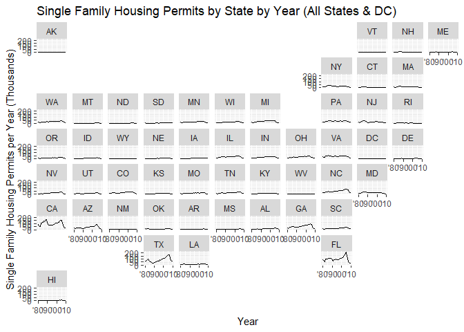
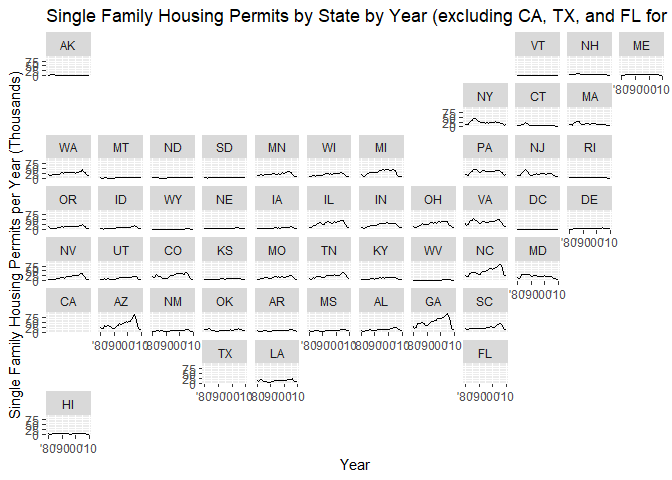
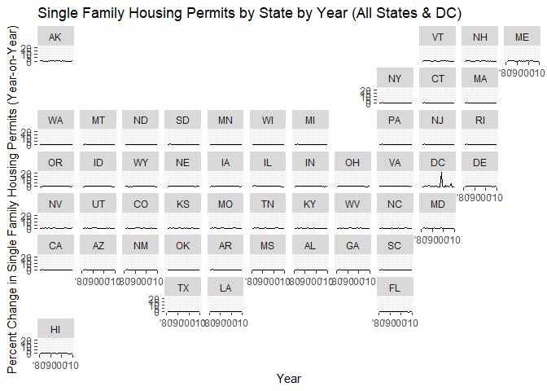
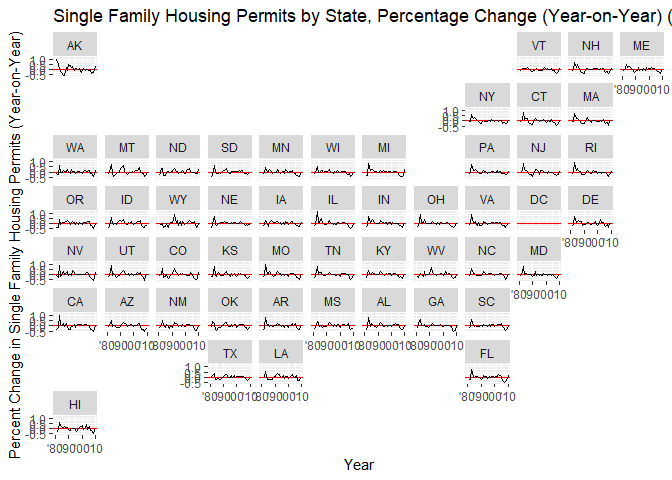
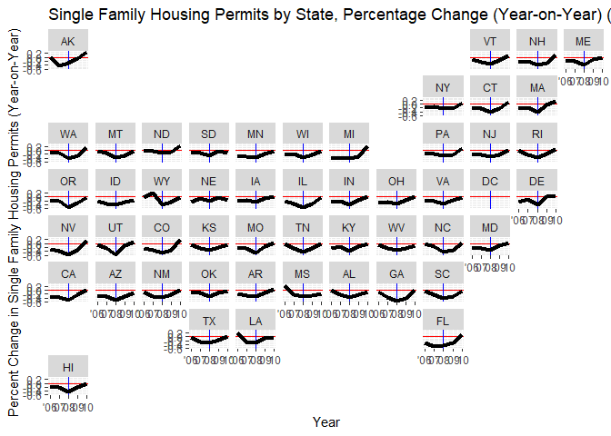
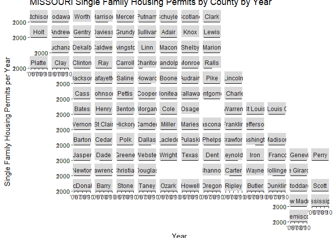
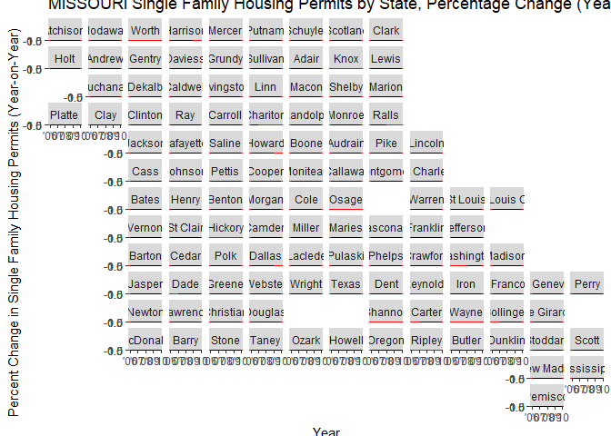

---
title: "12 Case Study: Building the Past"
author: "TomHollinberger"
date: "11/10/2020"
output: 
 html_document: 
   keep_md: yes
   toc: TRUE
   toc_depth: 6
   code_folding:  hide
   results: 'hide'
   message: FALSE
   warning: FALSE
---  
---  
THIS RSCRIPT USES ROXYGEN CHARACTERS.  
YOU CAN PRESS ctrl+shift+K AND GO STRAIGHT TO A HTML.  
SKIPS THE HANDWORK OF CREATING A RMD, AFTER THE ORIGINAL WORK IS NONE IN A RSCRIPT.
E:/000 DTS 350 Data Visualization/DTS350-hollinbergert/DTS350TemplateMaster/Week_12/analysis/


```r
library(tidyverse)
```

```
## -- Attaching packages -------------------------------------------------------------------------------------- tidyverse 1.3.0 --
```

```
## v ggplot2 3.3.2     v purrr   0.3.4
## v tibble  3.0.3     v dplyr   1.0.0
## v tidyr   1.1.0     v stringr 1.4.0
## v readr   1.3.1     v forcats 0.5.0
```

```
## -- Conflicts ----------------------------------------------------------------------------------------- tidyverse_conflicts() --
## x dplyr::filter() masks stats::filter()
## x dplyr::lag()    masks stats::lag()
```

```r
library(readr)
library(haven)
library(readxl)
library(downloader)
library(dplyr)


##GET PERMIT DATA
tmpcsv <- tempfile()
tmpcsv
```

```
## [1] "C:\\Users\\tomho\\AppData\\Local\\Temp\\RtmpANRidW\\file6628338a1791"
```

```r
tempdir()
```

```
## [1] "C:\\Users\\tomho\\AppData\\Local\\Temp\\RtmpANRidW"
```

```r
download("https://github.com/WJC-Data-Science/DTS350/raw/master/permits.csv",tmpcsv, mode = "wb")
permitscsv <- read_csv(tmpcsv)
```

```
## Warning: Missing column names filled in: 'X1' [1]
```

```
## Parsed with column specification:
## cols(
##   X1 = col_double(),
##   state = col_double(),
##   StateAbbr = col_character(),
##   county = col_double(),
##   countyname = col_character(),
##   variable = col_character(),
##   year = col_double(),
##   value = col_double()
## )
```

```r
#View(permitscsv)  
summary(permitscsv)
```

```
##        X1             state        StateAbbr             county     
##  Min.   :     1   Min.   : 1.00   Length:327422      Min.   :  1.0  
##  1st Qu.: 81856   1st Qu.:18.00   Class :character   1st Qu.: 33.0  
##  Median :163712   Median :29.00   Mode  :character   Median : 75.0  
##  Mean   :163712   Mean   :30.09                      Mean   : 98.5  
##  3rd Qu.:245567   3rd Qu.:45.00                      3rd Qu.:127.0  
##  Max.   :327422   Max.   :56.00                      Max.   :840.0  
##   countyname          variable              year          value        
##  Length:327422      Length:327422      Min.   :1980   Min.   :    1.0  
##  Class :character   Class :character   1st Qu.:1987   1st Qu.:    9.0  
##  Mode  :character   Mode  :character   Median :1995   Median :   38.0  
##                                        Mean   :1995   Mean   :  308.3  
##                                        3rd Qu.:2002   3rd Qu.:  163.0  
##                                        Max.   :2010   Max.   :70225.0
```

```r
unique(permitscsv$StateAbbr) #DOES HAVE AK, HI, & DC.  DOESNOT HAVE PR.  AK sorts after AL?
```

```
##  [1] "AL" "AK" "AZ" "AR" "CA" "CO" "CT" "DE" "DC" "FL" "GA" "HI" "ID" "IL" "IN"
## [16] "IA" "KS" "KY" "LA" "ME" "MD" "MA" "MI" "MN" "MS" "MO" "MT" "NE" "NV" "NH"
## [31] "NJ" "NM" "NY" "NC" "ND" "OH" "OK" "OR" "PA" "RI" "SC" "SD" "TN" "TX" "UT"
## [46] "VT" "VA" "WA" "WV" "WI" "WY"
```

```r
str(permitscsv)
```

```
## tibble [327,422 x 8] (S3: spec_tbl_df/tbl_df/tbl/data.frame)
##  $ X1        : num [1:327422] 1 2 3 4 5 6 7 8 9 10 ...
##  $ state     : num [1:327422] 1 1 1 1 1 1 1 1 1 1 ...
##  $ StateAbbr : chr [1:327422] "AL" "AL" "AL" "AL" ...
##  $ county    : num [1:327422] 1 1 1 1 1 1 1 1 1 1 ...
##  $ countyname: chr [1:327422] "Autauga County" "Autauga County" "Autauga County" "Autauga County" ...
##  $ variable  : chr [1:327422] "All Permits" "All Permits" "All Permits" "All Permits" ...
##  $ year      : num [1:327422] 2010 2009 2008 2007 2006 ...
##  $ value     : num [1:327422] 191 110 173 260 347 313 367 283 276 400 ...
##  - attr(*, "spec")=
##   .. cols(
##   ..   X1 = col_double(),
##   ..   state = col_double(),
##   ..   StateAbbr = col_character(),
##   ..   county = col_double(),
##   ..   countyname = col_character(),
##   ..   variable = col_character(),
##   ..   year = col_double(),
##   ..   value = col_double()
##   .. )
```

```r
#Test Pike County Ohio    In USA Boundaries  county fp = 131, statefp = 39
PikeOhio <- filter(permitscsv, state == 39 & county == 131)
PikeOhio
```

```
## # A tibble: 91 x 8
##        X1 state StateAbbr county countyname  variable     year value
##     <dbl> <dbl> <chr>      <dbl> <chr>       <chr>       <dbl> <dbl>
##  1 221553    39 OH           131 Pike County All Permits  2010    75
##  2 221554    39 OH           131 Pike County All Permits  2009    80
##  3 221555    39 OH           131 Pike County All Permits  2008   111
##  4 221556    39 OH           131 Pike County All Permits  2007    59
##  5 221557    39 OH           131 Pike County All Permits  2006    76
##  6 221558    39 OH           131 Pike County All Permits  2005   155
##  7 221559    39 OH           131 Pike County All Permits  2004   233
##  8 221560    39 OH           131 Pike County All Permits  2003   204
##  9 221561    39 OH           131 Pike County All Permits  2002    35
## 10 221562    39 OH           131 Pike County All Permits  2001    22
## # ... with 81 more rows
```

```r
##CONFIRM   (state and county in csv)  == (statefp and countyfp in USAboundaries)

unique(permitscsv$variable)  #has 6 types of permit aggregations:   "All Permits" "Single Family" "All Multifamily""2-Unit Multifamily""3 & 4-Unit Multifamily" "5+-Unit Multifamily"   
```

```
## [1] "All Permits"            "Single Family"          "All Multifamily"       
## [4] "2-Unit Multifamily"     "3 & 4-Unit Multifamily" "5+-Unit Multifamily"
```

```r
#need to filter for only the "All Permit" data
sfpermits <- filter(permitscsv, variable == "Single Family")
sfpermits    #drops the total rows from 327422 to 87396
```

```
## # A tibble: 87,004 x 8
##       X1 state StateAbbr county countyname     variable       year value
##    <dbl> <dbl> <chr>      <dbl> <chr>          <chr>         <dbl> <dbl>
##  1    32     1 AL             1 Autauga County Single Family  2010   135
##  2    33     1 AL             1 Autauga County Single Family  2009   110
##  3    34     1 AL             1 Autauga County Single Family  2008   173
##  4    35     1 AL             1 Autauga County Single Family  2007   260
##  5    36     1 AL             1 Autauga County Single Family  2006   347
##  6    37     1 AL             1 Autauga County Single Family  2005   313
##  7    38     1 AL             1 Autauga County Single Family  2004   367
##  8    39     1 AL             1 Autauga County Single Family  2003   283
##  9    40     1 AL             1 Autauga County Single Family  2002   276
## 10    41     1 AL             1 Autauga County Single Family  2001   176
## # ... with 86,994 more rows
```

```r
unique(permitscsv$StateAbbr)   #still have 51 states
```

```
##  [1] "AL" "AK" "AZ" "AR" "CA" "CO" "CT" "DE" "DC" "FL" "GA" "HI" "ID" "IL" "IN"
## [16] "IA" "KS" "KY" "LA" "ME" "MD" "MA" "MI" "MN" "MS" "MO" "MT" "NE" "NV" "NH"
## [31] "NJ" "NM" "NY" "NC" "ND" "OH" "OK" "OR" "PA" "RI" "SC" "SD" "TN" "TX" "UT"
## [46] "VT" "VA" "WA" "WV" "WI" "WY"
```

```r
write_csv(sfpermits,"sfpermits.csv")  #check in file explorer to be sure you got what you wanted.


# Check years of coverage
unique(sfpermits$year)    #1980 -- 2010
```

```
##  [1] 2010 2009 2008 2007 2006 2005 2004 2003 2002 2001 2000 1999 1998 1997 1996
## [16] 1995 1994 1993 1992 1991 1990 1989 1988 1987 1986 1985 1984 1983 1982 1981
## [31] 1980
```

```r
#Permits : Group by and Summarize by state by year
styr <- sfpermits %>%
  group_by(StateAbbr, year) %>%
  summarise(sumval = sum(value, na.rm = TRUE))
```

```
## `summarise()` regrouping output by 'StateAbbr' (override with `.groups` argument)
```

```r
#Scale down the value by dividing by 1000
styr$sumvalk <- styr$sumval / 1000 

styr  # Sum of All Permits by state for each year 1980 thru 2010
```

```
## # A tibble: 1,580 x 4
## # Groups:   StateAbbr [51]
##    StateAbbr  year sumval sumvalk
##    <chr>     <dbl>  <dbl>   <dbl>
##  1 AK         1980   1337   1.34 
##  2 AK         1981   2619   2.62 
##  3 AK         1982   3944   3.94 
##  4 AK         1983   4380   4.38 
##  5 AK         1984   3501   3.50 
##  6 AK         1985   2234   2.23 
##  7 AK         1986    984   0.984
##  8 AK         1987    431   0.431
##  9 AK         1988    517   0.517
## 10 AK         1989    454   0.454
## # ... with 1,570 more rows
```

```r
#Now exclude CA, TX, and FL beacuse they are soo big, they stretch the y-scale and dwarf the other states.
styrwoCATXFL <- filter(styr, !StateAbbr %in% c("CA", "TX", "FL"))

str(styrwoCATXFL)
```

```
## tibble [1,487 x 4] (S3: grouped_df/tbl_df/tbl/data.frame)
##  $ StateAbbr: chr [1:1487] "AK" "AK" "AK" "AK" ...
##  $ year     : num [1:1487] 1980 1981 1982 1983 1984 ...
##  $ sumval   : num [1:1487] 1337 2619 3944 4380 3501 ...
##  $ sumvalk  : num [1:1487] 1.34 2.62 3.94 4.38 3.5 ...
##  - attr(*, "groups")= tibble [48 x 2] (S3: tbl_df/tbl/data.frame)
##   ..$ StateAbbr: chr [1:48] "AK" "AL" "AR" "AZ" ...
##   ..$ .rows    : list<int> [1:48] 
##   .. ..$ : int [1:31] 1 2 3 4 5 6 7 8 9 10 ...
##   .. ..$ : int [1:31] 32 33 34 35 36 37 38 39 40 41 ...
##   .. ..$ : int [1:31] 63 64 65 66 67 68 69 70 71 72 ...
##   .. ..$ : int [1:31] 94 95 96 97 98 99 100 101 102 103 ...
##   .. ..$ : int [1:31] 125 126 127 128 129 130 131 132 133 134 ...
##   .. ..$ : int [1:31] 156 157 158 159 160 161 162 163 164 165 ...
##   .. ..$ : int [1:30] 187 188 189 190 191 192 193 194 195 196 ...
##   .. ..$ : int [1:31] 217 218 219 220 221 222 223 224 225 226 ...
##   .. ..$ : int [1:31] 248 249 250 251 252 253 254 255 256 257 ...
##   .. ..$ : int [1:31] 279 280 281 282 283 284 285 286 287 288 ...
##   .. ..$ : int [1:31] 310 311 312 313 314 315 316 317 318 319 ...
##   .. ..$ : int [1:31] 341 342 343 344 345 346 347 348 349 350 ...
##   .. ..$ : int [1:31] 372 373 374 375 376 377 378 379 380 381 ...
##   .. ..$ : int [1:31] 403 404 405 406 407 408 409 410 411 412 ...
##   .. ..$ : int [1:31] 434 435 436 437 438 439 440 441 442 443 ...
##   .. ..$ : int [1:31] 465 466 467 468 469 470 471 472 473 474 ...
##   .. ..$ : int [1:31] 496 497 498 499 500 501 502 503 504 505 ...
##   .. ..$ : int [1:31] 527 528 529 530 531 532 533 534 535 536 ...
##   .. ..$ : int [1:31] 558 559 560 561 562 563 564 565 566 567 ...
##   .. ..$ : int [1:31] 589 590 591 592 593 594 595 596 597 598 ...
##   .. ..$ : int [1:31] 620 621 622 623 624 625 626 627 628 629 ...
##   .. ..$ : int [1:31] 651 652 653 654 655 656 657 658 659 660 ...
##   .. ..$ : int [1:31] 682 683 684 685 686 687 688 689 690 691 ...
##   .. ..$ : int [1:31] 713 714 715 716 717 718 719 720 721 722 ...
##   .. ..$ : int [1:31] 744 745 746 747 748 749 750 751 752 753 ...
##   .. ..$ : int [1:31] 775 776 777 778 779 780 781 782 783 784 ...
##   .. ..$ : int [1:31] 806 807 808 809 810 811 812 813 814 815 ...
##   .. ..$ : int [1:31] 837 838 839 840 841 842 843 844 845 846 ...
##   .. ..$ : int [1:31] 868 869 870 871 872 873 874 875 876 877 ...
##   .. ..$ : int [1:31] 899 900 901 902 903 904 905 906 907 908 ...
##   .. ..$ : int [1:31] 930 931 932 933 934 935 936 937 938 939 ...
##   .. ..$ : int [1:31] 961 962 963 964 965 966 967 968 969 970 ...
##   .. ..$ : int [1:31] 992 993 994 995 996 997 998 999 1000 1001 ...
##   .. ..$ : int [1:31] 1023 1024 1025 1026 1027 1028 1029 1030 1031 1032 ...
##   .. ..$ : int [1:31] 1054 1055 1056 1057 1058 1059 1060 1061 1062 1063 ...
##   .. ..$ : int [1:31] 1085 1086 1087 1088 1089 1090 1091 1092 1093 1094 ...
##   .. ..$ : int [1:31] 1116 1117 1118 1119 1120 1121 1122 1123 1124 1125 ...
##   .. ..$ : int [1:31] 1147 1148 1149 1150 1151 1152 1153 1154 1155 1156 ...
##   .. ..$ : int [1:31] 1178 1179 1180 1181 1182 1183 1184 1185 1186 1187 ...
##   .. ..$ : int [1:31] 1209 1210 1211 1212 1213 1214 1215 1216 1217 1218 ...
##   .. ..$ : int [1:31] 1240 1241 1242 1243 1244 1245 1246 1247 1248 1249 ...
##   .. ..$ : int [1:31] 1271 1272 1273 1274 1275 1276 1277 1278 1279 1280 ...
##   .. ..$ : int [1:31] 1302 1303 1304 1305 1306 1307 1308 1309 1310 1311 ...
##   .. ..$ : int [1:31] 1333 1334 1335 1336 1337 1338 1339 1340 1341 1342 ...
##   .. ..$ : int [1:31] 1364 1365 1366 1367 1368 1369 1370 1371 1372 1373 ...
##   .. ..$ : int [1:31] 1395 1396 1397 1398 1399 1400 1401 1402 1403 1404 ...
##   .. ..$ : int [1:31] 1426 1427 1428 1429 1430 1431 1432 1433 1434 1435 ...
##   .. ..$ : int [1:31] 1457 1458 1459 1460 1461 1462 1463 1464 1465 1466 ...
##   .. ..@ ptype: int(0) 
##   ..- attr(*, ".drop")= logi TRUE
```

```r
unique(styr$StateAbbr)   #51 states
```

```
##  [1] "AK" "AL" "AR" "AZ" "CA" "CO" "CT" "DC" "DE" "FL" "GA" "HI" "IA" "ID" "IL"
## [16] "IN" "KS" "KY" "LA" "MA" "MD" "ME" "MI" "MN" "MO" "MS" "MT" "NC" "ND" "NE"
## [31] "NH" "NJ" "NM" "NV" "NY" "OH" "OK" "OR" "PA" "RI" "SC" "SD" "TN" "TX" "UT"
## [46] "VA" "VT" "WA" "WI" "WV" "WY"
```

```r
unique(styrwoCATXFL$StateAbbr)  #48 states excluding CA, TX, FL
```

```
##  [1] "AK" "AL" "AR" "AZ" "CO" "CT" "DC" "DE" "GA" "HI" "IA" "ID" "IL" "IN" "KS"
## [16] "KY" "LA" "MA" "MD" "ME" "MI" "MN" "MO" "MS" "MT" "NC" "ND" "NE" "NH" "NJ"
## [31] "NM" "NV" "NY" "OH" "OK" "OR" "PA" "RI" "SC" "SD" "TN" "UT" "VA" "VT" "WA"
## [46] "WI" "WV" "WY"
```

```r
library(geofacet)   #install.packages("geofacet")
```

```
## Warning: package 'geofacet' was built under R version 4.0.3
```

```r
# All States, and DC
```

### **PLOT 1 INSIGHT** : State-by-State Permits Issued, 1980 to 2010.  
The time window is important because it shows the 2008 crash, and also reaches back to the Recession of 1981, 
when the housing market had a similar downturn.  The obvious worst-case situations are CA, TX, and FL, 
but they have such large values, they stretch the y-axis and dwarf the other states. The next chart zooms in on these other states.
These charts use the GEOFACET package which provides a visual arrangement of states on a map, but also allows charted data to be displayed for each state.  It's a useful compromise between numeric charts and geographic maps.


```r
ggplot(styr, aes(year,sumvalk)) +
  geom_line() + 
  facet_geo(~ StateAbbr, grid = "us_state_grid2") + 
  scale_x_continuous(labels = function(x) paste0("'", substr(x,3,4))) + 
  ylab("Single Family Housing Permits per Year (Thousands)") +
  xlab("Year") +
  labs(title = "Single Family Housing Permits by State by Year (All States & DC)")
```

<!-- -->

```r
ggsave("geofacet all states.png")  
```

```
## Saving 7 x 5 in image
```

```r
#Graph without CA, TX, or FL because their values stretch the y-axis and dwarf the other states. 
library(geofacet)  #install.packages("geofacet")
```

### **PLOT 2 INSIGHT** : State-by-State Permits Issued, 1980 to 2010, without CA, TX, or FL
This plot shows the same data, except that  CA, TX, or FL have been excluded because their high values stretch the y-axis and dwarf the other states.  Now, with a more 'zoomed-in' y axis, 
you can see similar 'crash' trends in some states, but not others. 
It's hard to discern a pattern.  Perhaps coastal (AZ, NV, GA, NC, VA), but also more populated Midwest states (OH, MI, IL, MN, CO)

    According to https://www.thestreet.com/personal-finance/savings/the-five-states-hit-hardest-by-foreclosures-10414898
the top 5 hardest hit states (measured by foreclosures) were Nevada, California, Florida, Colorado, and Arizona.  


```r
ggplot(styrwoCATXFL, aes(year,sumvalk)) +
    geom_line() + 
    facet_geo(~ StateAbbr, grid = "us_state_grid2") + 
    scale_x_continuous(labels = function(x) paste0("'", substr(x,3,4))) + 
    ylab("Single Family Housing Permits per Year (Thousands)") +
    xlab("Year") +
    labs(title = "Single Family Housing Permits by State by Year (excluding CA, TX, and FL for scaling purposes)")
```

<!-- -->

```r
ggsave("geofacet woCATXFL.png") 
```

```
## Saving 7 x 5 in image
```

```r
#Create a percent change variable.  (new - old) / old

styr <- mutate(styr, pctchg = (sumvalk - lag(sumvalk))/lag(sumvalk))
styr
```

```
## # A tibble: 1,580 x 5
## # Groups:   StateAbbr [51]
##    StateAbbr  year sumval sumvalk pctchg
##    <chr>     <dbl>  <dbl>   <dbl>  <dbl>
##  1 AK         1980   1337   1.34  NA    
##  2 AK         1981   2619   2.62   0.959
##  3 AK         1982   3944   3.94   0.506
##  4 AK         1983   4380   4.38   0.111
##  5 AK         1984   3501   3.50  -0.201
##  6 AK         1985   2234   2.23  -0.362
##  7 AK         1986    984   0.984 -0.560
##  8 AK         1987    431   0.431 -0.562
##  9 AK         1988    517   0.517  0.200
## 10 AK         1989    454   0.454 -0.122
## # ... with 1,570 more rows
```

```r
ggplot(styr, aes(year,pctchg)) +
  geom_line() + 
  facet_geo(~ StateAbbr, grid = "us_state_grid2") + 
  scale_x_continuous(labels = function(x) paste0("'", substr(x,3,4))) + 
  ylab("Percent Change in Single Family Housing Permits (Year-on-Year)") +
  xlab("Year") +
  labs(title = "Single Family Housing Permits by State by Year (All States & DC)")
```

```
## Warning: Removed 1 row(s) containing missing values (geom_path).
```

<!-- -->

```r
ggsave("geofacet all states pctchg.png") 
```

```
## Saving 7 x 5 in image
```

```
## Warning: Removed 1 row(s) containing missing values (geom_path).
```

```r
#Remove DC as outlier
styrpctchgwoDC <- filter(styr, StateAbbr != "DC")
unique(styrpctchgwoDC$StateAbbr)
```

```
##  [1] "AK" "AL" "AR" "AZ" "CA" "CO" "CT" "DE" "FL" "GA" "HI" "IA" "ID" "IL" "IN"
## [16] "KS" "KY" "LA" "MA" "MD" "ME" "MI" "MN" "MO" "MS" "MT" "NC" "ND" "NE" "NH"
## [31] "NJ" "NM" "NV" "NY" "OH" "OK" "OR" "PA" "RI" "SC" "SD" "TN" "TX" "UT" "VA"
## [46] "VT" "WA" "WI" "WV" "WY"
```

```r
ggplot(styrpctchgwoDC, aes(year,pctchg)) +
  geom_hline(yintercept = 0, color = "red") +
  geom_line() + 
  facet_geo(~ StateAbbr, grid = "us_state_grid2") + 
  scale_x_continuous(labels = function(x) paste0("'", substr(x,3,4))) + 
  ylab("Percent Change in Single Family Housing Permits (Year-on-Year)") +
  xlab("Year") +
  labs(title = "Single Family Housing Permits by State, Percentage Change (Year-on-Year) (All States, not DC)")
```

```
## Warning: Removed 1 row(s) containing missing values (geom_path).
```

<!-- -->

```r
ggsave("geofacet all states wo DC pctchg.png") 
```

```
## Saving 7 x 5 in image
```

```
## Warning: Removed 1 row(s) containing missing values (geom_path).
```

```r
#Narrow to 2006 - 2010
styrpctchgwoDC0610 <- filter(styrpctchgwoDC, year >= 2006 & year <= 2010)
unique(styrpctchgwoDC0610$year)
```

```
## [1] 2006 2007 2008 2009 2010
```

### **PLOT 3 INSIGHT** : State-by-State, Percentage Change, 2006 thru 2010.
This is a more stylized plot.  The red horizontal line is Zero growth or decline.  The Blue vertical line is 2008.
The black lines are bolded for quick visual lock-in.  Interesting are the late dip in NY.  Another takeaway is that almost all states had 
stopped the decline in permits issuances by 2010, and some had even increased permit issuances.


```r
ggplot(styrpctchgwoDC0610, aes(year,pctchg)) +
  geom_hline(yintercept = 0, color = "red") +
  geom_vline(xintercept = 2008, color = "blue") +
  geom_line(size = 1.5) + 
  facet_geo(~ StateAbbr, grid = "us_state_grid2") + 
  scale_x_continuous(labels = function(x) paste0("'", substr(x,3,4))) + 
  ylab("Percent Change in Single Family Housing Permits (Year-on-Year)") +
  xlab("Year") +
  labs(title = "Single Family Housing Permits by State, Percentage Change (Year-on-Year) (All States, not DC)")
```

<!-- -->

###Across Your State" i.e., Missouri, assume by county


```r
unique(permitscsv$variable)  #has 6 types of permit aggregations:   "All Permits" "Single Family" "All Multifamily""2-Unit Multifamily""3 & 4-Unit Multifamily" "5+-Unit Multifamily"   
```

```
## [1] "All Permits"            "Single Family"          "All Multifamily"       
## [4] "2-Unit Multifamily"     "3 & 4-Unit Multifamily" "5+-Unit Multifamily"
```

```r
#need to filter for only the "All Permit" data
permitscsv
```

```
## # A tibble: 327,422 x 8
##       X1 state StateAbbr county countyname     variable     year value
##    <dbl> <dbl> <chr>      <dbl> <chr>          <chr>       <dbl> <dbl>
##  1     1     1 AL             1 Autauga County All Permits  2010   191
##  2     2     1 AL             1 Autauga County All Permits  2009   110
##  3     3     1 AL             1 Autauga County All Permits  2008   173
##  4     4     1 AL             1 Autauga County All Permits  2007   260
##  5     5     1 AL             1 Autauga County All Permits  2006   347
##  6     6     1 AL             1 Autauga County All Permits  2005   313
##  7     7     1 AL             1 Autauga County All Permits  2004   367
##  8     8     1 AL             1 Autauga County All Permits  2003   283
##  9     9     1 AL             1 Autauga County All Permits  2002   276
## 10    10     1 AL             1 Autauga County All Permits  2001   400
## # ... with 327,412 more rows
```

```r
mosfpermits <- filter(permitscsv, variable == "Single Family" & StateAbbr == "MO")
mosfpermits    #drops the total rows from 327422 to 3048
```

```
## # A tibble: 3,048 x 8
##        X1 state StateAbbr county countyname   variable       year value
##     <dbl> <dbl> <chr>      <dbl> <chr>        <chr>         <dbl> <dbl>
##  1 157260    29 MO             1 Adair County Single Family  2010    17
##  2 157261    29 MO             1 Adair County Single Family  2009    18
##  3 157262    29 MO             1 Adair County Single Family  2008    26
##  4 157263    29 MO             1 Adair County Single Family  2007    33
##  5 157264    29 MO             1 Adair County Single Family  2006    27
##  6 157265    29 MO             1 Adair County Single Family  2005    41
##  7 157266    29 MO             1 Adair County Single Family  2004    28
##  8 157267    29 MO             1 Adair County Single Family  2003    21
##  9 157268    29 MO             1 Adair County Single Family  2002    16
## 10 157269    29 MO             1 Adair County Single Family  2001    33
## # ... with 3,038 more rows
```

```r
unique(mosfpermits$StateAbbr)   #only MO
```

```
## [1] "MO"
```

```r
unique(mosfpermits$variable)   #only Single Family
```

```
## [1] "Single Family"
```

```r
unique(mosfpermits$countyname)  #112 counties  
```

```
##   [1] "Adair County"          "Andrew County"         "Atchison County"      
##   [4] "Audrain County"        "Barry County"          "Barton County"        
##   [7] "Bates County"          "Benton County"         "Bollinger County"     
##  [10] "Boone County"          "Buchanan County"       "Butler County"        
##  [13] "Caldwell County"       "Callaway County"       "Camden County"        
##  [16] "Cape Girardeau County" "Carroll County"        "Carter County"        
##  [19] "Cass County"           "Cedar County"          "Chariton County"      
##  [22] "Christian County"      "Clark County"          "Clay County"          
##  [25] "Clinton County"        "Cole County"           "Cooper County"        
##  [28] "Crawford County"       "Dade County"           "Dallas County"        
##  [31] "Daviess County"        "DeKalb County"         "Dent County"          
##  [34] "Douglas County"        "Dunklin County"        "Franklin County"      
##  [37] "Gasconade County"      "Gentry County"         "Greene County"        
##  [40] "Grundy County"         "Harrison County"       "Henry County"         
##  [43] "Holt County"           "Howard County"         "Howell County"        
##  [46] "Iron County"           "Jackson County"        "Jasper County"        
##  [49] "Jefferson County"      "Johnson County"        "Knox County"          
##  [52] "Laclede County"        "Lafayette County"      "Lawrence County"      
##  [55] "Lewis County"          "Lincoln County"        "Linn County"          
##  [58] "Livingston County"     "McDonald County"       "Macon County"         
##  [61] "Madison County"        "Maries County"         "Marion County"        
##  [64] "Mercer County"         "Miller County"         "Mississippi County"   
##  [67] "Moniteau County"       "Monroe County"         "Montgomery County"    
##  [70] "Morgan County"         "New Madrid County"     "Newton County"        
##  [73] "Nodaway County"        "Oregon County"         "Ozark County"         
##  [76] "Pemiscot County"       "Perry County"          "Pettis County"        
##  [79] "Phelps County"         "Pike County"           "Platte County"        
##  [82] "Polk County"           "Pulaski County"        "Putnam County"        
##  [85] "Ralls County"          "Randolph County"       "Ray County"           
##  [88] "Reynolds County"       "Ripley County"         "St. Charles County"   
##  [91] "St. Clair County"      "Ste. Genevieve County" "St. Francois County"  
##  [94] "St. Louis County"      "Saline County"         "Schuyler County"      
##  [97] "Scotland County"       "Scott County"          "Shannon County"       
## [100] "Shelby County"         "Stoddard County"       "Stone County"         
## [103] "Sullivan County"       "Taney County"          "Texas County"         
## [106] "Vernon County"         "Warren County"         "Washington County"    
## [109] "Webster County"        "Worth County"          "Wright County"        
## [112] "St. Louis city"
```

```r
# need to cut the word "county" off of the end because the USAboundary grid uses a variable called 'name' which only has 'Adair', without the word 'county'
mosfpermits$name <- str_sub(mosfpermits$countyname, 1, -8)
mosfpermits$name
```

```
##    [1] "Adair"          "Adair"          "Adair"          "Adair"         
##    [5] "Adair"          "Adair"          "Adair"          "Adair"         
##    [9] "Adair"          "Adair"          "Adair"          "Adair"         
##   [13] "Adair"          "Adair"          "Adair"          "Adair"         
##   [17] "Adair"          "Adair"          "Adair"          "Adair"         
##   [21] "Adair"          "Adair"          "Adair"          "Adair"         
##   [25] "Adair"          "Adair"          "Adair"          "Adair"         
##   [29] "Adair"          "Adair"          "Adair"          "Andrew"        
##   [33] "Andrew"         "Andrew"         "Andrew"         "Andrew"        
##   [37] "Andrew"         "Andrew"         "Andrew"         "Andrew"        
##   [41] "Andrew"         "Andrew"         "Andrew"         "Andrew"        
##   [45] "Andrew"         "Andrew"         "Andrew"         "Andrew"        
##   [49] "Andrew"         "Andrew"         "Andrew"         "Andrew"        
##   [53] "Andrew"         "Andrew"         "Andrew"         "Andrew"        
##   [57] "Andrew"         "Andrew"         "Andrew"         "Andrew"        
##   [61] "Andrew"         "Andrew"         "Atchison"       "Atchison"      
##   [65] "Atchison"       "Atchison"       "Atchison"       "Atchison"      
##   [69] "Atchison"       "Atchison"       "Atchison"       "Atchison"      
##   [73] "Atchison"       "Atchison"       "Atchison"       "Atchison"      
##   [77] "Atchison"       "Atchison"       "Atchison"       "Atchison"      
##   [81] "Atchison"       "Atchison"       "Atchison"       "Atchison"      
##   [85] "Atchison"       "Atchison"       "Atchison"       "Atchison"      
##   [89] "Atchison"       "Atchison"       "Atchison"       "Audrain"       
##   [93] "Audrain"        "Audrain"        "Audrain"        "Audrain"       
##   [97] "Audrain"        "Audrain"        "Audrain"        "Audrain"       
##  [101] "Audrain"        "Audrain"        "Audrain"        "Audrain"       
##  [105] "Audrain"        "Audrain"        "Audrain"        "Audrain"       
##  [109] "Audrain"        "Audrain"        "Audrain"        "Audrain"       
##  [113] "Audrain"        "Audrain"        "Audrain"        "Audrain"       
##  [117] "Audrain"        "Audrain"        "Audrain"        "Audrain"       
##  [121] "Audrain"        "Audrain"        "Barry"          "Barry"         
##  [125] "Barry"          "Barry"          "Barry"          "Barry"         
##  [129] "Barry"          "Barry"          "Barry"          "Barry"         
##  [133] "Barry"          "Barry"          "Barry"          "Barry"         
##  [137] "Barry"          "Barry"          "Barry"          "Barry"         
##  [141] "Barry"          "Barry"          "Barry"          "Barry"         
##  [145] "Barry"          "Barry"          "Barry"          "Barry"         
##  [149] "Barry"          "Barry"          "Barry"          "Barry"         
##  [153] "Barry"          "Barton"         "Barton"         "Barton"        
##  [157] "Barton"         "Barton"         "Barton"         "Barton"        
##  [161] "Barton"         "Barton"         "Barton"         "Barton"        
##  [165] "Barton"         "Barton"         "Barton"         "Barton"        
##  [169] "Barton"         "Barton"         "Barton"         "Barton"        
##  [173] "Barton"         "Barton"         "Barton"         "Barton"        
##  [177] "Barton"         "Barton"         "Barton"         "Barton"        
##  [181] "Barton"         "Barton"         "Barton"         "Bates"         
##  [185] "Bates"          "Bates"          "Bates"          "Bates"         
##  [189] "Bates"          "Bates"          "Bates"          "Bates"         
##  [193] "Bates"          "Bates"          "Bates"          "Bates"         
##  [197] "Bates"          "Bates"          "Bates"          "Bates"         
##  [201] "Bates"          "Bates"          "Bates"          "Bates"         
##  [205] "Bates"          "Bates"          "Bates"          "Bates"         
##  [209] "Bates"          "Bates"          "Bates"          "Bates"         
##  [213] "Benton"         "Benton"         "Benton"         "Benton"        
##  [217] "Benton"         "Benton"         "Benton"         "Benton"        
##  [221] "Benton"         "Benton"         "Benton"         "Benton"        
##  [225] "Benton"         "Benton"         "Benton"         "Benton"        
##  [229] "Benton"         "Benton"         "Benton"         "Benton"        
##  [233] "Benton"         "Benton"         "Benton"         "Benton"        
##  [237] "Benton"         "Benton"         "Benton"         "Benton"        
##  [241] "Benton"         "Benton"         "Benton"         "Bollinger"     
##  [245] "Bollinger"      "Bollinger"      "Bollinger"      "Bollinger"     
##  [249] "Bollinger"      "Bollinger"      "Bollinger"      "Bollinger"     
##  [253] "Bollinger"      "Bollinger"      "Bollinger"      "Bollinger"     
##  [257] "Bollinger"      "Bollinger"      "Bollinger"      "Bollinger"     
##  [261] "Bollinger"      "Bollinger"      "Bollinger"      "Bollinger"     
##  [265] "Bollinger"      "Bollinger"      "Bollinger"      "Bollinger"     
##  [269] "Boone"          "Boone"          "Boone"          "Boone"         
##  [273] "Boone"          "Boone"          "Boone"          "Boone"         
##  [277] "Boone"          "Boone"          "Boone"          "Boone"         
##  [281] "Boone"          "Boone"          "Boone"          "Boone"         
##  [285] "Boone"          "Boone"          "Boone"          "Boone"         
##  [289] "Boone"          "Boone"          "Boone"          "Boone"         
##  [293] "Boone"          "Boone"          "Boone"          "Boone"         
##  [297] "Boone"          "Boone"          "Boone"          "Buchanan"      
##  [301] "Buchanan"       "Buchanan"       "Buchanan"       "Buchanan"      
##  [305] "Buchanan"       "Buchanan"       "Buchanan"       "Buchanan"      
##  [309] "Buchanan"       "Buchanan"       "Buchanan"       "Buchanan"      
##  [313] "Buchanan"       "Buchanan"       "Buchanan"       "Buchanan"      
##  [317] "Buchanan"       "Buchanan"       "Buchanan"       "Buchanan"      
##  [321] "Buchanan"       "Buchanan"       "Buchanan"       "Buchanan"      
##  [325] "Buchanan"       "Buchanan"       "Buchanan"       "Buchanan"      
##  [329] "Buchanan"       "Buchanan"       "Butler"         "Butler"        
##  [333] "Butler"         "Butler"         "Butler"         "Butler"        
##  [337] "Butler"         "Butler"         "Butler"         "Butler"        
##  [341] "Butler"         "Butler"         "Butler"         "Butler"        
##  [345] "Butler"         "Butler"         "Butler"         "Butler"        
##  [349] "Butler"         "Butler"         "Butler"         "Butler"        
##  [353] "Butler"         "Butler"         "Butler"         "Butler"        
##  [357] "Butler"         "Butler"         "Butler"         "Butler"        
##  [361] "Butler"         "Caldwell"       "Caldwell"       "Caldwell"      
##  [365] "Caldwell"       "Caldwell"       "Caldwell"       "Caldwell"      
##  [369] "Caldwell"       "Caldwell"       "Caldwell"       "Caldwell"      
##  [373] "Caldwell"       "Caldwell"       "Caldwell"       "Caldwell"      
##  [377] "Caldwell"       "Caldwell"       "Caldwell"       "Caldwell"      
##  [381] "Caldwell"       "Caldwell"       "Callaway"       "Callaway"      
##  [385] "Callaway"       "Callaway"       "Callaway"       "Callaway"      
##  [389] "Callaway"       "Callaway"       "Callaway"       "Callaway"      
##  [393] "Callaway"       "Callaway"       "Callaway"       "Callaway"      
##  [397] "Callaway"       "Callaway"       "Callaway"       "Callaway"      
##  [401] "Callaway"       "Callaway"       "Callaway"       "Callaway"      
##  [405] "Callaway"       "Callaway"       "Callaway"       "Callaway"      
##  [409] "Callaway"       "Callaway"       "Callaway"       "Callaway"      
##  [413] "Callaway"       "Camden"         "Camden"         "Camden"        
##  [417] "Camden"         "Camden"         "Camden"         "Camden"        
##  [421] "Camden"         "Camden"         "Camden"         "Camden"        
##  [425] "Camden"         "Camden"         "Camden"         "Camden"        
##  [429] "Camden"         "Camden"         "Camden"         "Camden"        
##  [433] "Camden"         "Camden"         "Camden"         "Camden"        
##  [437] "Camden"         "Camden"         "Camden"         "Camden"        
##  [441] "Camden"         "Camden"         "Camden"         "Camden"        
##  [445] "Cape Girardeau" "Cape Girardeau" "Cape Girardeau" "Cape Girardeau"
##  [449] "Cape Girardeau" "Cape Girardeau" "Cape Girardeau" "Cape Girardeau"
##  [453] "Cape Girardeau" "Cape Girardeau" "Cape Girardeau" "Cape Girardeau"
##  [457] "Cape Girardeau" "Cape Girardeau" "Cape Girardeau" "Cape Girardeau"
##  [461] "Cape Girardeau" "Cape Girardeau" "Cape Girardeau" "Cape Girardeau"
##  [465] "Cape Girardeau" "Cape Girardeau" "Cape Girardeau" "Cape Girardeau"
##  [469] "Cape Girardeau" "Cape Girardeau" "Cape Girardeau" "Cape Girardeau"
##  [473] "Cape Girardeau" "Cape Girardeau" "Cape Girardeau" "Carroll"       
##  [477] "Carroll"        "Carroll"        "Carroll"        "Carroll"       
##  [481] "Carroll"        "Carroll"        "Carroll"        "Carroll"       
##  [485] "Carroll"        "Carroll"        "Carroll"        "Carroll"       
##  [489] "Carroll"        "Carroll"        "Carroll"        "Carroll"       
##  [493] "Carroll"        "Carroll"        "Carroll"        "Carter"        
##  [497] "Carter"         "Carter"         "Carter"         "Carter"        
##  [501] "Carter"         "Carter"         "Carter"         "Carter"        
##  [505] "Carter"         "Carter"         "Carter"         "Carter"        
##  [509] "Carter"         "Carter"         "Carter"         "Carter"        
##  [513] "Carter"         "Carter"         "Carter"         "Carter"        
##  [517] "Carter"         "Carter"         "Carter"         "Carter"        
##  [521] "Cass"           "Cass"           "Cass"           "Cass"          
##  [525] "Cass"           "Cass"           "Cass"           "Cass"          
##  [529] "Cass"           "Cass"           "Cass"           "Cass"          
##  [533] "Cass"           "Cass"           "Cass"           "Cass"          
##  [537] "Cass"           "Cass"           "Cass"           "Cass"          
##  [541] "Cass"           "Cass"           "Cass"           "Cass"          
##  [545] "Cass"           "Cass"           "Cass"           "Cass"          
##  [549] "Cass"           "Cass"           "Cass"           "Cedar"         
##  [553] "Cedar"          "Cedar"          "Cedar"          "Cedar"         
##  [557] "Cedar"          "Cedar"          "Cedar"          "Cedar"         
##  [561] "Cedar"          "Cedar"          "Cedar"          "Cedar"         
##  [565] "Cedar"          "Cedar"          "Cedar"          "Cedar"         
##  [569] "Cedar"          "Cedar"          "Cedar"          "Cedar"         
##  [573] "Cedar"          "Cedar"          "Cedar"          "Cedar"         
##  [577] "Cedar"          "Cedar"          "Cedar"          "Cedar"         
##  [581] "Cedar"          "Cedar"          "Chariton"       "Chariton"      
##  [585] "Chariton"       "Chariton"       "Chariton"       "Chariton"      
##  [589] "Chariton"       "Chariton"       "Chariton"       "Chariton"      
##  [593] "Chariton"       "Chariton"       "Chariton"       "Chariton"      
##  [597] "Chariton"       "Christian"      "Christian"      "Christian"     
##  [601] "Christian"      "Christian"      "Christian"      "Christian"     
##  [605] "Christian"      "Christian"      "Christian"      "Christian"     
##  [609] "Christian"      "Christian"      "Christian"      "Christian"     
##  [613] "Christian"      "Christian"      "Christian"      "Christian"     
##  [617] "Christian"      "Christian"      "Christian"      "Christian"     
##  [621] "Christian"      "Christian"      "Christian"      "Christian"     
##  [625] "Christian"      "Christian"      "Christian"      "Christian"     
##  [629] "Clark"          "Clark"          "Clark"          "Clark"         
##  [633] "Clark"          "Clark"          "Clark"          "Clark"         
##  [637] "Clark"          "Clark"          "Clark"          "Clark"         
##  [641] "Clark"          "Clark"          "Clark"          "Clark"         
##  [645] "Clark"          "Clark"          "Clark"          "Clark"         
##  [649] "Clark"          "Clay"           "Clay"           "Clay"          
##  [653] "Clay"           "Clay"           "Clay"           "Clay"          
##  [657] "Clay"           "Clay"           "Clay"           "Clay"          
##  [661] "Clay"           "Clay"           "Clay"           "Clay"          
##  [665] "Clay"           "Clay"           "Clay"           "Clay"          
##  [669] "Clay"           "Clay"           "Clay"           "Clay"          
##  [673] "Clay"           "Clay"           "Clay"           "Clay"          
##  [677] "Clay"           "Clay"           "Clay"           "Clay"          
##  [681] "Clinton"        "Clinton"        "Clinton"        "Clinton"       
##  [685] "Clinton"        "Clinton"        "Clinton"        "Clinton"       
##  [689] "Clinton"        "Clinton"        "Clinton"        "Clinton"       
##  [693] "Clinton"        "Clinton"        "Clinton"        "Clinton"       
##  [697] "Clinton"        "Clinton"        "Clinton"        "Clinton"       
##  [701] "Clinton"        "Clinton"        "Clinton"        "Clinton"       
##  [705] "Clinton"        "Clinton"        "Clinton"        "Clinton"       
##  [709] "Clinton"        "Clinton"        "Clinton"        "Cole"          
##  [713] "Cole"           "Cole"           "Cole"           "Cole"          
##  [717] "Cole"           "Cole"           "Cole"           "Cole"          
##  [721] "Cole"           "Cole"           "Cole"           "Cole"          
##  [725] "Cole"           "Cole"           "Cole"           "Cole"          
##  [729] "Cole"           "Cole"           "Cole"           "Cole"          
##  [733] "Cole"           "Cole"           "Cole"           "Cole"          
##  [737] "Cole"           "Cole"           "Cole"           "Cole"          
##  [741] "Cole"           "Cole"           "Cooper"         "Cooper"        
##  [745] "Cooper"         "Cooper"         "Cooper"         "Cooper"        
##  [749] "Cooper"         "Cooper"         "Cooper"         "Cooper"        
##  [753] "Cooper"         "Cooper"         "Cooper"         "Cooper"        
##  [757] "Cooper"         "Cooper"         "Cooper"         "Cooper"        
##  [761] "Cooper"         "Cooper"         "Cooper"         "Cooper"        
##  [765] "Cooper"         "Cooper"         "Cooper"         "Cooper"        
##  [769] "Cooper"         "Cooper"         "Cooper"         "Cooper"        
##  [773] "Cooper"         "Crawford"       "Crawford"       "Crawford"      
##  [777] "Crawford"       "Crawford"       "Crawford"       "Crawford"      
##  [781] "Crawford"       "Crawford"       "Crawford"       "Crawford"      
##  [785] "Crawford"       "Crawford"       "Crawford"       "Crawford"      
##  [789] "Crawford"       "Crawford"       "Crawford"       "Crawford"      
##  [793] "Crawford"       "Crawford"       "Crawford"       "Crawford"      
##  [797] "Crawford"       "Crawford"       "Crawford"       "Crawford"      
##  [801] "Crawford"       "Crawford"       "Crawford"       "Crawford"      
##  [805] "Dade"           "Dade"           "Dade"           "Dade"          
##  [809] "Dade"           "Dade"           "Dade"           "Dade"          
##  [813] "Dade"           "Dade"           "Dade"           "Dade"          
##  [817] "Dade"           "Dade"           "Dade"           "Dade"          
##  [821] "Dallas"         "Dallas"         "Dallas"         "Dallas"        
##  [825] "Dallas"         "Dallas"         "Dallas"         "Daviess"       
##  [829] "Daviess"        "Daviess"        "Daviess"        "Daviess"       
##  [833] "Daviess"        "Daviess"        "Daviess"        "Daviess"       
##  [837] "Daviess"        "Daviess"        "Daviess"        "Daviess"       
##  [841] "Daviess"        "Daviess"        "Daviess"        "Daviess"       
##  [845] "DeKalb"         "DeKalb"         "DeKalb"         "DeKalb"        
##  [849] "DeKalb"         "DeKalb"         "DeKalb"         "DeKalb"        
##  [853] "DeKalb"         "DeKalb"         "DeKalb"         "DeKalb"        
##  [857] "DeKalb"         "DeKalb"         "DeKalb"         "DeKalb"        
##  [861] "DeKalb"         "DeKalb"         "Dent"           "Dent"          
##  [865] "Dent"           "Dent"           "Dent"           "Dent"          
##  [869] "Dent"           "Dent"           "Dent"           "Dent"          
##  [873] "Dent"           "Dent"           "Dent"           "Dent"          
##  [877] "Dent"           "Dent"           "Dent"           "Dent"          
##  [881] "Dent"           "Dent"           "Dent"           "Dent"          
##  [885] "Dent"           "Dent"           "Dent"           "Dent"          
##  [889] "Dent"           "Dent"           "Dent"           "Dent"          
##  [893] "Douglas"        "Douglas"        "Douglas"        "Douglas"       
##  [897] "Douglas"        "Douglas"        "Douglas"        "Douglas"       
##  [901] "Douglas"        "Douglas"        "Douglas"        "Douglas"       
##  [905] "Douglas"        "Douglas"        "Douglas"        "Douglas"       
##  [909] "Douglas"        "Douglas"        "Douglas"        "Douglas"       
##  [913] "Douglas"        "Douglas"        "Douglas"        "Douglas"       
##  [917] "Douglas"        "Douglas"        "Douglas"        "Douglas"       
##  [921] "Douglas"        "Douglas"        "Douglas"        "Dunklin"       
##  [925] "Dunklin"        "Dunklin"        "Dunklin"        "Dunklin"       
##  [929] "Dunklin"        "Dunklin"        "Dunklin"        "Dunklin"       
##  [933] "Dunklin"        "Dunklin"        "Dunklin"        "Dunklin"       
##  [937] "Dunklin"        "Dunklin"        "Dunklin"        "Dunklin"       
##  [941] "Dunklin"        "Dunklin"        "Dunklin"        "Dunklin"       
##  [945] "Dunklin"        "Dunklin"        "Dunklin"        "Dunklin"       
##  [949] "Dunklin"        "Dunklin"        "Dunklin"        "Dunklin"       
##  [953] "Dunklin"        "Dunklin"        "Franklin"       "Franklin"      
##  [957] "Franklin"       "Franklin"       "Franklin"       "Franklin"      
##  [961] "Franklin"       "Franklin"       "Franklin"       "Franklin"      
##  [965] "Franklin"       "Franklin"       "Franklin"       "Franklin"      
##  [969] "Franklin"       "Franklin"       "Franklin"       "Franklin"      
##  [973] "Franklin"       "Franklin"       "Franklin"       "Franklin"      
##  [977] "Franklin"       "Franklin"       "Franklin"       "Franklin"      
##  [981] "Franklin"       "Franklin"       "Franklin"       "Franklin"      
##  [985] "Franklin"       "Gasconade"      "Gasconade"      "Gasconade"     
##  [989] "Gasconade"      "Gasconade"      "Gasconade"      "Gasconade"     
##  [993] "Gasconade"      "Gasconade"      "Gasconade"      "Gasconade"     
##  [997] "Gasconade"      "Gasconade"      "Gasconade"      "Gasconade"     
## [1001] "Gasconade"      "Gasconade"      "Gasconade"      "Gasconade"     
## [1005] "Gasconade"      "Gasconade"      "Gasconade"      "Gasconade"     
## [1009] "Gentry"         "Gentry"         "Gentry"         "Gentry"        
## [1013] "Gentry"         "Gentry"         "Gentry"         "Gentry"        
## [1017] "Gentry"         "Gentry"         "Gentry"         "Gentry"        
## [1021] "Gentry"         "Gentry"         "Gentry"         "Gentry"        
## [1025] "Gentry"         "Gentry"         "Gentry"         "Gentry"        
## [1029] "Gentry"         "Gentry"         "Gentry"         "Gentry"        
## [1033] "Greene"         "Greene"         "Greene"         "Greene"        
## [1037] "Greene"         "Greene"         "Greene"         "Greene"        
## [1041] "Greene"         "Greene"         "Greene"         "Greene"        
## [1045] "Greene"         "Greene"         "Greene"         "Greene"        
## [1049] "Greene"         "Greene"         "Greene"         "Greene"        
## [1053] "Greene"         "Greene"         "Greene"         "Greene"        
## [1057] "Greene"         "Greene"         "Greene"         "Greene"        
## [1061] "Greene"         "Greene"         "Greene"         "Grundy"        
## [1065] "Grundy"         "Grundy"         "Grundy"         "Grundy"        
## [1069] "Grundy"         "Grundy"         "Grundy"         "Grundy"        
## [1073] "Grundy"         "Grundy"         "Grundy"         "Grundy"        
## [1077] "Grundy"         "Grundy"         "Grundy"         "Grundy"        
## [1081] "Grundy"         "Grundy"         "Grundy"         "Grundy"        
## [1085] "Grundy"         "Grundy"         "Grundy"         "Grundy"        
## [1089] "Grundy"         "Grundy"         "Grundy"         "Grundy"        
## [1093] "Grundy"         "Grundy"         "Harrison"       "Harrison"      
## [1097] "Harrison"       "Harrison"       "Harrison"       "Harrison"      
## [1101] "Harrison"       "Harrison"       "Harrison"       "Harrison"      
## [1105] "Harrison"       "Harrison"       "Harrison"       "Harrison"      
## [1109] "Harrison"       "Harrison"       "Harrison"       "Harrison"      
## [1113] "Harrison"       "Harrison"       "Harrison"       "Harrison"      
## [1117] "Harrison"       "Harrison"       "Harrison"       "Harrison"      
## [1121] "Harrison"       "Harrison"       "Henry"          "Henry"         
## [1125] "Henry"          "Henry"          "Henry"          "Henry"         
## [1129] "Henry"          "Henry"          "Henry"          "Henry"         
## [1133] "Henry"          "Henry"          "Henry"          "Henry"         
## [1137] "Henry"          "Henry"          "Henry"          "Henry"         
## [1141] "Henry"          "Henry"          "Henry"          "Henry"         
## [1145] "Henry"          "Henry"          "Henry"          "Henry"         
## [1149] "Henry"          "Henry"          "Henry"          "Henry"         
## [1153] "Henry"          "Holt"           "Holt"           "Holt"          
## [1157] "Holt"           "Holt"           "Holt"           "Holt"          
## [1161] "Holt"           "Holt"           "Holt"           "Holt"          
## [1165] "Holt"           "Holt"           "Holt"           "Holt"          
## [1169] "Holt"           "Holt"           "Holt"           "Holt"          
## [1173] "Holt"           "Holt"           "Holt"           "Holt"          
## [1177] "Holt"           "Holt"           "Howard"         "Howard"        
## [1181] "Howard"         "Howard"         "Howard"         "Howard"        
## [1185] "Howard"         "Howard"         "Howard"         "Howard"        
## [1189] "Howard"         "Howard"         "Howard"         "Howard"        
## [1193] "Howard"         "Howard"         "Howard"         "Howard"        
## [1197] "Howard"         "Howard"         "Howard"         "Howard"        
## [1201] "Howard"         "Howard"         "Howard"         "Howard"        
## [1205] "Howard"         "Howard"         "Howard"         "Howard"        
## [1209] "Howell"         "Howell"         "Howell"         "Howell"        
## [1213] "Howell"         "Howell"         "Howell"         "Howell"        
## [1217] "Howell"         "Howell"         "Howell"         "Howell"        
## [1221] "Howell"         "Howell"         "Howell"         "Howell"        
## [1225] "Howell"         "Howell"         "Howell"         "Howell"        
## [1229] "Howell"         "Howell"         "Howell"         "Howell"        
## [1233] "Howell"         "Howell"         "Howell"         "Howell"        
## [1237] "Howell"         "Howell"         "Howell"         "Iron"          
## [1241] "Iron"           "Iron"           "Iron"           "Iron"          
## [1245] "Iron"           "Iron"           "Iron"           "Iron"          
## [1249] "Iron"           "Iron"           "Iron"           "Iron"          
## [1253] "Iron"           "Iron"           "Iron"           "Iron"          
## [1257] "Iron"           "Iron"           "Iron"           "Iron"          
## [1261] "Iron"           "Iron"           "Iron"           "Jackson"       
## [1265] "Jackson"        "Jackson"        "Jackson"        "Jackson"       
## [1269] "Jackson"        "Jackson"        "Jackson"        "Jackson"       
## [1273] "Jackson"        "Jackson"        "Jackson"        "Jackson"       
## [1277] "Jackson"        "Jackson"        "Jackson"        "Jackson"       
## [1281] "Jackson"        "Jackson"        "Jackson"        "Jackson"       
## [1285] "Jackson"        "Jackson"        "Jackson"        "Jackson"       
## [1289] "Jackson"        "Jackson"        "Jackson"        "Jackson"       
## [1293] "Jackson"        "Jackson"        "Jasper"         "Jasper"        
## [1297] "Jasper"         "Jasper"         "Jasper"         "Jasper"        
## [1301] "Jasper"         "Jasper"         "Jasper"         "Jasper"        
## [1305] "Jasper"         "Jasper"         "Jasper"         "Jasper"        
## [1309] "Jasper"         "Jasper"         "Jasper"         "Jasper"        
## [1313] "Jasper"         "Jasper"         "Jasper"         "Jasper"        
## [1317] "Jasper"         "Jasper"         "Jasper"         "Jasper"        
## [1321] "Jasper"         "Jasper"         "Jasper"         "Jasper"        
## [1325] "Jasper"         "Jefferson"      "Jefferson"      "Jefferson"     
## [1329] "Jefferson"      "Jefferson"      "Jefferson"      "Jefferson"     
## [1333] "Jefferson"      "Jefferson"      "Jefferson"      "Jefferson"     
## [1337] "Jefferson"      "Jefferson"      "Jefferson"      "Jefferson"     
## [1341] "Jefferson"      "Jefferson"      "Jefferson"      "Jefferson"     
## [1345] "Jefferson"      "Jefferson"      "Jefferson"      "Jefferson"     
## [1349] "Jefferson"      "Jefferson"      "Jefferson"      "Jefferson"     
## [1353] "Jefferson"      "Jefferson"      "Jefferson"      "Jefferson"     
## [1357] "Johnson"        "Johnson"        "Johnson"        "Johnson"       
## [1361] "Johnson"        "Johnson"        "Johnson"        "Johnson"       
## [1365] "Johnson"        "Johnson"        "Johnson"        "Johnson"       
## [1369] "Johnson"        "Johnson"        "Johnson"        "Johnson"       
## [1373] "Johnson"        "Johnson"        "Johnson"        "Johnson"       
## [1377] "Johnson"        "Johnson"        "Johnson"        "Johnson"       
## [1381] "Johnson"        "Johnson"        "Johnson"        "Johnson"       
## [1385] "Johnson"        "Johnson"        "Johnson"        "Knox"          
## [1389] "Knox"           "Knox"           "Knox"           "Knox"          
## [1393] "Knox"           "Knox"           "Knox"           "Knox"          
## [1397] "Knox"           "Knox"           "Knox"           "Knox"          
## [1401] "Knox"           "Knox"           "Knox"           "Knox"          
## [1405] "Knox"           "Knox"           "Knox"           "Laclede"       
## [1409] "Laclede"        "Laclede"        "Laclede"        "Laclede"       
## [1413] "Laclede"        "Laclede"        "Laclede"        "Laclede"       
## [1417] "Laclede"        "Laclede"        "Laclede"        "Laclede"       
## [1421] "Laclede"        "Laclede"        "Laclede"        "Laclede"       
## [1425] "Laclede"        "Laclede"        "Laclede"        "Laclede"       
## [1429] "Laclede"        "Laclede"        "Laclede"        "Laclede"       
## [1433] "Laclede"        "Laclede"        "Laclede"        "Laclede"       
## [1437] "Laclede"        "Laclede"        "Lafayette"      "Lafayette"     
## [1441] "Lafayette"      "Lafayette"      "Lafayette"      "Lafayette"     
## [1445] "Lafayette"      "Lafayette"      "Lafayette"      "Lafayette"     
## [1449] "Lafayette"      "Lafayette"      "Lafayette"      "Lafayette"     
## [1453] "Lafayette"      "Lafayette"      "Lafayette"      "Lafayette"     
## [1457] "Lafayette"      "Lafayette"      "Lafayette"      "Lafayette"     
## [1461] "Lafayette"      "Lafayette"      "Lafayette"      "Lafayette"     
## [1465] "Lafayette"      "Lafayette"      "Lafayette"      "Lafayette"     
## [1469] "Lafayette"      "Lawrence"       "Lawrence"       "Lawrence"      
## [1473] "Lawrence"       "Lawrence"       "Lawrence"       "Lawrence"      
## [1477] "Lawrence"       "Lawrence"       "Lawrence"       "Lawrence"      
## [1481] "Lawrence"       "Lawrence"       "Lawrence"       "Lawrence"      
## [1485] "Lawrence"       "Lawrence"       "Lawrence"       "Lawrence"      
## [1489] "Lawrence"       "Lawrence"       "Lawrence"       "Lawrence"      
## [1493] "Lawrence"       "Lawrence"       "Lawrence"       "Lawrence"      
## [1497] "Lawrence"       "Lawrence"       "Lawrence"       "Lawrence"      
## [1501] "Lewis"          "Lewis"          "Lewis"          "Lewis"         
## [1505] "Lewis"          "Lewis"          "Lewis"          "Lewis"         
## [1509] "Lewis"          "Lewis"          "Lewis"          "Lewis"         
## [1513] "Lewis"          "Lewis"          "Lewis"          "Lewis"         
## [1517] "Lewis"          "Lewis"          "Lewis"          "Lewis"         
## [1521] "Lewis"          "Lewis"          "Lewis"          "Lewis"         
## [1525] "Lewis"          "Lewis"          "Lewis"          "Lincoln"       
## [1529] "Lincoln"        "Lincoln"        "Lincoln"        "Lincoln"       
## [1533] "Lincoln"        "Lincoln"        "Lincoln"        "Lincoln"       
## [1537] "Lincoln"        "Lincoln"        "Lincoln"        "Lincoln"       
## [1541] "Lincoln"        "Lincoln"        "Lincoln"        "Lincoln"       
## [1545] "Lincoln"        "Lincoln"        "Lincoln"        "Lincoln"       
## [1549] "Lincoln"        "Lincoln"        "Lincoln"        "Lincoln"       
## [1553] "Lincoln"        "Lincoln"        "Lincoln"        "Lincoln"       
## [1557] "Lincoln"        "Lincoln"        "Linn"           "Linn"          
## [1561] "Linn"           "Linn"           "Linn"           "Linn"          
## [1565] "Linn"           "Linn"           "Linn"           "Linn"          
## [1569] "Linn"           "Linn"           "Linn"           "Linn"          
## [1573] "Linn"           "Linn"           "Linn"           "Linn"          
## [1577] "Linn"           "Linn"           "Linn"           "Linn"          
## [1581] "Linn"           "Linn"           "Linn"           "Linn"          
## [1585] "Linn"           "Linn"           "Linn"           "Linn"          
## [1589] "Livingston"     "Livingston"     "Livingston"     "Livingston"    
## [1593] "Livingston"     "Livingston"     "Livingston"     "Livingston"    
## [1597] "Livingston"     "Livingston"     "Livingston"     "Livingston"    
## [1601] "Livingston"     "Livingston"     "Livingston"     "Livingston"    
## [1605] "Livingston"     "Livingston"     "Livingston"     "Livingston"    
## [1609] "Livingston"     "Livingston"     "Livingston"     "Livingston"    
## [1613] "Livingston"     "Livingston"     "Livingston"     "Livingston"    
## [1617] "Livingston"     "Livingston"     "Livingston"     "McDonald"      
## [1621] "McDonald"       "McDonald"       "McDonald"       "McDonald"      
## [1625] "McDonald"       "McDonald"       "McDonald"       "McDonald"      
## [1629] "McDonald"       "McDonald"       "McDonald"       "McDonald"      
## [1633] "McDonald"       "McDonald"       "McDonald"       "McDonald"      
## [1637] "McDonald"       "McDonald"       "McDonald"       "McDonald"      
## [1641] "McDonald"       "McDonald"       "McDonald"       "McDonald"      
## [1645] "McDonald"       "McDonald"       "McDonald"       "McDonald"      
## [1649] "McDonald"       "McDonald"       "Macon"          "Macon"         
## [1653] "Macon"          "Macon"          "Macon"          "Macon"         
## [1657] "Macon"          "Macon"          "Macon"          "Macon"         
## [1661] "Macon"          "Macon"          "Macon"          "Macon"         
## [1665] "Macon"          "Macon"          "Macon"          "Macon"         
## [1669] "Macon"          "Macon"          "Macon"          "Macon"         
## [1673] "Macon"          "Macon"          "Macon"          "Macon"         
## [1677] "Macon"          "Macon"          "Macon"          "Macon"         
## [1681] "Madison"        "Madison"        "Madison"        "Madison"       
## [1685] "Madison"        "Madison"        "Madison"        "Madison"       
## [1689] "Madison"        "Madison"        "Madison"        "Madison"       
## [1693] "Madison"        "Madison"        "Madison"        "Madison"       
## [1697] "Madison"        "Madison"        "Madison"        "Madison"       
## [1701] "Madison"        "Madison"        "Madison"        "Madison"       
## [1705] "Madison"        "Madison"        "Madison"        "Madison"       
## [1709] "Madison"        "Madison"        "Maries"         "Maries"        
## [1713] "Maries"         "Maries"         "Maries"         "Maries"        
## [1717] "Marion"         "Marion"         "Marion"         "Marion"        
## [1721] "Marion"         "Marion"         "Marion"         "Marion"        
## [1725] "Marion"         "Marion"         "Marion"         "Marion"        
## [1729] "Marion"         "Marion"         "Marion"         "Marion"        
## [1733] "Marion"         "Marion"         "Marion"         "Marion"        
## [1737] "Marion"         "Marion"         "Marion"         "Marion"        
## [1741] "Marion"         "Marion"         "Marion"         "Marion"        
## [1745] "Marion"         "Marion"         "Marion"         "Mercer"        
## [1749] "Mercer"         "Mercer"         "Mercer"         "Mercer"        
## [1753] "Mercer"         "Mercer"         "Mercer"         "Mercer"        
## [1757] "Miller"         "Miller"         "Miller"         "Miller"        
## [1761] "Miller"         "Miller"         "Miller"         "Miller"        
## [1765] "Miller"         "Miller"         "Miller"         "Miller"        
## [1769] "Miller"         "Miller"         "Miller"         "Miller"        
## [1773] "Miller"         "Miller"         "Miller"         "Miller"        
## [1777] "Miller"         "Miller"         "Miller"         "Miller"        
## [1781] "Miller"         "Miller"         "Miller"         "Miller"        
## [1785] "Miller"         "Miller"         "Miller"         "Mississippi"   
## [1789] "Mississippi"    "Mississippi"    "Mississippi"    "Mississippi"   
## [1793] "Mississippi"    "Mississippi"    "Mississippi"    "Mississippi"   
## [1797] "Mississippi"    "Mississippi"    "Mississippi"    "Mississippi"   
## [1801] "Mississippi"    "Mississippi"    "Mississippi"    "Mississippi"   
## [1805] "Mississippi"    "Mississippi"    "Mississippi"    "Mississippi"   
## [1809] "Mississippi"    "Mississippi"    "Mississippi"    "Mississippi"   
## [1813] "Mississippi"    "Mississippi"    "Mississippi"    "Mississippi"   
## [1817] "Mississippi"    "Mississippi"    "Moniteau"       "Moniteau"      
## [1821] "Moniteau"       "Moniteau"       "Moniteau"       "Moniteau"      
## [1825] "Moniteau"       "Moniteau"       "Moniteau"       "Moniteau"      
## [1829] "Moniteau"       "Moniteau"       "Moniteau"       "Moniteau"      
## [1833] "Moniteau"       "Moniteau"       "Moniteau"       "Moniteau"      
## [1837] "Moniteau"       "Moniteau"       "Moniteau"       "Moniteau"      
## [1841] "Moniteau"       "Moniteau"       "Moniteau"       "Moniteau"      
## [1845] "Moniteau"       "Moniteau"       "Moniteau"       "Moniteau"      
## [1849] "Monroe"         "Monroe"         "Monroe"         "Monroe"        
## [1853] "Monroe"         "Monroe"         "Monroe"         "Monroe"        
## [1857] "Monroe"         "Monroe"         "Monroe"         "Monroe"        
## [1861] "Monroe"         "Monroe"         "Monroe"         "Monroe"        
## [1865] "Monroe"         "Monroe"         "Monroe"         "Monroe"        
## [1869] "Monroe"         "Monroe"         "Monroe"         "Monroe"        
## [1873] "Monroe"         "Monroe"         "Monroe"         "Monroe"        
## [1877] "Monroe"         "Montgomery"     "Montgomery"     "Montgomery"    
## [1881] "Montgomery"     "Montgomery"     "Montgomery"     "Montgomery"    
## [1885] "Montgomery"     "Montgomery"     "Montgomery"     "Montgomery"    
## [1889] "Montgomery"     "Montgomery"     "Montgomery"     "Montgomery"    
## [1893] "Montgomery"     "Montgomery"     "Montgomery"     "Montgomery"    
## [1897] "Montgomery"     "Montgomery"     "Montgomery"     "Montgomery"    
## [1901] "Montgomery"     "Montgomery"     "Montgomery"     "Montgomery"    
## [1905] "Montgomery"     "Montgomery"     "Montgomery"     "Montgomery"    
## [1909] "Morgan"         "Morgan"         "Morgan"         "Morgan"        
## [1913] "Morgan"         "Morgan"         "Morgan"         "New Madrid"    
## [1917] "New Madrid"     "New Madrid"     "New Madrid"     "New Madrid"    
## [1921] "New Madrid"     "New Madrid"     "New Madrid"     "New Madrid"    
## [1925] "New Madrid"     "New Madrid"     "New Madrid"     "New Madrid"    
## [1929] "New Madrid"     "New Madrid"     "New Madrid"     "New Madrid"    
## [1933] "New Madrid"     "New Madrid"     "New Madrid"     "New Madrid"    
## [1937] "New Madrid"     "New Madrid"     "New Madrid"     "New Madrid"    
## [1941] "New Madrid"     "New Madrid"     "New Madrid"     "New Madrid"    
## [1945] "New Madrid"     "New Madrid"     "Newton"         "Newton"        
## [1949] "Newton"         "Newton"         "Newton"         "Newton"        
## [1953] "Newton"         "Newton"         "Newton"         "Newton"        
## [1957] "Newton"         "Newton"         "Newton"         "Newton"        
## [1961] "Newton"         "Newton"         "Newton"         "Newton"        
## [1965] "Newton"         "Newton"         "Newton"         "Newton"        
## [1969] "Newton"         "Newton"         "Newton"         "Newton"        
## [1973] "Newton"         "Newton"         "Newton"         "Newton"        
## [1977] "Newton"         "Nodaway"        "Nodaway"        "Nodaway"       
## [1981] "Nodaway"        "Nodaway"        "Nodaway"        "Nodaway"       
## [1985] "Nodaway"        "Nodaway"        "Nodaway"        "Nodaway"       
## [1989] "Nodaway"        "Nodaway"        "Nodaway"        "Nodaway"       
## [1993] "Nodaway"        "Nodaway"        "Nodaway"        "Nodaway"       
## [1997] "Nodaway"        "Nodaway"        "Nodaway"        "Nodaway"       
## [2001] "Nodaway"        "Nodaway"        "Nodaway"        "Nodaway"       
## [2005] "Nodaway"        "Nodaway"        "Nodaway"        "Nodaway"       
## [2009] "Oregon"         "Oregon"         "Oregon"         "Oregon"        
## [2013] "Oregon"         "Oregon"         "Oregon"         "Oregon"        
## [2017] "Oregon"         "Oregon"         "Oregon"         "Oregon"        
## [2021] "Oregon"         "Oregon"         "Oregon"         "Oregon"        
## [2025] "Oregon"         "Oregon"         "Oregon"         "Oregon"        
## [2029] "Oregon"         "Oregon"         "Oregon"         "Oregon"        
## [2033] "Oregon"         "Oregon"         "Oregon"         "Oregon"        
## [2037] "Ozark"          "Ozark"          "Ozark"          "Ozark"         
## [2041] "Ozark"          "Ozark"          "Ozark"          "Ozark"         
## [2045] "Ozark"          "Ozark"          "Ozark"          "Ozark"         
## [2049] "Ozark"          "Ozark"          "Ozark"          "Ozark"         
## [2053] "Ozark"          "Ozark"          "Ozark"          "Ozark"         
## [2057] "Ozark"          "Ozark"          "Ozark"          "Ozark"         
## [2061] "Ozark"          "Pemiscot"       "Pemiscot"       "Pemiscot"      
## [2065] "Pemiscot"       "Pemiscot"       "Pemiscot"       "Pemiscot"      
## [2069] "Pemiscot"       "Pemiscot"       "Pemiscot"       "Pemiscot"      
## [2073] "Pemiscot"       "Pemiscot"       "Pemiscot"       "Pemiscot"      
## [2077] "Pemiscot"       "Pemiscot"       "Pemiscot"       "Pemiscot"      
## [2081] "Pemiscot"       "Pemiscot"       "Pemiscot"       "Pemiscot"      
## [2085] "Pemiscot"       "Pemiscot"       "Pemiscot"       "Pemiscot"      
## [2089] "Pemiscot"       "Pemiscot"       "Pemiscot"       "Pemiscot"      
## [2093] "Perry"          "Perry"          "Perry"          "Perry"         
## [2097] "Perry"          "Perry"          "Perry"          "Perry"         
## [2101] "Perry"          "Perry"          "Perry"          "Perry"         
## [2105] "Perry"          "Perry"          "Perry"          "Perry"         
## [2109] "Perry"          "Perry"          "Perry"          "Perry"         
## [2113] "Perry"          "Perry"          "Perry"          "Perry"         
## [2117] "Perry"          "Perry"          "Perry"          "Perry"         
## [2121] "Perry"          "Perry"          "Perry"          "Pettis"        
## [2125] "Pettis"         "Pettis"         "Pettis"         "Pettis"        
## [2129] "Pettis"         "Pettis"         "Pettis"         "Pettis"        
## [2133] "Pettis"         "Pettis"         "Pettis"         "Pettis"        
## [2137] "Pettis"         "Pettis"         "Pettis"         "Pettis"        
## [2141] "Pettis"         "Pettis"         "Pettis"         "Pettis"        
## [2145] "Pettis"         "Pettis"         "Pettis"         "Pettis"        
## [2149] "Pettis"         "Pettis"         "Pettis"         "Pettis"        
## [2153] "Pettis"         "Pettis"         "Phelps"         "Phelps"        
## [2157] "Phelps"         "Phelps"         "Phelps"         "Phelps"        
## [2161] "Phelps"         "Phelps"         "Phelps"         "Phelps"        
## [2165] "Phelps"         "Phelps"         "Phelps"         "Phelps"        
## [2169] "Phelps"         "Phelps"         "Phelps"         "Phelps"        
## [2173] "Phelps"         "Phelps"         "Phelps"         "Phelps"        
## [2177] "Phelps"         "Phelps"         "Phelps"         "Phelps"        
## [2181] "Phelps"         "Phelps"         "Phelps"         "Phelps"        
## [2185] "Phelps"         "Pike"           "Pike"           "Pike"          
## [2189] "Pike"           "Pike"           "Pike"           "Pike"          
## [2193] "Pike"           "Pike"           "Pike"           "Pike"          
## [2197] "Pike"           "Pike"           "Pike"           "Pike"          
## [2201] "Pike"           "Pike"           "Pike"           "Pike"          
## [2205] "Pike"           "Pike"           "Pike"           "Pike"          
## [2209] "Pike"           "Pike"           "Pike"           "Pike"          
## [2213] "Pike"           "Pike"           "Pike"           "Pike"          
## [2217] "Platte"         "Platte"         "Platte"         "Platte"        
## [2221] "Platte"         "Platte"         "Platte"         "Platte"        
## [2225] "Platte"         "Platte"         "Platte"         "Platte"        
## [2229] "Platte"         "Platte"         "Platte"         "Platte"        
## [2233] "Platte"         "Platte"         "Platte"         "Platte"        
## [2237] "Platte"         "Platte"         "Platte"         "Platte"        
## [2241] "Platte"         "Platte"         "Platte"         "Platte"        
## [2245] "Platte"         "Platte"         "Platte"         "Polk"          
## [2249] "Polk"           "Polk"           "Polk"           "Polk"          
## [2253] "Polk"           "Polk"           "Polk"           "Polk"          
## [2257] "Polk"           "Polk"           "Polk"           "Polk"          
## [2261] "Polk"           "Polk"           "Polk"           "Polk"          
## [2265] "Polk"           "Polk"           "Polk"           "Polk"          
## [2269] "Polk"           "Polk"           "Polk"           "Polk"          
## [2273] "Polk"           "Polk"           "Polk"           "Polk"          
## [2277] "Polk"           "Polk"           "Pulaski"        "Pulaski"       
## [2281] "Pulaski"        "Pulaski"        "Pulaski"        "Pulaski"       
## [2285] "Pulaski"        "Pulaski"        "Pulaski"        "Pulaski"       
## [2289] "Pulaski"        "Pulaski"        "Pulaski"        "Pulaski"       
## [2293] "Pulaski"        "Pulaski"        "Pulaski"        "Pulaski"       
## [2297] "Pulaski"        "Pulaski"        "Pulaski"        "Pulaski"       
## [2301] "Pulaski"        "Pulaski"        "Pulaski"        "Pulaski"       
## [2305] "Pulaski"        "Pulaski"        "Pulaski"        "Pulaski"       
## [2309] "Pulaski"        "Putnam"         "Putnam"         "Putnam"        
## [2313] "Putnam"         "Putnam"         "Putnam"         "Putnam"        
## [2317] "Putnam"         "Putnam"         "Putnam"         "Putnam"        
## [2321] "Putnam"         "Putnam"         "Putnam"         "Putnam"        
## [2325] "Putnam"         "Putnam"         "Putnam"         "Putnam"        
## [2329] "Putnam"         "Ralls"          "Ralls"          "Ralls"         
## [2333] "Ralls"          "Ralls"          "Ralls"          "Ralls"         
## [2337] "Ralls"          "Ralls"          "Ralls"          "Ralls"         
## [2341] "Ralls"          "Ralls"          "Ralls"          "Ralls"         
## [2345] "Ralls"          "Ralls"          "Ralls"          "Ralls"         
## [2349] "Ralls"          "Ralls"          "Ralls"          "Ralls"         
## [2353] "Ralls"          "Ralls"          "Ralls"          "Randolph"      
## [2357] "Randolph"       "Randolph"       "Randolph"       "Randolph"      
## [2361] "Randolph"       "Randolph"       "Randolph"       "Randolph"      
## [2365] "Randolph"       "Randolph"       "Randolph"       "Randolph"      
## [2369] "Randolph"       "Randolph"       "Randolph"       "Randolph"      
## [2373] "Randolph"       "Randolph"       "Randolph"       "Randolph"      
## [2377] "Randolph"       "Randolph"       "Randolph"       "Randolph"      
## [2381] "Randolph"       "Randolph"       "Randolph"       "Randolph"      
## [2385] "Randolph"       "Randolph"       "Ray"            "Ray"           
## [2389] "Ray"            "Ray"            "Ray"            "Ray"           
## [2393] "Ray"            "Ray"            "Ray"            "Ray"           
## [2397] "Ray"            "Ray"            "Ray"            "Ray"           
## [2401] "Ray"            "Ray"            "Ray"            "Ray"           
## [2405] "Ray"            "Ray"            "Ray"            "Ray"           
## [2409] "Ray"            "Ray"            "Ray"            "Ray"           
## [2413] "Ray"            "Ray"            "Ray"            "Ray"           
## [2417] "Ray"            "Reynolds"       "Reynolds"       "Ripley"        
## [2421] "Ripley"         "Ripley"         "Ripley"         "Ripley"        
## [2425] "Ripley"         "Ripley"         "Ripley"         "Ripley"        
## [2429] "Ripley"         "Ripley"         "Ripley"         "Ripley"        
## [2433] "Ripley"         "Ripley"         "Ripley"         "Ripley"        
## [2437] "Ripley"         "Ripley"         "Ripley"         "Ripley"        
## [2441] "Ripley"         "St. Charles"    "St. Charles"    "St. Charles"   
## [2445] "St. Charles"    "St. Charles"    "St. Charles"    "St. Charles"   
## [2449] "St. Charles"    "St. Charles"    "St. Charles"    "St. Charles"   
## [2453] "St. Charles"    "St. Charles"    "St. Charles"    "St. Charles"   
## [2457] "St. Charles"    "St. Charles"    "St. Charles"    "St. Charles"   
## [2461] "St. Charles"    "St. Charles"    "St. Charles"    "St. Charles"   
## [2465] "St. Charles"    "St. Charles"    "St. Charles"    "St. Charles"   
## [2469] "St. Charles"    "St. Charles"    "St. Charles"    "St. Charles"   
## [2473] "St. Clair"      "St. Clair"      "St. Clair"      "St. Clair"     
## [2477] "St. Clair"      "St. Clair"      "St. Clair"      "Ste. Genevieve"
## [2481] "Ste. Genevieve" "Ste. Genevieve" "Ste. Genevieve" "Ste. Genevieve"
## [2485] "Ste. Genevieve" "Ste. Genevieve" "Ste. Genevieve" "Ste. Genevieve"
## [2489] "Ste. Genevieve" "Ste. Genevieve" "Ste. Genevieve" "Ste. Genevieve"
## [2493] "Ste. Genevieve" "Ste. Genevieve" "Ste. Genevieve" "Ste. Genevieve"
## [2497] "Ste. Genevieve" "Ste. Genevieve" "Ste. Genevieve" "Ste. Genevieve"
## [2501] "Ste. Genevieve" "Ste. Genevieve" "Ste. Genevieve" "Ste. Genevieve"
## [2505] "Ste. Genevieve" "Ste. Genevieve" "Ste. Genevieve" "Ste. Genevieve"
## [2509] "Ste. Genevieve" "Ste. Genevieve" "St. Francois"   "St. Francois"  
## [2513] "St. Francois"   "St. Francois"   "St. Francois"   "St. Francois"  
## [2517] "St. Francois"   "St. Francois"   "St. Francois"   "St. Francois"  
## [2521] "St. Francois"   "St. Francois"   "St. Francois"   "St. Francois"  
## [2525] "St. Francois"   "St. Francois"   "St. Francois"   "St. Francois"  
## [2529] "St. Francois"   "St. Francois"   "St. Francois"   "St. Francois"  
## [2533] "St. Francois"   "St. Francois"   "St. Francois"   "St. Francois"  
## [2537] "St. Francois"   "St. Francois"   "St. Francois"   "St. Francois"  
## [2541] "St. Francois"   "St. Louis"      "St. Louis"      "St. Louis"     
## [2545] "St. Louis"      "St. Louis"      "St. Louis"      "St. Louis"     
## [2549] "St. Louis"      "St. Louis"      "St. Louis"      "St. Louis"     
## [2553] "St. Louis"      "St. Louis"      "St. Louis"      "St. Louis"     
## [2557] "St. Louis"      "St. Louis"      "St. Louis"      "St. Louis"     
## [2561] "St. Louis"      "St. Louis"      "St. Louis"      "St. Louis"     
## [2565] "St. Louis"      "St. Louis"      "St. Louis"      "St. Louis"     
## [2569] "St. Louis"      "St. Louis"      "St. Louis"      "St. Louis"     
## [2573] "Saline"         "Saline"         "Saline"         "Saline"        
## [2577] "Saline"         "Saline"         "Saline"         "Saline"        
## [2581] "Saline"         "Saline"         "Saline"         "Saline"        
## [2585] "Saline"         "Saline"         "Saline"         "Saline"        
## [2589] "Saline"         "Saline"         "Saline"         "Saline"        
## [2593] "Saline"         "Saline"         "Saline"         "Saline"        
## [2597] "Saline"         "Saline"         "Saline"         "Saline"        
## [2601] "Saline"         "Saline"         "Saline"         "Schuyler"      
## [2605] "Schuyler"       "Schuyler"       "Schuyler"       "Schuyler"      
## [2609] "Schuyler"       "Schuyler"       "Schuyler"       "Schuyler"      
## [2613] "Schuyler"       "Schuyler"       "Schuyler"       "Schuyler"      
## [2617] "Schuyler"       "Schuyler"       "Schuyler"       "Schuyler"      
## [2621] "Schuyler"       "Schuyler"       "Schuyler"       "Scotland"      
## [2625] "Scotland"       "Scotland"       "Scotland"       "Scotland"      
## [2629] "Scotland"       "Scotland"       "Scotland"       "Scotland"      
## [2633] "Scotland"       "Scotland"       "Scotland"       "Scotland"      
## [2637] "Scotland"       "Scotland"       "Scotland"       "Scotland"      
## [2641] "Scotland"       "Scotland"       "Scotland"       "Scotland"      
## [2645] "Scotland"       "Scotland"       "Scotland"       "Scotland"      
## [2649] "Scotland"       "Scotland"       "Scotland"       "Scott"         
## [2653] "Scott"          "Scott"          "Scott"          "Scott"         
## [2657] "Scott"          "Scott"          "Scott"          "Scott"         
## [2661] "Scott"          "Scott"          "Scott"          "Scott"         
## [2665] "Scott"          "Scott"          "Scott"          "Scott"         
## [2669] "Scott"          "Scott"          "Scott"          "Scott"         
## [2673] "Scott"          "Scott"          "Scott"          "Scott"         
## [2677] "Scott"          "Scott"          "Scott"          "Scott"         
## [2681] "Scott"          "Scott"          "Shannon"        "Shannon"       
## [2685] "Shannon"        "Shannon"        "Shannon"        "Shannon"       
## [2689] "Shannon"        "Shannon"        "Shannon"        "Shannon"       
## [2693] "Shannon"        "Shannon"        "Shannon"        "Shannon"       
## [2697] "Shannon"        "Shannon"        "Shannon"        "Shannon"       
## [2701] "Shannon"        "Shannon"        "Shelby"         "Shelby"        
## [2705] "Shelby"         "Shelby"         "Shelby"         "Shelby"        
## [2709] "Shelby"         "Shelby"         "Shelby"         "Shelby"        
## [2713] "Shelby"         "Shelby"         "Stoddard"       "Stoddard"      
## [2717] "Stoddard"       "Stoddard"       "Stoddard"       "Stoddard"      
## [2721] "Stoddard"       "Stoddard"       "Stoddard"       "Stoddard"      
## [2725] "Stoddard"       "Stoddard"       "Stoddard"       "Stoddard"      
## [2729] "Stoddard"       "Stoddard"       "Stoddard"       "Stoddard"      
## [2733] "Stoddard"       "Stoddard"       "Stoddard"       "Stoddard"      
## [2737] "Stoddard"       "Stoddard"       "Stoddard"       "Stoddard"      
## [2741] "Stoddard"       "Stoddard"       "Stoddard"       "Stoddard"      
## [2745] "Stoddard"       "Stone"          "Stone"          "Stone"         
## [2749] "Stone"          "Stone"          "Stone"          "Stone"         
## [2753] "Stone"          "Stone"          "Stone"          "Stone"         
## [2757] "Stone"          "Stone"          "Stone"          "Stone"         
## [2761] "Stone"          "Stone"          "Stone"          "Stone"         
## [2765] "Stone"          "Stone"          "Stone"          "Stone"         
## [2769] "Stone"          "Stone"          "Stone"          "Stone"         
## [2773] "Stone"          "Stone"          "Sullivan"       "Sullivan"      
## [2777] "Sullivan"       "Sullivan"       "Sullivan"       "Sullivan"      
## [2781] "Sullivan"       "Sullivan"       "Sullivan"       "Sullivan"      
## [2785] "Sullivan"       "Sullivan"       "Sullivan"       "Sullivan"      
## [2789] "Sullivan"       "Sullivan"       "Sullivan"       "Sullivan"      
## [2793] "Sullivan"       "Sullivan"       "Sullivan"       "Sullivan"      
## [2797] "Sullivan"       "Sullivan"       "Sullivan"       "Taney"         
## [2801] "Taney"          "Taney"          "Taney"          "Taney"         
## [2805] "Taney"          "Taney"          "Taney"          "Taney"         
## [2809] "Taney"          "Taney"          "Taney"          "Taney"         
## [2813] "Taney"          "Taney"          "Taney"          "Taney"         
## [2817] "Taney"          "Taney"          "Taney"          "Taney"         
## [2821] "Taney"          "Taney"          "Taney"          "Taney"         
## [2825] "Taney"          "Taney"          "Taney"          "Taney"         
## [2829] "Taney"          "Taney"          "Texas"          "Texas"         
## [2833] "Texas"          "Texas"          "Texas"          "Texas"         
## [2837] "Texas"          "Texas"          "Texas"          "Texas"         
## [2841] "Texas"          "Texas"          "Texas"          "Texas"         
## [2845] "Texas"          "Texas"          "Texas"          "Texas"         
## [2849] "Texas"          "Texas"          "Texas"          "Texas"         
## [2853] "Texas"          "Texas"          "Texas"          "Texas"         
## [2857] "Texas"          "Texas"          "Texas"          "Texas"         
## [2861] "Texas"          "Vernon"         "Vernon"         "Vernon"        
## [2865] "Vernon"         "Vernon"         "Vernon"         "Vernon"        
## [2869] "Vernon"         "Vernon"         "Vernon"         "Vernon"        
## [2873] "Vernon"         "Vernon"         "Vernon"         "Vernon"        
## [2877] "Vernon"         "Vernon"         "Vernon"         "Vernon"        
## [2881] "Vernon"         "Vernon"         "Vernon"         "Vernon"        
## [2885] "Vernon"         "Vernon"         "Vernon"         "Vernon"        
## [2889] "Vernon"         "Vernon"         "Vernon"         "Vernon"        
## [2893] "Warren"         "Warren"         "Warren"         "Warren"        
## [2897] "Warren"         "Warren"         "Warren"         "Warren"        
## [2901] "Warren"         "Warren"         "Warren"         "Warren"        
## [2905] "Warren"         "Warren"         "Warren"         "Warren"        
## [2909] "Warren"         "Warren"         "Warren"         "Warren"        
## [2913] "Warren"         "Warren"         "Warren"         "Warren"        
## [2917] "Warren"         "Warren"         "Warren"         "Warren"        
## [2921] "Warren"         "Warren"         "Warren"         "Washington"    
## [2925] "Washington"     "Washington"     "Washington"     "Washington"    
## [2929] "Washington"     "Washington"     "Washington"     "Washington"    
## [2933] "Washington"     "Washington"     "Washington"     "Washington"    
## [2937] "Washington"     "Washington"     "Washington"     "Washington"    
## [2941] "Washington"     "Washington"     "Washington"     "Washington"    
## [2945] "Washington"     "Washington"     "Washington"     "Washington"    
## [2949] "Washington"     "Washington"     "Washington"     "Webster"       
## [2953] "Webster"        "Webster"        "Webster"        "Webster"       
## [2957] "Webster"        "Webster"        "Webster"        "Webster"       
## [2961] "Webster"        "Webster"        "Webster"        "Webster"       
## [2965] "Webster"        "Webster"        "Webster"        "Webster"       
## [2969] "Webster"        "Webster"        "Webster"        "Webster"       
## [2973] "Webster"        "Webster"        "Webster"        "Webster"       
## [2977] "Webster"        "Webster"        "Webster"        "Webster"       
## [2981] "Webster"        "Webster"        "Worth"          "Worth"         
## [2985] "Worth"          "Worth"          "Wright"         "Wright"        
## [2989] "Wright"         "Wright"         "Wright"         "Wright"        
## [2993] "Wright"         "Wright"         "Wright"         "Wright"        
## [2997] "Wright"         "Wright"         "Wright"         "Wright"        
## [3001] "Wright"         "Wright"         "Wright"         "Wright"        
## [3005] "Wright"         "Wright"         "Wright"         "Wright"        
## [3009] "Wright"         "Wright"         "Wright"         "Wright"        
## [3013] "Wright"         "Wright"         "Wright"         "Wright"        
## [3017] "Wright"         "St. Lou"        "St. Lou"        "St. Lou"       
## [3021] "St. Lou"        "St. Lou"        "St. Lou"        "St. Lou"       
## [3025] "St. Lou"        "St. Lou"        "St. Lou"        "St. Lou"       
## [3029] "St. Lou"        "St. Lou"        "St. Lou"        "St. Lou"       
## [3033] "St. Lou"        "St. Lou"        "St. Lou"        "St. Lou"       
## [3037] "St. Lou"        "St. Lou"        "St. Lou"        "St. Lou"       
## [3041] "St. Lou"        "St. Lou"        "St. Lou"        "St. Lou"       
## [3045] "St. Lou"        "St. Lou"        "St. Lou"        "St. Lou"
```

```r
mosfpermits
```

```
## # A tibble: 3,048 x 9
##        X1 state StateAbbr county countyname   variable       year value name 
##     <dbl> <dbl> <chr>      <dbl> <chr>        <chr>         <dbl> <dbl> <chr>
##  1 157260    29 MO             1 Adair County Single Family  2010    17 Adair
##  2 157261    29 MO             1 Adair County Single Family  2009    18 Adair
##  3 157262    29 MO             1 Adair County Single Family  2008    26 Adair
##  4 157263    29 MO             1 Adair County Single Family  2007    33 Adair
##  5 157264    29 MO             1 Adair County Single Family  2006    27 Adair
##  6 157265    29 MO             1 Adair County Single Family  2005    41 Adair
##  7 157266    29 MO             1 Adair County Single Family  2004    28 Adair
##  8 157267    29 MO             1 Adair County Single Family  2003    21 Adair
##  9 157268    29 MO             1 Adair County Single Family  2002    16 Adair
## 10 157269    29 MO             1 Adair County Single Family  2001    33 Adair
## # ... with 3,038 more rows
```

```r
write_csv(mosfpermits,"mosfpermits.csv")  #check in file explorer to be sure you got what you wanted.

# Check years of coverage
unique(mosfpermits$year)    #1980 -- 2010
```

```
##  [1] 2010 2009 2008 2007 2006 2005 2004 2003 2002 2001 2000 1999 1998 1997 1996
## [16] 1995 1994 1993 1992 1991 1990 1989 1988 1987 1986 1985 1984 1983 1982 1981
## [31] 1980
```

```r
#Permits : Group by and Summarize by county by year
mocyyr <- mosfpermits %>%
  group_by(countyname, year) %>%
  summarise(sumval = sum(value, na.rm = TRUE))
```

```
## `summarise()` regrouping output by 'countyname' (override with `.groups` argument)
```

```r
unique(mocyyr$countyname)  #112 counties  
```

```
##   [1] "Adair County"          "Andrew County"         "Atchison County"      
##   [4] "Audrain County"        "Barry County"          "Barton County"        
##   [7] "Bates County"          "Benton County"         "Bollinger County"     
##  [10] "Boone County"          "Buchanan County"       "Butler County"        
##  [13] "Caldwell County"       "Callaway County"       "Camden County"        
##  [16] "Cape Girardeau County" "Carroll County"        "Carter County"        
##  [19] "Cass County"           "Cedar County"          "Chariton County"      
##  [22] "Christian County"      "Clark County"          "Clay County"          
##  [25] "Clinton County"        "Cole County"           "Cooper County"        
##  [28] "Crawford County"       "Dade County"           "Dallas County"        
##  [31] "Daviess County"        "DeKalb County"         "Dent County"          
##  [34] "Douglas County"        "Dunklin County"        "Franklin County"      
##  [37] "Gasconade County"      "Gentry County"         "Greene County"        
##  [40] "Grundy County"         "Harrison County"       "Henry County"         
##  [43] "Holt County"           "Howard County"         "Howell County"        
##  [46] "Iron County"           "Jackson County"        "Jasper County"        
##  [49] "Jefferson County"      "Johnson County"        "Knox County"          
##  [52] "Laclede County"        "Lafayette County"      "Lawrence County"      
##  [55] "Lewis County"          "Lincoln County"        "Linn County"          
##  [58] "Livingston County"     "Macon County"          "Madison County"       
##  [61] "Maries County"         "Marion County"         "McDonald County"      
##  [64] "Mercer County"         "Miller County"         "Mississippi County"   
##  [67] "Moniteau County"       "Monroe County"         "Montgomery County"    
##  [70] "Morgan County"         "New Madrid County"     "Newton County"        
##  [73] "Nodaway County"        "Oregon County"         "Ozark County"         
##  [76] "Pemiscot County"       "Perry County"          "Pettis County"        
##  [79] "Phelps County"         "Pike County"           "Platte County"        
##  [82] "Polk County"           "Pulaski County"        "Putnam County"        
##  [85] "Ralls County"          "Randolph County"       "Ray County"           
##  [88] "Reynolds County"       "Ripley County"         "Saline County"        
##  [91] "Schuyler County"       "Scotland County"       "Scott County"         
##  [94] "Shannon County"        "Shelby County"         "St. Charles County"   
##  [97] "St. Clair County"      "St. Francois County"   "St. Louis city"       
## [100] "St. Louis County"      "Ste. Genevieve County" "Stoddard County"      
## [103] "Stone County"          "Sullivan County"       "Taney County"         
## [106] "Texas County"          "Vernon County"         "Warren County"        
## [109] "Washington County"     "Webster County"        "Worth County"         
## [112] "Wright County"
```

```r
# need to cut the word "county" off of the end because the USAboundary grid uses a variable called 'name' which only has 'Adair', without the word 'county'
mocyyr$name <- str_sub(mocyyr$countyname, 1, -8)
mocyyr$name
```

```
##    [1] "Adair"          "Adair"          "Adair"          "Adair"         
##    [5] "Adair"          "Adair"          "Adair"          "Adair"         
##    [9] "Adair"          "Adair"          "Adair"          "Adair"         
##   [13] "Adair"          "Adair"          "Adair"          "Adair"         
##   [17] "Adair"          "Adair"          "Adair"          "Adair"         
##   [21] "Adair"          "Adair"          "Adair"          "Adair"         
##   [25] "Adair"          "Adair"          "Adair"          "Adair"         
##   [29] "Adair"          "Adair"          "Adair"          "Andrew"        
##   [33] "Andrew"         "Andrew"         "Andrew"         "Andrew"        
##   [37] "Andrew"         "Andrew"         "Andrew"         "Andrew"        
##   [41] "Andrew"         "Andrew"         "Andrew"         "Andrew"        
##   [45] "Andrew"         "Andrew"         "Andrew"         "Andrew"        
##   [49] "Andrew"         "Andrew"         "Andrew"         "Andrew"        
##   [53] "Andrew"         "Andrew"         "Andrew"         "Andrew"        
##   [57] "Andrew"         "Andrew"         "Andrew"         "Andrew"        
##   [61] "Andrew"         "Andrew"         "Atchison"       "Atchison"      
##   [65] "Atchison"       "Atchison"       "Atchison"       "Atchison"      
##   [69] "Atchison"       "Atchison"       "Atchison"       "Atchison"      
##   [73] "Atchison"       "Atchison"       "Atchison"       "Atchison"      
##   [77] "Atchison"       "Atchison"       "Atchison"       "Atchison"      
##   [81] "Atchison"       "Atchison"       "Atchison"       "Atchison"      
##   [85] "Atchison"       "Atchison"       "Atchison"       "Atchison"      
##   [89] "Atchison"       "Atchison"       "Atchison"       "Audrain"       
##   [93] "Audrain"        "Audrain"        "Audrain"        "Audrain"       
##   [97] "Audrain"        "Audrain"        "Audrain"        "Audrain"       
##  [101] "Audrain"        "Audrain"        "Audrain"        "Audrain"       
##  [105] "Audrain"        "Audrain"        "Audrain"        "Audrain"       
##  [109] "Audrain"        "Audrain"        "Audrain"        "Audrain"       
##  [113] "Audrain"        "Audrain"        "Audrain"        "Audrain"       
##  [117] "Audrain"        "Audrain"        "Audrain"        "Audrain"       
##  [121] "Audrain"        "Audrain"        "Barry"          "Barry"         
##  [125] "Barry"          "Barry"          "Barry"          "Barry"         
##  [129] "Barry"          "Barry"          "Barry"          "Barry"         
##  [133] "Barry"          "Barry"          "Barry"          "Barry"         
##  [137] "Barry"          "Barry"          "Barry"          "Barry"         
##  [141] "Barry"          "Barry"          "Barry"          "Barry"         
##  [145] "Barry"          "Barry"          "Barry"          "Barry"         
##  [149] "Barry"          "Barry"          "Barry"          "Barry"         
##  [153] "Barry"          "Barton"         "Barton"         "Barton"        
##  [157] "Barton"         "Barton"         "Barton"         "Barton"        
##  [161] "Barton"         "Barton"         "Barton"         "Barton"        
##  [165] "Barton"         "Barton"         "Barton"         "Barton"        
##  [169] "Barton"         "Barton"         "Barton"         "Barton"        
##  [173] "Barton"         "Barton"         "Barton"         "Barton"        
##  [177] "Barton"         "Barton"         "Barton"         "Barton"        
##  [181] "Barton"         "Barton"         "Barton"         "Bates"         
##  [185] "Bates"          "Bates"          "Bates"          "Bates"         
##  [189] "Bates"          "Bates"          "Bates"          "Bates"         
##  [193] "Bates"          "Bates"          "Bates"          "Bates"         
##  [197] "Bates"          "Bates"          "Bates"          "Bates"         
##  [201] "Bates"          "Bates"          "Bates"          "Bates"         
##  [205] "Bates"          "Bates"          "Bates"          "Bates"         
##  [209] "Bates"          "Bates"          "Bates"          "Bates"         
##  [213] "Benton"         "Benton"         "Benton"         "Benton"        
##  [217] "Benton"         "Benton"         "Benton"         "Benton"        
##  [221] "Benton"         "Benton"         "Benton"         "Benton"        
##  [225] "Benton"         "Benton"         "Benton"         "Benton"        
##  [229] "Benton"         "Benton"         "Benton"         "Benton"        
##  [233] "Benton"         "Benton"         "Benton"         "Benton"        
##  [237] "Benton"         "Benton"         "Benton"         "Benton"        
##  [241] "Benton"         "Benton"         "Benton"         "Bollinger"     
##  [245] "Bollinger"      "Bollinger"      "Bollinger"      "Bollinger"     
##  [249] "Bollinger"      "Bollinger"      "Bollinger"      "Bollinger"     
##  [253] "Bollinger"      "Bollinger"      "Bollinger"      "Bollinger"     
##  [257] "Bollinger"      "Bollinger"      "Bollinger"      "Bollinger"     
##  [261] "Bollinger"      "Bollinger"      "Bollinger"      "Bollinger"     
##  [265] "Bollinger"      "Bollinger"      "Bollinger"      "Bollinger"     
##  [269] "Boone"          "Boone"          "Boone"          "Boone"         
##  [273] "Boone"          "Boone"          "Boone"          "Boone"         
##  [277] "Boone"          "Boone"          "Boone"          "Boone"         
##  [281] "Boone"          "Boone"          "Boone"          "Boone"         
##  [285] "Boone"          "Boone"          "Boone"          "Boone"         
##  [289] "Boone"          "Boone"          "Boone"          "Boone"         
##  [293] "Boone"          "Boone"          "Boone"          "Boone"         
##  [297] "Boone"          "Boone"          "Boone"          "Buchanan"      
##  [301] "Buchanan"       "Buchanan"       "Buchanan"       "Buchanan"      
##  [305] "Buchanan"       "Buchanan"       "Buchanan"       "Buchanan"      
##  [309] "Buchanan"       "Buchanan"       "Buchanan"       "Buchanan"      
##  [313] "Buchanan"       "Buchanan"       "Buchanan"       "Buchanan"      
##  [317] "Buchanan"       "Buchanan"       "Buchanan"       "Buchanan"      
##  [321] "Buchanan"       "Buchanan"       "Buchanan"       "Buchanan"      
##  [325] "Buchanan"       "Buchanan"       "Buchanan"       "Buchanan"      
##  [329] "Buchanan"       "Buchanan"       "Butler"         "Butler"        
##  [333] "Butler"         "Butler"         "Butler"         "Butler"        
##  [337] "Butler"         "Butler"         "Butler"         "Butler"        
##  [341] "Butler"         "Butler"         "Butler"         "Butler"        
##  [345] "Butler"         "Butler"         "Butler"         "Butler"        
##  [349] "Butler"         "Butler"         "Butler"         "Butler"        
##  [353] "Butler"         "Butler"         "Butler"         "Butler"        
##  [357] "Butler"         "Butler"         "Butler"         "Butler"        
##  [361] "Butler"         "Caldwell"       "Caldwell"       "Caldwell"      
##  [365] "Caldwell"       "Caldwell"       "Caldwell"       "Caldwell"      
##  [369] "Caldwell"       "Caldwell"       "Caldwell"       "Caldwell"      
##  [373] "Caldwell"       "Caldwell"       "Caldwell"       "Caldwell"      
##  [377] "Caldwell"       "Caldwell"       "Caldwell"       "Caldwell"      
##  [381] "Caldwell"       "Caldwell"       "Callaway"       "Callaway"      
##  [385] "Callaway"       "Callaway"       "Callaway"       "Callaway"      
##  [389] "Callaway"       "Callaway"       "Callaway"       "Callaway"      
##  [393] "Callaway"       "Callaway"       "Callaway"       "Callaway"      
##  [397] "Callaway"       "Callaway"       "Callaway"       "Callaway"      
##  [401] "Callaway"       "Callaway"       "Callaway"       "Callaway"      
##  [405] "Callaway"       "Callaway"       "Callaway"       "Callaway"      
##  [409] "Callaway"       "Callaway"       "Callaway"       "Callaway"      
##  [413] "Callaway"       "Camden"         "Camden"         "Camden"        
##  [417] "Camden"         "Camden"         "Camden"         "Camden"        
##  [421] "Camden"         "Camden"         "Camden"         "Camden"        
##  [425] "Camden"         "Camden"         "Camden"         "Camden"        
##  [429] "Camden"         "Camden"         "Camden"         "Camden"        
##  [433] "Camden"         "Camden"         "Camden"         "Camden"        
##  [437] "Camden"         "Camden"         "Camden"         "Camden"        
##  [441] "Camden"         "Camden"         "Camden"         "Camden"        
##  [445] "Cape Girardeau" "Cape Girardeau" "Cape Girardeau" "Cape Girardeau"
##  [449] "Cape Girardeau" "Cape Girardeau" "Cape Girardeau" "Cape Girardeau"
##  [453] "Cape Girardeau" "Cape Girardeau" "Cape Girardeau" "Cape Girardeau"
##  [457] "Cape Girardeau" "Cape Girardeau" "Cape Girardeau" "Cape Girardeau"
##  [461] "Cape Girardeau" "Cape Girardeau" "Cape Girardeau" "Cape Girardeau"
##  [465] "Cape Girardeau" "Cape Girardeau" "Cape Girardeau" "Cape Girardeau"
##  [469] "Cape Girardeau" "Cape Girardeau" "Cape Girardeau" "Cape Girardeau"
##  [473] "Cape Girardeau" "Cape Girardeau" "Cape Girardeau" "Carroll"       
##  [477] "Carroll"        "Carroll"        "Carroll"        "Carroll"       
##  [481] "Carroll"        "Carroll"        "Carroll"        "Carroll"       
##  [485] "Carroll"        "Carroll"        "Carroll"        "Carroll"       
##  [489] "Carroll"        "Carroll"        "Carroll"        "Carroll"       
##  [493] "Carroll"        "Carroll"        "Carroll"        "Carter"        
##  [497] "Carter"         "Carter"         "Carter"         "Carter"        
##  [501] "Carter"         "Carter"         "Carter"         "Carter"        
##  [505] "Carter"         "Carter"         "Carter"         "Carter"        
##  [509] "Carter"         "Carter"         "Carter"         "Carter"        
##  [513] "Carter"         "Carter"         "Carter"         "Carter"        
##  [517] "Carter"         "Carter"         "Carter"         "Carter"        
##  [521] "Cass"           "Cass"           "Cass"           "Cass"          
##  [525] "Cass"           "Cass"           "Cass"           "Cass"          
##  [529] "Cass"           "Cass"           "Cass"           "Cass"          
##  [533] "Cass"           "Cass"           "Cass"           "Cass"          
##  [537] "Cass"           "Cass"           "Cass"           "Cass"          
##  [541] "Cass"           "Cass"           "Cass"           "Cass"          
##  [545] "Cass"           "Cass"           "Cass"           "Cass"          
##  [549] "Cass"           "Cass"           "Cass"           "Cedar"         
##  [553] "Cedar"          "Cedar"          "Cedar"          "Cedar"         
##  [557] "Cedar"          "Cedar"          "Cedar"          "Cedar"         
##  [561] "Cedar"          "Cedar"          "Cedar"          "Cedar"         
##  [565] "Cedar"          "Cedar"          "Cedar"          "Cedar"         
##  [569] "Cedar"          "Cedar"          "Cedar"          "Cedar"         
##  [573] "Cedar"          "Cedar"          "Cedar"          "Cedar"         
##  [577] "Cedar"          "Cedar"          "Cedar"          "Cedar"         
##  [581] "Cedar"          "Cedar"          "Chariton"       "Chariton"      
##  [585] "Chariton"       "Chariton"       "Chariton"       "Chariton"      
##  [589] "Chariton"       "Chariton"       "Chariton"       "Chariton"      
##  [593] "Chariton"       "Chariton"       "Chariton"       "Chariton"      
##  [597] "Chariton"       "Christian"      "Christian"      "Christian"     
##  [601] "Christian"      "Christian"      "Christian"      "Christian"     
##  [605] "Christian"      "Christian"      "Christian"      "Christian"     
##  [609] "Christian"      "Christian"      "Christian"      "Christian"     
##  [613] "Christian"      "Christian"      "Christian"      "Christian"     
##  [617] "Christian"      "Christian"      "Christian"      "Christian"     
##  [621] "Christian"      "Christian"      "Christian"      "Christian"     
##  [625] "Christian"      "Christian"      "Christian"      "Christian"     
##  [629] "Clark"          "Clark"          "Clark"          "Clark"         
##  [633] "Clark"          "Clark"          "Clark"          "Clark"         
##  [637] "Clark"          "Clark"          "Clark"          "Clark"         
##  [641] "Clark"          "Clark"          "Clark"          "Clark"         
##  [645] "Clark"          "Clark"          "Clark"          "Clark"         
##  [649] "Clark"          "Clay"           "Clay"           "Clay"          
##  [653] "Clay"           "Clay"           "Clay"           "Clay"          
##  [657] "Clay"           "Clay"           "Clay"           "Clay"          
##  [661] "Clay"           "Clay"           "Clay"           "Clay"          
##  [665] "Clay"           "Clay"           "Clay"           "Clay"          
##  [669] "Clay"           "Clay"           "Clay"           "Clay"          
##  [673] "Clay"           "Clay"           "Clay"           "Clay"          
##  [677] "Clay"           "Clay"           "Clay"           "Clay"          
##  [681] "Clinton"        "Clinton"        "Clinton"        "Clinton"       
##  [685] "Clinton"        "Clinton"        "Clinton"        "Clinton"       
##  [689] "Clinton"        "Clinton"        "Clinton"        "Clinton"       
##  [693] "Clinton"        "Clinton"        "Clinton"        "Clinton"       
##  [697] "Clinton"        "Clinton"        "Clinton"        "Clinton"       
##  [701] "Clinton"        "Clinton"        "Clinton"        "Clinton"       
##  [705] "Clinton"        "Clinton"        "Clinton"        "Clinton"       
##  [709] "Clinton"        "Clinton"        "Clinton"        "Cole"          
##  [713] "Cole"           "Cole"           "Cole"           "Cole"          
##  [717] "Cole"           "Cole"           "Cole"           "Cole"          
##  [721] "Cole"           "Cole"           "Cole"           "Cole"          
##  [725] "Cole"           "Cole"           "Cole"           "Cole"          
##  [729] "Cole"           "Cole"           "Cole"           "Cole"          
##  [733] "Cole"           "Cole"           "Cole"           "Cole"          
##  [737] "Cole"           "Cole"           "Cole"           "Cole"          
##  [741] "Cole"           "Cole"           "Cooper"         "Cooper"        
##  [745] "Cooper"         "Cooper"         "Cooper"         "Cooper"        
##  [749] "Cooper"         "Cooper"         "Cooper"         "Cooper"        
##  [753] "Cooper"         "Cooper"         "Cooper"         "Cooper"        
##  [757] "Cooper"         "Cooper"         "Cooper"         "Cooper"        
##  [761] "Cooper"         "Cooper"         "Cooper"         "Cooper"        
##  [765] "Cooper"         "Cooper"         "Cooper"         "Cooper"        
##  [769] "Cooper"         "Cooper"         "Cooper"         "Cooper"        
##  [773] "Cooper"         "Crawford"       "Crawford"       "Crawford"      
##  [777] "Crawford"       "Crawford"       "Crawford"       "Crawford"      
##  [781] "Crawford"       "Crawford"       "Crawford"       "Crawford"      
##  [785] "Crawford"       "Crawford"       "Crawford"       "Crawford"      
##  [789] "Crawford"       "Crawford"       "Crawford"       "Crawford"      
##  [793] "Crawford"       "Crawford"       "Crawford"       "Crawford"      
##  [797] "Crawford"       "Crawford"       "Crawford"       "Crawford"      
##  [801] "Crawford"       "Crawford"       "Crawford"       "Crawford"      
##  [805] "Dade"           "Dade"           "Dade"           "Dade"          
##  [809] "Dade"           "Dade"           "Dade"           "Dade"          
##  [813] "Dade"           "Dade"           "Dade"           "Dade"          
##  [817] "Dade"           "Dade"           "Dade"           "Dade"          
##  [821] "Dallas"         "Dallas"         "Dallas"         "Dallas"        
##  [825] "Dallas"         "Dallas"         "Dallas"         "Daviess"       
##  [829] "Daviess"        "Daviess"        "Daviess"        "Daviess"       
##  [833] "Daviess"        "Daviess"        "Daviess"        "Daviess"       
##  [837] "Daviess"        "Daviess"        "Daviess"        "Daviess"       
##  [841] "Daviess"        "Daviess"        "Daviess"        "Daviess"       
##  [845] "DeKalb"         "DeKalb"         "DeKalb"         "DeKalb"        
##  [849] "DeKalb"         "DeKalb"         "DeKalb"         "DeKalb"        
##  [853] "DeKalb"         "DeKalb"         "DeKalb"         "DeKalb"        
##  [857] "DeKalb"         "DeKalb"         "DeKalb"         "DeKalb"        
##  [861] "DeKalb"         "DeKalb"         "Dent"           "Dent"          
##  [865] "Dent"           "Dent"           "Dent"           "Dent"          
##  [869] "Dent"           "Dent"           "Dent"           "Dent"          
##  [873] "Dent"           "Dent"           "Dent"           "Dent"          
##  [877] "Dent"           "Dent"           "Dent"           "Dent"          
##  [881] "Dent"           "Dent"           "Dent"           "Dent"          
##  [885] "Dent"           "Dent"           "Dent"           "Dent"          
##  [889] "Dent"           "Dent"           "Dent"           "Dent"          
##  [893] "Douglas"        "Douglas"        "Douglas"        "Douglas"       
##  [897] "Douglas"        "Douglas"        "Douglas"        "Douglas"       
##  [901] "Douglas"        "Douglas"        "Douglas"        "Douglas"       
##  [905] "Douglas"        "Douglas"        "Douglas"        "Douglas"       
##  [909] "Douglas"        "Douglas"        "Douglas"        "Douglas"       
##  [913] "Douglas"        "Douglas"        "Douglas"        "Douglas"       
##  [917] "Douglas"        "Douglas"        "Douglas"        "Douglas"       
##  [921] "Douglas"        "Douglas"        "Douglas"        "Dunklin"       
##  [925] "Dunklin"        "Dunklin"        "Dunklin"        "Dunklin"       
##  [929] "Dunklin"        "Dunklin"        "Dunklin"        "Dunklin"       
##  [933] "Dunklin"        "Dunklin"        "Dunklin"        "Dunklin"       
##  [937] "Dunklin"        "Dunklin"        "Dunklin"        "Dunklin"       
##  [941] "Dunklin"        "Dunklin"        "Dunklin"        "Dunklin"       
##  [945] "Dunklin"        "Dunklin"        "Dunklin"        "Dunklin"       
##  [949] "Dunklin"        "Dunklin"        "Dunklin"        "Dunklin"       
##  [953] "Dunklin"        "Dunklin"        "Franklin"       "Franklin"      
##  [957] "Franklin"       "Franklin"       "Franklin"       "Franklin"      
##  [961] "Franklin"       "Franklin"       "Franklin"       "Franklin"      
##  [965] "Franklin"       "Franklin"       "Franklin"       "Franklin"      
##  [969] "Franklin"       "Franklin"       "Franklin"       "Franklin"      
##  [973] "Franklin"       "Franklin"       "Franklin"       "Franklin"      
##  [977] "Franklin"       "Franklin"       "Franklin"       "Franklin"      
##  [981] "Franklin"       "Franklin"       "Franklin"       "Franklin"      
##  [985] "Franklin"       "Gasconade"      "Gasconade"      "Gasconade"     
##  [989] "Gasconade"      "Gasconade"      "Gasconade"      "Gasconade"     
##  [993] "Gasconade"      "Gasconade"      "Gasconade"      "Gasconade"     
##  [997] "Gasconade"      "Gasconade"      "Gasconade"      "Gasconade"     
## [1001] "Gasconade"      "Gasconade"      "Gasconade"      "Gasconade"     
## [1005] "Gasconade"      "Gasconade"      "Gasconade"      "Gasconade"     
## [1009] "Gentry"         "Gentry"         "Gentry"         "Gentry"        
## [1013] "Gentry"         "Gentry"         "Gentry"         "Gentry"        
## [1017] "Gentry"         "Gentry"         "Gentry"         "Gentry"        
## [1021] "Gentry"         "Gentry"         "Gentry"         "Gentry"        
## [1025] "Gentry"         "Gentry"         "Gentry"         "Gentry"        
## [1029] "Gentry"         "Gentry"         "Gentry"         "Gentry"        
## [1033] "Greene"         "Greene"         "Greene"         "Greene"        
## [1037] "Greene"         "Greene"         "Greene"         "Greene"        
## [1041] "Greene"         "Greene"         "Greene"         "Greene"        
## [1045] "Greene"         "Greene"         "Greene"         "Greene"        
## [1049] "Greene"         "Greene"         "Greene"         "Greene"        
## [1053] "Greene"         "Greene"         "Greene"         "Greene"        
## [1057] "Greene"         "Greene"         "Greene"         "Greene"        
## [1061] "Greene"         "Greene"         "Greene"         "Grundy"        
## [1065] "Grundy"         "Grundy"         "Grundy"         "Grundy"        
## [1069] "Grundy"         "Grundy"         "Grundy"         "Grundy"        
## [1073] "Grundy"         "Grundy"         "Grundy"         "Grundy"        
## [1077] "Grundy"         "Grundy"         "Grundy"         "Grundy"        
## [1081] "Grundy"         "Grundy"         "Grundy"         "Grundy"        
## [1085] "Grundy"         "Grundy"         "Grundy"         "Grundy"        
## [1089] "Grundy"         "Grundy"         "Grundy"         "Grundy"        
## [1093] "Grundy"         "Grundy"         "Harrison"       "Harrison"      
## [1097] "Harrison"       "Harrison"       "Harrison"       "Harrison"      
## [1101] "Harrison"       "Harrison"       "Harrison"       "Harrison"      
## [1105] "Harrison"       "Harrison"       "Harrison"       "Harrison"      
## [1109] "Harrison"       "Harrison"       "Harrison"       "Harrison"      
## [1113] "Harrison"       "Harrison"       "Harrison"       "Harrison"      
## [1117] "Harrison"       "Harrison"       "Harrison"       "Harrison"      
## [1121] "Harrison"       "Harrison"       "Henry"          "Henry"         
## [1125] "Henry"          "Henry"          "Henry"          "Henry"         
## [1129] "Henry"          "Henry"          "Henry"          "Henry"         
## [1133] "Henry"          "Henry"          "Henry"          "Henry"         
## [1137] "Henry"          "Henry"          "Henry"          "Henry"         
## [1141] "Henry"          "Henry"          "Henry"          "Henry"         
## [1145] "Henry"          "Henry"          "Henry"          "Henry"         
## [1149] "Henry"          "Henry"          "Henry"          "Henry"         
## [1153] "Henry"          "Holt"           "Holt"           "Holt"          
## [1157] "Holt"           "Holt"           "Holt"           "Holt"          
## [1161] "Holt"           "Holt"           "Holt"           "Holt"          
## [1165] "Holt"           "Holt"           "Holt"           "Holt"          
## [1169] "Holt"           "Holt"           "Holt"           "Holt"          
## [1173] "Holt"           "Holt"           "Holt"           "Holt"          
## [1177] "Holt"           "Holt"           "Howard"         "Howard"        
## [1181] "Howard"         "Howard"         "Howard"         "Howard"        
## [1185] "Howard"         "Howard"         "Howard"         "Howard"        
## [1189] "Howard"         "Howard"         "Howard"         "Howard"        
## [1193] "Howard"         "Howard"         "Howard"         "Howard"        
## [1197] "Howard"         "Howard"         "Howard"         "Howard"        
## [1201] "Howard"         "Howard"         "Howard"         "Howard"        
## [1205] "Howard"         "Howard"         "Howard"         "Howard"        
## [1209] "Howell"         "Howell"         "Howell"         "Howell"        
## [1213] "Howell"         "Howell"         "Howell"         "Howell"        
## [1217] "Howell"         "Howell"         "Howell"         "Howell"        
## [1221] "Howell"         "Howell"         "Howell"         "Howell"        
## [1225] "Howell"         "Howell"         "Howell"         "Howell"        
## [1229] "Howell"         "Howell"         "Howell"         "Howell"        
## [1233] "Howell"         "Howell"         "Howell"         "Howell"        
## [1237] "Howell"         "Howell"         "Howell"         "Iron"          
## [1241] "Iron"           "Iron"           "Iron"           "Iron"          
## [1245] "Iron"           "Iron"           "Iron"           "Iron"          
## [1249] "Iron"           "Iron"           "Iron"           "Iron"          
## [1253] "Iron"           "Iron"           "Iron"           "Iron"          
## [1257] "Iron"           "Iron"           "Iron"           "Iron"          
## [1261] "Iron"           "Iron"           "Iron"           "Jackson"       
## [1265] "Jackson"        "Jackson"        "Jackson"        "Jackson"       
## [1269] "Jackson"        "Jackson"        "Jackson"        "Jackson"       
## [1273] "Jackson"        "Jackson"        "Jackson"        "Jackson"       
## [1277] "Jackson"        "Jackson"        "Jackson"        "Jackson"       
## [1281] "Jackson"        "Jackson"        "Jackson"        "Jackson"       
## [1285] "Jackson"        "Jackson"        "Jackson"        "Jackson"       
## [1289] "Jackson"        "Jackson"        "Jackson"        "Jackson"       
## [1293] "Jackson"        "Jackson"        "Jasper"         "Jasper"        
## [1297] "Jasper"         "Jasper"         "Jasper"         "Jasper"        
## [1301] "Jasper"         "Jasper"         "Jasper"         "Jasper"        
## [1305] "Jasper"         "Jasper"         "Jasper"         "Jasper"        
## [1309] "Jasper"         "Jasper"         "Jasper"         "Jasper"        
## [1313] "Jasper"         "Jasper"         "Jasper"         "Jasper"        
## [1317] "Jasper"         "Jasper"         "Jasper"         "Jasper"        
## [1321] "Jasper"         "Jasper"         "Jasper"         "Jasper"        
## [1325] "Jasper"         "Jefferson"      "Jefferson"      "Jefferson"     
## [1329] "Jefferson"      "Jefferson"      "Jefferson"      "Jefferson"     
## [1333] "Jefferson"      "Jefferson"      "Jefferson"      "Jefferson"     
## [1337] "Jefferson"      "Jefferson"      "Jefferson"      "Jefferson"     
## [1341] "Jefferson"      "Jefferson"      "Jefferson"      "Jefferson"     
## [1345] "Jefferson"      "Jefferson"      "Jefferson"      "Jefferson"     
## [1349] "Jefferson"      "Jefferson"      "Jefferson"      "Jefferson"     
## [1353] "Jefferson"      "Jefferson"      "Jefferson"      "Jefferson"     
## [1357] "Johnson"        "Johnson"        "Johnson"        "Johnson"       
## [1361] "Johnson"        "Johnson"        "Johnson"        "Johnson"       
## [1365] "Johnson"        "Johnson"        "Johnson"        "Johnson"       
## [1369] "Johnson"        "Johnson"        "Johnson"        "Johnson"       
## [1373] "Johnson"        "Johnson"        "Johnson"        "Johnson"       
## [1377] "Johnson"        "Johnson"        "Johnson"        "Johnson"       
## [1381] "Johnson"        "Johnson"        "Johnson"        "Johnson"       
## [1385] "Johnson"        "Johnson"        "Johnson"        "Knox"          
## [1389] "Knox"           "Knox"           "Knox"           "Knox"          
## [1393] "Knox"           "Knox"           "Knox"           "Knox"          
## [1397] "Knox"           "Knox"           "Knox"           "Knox"          
## [1401] "Knox"           "Knox"           "Knox"           "Knox"          
## [1405] "Knox"           "Knox"           "Knox"           "Laclede"       
## [1409] "Laclede"        "Laclede"        "Laclede"        "Laclede"       
## [1413] "Laclede"        "Laclede"        "Laclede"        "Laclede"       
## [1417] "Laclede"        "Laclede"        "Laclede"        "Laclede"       
## [1421] "Laclede"        "Laclede"        "Laclede"        "Laclede"       
## [1425] "Laclede"        "Laclede"        "Laclede"        "Laclede"       
## [1429] "Laclede"        "Laclede"        "Laclede"        "Laclede"       
## [1433] "Laclede"        "Laclede"        "Laclede"        "Laclede"       
## [1437] "Laclede"        "Laclede"        "Lafayette"      "Lafayette"     
## [1441] "Lafayette"      "Lafayette"      "Lafayette"      "Lafayette"     
## [1445] "Lafayette"      "Lafayette"      "Lafayette"      "Lafayette"     
## [1449] "Lafayette"      "Lafayette"      "Lafayette"      "Lafayette"     
## [1453] "Lafayette"      "Lafayette"      "Lafayette"      "Lafayette"     
## [1457] "Lafayette"      "Lafayette"      "Lafayette"      "Lafayette"     
## [1461] "Lafayette"      "Lafayette"      "Lafayette"      "Lafayette"     
## [1465] "Lafayette"      "Lafayette"      "Lafayette"      "Lafayette"     
## [1469] "Lafayette"      "Lawrence"       "Lawrence"       "Lawrence"      
## [1473] "Lawrence"       "Lawrence"       "Lawrence"       "Lawrence"      
## [1477] "Lawrence"       "Lawrence"       "Lawrence"       "Lawrence"      
## [1481] "Lawrence"       "Lawrence"       "Lawrence"       "Lawrence"      
## [1485] "Lawrence"       "Lawrence"       "Lawrence"       "Lawrence"      
## [1489] "Lawrence"       "Lawrence"       "Lawrence"       "Lawrence"      
## [1493] "Lawrence"       "Lawrence"       "Lawrence"       "Lawrence"      
## [1497] "Lawrence"       "Lawrence"       "Lawrence"       "Lawrence"      
## [1501] "Lewis"          "Lewis"          "Lewis"          "Lewis"         
## [1505] "Lewis"          "Lewis"          "Lewis"          "Lewis"         
## [1509] "Lewis"          "Lewis"          "Lewis"          "Lewis"         
## [1513] "Lewis"          "Lewis"          "Lewis"          "Lewis"         
## [1517] "Lewis"          "Lewis"          "Lewis"          "Lewis"         
## [1521] "Lewis"          "Lewis"          "Lewis"          "Lewis"         
## [1525] "Lewis"          "Lewis"          "Lewis"          "Lincoln"       
## [1529] "Lincoln"        "Lincoln"        "Lincoln"        "Lincoln"       
## [1533] "Lincoln"        "Lincoln"        "Lincoln"        "Lincoln"       
## [1537] "Lincoln"        "Lincoln"        "Lincoln"        "Lincoln"       
## [1541] "Lincoln"        "Lincoln"        "Lincoln"        "Lincoln"       
## [1545] "Lincoln"        "Lincoln"        "Lincoln"        "Lincoln"       
## [1549] "Lincoln"        "Lincoln"        "Lincoln"        "Lincoln"       
## [1553] "Lincoln"        "Lincoln"        "Lincoln"        "Lincoln"       
## [1557] "Lincoln"        "Lincoln"        "Linn"           "Linn"          
## [1561] "Linn"           "Linn"           "Linn"           "Linn"          
## [1565] "Linn"           "Linn"           "Linn"           "Linn"          
## [1569] "Linn"           "Linn"           "Linn"           "Linn"          
## [1573] "Linn"           "Linn"           "Linn"           "Linn"          
## [1577] "Linn"           "Linn"           "Linn"           "Linn"          
## [1581] "Linn"           "Linn"           "Linn"           "Linn"          
## [1585] "Linn"           "Linn"           "Linn"           "Linn"          
## [1589] "Livingston"     "Livingston"     "Livingston"     "Livingston"    
## [1593] "Livingston"     "Livingston"     "Livingston"     "Livingston"    
## [1597] "Livingston"     "Livingston"     "Livingston"     "Livingston"    
## [1601] "Livingston"     "Livingston"     "Livingston"     "Livingston"    
## [1605] "Livingston"     "Livingston"     "Livingston"     "Livingston"    
## [1609] "Livingston"     "Livingston"     "Livingston"     "Livingston"    
## [1613] "Livingston"     "Livingston"     "Livingston"     "Livingston"    
## [1617] "Livingston"     "Livingston"     "Livingston"     "Macon"         
## [1621] "Macon"          "Macon"          "Macon"          "Macon"         
## [1625] "Macon"          "Macon"          "Macon"          "Macon"         
## [1629] "Macon"          "Macon"          "Macon"          "Macon"         
## [1633] "Macon"          "Macon"          "Macon"          "Macon"         
## [1637] "Macon"          "Macon"          "Macon"          "Macon"         
## [1641] "Macon"          "Macon"          "Macon"          "Macon"         
## [1645] "Macon"          "Macon"          "Macon"          "Macon"         
## [1649] "Macon"          "Madison"        "Madison"        "Madison"       
## [1653] "Madison"        "Madison"        "Madison"        "Madison"       
## [1657] "Madison"        "Madison"        "Madison"        "Madison"       
## [1661] "Madison"        "Madison"        "Madison"        "Madison"       
## [1665] "Madison"        "Madison"        "Madison"        "Madison"       
## [1669] "Madison"        "Madison"        "Madison"        "Madison"       
## [1673] "Madison"        "Madison"        "Madison"        "Madison"       
## [1677] "Madison"        "Madison"        "Madison"        "Maries"        
## [1681] "Maries"         "Maries"         "Maries"         "Maries"        
## [1685] "Maries"         "Marion"         "Marion"         "Marion"        
## [1689] "Marion"         "Marion"         "Marion"         "Marion"        
## [1693] "Marion"         "Marion"         "Marion"         "Marion"        
## [1697] "Marion"         "Marion"         "Marion"         "Marion"        
## [1701] "Marion"         "Marion"         "Marion"         "Marion"        
## [1705] "Marion"         "Marion"         "Marion"         "Marion"        
## [1709] "Marion"         "Marion"         "Marion"         "Marion"        
## [1713] "Marion"         "Marion"         "Marion"         "Marion"        
## [1717] "McDonald"       "McDonald"       "McDonald"       "McDonald"      
## [1721] "McDonald"       "McDonald"       "McDonald"       "McDonald"      
## [1725] "McDonald"       "McDonald"       "McDonald"       "McDonald"      
## [1729] "McDonald"       "McDonald"       "McDonald"       "McDonald"      
## [1733] "McDonald"       "McDonald"       "McDonald"       "McDonald"      
## [1737] "McDonald"       "McDonald"       "McDonald"       "McDonald"      
## [1741] "McDonald"       "McDonald"       "McDonald"       "McDonald"      
## [1745] "McDonald"       "McDonald"       "McDonald"       "Mercer"        
## [1749] "Mercer"         "Mercer"         "Mercer"         "Mercer"        
## [1753] "Mercer"         "Mercer"         "Mercer"         "Mercer"        
## [1757] "Miller"         "Miller"         "Miller"         "Miller"        
## [1761] "Miller"         "Miller"         "Miller"         "Miller"        
## [1765] "Miller"         "Miller"         "Miller"         "Miller"        
## [1769] "Miller"         "Miller"         "Miller"         "Miller"        
## [1773] "Miller"         "Miller"         "Miller"         "Miller"        
## [1777] "Miller"         "Miller"         "Miller"         "Miller"        
## [1781] "Miller"         "Miller"         "Miller"         "Miller"        
## [1785] "Miller"         "Miller"         "Miller"         "Mississippi"   
## [1789] "Mississippi"    "Mississippi"    "Mississippi"    "Mississippi"   
## [1793] "Mississippi"    "Mississippi"    "Mississippi"    "Mississippi"   
## [1797] "Mississippi"    "Mississippi"    "Mississippi"    "Mississippi"   
## [1801] "Mississippi"    "Mississippi"    "Mississippi"    "Mississippi"   
## [1805] "Mississippi"    "Mississippi"    "Mississippi"    "Mississippi"   
## [1809] "Mississippi"    "Mississippi"    "Mississippi"    "Mississippi"   
## [1813] "Mississippi"    "Mississippi"    "Mississippi"    "Mississippi"   
## [1817] "Mississippi"    "Mississippi"    "Moniteau"       "Moniteau"      
## [1821] "Moniteau"       "Moniteau"       "Moniteau"       "Moniteau"      
## [1825] "Moniteau"       "Moniteau"       "Moniteau"       "Moniteau"      
## [1829] "Moniteau"       "Moniteau"       "Moniteau"       "Moniteau"      
## [1833] "Moniteau"       "Moniteau"       "Moniteau"       "Moniteau"      
## [1837] "Moniteau"       "Moniteau"       "Moniteau"       "Moniteau"      
## [1841] "Moniteau"       "Moniteau"       "Moniteau"       "Moniteau"      
## [1845] "Moniteau"       "Moniteau"       "Moniteau"       "Moniteau"      
## [1849] "Monroe"         "Monroe"         "Monroe"         "Monroe"        
## [1853] "Monroe"         "Monroe"         "Monroe"         "Monroe"        
## [1857] "Monroe"         "Monroe"         "Monroe"         "Monroe"        
## [1861] "Monroe"         "Monroe"         "Monroe"         "Monroe"        
## [1865] "Monroe"         "Monroe"         "Monroe"         "Monroe"        
## [1869] "Monroe"         "Monroe"         "Monroe"         "Monroe"        
## [1873] "Monroe"         "Monroe"         "Monroe"         "Monroe"        
## [1877] "Monroe"         "Montgomery"     "Montgomery"     "Montgomery"    
## [1881] "Montgomery"     "Montgomery"     "Montgomery"     "Montgomery"    
## [1885] "Montgomery"     "Montgomery"     "Montgomery"     "Montgomery"    
## [1889] "Montgomery"     "Montgomery"     "Montgomery"     "Montgomery"    
## [1893] "Montgomery"     "Montgomery"     "Montgomery"     "Montgomery"    
## [1897] "Montgomery"     "Montgomery"     "Montgomery"     "Montgomery"    
## [1901] "Montgomery"     "Montgomery"     "Montgomery"     "Montgomery"    
## [1905] "Montgomery"     "Montgomery"     "Montgomery"     "Montgomery"    
## [1909] "Morgan"         "Morgan"         "Morgan"         "Morgan"        
## [1913] "Morgan"         "Morgan"         "Morgan"         "New Madrid"    
## [1917] "New Madrid"     "New Madrid"     "New Madrid"     "New Madrid"    
## [1921] "New Madrid"     "New Madrid"     "New Madrid"     "New Madrid"    
## [1925] "New Madrid"     "New Madrid"     "New Madrid"     "New Madrid"    
## [1929] "New Madrid"     "New Madrid"     "New Madrid"     "New Madrid"    
## [1933] "New Madrid"     "New Madrid"     "New Madrid"     "New Madrid"    
## [1937] "New Madrid"     "New Madrid"     "New Madrid"     "New Madrid"    
## [1941] "New Madrid"     "New Madrid"     "New Madrid"     "New Madrid"    
## [1945] "New Madrid"     "New Madrid"     "Newton"         "Newton"        
## [1949] "Newton"         "Newton"         "Newton"         "Newton"        
## [1953] "Newton"         "Newton"         "Newton"         "Newton"        
## [1957] "Newton"         "Newton"         "Newton"         "Newton"        
## [1961] "Newton"         "Newton"         "Newton"         "Newton"        
## [1965] "Newton"         "Newton"         "Newton"         "Newton"        
## [1969] "Newton"         "Newton"         "Newton"         "Newton"        
## [1973] "Newton"         "Newton"         "Newton"         "Newton"        
## [1977] "Newton"         "Nodaway"        "Nodaway"        "Nodaway"       
## [1981] "Nodaway"        "Nodaway"        "Nodaway"        "Nodaway"       
## [1985] "Nodaway"        "Nodaway"        "Nodaway"        "Nodaway"       
## [1989] "Nodaway"        "Nodaway"        "Nodaway"        "Nodaway"       
## [1993] "Nodaway"        "Nodaway"        "Nodaway"        "Nodaway"       
## [1997] "Nodaway"        "Nodaway"        "Nodaway"        "Nodaway"       
## [2001] "Nodaway"        "Nodaway"        "Nodaway"        "Nodaway"       
## [2005] "Nodaway"        "Nodaway"        "Nodaway"        "Nodaway"       
## [2009] "Oregon"         "Oregon"         "Oregon"         "Oregon"        
## [2013] "Oregon"         "Oregon"         "Oregon"         "Oregon"        
## [2017] "Oregon"         "Oregon"         "Oregon"         "Oregon"        
## [2021] "Oregon"         "Oregon"         "Oregon"         "Oregon"        
## [2025] "Oregon"         "Oregon"         "Oregon"         "Oregon"        
## [2029] "Oregon"         "Oregon"         "Oregon"         "Oregon"        
## [2033] "Oregon"         "Oregon"         "Oregon"         "Oregon"        
## [2037] "Ozark"          "Ozark"          "Ozark"          "Ozark"         
## [2041] "Ozark"          "Ozark"          "Ozark"          "Ozark"         
## [2045] "Ozark"          "Ozark"          "Ozark"          "Ozark"         
## [2049] "Ozark"          "Ozark"          "Ozark"          "Ozark"         
## [2053] "Ozark"          "Ozark"          "Ozark"          "Ozark"         
## [2057] "Ozark"          "Ozark"          "Ozark"          "Ozark"         
## [2061] "Ozark"          "Pemiscot"       "Pemiscot"       "Pemiscot"      
## [2065] "Pemiscot"       "Pemiscot"       "Pemiscot"       "Pemiscot"      
## [2069] "Pemiscot"       "Pemiscot"       "Pemiscot"       "Pemiscot"      
## [2073] "Pemiscot"       "Pemiscot"       "Pemiscot"       "Pemiscot"      
## [2077] "Pemiscot"       "Pemiscot"       "Pemiscot"       "Pemiscot"      
## [2081] "Pemiscot"       "Pemiscot"       "Pemiscot"       "Pemiscot"      
## [2085] "Pemiscot"       "Pemiscot"       "Pemiscot"       "Pemiscot"      
## [2089] "Pemiscot"       "Pemiscot"       "Pemiscot"       "Pemiscot"      
## [2093] "Perry"          "Perry"          "Perry"          "Perry"         
## [2097] "Perry"          "Perry"          "Perry"          "Perry"         
## [2101] "Perry"          "Perry"          "Perry"          "Perry"         
## [2105] "Perry"          "Perry"          "Perry"          "Perry"         
## [2109] "Perry"          "Perry"          "Perry"          "Perry"         
## [2113] "Perry"          "Perry"          "Perry"          "Perry"         
## [2117] "Perry"          "Perry"          "Perry"          "Perry"         
## [2121] "Perry"          "Perry"          "Perry"          "Pettis"        
## [2125] "Pettis"         "Pettis"         "Pettis"         "Pettis"        
## [2129] "Pettis"         "Pettis"         "Pettis"         "Pettis"        
## [2133] "Pettis"         "Pettis"         "Pettis"         "Pettis"        
## [2137] "Pettis"         "Pettis"         "Pettis"         "Pettis"        
## [2141] "Pettis"         "Pettis"         "Pettis"         "Pettis"        
## [2145] "Pettis"         "Pettis"         "Pettis"         "Pettis"        
## [2149] "Pettis"         "Pettis"         "Pettis"         "Pettis"        
## [2153] "Pettis"         "Pettis"         "Phelps"         "Phelps"        
## [2157] "Phelps"         "Phelps"         "Phelps"         "Phelps"        
## [2161] "Phelps"         "Phelps"         "Phelps"         "Phelps"        
## [2165] "Phelps"         "Phelps"         "Phelps"         "Phelps"        
## [2169] "Phelps"         "Phelps"         "Phelps"         "Phelps"        
## [2173] "Phelps"         "Phelps"         "Phelps"         "Phelps"        
## [2177] "Phelps"         "Phelps"         "Phelps"         "Phelps"        
## [2181] "Phelps"         "Phelps"         "Phelps"         "Phelps"        
## [2185] "Phelps"         "Pike"           "Pike"           "Pike"          
## [2189] "Pike"           "Pike"           "Pike"           "Pike"          
## [2193] "Pike"           "Pike"           "Pike"           "Pike"          
## [2197] "Pike"           "Pike"           "Pike"           "Pike"          
## [2201] "Pike"           "Pike"           "Pike"           "Pike"          
## [2205] "Pike"           "Pike"           "Pike"           "Pike"          
## [2209] "Pike"           "Pike"           "Pike"           "Pike"          
## [2213] "Pike"           "Pike"           "Pike"           "Pike"          
## [2217] "Platte"         "Platte"         "Platte"         "Platte"        
## [2221] "Platte"         "Platte"         "Platte"         "Platte"        
## [2225] "Platte"         "Platte"         "Platte"         "Platte"        
## [2229] "Platte"         "Platte"         "Platte"         "Platte"        
## [2233] "Platte"         "Platte"         "Platte"         "Platte"        
## [2237] "Platte"         "Platte"         "Platte"         "Platte"        
## [2241] "Platte"         "Platte"         "Platte"         "Platte"        
## [2245] "Platte"         "Platte"         "Platte"         "Polk"          
## [2249] "Polk"           "Polk"           "Polk"           "Polk"          
## [2253] "Polk"           "Polk"           "Polk"           "Polk"          
## [2257] "Polk"           "Polk"           "Polk"           "Polk"          
## [2261] "Polk"           "Polk"           "Polk"           "Polk"          
## [2265] "Polk"           "Polk"           "Polk"           "Polk"          
## [2269] "Polk"           "Polk"           "Polk"           "Polk"          
## [2273] "Polk"           "Polk"           "Polk"           "Polk"          
## [2277] "Polk"           "Polk"           "Pulaski"        "Pulaski"       
## [2281] "Pulaski"        "Pulaski"        "Pulaski"        "Pulaski"       
## [2285] "Pulaski"        "Pulaski"        "Pulaski"        "Pulaski"       
## [2289] "Pulaski"        "Pulaski"        "Pulaski"        "Pulaski"       
## [2293] "Pulaski"        "Pulaski"        "Pulaski"        "Pulaski"       
## [2297] "Pulaski"        "Pulaski"        "Pulaski"        "Pulaski"       
## [2301] "Pulaski"        "Pulaski"        "Pulaski"        "Pulaski"       
## [2305] "Pulaski"        "Pulaski"        "Pulaski"        "Pulaski"       
## [2309] "Pulaski"        "Putnam"         "Putnam"         "Putnam"        
## [2313] "Putnam"         "Putnam"         "Putnam"         "Putnam"        
## [2317] "Putnam"         "Putnam"         "Putnam"         "Putnam"        
## [2321] "Putnam"         "Putnam"         "Putnam"         "Putnam"        
## [2325] "Putnam"         "Putnam"         "Putnam"         "Putnam"        
## [2329] "Putnam"         "Ralls"          "Ralls"          "Ralls"         
## [2333] "Ralls"          "Ralls"          "Ralls"          "Ralls"         
## [2337] "Ralls"          "Ralls"          "Ralls"          "Ralls"         
## [2341] "Ralls"          "Ralls"          "Ralls"          "Ralls"         
## [2345] "Ralls"          "Ralls"          "Ralls"          "Ralls"         
## [2349] "Ralls"          "Ralls"          "Ralls"          "Ralls"         
## [2353] "Ralls"          "Ralls"          "Ralls"          "Randolph"      
## [2357] "Randolph"       "Randolph"       "Randolph"       "Randolph"      
## [2361] "Randolph"       "Randolph"       "Randolph"       "Randolph"      
## [2365] "Randolph"       "Randolph"       "Randolph"       "Randolph"      
## [2369] "Randolph"       "Randolph"       "Randolph"       "Randolph"      
## [2373] "Randolph"       "Randolph"       "Randolph"       "Randolph"      
## [2377] "Randolph"       "Randolph"       "Randolph"       "Randolph"      
## [2381] "Randolph"       "Randolph"       "Randolph"       "Randolph"      
## [2385] "Randolph"       "Randolph"       "Ray"            "Ray"           
## [2389] "Ray"            "Ray"            "Ray"            "Ray"           
## [2393] "Ray"            "Ray"            "Ray"            "Ray"           
## [2397] "Ray"            "Ray"            "Ray"            "Ray"           
## [2401] "Ray"            "Ray"            "Ray"            "Ray"           
## [2405] "Ray"            "Ray"            "Ray"            "Ray"           
## [2409] "Ray"            "Ray"            "Ray"            "Ray"           
## [2413] "Ray"            "Ray"            "Ray"            "Ray"           
## [2417] "Ray"            "Reynolds"       "Reynolds"       "Ripley"        
## [2421] "Ripley"         "Ripley"         "Ripley"         "Ripley"        
## [2425] "Ripley"         "Ripley"         "Ripley"         "Ripley"        
## [2429] "Ripley"         "Ripley"         "Ripley"         "Ripley"        
## [2433] "Ripley"         "Ripley"         "Ripley"         "Ripley"        
## [2437] "Ripley"         "Ripley"         "Ripley"         "Ripley"        
## [2441] "Ripley"         "Saline"         "Saline"         "Saline"        
## [2445] "Saline"         "Saline"         "Saline"         "Saline"        
## [2449] "Saline"         "Saline"         "Saline"         "Saline"        
## [2453] "Saline"         "Saline"         "Saline"         "Saline"        
## [2457] "Saline"         "Saline"         "Saline"         "Saline"        
## [2461] "Saline"         "Saline"         "Saline"         "Saline"        
## [2465] "Saline"         "Saline"         "Saline"         "Saline"        
## [2469] "Saline"         "Saline"         "Saline"         "Saline"        
## [2473] "Schuyler"       "Schuyler"       "Schuyler"       "Schuyler"      
## [2477] "Schuyler"       "Schuyler"       "Schuyler"       "Schuyler"      
## [2481] "Schuyler"       "Schuyler"       "Schuyler"       "Schuyler"      
## [2485] "Schuyler"       "Schuyler"       "Schuyler"       "Schuyler"      
## [2489] "Schuyler"       "Schuyler"       "Schuyler"       "Schuyler"      
## [2493] "Scotland"       "Scotland"       "Scotland"       "Scotland"      
## [2497] "Scotland"       "Scotland"       "Scotland"       "Scotland"      
## [2501] "Scotland"       "Scotland"       "Scotland"       "Scotland"      
## [2505] "Scotland"       "Scotland"       "Scotland"       "Scotland"      
## [2509] "Scotland"       "Scotland"       "Scotland"       "Scotland"      
## [2513] "Scotland"       "Scotland"       "Scotland"       "Scotland"      
## [2517] "Scotland"       "Scotland"       "Scotland"       "Scotland"      
## [2521] "Scott"          "Scott"          "Scott"          "Scott"         
## [2525] "Scott"          "Scott"          "Scott"          "Scott"         
## [2529] "Scott"          "Scott"          "Scott"          "Scott"         
## [2533] "Scott"          "Scott"          "Scott"          "Scott"         
## [2537] "Scott"          "Scott"          "Scott"          "Scott"         
## [2541] "Scott"          "Scott"          "Scott"          "Scott"         
## [2545] "Scott"          "Scott"          "Scott"          "Scott"         
## [2549] "Scott"          "Scott"          "Scott"          "Shannon"       
## [2553] "Shannon"        "Shannon"        "Shannon"        "Shannon"       
## [2557] "Shannon"        "Shannon"        "Shannon"        "Shannon"       
## [2561] "Shannon"        "Shannon"        "Shannon"        "Shannon"       
## [2565] "Shannon"        "Shannon"        "Shannon"        "Shannon"       
## [2569] "Shannon"        "Shannon"        "Shannon"        "Shelby"        
## [2573] "Shelby"         "Shelby"         "Shelby"         "Shelby"        
## [2577] "Shelby"         "Shelby"         "Shelby"         "Shelby"        
## [2581] "Shelby"         "Shelby"         "Shelby"         "St. Charles"   
## [2585] "St. Charles"    "St. Charles"    "St. Charles"    "St. Charles"   
## [2589] "St. Charles"    "St. Charles"    "St. Charles"    "St. Charles"   
## [2593] "St. Charles"    "St. Charles"    "St. Charles"    "St. Charles"   
## [2597] "St. Charles"    "St. Charles"    "St. Charles"    "St. Charles"   
## [2601] "St. Charles"    "St. Charles"    "St. Charles"    "St. Charles"   
## [2605] "St. Charles"    "St. Charles"    "St. Charles"    "St. Charles"   
## [2609] "St. Charles"    "St. Charles"    "St. Charles"    "St. Charles"   
## [2613] "St. Charles"    "St. Charles"    "St. Clair"      "St. Clair"     
## [2617] "St. Clair"      "St. Clair"      "St. Clair"      "St. Clair"     
## [2621] "St. Clair"      "St. Francois"   "St. Francois"   "St. Francois"  
## [2625] "St. Francois"   "St. Francois"   "St. Francois"   "St. Francois"  
## [2629] "St. Francois"   "St. Francois"   "St. Francois"   "St. Francois"  
## [2633] "St. Francois"   "St. Francois"   "St. Francois"   "St. Francois"  
## [2637] "St. Francois"   "St. Francois"   "St. Francois"   "St. Francois"  
## [2641] "St. Francois"   "St. Francois"   "St. Francois"   "St. Francois"  
## [2645] "St. Francois"   "St. Francois"   "St. Francois"   "St. Francois"  
## [2649] "St. Francois"   "St. Francois"   "St. Francois"   "St. Francois"  
## [2653] "St. Lou"        "St. Lou"        "St. Lou"        "St. Lou"       
## [2657] "St. Lou"        "St. Lou"        "St. Lou"        "St. Lou"       
## [2661] "St. Lou"        "St. Lou"        "St. Lou"        "St. Lou"       
## [2665] "St. Lou"        "St. Lou"        "St. Lou"        "St. Lou"       
## [2669] "St. Lou"        "St. Lou"        "St. Lou"        "St. Lou"       
## [2673] "St. Lou"        "St. Lou"        "St. Lou"        "St. Lou"       
## [2677] "St. Lou"        "St. Lou"        "St. Lou"        "St. Lou"       
## [2681] "St. Lou"        "St. Lou"        "St. Lou"        "St. Louis"     
## [2685] "St. Louis"      "St. Louis"      "St. Louis"      "St. Louis"     
## [2689] "St. Louis"      "St. Louis"      "St. Louis"      "St. Louis"     
## [2693] "St. Louis"      "St. Louis"      "St. Louis"      "St. Louis"     
## [2697] "St. Louis"      "St. Louis"      "St. Louis"      "St. Louis"     
## [2701] "St. Louis"      "St. Louis"      "St. Louis"      "St. Louis"     
## [2705] "St. Louis"      "St. Louis"      "St. Louis"      "St. Louis"     
## [2709] "St. Louis"      "St. Louis"      "St. Louis"      "St. Louis"     
## [2713] "St. Louis"      "St. Louis"      "Ste. Genevieve" "Ste. Genevieve"
## [2717] "Ste. Genevieve" "Ste. Genevieve" "Ste. Genevieve" "Ste. Genevieve"
## [2721] "Ste. Genevieve" "Ste. Genevieve" "Ste. Genevieve" "Ste. Genevieve"
## [2725] "Ste. Genevieve" "Ste. Genevieve" "Ste. Genevieve" "Ste. Genevieve"
## [2729] "Ste. Genevieve" "Ste. Genevieve" "Ste. Genevieve" "Ste. Genevieve"
## [2733] "Ste. Genevieve" "Ste. Genevieve" "Ste. Genevieve" "Ste. Genevieve"
## [2737] "Ste. Genevieve" "Ste. Genevieve" "Ste. Genevieve" "Ste. Genevieve"
## [2741] "Ste. Genevieve" "Ste. Genevieve" "Ste. Genevieve" "Ste. Genevieve"
## [2745] "Ste. Genevieve" "Stoddard"       "Stoddard"       "Stoddard"      
## [2749] "Stoddard"       "Stoddard"       "Stoddard"       "Stoddard"      
## [2753] "Stoddard"       "Stoddard"       "Stoddard"       "Stoddard"      
## [2757] "Stoddard"       "Stoddard"       "Stoddard"       "Stoddard"      
## [2761] "Stoddard"       "Stoddard"       "Stoddard"       "Stoddard"      
## [2765] "Stoddard"       "Stoddard"       "Stoddard"       "Stoddard"      
## [2769] "Stoddard"       "Stoddard"       "Stoddard"       "Stoddard"      
## [2773] "Stoddard"       "Stoddard"       "Stoddard"       "Stoddard"      
## [2777] "Stone"          "Stone"          "Stone"          "Stone"         
## [2781] "Stone"          "Stone"          "Stone"          "Stone"         
## [2785] "Stone"          "Stone"          "Stone"          "Stone"         
## [2789] "Stone"          "Stone"          "Stone"          "Stone"         
## [2793] "Stone"          "Stone"          "Stone"          "Stone"         
## [2797] "Stone"          "Stone"          "Stone"          "Stone"         
## [2801] "Stone"          "Stone"          "Stone"          "Stone"         
## [2805] "Stone"          "Sullivan"       "Sullivan"       "Sullivan"      
## [2809] "Sullivan"       "Sullivan"       "Sullivan"       "Sullivan"      
## [2813] "Sullivan"       "Sullivan"       "Sullivan"       "Sullivan"      
## [2817] "Sullivan"       "Sullivan"       "Sullivan"       "Sullivan"      
## [2821] "Sullivan"       "Sullivan"       "Sullivan"       "Sullivan"      
## [2825] "Sullivan"       "Sullivan"       "Sullivan"       "Sullivan"      
## [2829] "Sullivan"       "Sullivan"       "Taney"          "Taney"         
## [2833] "Taney"          "Taney"          "Taney"          "Taney"         
## [2837] "Taney"          "Taney"          "Taney"          "Taney"         
## [2841] "Taney"          "Taney"          "Taney"          "Taney"         
## [2845] "Taney"          "Taney"          "Taney"          "Taney"         
## [2849] "Taney"          "Taney"          "Taney"          "Taney"         
## [2853] "Taney"          "Taney"          "Taney"          "Taney"         
## [2857] "Taney"          "Taney"          "Taney"          "Taney"         
## [2861] "Taney"          "Texas"          "Texas"          "Texas"         
## [2865] "Texas"          "Texas"          "Texas"          "Texas"         
## [2869] "Texas"          "Texas"          "Texas"          "Texas"         
## [2873] "Texas"          "Texas"          "Texas"          "Texas"         
## [2877] "Texas"          "Texas"          "Texas"          "Texas"         
## [2881] "Texas"          "Texas"          "Texas"          "Texas"         
## [2885] "Texas"          "Texas"          "Texas"          "Texas"         
## [2889] "Texas"          "Texas"          "Texas"          "Texas"         
## [2893] "Vernon"         "Vernon"         "Vernon"         "Vernon"        
## [2897] "Vernon"         "Vernon"         "Vernon"         "Vernon"        
## [2901] "Vernon"         "Vernon"         "Vernon"         "Vernon"        
## [2905] "Vernon"         "Vernon"         "Vernon"         "Vernon"        
## [2909] "Vernon"         "Vernon"         "Vernon"         "Vernon"        
## [2913] "Vernon"         "Vernon"         "Vernon"         "Vernon"        
## [2917] "Vernon"         "Vernon"         "Vernon"         "Vernon"        
## [2921] "Vernon"         "Vernon"         "Vernon"         "Warren"        
## [2925] "Warren"         "Warren"         "Warren"         "Warren"        
## [2929] "Warren"         "Warren"         "Warren"         "Warren"        
## [2933] "Warren"         "Warren"         "Warren"         "Warren"        
## [2937] "Warren"         "Warren"         "Warren"         "Warren"        
## [2941] "Warren"         "Warren"         "Warren"         "Warren"        
## [2945] "Warren"         "Warren"         "Warren"         "Warren"        
## [2949] "Warren"         "Warren"         "Warren"         "Warren"        
## [2953] "Warren"         "Warren"         "Washington"     "Washington"    
## [2957] "Washington"     "Washington"     "Washington"     "Washington"    
## [2961] "Washington"     "Washington"     "Washington"     "Washington"    
## [2965] "Washington"     "Washington"     "Washington"     "Washington"    
## [2969] "Washington"     "Washington"     "Washington"     "Washington"    
## [2973] "Washington"     "Washington"     "Washington"     "Washington"    
## [2977] "Washington"     "Washington"     "Washington"     "Washington"    
## [2981] "Washington"     "Washington"     "Webster"        "Webster"       
## [2985] "Webster"        "Webster"        "Webster"        "Webster"       
## [2989] "Webster"        "Webster"        "Webster"        "Webster"       
## [2993] "Webster"        "Webster"        "Webster"        "Webster"       
## [2997] "Webster"        "Webster"        "Webster"        "Webster"       
## [3001] "Webster"        "Webster"        "Webster"        "Webster"       
## [3005] "Webster"        "Webster"        "Webster"        "Webster"       
## [3009] "Webster"        "Webster"        "Webster"        "Webster"       
## [3013] "Webster"        "Worth"          "Worth"          "Worth"         
## [3017] "Worth"          "Wright"         "Wright"         "Wright"        
## [3021] "Wright"         "Wright"         "Wright"         "Wright"        
## [3025] "Wright"         "Wright"         "Wright"         "Wright"        
## [3029] "Wright"         "Wright"         "Wright"         "Wright"        
## [3033] "Wright"         "Wright"         "Wright"         "Wright"        
## [3037] "Wright"         "Wright"         "Wright"         "Wright"        
## [3041] "Wright"         "Wright"         "Wright"         "Wright"        
## [3045] "Wright"         "Wright"         "Wright"         "Wright"
```

```r
mocyyr
```

```
## # A tibble: 3,048 x 4
## # Groups:   countyname [112]
##    countyname    year sumval name 
##    <chr>        <dbl>  <dbl> <chr>
##  1 Adair County  1980     27 Adair
##  2 Adair County  1981     38 Adair
##  3 Adair County  1982     49 Adair
##  4 Adair County  1983     64 Adair
##  5 Adair County  1984     25 Adair
##  6 Adair County  1985      5 Adair
##  7 Adair County  1986     11 Adair
##  8 Adair County  1987      5 Adair
##  9 Adair County  1988     17 Adair
## 10 Adair County  1989     13 Adair
## # ... with 3,038 more rows
```

```r
#also need to correct for typo differences between county names in USABoundaries and us_mo_counties_grid1
mocyyr2 <- mocyyr %>%
 mutate(
   name = case_when(
      name == "St. Lou" ~ "St Louis City",
      name == "St. Louis" ~ "St Louis",
      name == "DeKalb" ~ "Dekalb",
      name == "St. Francois" ~ "St Francois",
      name == "St. Charles" ~ "St Charles",
      name == "St. Clair" ~ "St Clair",
      TRUE ~ name,
    )
 )


#Create a percent change variable
mocyyr2 <- mutate(mocyyr2, pctchg = (sumval - lag(sumval))/lag(sumval))
mocyyr2   #  Sum of All Permits by state for each year 1980 thru 2010
```

```
## # A tibble: 3,048 x 5
## # Groups:   countyname [112]
##    countyname    year sumval name  pctchg
##    <chr>        <dbl>  <dbl> <chr>  <dbl>
##  1 Adair County  1980     27 Adair NA    
##  2 Adair County  1981     38 Adair  0.407
##  3 Adair County  1982     49 Adair  0.289
##  4 Adair County  1983     64 Adair  0.306
##  5 Adair County  1984     25 Adair -0.609
##  6 Adair County  1985      5 Adair -0.8  
##  7 Adair County  1986     11 Adair  1.2  
##  8 Adair County  1987      5 Adair -0.545
##  9 Adair County  1988     17 Adair  2.4  
## 10 Adair County  1989     13 Adair -0.235
## # ... with 3,038 more rows
```

```r
# narrow date window to 2006 - 2010
mocyyr0610 <- filter(mocyyr2, year >= 2006 & year <= 2010)
unique(mocyyr0610$year)
```

```
## [1] 2006 2007 2008 2009 2010
```

```r
#display as table
library(DT)
datatable(mocyyr0610)
```

<!--html_preserve--><div id="htmlwidget-f9c367f4b58c2b1b3039" style="width:100%;height:auto;" class="datatables html-widget"></div>
<script type="application/json" data-for="htmlwidget-f9c367f4b58c2b1b3039">{"x":{"filter":"none","data":[["1","2","3","4","5","6","7","8","9","10","11","12","13","14","15","16","17","18","19","20","21","22","23","24","25","26","27","28","29","30","31","32","33","34","35","36","37","38","39","40","41","42","43","44","45","46","47","48","49","50","51","52","53","54","55","56","57","58","59","60","61","62","63","64","65","66","67","68","69","70","71","72","73","74","75","76","77","78","79","80","81","82","83","84","85","86","87","88","89","90","91","92","93","94","95","96","97","98","99","100","101","102","103","104","105","106","107","108","109","110","111","112","113","114","115","116","117","118","119","120","121","122","123","124","125","126","127","128","129","130","131","132","133","134","135","136","137","138","139","140","141","142","143","144","145","146","147","148","149","150","151","152","153","154","155","156","157","158","159","160","161","162","163","164","165","166","167","168","169","170","171","172","173","174","175","176","177","178","179","180","181","182","183","184","185","186","187","188","189","190","191","192","193","194","195","196","197","198","199","200","201","202","203","204","205","206","207","208","209","210","211","212","213","214","215","216","217","218","219","220","221","222","223","224","225","226","227","228","229","230","231","232","233","234","235","236","237","238","239","240","241","242","243","244","245","246","247","248","249","250","251","252","253","254","255","256","257","258","259","260","261","262","263","264","265","266","267","268","269","270","271","272","273","274","275","276","277","278","279","280","281","282","283","284","285","286","287","288","289","290","291","292","293","294","295","296","297","298","299","300","301","302","303","304","305","306","307","308","309","310","311","312","313","314","315","316","317","318","319","320","321","322","323","324","325","326","327","328","329","330","331","332","333","334","335","336","337","338","339","340","341","342","343","344","345","346","347","348","349","350","351","352","353","354","355","356","357","358","359","360","361","362","363","364","365","366","367","368","369","370","371","372","373","374","375","376","377","378","379","380","381","382","383","384","385","386","387","388","389","390","391","392","393","394","395","396","397","398","399","400","401","402","403","404","405","406","407","408","409","410","411","412","413","414","415","416","417","418","419","420","421","422","423","424","425","426","427","428","429","430","431","432","433","434","435","436","437","438","439","440","441","442","443","444","445","446","447","448","449","450","451","452","453","454","455","456","457","458","459","460","461","462","463","464","465","466","467","468","469","470","471","472","473","474","475","476","477","478","479","480","481","482","483","484","485","486","487","488","489","490","491","492","493","494","495","496","497","498","499","500","501","502","503","504","505"],["Adair County","Adair County","Adair County","Adair County","Adair County","Andrew County","Andrew County","Andrew County","Andrew County","Andrew County","Atchison County","Atchison County","Atchison County","Atchison County","Audrain County","Audrain County","Audrain County","Audrain County","Audrain County","Barry County","Barry County","Barry County","Barry County","Barry County","Barton County","Barton County","Barton County","Barton County","Bates County","Bates County","Bates County","Bates County","Bates County","Benton County","Benton County","Benton County","Benton County","Benton County","Bollinger County","Bollinger County","Bollinger County","Bollinger County","Boone County","Boone County","Boone County","Boone County","Boone County","Buchanan County","Buchanan County","Buchanan County","Buchanan County","Buchanan County","Butler County","Butler County","Butler County","Butler County","Butler County","Caldwell County","Caldwell County","Caldwell County","Caldwell County","Caldwell County","Callaway County","Callaway County","Callaway County","Callaway County","Callaway County","Camden County","Camden County","Camden County","Camden County","Camden County","Cape Girardeau County","Cape Girardeau County","Cape Girardeau County","Cape Girardeau County","Cape Girardeau County","Carroll County","Carroll County","Carroll County","Carroll County","Carroll County","Carter County","Carter County","Carter County","Cass County","Cass County","Cass County","Cass County","Cass County","Cedar County","Cedar County","Cedar County","Cedar County","Cedar County","Chariton County","Chariton County","Christian County","Christian County","Christian County","Christian County","Christian County","Clark County","Clark County","Clark County","Clark County","Clark County","Clay County","Clay County","Clay County","Clay County","Clay County","Clinton County","Clinton County","Clinton County","Clinton County","Clinton County","Cole County","Cole County","Cole County","Cole County","Cole County","Cooper County","Cooper County","Cooper County","Cooper County","Cooper County","Crawford County","Crawford County","Crawford County","Crawford County","Crawford County","Dade County","Dade County","Dallas County","Dallas County","Dallas County","Daviess County","Daviess County","Daviess County","Daviess County","Daviess County","DeKalb County","DeKalb County","DeKalb County","DeKalb County","DeKalb County","Dent County","Dent County","Dent County","Dent County","Douglas County","Douglas County","Douglas County","Douglas County","Douglas County","Dunklin County","Dunklin County","Dunklin County","Dunklin County","Dunklin County","Franklin County","Franklin County","Franklin County","Franklin County","Franklin County","Gasconade County","Gasconade County","Gasconade County","Gasconade County","Gasconade County","Gentry County","Gentry County","Gentry County","Gentry County","Gentry County","Greene County","Greene County","Greene County","Greene County","Greene County","Grundy County","Grundy County","Grundy County","Grundy County","Grundy County","Harrison County","Harrison County","Harrison County","Harrison County","Henry County","Henry County","Henry County","Henry County","Henry County","Holt County","Holt County","Holt County","Holt County","Holt County","Howard County","Howard County","Howard County","Howard County","Howell County","Howell County","Howell County","Howell County","Howell County","Iron County","Iron County","Iron County","Jackson County","Jackson County","Jackson County","Jackson County","Jackson County","Jasper County","Jasper County","Jasper County","Jasper County","Jasper County","Jefferson County","Jefferson County","Jefferson County","Jefferson County","Jefferson County","Johnson County","Johnson County","Johnson County","Johnson County","Johnson County","Knox County","Laclede County","Laclede County","Laclede County","Laclede County","Laclede County","Lafayette County","Lafayette County","Lafayette County","Lafayette County","Lafayette County","Lawrence County","Lawrence County","Lawrence County","Lawrence County","Lawrence County","Lewis County","Lewis County","Lewis County","Lewis County","Lewis County","Lincoln County","Lincoln County","Lincoln County","Lincoln County","Lincoln County","Linn County","Linn County","Linn County","Linn County","Livingston County","Livingston County","Livingston County","Livingston County","Livingston County","Macon County","Macon County","Macon County","Macon County","Madison County","Madison County","Madison County","Madison County","Madison County","Maries County","Maries County","Maries County","Maries County","Marion County","Marion County","Marion County","Marion County","Marion County","McDonald County","McDonald County","McDonald County","McDonald County","McDonald County","Mercer County","Mercer County","Miller County","Miller County","Miller County","Miller County","Miller County","Mississippi County","Mississippi County","Mississippi County","Mississippi County","Mississippi County","Moniteau County","Moniteau County","Moniteau County","Moniteau County","Moniteau County","Monroe County","Monroe County","Monroe County","Monroe County","Monroe County","Montgomery County","Montgomery County","Montgomery County","Montgomery County","Montgomery County","Morgan County","Morgan County","Morgan County","Morgan County","New Madrid County","New Madrid County","New Madrid County","New Madrid County","New Madrid County","Newton County","Newton County","Newton County","Newton County","Newton County","Nodaway County","Nodaway County","Nodaway County","Nodaway County","Nodaway County","Oregon County","Oregon County","Oregon County","Oregon County","Ozark County","Ozark County","Ozark County","Ozark County","Ozark County","Pemiscot County","Pemiscot County","Pemiscot County","Pemiscot County","Pemiscot County","Perry County","Perry County","Perry County","Perry County","Perry County","Pettis County","Pettis County","Pettis County","Pettis County","Pettis County","Phelps County","Phelps County","Phelps County","Phelps County","Phelps County","Pike County","Pike County","Pike County","Pike County","Pike County","Platte County","Platte County","Platte County","Platte County","Platte County","Polk County","Polk County","Polk County","Polk County","Polk County","Pulaski County","Pulaski County","Pulaski County","Pulaski County","Pulaski County","Putnam County","Putnam County","Putnam County","Putnam County","Putnam County","Ralls County","Ralls County","Ralls County","Randolph County","Randolph County","Randolph County","Randolph County","Randolph County","Ray County","Ray County","Ray County","Ray County","Ray County","Reynolds County","Reynolds County","Saline County","Saline County","Saline County","Saline County","Saline County","Schuyler County","Schuyler County","Schuyler County","Schuyler County","Schuyler County","Scotland County","Scotland County","Scotland County","Scotland County","Scott County","Scott County","Scott County","Scott County","Scott County","Shelby County","Shelby County","Shelby County","St. Charles County","St. Charles County","St. Charles County","St. Charles County","St. Charles County","St. Clair County","St. Clair County","St. Clair County","St. Clair County","St. Francois County","St. Francois County","St. Francois County","St. Francois County","St. Francois County","St. Louis city","St. Louis city","St. Louis city","St. Louis city","St. Louis city","St. Louis County","St. Louis County","St. Louis County","St. Louis County","St. Louis County","Ste. Genevieve County","Ste. Genevieve County","Ste. Genevieve County","Ste. Genevieve County","Ste. Genevieve County","Stoddard County","Stoddard County","Stoddard County","Stoddard County","Stoddard County","Stone County","Stone County","Stone County","Stone County","Stone County","Sullivan County","Sullivan County","Sullivan County","Sullivan County","Sullivan County","Taney County","Taney County","Taney County","Taney County","Taney County","Texas County","Texas County","Texas County","Texas County","Texas County","Vernon County","Vernon County","Vernon County","Vernon County","Vernon County","Warren County","Warren County","Warren County","Warren County","Warren County","Washington County","Washington County","Washington County","Webster County","Webster County","Webster County","Webster County","Webster County","Worth County","Wright County","Wright County","Wright County","Wright County","Wright County"],[2006,2007,2008,2009,2010,2006,2007,2008,2009,2010,2006,2007,2009,2010,2006,2007,2008,2009,2010,2006,2007,2008,2009,2010,2006,2007,2008,2010,2006,2007,2008,2009,2010,2006,2007,2008,2009,2010,2007,2008,2009,2010,2006,2007,2008,2009,2010,2006,2007,2008,2009,2010,2006,2007,2008,2009,2010,2006,2007,2008,2009,2010,2006,2007,2008,2009,2010,2006,2007,2008,2009,2010,2006,2007,2008,2009,2010,2006,2007,2008,2009,2010,2007,2009,2010,2006,2007,2008,2009,2010,2006,2007,2008,2009,2010,2006,2007,2006,2007,2008,2009,2010,2006,2007,2008,2009,2010,2006,2007,2008,2009,2010,2006,2007,2008,2009,2010,2006,2007,2008,2009,2010,2006,2007,2008,2009,2010,2006,2007,2008,2009,2010,2007,2010,2006,2007,2009,2006,2007,2008,2009,2010,2006,2007,2008,2009,2010,2006,2007,2008,2010,2006,2007,2008,2009,2010,2006,2007,2008,2009,2010,2006,2007,2008,2009,2010,2006,2007,2008,2009,2010,2006,2007,2008,2009,2010,2006,2007,2008,2009,2010,2006,2007,2008,2009,2010,2006,2007,2008,2009,2006,2007,2008,2009,2010,2006,2007,2008,2009,2010,2006,2007,2008,2009,2006,2007,2008,2009,2010,2006,2007,2010,2006,2007,2008,2009,2010,2006,2007,2008,2009,2010,2006,2007,2008,2009,2010,2006,2007,2008,2009,2010,2008,2006,2007,2008,2009,2010,2006,2007,2008,2009,2010,2006,2007,2008,2009,2010,2006,2007,2008,2009,2010,2006,2007,2008,2009,2010,2006,2007,2008,2010,2006,2007,2008,2009,2010,2006,2007,2008,2010,2006,2007,2008,2009,2010,2006,2007,2008,2010,2006,2007,2008,2009,2010,2006,2007,2008,2009,2010,2006,2010,2006,2007,2008,2009,2010,2006,2007,2008,2009,2010,2006,2007,2008,2009,2010,2006,2007,2008,2009,2010,2006,2007,2008,2009,2010,2006,2007,2009,2010,2006,2007,2008,2009,2010,2006,2007,2008,2009,2010,2006,2007,2008,2009,2010,2006,2007,2008,2010,2006,2007,2008,2009,2010,2006,2007,2008,2009,2010,2006,2007,2008,2009,2010,2006,2007,2008,2009,2010,2006,2007,2008,2009,2010,2006,2007,2008,2009,2010,2006,2007,2008,2009,2010,2006,2007,2008,2009,2010,2006,2007,2008,2009,2010,2006,2007,2008,2009,2010,2006,2007,2008,2006,2007,2008,2009,2010,2006,2007,2008,2009,2010,2006,2009,2006,2007,2008,2009,2010,2006,2007,2008,2009,2010,2006,2007,2008,2010,2006,2007,2008,2009,2010,2006,2007,2010,2006,2007,2008,2009,2010,2006,2007,2009,2010,2006,2007,2008,2009,2010,2006,2007,2008,2009,2010,2006,2007,2008,2009,2010,2006,2007,2008,2009,2010,2006,2007,2008,2009,2010,2006,2007,2008,2009,2010,2006,2007,2008,2009,2010,2006,2007,2008,2009,2010,2006,2007,2008,2009,2010,2006,2007,2008,2009,2010,2006,2007,2008,2009,2010,2008,2009,2010,2006,2007,2008,2009,2010,2008,2006,2007,2008,2009,2010],[27,33,26,18,17,19,14,10,4,6,1,1,1,1,30,22,14,1,6,47,31,43,27,15,7,5,4,7,19,6,1,2,22,7,5,6,5,1,2,3,1,1,945,863,477,520,547,147,125,73,97,83,27,26,20,8,24,24,20,17,21,17,158,67,57,45,43,112,81,44,22,23,138,161,80,64,72,18,25,12,13,14,1,2,2,900,480,198,123,152,8,10,9,2,8,1,3,1050,741,359,185,260,6,9,5,1,9,420,298,146,119,131,138,83,53,36,21,234,169,143,157,137,29,10,13,11,42,21,13,14,8,10,2,2,22,5,7,2,3,1,1,3,7,12,5,2,1,10,8,4,1,29,22,2,1,1,18,20,12,3,3,551,452,278,219,170,25,17,17,23,2,6,5,1,1,4,1825,992,536,468,602,19,8,1,4,1,3,2,5,1,22,21,17,8,46,7,7,23,4,3,4,2,3,2,70,55,24,20,15,1,3,1,2771,1877,577,347,458,347,282,192,101,109,1288,1049,701,573,567,255,130,36,65,60,1,71,37,25,18,18,113,86,49,33,38,45,36,8,12,5,2,3,5,2,5,202,248,109,55,80,4,4,1,1,42,31,19,26,29,14,12,4,1,4,3,3,5,1,5,4,3,1,44,54,30,35,46,10,9,8,1,4,1,1,10,8,5,7,10,10,7,6,10,8,5,2,2,1,1,43,52,19,24,23,80,46,34,35,26,2,1,2,1,22,15,8,10,10,62,44,20,52,35,92,35,20,19,17,3,1,3,2,3,3,2,1,2,18,29,14,3,14,26,43,12,20,25,40,3,4,5,2,110,55,20,39,35,26,20,16,10,6,404,187,102,106,105,86,41,63,19,21,126,98,89,136,54,7,2,4,1,2,3,7,4,27,15,20,53,5,70,51,24,34,14,2,2,23,13,4,8,3,13,10,8,2,1,1,2,1,5,84,75,28,20,28,2,3,3,2758,2296,1153,1194,1300,11,1,1,1,160,144,90,101,65,340,261,157,91,102,1431,1234,620,504,535,24,4,5,6,8,40,22,25,13,8,292,338,189,123,97,4,3,1,2,1,591,626,255,210,227,7,7,7,5,3,18,10,8,9,5,389,286,160,115,118,1,2,2,130,105,32,14,21,2,13,14,18,14,1],["Adair","Adair","Adair","Adair","Adair","Andrew","Andrew","Andrew","Andrew","Andrew","Atchison","Atchison","Atchison","Atchison","Audrain","Audrain","Audrain","Audrain","Audrain","Barry","Barry","Barry","Barry","Barry","Barton","Barton","Barton","Barton","Bates","Bates","Bates","Bates","Bates","Benton","Benton","Benton","Benton","Benton","Bollinger","Bollinger","Bollinger","Bollinger","Boone","Boone","Boone","Boone","Boone","Buchanan","Buchanan","Buchanan","Buchanan","Buchanan","Butler","Butler","Butler","Butler","Butler","Caldwell","Caldwell","Caldwell","Caldwell","Caldwell","Callaway","Callaway","Callaway","Callaway","Callaway","Camden","Camden","Camden","Camden","Camden","Cape Girardeau","Cape Girardeau","Cape Girardeau","Cape Girardeau","Cape Girardeau","Carroll","Carroll","Carroll","Carroll","Carroll","Carter","Carter","Carter","Cass","Cass","Cass","Cass","Cass","Cedar","Cedar","Cedar","Cedar","Cedar","Chariton","Chariton","Christian","Christian","Christian","Christian","Christian","Clark","Clark","Clark","Clark","Clark","Clay","Clay","Clay","Clay","Clay","Clinton","Clinton","Clinton","Clinton","Clinton","Cole","Cole","Cole","Cole","Cole","Cooper","Cooper","Cooper","Cooper","Cooper","Crawford","Crawford","Crawford","Crawford","Crawford","Dade","Dade","Dallas","Dallas","Dallas","Daviess","Daviess","Daviess","Daviess","Daviess","Dekalb","Dekalb","Dekalb","Dekalb","Dekalb","Dent","Dent","Dent","Dent","Douglas","Douglas","Douglas","Douglas","Douglas","Dunklin","Dunklin","Dunklin","Dunklin","Dunklin","Franklin","Franklin","Franklin","Franklin","Franklin","Gasconade","Gasconade","Gasconade","Gasconade","Gasconade","Gentry","Gentry","Gentry","Gentry","Gentry","Greene","Greene","Greene","Greene","Greene","Grundy","Grundy","Grundy","Grundy","Grundy","Harrison","Harrison","Harrison","Harrison","Henry","Henry","Henry","Henry","Henry","Holt","Holt","Holt","Holt","Holt","Howard","Howard","Howard","Howard","Howell","Howell","Howell","Howell","Howell","Iron","Iron","Iron","Jackson","Jackson","Jackson","Jackson","Jackson","Jasper","Jasper","Jasper","Jasper","Jasper","Jefferson","Jefferson","Jefferson","Jefferson","Jefferson","Johnson","Johnson","Johnson","Johnson","Johnson","Knox","Laclede","Laclede","Laclede","Laclede","Laclede","Lafayette","Lafayette","Lafayette","Lafayette","Lafayette","Lawrence","Lawrence","Lawrence","Lawrence","Lawrence","Lewis","Lewis","Lewis","Lewis","Lewis","Lincoln","Lincoln","Lincoln","Lincoln","Lincoln","Linn","Linn","Linn","Linn","Livingston","Livingston","Livingston","Livingston","Livingston","Macon","Macon","Macon","Macon","Madison","Madison","Madison","Madison","Madison","Maries","Maries","Maries","Maries","Marion","Marion","Marion","Marion","Marion","McDonald","McDonald","McDonald","McDonald","McDonald","Mercer","Mercer","Miller","Miller","Miller","Miller","Miller","Mississippi","Mississippi","Mississippi","Mississippi","Mississippi","Moniteau","Moniteau","Moniteau","Moniteau","Moniteau","Monroe","Monroe","Monroe","Monroe","Monroe","Montgomery","Montgomery","Montgomery","Montgomery","Montgomery","Morgan","Morgan","Morgan","Morgan","New Madrid","New Madrid","New Madrid","New Madrid","New Madrid","Newton","Newton","Newton","Newton","Newton","Nodaway","Nodaway","Nodaway","Nodaway","Nodaway","Oregon","Oregon","Oregon","Oregon","Ozark","Ozark","Ozark","Ozark","Ozark","Pemiscot","Pemiscot","Pemiscot","Pemiscot","Pemiscot","Perry","Perry","Perry","Perry","Perry","Pettis","Pettis","Pettis","Pettis","Pettis","Phelps","Phelps","Phelps","Phelps","Phelps","Pike","Pike","Pike","Pike","Pike","Platte","Platte","Platte","Platte","Platte","Polk","Polk","Polk","Polk","Polk","Pulaski","Pulaski","Pulaski","Pulaski","Pulaski","Putnam","Putnam","Putnam","Putnam","Putnam","Ralls","Ralls","Ralls","Randolph","Randolph","Randolph","Randolph","Randolph","Ray","Ray","Ray","Ray","Ray","Reynolds","Reynolds","Saline","Saline","Saline","Saline","Saline","Schuyler","Schuyler","Schuyler","Schuyler","Schuyler","Scotland","Scotland","Scotland","Scotland","Scott","Scott","Scott","Scott","Scott","Shelby","Shelby","Shelby","St Charles","St Charles","St Charles","St Charles","St Charles","St Clair","St Clair","St Clair","St Clair","St Francois","St Francois","St Francois","St Francois","St Francois","St Louis City","St Louis City","St Louis City","St Louis City","St Louis City","St Louis","St Louis","St Louis","St Louis","St Louis","Ste. Genevieve","Ste. Genevieve","Ste. Genevieve","Ste. Genevieve","Ste. Genevieve","Stoddard","Stoddard","Stoddard","Stoddard","Stoddard","Stone","Stone","Stone","Stone","Stone","Sullivan","Sullivan","Sullivan","Sullivan","Sullivan","Taney","Taney","Taney","Taney","Taney","Texas","Texas","Texas","Texas","Texas","Vernon","Vernon","Vernon","Vernon","Vernon","Warren","Warren","Warren","Warren","Warren","Washington","Washington","Washington","Webster","Webster","Webster","Webster","Webster","Worth","Wright","Wright","Wright","Wright","Wright"],[-0.341463414634146,0.222222222222222,-0.212121212121212,-0.307692307692308,-0.0555555555555556,0.117647058823529,-0.263157894736842,-0.285714285714286,-0.6,0.5,-0.75,0,0,0,1,-0.266666666666667,-0.363636363636364,-0.928571428571429,5,-0.12962962962963,-0.340425531914894,0.387096774193548,-0.372093023255814,-0.444444444444444,-0.533333333333333,-0.285714285714286,-0.2,0.75,0.0555555555555556,-0.684210526315789,-0.833333333333333,1,10,-0.125,-0.285714285714286,0.2,-0.166666666666667,-0.8,0,0.5,-0.666666666666667,0,-0.411947728686994,-0.0867724867724868,-0.447276940903824,0.090146750524109,0.0519230769230769,-0.209677419354839,-0.149659863945578,-0.416,0.328767123287671,-0.144329896907216,-0.205882352941176,-0.037037037037037,-0.230769230769231,-0.6,2,-0.5,-0.166666666666667,-0.15,0.235294117647059,-0.19047619047619,0.206106870229008,-0.575949367088608,-0.149253731343284,-0.210526315789474,-0.0444444444444444,0.6,-0.276785714285714,-0.45679012345679,-0.5,0.0454545454545455,-0.237569060773481,0.166666666666667,-0.503105590062112,-0.2,0.125,-0.5,0.388888888888889,-0.52,0.0833333333333333,0.0769230769230769,0,1,0,-0.176578225068618,-0.466666666666667,-0.5875,-0.378787878787879,0.235772357723577,-0.272727272727273,0.25,-0.1,-0.777777777777778,3,-0.833333333333333,2,-0.244604316546763,-0.294285714285714,-0.515519568151147,-0.484679665738162,0.405405405405405,0.5,0.5,-0.444444444444444,-0.8,8,-0.25,-0.29047619047619,-0.51006711409396,-0.184931506849315,0.100840336134454,-0.277486910994764,-0.398550724637681,-0.36144578313253,-0.320754716981132,-0.416666666666667,-0.384210526315789,-0.277777777777778,-0.153846153846154,0.0979020979020979,-0.127388535031847,1.23076923076923,-0.655172413793103,0.3,-0.153846153846154,2.81818181818182,-0.25,-0.380952380952381,0.0769230769230769,-0.428571428571429,0.25,-0.5,0,2.14285714285714,-0.772727272727273,0.4,-0.846153846153846,0.5,-0.666666666666667,0,2,-0.416666666666667,0.714285714285714,-0.583333333333333,-0.6,-0.5,-0.444444444444444,-0.2,-0.5,-0.75,0.8125,-0.241379310344828,-0.909090909090909,-0.5,0,0,0.111111111111111,-0.4,-0.75,0,-0.2336578581363,-0.17967332123412,-0.384955752212389,-0.212230215827338,-0.223744292237443,-0.285714285714286,-0.32,0,0.352941176470588,-0.91304347826087,5,-0.166666666666667,-0.8,0,3,-0.153525046382189,-0.456438356164384,-0.459677419354839,-0.126865671641791,0.286324786324786,-0.24,-0.578947368421053,-0.875,3,-0.75,-0.4,-0.333333333333333,1.5,-0.8,-0.333333333333333,-0.0454545454545455,-0.19047619047619,-0.529411764705882,4.75,6,0,2.28571428571429,-0.826086956521739,-0.25,-0.2,-0.5,0.5,-0.333333333333333,-0.477611940298507,-0.214285714285714,-0.563636363636364,-0.166666666666667,-0.25,-0.857142857142857,2,-0.666666666666667,-0.382024977698483,-0.32262721039336,-0.692594565796484,-0.398613518197574,0.319884726224784,-0.328820116054159,-0.187319884726225,-0.319148936170213,-0.473958333333333,0.0792079207920792,-0.198506533914126,-0.18555900621118,-0.331744518589133,-0.182596291012839,-0.0104712041884817,0.73469387755102,-0.490196078431373,-0.723076923076923,0.805555555555556,-0.0769230769230769,-0.666666666666667,-0.144578313253012,-0.47887323943662,-0.324324324324324,-0.28,0,-0.103174603174603,-0.238938053097345,-0.430232558139535,-0.326530612244898,0.151515151515152,0,-0.2,-0.777777777777778,0.5,-0.583333333333333,-0.6,0.5,0.666666666666667,-0.6,1.5,-0.366771159874608,0.227722772277228,-0.560483870967742,-0.495412844036697,0.454545454545455,0,0,-0.75,0,0.105263157894737,-0.261904761904762,-0.387096774193548,0.368421052631579,0.115384615384615,-0.461538461538462,-0.142857142857143,-0.666666666666667,-0.75,-0.777777777777778,-0.25,0,0.666666666666667,-0.8,0.666666666666667,-0.2,-0.25,-0.666666666666667,-0.137254901960784,0.227272727272727,-0.444444444444444,0.166666666666667,0.314285714285714,-0.0909090909090909,-0.1,-0.111111111111111,-0.875,3,-0.666666666666667,0,-0.0909090909090909,-0.2,-0.375,0.4,0.428571428571429,4,-0.3,-0.142857142857143,0.666666666666667,-0.2,4,-0.6,0,-0.5,0,-0.218181818181818,0.209302325581395,-0.634615384615385,0.263157894736842,-0.0416666666666667,0.403508771929825,-0.425,-0.260869565217391,0.0294117647058824,-0.257142857142857,-0.333333333333333,-0.5,1,-0.5,0.157894736842105,-0.318181818181818,-0.466666666666667,0.25,0,-0.0461538461538462,-0.290322580645161,-0.545454545454545,1.6,-0.326923076923077,1.78787878787879,-0.619565217391304,-0.428571428571429,-0.05,-0.105263157894737,0.5,-0.666666666666667,2,-0.333333333333333,-0.5,0,-0.333333333333333,-0.5,1,0.2,0.611111111111111,-0.517241379310345,-0.785714285714286,3.66666666666667,0.181818181818182,0.653846153846154,-0.720930232558139,0.666666666666667,0.25,-0.0476190476190476,-0.925,0.333333333333333,0.25,-0.6,0.0679611650485437,-0.5,-0.636363636363636,0.95,-0.102564102564103,1.16666666666667,-0.230769230769231,-0.2,-0.375,-0.4,0.0773333333333333,-0.537128712871287,-0.454545454545455,0.0392156862745098,-0.00943396226415094,0.211267605633803,-0.523255813953488,0.536585365853659,-0.698412698412698,0.105263157894737,-0.106382978723404,-0.222222222222222,-0.0918367346938776,0.528089887640449,-0.602941176470588,-0.125,-0.714285714285714,1,-0.75,1,-0.25,1.33333333333333,-0.428571428571429,-0.205882352941176,-0.444444444444444,0.333333333333333,1.65,-0.905660377358491,-0.453125,-0.271428571428571,-0.529411764705882,0.416666666666667,-0.588235294117647,null,0,1.55555555555556,-0.434782608695652,-0.692307692307692,1,-0.625,-0.0714285714285714,-0.230769230769231,-0.2,-0.75,-0.5,-0.8,1,-0.5,4,0.105263157894737,-0.107142857142857,-0.626666666666667,-0.285714285714286,0.4,1,0.5,0,-0.231540819169685,-0.16751269035533,-0.497822299651568,0.0355594102341717,0.0887772194304858,0,-0.909090909090909,0,0,-0.139784946236559,-0.1,-0.375,0.122222222222222,-0.356435643564356,-0.0555555555555556,-0.232352941176471,-0.398467432950192,-0.420382165605096,0.120879120879121,-0.335962877030162,-0.137665967854647,-0.497568881685575,-0.187096774193548,0.0615079365079365,1,-0.833333333333333,0.25,0.2,0.333333333333333,-0.333333333333333,-0.45,0.136363636363636,-0.48,-0.384615384615385,-0.0550161812297735,0.157534246575342,-0.440828402366864,-0.349206349206349,-0.211382113821138,1,-0.25,-0.666666666666667,1,-0.5,0.117202268431002,0.0592216582064298,-0.592651757188498,-0.176470588235294,0.080952380952381,0.75,0,0,-0.285714285714286,-0.4,-0.142857142857143,-0.444444444444444,-0.2,0.125,-0.444444444444444,-0.217303822937626,-0.264781491002571,-0.440559440559441,-0.28125,0.0260869565217391,-0.857142857142857,1,0,0.313131313131313,-0.192307692307692,-0.695238095238095,-0.5625,0.5,1,0.444444444444444,0.0769230769230769,0.285714285714286,-0.222222222222222,-0.928571428571429]],"container":"<table class=\"display\">\n  <thead>\n    <tr>\n      <th> <\/th>\n      <th>countyname<\/th>\n      <th>year<\/th>\n      <th>sumval<\/th>\n      <th>name<\/th>\n      <th>pctchg<\/th>\n    <\/tr>\n  <\/thead>\n<\/table>","options":{"columnDefs":[{"className":"dt-right","targets":[2,3,5]},{"orderable":false,"targets":0}],"order":[],"autoWidth":false,"orderClasses":false}},"evals":[],"jsHooks":[]}</script><!--/html_preserve-->

```r
library(geofacet)   #install.packages("geofacet")

#  https://github.com/hafen/geofacet/issues/152
#  https://cran.r-project.org/web/packages/geofacet/geofacet.pdf
#  us_mo_counties_grid1
```

### **PLOT 4 INSIGHT** : Missouri Counties, Permits Issued, 2006 thru 2010.
**This chart looks much better as a jpeg**
Several geographic hot spots for decline in permit issuances:  
Jackson County (KCMO), the St. Louis area (St. Louis City and Coiunty, Jefferson, Franklin, Warren, and St. Charles)
and also near Branson and Lake of the Ozarks (Greene and Christian counties). 


```r
ggplot(mocyyr0610, aes(year,sumval)) +
  geom_line() + 
  facet_geo(~ name, grid = "us_mo_counties_grid1") + 
  scale_x_continuous(labels = function(x) paste0("'", substr(x,3,4))) + 
  ylab("Single Family Housing Permits per Year") +
  xlab("Year") +
  labs(title = "MISSOURI Single Family Housing Permits by County by Year") 
```

```
## geom_path: Each group consists of only one observation. Do you need to adjust
## the group aesthetic?
## geom_path: Each group consists of only one observation. Do you need to adjust
## the group aesthetic?
```

<!-- -->

```r
# In Rstudio, this looks unreadable, but saving as a png with the right dimensions, it becomes very useful.
ggsave("geofacet MO.png", height = 10, width = 7, units = "in")  
```

```
## geom_path: Each group consists of only one observation. Do you need to adjust
## the group aesthetic?
## geom_path: Each group consists of only one observation. Do you need to adjust
## the group aesthetic?
```

### **PLOT 5 INSIGHT** : Missouri Counties, Percentage Change, 2006 thru 2010.  
**This chart also looks much better as a jpeg**
Similar to the national profile, most counties bounced back into positive growth territory by 2010.


```r
ggplot(mocyyr0610, aes(year,pctchg)) +
  geom_hline(yintercept = 0, color = "red") +
  geom_vline(xintercept = 2008, color = "blue") +
  geom_line(size = 1.5) + 
  coord_cartesian(ylim = c(-1, 1)) +
  facet_geo(~ name, grid = "us_mo_counties_grid1") + 
  scale_x_continuous(labels = function(x) paste0("'", substr(x,3,4))) + 
  ylab("Percent Change in Single Family Housing Permits (Year-on-Year)") +
  xlab("Year") +
  labs(title = "MISSOURI Single Family Housing Permits by State, Percentage Change (Year-on-Year)")
```

```
## geom_path: Each group consists of only one observation. Do you need to adjust
## the group aesthetic?
## geom_path: Each group consists of only one observation. Do you need to adjust
## the group aesthetic?
```

<!-- -->

```r
# In Rstudio, this looks unreadable, but saving as a png with the right dimensions, it becomes very useful.
ggsave("geofacet MO pct lim.png", height = 10, width = 7, units = "in")  
```

```
## geom_path: Each group consists of only one observation. Do you need to adjust
## the group aesthetic?
## geom_path: Each group consists of only one observation. Do you need to adjust
## the group aesthetic?
```

